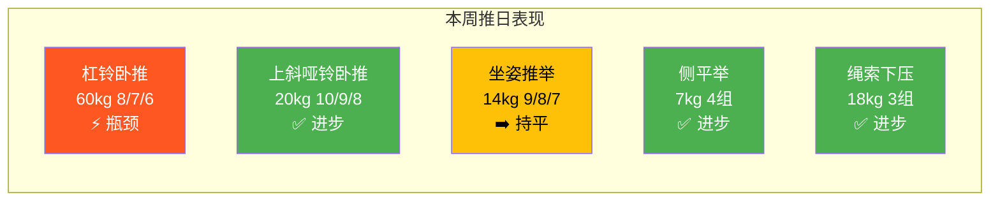

## 七、推日训练日志示例

上一节我们系统讲解了训练日志的重要性、记录方法和分析技巧。本节提供一份**完整的推日训练日志范本**，展示一份合格的训练记录应该长什么样。你可以直接复制这个模板，填入自己的数据使用。

> **使用说明**：本日志以一名训练约3个月的新手为例，体重67kg，目标为增肌减脂同步进行（体态重组）。数据基于PPL计划中推日的标准动作编排（详见第2.1节）。日期以"2024-XX-XX"标注，你在使用时替换为实际日期即可。

---

### 7.1 完整训练日志

#### 基本信息

日期：2024-XX-XX（周一）
训练日类型：推日A（力量日）
训练地点：XX健身房
训练搭档：无（独自训练）

#### 训练前状态评估

| 评估项 | 记录 | 说明 |
|--------|------|------|
| 昨晚睡眠 | 6.5小时，中途醒了一次 | 睡眠不足，可能影响训练表现 |
| 起床精神状态 | 中等偏下 | 工作压力较大 |
| 训练前餐 | 鸡胸肉150g + 米饭200g（训练前1.5小时） | 碳水和蛋白质摄入充足 |
| 训练前补剂 | 黑咖啡200ml（训练前30分钟） | 咖啡因约100mg，提神效果 |
| 身体状态 | 左肩轻微酸痛（昨天推举后残留），无明显疼痛 | 注意热身时加强肩袖激活 |
| 晨起体重 | 67.2kg | 每周记录一次，趋势比单次数据更重要 |

#### 热身记录（12分钟）

热身是正式训练的前奏，直接影响后续训练质量和受伤概率。以下是本次推日热身的完整记录：

| 顺序 | 动作 | 执行情况 | 身体反馈 |
|------|------|----------|----------|
| 1 | 原地慢跑 | 2分钟 | 体温上升，微微出汗 |
| 2 | 弹力带外旋 | 2×15/侧 | 左肩激活感明显，酸痛减轻 |
| 3 | 猫牛式 | 10次 | 胸椎活动度改善 |
| 4 | 俯卧撑Plus | 2×10 | 前锯肌有感觉，肩胛稳定 |
| 5 | 空杆卧推 | 20kg × 15次 | 动作流畅，无不适 |
| 6 | 渐进负重热身 | 40kg × 8 → 50kg × 5 | 逐渐进入状态，最后一组感觉有力 |

> **热身小结**：左肩热身后酸痛基本消失，可以正常训练。如果热身后肩部仍有明显不适，应考虑将杠铃卧推替换为哑铃卧推或器械卧推以降低肩关节压力。

---

#### 主训练记录

以下表格记录了本次推日7个正式动作的完整数据。每组分别记录重量（kg）× 次数，并标注RPE值。

| 顺序 | 动作 | 组1 | 组2 | 组3 | 组4 | 组间休息 | 备注 |
|------|------|-----|-----|-----|-----|----------|------|
| 1 | 杠铃平板卧推 | 60×8 RPE7 | 60×7 RPE8 | 60×6 RPE9 | — | 3分钟 | 第3组最后1次有轻微卡顿，需要0.5秒停顿才能推起 |
| 2 | 上斜哑铃卧推（30°） | 20×10 RPE7 | 20×9 RPE8 | 20×8 RPE8.5 | — | 2分钟 | 左右同步性良好，上胸拉伸感明显 |
| 3 | 坐姿哑铃推举 | 14×9 RPE7 | 14×8 RPE8 | 14×7 RPE9 | — | 2分钟 | 第3组腰部有轻微弓起，下次注意核心收紧 |
| 4 | 哑铃侧平举 | 7×15 RPE7 | 7×14 RPE8 | 7×12 RPE8.5 | 7×12 RPE9 | 60秒 | 最后两组斜方肌有代偿感，说明中束已经力竭 |
| 5 | 绳索夹胸（高位到低位） | 15×15 RPE7 | 15×13 RPE8 | 15×12 RPE8.5 | — | 60秒 | 挤压感良好，胸肌下沿有明显收缩 |
| 6 | 绳索下压 | 18×13 RPE7 | 18×12 RPE8 | 18×10 RPE9 | — | 60秒 | 大臂全程贴紧身体，动作质量良好 |
| 7 | 过头臂屈伸 | 12×11 RPE8 | 12×10 RPE9 | — | — | 60秒 | 三头肌已接近力竭，长头拉伸感强烈 |

---

#### 训练数据汇总

| 统计项 | 数值 |
|--------|------|
| 正式组总数 | 20组 |
| 总训练时长（不含热身和放松） | 52分钟 |
| 含热身和放松的总时长 | 68分钟 |
| 主观疲劳度（整体） | 7/10 |
| 最高质量动作 | 绳索夹胸（挤压感最强） |
| 最弱环节 | 杠铃卧推第3组掉次数明显 |

---

#### 训练后放松记录（8分钟）

| 顺序 | 动作 | 时长 | 说明 |
|------|------|------|------|
| 1 | 胸肌门框拉伸 | 30秒/侧 × 2 | 胸肌和三角肌前束拉伸 |
| 2 | 三头肌过头拉伸 | 30秒/侧 | 三头肌长头拉伸 |
| 3 | 肩部交叉拉伸 | 30秒/侧 | 三角肌后束拉伸 |
| 4 | 婴儿式呼吸 | 2分钟 | 10次深呼吸，副交感神经激活，加速恢复 |
| 5 | 泡沫轴胸椎滚压 | 2分钟 | 改善胸椎灵活性，缓解卧推带来的胸椎压力 |

---

#### 训练后营养补充

训练后30分钟内：
  - 乳清蛋白 1勺（约25g蛋白质）+ 300ml水
  - 香蕉 1根（约27g碳水）
  
训练后正餐（约1.5小时后）：
  - 牛肉200g + 糙米饭250g + 西兰花150g

> 训练后30-60分钟是蛋白质合成速率最高的窗口期，及时补充蛋白质和碳水可以最大化肌肉修复效率。详见基础理论部分的运动营养学章节。

---

#### 本次训练总结

**进步点**：
- 上斜哑铃卧推比上周增加2.5kg（上周17.5kg → 本周20kg），且能完成3×10/9/8，说明上胸力量在增长
- 侧平举能稳定完成4组，上周第4组只做了10次，本周做到了12次
- 绳索下压的重量保持不变但次数增加了1-2次/组，三头肌耐力在提升

**问题点**：
- 杠铃卧推第3组掉到6次（目标8次），连续两周出现相同情况。可能原因：(1) 睡眠不足（昨晚只有6.5小时）；(2) 卧推重量处于瓶颈期；(3) 热身时间可以再延长1-2分钟
- 坐姿推举第3组腰部弓起，说明核心疲劳或重量偏大

**下次调整计划**：
1. 杠铃卧推：下周尝试60kg做4×6（增加1组但降低每组目标次数），先稳定住60kg的容量再考虑加重
2. 坐姿推举：下周保持14kg，但每组多注意核心收紧，如果还是弓腰就降到12kg
3. 确保训练前睡眠达到7小时以上——这可能是今天状态不佳的主要原因

**整体训练质量评分**：7/10

---

### 7.2 与上次推日的对比分析

训练日志的真正价值在于**对比**。以下展示如何将本次训练与上周同类型训练进行对比，从中提取可执行的训练决策。

#### 动作进步对比表

| 动作 | 上周（XX-XX） | 本周（XX-XX） | 变化 | 判定 |
|------|--------------|--------------|------|------|
| 杠铃卧推 | 60×8/7/5 | 60×8/7/6 | 第3组+1次 | 小幅进步 |
| 上斜哑铃卧推 | 17.5×10/9/8 | 20×10/9/8 | +2.5kg | 明显进步 |
| 坐姿哑铃推举 | 14×9/8/7 | 14×9/8/7 | 持平 | 维持 |
| 哑铃侧平举 | 7×15/14/12/10 | 7×15/14/12/12 | 第4组+2次 | 小幅进步 |
| 绳索夹胸 | 15×14/13/12 | 15×15/13/12 | 第1组+1次 | 小幅进步 |
| 绳索下压 | 18×12/11/9 | 18×13/12/10 | 每组+1次 | 稳定进步 |
| 过头臂屈伸 | 12×10/9 | 12×11/10 | 每组+1次 | 稳定进步 |

#### 趋势分析



**读图方法**：绿色 = 有进步，黄色 = 持平，橙色 = 停滞或退步。当某个动作连续2-3周出现橙色标记时，就需要针对性调整（详见第5节"训练计划的渐进调整"）。

#### 基于对比的决策逻辑

| 情况 | 判断 | 下一步行动 |
|------|------|-----------|
| 连续2周进步 | 当前策略有效 | 继续执行，考虑小幅加重 |
| 连续2周持平 | 可能遇到瓶颈 | 检查恢复因素（睡眠、饮食、压力），考虑调整容量或强度 |
| 连续2周退步 | 过度训练或恢复不足 | 减量一周（减少20-30%容量），排查伤病风险 |
| 突然大幅进步 | 可能是状态好 | 下次不要急于加更多，先稳定1-2周再加重 |
| 某个动作持续落后 | 该肌群薄弱 | 增加该动作的训练容量或频率 |

---

### 7.3 RPE记录详解：如何精确评估每次训练的强度

在上面的日志中，每组都标注了RPE值。新手往往对RPE的判断不准确——要么过于保守（什么都打RPE 6），要么过于激进（做完了就是RPE 10）。以下是本次训练中几个典型RPE判断的详细分析，帮你校准自己的RPE感知。

#### RPE校准实例

| 动作与组数 | 实际表现 | RPE判定 | 判定依据 |
|-----------|---------|---------|---------|
| 卧推 60×8（第1组） | 8次全部完成，节奏稳定，最后1次速度稍有下降 | RPE 7 | 还能再做3次，但最后1次已经需要集中注意力 |
| 卧推 60×7（第2组） | 7次完成，第6次开始明显减速 | RPE 8 | 假设再做1次没问题，第2次就很勉强了 |
| 卧推 60×6（第3组） | 6次完成，第6次有0.5秒停顿才能推起 | RPE 9 | 再做1次大概率失败，属于"差点力竭" |
| 侧平举 7×15（第1组） | 15次完成，最后3次有轻微借力 | RPE 7 | 降低1-2kg能做18次，当前重量留有余量 |
| 侧平举 7×12（第4组） | 12次完成，最后2次斜方肌代偿明显 | RPE 9 | 中束已经力竭，身体在用其他肌群代偿 |

#### RPE常见误判与纠正

| 误判 | 表现 | 纠正方法 |
|------|------|----------|
| **"做完了就是RPE 10"** | 做完8次就打RPE 10，实际上最后1次速度依然很快 | RPE 10意味着"再做1次100%失败"。如果最后1次还能匀速完成，最多RPE 8-9 |
| **"每次都打RPE 7"** | 出于保守心理，不愿意承认已经很累了 | 如果第2组比第1组少做了2次，第2组的RPE一定比第1组高 |
| **"忽略组间差异"** | 3组都打同一个RPE值 | 随着疲劳累积，同样次数的RPE会逐组升高（同重量同次数，第3组比第1组更难） |
| **"用别人的RPE标准"** | 看到别人60kg做10次很轻松，觉得自己做8次也不该是RPE 8 | RPE是**主观**的——你的RPE 8和他的RPE 8对应的绝对重量可能完全不同 |

#### 如何校准你的RPE感知

训练前3个月，建议用以下方法练习RPE判断：

1. **力竭测试法**：选一个中等重量（如侧平举7kg），做到真正力竭（RPE 10），记录总次数。然后对比你平时做15次时的感觉——如果你平时做15次就停了但实际能做20次，说明你平时的RPE判定偏高（你以为RPE 9，实际只有RPE 7）

2. **速度观察法**：每次训练用手机录1-2组关键动作。回放时看最后一次的速度——如果和第1次速度差不多，说明RPE最多7；如果明显减速但还能动，RPE 8-9；如果几乎停住才勉强推起，RPE 9.5-10

3. **保留次数自测**：每组做完后，停顿5秒，然后问自己"刚才还能做几个？"。如果答案是"2个左右"，那就是RPE 8。通过反复练习，你的RPE感知会越来越准确

---

### 7.4 不同训练阶段的日志差异

上面的示例是针对新手阶段（0-6个月）的推日日志。随着训练水平提升，日志的记录重点会发生变化：

| 训练阶段 | 日志侧重点 | 额外需要记录的内容 |
|----------|-----------|-------------------|
| **新手期（0-6个月）** | 确保每次训练有进步（重量或次数增加） | 基本数据即可：动作、重量、次数、RPE |
| **中级期（6-24个月）** | 追踪周训练容量变化，管理疲劳累积 | 增加：睡眠评分、训练前能量水平、各肌群周容量统计 |
| **高级期（2年以上）** | 周期化训练数据对比，微调训练变量 | 增加：每日晨起心率、HRV、压力评分、体重趋势、围度变化 |

#### 新手期日志的核心目标

新手期的日志不需要太复杂。你只需要确保一件事：**这次比上次多做了**。

上周：60kg × 8/7/5
本周：60kg × 8/7/6  ← 第3组多做了1次，进步！

如果你连续3次训练都在60kg做3×8：
下周应该尝试62.5kg × 6/6/6（加重但减少次数）
再下周：62.5kg × 7/6/6（保持重量，增加次数）
再下周：62.5kg × 7/7/6
……逐步回到3×8，然后再次加重

这就是**双渐进法（Double Progression）**——先在固定重量下增加次数，次数达标后再加重并重新从低次数开始。训练日志是你执行双渐进法的核心工具。

#### 中级期日志需要增加的内容

进入中级期后，单次训练日志已经不够，你需要**周维度的数据汇总**：

## 本周推日汇总（第12周）

本周推日总容量：
  胸：卧推 60×(8+7+6) + 上斜哑铃 20×(10+9+8) + 绳索夹胸 15×(15+13+12) 
     = 126 + 81 + 120 = 327 次×kg ≈ 有效容量19组
  
  肩：推举 14×(9+8+7) + 侧平举 7×(15+14+12+12) 
     = 105 + 77 = 182 次×kg ≈ 有效容量7组
  
  三头：下压 18×(13+12+10) + 过头臂屈伸 12×(11+10) 
      = 195 + 132 = 327 次×kg ≈ 有效容量5组

与上周对比：胸+5%，肩持平，三头+8%

这种周容量追踪可以帮你发现：哪些肌群进步了，哪些需要增加训练量。

---

### 7.5 常见问题：日志记录中的典型错误

即使知道了应该记什么，很多人在实际执行中仍会犯以下错误：

| 错误类型 | 具体表现 | 为什么是问题 | 正确做法 |
|----------|---------|-------------|----------|
| **记录过于简略** | 只写"卧推60kg"，不写次数和组数 | 无法判断训练强度和容量，日志失去分析价值 | 每组分别记录重量×次数+RPE |
| **只记成功的组** | 加重失败的那组不记，只记减回去后成功的数据 | 掩盖了真实的能力边界，导致计划失真 | 如实记录所有组，包括失败组 |
| **训练后再补记** | 训练结束回家后凭记忆补日志 | 次数和RPE会严重失真，尤其是后面的动作 | 组间休息时立刻记录，养成习惯 |
| **从不回看日志** | 记了但从不翻看之前的记录 | 日志的价值在于对比和分析，不回看等于白记 | 每次训练前花1分钟看上次同类型训练的记录 |
| **一次记录太多** | 试图记录每组的心率、呼吸次数、动作速度等 | 坚持不了一周就放弃 | 只记核心数据（重量、次数、RPE），有余力再加 |
| **忽略定性记录** | 只有数字，没有"感觉怎么样"的描述 | 数字无法反映训练质量——同样的3×8可能是轻松的也可能是拼尽全力的 | 每次训练写2-3句总结 |

---

### 7.6 日志模板下载与使用

以下是一个可以直接复制使用的空白模板。填入你自己的数据，每次训练后保存：

```markdown
## YYYY-MM-DD | 推日（力量日/容量日）

**状态**：睡眠 __h | 体重 __kg | 身体状态 ____
**训练时长**：__分钟（含热身） | 疲劳度 __/10

### 热身（__分钟）
| 顺序 | 动作 | 执行情况 |
|------|------|----------|
| 1 | 原地慢跑 | 2分钟 |
| 2 | 弹力带外旋 | 2×15/侧 |
| 3 | 猫牛式 | 10次 |
| 4 | 俯卧撑Plus | 2×10 |
| 5 | 空杆卧推 | 15次 |
| 6 | 渐进负重热身 | 2-3组 |

### 主训练
| 顺序 | 动作 | 组1 | 组2 | 组3 | 组4 | 休息 | 备注 |
|------|------|-----|-----|-----|-----|------|------|
| 1 | 杠铃平板卧推 | __×__ RPE_ | __×__ RPE_ | __×__ RPE_ | — | 3min | |
| 2 | 上斜哑铃卧推 | __×__ RPE_ | __×__ RPE_ | __×__ RPE_ | — | 2min | |
| 3 | 坐姿哑铃推举 | __×__ RPE_ | __×__ RPE_ | __×__ RPE_ | — | 2min | |
| 4 | 哑铃侧平举 | __×__ RPE_ | __×__ RPE_ | __×__ RPE_ | __×__ RPE_ | 60s | |
| 5 | 绳索夹胸 | __×__ RPE_ | __×__ RPE_ | __×__ RPE_ | — | 60s | |
| 6 | 绳索下压 | __×__ RPE_ | __×__ RPE_ | __×__ RPE_ | — | 60s | |
| 7 | 过头臂屈伸 | __×__ RPE_ | __×__ RPE_ | — | — | 60s | |

### 放松（__分钟）
（静态拉伸 + 呼吸调整）

### 总结
进步点：
问题点：
下次调整：
整体评分：__/10
```

---

### 7.7 本节要点回顾

| 要点 | 说明 |
|------|------|
| **日志是训练的"GPS"** | 没有日志你就不知道自己在哪、要去哪、走了多远 |
| **每次组分别记录** | 写"60×8/7/6"而不是"60kg 3组"——细节决定分析价值 |
| **RPE必须标注** | 同样的3×8，RPE 7和RPE 9代表完全不同的训练强度 |
| **训练前回看上次记录** | 1分钟的习惯，确保每次训练都有明确目标 |
| **对比是日志的核心价值** | 单次记录没意义，连续记录的对比才能指导训练决策 |
| **定性与定量同等重要** | 数字告诉你"做了什么"，文字告诉你"感觉怎么样"和"为什么" |
| **从简开始，逐步完善** | 新手只记重量+次数+RPE就够了，有余力再加睡眠、状态等 |
