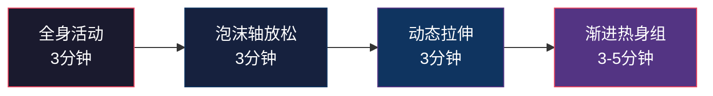

## 七、热身与放松

很多训练者把热身和放松当作"可选环节"——时间紧就跳过，心情好才做两下。这种态度是受伤和恢复缓慢的根源。热身不是浪费时间，它是训练的"第一组"；放松不是可有可无，它是训练的"最后一组"。本章从生理机制出发，给出可直接执行的热身与放松方案，覆盖训练前、训练后、休息日三个场景。

### 7.1 为什么热身不可跳过

#### 7.1.1 热身的生理效应

热身的本质是让身体从"静息状态"平稳过渡到"运动状态"。具体生理变化包括：

| 效应 | 机制 | 对训练的影响 |
|------|------|-------------|
| 体温升高 | 肌肉产热增加，核心温度上升0.5-1°C | 肌肉弹性提升，收缩速度加快 |
| 血流量增加 | 心输出量从5L/min升至15-20L/min | 氧气和营养物质输送加速 |
| 滑液分泌 | 关节腔内滑液增多 | 关节活动更顺畅，磨损减少 |
| 神经激活 | 运动神经元募集效率提升 | 力量输出更精准，反应更快 |
| 心理准备 | 注意力集中，唤醒水平提升 | 动作质量更高，受伤风险降低 |

研究数据：2015年《Journal of Strength and Conditioning Research》的一项meta分析显示，充分热身可以降低运动损伤风险约30%，并提升力量表现3-5%。

#### 7.1.2 不热身的代价

跳过热身直接上大重量的常见后果：

- **肌肉拉伤**：冷肌肉的弹性差，突然承受高负荷容易撕裂肌纤维
- **关节损伤**：滑液不足时，关节面直接摩擦，长期累积导致软骨磨损
- **动作变形**：神经未激活状态下，动作协调性差，代偿模式启动
- **表现下降**：第一组实际变成了"热身组"，浪费了有效训练量

> 对于PPL训练来说，推日涉及的肩关节、拉日涉及的肘关节和腕关节、蹲日涉及的髋关节和膝关节，都是高发损伤部位。每个部位都需要针对性热身。

### 7.2 训练前热身方案（10-15分钟）

热身遵循"由整体到局部、由低强度到高强度"的原则，分为四个阶段。

#### 第一阶段：全身活动（3分钟）

目的：提升心率和体温，让血液流向四肢。

**标准流程：**

| 动作 | 时间 | 要点 |
|------|------|------|
| 原地慢跑 | 60秒 | 膝盖微抬，手臂自然摆动，呼吸平稳 |
| 开合跳 | 60秒 | 落地时膝盖微屈缓冲，不要直腿落地 |
| 高抬腿 | 30秒 | 大腿抬至与地面平行，核心收紧 |
| 臀桥 | 30秒 | 慢起慢落，顶端夹紧臀部停留1秒 |

**替代方案（关节不适者）：**

- 膝盖不好：用椭圆机或划船机替代慢跑和开合跳
- 肩膀不适：开合跳改为不举手的版本
- 脚踝不适：高抬腿改为坐姿腿屈伸

#### 第二阶段：泡沫轴放松（3分钟）

目的：消除肌肉中的"结节"（肌筋膜粘连点），恢复肌肉的正常滑动能力。

**关键原则：**

- 每个目标肌群滚动60-90秒
- 找到痛点（trigger point）时停留15-20秒，不要快速来回滚
- 速度要慢——每秒移动约1厘米
- 呼吸不要憋气，保持深长呼吸

**按训练日的泡沫轴方案：**

| 训练日 | 重点区域 | 具体操作 |
|--------|---------|----------|
| 推日（胸/肩/三头） | 胸椎、胸大肌、三角肌前束 | 仰卧将泡沫轴放在上背部，双手抱头后仰伸展胸椎；侧卧滚压胸大肌 |
| 拉日（背/二头） | 背阔肌、菱形肌、肱二头肌 | 侧卧滚压背阔肌；俯卧将泡沫轴横放在肩胛骨之间滚压菱形肌 |
| 腿日（股四/臀/腿后） | 股四头肌、髂胫束、臀肌、腘绳肌 | 俯卧滚压股四头肌；侧卧滚压髂胫束；坐姿滚压臀肌和腘绳肌 |

**泡沫轴选择建议：**

| 类型 | 适合人群 | 优缺点 |
|------|---------|--------|
| 低密度EPE泡沫轴 | 初学者、肌肉敏感者 | 温和不痛，但效果有限 |
| 高密度EVA泡沫轴 | 有经验者 | 压力适中，性价比高 |
| 狼牙棒（凸点泡沫轴） | 进阶者 | 深层刺激，但新手容易过度疼痛 |
| 振动泡沫轴 | 预算充足者 | 自动振动辅助松解，效率高 |

> 如果没有泡沫轴，可以用网球或筋膜球替代，对小肌群（如足底、肩袖）效果甚至更好。大肌群可以用擀面杖在腿上来回滚。

#### 第三阶段：动态拉伸（3分钟）

目的：提升关节活动度（ROM），激活稳定肌群。

**为什么训练前不要做静态拉伸？**

2014年《Scandinavian Journal of Medicine & Science in Sports》的研究表明，训练前做静态拉伸会降低力量输出约5-7%，因为静态拉伸会暂时降低肌肉的刚度（stiffness），影响力量传递效率。动态拉伸则相反——它通过运动幅度的逐步扩大来提升活动度，同时保持肌肉的弹性反应能力。

**通用动态拉伸动作库：**

| 动作 | 目标部位 | 次数 | 要点 |
|------|---------|------|------|
| 腿摆（前后） | 髋屈肌、腘绳肌 | 每侧15次 | 扶墙保持平衡，摆动幅度逐步加大 |
| 腿摆（左右） | 内收肌、外展肌 | 每侧15次 | 躯干保持正对前方，不要扭转 |
| 世界最伟大拉伸 | 全身链 | 每侧5次 | 弓步→同侧肘触地→旋转上肢→向上伸展 |
| 猫牛式 | 脊柱 | 10次 | 四点跪姿，交替弓背和塌腰，配合呼吸 |
| 肩环绕 | 肩关节 | 前后各10次 | 手臂伸直，画圆幅度逐步加大 |
| 髋环绕 | 髋关节 | 每侧10次 | 单腿站立，另一腿画大圈 |
| 胸椎旋转 | 胸椎 | 每侧8次 | 侧卧，上方手臂展开跟随旋转 |

**按训练日的动态拉伸重点：**

- **推日**：重点做肩环绕、胸椎旋转、手腕环绕（腕关节在推的动作中承受大量压力）
- **拉日**：重点做猫牛式、肩环绕、手臂悬挂（如果能抓到单杠，悬吊20-30秒放松肩关节）
- **腿日**：重点做腿摆（前后左右）、髋环绕、脚踝环绕

#### 第四阶段：渐进热身组（3-5分钟）

目的：用逐渐增加的负荷"预演"正式组的动作模式，让神经系统学会正确发力。

**热身组设计规则：**

- 第1组：空杆或极轻重量 × 15次（感受动作路径）
- 第2组：正式组重量的40% × 10次
- 第3组：正式组重量的60% × 5次
- 第4组：正式组重量的80% × 3次
- 休息：热身组之间休息60秒即可

**示例：推日卧推热身组**

假设正式组目标重量为60kg：

| 热身组 | 重量 | 次数 | 休息 | 目的 |
|--------|------|------|------|------|
| 1 | 空杆(20kg) | 15 | 60秒 | 激活胸肌发力模式，感受杠铃轨迹 |
| 2 | 25kg | 10 | 60秒 | 逐步增加负荷，关节适应 |
| 3 | 35kg | 5 | 60秒 | 接近正式重量，神经系统激活 |
| 4 | 50kg | 3 | 90秒 | 最后一次预演，信心建立 |

**热身组的常见错误：**

1. **热身组做太多**：热身不是训练，不要做到力竭。热身组应该"轻松且专注"
2. **热身组做太少**：只做一组空杆就跳到大重量，神经系统没有充分激活
3. **热身速度太快**：快速做完热身组等于没热身，每一下都要有控制
4. **忽视第一个动作的热身**：第一个复合动作（卧推/深蹲/硬拉）需要最完整的热身；后面的孤立动作可以减少热身组

> 如果训练馆人多，排队等深蹲架时，可以先做前三阶段的热身，到你的时候直接做热身组。

### 7.3 训练后放松方案（10分钟）

训练后的放松同样重要。它不仅帮助肌肉恢复，还激活副交感神经系统，让身体从"战斗模式"切换到"恢复模式"。

#### 7.3.1 静态拉伸（5分钟）

训练后是做静态拉伸的最佳时机——肌肉温度高、血流量大，拉伸效果最好。

**操作规范：**

- 每个目标肌群拉伸30-60秒（不是15秒、不是"感觉一下"）
- 拉伸到"有牵拉感但不痛"的程度（疼痛强度约4-5/10）
- 保持呼吸平稳，不要憋气
- 如果拉伸过程中牵拉感减弱，可以轻轻加深幅度
- 不要弹震式拉伸（bouncing），那会触发牵张反射，适得其反

**按训练日的静态拉伸方案：**

**推日后（胸/肩/三头）：**

| 动作 | 目标肌群 | 保持时间 | 具体操作 |
|------|---------|----------|----------|
| 门框胸肌拉伸 | 胸大肌 | 每侧30秒 | 手臂放在门框上，身体前倾 |
| 跨体肩拉伸 | 三角肌后束 | 每侧30秒 | 一只手臂横过胸前，另一只手压住肘部 |
| 头后三头拉伸 | 肱三头肌 | 每侧30秒 | 手臂举过头顶弯曲，另一只手下压肘部 |
| 手腕屈肌拉伸 | 前臂 | 每侧20秒 | 伸直手臂，掌心朝外，另一只手拉手指向后 |

**拉日后（背/二头）：**

| 动作 | 目标肌群 | 保持时间 | 具体操作 |
|------|---------|----------|----------|
| 婴儿式 | 背阔肌、竖脊肌 | 60秒 | 跪姿，臀部坐脚跟，手臂前伸贴地 |
| 猫式弓背 | 菱形肌、斜方肌 | 30秒 | 四点跪姿，最大程度弓背 |
| 二头肌门框拉伸 | 肱二头肌 | 每侧30秒 | 手掌朝上抓住门框，身体前倾 |
| 坐姿前屈 | 腰背部整体 | 45秒 | 双腿伸直坐地，尽量够脚尖 |

**腿日后（股四/臀/腿后）：**

| 动作 | 目标肌群 | 保持时间 | 具体操作 |
|------|---------|----------|----------|
| 站姿股四拉伸 | 股四头肌 | 每侧30秒 | 单腿站立，手抓脚踝拉向臀部 |
| 坐姿前屈 | 腘绳肌 | 45秒 | 双腿伸直，手够脚尖 |
| 鸽子式 | 臀肌、梨状肌 | 每侧45秒 | 前腿屈膝横放，后腿伸直，上身前倾 |
| 蝴蝶式 | 内收肌 | 45秒 | 坐姿，脚掌相对，膝盖下压 |
| 股四头肌卧姿拉伸 | 股直肌 | 每侧30秒 | 侧卧，抓脚踝拉向臀部 |

#### 7.3.2 泡沫轴深度放松（3分钟）

训练后的泡沫轴可以比训练前更深入——肌肉已经热透，可以施加更大压力。

**训练后泡沫轴的重点：**

- 训练中感觉特别紧张的肌群，额外花时间
- 每个区域90-120秒（比训练前更长）
- 可以使用更硬的泡沫轴或狼牙棒
- 配合深呼吸，每滚动一次呼气一次

**常见紧张区域及处理：**

| 区域 | 紧张表现 | 处理方法 |
|------|---------|----------|
| 髂胫束（IT Band） | 膝盖外侧不适 | 侧卧滚压，从髋到膝上方，避开膝关节 |
| 胸椎 | 圆肩加重 | 泡沫轴横放肩胛骨下方，双手抱头后仰 |
| 腘绳肌 | 坐久了僵硬 | 坐姿滚压，单腿加压效果更好 |
| 小腿 | 跑步后酸痛 | 从跟腱到膝盖下方，旋转小腿调整角度 |
| 足底 | 脚底酸痛 | 网球踩在脚下来回滚压 |

#### 7.3.3 呼吸练习（2分钟）

训练后的呼吸练习激活副交感神经系统，帮助身体从"战斗或逃跑"模式切换到"休息和消化"模式。这不是玄学——有明确的神经生理学机制。

**4-7-8 呼吸法：**

1. 用鼻子吸气4秒（腹部膨胀，不是胸部抬起）
2. 屏住呼吸7秒
3. 用嘴缓慢呼气8秒（嘴唇微张，发出"呼"的声音）
4. 重复5个循环

**为什么延长呼气时间有效？**

呼气时迷走神经被激活，迷走神经是副交感神经系统的主干。呼气时间越长，副交感神经激活程度越高，心率下降越快。这就是为什么很多冥想和瑜伽练习都强调"延长呼气"。

**箱式呼吸（Box Breathing）替代方案：**

如果你觉得4-7-8太复杂，可以用更简单的箱式呼吸：
- 吸气4秒 → 屏气4秒 → 呼气4秒 → 屏气4秒
- 重复5个循环

### 7.4 休息日的活动性训练

休息日不是"躺着不动日"。完全静止会导致肌肉僵硬、关节活动度下降、血液循环减慢，反而延长恢复时间。低强度的活动性训练（active recovery）能加速废物代谢、维持关节健康。

#### 7.4.1 休息日活动方案（选择1-2项）

| 活动 | 时间 | 强度 | 适用场景 | 注意事项 |
|------|------|------|---------|----------|
| 泡沫轴全身放松 | 15-20分钟 | 低 | 所有人必做 | 配合舒缓音乐，不要急 |
| 瑜伽/拉伸 | 20-30分钟 | 低-中 | 活动度差者 | 选择"恢复性瑜伽"而非"力量瑜伽" |
| 散步 | 30-60分钟 | 低 | 所有人 | 户外散步还有日晒（维生素D）的好处 |
| 轻度游泳 | 20-30分钟 | 低-中 | 关节不好者 | 水的浮力减轻关节负荷，非常适合膝盖不好者 |
| 骑自行车 | 20-30分钟 | 低-中 | 有骑行条件者 | 阻力调低，以轻松踩踏为主 |

#### 7.4.2 休息日泡沫轴全身放松流程

这是所有训练者都应该在休息日做的事情，以下是完整的20分钟流程：

**下半身（10分钟）：**

1. 小腿（腓肠肌+比目鱼肌）：每侧90秒
2. 腘绳肌：每侧90秒
3. 股四头肌：每侧90秒
4. 臀肌：每侧60秒
5. 髂胫束：每侧60秒

**上半身（10分钟）：**

1. 背阔肌：每侧60秒
2. 竖脊肌（沿脊柱两侧）：60秒
3. 胸椎：60秒
4. 胸大肌：每侧60秒
5. 三角肌/肩袖：每侧30秒

#### 7.4.3 休息日的主动恢复心理建设

很多训练者（尤其是初学者）对休息日有负罪感——"今天没练，是不是在退步"。这种心态需要纠正：

- **肌肉是在休息时生长的**：训练造成肌纤维微损伤，睡眠和营养提供修复材料，休息时间完成修复和超量恢复
- **过度训练的风险**：不休息=持续破坏=慢性疲劳=进步停滞甚至退步
- **神经系统的恢复**：中枢神经系统的疲劳比肌肉更隐蔽，也更难恢复。连续高强度训练3-4周后，必须安排减载周（deload week）

> 判断是否需要休息的简单标准：如果连续两天训练状态明显下降（同等重量做不了同样的次数），说明你需要休息了。

### 7.5 不同场景的热身与放松调整

#### 7.5.1 时间极度紧张时（只有5分钟）

如果某天真的只有5分钟，按以下优先级执行：

1. **热身**：跳过泡沫轴，做2分钟动态拉伸（重点针对当天训练肌群）+ 2组热身组（空杆×10 + 50%×5）
2. **放松**：只做训练中最紧张的2个肌群的静态拉伸，每个30秒

**底线原则**：宁可缩短正式训练时间，也不要跳过热身。5分钟热身可以防止让你休息2周的伤病。

#### 7.5.2 早晨训练时

早晨体温最低，肌肉和关节最僵硬。需要更长的热身时间（15-20分钟）：

- 先洗个热水澡或热敷紧张部位（2-3分钟）
- 全身活动阶段延长到5分钟
- 热身组多做一组（例如空杆×20）
- 第一组正式组的重量可以比平时轻5-10%

#### 7.5.3 高强度训练日（大重量日/PR日）

冲击个人记录（PR）的日子，热身要更充分：

- 全套15分钟热身流程不做删减
- 热身组增加到5-6组，最后一个热身组做到正式组重量的90%×1-2次
- 组间休息延长到2-3分钟（让神经系统完全恢复）
- 正式组前做一个"心理预演"：闭眼想象完美完成动作的画面

#### 7.5.4 感觉疲劳时

如果某天走进健身房就觉得疲惫（不是懒，是真疲劳），调整策略：

- 延长热身到15分钟，用低强度全身活动唤醒身体
- 如果做完热身仍然很疲惫，考虑将当天改为轻量恢复训练或直接休息
- 训练后延长放松到15分钟，重点做呼吸练习

### 7.6 常见误区与纠正

| 误区 | 为什么错 | 正确做法 |
|------|---------|----------|
| 训练前做长时间静态拉伸 | 降低力量输出5-7%，增加关节不稳定性 | 训练前只做动态拉伸，静态拉伸放在训练后 |
| 热身时做到力竭 | 消耗了正式训练的能量储备 | 热身组应该是"轻松且专注"，RPE≤4 |
| 用弹震式拉伸 | 触发牵张反射，反而让肌肉更紧张 | 缓慢、平稳地拉伸，有控制地加深 |
| 只热身不放松 | 肌肉长期处于紧张状态，灵活性下降 | 热身和放松是训练的两个端，缺一不可 |
| 休息日完全不动 | 血液循环差，代谢废物排出慢，恢复更慢 | 做低强度活动性训练，主动恢复 |
| 痛点用更大的力去碾压 | 可能造成组织损伤 | 痛点停留15-20秒，用可控的压力，配合呼吸 |
| 热身时聊天玩手机 | 注意力分散，热身效果大打折扣 | 热身时专注于身体感受，为训练做好心理准备 |
| 所有训练日用同一套热身 | 不同训练对关节和肌群的要求不同 | 根据当天训练内容调整热身重点 |

### 7.7 进阶：筋膜健康与长期灵活性

#### 7.7.1 筋膜系统简介

筋膜（fascia）是包裹肌肉、骨骼、器官的结缔组织网络。它不是惰性的"包装纸"，而是有丰富神经末梢的感觉器官。筋膜健康直接影响：

- 肌肉的滑动能力（两块相邻肌肉之间能否独立运动）
- 力量传递效率（筋膜粘连=力量传递路径受阻）
- 本体感觉（身体位置感知的精确度）
- 疼痛感知（筋膜中的伤害感受器密度是肌肉的6-10倍）

#### 7.7.2 长期灵活性提升策略

如果发现自己某个关节的活动度长期受限（例如深蹲到底部会弓背、卧推时肩膀抬不起来），需要系统性地改善：

1. **识别限制因素**：是肌肉紧张？关节囊紧？还是神经张力过高？
2. **每天10分钟针对性训练**：在限制动作的底部位置停留（例如深蹲底部停留深蹲），逐渐增加时间和负重
3. **关节活动度训练（CARs）**：每个关节每天做一次最大范围的绕环，维持和提升关节健康
4. **PNF拉伸**：本体感觉神经肌肉促进拉伸——比普通静态拉伸更有效。方法是拉伸→等长收缩6秒→放松→加深拉伸，重复3-4个循环

**CARs（Controlled Articular Rotations）示例：**

- 髋关节CARs：单腿站立，另一腿做最大范围的髋关节绕环（前→外→后→内），每方向5圈
- 肩关节CARs：手臂伸直，做最大范围的肩关节绕环，注意全程保持核心紧张
- 胸椎CARs：四点跪姿，单手放在头后，做最大范围的胸椎旋转

#### 7.7.3 推荐工具清单

| 工具 | 价格范围 | 用途 | 推荐指数 |
|------|---------|------|----------|
| 标准泡沫轴 | 30-80元 | 全身肌筋膜放松 | ★★★★★ |
| 筋膜球/网球 | 10-30元 | 足底、肩袖等小肌群 | ★★★★☆ |
| 狼牙棒 | 50-150元 | 深层肌筋膜松解 | ★★★★☆ |
| 按摩枪 | 200-800元 | 快速局部放松，适合训练间隙 | ★★★★☆ |
| 弹力带 | 20-60元 | 动态拉伸辅助、关节活动度训练 | ★★★★★ |
| 拉伸带 | 30-80元 | 辅助静态拉伸，尤其是腿后侧 | ★★★☆☆ |
| 按摩棒 | 40-100元 | 小腿、前臂的深度放松 | ★★★☆☆ |

### 7.8 本节要点总结

1. **热身是训练的一部分**，不是浪费时间。跳过热身节省的10分钟，可能让你付出休息2周的代价
2. **热身四阶段**：全身活动 → 泡沫轴 → 动态拉伸 → 渐进热身组，总时长10-15分钟
3. **训练前不做静态拉伸**，静态拉伸放在训练后
4. **放松三步骤**：静态拉伸（每肌群30-60秒）→ 泡沫轴 → 呼吸练习
5. **休息日做活动性训练**，不要完全静止
6. **根据训练内容调整热身重点**——推日关注肩和胸椎，拉日关注背和肩袖，腿日关注髋和脚踝
7. **长期投资灵活性**——关节活动度不足会限制力量增长，甚至导致代偿性损伤
