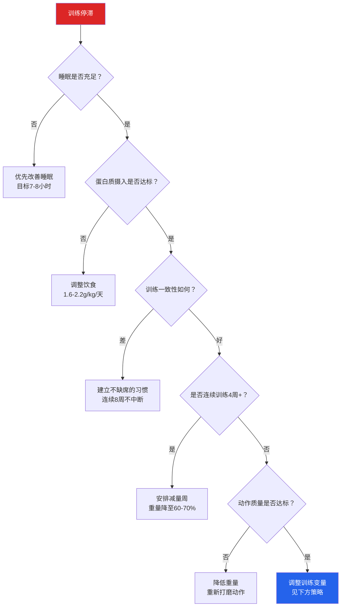

## 八、常见问题解答

在前面七节中，我们从PPL训练分化的选择、详细训练计划的执行、有氧训练的安排、矮个子塑形策略、渐进调整方法、训练日志的记录，到热身与放松的完整流程，构建了一套系统的训练知识体系。但理论到实践之间总有无数细节问题冒出来——这些问题不值得单独成章，却是每个训练者在实际执行中都会遇到的真实困惑。

本节收集了训练中最常见的问题，按主题分类，给出基于科学证据和实践经验的详细回答。建议你在开始训练后的第1个月、第3个月、第6个月各重读一次——随着训练经验增长，同一个问题你可能会读出完全不同的理解。

---

### 训练安排篇

#### Q1：每次训练应该多长时间？

**建议60-75分钟**（不含热身和放松）。完整的一次训练时间拆解如下：

| 环节 | 时长 | 内容 |
|------|------|------|
| 热身 | 10-15分钟 | 全身活动→泡沫轴→动态拉伸→渐进热身组 |
| 主训练 | 40-60分钟 | 6-7个正式动作，严格计时组间休息 |
| 放松 | 5-10分钟 | 静态拉伸→泡沫轴→呼吸练习 |
| **合计** | **55-85分钟** | 超过90分钟通常意味着休息时间过长或动作太多 |

**为什么要控制在75分钟以内？** 有明确的生理学依据：

- **皮质醇上升**：高强度训练超过75分钟后，皮质醇（分解代谢激素）水平显著上升，睾酮/皮质醇比值下降，这会抑制肌肉蛋白合成（MPS），抵消训练带来的合成代谢信号。Morton et al.（2016）的研究发现，训练时长超过90分钟的受试者，其训练后的MPS响应低于60分钟组。
- **注意力下降**：力量训练要求高度的神经肌肉集中。超过75分钟后，注意力显著下降，动作质量开始滑坡——一组动作变形的训练不仅无效，还增加受伤风险。
- **糖原耗竭**：肌糖原是高强度训练的主要燃料。75分钟的中高强度力量训练会消耗约60-70%的肌糖原储备。糖原不足时，力量输出和训练容量都会显著下降。

**实操建议**：用手机计时器设定75分钟倒计时。如果倒计时结束时你还有2-3个动作没做完——说明今天的训练量太大，或者组间休息时间太长。下次训练减少1-2个动作或缩短休息时间。

> 如果你的时间确实充裕（比如周末），可以用节省出来的15分钟做更完整的拉伸和泡沫轴放松，而不是增加更多训练动作。

#### Q2：一个动作做多少组？每次训练总共做多少组？

组数安排遵循"复合优先、孤立补充"的原则：

| 动作类型 | 每动作组数 | 组间休息 | 说明 |
|----------|-----------|----------|------|
| **复合动作**（深蹲、卧推、划船、硬拉、肩推） | 3-5组 | 2-3分钟 | 主力动作，神经和肌肉负荷大，需要充足休息 |
| **辅助复合动作**（上斜卧推、高位下拉、腿举等） | 3组 | 2分钟 | 复合动作的变式，补充特定肌群 |
| **孤立动作**（侧平举、弯举、绳索下压、飞鸟等） | 2-3组 | 60-90秒 | 针对单块肌肉的精细刺激 |

**每次训练总组数建议：**

| 训练阶段 | 总有效组数（不含热身） | 说明 |
|----------|---------------------|------|
| 新手期（第1-4周） | 12-16组 | 学习动作，控制训练量 |
| 适应期（第5-12周） | 16-22组 | 标准训练量 |
| 进阶期（第13周+） | 18-26组 | 根据恢复能力调整 |

**什么是"有效组"？** 有效组（Working Set）是指使用正式训练重量、达到目标RPE的组数。热身组不计入有效组数。例如，你做卧推：空杆×15（热身）、40kg×8（热身）、50kg×5（热身）、60kg×8（有效组）、60kg×7（有效组）、60kg×6（有效组）——这次卧推的有效组数是3组。

**超过26组就一定过度训练吗？** 不一定。训练容量的上限取决于你的恢复能力，而恢复能力受睡眠质量、蛋白质摄入、训练年限、生活压力等因素影响。Schoenfeld et al.（2017）的研究发现，每周每肌群超过20组后，增肌收益趋于平缓甚至下降，但这只是统计平均值。判断标准应该是：如果连续2次训练表现下降，且排除了其他因素（睡眠、营养、压力），那么你的训练量可能超标了。

#### Q3：组间应该休息多久？

组间休息时间不是"感觉差不多了就做下一组"——不同训练目标需要不同的休息时间，差异直接影响训练效果：

| 训练目标 | 重量（%1RM） | 每组次数 | 组间休息 | 生理机制 |
|----------|-------------|---------|---------|---------|
| **最大力量** | 85-100% | 1-5次 | 3-5分钟 | ATP-CP系统完全恢复需要3-5分钟 |
| **肌肥大** | 65-85% | 6-12次 | 1.5-2.5分钟 | 兼顾机械张力和代谢压力 |
| **肌耐力** | <65% | 15+次 | 30-90秒 | 制造代谢压力为主 |

**对PPL训练来说**，你的复合动作（深蹲、卧推、划船）应该休息2-3分钟，孤立动作（侧平举、弯举、绳索下压）休息60-90秒。这是大多数训练日的标准配置。

**休息时间过短的后果**：ATP没有恢复，下一组能做的重量和次数都下降，等于在用疲劳状态做低质量训练。你以为自己在"提高训练密度"，实际上只是在练肌耐力。

**休息时间过长的后果**：虽然力量表现恢复了，但训练时间被拉长，肌肉温度下降，训练的代谢压力降低。更实际的问题是：你可能在等深蹲架的时候刷了10分钟手机。

**实用技巧**：用手机计时器严格计时。复合动作3分钟，孤立动作90秒。你会惊讶地发现，很多人以为的"休息2分钟"实际上休息了4-5分钟。

#### Q4：应该多久换一次训练计划？

这个问题需要区分三个层次：

| 层次 | 更换频率 | 说明 |
|------|---------|------|
| **具体动作** | 除非进步停滞，否则不需要更换 | 动作熟练度是力量增长的基础，频繁更换动作会打断神经适应 |
| **训练参数**（组数、次数、重量范围） | 每4-6周微调 | 同样的3×8做太久，身体适应了刺激，需要变化 |
| **整体计划框架**（PPL vs 其他分化） | 每6-12个月评估一次 | PPL是框架不是固定计划，内部变化空间很大 |

**什么叫"进步停滞"？** 以杠铃卧推为例：如果你连续2次训练都无法在当前重量下达到最低目标次数（比如60kg目标3×6-8，连续2次只能做3×5），且排除了睡眠、营养、压力等因素，那么该动作可能需要调整。

**不换框架的内部调整策略**：

- **改变次数范围**：从3×8变为4×5（力量向）或3×12（容量向）
- **改变动作顺序**：把卧推从第一个动作改为第二个，先做上斜卧推
- **改变动作变式**：用哑铃卧推替代杠铃卧推2-3周
- **改变训练节奏**：从正常节奏变为3秒下放+1秒停顿的节奏
- **改变组间休息**：从3分钟变为2分钟（提高密度）或4分钟（增加强度）

**什么时候真的需要换框架？** 当你在PPL框架内尝试了所有上述调整，仍然连续3个月以上无法进步。这时可以尝试上下肢分化或全身训练，给身体全新的刺激模式。但这通常发生在训练2-3年之后，新手阶段完全不用担心。

#### Q5：可以只做力量训练不做有氧吗？

技术上可以，但**不推荐**。有氧训练的价值远不止"燃烧脂肪"：

| 有氧收益 | 对力量训练的帮助 | 证据 |
|---------|----------------|------|
| **心肺功能提升** | 组间恢复更快，可以承受更高的训练容量 | 2018年《Sports Medicine》综述指出，有氧能力更高的训练者在力量训练中恢复更快 |
| **脂肪代谢能力** | 控制体脂，让肌肉线条更清晰 | 有氧提升线粒体密度，增加脂肪氧化能力 |
| **主动恢复** | 轻度有氧加速代谢废物清除 | 训练后20分钟轻度有氧比完全静止的恢复速度快约15% |
| **心血管健康** | 长期健康的基础 | 不做有氧的力量训练者心血管健康指标（如VO2max）可能低于平均水平 |
| **心理健康** | 额外的内啡肽释放 | 低强度有氧（如散步、骑车）的减压效果非常显著 |

**有氧会"掉肌肉"吗？** 这是力量训练者最常担心的问题。答案是：**在合理安排的前提下，不会**。

所谓的"干扰效应"（Interference Effect）确实存在——同时进行大量有氧和力量训练时，它们的适应信号可能互相干扰。但这个效应只在以下情况显著：

- 每周有氧超过5小时
- 有氧强度较高（如长跑、竞速骑车）
- 有氧安排在力量训练之前

**推荐方案**：每周3-5次，每次20-30分钟的中低强度有氧。安排在力量训练之后或单独的日子。心率控制在最大心率的60-70%（大约是"能说话但不能唱歌"的强度）。详见本节第三章《有氧训练安排》。

---

### 进度与效果篇

#### Q6：训练后多久能看到效果？

这是一个需要分层回答的问题，因为"效果"有不同的衡量维度：

| 效果维度 | 时间线 | 衡量方式 | 说明 |
|---------|--------|---------|------|
| **力量增长** | 2-4周 | 训练日志中的重量和次数 | 新手期神经适应非常快，这是最早出现的变化 |
| **肌肉围度变化** | 8-12周 | 卷尺测量（臂围、胸围、腿围） | 实际测量数据的变化，可能自己照镜子看不出来 |
| **外观变化** | 12-24周 | 自己和他人的观察 | 需要积累足够的肌肉量和体脂变化才能肉眼可见 |
| **体型显著改变** | 6-12个月 | 对比照片 | 最可靠的变化证据——每月同一角度拍一张照片 |
| **体态和气质改变** | 3-6个月 | 走路姿态、站姿、穿衣效果 | 力量训练改善体态的效果往往比肌肉增长更早被注意到 |

**为什么需要这么久？** 肌肉生长是一个缓慢的生物过程。根据McDonald（2009）的总结，自然训练者第一年的合理增肌速率约为每月0.5-1kg纯肌肉。12个月增加6-12kg肌肉，平均分配到全身各肌群，每块肌肉的体积变化其实很小——但累积起来就是显著的体型改变。

**最快的"欺骗"方式**：如果你想在外观上快速看到变化，最有效的方法不是等待肌肉增长，而是**降低体脂率**。一个体重70kg、体脂率22%的人，如果降到15%，外观变化会比增肌3kg更明显。这也是为什么新手期"体态重组"（同时增肌减脂）如此让人惊喜——体重可能没怎么变，但体型完全不同了。

**关键建议**：

1. 拍"基准照片"：训练前在同一光线、同一角度拍正面、侧面、背面照片，每月对比
2. 用卷尺测量：胸围、腰围、臂围、大腿围，每2周测量一次（同一时间、同一状态）
3. 不要每天照镜子：日常照镜子受光线、饮食、水分等因素影响极大，容易产生"没变化"的错觉

#### Q7：为什么我的进步比别人慢？

这个问题的背后其实是"个体差异"这个被严重低估的因素。力量增长的速度受以下变量共同影响：

| 变量 | 影响程度 | 说明 |
|------|---------|------|
| **基因天赋** | ★★★★★ | 肌纤维类型比例、激素水平、骨架大小等，这些你无法控制 |
| **训练年限** | ★★★★★ | 新手进步最快，随年限增加边际收益递减 |
| **训练一致性** | ★★★★☆ | 每周不缺席地完成所有训练，比偶尔"拼一次"重要得多 |
| **蛋白质摄入** | ★★★★☆ | 每天1.6-2.2g/kg体重是增肌的底线 |
| **睡眠质量** | ★★★★☆ | 睡眠不足直接降低睾酮水平和生长激素分泌 |
| **生活压力** | ★★★☆☆ | 高压力状态提升皮质醇，抑制肌肉蛋白合成 |
| **训练年龄** | ★★★☆☆ | 18-35岁的激素环境最有利于增肌 |

**一个重要的认知**：健身领域存在严重的"幸存者偏差"——你在社交媒体上看到的"三个月练成XX"的案例，是数十万训练者中的极端个例。他们的基因、激素水平、运动背景都远超平均水平。用这些案例作为参照只会打击你的信心。

**唯一有效的比较对象**：你自己的上周记录。卧推从50kg×6进步到50kg×8，这就是进步——不管你身边的人是不是已经卧推100kg了。

#### Q8：遇到训练瓶颈怎么办？

瓶颈（Plateau）是力量训练中最正常的现象。它说明你的身体已经适应了当前的训练刺激，需要新的挑战才能继续进步。

**排查流程**：遇到瓶颈时，按以下顺序逐一检查：

**调整训练变量的具体策略**（从简单到复杂）：

1. **微加载**：每次只增加1.25kg甚至0.5kg（购买磁力小杠铃片），延长线性进阶周期
2. **改变次数范围**：从3×8变为4×5（减少次数、增加重量）或3×12（增加次数、减轻重量）
3. **加入辅助动作**：卧推卡在底部——加入暂停卧推；卡在顶部——加入窄距卧推
4. **增加训练频率**：该肌群从每周1次增加到2次
5. **减量周**：重量降至60-70%，组数减半，执行一周后重新开始
6. **10%减重重置**：当前重量降低10%，从更低的起点重新线性进阶

**最重要的认知**：绝大多数训练者的瓶颈不是计划问题，而是恢复问题。在你调整任何训练变量之前，先确保睡眠、营养、一致性三方面没有问题。

---

### 营养与恢复篇

#### Q9：增肌每天需要吃多少蛋白质？

这是健身领域被讨论最多、也最容易被误解的问题之一。

**科学共识**：Morton et al.（2018）对49项研究、1863名受试者的meta-analysis得出结论：**每公斤体重每天1.6g蛋白质是增肌的最低有效摄入量**，上限约2.2g/kg——超过这个量后，额外的蛋白质不再带来额外的增肌收益。

| 体重 | 蛋白质下限（1.6g/kg） | 蛋白质上限（2.2g/kg） | 说明 |
|------|---------------------|---------------------|------|
| 60kg | 96g | 132g | — |
| 67kg（正常体重） | 107g | 147g | 你的情况 |
| 75kg | 120g | 165g | — |
| 80kg | 128g | 176g | — |

**107g蛋白质大概是什么概念？**

| 食物 | 份量 | 蛋白质含量 |
|------|------|-----------|
| 鸡胸肉 | 200g（约一块掌心大小） | 46g |
| 鸡蛋 | 3个（含全蛋） | 18g |
| 牛奶 | 500ml | 17g |
| 豆腐 | 200g | 16g |
| 米饭/面条 | 正常一餐份量 | 8-10g |
| **合计** | — | **~97g** |

再加一杯蛋白粉（约25g蛋白质）或一份牛肉（200g，约40g蛋白质），就能轻松达到120g以上。

**蛋白质摄入时机**：传统观念认为训练后30分钟内必须摄入蛋白质（"合成代谢窗口"）。但最近的研究（Schoenfeld et al., 2013）表明，**24小时内的总蛋白质摄入量**比特定时间点的摄入更重要。不过，将蛋白质分配到3-5餐中（每餐20-40g）比集中在1-2餐更有利于MPS的持续激活。

**需要蛋白粉吗？** 蛋白粉不是必需品，它是食物的补充。如果你能通过正常饮食达到1.6g/kg的蛋白质摄入，不需要蛋白粉。但如果你觉得通过食物难以达标——蛋白粉是性价比最高的补充方式，每勺约25g蛋白质，成本约2-3元，方便快捷。

#### Q10：训练前应该吃什么？训练后呢？

**训练前（1.5-2小时前）**：

| 目标 | 推荐食物 | 说明 |
|------|---------|------|
| 提供能量 | 复合碳水：米饭、面条、红薯、燕麦 | 碳水是高强度训练的主要燃料 |
| 提供蛋白质 | 鸡胸肉、鸡蛋、鱼 | 减少训练中的肌肉分解 |
| 避免脂肪过多 | 少量脂肪（一个鸡蛋的量） | 高脂食物消化慢，训练时可能引起不适 |
| 避免高纤维 | 少吃蔬菜沙拉、粗粮 | 训练前高纤维容易胀气 |

**实用一餐示例**：鸡胸肉150g + 米饭200g + 少许蔬菜 = 约500-600kcal，碳水约60g，蛋白质约40g。

**如果训练前只有30分钟**：吃一根香蕉或一片白面包，快速补充碳水即可。不要空腹做大重量训练——低血糖状态下力量输出会显著下降。

**训练后（1-2小时内）**：

训练后的饮食目标是**补充糖原+提供蛋白质**。没有所谓的"30分钟窗口"必须立刻进食，但训练后1-2小时内吃一顿含有碳水和蛋白质的正餐是最合理的安排。

| 营养素 | 推荐量 | 说明 |
|--------|--------|------|
| 蛋白质 | 30-50g | 促进肌肉蛋白合成 |
| 碳水化合物 | 50-80g | 补充肌糖原 |

**简单方案**：训练后一勺蛋白粉+一根香蕉，然后1小时内吃正餐。

#### Q11：训练期间需要喝水吗？喝多少？

**需要，而且很多人喝得远远不够。**

训练中的水分流失主要来自出汗和呼吸。一次60-75分钟的力量训练，出汗量约500-1500ml（取决于环境温度和个人出汗率）。脱水2%以上就会导致力量输出下降、注意力降低、心率升高。

| 脱水程度 | 体重下降比例 | 对训练的影响 |
|---------|-------------|------------|
| 轻度 | 1-2% | 口渴感出现，训练表现开始受影响 |
| 中度 | 2-3% | 力量下降5-10%，注意力明显下降 |
| 重度 | >3% | 恶心、头痛、肌肉痉挛，必须停止训练 |

**训练中补水方案**：

- 训练前30分钟：喝300-500ml水
- 训练中每15-20分钟：喝150-200ml水（小口多次，不要猛灌）
- 训练后：根据体重变化补充（每减轻1kg体重，补充1.5L水）

**需要运动饮料吗？** 对于60-75分钟的力量训练，白水就够了。运动饮料（含糖+电解质）只在以下场景需要：训练超过90分钟、大量出汗（环境炎热）、或训练后没有及时进食。普通的健身房训练场景下，运动饮料只是额外的热量摄入。

---

### 伤病与安全篇

#### Q12：训练时感到疼痛应该怎么办？

首先要区分两种完全不同的"疼痛"：

| 类型 | 特征 | 原因 | 应对 |
|------|------|------|------|
| **肌肉灼烧感** | 目标肌群的酸胀灼热感，停止动作后几秒消失 | 乳酸堆积和代谢压力，正常的训练反应 | 继续训练，这是有效的训练信号 |
| **关节/肌腱锐痛** | 关节、肌腱、韧带部位的尖锐刺痛或持续钝痛 | 组织损伤或过度使用的警告信号 | **立即停止该动作**，评估是否需要就医 |

**判断标准**：

- 疼痛位置在肌肉中间（肌腹）→ 通常是正常的训练反应
- 疼痛位置在关节、肌腱附着点、骨骼突起处 → 需要警惕
- 疼痛随着动作进行而加重 → 停止
- 疼痛随着动作进行而减轻 → 通常问题不大
- 休息后疼痛不消退（超过48小时） → 需要就医

**发现锐痛时的处理流程**：

1. **立即停止**引起疼痛的动作（不要"忍一忍"）
2. **降低重量20-30%**，尝试是否仍有疼痛
3. 如果减轻重量后无痛 → 可能是重量过大导致的动作变形，降低重量继续
4. 如果减轻重量后仍有疼痛 → 用替代动作绕过该动作，完成剩余训练
5. 如果替代动作也有疼痛 → 结束当天训练，安排额外休息日
6. 休息2-3天后疼痛不消退 → **咨询运动医学医生或物理治疗师**

**绝对不能做的事**：

- "疼痛了扛着，突破就好了" —— 关节损伤不会因为你的意志力而自愈，反而会因为持续使用而恶化
- 自行服用止痛药继续训练 —— 止痛药只是掩盖了警告信号，损伤仍在继续
- 完全停止所有训练 —— 受伤部位需要休息，但其他部位的训练可以继续

#### Q13：训练后第二天全身酸痛怎么办？

这是延迟性肌肉酸痛（DOMS），在新手期的前2-4周最为严重，是完全正常的肌纤维微损伤反应。详见本章「基础理论 → 运动生理学基础」中的详细解释。

**快速应对**：

| 方法 | 效果 | 说明 |
|------|------|------|
| 轻度活动 | ★★★★★ | 最有效——散步20分钟或骑车15分钟，加速血液循环 |
| 充足睡眠 | ★★★★★ | 7-8小时，生长激素主要在深睡眠期分泌 |
| 足够蛋白质 | ★★★★☆ | 每天1.6-2.2g/kg，为肌纤维修复提供原料 |
| 泡沫轴放松 | ★★★☆☆ | 缓解肌肉紧张，效果因人而异 |
| 热水澡 | ★★☆☆☆ | 暂时缓解，无长期效果 |
| 冰敷/冷水浴 | ★★☆☆☆ | 减轻炎症反应，但可能延缓修复过程 |

**关键认知**：DOMS不是训练效果的衡量标准。没有酸痛不代表训练无效，很酸痛也不代表训练效果好。随着训练经验增长，DOMS会明显减轻甚至消失——你的身体适应了训练刺激。这是好事，不是训练"没感觉了"。

#### Q14：感冒/生病时可以训练吗？

**判断标准**：

| 症状位置 | 症状表现 | 是否训练 | 说明 |
|---------|---------|---------|------|
| 颈部以上 | 流鼻涕、轻微喉咙痛、打喷嚏 | 可以轻量训练 | 降低强度至平时的50-60%，缩短训练时间 |
| 颈部以下 | 咳嗽、胸闷、全身酸痛、发烧 | **不训练** | 心肌炎风险——发烧时运动可能引发致命的心脏感染 |
| 发烧（体温>37.5°C） | 任何 | **绝对不训练** | 体温每升高1°C，心率增加10-15次/分钟，心脏负荷显著增加 |

**发烧训练的严重风险**：病毒性心肌炎虽然罕见，但后果极其严重——轻则永久性心功能下降，重则致命。这不是危言耸听。即使是普通感冒，发烧时心肌可能已被病毒侵袭，高强度运动会让心肌损伤急剧恶化。

**恢复训练的安排**：

- 生病休息1-3天：恢复后第一训降低重量至70-80%，减少1-2组
- 生病休息4-7天：恢复后第一周按新手期训练量执行（重量50-60%，组数减半）
- 生病休息超过1周：从减量周开始，用1-2周逐步恢复到正常训练量

**不要试图"补回"错过的训练**。跳过两次训练不会让你退步，但病没好透就冲重量可能让你停训数周。

---

### 环境与条件篇

#### Q15：没有时间去健身房，可以在家练吗？

可以，但需要调整预期和方法。家庭训练和健身房训练的核心差异在于**渐进超负荷的方式**——健身房通过增加杠铃重量实现，家庭训练需要通过其他途径：

| 训练环境 | 渐进超负荷方式 | 增肌上限 | 适合阶段 |
|---------|-------------|---------|---------|
| **健身房**（杠铃/哑铃/器械） | 增加重量 | 高 | 所有阶段 |
| **家庭**（哑铃+弹力带） | 增加次数/组数/弹力带阻力/动作难度 | 中 | 新手到中级 |
| **家庭**（仅自重） | 改变动作角度/单侧训练/增加次数 | 低-中 | 新手为主 |

**家庭训练最小装备清单**：

| 装备 | 价格 | 优先级 | 用途 |
|------|------|--------|------|
| 弹力带（多级阻力套装） | 50-100元 | ★★★★★ | 几乎所有动作的阻力来源 |
| 可调节哑铃（2-20kg） | 200-500元 | ★★★★☆ | 上肢训练的基础 |
| 引体向上杆（门框式） | 50-100元 | ★★★★☆ | 背部训练的核心 |
| 瑜伽垫 | 30-50元 | ★★★☆☆ | 地面动作的舒适性 |

**家庭训练的PPL替代方案示例**：

| 训练日 | 健身房动作 | 家庭替代 |
|--------|-----------|---------|
| 推日 | 杠铃卧推 | 俯卧撑（标准→钻石→弓箭手→单臂） |
| 推日 | 坐姿肩推 | 弹力带肩推/倒立俯卧撑（靠墙） |
| 拉日 | 引体向上 | 弹力带引体向上/门框引体向上 |
| 拉日 | 杠铃划船 | 弹力带划船/哑铃单臂划船 |
| 腿日 | 杠铃深蹲 | 高脚杯深蹲（哑铃）/保加利亚分腿蹲 |
| 腿日 | 罗马尼亚硬拉 | 单腿罗马尼亚硬拉（哑铃） |

**诚实的评估**：家庭训练在前6-12个月效果不错（新手福利期），但之后进步速度会明显慢于健身房训练。如果你的目标是认真的体型改变，健身房是最终的归宿。

#### Q16：健身新手走进健身房很紧张怎么办？

"健身房恐惧症"（Gymtimidation）是一个非常普遍的现象，尤其在新手阶段。根据IHRSA（国际健康、运动与球拍运动协会）的调查，约50%的非健身者表示"在健身房感到不自在"是他们不去的主要原因之一。

**具体的应对策略**：

**1. 第一次去只做热身和观察**

不要给自己"必须完成一整套训练"的压力。第一次去健身房的目标很简单：熟悉环境。去跑步机走20分钟，观察器械在哪里、深蹲架怎么用、其他人怎么练。没有人会注意你在做什么——大多数人都专注于自己的训练。

**2. 选择人少的时间段**

| 时段 | 人流量 | 建议 |
|------|--------|------|
| 工作日上午9-11点 | ★☆☆☆☆ | 最佳，几乎可以独享器械 |
| 工作日下午2-4点 | ★★☆☆☆ | 较好 |
| 工作日晚上6-8点 | ★★★★★ | 高峰期，可能需要排队等器械 |
| 周末下午 | ★★★★☆ | 较多 |

**3. 带上耳机**

耳机不仅是听音乐/播客的工具，更是一道"社交屏障"——戴上耳机后，别人主动找你搭话的概率大幅降低。

**4. 提前在手机上准备好训练计划**

打开手机，看着计划做动作，不需要记住所有的动作和组数。计划在手，底气就有了。

**5. 记住一个事实**

健身房里的"大佬"们看到新手时的想法不是"这人好菜"，而是"这人开始训练了，不错"。每一个看起来练得很好的人都曾是新手——他们知道从零开始有多不容易。

**6. 考虑请一节私教体验课**

不是为了长期购买私教，而是花一节课的时间让教练带你熟悉器械、纠正基础动作。一次性的投资（通常100-300元）可以让你避免很多新手弯路。注意：不要被私教的销售话术绑架，一节课就够了。

#### Q17：要不要买私教课？

**理性分析**：

| 维度 | 好的私教 | 差的私教 |
|------|---------|---------|
| 动作教学 | 手把手教你每个动作的正确模式，实时纠正 | 只是带你做动作，不解释为什么 |
| 计划制定 | 根据你的身体数据和目标量身定制 | 给所有人用同一套模板计划 |
| 营养指导 | 给出具体的饮食方案和食物选择 | "少吃多动"之类的空洞建议 |
| 激励与监督 | 帮你建立训练习惯和信心 | 在你做动作时看手机 |
| 后续价值 | 教会你独立训练的能力 | 制造依赖，让你持续购买课程 |

**建议方案**：

| 你的情况 | 建议 | 理由 |
|---------|------|------|
| 完全零基础，从未进过健身房 | 10-15节课 | 学习基础动作模式，建立训练信心 |
| 有运动基础（其他运动） | 3-5节课 | 快速学习力量训练特有的动作 |
| 预算有限 | 至少1节课 | 让教练带你走一遍器械，学会深蹲/卧推/划船的基础模式 |
| 自学能力强 | 0节课 | 通过B站/YouTube的高质量教学视频+自己录像对比，完全可以自学 |

**筛选好私教的标准**：

1. 有国家认可的健身教练资格证（如NSCA-CPT、ACE-CPT、ACSM-CPT）
2. 自己的体型和训练水平说明了他/她的专业能力
3. 会解释"为什么"而不仅仅是"怎么做"
4. 不急于推销大课包，愿意先用一节课让你体验
5. 不卖你补剂、不推荐极端饮食方案

**警惕信号**：任何承诺"一个月练出XX"的教练都不靠谱。

---

### 训练选择篇

#### Q18：深蹲/硬拉/卧推可以用史密斯机替代吗？

**不推荐作为主要替代，但可以作为辅助。**

| 维度 | 自由杠铃 | 史密斯机 |
|------|---------|---------|
| 稳定肌群参与 | 高（需要自身控制平衡） | 低（轨道固定，机器稳定） |
| 动作模式 | 自然的关节运动轨迹 | 固定直线轨迹，可能不适合所有人的骨骼结构 |
| 渐进超负荷 | 完全自由加载 | 相同，但杠铃重量可能被滑轨摩擦抵消一部分 |
| 安全性 | 需要学会使用安全销或有保护者 | 自带安全锁扣，可以随时锁定 |
| 运动迁移性 | 训练效果直接迁移到日常生活和其他运动 | 迁移性较低 |

**什么时候可以用史密斯机**：

- 健身房没有深蹲架（只有史密斯机）
- 受伤恢复期，需要更安全的训练环境
- 想要在训练末尾用轻重量"榨干"目标肌群（如史密斯机卧推做最后一组高次数）

**什么时候不应该用史密斯机替代**：

- 作为你的主力深蹲/卧推/划船动作——这会严重限制稳定肌群的发展
- 在冲击重量（PR日）时使用——史密斯机的固定轨迹可能在大重量时对关节造成不自然的压力

#### Q19：女性适合PPL训练吗？会不会练成"金刚芭比"？

**非常适合。PPL按动作模式分组，不区分性别。**

至于"练成金刚芭比"的恐惧——这几乎不可能自然发生。女性的睾酮水平约为男性的1/10-1/20（女性15-70 ng/dL vs 男性300-1000 ng/dL），而睾酮是肌肉蛋白合成最关键的激素。自然训练的女性，即使训练非常刻苦，增肌速率也远低于男性。

**女性在PPL框架中的调整建议**：

| 调整方向 | 具体操作 | 原因 |
|---------|---------|------|
| 增加臀部训练 | 腿日增加臀推、后踢腿、弹力带侧步走 | 大多数女性的目标是翘臀而非粗腿 |
| 增加背部训练 | 拉日增加高位下拉、反向飞鸟的比重 | 背部肌肉改善体态，打造"直角肩"效果 |
| 适当控制腿部体积 | 腿日减少腿举的重量，增加臀部动作的比例 | 部分女性不希望大腿过粗 |
| 从3-4天版开始 | 女性恢复能力通常低于男性 | 避免过度训练 |

**力量训练对女性的额外收益**：预防骨质疏松（女性骨密度下降风险远高于男性）、改善体态、提升基础代谢率、改善经期不适。

#### Q20：每天应该训练多长时间？练几天？怎么选择3天/5天/6天？

选择训练频率的核心变量是**你的实际可用时间**和**恢复能力**：

| 频率 | 适合人群 | 每肌群/周 | 每次时长 | 优势 | 劣势 |
|------|---------|----------|---------|------|------|
| **3天/周** | 时间极少者、纯新手 | 1次 | 60-75分钟 | 最容易坚持 | 进步速度最慢 |
| **4天/周** | 大多数上班族 | ~1.3次 | 60-75分钟 | 平衡时间和效果 | — |
| **5天/周** | 时间充裕者（推荐） | ~1.7次 | 60-75分钟 | 最佳性价比 | 需要较高的自律性 |
| **6天/周** | 学生、自由职业者 | 2次 | 55-70分钟 | 进步最快 | 恢复压力最大，容易疲劳累积 |

**选择建议**：

1. **新手从3天开始**：先建立"每周3天去健身房"的习惯，坚持4周
2. **4-6周后升级到4天**：身体适应后增加一天
3. **再过4-6周升级到5天**：这是大多数人的最佳频率
4. **6天需要谨慎**：只有当你恢复能力确实跟得上（睡眠充足、营养到位、生活压力低）时才尝试

**一个简单的测试**：如果你连续2次训练表现明显下降，且排除了其他原因——说明当前频率可能过高，降回上一个频率。

---

### 心理与习惯篇

#### Q21：训练没动力/想去但又不想动怎么办？

训练动力不足是所有训练者都会经历的阶段，不是只有你会这样。解决方案不是依赖"意志力"——意志力是有限资源，总有耗尽的时候。真正有效的方法是**建立系统和环境**：

**1. 降低启动门槛**

| 方法 | 说明 |
|------|------|
| 前一天晚上把训练服准备好 | 减少早上的决策成本 |
| 把训练安排在固定时间 | 变成像"刷牙"一样的自动化行为 |
| 用"5分钟规则" | 跟自己说"就去5分钟"——去了之后通常会完成全部训练 |
| 选择离家/公司近的健身房 | 通勤时间越短，放弃的概率越低 |

**2. 建立外部约束**

| 方法 | 说明 |
|------|------|
| 找训练搭档 | 约好了人就不好意思放鸽子 |
| 加入健身群 | 社交压力是坚持的强大驱动力 |
| 预约团课/私教 | 花了钱就不想浪费 |
| 在日历上打卡 | 可视化的"连续不中断"记录有很强的激励效果 |

**3. 管理期望**

不要追求每次训练都"热血沸腾"。真实的训练状态分布大概是：

- 20%的训练日：状态极好，重量和次数都有突破
- 60%的训练日：状态一般，完成了计划中的训练
- 20%的训练日：状态很差，只想快点结束

那60%"平庸"的训练日才是进步的主力——它们累积起来的效果远超偶尔的"高光时刻"。**最好的训练者不是最有天赋的，而是最不缺席的。**

#### Q22：训练多久可以请一次假/跳过一次？

**每4-6周安排一次减量周**（重量降至60-70%，组数减半），这是有计划的恢复，不是"请假"。

对于非计划的缺席：

| 缺席原因 | 影响 | 处理方式 |
|---------|------|---------|
| 出差/旅行1-3天 | 几乎无影响 | 不需要任何补偿，回来后继续正常训练 |
| 出差/旅行1周 | 极小影响 | 回来后第一训降低重量10-20%，减少1-2组 |
| 生病1周 | 小影响 | 参见Q14的恢复方案 |
| 心理疲劳（不想去） | 0影响 | 给自己放3-5天假，之后回来 |

**一个重要的认知**：肌肉流失需要**2-3周的完全停训**才会开始。短暂的缺席（1周内）不仅不会让你退步，减量后回来的第一训往往表现更好——这就是"超量恢复"效应。

**关键原则**：缺席不是问题，缺席后的自责和放弃才是。跳过一次训练不会让你退步，但因为跳过一次而放弃整个计划才会。接受偶尔的缺席，然后继续。

---

### 本节使用建议

以上22个问题覆盖了从训练安排、进度管理、营养恢复、伤病处理、环境选择到心理建设的六大维度。建议你：

1. **通读一遍**，对所有问题有基本了解
2. **标记与你当前阶段最相关的3-5个问题**，重点消化
3. **训练1个月后重读**，看看有没有新问题冒出来
4. **遇到瓶颈时回来翻阅**，很多问题的答案会随着经验增长而变得更有意义

> 最后记住一句话：**健身是一场马拉松，不是百米冲刺。** 你不需要在第一天就知道所有答案。开始训练，遇到问题，回来查答案，调整，继续。这个循环本身就是进步的方式。

***
