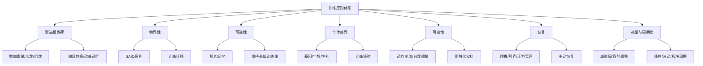
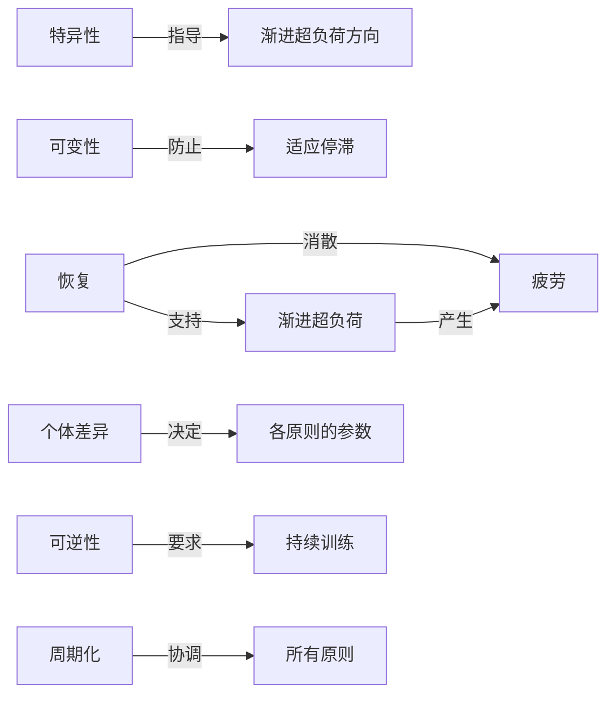

## 二、训练原则

训练原则是指导训练设计的底层逻辑。它们不是某位教练的经验之谈，而是从运动生理学、生物力学和长期实践中提炼出的规律。违反这些原则，轻则训练效率低下，重则导致伤病。

本节将逐一拆解七大训练原则，并在每个原则下给出具体的应用方法、常见误区和实操建议。

### 2.1 渐进超负荷原则（Progressive Overload）

**这是增肌最核心的原则，没有之一。** 如果你只能记住一个原则，记住这个。

渐进超负荷的本质是：**系统性地增加训练刺激，迫使身体不断适应更强的负荷。** 人体是一个高度适应性系统——当你给它施加超过当前能力的压力时，它会通过增强自身来应对。但如果压力始终不变，适应就会停滞，进步也随之停止。

这个原理源自汉斯·塞利（Hans Selye）的**一般适应综合征（GAS）**模型：身体面对压力时经历"警觉→抵抗→衰竭"三个阶段。训练的智慧在于，在"抵抗"阶段施加新的压力，同时避免进入"衰竭"阶段。

#### 增加负荷的六种方式

| 方式 | 说明 | 具体示例 | 适用阶段 | 优先级 |
|------|------|----------|----------|--------|
| **增加重量** | 最直接的超负荷手段 | 深蹲从60kg增加到62.5kg | 所有阶段 | ★★★★★ |
| **增加次数** | 同重量下完成更多重复 | 从3×8次增加到3×10次 | 所有阶段 | ★★★★☆ |
| **增加组数** | 提升总训练容量 | 从3组增加到4组 | 中级及以上 | ★★★☆☆ |
| **缩短休息时间** | 提高训练密度 | 休息从2分钟缩短到90秒 | 中级及以上 | ★★★☆☆ |
| **改善动作质量** | 更大运动范围、更精确控制 | 深蹲深度增加5cm | 所有阶段 | ★★★★★ |
| **增加动作难度** | 使用更具挑战性的变体 | 从高杠深蹲改为前蹲 | 进阶 | ★★☆☆☆ |

**关键提醒**：增加负荷的方式不是孤立的，实际训练中通常同时叠加2-3种。比如一组训练中，你可能用更重的重量（+重量）完成了更多的次数（+次数），同时控制得更慢（+动作质量）。

#### 各阶段的进步速度与策略

**新手阶段（0-6个月）——"新手福利期"**：

这是训练生涯中进步最快的阶段。几乎每次训练都能增加重量或次数，原因不是肌肉增长有多快，而是**神经系统适应**占了进步的绝大部分。大脑学会了更高效地募集运动单元、协调肌肉间的配合。

- 上肢动作（卧推、划船等）：每周增加2.5kg是合理的
- 下肢动作（深蹲、硬拉等）：每周增加5kg是可能的
- 策略：采用线性进阶计划（如StrongLifts 5×5、Starting Strength），每次训练尝试加2.5kg
- 陷阱：不要因为进步快就跳过动作质量的打磨，坏习惯一旦形成后期极难纠正

**中级阶段（6个月-2年）——"进阶爬坡"**：

进步速度明显放缓。神经系统适应的红利基本耗尽，真正的肌肉增长成为主要驱动力。可能需要每1-2周才能在某些动作上增加重量，而且不可能所有动作同时进步。

- 策略：采用每周或双周进阶计划（如5/3/1、GZCLP）
- 需要开始关注**训练容量**（总组数×次数×重量）的管理
- 开始引入**周期化**概念，不再每节课都冲击重量
- 陷阱：急于求成，试图维持新手阶段的进步速度，结果导致过度训练或伤病

**高级阶段（2-5年）——"精细化管理"**：

进步以月甚至季度为单位。每一小步都需要精心设计。此时训练计划的"设计能力"比"努力程度"更重要。

- 策略：板块周期化（Block Periodization），每个板块持续3-6周
- 需要精细调节容量、强度、频率三个变量
- 需要关注恢复质量（睡眠、营养、压力管理）
- 陷阱：过度依赖单一计划，缺乏周期性变化

**进阶阶段（5年以上）——"个性化定制"**：

进步以年为单位计算。每个人的瓶颈点不同，需要高度个性化的训练方案。

- 策略：根据个人薄弱环节设计专项训练
- 可能需要在非赛季和赛季之间进行大幅度的训练调整
- 需要持续监控身体状态指标（晨起心率、睡眠质量、主观疲劳感）

#### 渐进超负荷的节奏控制

不是每天都应该加重量。科学的渐进超负荷需要遵循**"刺激→恢复→适应"**的循环。一次有效的训练造成微损伤（刺激），接下来48-72小时身体进行修复（恢复），修复后的组织比之前更强（适应）。

**线性进阶**：每周固定增加重量，适合新手。
第1周：深蹲 60kg × 5×5
第2周：深蹲 65kg × 5×5
第3周：深蹲 70kg × 5×5
第4周：减量周 50kg × 5×5

**阶梯式进阶**：在某个重量停留多次训练直到达标再加重，适合中级。
深蹲目标：3×8次 @ 80kg
第1次：80kg × 8,7,6（未达标，保持重量）
第2次：80kg × 8,8,7（未达标，保持重量）
第3次：80kg × 8,8,8（达标，下次增加2.5kg）

**波动进阶**：交替高容量周和高强度周，适合中高级。
第1周（高强度）：深蹲 85kg × 5×3
第2周（高容量）：深蹲 75kg × 4×8
第3周（高强度）：深蹲 87.5kg × 5×3
第4周（减量）：深蹲 60kg × 3×5

#### 渐进超负荷的常见误区

**误区一：只关注重量，忽视动作质量。** 如果你用更大的重量但运动范围变小了，这不是真正的进步。半蹲100kg不等于全蹲80kg。衡量进步的标准应该是**同等动作质量下的负荷提升**。

**误区二：每次都冲击极限。** 训练不是比赛。大部分训练（80%以上）应该在离力竭还有1-3次余量的状态下完成。只在特定的测试日冲击极限。

**误区三：忽视疲劳管理。** 加重量容易，管理疲劳才是真正的学问。如果你连续两周感觉疲劳累积、睡眠质量下降、训练动力不足，这通常是需要减量的信号，而不是"意志力不够"。

### 2.2 特异性原则（Specificity）

**你的身体会适应你训练它的特定方式，而不是你希望它适应的方式。** 这被称为SAID原则（Specific Adaptation to Imposed Demands）。

特异性原则的核心逻辑是：训练刺激决定了身体产生什么类型的适应。练力量，身体就变得更强壮；练耐力，心肺功能就提升；练柔韧，关节活动范围就增大。而且这些适应在很大程度上是**局部的**——你练哪里，哪里就变强。

#### 特异性原则的三个维度

**动作模式特异性**：你练深蹲，深蹲就变强。但深蹲的进步不会直接迁移为硬拉的进步，尽管两者都是下肢复合动作。原因在于：即使涉及相同肌肉群，不同动作的发力角度、运动模式、稳定需求都不同。神经系统针对特定动作模式进行了优化。

**能量系统特异性**：
- 大重量低次数（1-5次）→ 主要发展磷酸原系统 → 最大力量提升
- 中等重量中次数（6-12次）→ 主要发展糖酵解系统 → 肌肥大
- 轻重量高次数（15次以上）→ 主要发展有氧系统 → 肌肉耐力
- 高强度间歇 → 主要发展糖酵解+磷酸原 → 无氧耐力/VO2max
- 低强度持续有氧 → 主要发展有氧系统 → 乳酸阈值/脂肪氧化

**肌肉特异性**：训练适应主要发生在被训练的肌肉纤维上。做二头弯举不会让股四头肌变大。即便在同一块肌肉内部，不同的训练角度也会产生不同的区域特异性激活。

#### 训练迁移：特异性的延伸

训练迁移是指一项训练成果对另一项任务表现的影响。迁移分为三种：

| 迁移类型 | 含义 | 示例 |
|----------|------|------|
| **正迁移** | A训练提升B表现 | 深蹲训练提升跳跃能力 |
| **零迁移** | A训练对B无影响 | 肱二头弯举对百米跑无影响 |
| **负迁移** | A训练降低B表现 | 大量慢跑可能降低爆发力 |

迁移效果取决于两项任务之间的**动作模式相似性**和**能量系统相似性**。相似度越高，正迁移越大。

**实操建议**：如果时间有限，优先选择迁移范围大的复合动作（深蹲、硬拉、卧推、引体向上、划船），而不是孤立动作（二头弯举、腿弯举）。复合动作的迁移范围远大于孤立动作。

#### 特异性在不同阶段的应用

- **新手阶段**：特异性需求低。任何训练刺激都能产生适应，不需要过度精细化。专注于学习基本动作模式即可。
- **中级阶段**：开始围绕主要目标安排训练。如果你的目标是力量，训练就应该以大重量复合动作为核心；如果目标是体型，训练就应该注重各肌群的均衡发展。
- **高级阶段**：高度特异化。训练计划精确针对比赛动作、比赛重量区间、比赛节奏。但同时需要适当的变异性来避免过度使用伤害。

### 2.3 恢复原则（Recovery）

**训练是破坏，恢复才是成长。** 这是很多训练者最容易忽视的原则。

一次高强度训练造成的肌肉微损伤、神经系统疲劳、糖原耗竭，需要时间来修复和补偿。如果恢复不足，下一次训练时你的身体还处于疲劳状态，训练效果会大打折扣，长期还会导致过度训练综合征。

#### 恢复的四个支柱

**睡眠**：这是恢复最重要的单一因素。生长激素在深度睡眠期间分泌达到峰值，肌肉蛋白质合成在睡眠期间最为活跃。

- 目标：每晚7-9小时，其中深睡眠（N3阶段）不少于1.5小时
- 睡眠不足的影响：连续一周每天只睡5小时，睾酮水平下降10-15%，力量表现下降5-10%
- 优化策略：固定就寝时间、睡前1小时避免屏幕蓝光、卧室温度保持在18-20°C、避免晚间咖啡因（半衰期5-6小时）

**营养**：训练后的修复材料必须充足。蛋白质提供氨基酸用于肌肉修复，碳水化合物补充糖原储备，微量营养素参与能量代谢和组织修复。

- 蛋白质：每天1.6-2.2g/kg体重，分配在3-5餐中
- 碳水化合物：根据训练量调整，高强度训练日3-5g/kg，休息日2-3g/kg
- 训练后30-60分钟内摄入蛋白质+碳水化合物（"合成代谢窗口"虽然被过度营销，但训练后及时补充确实有助于恢复）

**压力管理**：心理压力（工作压力、焦虑、人际关系冲突）和训练压力共享同一套应激反应系统（HPA轴）。当心理压力已经很高时，同样的训练量造成的系统性负担会更大。

- 识别信号：持续焦虑、失眠、食欲下降、性欲降低、静息心率升高
- 应对方法：冥想（每天10分钟即可）、自然环境散步、社交活动、减少不必要的信息输入

**主动恢复**：在休息日进行低强度活动，促进血液循环，加速代谢废物清除。

- 轻度有氧：20-30分钟快走或骑车，心率控制在最大心率的50-60%
- 泡沫轴滚压：每个肌群滚动60-90秒
- 轻度拉伸：保持每个拉伸动作30秒，不做弹振
- 温水浸泡：38-40°C温水浸泡15-20分钟

#### 恢复的时间尺度

不同训练量和强度下，各系统的恢复时间不同：

| 训练类型 | 肌肉恢复 | 神经系统恢复 | 结缔组织恢复 |
|----------|----------|--------------|--------------|
| 低强度有氧 | 12-24小时 | 6-12小时 | 24小时 |
| 中等强度力量（65-80%1RM） | 24-48小时 | 24-48小时 | 48-72小时 |
| 高强度力量（85%+1RM） | 48-72小时 | 48-72小时 | 72-96小时 |
| 极限测试/比赛 | 72-96小时 | 72-96小时 | 5-7天 |

结缔组织（肌腱、韧带）的恢复速度远慢于肌肉。当肌肉已经恢复并感觉良好时，结缔组织可能还在修复中。这是为什么"感觉好了就冲"容易导致肌腱炎——你感觉准备好了，但肌腱还没有。

#### 过度训练综合征

当训练压力持续超过恢复能力时，就会发生过度训练。过度训练分为三个阶段：

1. **功能性过度训练（Functional Overreaching）**：短期的训练-恢复失衡，1-2周的额外休息后可以恢复，且可能出现超量恢复效果。这是有意为之的训练策略。
2. **非功能性过度训练（Non-Functional Overreaching）**：需要数周到数月才能恢复，期间表现持续下降。
3. **过度训练综合征（Overtraining Syndrome）**：严重状态，可能需要数月甚至一年才能完全恢复。伴随免疫功能下降、慢性疲劳、情绪障碍等症状。

**早期预警信号**：
- 静息心率比平时高5-10次/分钟（连续3天以上）
- 睡眠质量持续下降
- 训练动力明显降低，对训练产生抗拒感
- 同等重量感觉比平时重
- 连续两次训练表现下降
- 频繁感冒或小伤不断

**应对策略**：一旦出现多个预警信号，立即安排1-2周减量。不要试图"扛过去"——过度训练的恢复代价远高于预防成本。

### 2.4 可逆性原则（Reversibility）

**"用进废退"——如果你停止训练，你获得的适应会逐渐消失。** 这是生物学的基本规律，没有例外。

#### 不同能力的衰退速度

不同类型的训练适应，衰退速度差异显著：

| 能力类型 | 开始衰退时间 | 显著衰退时间 | 完全丧失时间 |
|----------|-------------|-------------|-------------|
| 心肺耐力（VO2max） | 2周 | 4-8周 | 3-6个月 |
| 最大力量 | 2-3周 | 4-6周 | 6-12个月 |
| 肌肉量 | 2-3周 | 4-8周 | 6-12个月 |
| 神经肌肉协调/动作技能 | 4-6周 | 3-6个月 | 1-2年 |
| 柔韧性 | 1-2周 | 2-4周 | 数月 |

心肺能力衰退最快，因为心肌和线粒体密度对训练刺激的依赖性极高。神经肌肉协调保持最久，因为动作模式已经编码为长期运动记忆。

#### 肌肉记忆（Muscle Memory）

好消息是，曾经训练过的人重新开始训练时，恢复速度比从零开始快得多。这不是心理作用，而是有坚实的分子生物学基础。

训练过的肌纤维会获得额外的**细胞核（myonuclei）**——这个过程叫做**细胞核获得（myonuclear addition）**。每个细胞核能管理一定范围的细胞质体积。当肌肉萎缩时，细胞质体积缩小，但这些额外的细胞核并不会消失，它们可以"休眠"多年。当重新开始训练时，这些细胞核立即重新激活，能够更快地驱动肌肉蛋白质合成。

研究表明，即使停止训练超过10年，曾经训练过的肌肉仍保留了大量额外细胞核。这意味着：
- 恢复到之前的水平比首次达到快得多（可能只需一半的时间）
- "从零开始"对曾经训练过的人来说是错误的——你不是从零开始，只是从休眠中唤醒
- 少年时期的训练可能带来终身的肌肉记忆优势

#### 保持最低有效训练量

当时间受限时，完全停止训练是最后的选择。研究表明，**保持训练效果所需的训练量远小于建立该效果所需的训练量**。

- **力量保持**：每周1-2次，每个动作2-3组，强度维持在80%1RM以上，可以保持力量数月不衰退
- **肌肉量保持**：每周每个肌群至少训练1次，维持正常训练强度的50-70%
- **心肺能力保持**：每周2-3次，每次20-30分钟中等强度有氧，可以维持大部分有氧基础

**伤病期间的策略**：
- 如果是上肢受伤：继续训练下肢
- 如果是下肢受伤：继续训练上肢
- 如果是单侧受伤：继续训练健侧（交叉迁移效应，训练健侧可以减缓伤侧的力量流失）
- 即使完全无法训练：保持高蛋白摄入（每天2g/kg体重），可以显著减缓肌肉流失

### 2.5 个体差异原则（Individuality）

**没有放之四海而皆准的训练计划。** 同一个计划在不同人身上可能产生截然不同的效果。

#### 影响训练反应的个体因素

**基因因素**：
- **肌纤维类型比例**：有些人天生快肌纤维（Type II）占比较高（可达70%+），有些人慢肌纤维（Type I）占比较高。快肌纤维多的人在爆发力、力量项目上有优势，但耐力相对较弱；慢肌纤维多的人则相反。肌纤维比例大致是先天决定的，训练只能改变纤维的粗细，不能改变类型。
- **肌肉附着点位置**：跟腱长度、肌肉在骨骼上的附着点位置影响力臂和力学优势。同样的训练，力学条件好的人力量增长更快。
- **激素基线水平**：每个人的睾酮、生长激素、胰岛素样生长因子（IGF-1）的基线水平不同，直接影响肌肉增长速度。
- **恢复能力相关基因**：某些基因变异影响炎症反应速度、睡眠质量、肌肉损伤修复速率。

**生理因素**：
- **年龄**：20-35岁是力量和肌肉增长的黄金期。35岁后，睾酮水平开始以每年1-2%的速度下降，恢复能力也会逐渐降低。但这不意味着年龄大了就不能进步——只是需要更精细的恢复管理。
- **性别**：女性的上肢力量约为男性的50-60%，下肢力量约为70-80%。女性的训练量耐受能力相对更强（恢复更快），但绝对力量上限较低。训练原则相同，具体参数需要调整。
- **体重和体型**：身高和肢体长度影响杠杆优势。矮个子在深蹲和卧推上通常有力学优势（力臂短），高个子在硬拉上有优势（臂展长）。

**生活方式因素**：
- **睡眠质量**：睡眠不足的人恢复能力显著降低
- **工作压力**：高压力职业的人同样的训练量可能造成更大的系统性负担
- **营养基础**：饮食不规律或营养不足会严重限制训练适应
- **训练历史**：有运动背景的人学习新动作更快（运动技能迁移）

#### 如何应用个体差异原则

**不要盲目模仿他人计划**：网上看到的训练计划可能是为特定人群设计的。一个力量举选手的计划不适合健美爱好者，一个18岁大学生的计划不适合35岁的上班族。

**通过实验找到适合自己的参数**：
- 训练频率：有些人每周4次效果最好，有些人5-6次更好
- 训练量：每个肌群每周10组可能对A足够，B可能需要16组
- 动作选择：同样练胸，平板卧推对某些人效果好，上斜卧推对另一些人效果好
- 训练时间：有些人早上训练状态好，有些人下午更好

**建立个人数据库**：坚持记录训练日志，包括重量、组数、次数、主观疲劳感（RPE）、睡眠质量、压力水平。经过3-6个月的数据积累，你就能发现自己的模式——什么训练量最有效，什么频率最适合，哪些动作进步最快。

### 2.6 可变性原则（Variation）

**长期使用相同的训练刺激，身体会进入适应平台期。** 适度的变化可以重新激活适应机制。

#### 为什么要变化

当身体完全适应了某种训练刺激后，同样的刺激不再构成足够的挑战。这不是说基础动作要换掉——深蹲永远应该在你的计划里——而是说训练参数需要周期性调整。

可变性的目的：
1. **突破平台期**：新的刺激重新激活适应机制
2. **预防过度使用伤害**：长期重复相同的动作模式容易导致特定关节/肌腱的累积性损伤
3. **心理激励**：变化保持训练的新鲜感和动力
4. **全面发展**：不同训练参数发展不同的身体能力

#### 变化的层次

**第一层：参数微调**（每1-2周）
- 同一个动作，调整组数、次数、重量、休息时间
- 例：深蹲从4×6变为5×4（加重），下周变为3×10（减重增容）

**第二层：动作替换**（每3-6周）
- 用功能相似但角度/器械不同的变体替换
- 例：杠铃深蹲→前蹲→高脚杯深蹲→酒杯蹲
- 核心原则：动作模式相同，但刺激角度变化

**第三层：训练阶段切换**（每4-8周）
- 从力量阶段切换到肌肥大阶段，再到力量耐力阶段
- 或从积累板块（高容量）切换到强化板块（高强度）

**第四层：训练目标调整**（每3-6个月）
- 从纯力量训练转向综合体能
- 从增肌期转向减脂期

#### 变化的边界

**变化不等于混乱**。以下内容不应随意变化：
- 核心复合动作（深蹲、硬拉、卧推、推举、划船、引体向上）应始终保留
- 基本的训练结构（推/拉/腿 或 上/下分化）保持相对稳定
- 渐进超负荷的大方向不变

**变化的频率取决于训练水平**：
- 新手：同一个计划可以使用3-6个月，因为进步主要来自神经适应，不需要频繁变化
- 中级：每4-6周调整一次训练参数
- 高级：每3-4周可能就需要变化，因为身体的适应速度更快

### 2.7 减量与周期化（Tapering & Periodization）

#### 减量周（Deload Week）

减量周是计划性的恢复阶段，通过系统性减少训练负荷来消散累积疲劳，为下一阶段的高强度训练做准备。

**为什么要减量**：训练造成的疲劳会累积。即使你每次训练后都能恢复到"足够好"的状态，连续4-8周的高强度训练后，累积的系统性疲劳会影响表现。减量周的目的不是让身体"休息"，而是**消散疲劳，释放被掩盖的适应成果**。

**减量周的标准安排**：
- 频率：每4-8周一次，根据训练强度和个人恢复能力调整
- 训练量：减少至正常水平的40-60%（组数减半）
- 训练强度：保持正常重量的60-70%（重量不要减太多，否则技术会退步）
- 训练频率：保持不变（不要减少训练天数）
- 力竭程度：绝对不训练到力竭，RPE控制在5-6

**减量周的常见误区**：
- 完全不训练：这会导致适应开始流失，且重新训练时会延迟
- 减量同时节食：减量周应该保持正常或稍高的热量摄入，因为身体需要额外的营养来完成修复
- 感觉"浪费时间"：减量周结束后你会惊讶于自己变得多强——那些进步本就存在，只是被疲劳掩盖了

#### 周期化概述

周期化是将长期训练计划分为若干阶段，每个阶段有不同的训练重点和参数。它的核心思想是：**你不可能同时最大化所有能力**。力量、肌肥大、耐力、爆发力需要不同的训练参数，试图同时发展所有能力的结果是哪一项都做不好。

**线性周期化**（Linear Periodization）：
阶段1（4周）：高容量/低强度 — 4×10 @ 60%1RM → 发展肌肉耐力和工作能力
阶段2（4周）：中容量/中强度 — 4×8 @ 70%1RM → 发展肌肥大
阶段3（4周）：低容量/高强度 — 5×4 @ 80%1RM → 发展最大力量
阶段4（2周）：峰值 — 3×2 @ 90%+1RM → 达到力量峰值
减量周 → 测试/比赛

**波动周期化**（Undulating Periodization）：
周一：力量日 — 5×3 @ 85%1RM
周三：肌肥大日 — 4×10 @ 65%1RM
周五：爆发力日 — 6×2 @ 70%1RM（快速执行）

**板块周期化**（Block Periodization）：
积累板块（3-4周）：高训练量，建立基础能力
强化板块（3-4周）：高训练强度，将基础能力转化为专项表现
实现板块（1-2周）：比赛模拟，达到峰值状态

对于普通健身爱好者，**波动周期化**最为实用——在同一周内安排不同强度的训练日，简单有效。线性周期化更适合有明确比赛日期的竞技运动员。

### 2.8 各原则之间的关系

这七大原则不是孤立的，它们相互交织、相互制约：

**最核心的矛盾**是渐进超负荷和恢复之间的平衡。训练太少，刺激不够，不进步；训练太多，恢复不足，也不进步（甚至退步）。找到"甜蜜点"是训练设计的核心艺术。

**实用判断标准**：
- 如果你持续进步且感觉良好 → 当前方案有效，继续执行
- 如果你进步停滞但感觉良好 → 可能需要增加训练量或强度
- 如果你感觉疲劳但仍在进步 → 注意监控，准备安排减量
- 如果你既疲劳又停滞 → 立即减量，检查恢复要素（睡眠、营养、压力）

> **记住**：最好的训练计划不是最激进的计划，而是你能持续执行、持续进步、不受伤的计划。训练是一场马拉松，不是百米冲刺。
