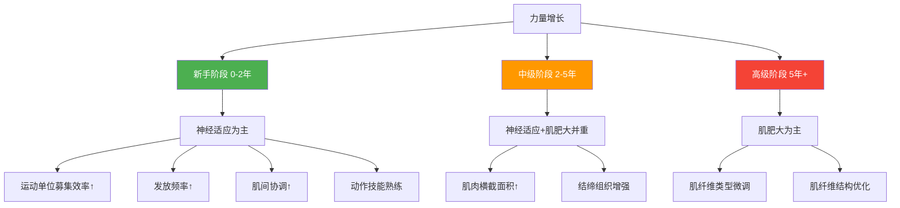
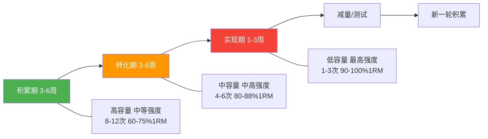
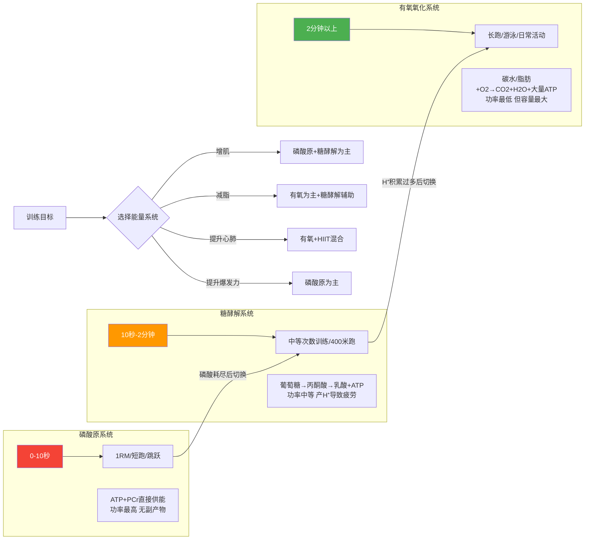

## 三、力量训练理论

力量训练是所有体能训练的基石。无论你的目标是增肌塑形、提升运动表现、还是改善健康指标，理解力量训练的科学原理都能让你少走弯路、事半功倍。本章从肌肉生长的底层机制出发，逐步覆盖力量提升、肌耐力发展、训练容量管理和周期化设计，构建完整的知识体系。

### 3.1 肌肉肥大的科学

肌肉肥大（Muscle Hypertrophy）是指肌纤维横截面积的增加，本质上是肌纤维内收缩蛋白（肌动蛋白和肌球蛋白）数量的增加。理解肌肉为什么会长、怎样才能长得更好，是制定有效训练计划的起点。

#### 3.1.1 肌肉生长的三个机制

Brad Schoenfeld博士在2010年的经典论文《The Mechanisms of Muscle Hypertrophy and Their Application to Resistance Training》中系统阐述了肌肉肥大的三大机制。这三个机制并非孤立存在，而是相互交织、协同作用。

**（一）机械张力（Mechanical Tension）—— 最核心的驱动力**

**定义**：肌肉在收缩和拉伸过程中承受的外部力学负荷。简单说，就是肌肉"扛了多重的东西、扛了多久"。

**分子机制详解**：

机械张力是肌肉生长最重要的机制，其信号传导路径已被大量研究证实：

1. **机械转导（Mechanotransduction）**：肌纤维感受到机械张力后，细胞膜上的机械感受器（主要是肌联蛋白Titin和跨膜整合素Integrin复合体）将物理力转化为生化信号。
2. **mTOR通路激活**：机械信号激活哺乳动物雷帕霉素靶蛋白（mTOR）通路，特别是mTORC1复合物。mTOR是细胞蛋白质合成的"总开关"，它通过磷酸化p70S6K和4E-BP1来启动核糖体翻译过程，促进肌肉蛋白合成（MPS）。
3. **卫星细胞活化**：长期的机械张力刺激还能激活位于肌纤维基底膜下的卫星细胞（肌肉干细胞），这些细胞增殖后与现有肌纤维融合，增加肌核数量，为更大的肌肉体积提供"指挥中心"。

**实现方式**：
- **使用较大的重量**：强度在65% 1RM以上的负荷能产生足够的机械张力
- **完整的运动范围（ROM）**：全范围动作让肌肉在不同长度下都承受张力
- **控制离心阶段**：下放阶段用2-4秒控制，离心收缩产生的张力比向心更大
- **拉伸位置加载**：在肌肉被拉长的位置（如哑铃飞鸟的底部）承受最大张力，这对肌肥大的刺激最强。2020年Pedrosa等人的研究发现，在拉伸位置训练比在缩短位置训练能产生更显著的肌肥大效果

**（二）代谢压力（Metabolic Stress）—— "泵感"背后的科学**

**定义**：运动中代谢副产物在肌肉中的局部积累，主要包括乳酸、氢离子（H⁺）、无机磷酸盐（Pi）和活性氧（ROS）。

**表现**：肌肉泵感（pump）、灼烧感、皮肤发红充血。这些不是虚荣指标，而是代谢压力的直接体现。

**代谢压力促进肌肥大的四条路径**：

| 路径 | 机制 | 说明 |
|------|------|------|
| 细胞肿胀 | 代谢产物积累导致水分进入肌细胞 | 细胞膨胀激活体积感受器，向细胞核发送"合成更多蛋白"的信号（Rae等, 2000） |
| 快肌纤维募集 | 慢肌纤维因代谢疲劳先衰竭 | 快肌纤维被迫参与工作，而快肌纤维的增肌潜力远大于慢肌 |
| 生长因子释放 | 代谢应激刺激GH、IGF-1分泌 | 虽然GH对肌肥大的直接作用有限，但IGF-1通过自分泌/旁分泌方式在局部发挥作用 |
| 活性氧信号 | 低浓度ROS作为信号分子 | 适量ROS激活NF-κB等转录因子，促进肌肉适应（过量ROS则有害） |

**实现方式**：
- **中高次数**：每组12-20次，接近力竭
- **短休息时间**：组间休息30-60秒，不完全恢复
- **高级训练技术**：
  - **递减组（Drop Sets）**：做到力竭后立刻减重20-30%继续做
  - **超级组（Supersets）**：两个动作背靠背不休息
  - **暂停休息法（Rest-Pause）**：力竭后休息10-15秒再继续
  - **血流限制训练（BFR）**：用加压带部分限制静脉回流，在轻重量下制造极高的代谢压力

**（三）肌肉损伤（Muscle Damage）—— 双刃剑**

**定义**：运动导致的肌纤维结构微损伤，包括Z线断裂、肌膜通透性增加、炎症细胞浸润等。

**表现**：延迟性肌肉酸痛（DOMS），通常在训练后12-24小时开始，24-72小时达到峰值。

**肌肉损伤的修复与生长过程**：

**实现方式**：
- 离心训练（重点控制下放阶段，离心收缩造成的损伤最大）
- 超出常规运动范围的动作（如离心超负荷）
- 训练新动作或改变角度（不熟悉的动作模式造成更多微损伤）
- 长时间在拉伸位置承受负荷

**⚠️ 重要警示：肌肉损伤不是越多越好**

这是新手最常犯的错误之一。许多人把DOMS当作"练到位了"的标志，追求练完第二天走不动路的感觉。这完全是错误的认知：

- **过度损伤延长恢复**：超出恢复能力的损伤需要更长时间修复，挤占了下一次训练的时间窗口
- **DOMS与增长无直接因果**：随着训练经验增加，DOMS会显著减轻（重复训练效应/Repeated Bout Effect），但肌肉生长速度并不会下降
- **老手几乎不酸**：一个训练5年的人可能练完腿第二天完全不酸，但他的腿部肌肉仍在持续增长

**正确态度**：肌肉损伤是训练的"副产品"，不是训练的"目标"。适量的损伤有助于肌肥大，但不应该刻意追求极致的酸痛感。

#### 3.1.2 三机制的协同关系与优先级

三个机制不是"三选一"，而是在一次训练中同时发生，只是比例不同。关键是理解它们的优先级：

| 优先级 | 机制 | 原因 |
|--------|------|------|
| ⭐⭐⭐ 最高 | 机械张力 | 是肌肥大的根本驱动力，没有足够的张力，其他机制的效果大打折扣 |
| ⭐⭐ 中等 | 代谢压力 | 有独立的增肌贡献，是机械张力的有效补充 |
| ⭐ 适量 | 肌肉损伤 | 适量即可，刻意追求反而有害 |

**实操指导**：在安排训练时，首先要确保足够的机械张力（足够的重量和完整的ROM），在此基础上通过训练技术增加代谢压力，肌肉损伤则听其自然——它会来，但不需要你刻意去追求。

#### 3.1.3 影响肌肉肥大的关键变量

理解了三个机制后，来看具体训练变量如何影响肌肥大效果：

| 变量 | 推荐范围 | 详细说明 |
|------|----------|----------|
| **训练强度（%1RM）** | 60-85% | 增肌的最佳强度范围。2017年Schoenfeld的Meta分析证实，即使30% 1RM的轻重量，只要做到接近力竭，也能产生显著的肌肥大效果。但60-85%是最实际、最高效的区间 |
| **每组次数** | 6-20次 | 不同次数范围都有增肌效果，前提是接近力竭。低次数（6-8）偏向力量，中次数（8-12）是经典增肌区间，高次数（15-20）增加代谢压力 |
| **每周训练容量** | 每肌群10-20组/周 | 存在明确的剂量-效应关系，但有上限。Krieger 2010年的Meta分析显示，每周每肌群>10组比<10组效果更好，但超过20组后收益递减甚至可能过度 |
| **训练频率** | 每肌群2-3次/周 | 2016年Schoenfeld的Meta分析显示，每周2次比1次频率更优。高频（3次以上）可能有优势，但前提是容量分配合理且能恢复 |
| **力竭程度** | RIR 1-3（保留1-3次） | 不需要每次都练到绝对力竭。RIR 2-3的训练已经能获得接近力竭的肌肥大效果，同时减少疲劳积累和受伤风险 |
| **动作选择** | 复合+孤立组合 | 复合动作（深蹲、卧推、划船）提供最大的机械张力和效率；孤立动作（弯举、飞鸟、侧平举）用于针对性强化弱部 |
| **运动范围** | 完整ROM | 尤其在肌肉拉伸位置的训练效果最好。半程动作可以作为补充，但不应成为主要训练方式 |
| **离心控制** | 2-4秒下放 | 离心阶段产生的张力比向心阶段大20-40%，是肌肥大的重要刺激来源 |

#### 3.1.4 肌肉生长的时间线与上限

肌肉生长是一个缓慢的过程，设定合理的预期能避免挫败感：

| 训练年限 | 预期月增肌量 | 说明 |
|----------|-------------|------|
| 新手（0-1年） | 0.7-1kg/月 | 神经适应+肌肥大同步发生，进步最快 |
| 中级（1-3年） | 0.3-0.5kg/月 | 神经适应基本完成，纯靠肌肥大 |
| 高级（3-5年） | 0.1-0.25kg/月 | 接近遗传上限，进步缓慢 |
| 精英（5年+） | <0.1kg/月 | 接近个人极限，需要极致优化 |

**肌肉生长的遗传上限**：根据Casey Butt的模型估算，一个训练到极限的自然健身者，去脂瘦体重（FFMI）大约在25左右。这不是说你一定达不到，而是大多数人在这个范围内。

### 3.2 力量训练的科学

#### 3.2.1 什么是最大力量

**最大力量**是指神经系统在一次最大努力中，通过募集所有可用的运动单位并以最高频率发放，使肌肉产生的最大力量。通常用1RM（一次最大重复重量）来衡量。

力量不仅仅是"肌肉大就行"。一个肌肉围度较小的人完全可能比肌肉更大的人更强，这取决于神经系统的效率。

#### 3.2.2 力量的七大决定因素

| 因素 | 类型 | 说明 | 训练阶段 |
|------|------|------|----------|
| **肌肉横截面积（PCSA）** | 结构因素 | 肌肉越粗，潜在力量越大。这是力量的"硬件基础" | 中高级阶段的主要增长来源 |
| **运动单位募集** | 神经因素 | 激活更多的运动单位，尤其是高阈值的快肌运动单位（HT-MU）。一个运动单位包含数十到数千根肌纤维 | 新手进步的主要来源 |
| **发放频率（Rate Coding）** | 神经因素 | 运动神经元发放冲动的频率。频率越高，力量越大。这解释了为什么举重运动员能"瞬间发力" | 贯穿所有阶段 |
| **肌间协调** | 神经因素 | 主动肌、协同肌、拮抗肌和稳定肌之间的协调配合 | 新手阶段显著提升 |
| **动作技能** | 神经因素 | 特定动作的神经肌肉模式（engram）。练深蹲就是比不练深蹲的人深蹲更强 | 贯穿所有阶段 |
| **肌肉结构** | 结构因素 | 羽状角（pennation angle）和肌纤维长度。羽状角小的肌肉更擅长产生力量，羽状角大的肌肉更擅长产生力量×速度 | 先天为主，长期训练可微调 |
| **肌纤维类型比例** | 遗传因素 | 快肌纤维（Type II）产生力量的能力是慢肌（Type I）的2-5倍 | 遗传决定，训练可小幅转换 |

#### 3.2.3 新手vs高级训练者：力量增长的不同路径

**关键洞察**：新手可以在不增加太多肌肉的情况下显著变强，因为神经系统的优化空间巨大。这也是为什么力量举运动员在比赛前不会刻意增肌——他们在优化神经效率。但到了高级阶段，想继续变强就必须变大，肌肉横截面积成为力量增长的主要限制因素。

#### 3.2.4 力量训练的强度区间

不同训练目标对应不同的强度区间。理解这些区间能让你的训练有的放矢：

| 目标 | %1RM | 每组次数 | 组间休息 | 主要适应 | 适用人群 |
|------|------|----------|----------|----------|----------|
| **最大力量** | 85-100% | 1-5次 | 3-5分钟 | 神经适应、运动单位募集、发放频率 | 力量举运动员、举重运动员 |
| **力量+肌肥大** | 75-85% | 5-8次 | 2-3分钟 | 力量和肌肉量兼得 | 追求力量与体型的综合训练者 |
| **肌肥大** | 65-75% | 8-12次 | 60-120秒 | 肌肉横截面积增加、代谢压力 | 健美训练者、普通健身爱好者 |
| **肌耐力** | <65% | 15-20+次 | 30-60秒 | 代谢适应、毛细血管密度、线粒体 | 耐力运动员、康复训练 |

**2017年Schoenfeld Meta分析的关键发现**：

这项纳入了15项研究的Meta分析证实：在训练到接近力竭的条件下，低次数（<6次）、中次数（6-12次）和高次数（>12次）的训练都能产生显著且相似的肌肥大效果。但对最大力量的增长，大重量低次数的训练明显更有效。

**实际意义**：如果你想同时变大又变强，最佳策略是以大重量低次数的复合动作为核心（打力量基础），辅以中高次数的孤立动作（增肌补短板）。

### 3.3 肌肉耐力的科学

**肌肉耐力**是指肌肉在一段时间内持续产生力量或重复收缩的能力。它不仅仅是"做更多次数"——肌肉耐力的提升涉及能量代谢、氧运输、缓冲系统等多维度的适应。

#### 3.3.1 肌肉耐力的决定因素

| 因素 | 机制 | 训练适应 |
|------|------|----------|
| **线粒体密度** | 线粒体是有氧代谢的"发电厂"，密度越高，ATP再生越快 | 耐力训练可使线粒体密度增加50-100% |
| **毛细血管密度** | 毛细血管负责向肌纤维输送氧气和营养、带走代谢废物 | 高次数训练和有氧训练都能增加毛细血管密度 |
| **氧化酶活性** | 柠檬酸合酶、细胞色素c氧化酶等关键酶的活性 | 有氧训练显著提升这些酶的活性 |
| **慢肌纤维比例** | 慢肌纤维（Type I）天生具有更高的氧化能力和抗疲劳能力 | 长期耐力训练可使部分IIx纤维转化为IIa（更耐疲劳的快肌亚型） |
| **肌内糖原储量** | 糖原是高强度运动的主要燃料，储量越大，持续时间越长 | 耐力训练+碳水策略可使肌糖原储量增加20-50% |
| **乳酸缓冲能力** | 肌肉中缓冲H⁺的能力决定了在酸性环境下能维持多久 | 高强度间歇训练对提升缓冲能力最有效 |
| **肌红蛋白含量** | 肌红蛋白负责在肌细胞内储存和运输氧气 | 耐力训练增加肌红蛋白含量，提升肌肉的氧储备 |

#### 3.3.2 肌肉耐力的训练方法

| 方法 | 具体做法 | 适用场景 |
|------|----------|----------|
| **高次数训练** | 每组15-25次，使用50-65% 1RM | 基础肌耐力发展 |
| **短休息时间训练** | 组间休息30-60秒 | 提升代谢缓冲能力 |
| **循环训练（Circuit Training）** | 5-8个动作连续完成，每动作间休息15-30秒 | 全身肌耐力+心肺刺激 |
| **等长训练（Isometric Holds）** | 长时间维持肌肉收缩，如平板支撑、靠墙静蹲 | 静态耐力、核心稳定性 |
| **有氧训练** | 跑步、游泳、骑行，心率维持在最大心率的60-75% | 心肺基础、线粒体适应 |
| **HIIT** | 高强度间歇训练，如30秒冲刺+90秒恢复×8-10组 | 同时提升有氧和无氧能力 |

#### 3.3.3 肌肉耐力与增肌的关系

肌肉耐力训练不是最高效的增肌方式（机械张力才是），但它对增肌有以下辅助价值：

1. **增加代谢压力**：高次数训练本身就是代谢压力训练的典型形式
2. **提升训练容量**：更强的肌耐力意味着能在一次训练中完成更多有效组数
3. **改善恢复能力**：更好的血液循环和氧运输能力有助于训练间恢复
4. **突破平台期**：对于长期只做大重量低次数的训练者，切换到高次数训练能提供新的生长刺激

### 3.4 渐进超负荷：力量训练的核心原则

如果力量训练只能记住一个原则，那就是**渐进超负荷（Progressive Overload）**。

#### 3.4.1 什么是渐进超负荷

**定义**：系统性地、逐步增加训练刺激，使身体持续面临超出当前适应水平的负荷，从而被迫继续适应和进步。

**生物学基础**：汉斯·塞利的一般适应综合征（GAS）理论完美解释了渐进超负荷的必要性：

简单说：身体不会无缘无故变强。只有当你给它一个"现在搞不定"的挑战时，它才会升级。一旦适应了，同样的刺激就变成了"维持训练"，不再推动进步。

#### 3.4.2 渐进超负荷的实现方式

很多人把渐进超负荷简单理解为"每次训练加重"，这是片面的。加重只是其中一种方式，而且不是唯一的方式：

| 方式 | 具体做法 | 适用阶段 |
|------|----------|----------|
| **增加重量** | 同样次数下使用更重的重量（如80kg×8 → 82.5kg×8） | 所有阶段 |
| **增加次数** | 同样重量下做更多次数（如80kg×6 → 80kg×8） | 所有阶段 |
| **增加组数** | 同样动作增加有效组数（如3组 → 4组） | 中高级阶段 |
| **缩短休息时间** | 同样容量下减少组间休息 | 中级阶段 |
| **提升动作质量** | 更大的运动范围、更好的控制、更强的念动一致 | 所有阶段 |
| **增加训练频率** | 每周多练一次某肌群 | 中高级阶段 |
| **增加训练密度** | 单位时间内完成更多有效训练量 | 高级阶段 |

**⚠️ 关键原则**：渐进超负荷不等于每次都进步。期望每次训练都比上次强是不现实的，会把自己逼到过度训练。正确的做法是**以周或月为单位看趋势**，允许日常波动。

#### 3.4.3 新手如何执行渐进超负荷

新手的"新手增益期"（Newbie Gains）是进步最快的阶段，关键在于充分利用：

**线性进阶法（Linear Progression）**：
- 每次训练增加2.5kg（上肢）或5kg（下肢）
- 做3组×5次
- 当无法完成全部组数和次数时，减重10%重新开始

**示例**：
深蹲：60kg×5/5/5 → 65kg×5/5/5 → 70kg×5/5/5 → 75kg×5/5/4
失败：减至67.5kg重新线性进阶

这种方法通常能持续3-6个月，之后需要更复杂的方案。

### 3.5 训练容量与强度的关系

**训练容量（Volume）**和**训练强度（Intensity）**是力量训练中最重要的两个变量，它们之间的关系决定了训练效果的方向。

#### 3.5.1 容量-强度的权衡

| 组合 | 效果 | 适用场景 |
|------|------|----------|
| **高容量 + 低强度** | 更多肌肥大刺激，但力量增长较慢 | 增肌期/积累期 |
| **低容量 + 高强度** | 更多力量刺激，但肌肥大效果有限 | 力量期/比赛准备期 |
| **中等容量 + 中等强度** | 两者兼得，但都不最大化 | 综合发展期 |

#### 3.5.2 容量管理：MEV、MAV、MRV

理解这三个概念是管理训练量的关键：

| 概念 | 全称 | 定义 | 说明 |
|------|------|------|------|
| **MEV** | Minimum Effective Volume | 产生训练效果所需的最小训练量 | 低于此量，进步停滞或退步 |
| **MAV** | Maximum Adaptive Volume | 产生最大效果的最佳训练量 | 因人而异、因阶段而异，需要通过实践发现 |
| **MRV** | Maximum Recoverable Volume | 能完全恢复的最大训练量 | 超过此量，疲劳累积、进步停滞甚至退步 |

**三者的关系**：

训练效果
  ↑
  │        ╱ MAV ╲
  │      ╱         ╲
  │    ╱             ╲ MRV
  │  ╱                 ╲
  │╱                     ╲
  └──────────────────────→ 训练容量
  MEV

在MEV和MAV之间，增加容量带来线性增长的收益。在MAV附近，收益达到峰值。超过MAV后收益递减，超过MRV后开始产生负面影响（过度训练）。

#### 3.5.3 容量进阶的实用策略

| 步骤 | 操作 | 说明 |
|------|------|------|
| 1 | 从MEV开始 | 新手约每肌群10组/周，中级约12-14组/周 |
| 2 | 当进步停滞时增加容量 | 每次增加2-4组/周，给2-3周适应 |
| 3 | 继续增加直到接近MRV | 信号：睡眠变差、持续疲劳、力量下降、情绪低落 |
| 4 | 安排减量周（Deload） | 减少50%容量或40%强度，持续1周 |
| 5 | 从略高于上次MEV重新开始 | 身体适应后MEV会略高于上一轮 |

#### 3.5.4 减量周（Deload）的科学

减量周不是"偷懒"，而是训练计划中必不可少的组成部分：

**为什么要减量**：
- 训练产生的疲劳是累积的，2-6周的高强度训练后，疲劳达到峰值
- 减量让疲劳消散，同时保留大部分训练适应（fitness）
- 减量后你会发现力量和状态明显提升——这不是心理作用，是生理上的去疲劳化（Taper Effect）

**减量周怎么做**：
- **方式一**：保持重量不变，减少50%的组数（推荐）
- **方式二**：保持组数不变，减少40%的重量
- **方式三**：同时减少重量和组数（用于非常疲劳时）
- 不要完全停止训练，否则适应会消退

**多久减量一次**：
- 一般每4-6周安排一次减量周
- 如果你在使用高容量方案（每肌群>16组/周），可能每3周就需要一次
- 如果你感觉疲劳可控，可以延长到每6-8周一次

### 3.6 周期化训练理论

#### 3.6.1 什么是周期化

**周期化（Periodization）**是指将训练计划按时间维度划分为不同阶段，每个阶段有不同的训练重点和变量安排，以最大化长期进步并避免过度训练。

**为什么需要周期化**：
- 人体无法同时最大化所有体能素质（力量、肌肥大、耐力、爆发力）
- 长期使用同一方案会导致适应停滞
- 合理的周期化能协调疲劳管理与进步刺激

#### 3.6.2 周期化的主要类型

| 类型 | 特点 | 适用人群 |
|------|------|----------|
| **线性周期化** | 每个阶段持续数周，强度逐步增加、容量逐步减少 | 新手和中级训练者、赛季制运动员 |
| **波动周期化（每日/每周）** | 每次或每周的训练强度和次数都变化 | 中级和高级训练者 |
| **共轭周期化** | 同时训练最大力量、速度力量和重复力量，每周轮换 | 力量举运动员 |
| **区块周期化** | 3-4周为一个区块，每个区块聚焦1-2个训练目标 | 高级训练者和运动员 |
| **自调节周期化** | 根据当天状态调整训练量和强度 | 经验丰富的高级训练者 |

**线性周期化的经典模型**：

**波动周期化的周安排示例**：

| 日期 | 训练重点 | 强度 | 次数 |
|------|----------|------|------|
| 周一 | 力量日 | 85-90% 1RM | 3-5次×3-5组 |
| 周三 | 肌肥大日 | 70-75% 1RM | 8-12次×3-4组 |
| 周五 | 动态力量日 | 50-60% 1RM | 2-3次×6-8组（爆发速度） |

#### 3.6.3 如何选择适合自己的周期化方案

| 训练经验 | 推荐方案 | 原因 |
|----------|----------|------|
| 新手（<1年） | 线性进阶 | 新手对任何刺激都有反应，最简单的方案就有效 |
| 中级（1-3年） | 每日波动周期化 | 需要更复杂的刺激来突破平台期 |
| 高级（3年+） | 区块周期化或共轭周期化 | 需要精细化管理训练变量 |

### 3.7 能量系统与训练的关系

力量训练不仅仅涉及肌肉和神经系统，能量供应系统也深刻影响着训练表现和效果。

#### 3.7.1 三大能量系统

#### 3.7.2 能量系统对力量训练的影响

| 训练类型 | 主要能量系统 | 说明 |
|----------|-------------|------|
| 大重量低次数（1-5RM） | 磷酸原系统 | 组间休息3-5分钟是为了完全恢复PCr储备 |
| 中等次数（8-12RM） | 糖酵解为主+磷酸原辅助 | 代谢压力的主要来源 |
| 高次数（15-20RM） | 糖酵解为主 | 乳酸和H⁺大量积累 |
| 等长收缩/长时间动作 | 有氧氧化开始参与 | 平板支撑等动作的限制因素是氧气供应 |

**实操意义**：理解能量系统能帮你理解为什么大重量需要长休息、为什么高次数会产生泵感、以及为什么组间休息时间是训练设计中的重要变量。

### 3.8 常见误区与纠正

| 误区 | 纠正 | 科学依据 |
|------|------|----------|
| "练到酸才算有效" | DOMS与训练效果没有直接因果关系。随着训练经验增加，酸痛感会减轻，但肌肉仍在增长 | 重复训练效应（Repeated Bout Effect） |
| "轻重量多次数塑形，大重量低次数增肌" | 局部减脂不存在，"塑形"就是增肌减脂。轻重量做到接近力竭同样能增肌 | Schoenfeld 2017 Meta分析 |
| "每组必须做满12次" | 次数范围是灵活的，关键是接近力竭。80kg能做8次比60kg做12次的增肌效果可能更好 | 机械张力>代谢压力 |
| "每天练同一个部位才能长" | 肌肉修复需要48-72小时，频繁刺激同一部位会导致过度训练 | 蛋白质合成在训练后24-48小时达到峰值 |
| "不练到力竭就是没练到位" | RIR 1-3已经能获得接近力竭的肌肥大效果，同时大幅减少疲劳和受伤风险 | 多项力竭程度对比研究 |
| "增肌必须吃蛋白粉" | 蛋白粉只是蛋白质来源的一种，鸡蛋、鸡胸肉、鱼肉等食物蛋白同样有效 | 蛋白质来源不影响肌肥大效果 |
| "力量训练会变"壮"得难看" | 自然训练者的肌肉增长是缓慢的，不会突然变成施瓦辛格。适度的肌肉量让身材更好看 | 肌肉增长上限受遗传和激素限制 |
| "女生不应该做大重量" | 女性同样需要大重量训练来刺激肌肉和骨骼。女性的训练原则与男性没有本质区别 | 女性不会因为力量训练变得"壮硕"（睾酮水平不足） |

### 3.9 从理论到实践：制定训练计划的框架

理解了上述理论后，如何将它们转化为一份可执行的训练计划？

#### 3.9.1 训练计划设计的五步法

| 步骤 | 内容 | 示例 |
|------|------|------|
| **第一步：确定目标** | 主要目标是什么？力量、肌肥大、耐力还是综合？ | 目标：增加肌肉量，附带提升力量 |
| **第二步：选择训练频率** | 根据生活安排确定每周训练天数 | 每周4天（上肢/下肢分化） |
| **第三步：安排动作** | 每次训练的动作选择：先复合后孤立 | 深蹲、腿举、腿弯举、腿屈伸 |
| **第四步：设定强度和容量** | 根据目标确定每组次数、组数和强度 | 深蹲4组×6-8次@75% 1RM |
| **第五步：管理渐进和周期** | 确定渐进策略和减量安排 | 每2-3周增加一组或2.5kg，每5周减量 |

#### 3.9.2 增肌训练计划模板（中级水平，4天/周）

**上肢A（推为主）**：
| 动作 | 组×次 | 强度 | 休息 |
|------|--------|------|------|
| 卧推 | 4×6-8 | 75-80% 1RM | 2-3分钟 |
| 上斜哑铃卧推 | 3×8-10 | RIR 2 | 90秒 |
| 坐姿肩推 | 3×8-10 | RIR 2 | 90秒 |
| 绳索夹胸 | 3×12-15 | RIR 1 | 60秒 |
| 侧平举 | 3×15-20 | RIR 1 | 60秒 |
| 三头绳索下压 | 3×12-15 | RIR 1 | 60秒 |

**下肢A（股四为主）**：
| 动作 | 组×次 | 强度 | 休息 |
|------|--------|------|------|
| 深蹲 | 4×6-8 | 75-80% 1RM | 3分钟 |
| 腿举 | 3×10-12 | RIR 2 | 2分钟 |
| 保加利亚分腿蹲 | 3×10-12/侧 | RIR 2 | 90秒 |
| 腿屈伸 | 3×12-15 | RIR 1 | 60秒 |
| 坐姿提踵 | 4×15-20 | RIR 1 | 60秒 |

**上肢B（拉为主）**：
| 动作 | 组×次 | 强度 | 休息 |
|------|--------|------|------|
| 杠铃划船 | 4×6-8 | 75-80% 1RM | 2-3分钟 |
| 引体向上 | 3×6-10 | 自重+负重 | 2分钟 |
| 坐姿绳索划船 | 3×10-12 | RIR 2 | 90秒 |
| 面拉 | 3×15-20 | RIR 1 | 60秒 |
| 杠铃弯举 | 3×10-12 | RIR 2 | 60秒 |
| 锤式弯举 | 3×12-15 | RIR 1 | 60秒 |

**下肢B（后链为主）**：
| 动作 | 组×次 | 强度 | 休息 |
|------|--------|------|------|
| 罗马尼亚硬拉 | 4×6-8 | 75-80% 1RM | 2-3分钟 |
| 臀推 | 3×10-12 | RIR 2 | 2分钟 |
| 俯卧腿弯举 | 3×10-12 | RIR 2 | 90秒 |
| 单腿罗马尼亚硬拉 | 3×12/侧 | RIR 2 | 60秒 |
| 站姿提踵 | 4×12-15 | RIR 1 | 60秒 |

**容量统计**：
- 胸：7组/周（两次上肢合计）
- 背：7组/周
- 肩：6组/周
- 股四：10组/周
- 股二/臀：10组/周
- 手臂：6组/周

这个模板覆盖了主要肌群，总容量在MEV-MAV之间，适合中级训练者在增肌期使用。根据个人恢复能力，可以在2-4周内逐步增加容量。

### 3.10 本章小结

力量训练的理论体系可以用一个层级结构来理解：

| 层级 | 内容 | 核心问题 |
|------|------|----------|
| **底层原理** | 机械张力、代谢压力、肌肉损伤 | 肌肉为什么会长？ |
| **训练变量** | 强度、容量、频率、力竭程度、动作选择 | 怎么安排训练参数？ |
| **核心原则** | 渐进超负荷、特异性、个体化 | 训练设计的指导思想是什么？ |
| **结构设计** | 周期化、容量管理、减量安排 | 如何安排长期训练计划？ |
| **能量系统** | 磷酸原、糖酵解、有氧氧化 | 身体如何为训练供能？ |

记住：理论是地图，实践是走路。不要陷入"分析瘫痪"——了解基本原理后就开始练，在实践中检验和调整。最好的训练计划是你能坚持执行的计划。
