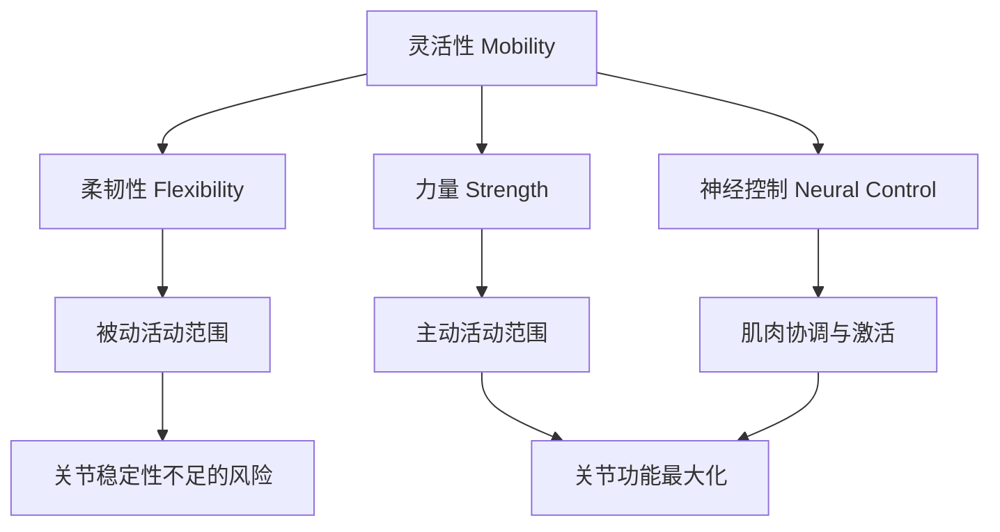

## 五、柔韧性与灵活性

柔韧性和灵活性是身体功能的基石——它们决定了你能否正确地完成动作、能否安全地增加负荷、能否在训练中持续进步而不会被伤病打断。很多人把大量时间花在力量和有氧上，却对柔韧性训练敷衍了事，最终在深蹲时"屁股眨眼"、卧推时肩痛、久坐后腰酸中付出代价。本章将从生理机制出发，系统讲解柔韧性与灵活性的本质差异、各类拉伸技术的原理与适用场景、全身关键部位的具体训练方案，以及如何将柔韧性训练科学地融入你的整体训练计划。

### 5.1 柔韧性与灵活性的本质区别

虽然"柔韧性"和"灵活性"在日常用语中经常互换使用，但在运动科学和康复医学中，它们是两个截然不同的概念。理解这个区别是制定有效训练方案的前提。

#### 柔韧性（Flexibility）

柔韧性是指**关节在外力作用下能够达到的最大活动范围**，它是一个静态属性。当你躺在地上，让别人帮你把腿抬起来，能达到的角度就是你的被动柔韧性。在这个过程中，你的肌肉是放松的，完全依赖外力来推动关节活动。

柔韧性的上限由以下因素决定：
- 关节的骨骼结构（髋臼的深度、肩关节窝的形状）
- 肌肉、肌腱、韧带和筋膜的延展性
- 神经系统对肌肉拉伸的容忍阈值

#### 灵活性（Mobility）

灵活性是指**在主动控制下，关节在整个活动范围内产生力量的能力**，它是一个动态属性。当你自己用力把腿踢到最高点，这就是灵活性的体现。灵活性要求你的大脑能够精确控制肌肉，在关节活动范围的每一个角度都能输出力量。

一个经典的例子可以说明两者的差异：一个柔韧性极好的人可以在外力帮助下完成全幅度的劈叉，但如果他缺乏灵活性，他自己可能无法主动把腿抬到一半的高度。反过来，一个柔韧性不足但灵活性好的人，可能在每个活动角度都有力量，但活动范围本身受限。

**核心公式：灵活性 = 柔韧性 + 力量 + 神经控制**

这个公式揭示了三个关键变量：

| 变量 | 含义 | 训练方式 |
|------|------|----------|
| 柔韧性 | 被动活动范围的上限 | 静态拉伸、PNF拉伸 |
| 力量 | 在活动范围内产生力量的能力 | 阻力训练、等长收缩 |
| 神经控制 | 大脑精确调度肌肉的能力 | 动态拉伸、动作练习 |

三者缺一不可。只有柔韧性没有力量，关节处于不稳定状态，容易受伤；只有力量没有柔韧性，动作幅度受限，训练效果打折；缺乏神经控制，则无法在运动中有效地利用已有的柔韧性和力量。

#### 为什么这个区别对健身者至关重要

很多健身者犯的错误是只追求柔韧性（通过长时间静态拉伸）而忽视灵活性。结果是他们获得了更大的被动活动范围，但无法在训练中安全地使用这个范围。正确的目标应该是**灵活性**——在每一个活动角度都有足够的控制力和力量。

具体到训练中的体现：
- **深蹲**：你不仅需要足够的踝关节和髋关节活动范围（柔韧性），还需要在深蹲底部保持核心稳定、膝盖外推的能力（灵活性）
- **卧推**：你不仅需要胸椎和肩关节的活动范围（柔韧性），还需要在负重下控制肩胛骨运动的能力（灵活性）
- **硬拉**：你不仅需要腘绳肌的延展性（柔韧性），还需要在髋关节铰链动作中精确控制骨盆位置的能力（灵活性）

### 5.2 柔韧性的生理机制

要有效地改善柔韧性，必须理解限制柔韧性的生理因素。这些因素共同决定了你的活动范围上限，而不同的限制因素需要不同的训练策略。

#### 5.2.1 关节结构——硬件限制

关节的骨骼结构是柔韧性的"硬上限"。髋关节是典型的球窝关节，肩关节也是，但两者的设计完全不同：

- **髋关节**：髋臼较深，关节窝包裹股骨头的比例更大，这意味着稳定性高但活动范围相对受限。髋臼的朝向、深度因人而异，直接决定了某些人天生髋关节活动范围就比别人大。
- **肩关节**：关节窝较浅，肱骨头与关节窝的接触面积小，因此活动范围极大（全身最大的活动范围）但稳定性较差。这是肩关节容易脱臼的原因。

骨骼结构是不可改变的。如果你的髋臼天生较深，你的髋关节外旋幅度可能永远无法达到那些髋臼较浅的人的水平。这不是训练的问题，而是解剖结构的限制。认识到这一点很重要，因为它可以帮助你设定合理的期望值，避免为了追求不切实际的活动范围而做出危险的动作。

#### 5.2.2 肌肉与筋膜——软组织因素

肌肉由肌纤维组成，肌纤维被筋膜包裹。筋膜是一种结缔组织，它像保鲜膜一样包裹着每一条肌纤维、每一束肌束、每一块完整的肌肉。筋膜的滑动性直接影响肌肉的延展能力。

影响筋膜质量的因素：
- **活动量**：长期不活动会导致筋膜脱水、粘连，失去弹性
- **运动模式**：重复同一动作会导致特定方向的筋膜增厚
- **水合状态**：脱水的筋膜更加僵硬
- **温度**：温暖的筋膜更柔软、更具延展性

筋膜粘连是很多人柔韧性受限的主要原因之一。当筋膜层之间出现粘连时，肌肉在收缩和伸展时的滑动受到限制，表现为某个角度的"卡顿感"。泡沫轴和筋膜球的放松工作，本质上就是为了打破这种粘连，恢复筋膜层之间的滑动性。

#### 5.2.3 神经系统——最被低估的限制因素

这是最关键也最容易被忽视的因素。神经系统通过两种感受器监控肌肉的拉伸状态：

**肌梭（Muscle Spindle）**
- 位于肌肉内部，监测肌肉的长度变化速度
- 当肌肉被快速拉伸时，肌梭触发牵张反射，让肌肉自动收缩以防止过度拉伸
- 这就是为什么快速拉伸反而会让肌肉更紧——你触发了保护机制
- 对训练的启示：拉伸应该是缓慢、可控的，给神经系统时间适应

**高尔基腱器官（Golgi Tendon Organ, GTO）**
- 位于肌腱中，监测肌肉的张力大小
- 当张力超过一定阈值时，GTO触发抑制反射，让肌肉放松以防止损伤
- 这就是PNF拉伸的原理：先主动收缩产生高张力，激活GTO，然后肌肉在随后的拉伸中更容易放松

理解这两个机制，就能明白为什么：
1. 长时间的静态拉伸（>30秒）比短时间的更有效——需要时间让神经系统适应
2. PNF拉伸比单纯的静态拉伸更有效——利用了GTO的抑制反射
3. 热身后的拉伸效果更好——温度提高了神经的可塑性
4. 恐惧和焦虑会限制柔韧性——交感神经兴奋会提高肌肉的基础张力

#### 5.2.4 影响柔韧性的其他因素

| 因素 | 影响程度 | 是否可控 | 说明 |
|------|----------|----------|------|
| 关节结构 | 高 | 不可控 | 骨骼形状决定活动范围上限 |
| 肌肉/筋膜状态 | 高 | 可控 | 通过拉伸、泡沫轴、按摩改善 |
| 神经系统敏感度 | 高 | 可控 | 通过渐进式暴露和放松训练调节 |
| 温度 | 中 | 可控 | 热身、热水浴、温暖环境 |
| 年龄 | 中 | 不可控 | 柔韧性在10-12岁达到峰值，之后逐渐下降 |
| 性别 | 低-中 | 不可控 | 女性通常比男性更柔软（雌激素影响韧带松弛度） |
| 训练史 | 高 | 可控 | 持续的拉伸训练可显著改善 |
| 疼痛和恐惧 | 高 | 可控 | 心理因素对神经系统的影响巨大 |
| 关节肿胀/炎症 | 中 | 可控 | 肿胀会机械性地限制关节活动范围 |
| 皮肤弹性 | 低 | 部分可控 | 水合状态和年龄影响皮肤延展性 |

### 5.3 拉伸技术的全面解析

不同的拉伸技术有不同的机制、适用场景和效果。选择正确的拉伸方式，以及在正确的时间使用它，比盲目地拉伸更重要。

#### 5.3.1 静态拉伸（Static Stretching）

**原理**：将肌肉拉伸到有轻微不适但不疼痛的位置，保持一定时间（通常15-60秒），让神经系统逐渐适应新的长度，降低肌梭的敏感性。

**具体做法**：
1. 缓慢进入拉伸位置，直到感觉到轻微的牵拉感
2. 保持不动，不要弹跳或继续加深
3. 呼吸放松，随每次呼气尝试轻微加深
4. 保持30-60秒（初学者从15-20秒开始）
5. 缓慢退出拉伸位置

**优点**：
- 简单易学，不需要特殊设备
- 可靠地改善被动活动范围
- 训练后进行可促进放松和恢复

**缺点**：
- 训练前进行静态拉伸可能降低力量输出（研究显示降幅可达5-7%）
- 对爆发力的影响更为显著（可达2-3%的降低）
- 效果需要长期坚持才能维持

**最佳时机**：训练后、休息日、睡前。**不建议**在力量训练前进行长时间的静态拉伸。

#### 5.3.2 动态拉伸（Dynamic Stretching）

**原理**：通过有控制的、全幅度的运动来活动关节，逐渐增加活动范围和肌肉温度。动态拉伸不仅拉伸肌肉，更重要的是激活神经肌肉系统，让身体准备好进行接下来的运动。

**具体做法**：
1. 选择与即将进行的训练相关的动作
2. 从小幅度开始，逐渐增加幅度
3. 每个动作重复10-15次
4. 动作流畅、有控制，不要用惯性甩动
5. 覆盖当天训练需要的所有关节

**常见动态拉伸动作**：

| 目标部位 | 动作 | 说明 |
|----------|------|------|
| 髋关节 | 行走弓步 | 每侧10步，注意后腿膝盖不触地 |
| 髋关节 | 腿摆（前后/左右） | 扶墙，每方向10次/侧 |
| 肩关节 | 手臂绕环 | 从小圈到大圈，每方向10次 |
| 肩关节 | 弹力带拉肩 | 外旋、内旋各10次 |
| 脊柱 | 猫牛式 | 10次，配合呼吸 |
| 全身 | 世界最伟大拉伸 | 每侧5次，覆盖髋、胸椎、肩 |

**优点**：
- 不降低力量输出，反而可能提升表现
- 提高核心温度和肌肉弹性
- 激活神经系统，改善本体感觉
- 与训练动作模式相似，具有迁移效果

**缺点**：
- 需要学习正确的动作形式
- 对最大活动范围的改善不如静态拉伸显著
- 初学者可能无法正确控制动作

**最佳时机**：训练前热身的主体部分，每次5-10分钟。

#### 5.3.3 PNF拉伸（Proprioceptive Neuromuscular Facilitation）

PNF拉伸是目前已知最有效的提高被动活动范围的方法。它通过利用神经系统来实现柔韧性的改善，而不是单纯地拉长肌肉。

**原理**：利用高尔基腱器官（GTO）的自体抑制效应。当你先主动收缩被拉伸的肌肉（等长收缩），产生的高张力激活GTO，随后在放松阶段，肌肉的张力阈值降低，允许更大的拉伸幅度。

**最常用的PNF模式——收缩-放松法（Contract-Relax）**：

步骤：
1. 将目标肌肉拉伸到轻微不适的位置（拉伸位）
2. 在这个位置，主动收缩被拉伸的肌肉，对抗阻力（如搭档的手、墙壁或弹力带），持续6-10秒，强度约为最大努力的60-80%
3. 放松2-3秒
4. 在呼气时进一步加深拉伸到新的位置
5. 重复3-4个循环

**变体——收缩-放松-收缩法（Contract-Relax-Agonist-Contract）**：
1. 同上步骤1-2（收缩目标肌肉）
2. 放松后，不仅被动拉伸，还主动收缩拮抗肌（与目标肌肉对抗的肌肉）
3. 这个变体效果更好，因为同时利用了GTO抑制和交互抑制两个神经机制

**注意事项**：
- PNF拉伸会产生较高的肌肉张力，不建议在训练前进行
- 如果有搭档协助，搭档需要理解适当的力度，不要过度施力
- 初学者建议在专业指导下进行
- 每块肌肉每周进行2-3次PNF拉伸即可看到明显改善

#### 5.3.4 弹震拉伸（Ballistic Stretching）

**原理**：利用快速、弹跳式的动作来超越当前的活动范围。

弹震拉伸是一种有争议的拉伸方式。它通过快速的、有节奏的弹跳动作，在活动范围的末端反复施加力量，试图突破神经系统的"保护壁垒"。

**为什么风险较高**：
- 快速拉伸强烈刺激肌梭，触发牵张反射，导致肌肉反射性收缩
- 在肌肉反射性收缩的同时继续施加外力，拉伤风险显著增加
- 没有给神经系统适应的时间

**例外情况**：某些高水平运动员（体操、武术）在充分热身后会使用弹震拉伸来准备需要爆发力的动作。但这是建立在他们已经拥有极好的柔韧性和控制力的基础上的。

**对普通健身者**：**不推荐**。用动态拉伸替代弹震拉伸，获得类似的效果但风险更低。

#### 5.3.5 泡沫轴/筋膜放松（Self-Myofascial Release）

**原理**：通过外部压力作用于筋膜和肌肉，打破筋膜层之间的粘连，增加筋膜的滑动性，同时通过机械压力刺激高尔基腱器官，产生局部放松效应。

**正确的泡沫轴使用方法**：
1. 将目标肌肉放在泡沫轴上
2. 用自身体重施加压力
3. 缓慢滚动，速度约为每秒1-2厘米
4. 当找到特别紧张或疼痛的点（"触发点"）时，在该点停留20-30秒
5. 在停留期间，可以进行轻微的关节屈伸动作（增加放松效果）
6. 覆盖整块肌肉，每个区域滚动1-2分钟

**常见误区**：
- ❌ 滚动太快——快速滚动只刺激皮肤感受器，无法深层放松筋膜
- ❌ 直接滚压骨骼或关节——只在肌肉组织上操作
- ❌ 在急性损伤部位滚压——会加重炎症
- ❌ 忍受剧痛——适度的不适是可以的，但剧痛会导致肌肉更加紧张
- ✅ 配合呼吸——深呼吸帮助激活副交感神经，促进放松

**不同工具的适用场景**：

| 工具 | 适用部位 | 压力深度 | 便携性 |
|------|----------|----------|--------|
| 大泡沫轴 | 大腿前后侧、背部 | 中等 | 较差 |
| 小泡沫轴 | 小腿、前臂 | 中等 | 较好 |
| 按摩球 | 深层触发点、臀部、肩胛骨周围 | 深 | 最好 |
| 筋膜枪 | 大面积肌肉群 | 中-深 | 中等 |
| 筋膜滚棒 | 小肌肉群、足底 | 浅-中 | 最好 |

### 5.4 为什么健身者必须重视柔韧性训练

很多健身者把柔韧性训练视为"加分项"或"可选项"，但实际上它是训练体系中不可或缺的基础环节。以下是具体原因：

#### 5.4.1 完成正确动作幅度的前提

每个复合动作都有其最佳的动作幅度，而这个幅度需要足够的关节灵活性来支撑：

- **深蹲**：髋关节屈曲需要至少110-120度，踝关节背屈需要至少15-20度。如果任何一个关节活动不足，就会出现代偿——骨盆后倾（"屁股眨眼"）、膝盖内扣、躯干过度前倾
- **卧推**：胸椎伸展不足会导致腰椎代偿性过度伸展，同时肩关节活动范围受限会增加肩袖损伤风险
- **过头推举**：肩关节屈曲和外旋需要至少170度的活动范围，胸椎伸展需要至少30度。不足时会出现腰椎过度前凸和肩关节撞击
- **硬拉**：腘绳肌柔韧性不足会导致弯腰拉起，增加腰椎间盘的压力

#### 5.4.2 预防代偿性损伤

当一个关节活动不足时，身体会自动寻找其他途径来完成动作。这种代偿模式是大多数慢性损伤的根源：

- 踝关节灵活性不足→膝盖内扣→ACL损伤风险增加
- 髋关节灵活性不足→腰椎代偿→下背痛
- 胸椎灵活性不足→肩关节代偿→肩峰撞击综合征
- 肩关节灵活性不足→肘关节代偿→肘部肌腱炎

研究表明，系统的柔韧性训练可以将运动损伤率降低约30%。这不是一个可忽略的数字——一次严重的伤病可能让你停训数月，而每天10-15分钟的柔韧性训练就能显著降低这个风险。

#### 5.4.3 改善恢复效率

拉伸和筋膜放松对恢复的贡献不仅限于"感觉好一些"。其生理机制包括：

- **促进静脉回流**：拉伸产生的肌肉泵效应帮助静脉血液回流心脏，加速代谢废物的清除
- **降低交感神经兴奋**：缓慢的拉伸配合深呼吸可以激活副交感神经系统，促进"休息和恢复"模式
- **减少延迟性肌肉酸痛（DOMS）**：虽然证据尚有争议，但多项meta分析显示训练后的拉伸可以将DOMS的严重程度降低约20%
- **改善睡眠质量**：睡前的轻柔拉伸可以降低肌肉紧张和交感神经兴奋，有助于更快入睡

#### 5.4.4 缓解久坐导致的肌肉失衡

现代人长时间坐在电脑前，会导致特定的肌肉缩短和延长模式，称为"上交叉综合征"和"下交叉综合征"：

**下交叉综合征（Lower Crossed Syndrome）**：
- 缩短紧张的肌肉：髂腰肌、股直肌、竖脊肌（腰段）
- 拉长无力的肌肉：臀大肌、腹肌
- 表现：骨盆前倾、腰椎过度前凸、下背痛

**上交叉综合征（Upper Crossed Syndrome）**：
- 缩短紧张的肌肉：上斜方肌、胸大肌、胸小肌、肩胛提肌
- 拉长无力的肌肉：颈深屈肌、下斜方肌、前锯肌
- 表现：圆肩、头前伸、肩颈疼痛

这些失衡仅靠力量训练无法解决——你必须针对性地拉伸缩短紧张的肌肉，同时强化拉长无力的肌肉。

### 5.5 全身关键部位灵活性训练方案

以下是按部位划分的详细训练方案。每个部位都包含评估方法、具体动作和进阶方案。

#### 5.5.1 髋关节灵活性

髋关节灵活性是深蹲、硬拉、弓步等所有下肢复合动作的基础。髋关节有六个自由度的运动（屈曲、伸展、外展、内收、外旋、内旋），每一个都可能成为限制因素。

**自我评估方法**：

**髋屈曲评估**：仰卧，抱住一侧膝盖拉向胸部，观察对侧腿是否能保持平放。如果对侧腿被拉起离开地面，说明髋屈曲不足（<120度）。

**髋外旋评估**：做90/90坐姿（前腿90度屈曲+外旋，后腿90度屈曲+内旋），观察两侧是否能对称坐稳。如果一侧明显困难，说明该侧外旋受限。

**髋内旋评估**：坐姿，双脚平放地面，膝盖分开向两侧旋转。正常髋内旋应达到30-40度。

**训练方案**：

| 动作 | 目标 | 组数×时间 | 频率 | 说明 |
|------|------|-----------|------|------|
| 90/90拉伸 | 髋外旋+内旋 | 3×30秒/侧 | 每天 | 逐渐将身体重心移向前腿和后腿 |
| 鸽子式拉伸 | 髋屈肌+外旋 | 3×30秒/侧 | 每天 | 前腿角度可调整以改变拉伸焦点 |
| 蚌式开合 | 髋外旋肌群激活 | 3×15次/侧 | 训练日 | 用弹力带增加阻力作为进阶 |
| 深蹲保持 | 全髋活动范围 | 3×30秒 | 每天 | 手持轻重量辅助保持平衡 |
| 跪姿髋屈肌拉伸 | 髋屈肌 | 2×30秒/侧 | 每天 | 收紧臀肌加深效果，避免腰椎代偿 |
| 相扑深蹲保持 | 髋内收肌 | 3×30秒 | 训练日 | 用肘部推膝盖向外 |

#### 5.5.2 踝关节灵活性

踝关节背屈不足是深蹲中"屁股眨眼"和膝盖内扣的最常见原因之一。正常的踝关节背屈应该至少达到15-20度（膝盖可以超过脚尖至少10厘米）。

**自我评估——面墙测试**：
1. 面对墙壁站立，脚尖距离墙壁约10厘米
2. 膝盖向前弯曲，尝试触碰墙壁，同时脚跟保持在地面上
3. 逐渐增加脚尖与墙壁的距离
4. 记录脚尖距离墙壁的最大距离（正常值：10-12厘米以上）
5. 两侧对比，差异超过1.5厘米提示单侧受限

**训练方案**：

| 动作 | 目标 | 组数×时间 | 频率 | 说明 |
|------|------|-----------|------|------|
| 面墙踝关节拉伸 | 背屈活动度 | 3×15次/侧 | 每天 | 膝盖对准第二脚趾方向 |
| 负重踝关节背屈 | 背屈力量+活动度 | 3×15次/侧 | 训练日 | 杠铃片放在膝盖上方 |
| 小腿泡沫轴放松 | 比目鱼肌/腓肠肌 | 2分钟/侧 | 每天 | 屈伸脚踝以增加效果 |
| 台阶小腿拉伸 | 小腿肌群 | 2×30秒/侧 | 每天 | 脚跟下沉超过台阶边缘 |
| 弹力带踝关节松动 | 关节囊活动度 | 2×15次/侧 | 每天 | 弹力带绕在踝关节前方，固定在后方 |

#### 5.5.3 胸椎灵活性

胸椎（T1-T12）的设计目的是提供躯干的旋转和一定的伸展。然而，久坐和低头看手机的习惯导致大多数人的胸椎僵硬在屈曲位，丧失了伸展和旋转能力。这直接导致肩关节和腰椎的代偿。

**自我评估——坐姿胸椎旋转**：
1. 四点跪姿，一只手放在头后
2. 旋转打开该侧手肘向天花板
3. 正常应该能看到手肘超过对侧肩膀的连线
4. 两侧对比，差异明显说明单侧旋转受限

**自我评估——仰卧胸椎伸展**：
1. 在上背部（肩胛骨下角水平）放一个泡沫轴
2. 双手抱头，缓慢向后伸展
3. 正常应该能在不产生腰椎代偿的情况下获得约30度的胸椎伸展

**训练方案**：

| 动作 | 目标 | 组数×时间 | 频率 | 说明 |
|------|------|-----------|------|------|
| 猫牛式 | 胸椎屈伸活动度 | 2×10次 | 每天 | 从尾骨开始逐节活动脊柱 |
| 胸椎旋转（开书式） | 旋转活动度 | 2×10次/侧 | 每天 | 侧卧，膝盖叠放，手臂打开 |
| 泡沫轴胸椎伸展 | 伸展活动度 | 2分钟 | 每天 | 滚动3-4个节段，每个停留15-20秒 |
| 坐姿胸椎旋转 | 旋转活动度 | 2×10次/侧 | 训练日 | 坐在脚跟上，双手合十旋转 |
| 四点跪姿胸椎侧屈 | 侧屈活动度 | 2×10次/侧 | 每天 | 一只手穿过身体下方，旋转加侧屈 |

#### 5.5.4 肩关节灵活性

肩关节是全身活动范围最大的关节，但也是最容易出现问题的关节。肩关节的灵活性训练需要关注多个维度：屈曲（手臂举过头顶）、外展、内旋（手背到背后）、外旋。

**自我评估——肩屈曲测试**：
1. 仰卧，双臂伸直举过头顶
2. 观察腰部是否离开地面
3. 如果腰部弓起离开地面，说明肩屈曲不足（<170度）

**自我评估——内旋摸背测试**：
1. 一只手从上方、另一只手从下方在背后互相触碰
2. 记录两手之间的距离
3. 正常应该能在1-2个椎体的距离内接触

**训练方案**：

| 动作 | 目标 | 组数×时间 | 频率 | 说明 |
|------|------|-----------|------|------|
| 弹力带肩袖热身 | 肩袖激活+外旋 | 2×15次 | 训练前 | 肘部贴紧身体，只做前臂旋转 |
| Wall Slide | 肩屈曲+肩胛控制 | 2×10次 | 每天 | 背靠墙，手臂贴墙上下滑动 |
| 跨体拉伸 | 内收肌群 | 30秒/侧 | 训练后 | 手臂伸直拉过身体，不耸肩 |
| 过头拉伸 | 肩屈曲 | 30秒 | 训练后 | 门框辅助或站姿双手举过头顶 |
| 胸肌门框拉伸 | 胸大肌/小肌 | 30秒/侧 | 每天 | 手臂放在门框上，身体前倾 |
| 肩关节内旋拉伸 | 内旋活动度 | 30秒/侧 | 每天 | 手背贴背，另一手轻推加深 |

#### 5.5.5 腕关节灵活性

腕关节灵活性常被忽视，但对于硬拉、卧推、推举等所有需要握住杠铃的动作至关重要。腕关节活动不足会导致握力代偿、前臂疼痛，甚至腕管综合征。

**训练方案**：
- 手腕绕环：每方向10次
- 手腕屈伸拉伸：每个方向30秒
- 祈祷式拉伸：手掌合十放于胸前，缓慢下压，30秒
- 前臂泡沫轴放松：每侧1分钟

#### 5.5.6 颈椎灵活性

颈椎灵活性受限常见于长期伏案工作的人群。需要注意的是，颈椎区域有重要的血管和神经通过，训练时必须格外小心。

**自我评估——颈椎旋转**：
- 坐姿，缓慢转头向一侧
- 正常应该能达到约70-80度（下巴接近肩膀）

**训练方案**（所有动作必须缓慢、轻柔）：
- 颈部缓慢环绕：每方向5次，注意不要过度后仰
- 颈部侧屈拉伸：手轻放头部侧面辅助，每侧15-20秒
- 颈部旋转拉伸：每侧15-20秒
- 颈部屈曲拉伸：下巴找胸骨，15-20秒
- 收下巴练习（颈深屈肌激活）：10次，每次保持5秒

### 5.6 柔韧性训练的系统安排

知道做什么很重要，知道什么时候做、做多少同样重要。以下是将柔韧性训练融入不同类型训练日的具体方案。

#### 5.6.1 训练前（5-10分钟）

**目标**：提高核心温度、激活目标肌肉、改善关节活动度

**方案**：
1. 3-5分钟低强度有氧（跳绳、慢跑、划船机）——提高体温
2. 泡沫轴放松当天训练重点部位——每个部位1分钟
3. 动态拉伸——针对当天训练涉及的关节，每个动作10-15次
4. 激活练习——针对当天训练中需要特别激活的肌肉（如深蹲前做蚌式开合激活臀中肌）

**训练前禁止**：长时间的静态拉伸（>15秒/个）、PNF拉伸、弹震拉伸

#### 5.6.2 训练后（5-10分钟）

**目标**：促进恢复、逐步改善柔韧性、降低交感神经兴奋

**方案**：
1. 3-5分钟低强度活动（慢走）——让心率逐渐恢复
2. 静态拉伸——每个训练过的肌群30-60秒，2-3组
3. 泡沫轴放松——重点放松训练中特别紧张的部位，每个部位1-2分钟
4. 深呼吸——5-10次腹式呼吸，激活副交感神经

#### 5.6.3 休息日（15-30分钟）

**目标**：全面改善柔韧性、处理积累的紧张和粘连

**方案**：
1. 泡沫轴全身放松——从下到上，覆盖所有主要肌群
2. 全身静态拉伸——重点关注平时训练中容易紧张的部位
3. 可选：瑜伽流动序列（如拜日式A）
4. 可选：针对特别受限的关节进行PNF拉伸

#### 5.6.4 周计划示例

| 日期 | 训练内容 | 柔韧性训练 |
|------|----------|------------|
| 周一 | 上肢力量 | 训练前：上肢动态拉伸5min；训练后：上肢静态拉伸+泡沫轴10min |
| 周二 | 下肢力量 | 训练前：下肢动态拉伸5min；训练后：下肢静态拉伸+泡沫轴10min |
| 周三 | 休息日 | 全身柔韧性训练20-30min（泡沫轴+静态拉伸+瑜伽） |
| 周四 | 推类训练 | 训练前：推类动态拉伸5min；训练后：推类静态拉伸10min |
| 周五 | 拉类训练 | 训练前：拉类动态拉伸5min；训练后：拉类静态拉伸10min |
| 周六 | 下肢/全身 | 训练前：全身动态拉伸5min；训练后：全身静态拉伸10min |
| 周日 | 休息日 | 重点部位灵活性专项训练15-20min |

### 5.7 常见误区与纠正

#### 误区一："拉伸越痛越有效"

**真相**：有效的拉伸应该产生的是"牵拉感"或轻微不适，而不是疼痛。疼痛是神经系统的警告信号，当疼痛发生时，神经系统会让肌肉更加紧张（保护性收缩），这与拉伸的目的完全相反。

**正确做法**：将拉伸强度控制在"6-7分不适"（0-10分量表，10分是剧痛）。能够保持正常呼吸、不咬牙、不憋气的程度。

#### 误区二："训练前必须拉伸"

**真相**：训练前需要的是动态拉伸（热身），而不是静态拉伸。多项研究证实，训练前的长时间静态拉伸会降低力量输出（约5-7%）和爆发力（约2-3%）。

**正确做法**：训练前做5-10分钟动态拉伸，将静态拉伸留到训练后。

#### 误区三："柔韧性越好越好"

**真相**：过度的柔韧性如果缺乏相应的力量支撑，反而会增加关节不稳定性和受伤风险。关节过度松弛（hypermobility）是一种需要警惕的状态，特别是在肩关节和膝关节。

**正确做法**：追求平衡——柔韧性和力量要同步发展。每次拉伸后都应该配合相应的力量训练。

#### 误区四："我天生就硬，拉伸没用"

**真相**：虽然关节结构确实是天生的，但大多数人柔韧性的主要限制因素是软组织（肌肉、筋膜）和神经系统，而不是骨骼结构。这些因素都是可以通过训练改善的。研究显示，坚持6-8周的系统拉伸训练可以显著改善关节活动范围（平均增加约20%）。

**正确做法**：从当前水平开始，设定合理的目标，坚持系统训练。每个人都有自己的天花板，但大多数人都远未达到它。

#### 误区五："泡沫轴可以替代拉伸"

**真相**：泡沫轴和拉伸的作用机制不同，不能互相替代。泡沫轴主要改善筋膜的滑动性和局部的肌肉紧张，而拉伸主要改善肌肉的延展性和神经系统的适应性。两者互补，最佳方案是将它们结合起来使用。

**正确做法**：先泡沫轴放松（改善筋膜质量），再进行拉伸（在更好的基础上增加活动范围）。

#### 误区六："拉伸一次就能永久保持效果"

**真相**：柔韧性的改善遵循"用进废退"的原则。研究显示，拉伸的效果在停止训练后约4周开始明显消退。这是因为柔韧性的改善涉及神经系统的适应，而神经系统需要持续的刺激来维持适应。

**正确做法**：将柔韧性训练作为日常训练的固定组成部分，而不是偶尔做一次的"额外任务"。即使每天只花5-10分钟，也比每周做一次长时间的柔韧性训练效果好。

### 5.8 进阶策略

#### 5.8.1 柔韧性训练的周期化

和力量训练一样，柔韧性训练也应该遵循周期化原则：

**第一阶段（第1-4周）——适应期**：
- 目标：建立习惯，改善基础活动度
- 方法：静态拉伸为主，每个位置30秒，2组
- 频率：每天

**第二阶段（第5-8周）——发展期**：
- 目标：主动增加活动范围
- 方法：引入PNF拉伸、弹力带辅助拉伸
- 频率：每天静态拉伸 + 每周2-3次PNF

**第三阶段（第9-12周）——整合期**：
- 目标：将新的活动范围融入训练动作
- 方法：在全幅度动作中使用新获得的活动范围，配合负重
- 频率：训练前动态拉伸 + 训练后静态拉伸

**维持期**：
- 目标：保持已获得的活动范围
- 方法：训练前动态拉伸 + 训练后静态拉伸
- 频率：每次训练

#### 5.8.2 结合呼吸的深度放松

呼吸是柔韧性训练中最被低估的工具。正确的呼吸可以激活副交感神经系统，降低肌肉的基础张力，让你在拉伸中达到更大的活动范围。

**4-7-8呼吸法在拉伸中的应用**：
1. 进入拉伸位置
2. 鼻子吸气4秒
3. 屏息7秒（在此期间放松被拉伸的肌肉）
4. 缓慢呼气8秒（在呼气时尝试轻微加深拉伸）
5. 重复3-4个循环

**膈肌呼吸对核心稳定性的影响**：
- 正确的膈肌呼吸可以同时改善核心稳定性和髋关节灵活性
- 吸气时腹部360度扩张（不仅向前），呼气时收紧核心
- 在深蹲底部保持膈肌呼吸，可以在稳定核心的同时让髋关节进一步放松

#### 5.8.3 针对特定运动的灵活性专项方案

**力量举运动员**：
- 重点：髋关节灵活性（深蹲）、胸椎灵活性（卧推）、腘绳肌柔韧性（硬拉）
- 特别关注：踝关节背屈（低杠深蹲需要更多）、肩关节内旋（卧推底部需要）

**跑步者**：
- 重点：髋屈肌拉伸（对抗久坐导致的缩短）、小腿肌群（预防跟腱炎）、髋关节旋转（改善跑姿）
- 特别关注：足底筋膜放松（预防足底筋膜炎）

**办公久坐人群**：
- 重点：髋屈肌、胸椎、颈椎、肩关节
- 特别推荐：每小时做2-3分钟的简单拉伸（站起、弓步、胸椎旋转、收下巴练习）

### 5.9 总结

柔韧性与灵活性训练不是可有可无的"附加项"，而是安全、高效训练的必要基础。关键要点回顾：

1. **灵活性 > 柔韧性**：追求的是主动控制下的活动范围，而非被动的松弛
2. **神经系统是关键**：大多数柔韧性限制来自神经系统，而非肌肉本身
3. **时机很重要**：训练前用动态拉伸，训练后用静态拉伸
4. **坚持是王道**：每天5-10分钟比偶尔做一次长时间训练效果好得多
5. **平衡发展**：柔韧性和力量要同步发展，避免过度松弛
6. **个性化方案**：根据自身评估结果，优先改善最受限的关节

记住：柔韧性训练的回报是长期的。它不会像力量训练那样给你立即可见的变化，但坚持3-6个月后，你会发现自己的动作质量、训练表现和身体感受都会发生质的改变。

