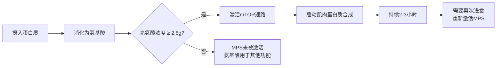
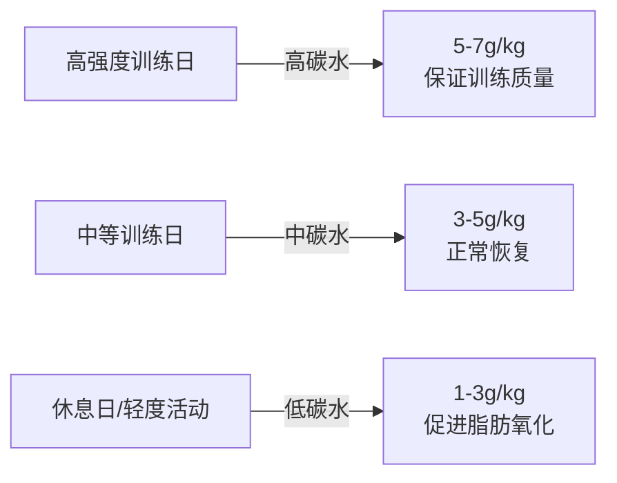
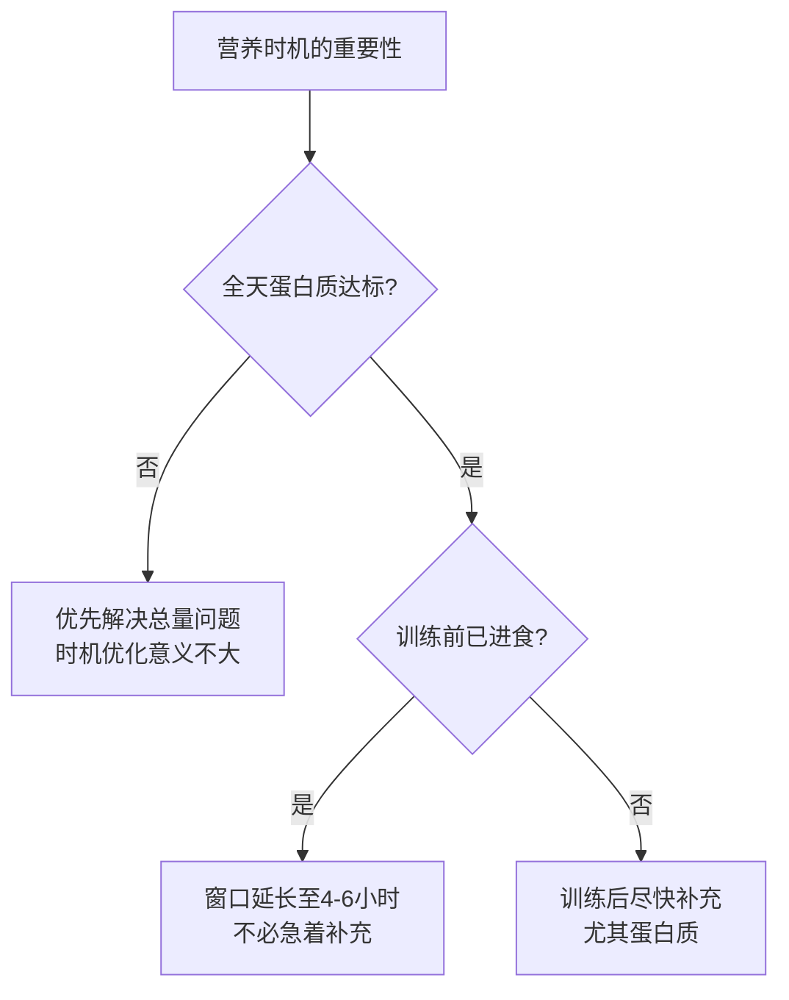
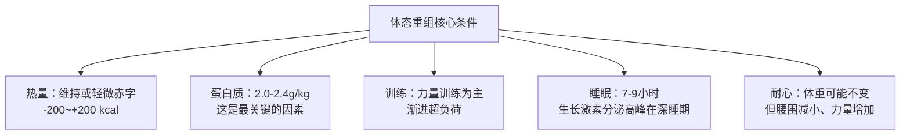
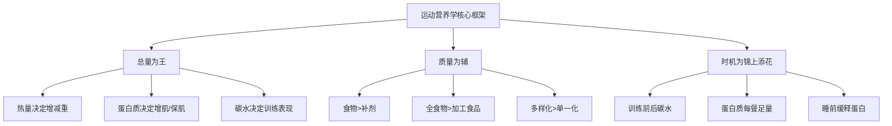

## 六、运动营养学

训练只是破坏肌肉纤维的过程，真正的成长发生在训练之外——当你吃下正确的食物、在正确的时间、以正确的量。运动营养学就是研究"如何吃得让训练效果最大化"的学科。本章从宏量营养素的生理机制讲起，逐步覆盖微量营养素、水分管理、补剂策略、营养时机、热量管理、代谢适应、体态重组，以及针对不同饮食模式和特殊场景的实操方案。

---

### 6.1 宏量营养素

宏量营养素（Macronutrients）是人体能量的三大来源：蛋白质、碳水化合物和脂肪。它们不仅提供热量，还各自承担独特的生理功能。理解它们的机制，是制定任何饮食计划的基础。

#### 蛋白质（Protein）

**生理机制**：

蛋白质由20种氨基酸组成，其中9种为必需氨基酸（EAA），人体无法自行合成，必须从食物中获取。蛋白质在体内执行的功能远不止"长肌肉"：

- **肌肉蛋白质合成（MPS）**：训练造成肌纤维微损伤后，身体利用氨基酸修复并加粗肌纤维，这是肌肉增长的核心机制。mTOR（哺乳动物雷帕霉素靶蛋白）通路是调控MPS的关键信号通路，亮氨酸（Leucine）是激活该通路的最强信号分子。
- **酶与激素合成**：消化酶、代谢酶、胰岛素、生长激素等均为蛋白质或其衍生物。
- **免疫功能**：抗体（免疫球蛋白）本质是蛋白质，蛋白质摄入不足会直接削弱免疫力。
- **运输功能**：血红蛋白运输氧气，白蛋白维持血液渗透压。
- **能量供应**：当碳水和脂肪不足时，蛋白质可通过糖异生提供4 kcal/g能量，但这是一种浪费——用珍贵的氨基酸去供能，好比烧家具取暖。

**推荐摄入量**：

| 目标 | 每公斤体重 | 67kg体重 | 说明 |
|------|-----------|---------|------|
| 维持健康 | 0.8-1.0g | 54-67g | WHO最低标准，健身人群应更高 |
| 增肌 | 1.6-2.2g | 107-147g | 2018年meta分析确认的最优区间 |
| 减脂 | 2.0-2.4g | 134-161g | 高蛋白在热量赤字下保护肌肉 |
| 受伤恢复 | 2.0-2.5g | 134-168g | 组织修复需要额外氨基酸 |

> **关于1.6g/kg的科学依据**：2018年发表在*British Journal of Sports Medicine*上的荟萃分析（Morton et al.）纳入了49项研究、1863名受试者，结论是蛋白质摄入超过1.6 g/kg/天后，增肌收益趋于平台。但对于训练有素的个体或处于热量赤字状态时，适当提高到2.0-2.2 g/kg仍然合理。

**优质蛋白质来源**：

| 食物 | 每100g蛋白质含量 | PDCAAS评分 | 特点 |
|------|-----------------|-----------|------|
| 鸡胸肉 | 31g | 1.00 | 低脂、高蛋白、性价比最高 |
| 鸡蛋（全蛋） | 13g（每枚约6g） | 1.00 | 完全蛋白质，蛋黄含胆碱和维生素D |
| 牛肉（瘦肉） | 26g | 0.92 | 富含肌酸、铁、锌、B12 |
| 三文鱼 | 20g | 1.00 | 同时提供优质脂肪（Omega-3） |
| 虾 | 20g | 1.00 | 极低脂肪，适合严格控脂期 |
| 希腊酸奶 | 10g | 1.00 | 含益生菌，酪蛋白为主，缓释吸收 |
| 牛奶 | 3.4g | 1.00 | 乳清+酪蛋白组合，训练后恢复佳 |
| 豆腐 | 8g | 0.56 | 植物蛋白，需搭配谷物补全氨基酸 |
| 鸡胸肉肠 | 18g | 0.95 | 方便携带，注意钠含量 |
| 乳清蛋白粉 | 80g（每100g粉末） | 1.00 | 吸收快，亮氨酸含量高 |

> **PDCAAS（蛋白质消化率校正氨基酸评分）**：满分1.0表示该蛋白质能完全满足人体氨基酸需求。动物蛋白普遍为1.0，单一植物蛋白通常在0.4-0.7之间，但通过"蛋白质互补"（如豆类+谷物）可以达到1.0。

**亮氨酸阈值与mTOR通路**：

每次进食蛋白质时，需要达到约2-3克亮氨酸（相当于20-40克优质动物蛋白）才能有效激活mTOR通路，启动肌肉蛋白质合成。这解释了为什么"少量多餐"不如"每餐足量"有效——如果你每餐只吃10克蛋白质，亮氨酸浓度达不到阈值，MPS就不会被充分激活。

**蛋白质分配策略**：

- **分散摄入**：将每日蛋白质分配到3-5餐中，每餐20-40克
- **训练后优先**：训练后30-60分钟内摄入20-40克快速吸收蛋白质（乳清蛋白最佳）
- **睡前缓释**：睡前30克酪蛋白（或400ml牛奶）可在睡眠期间持续提供氨基酸
- **早餐补齐**：大多数人早餐蛋白质严重不足（只吃包子/面包），应刻意加入鸡蛋或蛋白粉

**蛋白质摄入的常见误区**：

| 误区 | 事实 |
|------|------|
| "吃太多蛋白质伤肾" | 健康人群摄入2.2g/kg蛋白质无肾损伤证据（Poortmans & Dellalieux, 2000）。已有肾脏疾病者需遵医嘱限制蛋白质 |
| "植物蛋白不如动物蛋白" | 单一植物蛋白确实氨基酸谱不完整，但通过搭配（如米饭+豆类）可以互补。纯素食者需注意总摄入量略高10-20% |
| "蛋白质越多越好" | 超过2.4g/kg后，多余氨基酸主要被氧化供能或转化为尿素排出，边际收益极低 |
| "蛋白粉是必需品" | 蛋白粉只是方便的蛋白质来源，其本质和鸡胸肉没有区别。食物摄入充足时不需要额外补充 |

#### 碳水化合物（Carbohydrate）

**生理机制**：

碳水化合物是人体最高效的能量来源，尤其对高强度运动至关重要。

- **糖原储备**：碳水消化后以糖原形式储存在肝脏（约100g）和肌肉中（约400g，取决于肌肉量和训练水平）。肌糖原是高强度训练的直接燃料——当你做深蹲冲刺组时，燃烧的就是肌糖原。
- **血糖调节**：大脑每天需要约120g葡萄糖来维持正常功能。碳水摄入不足时，身体通过糖异生（从氨基酸和甘油合成葡萄糖）来维持血糖，这会消耗肌肉蛋白质。
- **胰岛素分泌**：碳水刺激胰岛素释放，胰岛素不仅是合成代谢激素（促进氨基酸进入肌肉细胞），还能抑制皮质醇（分解代谢激素）。
- **节省蛋白质**：充足的碳水摄入可以避免身体动用蛋白质供能，让氨基酸专注于修复和构建肌肉组织。

**推荐摄入量**：

| 目标 | 每公斤体重 | 67kg体重 | 说明 |
|------|-----------|---------|------|
| 维持 | 3-5g | 201-335g | 日常活动+轻度训练 |
| 增肌 | 4-7g | 268-469g | 需要充足能量支持训练和恢复 |
| 减脂 | 2-4g | 134-268g | 在热量赤字中优先保证蛋白质后，剩余热量给碳水 |
| 高强度训练 | 5-8g | 335-536g | 耐力运动员或每天训练2小时以上 |
| 赛前糖原超量储存 | 8-12g | 536-804g | 比赛前1-3天，仅用于竞技场景 |

**碳水化合物的分类**：

| 类型 | 代表食物 | GI值范围 | 消化速度 | 最佳使用时机 |
|------|----------|---------|----------|-------------|
| **简单碳水（高GI）** | 白米饭、白面包、葡萄糖、运动饮料 | 70-100 | 快（15-30分钟） | 训练后30分钟内、比赛中 |
| **复杂碳水（中GI）** | 糙米、燕麦、红薯、意面 | 55-70 | 中（1-2小时） | 训练前2-3小时 |
| **复合碳水（低GI）** | 全麦面包、豆类、荞麦 | 35-55 | 慢（2-4小时） | 日常饮食、减脂期 |
| **纤维类碳水** | 蔬菜、奇亚籽、洋车前子壳 | <15 | 极慢 | 每餐搭配，增加饱腹感 |

> **GI值不是唯一标准**：血糖负荷（GL = GI × 碳水含量/100）比GI更实用。西瓜GI高达72，但一份西瓜的GL只有4-5（因为含水量高，实际碳水很少），对血糖的影响远小于你想象的。

**碳水周期化（Carb Cycling）**：

碳水周期化是根据训练强度动态调整碳水摄入的策略，在减脂期尤其有效：

- **训练日**：碳水摄入较高，尤其是训练前后各占当日碳水总量的30-40%
- **休息日**：碳水摄入降低至维持量的50-70%，脂肪和蛋白质比例相应提高
- **减脂期**：碳水集中在训练前后（占全天70%），其他时间以蛋白质+蔬菜+健康脂肪为主
- **增肌期**：碳水均匀分配在各餐中，确保全天能量充沛

#### 脂肪（Fat）

**生理机制**：

脂肪的名声不好，但它是维持生命和训练效果不可或缺的营养素。

- **激素合成**：睾酮、雌激素、皮质醇等类固醇激素均由胆固醇转化而来。长期极低脂饮食（脂肪<15%总热量）会显著降低睾酮水平。一项研究（Hamalainen et al., 1984）显示，将脂肪摄入从总热量的40%降至25%后，受试者睾酮水平下降了约15%。
- **脂溶性维生素吸收**：维生素A、D、E、K必须溶解在脂肪中才能被肠道吸收。一盘水煮蔬菜不加任何油脂，其中的维生素A和K大部分会被浪费。
- **细胞膜结构**：每个细胞的磷脂双分子层都需要脂肪酸来构建。
- **能量储备**：脂肪是人体最大的能量仓库，每克提供9 kcal——是碳水或蛋白质的2倍以上。一个体脂率15%的70kg男性，体内储存的脂肪约10.5kg，相当于94,500 kcal能量，足够在不进食的情况下存活数周。
- **Omega-3的抗炎作用**：EPA和DHA能竞争性抑制花生四烯酸（Omega-6）的促炎代谢通路，降低运动后的系统性炎症反应。

**推荐摄入量**：

- 占每日总热量的25-35%（不低于20%，否则影响激素水平）
- 每公斤体重0.8-1.2克
- 对于67kg体重：约54-80克/天

**脂肪的分类与选择**：

| 类型 | 食物来源 | 对健康的影响 | 每日建议 |
|------|----------|-------------|----------|
| **单不饱和脂肪（MUFA）** | 橄榄油、牛油果、杏仁、花生 | 降低LDL胆固醇，保护心血管 | 占脂肪总量的15-20% |
| **Omega-3（EPA/DHA）** | 三文鱼、沙丁鱼、鱼油补剂 | 强效抗炎，保护心脏和关节 | EPA+DHA总量1-3g/天 |
| **Omega-3（ALA）** | 亚麻籽、奇亚籽、核桃 | 需转化为EPA/DHA才有效，转化率仅5-10% | 作为辅助来源 |
| **Omega-6（LA）** | 大豆油、玉米油、葵花籽油 | 适量必要，过量促炎 | 控制总量 |
| **饱和脂肪** | 红肉、黄油、椰子油、蛋黄 | 适量可接受（<10%总热量），并非洪水猛兽 | 适量 |
| **反式脂肪** | 人造黄油、部分氢化植物油、反复油炸食品 | 明确有害：升高LDL、降低HDL、增加心血管风险 | 彻底避免 |

**Omega-3与Omega-6的平衡**：

理想比例为1:1到1:4，但现代加工饮食中比例常达1:15甚至1:20，过度偏向Omega-6会促进全身性慢性炎症。改善方法：

- 每周吃2-3次深海鱼（三文鱼、鲭鱼、沙丁鱼）
- 减少使用大豆油、玉米油烹饪，改用橄榄油或牛油果油
- 每天1汤匙亚麻籽粉或2-3颗核桃作为Omega-3补充
- 考虑额外补充鱼油（选择EPA含量高于DHA的产品，抗炎效果更好）

---

### 6.2 微量营养素

微量营养素不提供热量，但作为辅酶和辅因子参与几乎所有的代谢反应。缺乏任何一种都可能成为训练表现和恢复的瓶颈。

#### 维生素

| 维生素 | 核心功能 | 与训练的关系 | 缺乏症状 | 最佳食物来源 | RDA（成年男性） |
|--------|---------|-------------|----------|-------------|----------------|
| **维生素D** | 促进钙吸收，调节免疫，参与睾酮合成 | 缺乏可使睾酮降低20-30%；增加应力性骨折风险 | 骨痛、肌肉无力、免疫力下降 | 阳光照射（15-30分钟/天）、鱼油、蛋黄、强化食品 | 600-1000 IU（很多人需要2000-4000 IU） |
| **维生素C** | 强效抗氧化剂，合成胶原蛋白的关键辅因子 | 促进肌腱、韧带、关节软骨的修复；但训练后立即大剂量可能抑制适应性 | 牙龈出血、伤口愈合慢、疲劳 | 柑橘、猕猴桃、彩椒、西兰花 | 90mg |
| **B族维生素** | B1能量代谢、B6氨基酸代谢、B12红细胞生成、叶酸DNA合成 | 训练增加B族消耗；素食者易缺B12 | 疲劳、贫血、神经症状 | 全谷物、瘦肉、蛋类、深绿蔬菜 | 因种类而异 |
| **维生素E** | 脂溶性抗氧化剂，保护细胞膜 | 减少运动诱导的氧化损伤；但超大剂量（>400IU）可能有害 | 少见缺乏，可致神经病变 | 杏仁、葵花籽、牛油果 | 15mg |
| **维生素A** | 视觉、免疫、上皮组织健康 | 维持呼吸道和消化道黏膜完整性，减少训练期感染 | 夜盲、皮肤干燥 | 动物肝脏、胡萝卜、红薯（β-胡萝卜素转化） | 900mcg RAE |
| **维生素K** | 凝血因子合成，骨钙素羧化 | 与维生素D协同维护骨骼健康 | 凝血异常、骨质疏松风险 | 纳豆（K2最佳来源）、菠菜、羽衣甘蓝 | 120mcg |

> **关于维生素C和训练适应的争议**：2009年发表在*PNAS*的研究（Gomez-Cabrera et al.）发现，大剂量维生素C（1000mg/天）可能抑制线粒体生物发生相关的信号通路，削弱耐力训练的适应性。建议：日常通过食物获取充足的维生素C，训练后2小时内避免大剂量补充。

#### 矿物质

| 矿物质 | 核心功能 | 与训练的关系 | 缺乏风险 | 最佳食物来源 | RDA（成年男性） |
|--------|---------|-------------|----------|-------------|----------------|
| **钙** | 骨骼和牙齿结构，肌肉收缩，神经传导 | 力量训练对骨密度要求高；低钙增加应力性骨折风险 | 骨质疏松、肌肉痉挛 | 牛奶、酸奶、豆腐（卤水点）、西兰花、小鱼干 | 1000mg |
| **铁** | 血红蛋白和肌红蛋白的核心组分 | 直接决定携氧能力和有氧运动表现；女性运动员和素食者缺铁风险高 | 贫血、运动耐力下降、疲劳 | 红肉（血红素铁吸收率20-30%）、菠菜（非血红素铁，需配合维C） | 8mg |
| **锌** | 300+种酶的辅因子，参与睾酮合成和免疫功能 | 训练出汗丢失锌；缺锌可降低睾酮和生长激素 | 免疫力下降、伤口愈合慢、味觉减退 | 牡蛎（锌含量之王：每100g含71mg）、牛肉、南瓜子 | 11mg |
| **镁** | 参与300+种酶反应，肌肉放松，神经稳定 | 防止夜间抽筋，促进睡眠质量，参与ATP代谢 | 肌肉痉挛、睡眠障碍、心律异常 | 南瓜子、黑巧克力、菠菜、杏仁 | 400-420mg |
| **钠** | 维持体液平衡，神经传导 | 大量出汗时流失最快；低钠可致低钠血症（危险） | 抽筋、恶心、头晕（严重时危及生命） | 食盐、运动饮料 | 1500-2300mg（出汗多时可增加） |
| **钾** | 维持细胞内外液平衡，心脏功能 | 与钠协同调节电解质平衡；出汗丢失 | 肌肉无力、心律失常 | 香蕉、土豆、牛油果、椰子水 | 3400mg |
| **硒** | 甲状腺激素代谢，谷胱甘肽过氧化物酶组分 | 甲状腺功能影响基础代谢率 | 甲状腺功能异常、免疫力下降 | 巴西坚果（1-2颗/天即满足RDA）、海鲜 | 55mcg |

**健身人群最易缺乏的三种矿物质**：

1. **镁**：现代土壤镁含量下降，加上出汗流失，约50%的人镁摄入不足
2. **锌**：高蛋白饮食和大量出汗加速锌的消耗
3. **铁**：女性运动员尤其高危（月经+训练双重流失），素食者次之

---

### 6.3 水分与电解质管理

水是最容易被忽视的营养素，也是最立竿见影的——脱水仅2%（70kg体重流失1.4L）就会导致训练表现下降10-20%。

#### 每日水分需求

| 场景 | 需求量 | 计算方式 |
|------|--------|---------|
| 基本需求 | 2.0-2.5L | 体重(kg) × 30-35ml |
| 训练日额外 | +500-1000ml | 根据出汗量调整 |
| 炎热/高湿环境 | +500-1000ml | 环境温度每升高5°C多补250ml |
| 高蛋白饮食额外 | +500ml | 蛋白质代谢产生尿素，需要更多水排出 |

**判断脱水的简易方法**：

- **尿液颜色**：浅柠檬色=水分充足，深黄色=需要喝水，琥珀色/棕色=严重脱水
- **体重变化**：训练前后称重，差值即为汗液丢失量
- **口渴感**：当你感到口渴时，身体已经脱水约1-2%，不应以口渴作为唯一的喝水信号

#### 训练中水分补充方案

| 时间节点 | 补充量 | 内容 |
|----------|--------|------|
| 训练前2-3小时 | 400-600ml | 纯水即可 |
| 训练前15分钟 | 200-300ml | 纯水或低渗运动饮料 |
| 训练中每15-20分钟 | 150-250ml | <60min用纯水，>60min用含电解质+碳水的运动饮料 |
| 训练后 | 丢失量×1.5 | 含钠饮品促进水分保留（纯水利尿反而不利恢复） |

#### 电解质的精确补充

| 电解质 | 每升汗液丢失量 | 功能 | 补充方式 |
|--------|---------------|------|----------|
| 钠 | 800-1500mg | 维持体液容量，防止低钠血症 | 运动饮料（含钠400-800mg/L）、盐丸 |
| 钾 | 150-300mg | 神经肌肉功能 | 香蕉、椰子水、土豆 |
| 镁 | 10-15mg | 防抽筋，ATP代谢 | 运动饮料、镁补剂 |
| 钙 | 15-50mg | 肌肉收缩 | 牛奶、酸奶 |

> **自制运动饮料配方**（成本不到商业产品的1/10）：1L水 + 1/4茶匙食盐（约500mg钠）+ 200ml果汁（提供碳水和钾）+ 适量蜂蜜调甜。经济实惠，效果等同。

---

### 6.4 运动补剂——哪些有效，哪些是智商税

补剂行业充斥着营销炒作，但确实有少数补剂经过严格的科学验证。以下按证据强度分级。

#### 一级：强证据支持

| 补剂 | 剂量 | 作用机制 | 效果 | 使用方法 |
|------|------|---------|------|---------|
| **肌酸（Creatine Monohydrate）** | 3-5g/天 | 增加肌肉磷酸肌酸储备，加速ATP再合成 | 力量提升5-15%，高强度运动表现提升，可能促进肌肉生长 | 每天固定时间服用，无需冲击期。训练日可随训后餐服用 |
| **咖啡因（Caffeine）** | 3-6mg/kg体重 | 拮抗腺苷受体，降低疲劳感知，促进脂肪酸动员 | 耐力提升3-5%，力量和爆发力小幅提升 | 训练前30-60分钟服用。200mg≈1杯美式咖啡 |
| **乳清蛋白（Whey Protein）** | 20-40g/次 | 快速吸收，亮氨酸含量高（约10%），快速激活MPS | 方便补充蛋白质，尤其训练后 | 训练后30分钟内。不是必需品，但确实方便 |
| **维生素D** | 2000-4000 IU/天 | 调节钙代谢、免疫功能、激素合成 | 纠正缺乏后可提升睾酮水平和免疫功能 | 随含脂肪的餐食服用（脂溶性）。先检测血清25(OH)D水平 |

#### 二级：中等证据

| 补剂 | 剂量 | 作用 | 注意事项 |
|------|------|------|---------|
| **β-丙氨酸（Beta-Alanine）** | 3-6g/天（分次） | 增加肌肉肌肽含量，缓冲酸性环境，延迟疲劳 | 主要对1-4分钟的高强度运动有效。可引起皮肤刺痛（无害） |
| **瓜氨酸（Citrulline）** | 6-8g L-瓜氨酸 | 促进一氧化氮合成，改善血流和"泵感" | 可能减少肌肉酸痛，提升高次数训练表现 |
| **鱼油（Omega-3）** | EPA+DHA 2-3g/天 | 抗炎，可能减少延迟性肌肉酸痛，保护关节 | 选择EPA含量高于DHA的产品。低温保存 |
| **HMB（β-羟基-β-甲基丁酸）** | 3g/天 | 亮氨酸代谢产物，可能减少肌肉分解 | 对新手和热量赤字状态下效果更明显。已有训练基础者收益有限 |

#### 三级：证据薄弱或不推荐

| 补剂 | 常见宣传 | 实际证据 |
|------|---------|---------|
| **BCAA** | "促进肌肉合成" | 如果你已摄入足够蛋白质（>1.6g/kg），BCAA完全多余。它只含3种氨基酸，不如EAA或乳清蛋白完整 |
| **睾酮增强剂** | "自然提升睾酮" | 绝大多数产品无临床证据。真正有效的药物（合成代谢类固醇）是违禁品 |
| **脂肪燃烧器** | "加速燃脂" | 核心成分通常是咖啡因+辣椒素。单独使用效果微乎其微，不如多做20分钟有氧 |
| **谷氨酰胺** | "增强免疫、促进恢复" | 对健康人群无额外收益。肠道修复和免疫缺陷人群可能需要 |
| **CLA（共轭亚油酸）** | "减少体脂" | 人体研究效果不一致，且可能影响胰岛素敏感性 |

> **补剂优先级排序**：如果你的预算有限，按以下顺序投入：（1）肌酸（最便宜且最有效的补剂，每月约30-50元），（2）蛋白粉（如果食物蛋白不足），（3）维生素D（如果日照不足或检测缺乏），（4）鱼油（如果不常吃鱼），（5）咖啡因（训练前提神）。其他补剂的性价比远低于以上五种。

---

### 6.5 营养时机（Nutrient Timing）

营养时机的重要性不如总摄入量和食物质量，但在总摄入量已经达标的前提下，优化时机可以进一步提升训练效果和恢复速度。

#### 训练前（1-3小时）

**目标**：为训练储备能量，预防肌肉分解

| 营养素 | 推荐量 | 食物选择 |
|--------|--------|---------|
| 碳水化合物 | 1-2g/kg体重 | 米饭、燕麦、红薯、面包 |
| 蛋白质 | 20-30g | 鸡胸肉、鸡蛋、蛋白粉 |
| 脂肪 | 少量 | 低脂肪食物为主（脂肪减慢消化） |
| 膳食纤维 | 少量 | 避免高纤维食物（可能导致胀气） |

**示例餐单**（训练前2小时）：一碗白米饭（200g）+ 一块鸡胸肉（150g）+ 少量蔬菜

#### 训练中

| 训练时长 | 补充建议 |
|----------|---------|
| <45分钟 | 纯水即可 |
| 45-60分钟 | 纯水，可能需要少量碳水 |
| 60-90分钟 | 每小时30-60g碳水（运动饮料或能量胶）+ 电解质 |
| >90分钟 | 每小时60-90g碳水（混合葡萄糖+果糖可提高吸收率）+ 电解质 |

> **混合糖源策略**：同时摄入葡萄糖和果糖可以利用两种不同的肠道转运蛋白（SGLT1和GLUT5），将碳水吸收率从约60g/小时提升到90g/小时甚至更高。这就是为什么很多运动饮料使用"葡萄糖+果糖"的2:1配比。

#### 训练后（0-2小时）

**目标**：启动肌肉修复，补充糖原

| 营养素 | 推荐量 | 说明 |
|--------|--------|------|
| 蛋白质 | 20-40g | 乳清蛋白或高蛋白餐 |
| 碳水化合物 | 0.5-1.0g/kg体重 | 高GI碳水优先，快速补充糖原 |
| 水分 | 丢失量×1.5 | 含钠饮品效果更好 |

**关于"合成代谢窗口"的真相**：

过去流行的"30分钟黄金窗口"理论过于简化了。2013年*Amino Acids*杂志的综述（Aragon & Schoenfeld）指出：

- 如果训练前1-3小时已进食含蛋白质的餐食，训练后的"窗口"可以延长到4-6小时
- 如果是空腹训练，训练后尽快补充蛋白质确实更重要
- **全天总摄入量**才是决定因素，单次进食时机的影响远小于你以为的

---

### 6.6 热量平衡与体重管理

所有体重管理的根本法则：**热量守恒**。无论你采用什么饮食法，减脂的本质是热量赤字，增肌的本质是热量盈余。

#### 基础代谢率（BMR）计算

**Mifflin-St Jeor公式**（目前最准确的估算公式，误差约±10%）：

男性：BMR = 10 × 体重(kg) + 6.25 × 身高(cm) - 5 × 年龄 + 5
女性：BMR = 10 × 体重(kg) + 6.25 × 身高(cm) - 5 × 年龄 - 161

> 其他常见公式：Harris-Benedict（偏高估）、Katch-McArdle（需要体脂率数据，对于有准确体脂率的人更精确）。

#### 每日总能量消耗（TDEE）

TDEE = BMR × 活动系数

| 活动水平 | 活动系数 | 典型场景 |
|----------|----------|---------|
| 久坐不动 | 1.2 | 办公室工作，不运动 |
| 轻度活动 | 1.375 | 每周1-3次轻度运动或走路为主 |
| 中度活动 | 1.55 | 每周3-5次力量训练（每次45-60分钟） |
| 高度活动 | 1.725 | 每周6-7次训练，或体力劳动者 |
| 极高活动 | 1.9 | 每天训练2次以上+体力劳动 |

**实际操作建议**：用公式算出TDEE后，以此为起点记录体重2周。如果体重稳定，说明该TDEE基本准确；如果体重上升，说明实际TDEE偏低，需要下调。

#### 热量目标设定

| 目标 | 每日热量调整 | 每周体重变化 | 适用情况 | 持续时间建议 |
|------|------------|-------------|----------|-------------|
| 激进减脂 | -750 kcal | -0.7kg | **不推荐**，肌肉流失严重 | 不建议 |
| 标准减脂 | -500 kcal | -0.5kg | 体脂较高（男>20%，女>30%） | 8-16周 |
| 温和减脂 | -250~350 kcal | -0.25-0.35kg | **推荐**，最大限度保留肌肉 | 12-24周 |
| 维持/体态重组 | ±0~100 kcal | 基本不变 | 训练新手或高体脂者 | 持续 |
| 温和增肌 | +200-300 kcal | +0.2-0.3kg | **推荐**，脂肪增加最少 | 持续或周期化 |
| 标准增肌 | +400-500 kcal | +0.4-0.5kg | 瘦体型、新手期 | 3-6个月 |

> **增肌期脂肪控制**：每周体重增加超过0.5kg时，增加的体重中脂肪比例会显著上升。建议每2周称重取平均值，涨速超过预期时减少100-200kcal。

#### 热量追踪的实操方法

**食物称重法（最准确）**：

1. 买一个厨房电子秤（精度1g，价格30-80元）
2. 使用食物记录App（薄荷健康、MyFitnessPal、FatSecret）
3. 所有食物生重称量（熟重误差较大）
4. 食用油、调料酱计入热量（这是最容易被忽略的热量来源——1汤匙食用油=约120kcal）
5. 记录至少2周形成直觉，之后可以逐步减少称量频率

**手掌估算法（简便但粗略）**：

| 营养素 | 一份量 | 约等于 |
|--------|--------|--------|
| 蛋白质（肉/鱼） | 1个手掌大小和厚度 | 25-30g蛋白质 |
| 碳水化合物（米饭/面条） | 1个拳头大小 | 30-40g碳水 |
| 蔬菜 | 1个双手捧 | 约80g |
| 脂肪（坚果/油） | 1个拇指尖 | 约5-7g脂肪 |

---

### 6.7 代谢适应与饮食策略

长期热量赤字后，身体会启动一系列"节能模式"，这就是为什么减肥到后期越来越难——你的身体在拼命抵抗体重下降。

#### 代谢适应的表现

| 适应机制 | 具体变化 | 影响 |
|----------|---------|------|
| BMR下降 | 体重减轻后基础代谢所需热量减少 | TDEE随之下降，同样的赤字效果减弱 |
| NEAT下降 | 非运动活动产热减少（少走动、少抖腿、少转头） | 可减少200-400kcal/天的能量消耗 |
| 甲状腺激素下降 | T3（活性甲状腺激素）水平降低 | 进一步降低代谢率5-15% |
| 饥饿激素升高 | Ghrelin水平上升 | 食欲显著增加，意志力消耗加剧 |
| 饱腹激素下降 | Leptin水平下降 | 吃同样的食物却觉得不饱 |
| 训练动力下降 | 多巴胺和去甲肾上腺素水平变化 | 训练强度和意愿下降 |

#### 对抗代谢适应的五大策略

**策略一：Refeed Day（高碳水恢复日）**

- **频率**：减脂期每周1-2天
- **做法**：将碳水摄入提高到维持水平甚至略高（5-7g/kg），蛋白质保持不变，脂肪适当降低
- **原理**：碳水是最能刺激瘦素（Leptin）分泌的宏量营养素，高碳水日可以暂时"欺骗"身体，提升代谢率和改善训练表现
- **注意**：这不是"欺骗日（Cheat Day）"——Refeed是有计划地增加碳水，不是无限制地吃垃圾食品

**策略二：Diet Break（饮食中断期）**

- **频率**：每6-12周减脂后安排1-2周
- **做法**：将热量提升到维持水平（TDEE），三大宏量营养素恢复正常比例
- **原理**：比Refeed更彻底地逆转代谢适应，给激素系统一个全面恢复的机会
- **研究支持**：2017年*International Journal of Obesity*的研究（Byrne et al.）显示，采用"2周减脂+2周维持"交替策略的受试者，比连续减脂组多减了50%的体重，且代谢率下降更少

**策略三：反向饮食（Reverse Dieting）**

- **时机**：减脂期结束后
- **做法**：每周增加50-100kcal（主要来自碳水和脂肪），持续4-8周直到回到新的维持热量
- **目的**：避免减脂结束后暴食反弹，逐步恢复代谢率
- **注意**：体重可能会上涨1-2kg（糖原+水分），这是正常的，不代表脂肪增加

**策略四：保持力量训练**

减脂期绝对不能停力量训练。力量训练是防止肌肉流失的最有效手段——肌肉量越多，基础代谢率越高。减脂期力量训练的策略调整：

- 维持训练频率不变（但可以缩短每次时长）
- 维持负荷（重量）不变或小幅下降（最多降低10%）
- 可以减少训练容量（组数×次数×重量）10-20%
- 避免大量增加有氧（加速代谢适应和肌肉流失）

**策略五：高蛋白饮食**

蛋白质的热效应（TEF）为20-30%——这意味着你吃下100kcal的蛋白质，身体消化它就需要消耗20-30kcal。而碳水的TEF只有5-10%，脂肪只有0-3%。高蛋白饮食天然消耗更多能量，同时保护肌肉、增加饱腹感。

---

### 6.8 体态重组（Body Recomposition）

体态重组是指在体重基本不变的情况下同时增肌和减脂——这并非神话，但需要满足特定条件。

#### 谁适合体态重组？

| 条件 | 原因 |
|------|------|
| 训练新手（<1年系统训练） | 新手对训练刺激极为敏感，"新手增肌红利"使其即使在热量赤字下也能增肌 |
| 高体脂率（男>18%，女>28%） | 体脂高意味着能量储备充足，身体可以在减脂的同时支持肌肉合成 |
| 长期停训后恢复训练者 | 肌肉有"记忆效应"，恢复训练后肌肉增长速度远快于首次训练时 |
| 使用药物者 | 合成代谢类固醇可以打破热量平衡的限制（**不推荐**） |

> **为什么不适合所有人**：对于训练有素（>2年系统训练）、体脂正常（男10-15%，女20-25%）的个体，同时增肌减脂几乎不可能——你需要选择一个方向专注。

#### 体态重组的执行方案

**监控体态重组进展的方法**：

体重秤对你几乎没有意义——同样的70kg，15%体脂和20%体脂的体型天差地别。你需要：

1. **定期拍照**：每2周同角度、同光线拍正面/侧面/背面照
2. **测量围度**：腰围（减脂指标）、臂围和腿围（增肌指标）
3. **追踪力量**：主要复合动作（深蹲、硬拉、卧推、划船）的重量和次数
4. **体重参考但不迷信**：每周同一时间称重取平均值，关注趋势而非单日波动

体态重组的速度比单纯的增肌或减脂慢，但对于符合条件的人来说，头6-12个月的效果可以非常显著——你的体重可能变化不大，但体型会明显改善。

---

### 6.9 不同饮食模式与训练适配

没有"最好的饮食法"——只有最适合你生活方式和训练目标的饮食法。

#### 间歇性禁食（Intermittent Fasting）

**常见模式**：16:8（16小时禁食+8小时进食窗口）、18:6、20:4（战士饮食）

| 优势 | 劣势 | 训练适配 |
|------|------|---------|
| 简化决策，自然减少热量摄入 | 在进食窗口内难以摄入足够的蛋白质 | 力量训练安排在进食窗口开始前1小时或开始后 |
| 可能改善胰岛素敏感性 | 训练空腹可能影响高强度训练表现 | 长时间禁食后训练需补充电解质水 |
| 部分研究显示对细胞自噬有益 | 增肌期不推荐（进食窗口太短，难以吃够热量） | 耐力训练可在空腹状态进行（促进脂肪氧化） |

#### 生酮饮食（Ketogenic Diet）

**定义**：碳水<50g/天，脂肪占70-80%热量，蛋白质适量

| 优势 | 劣势 | 训练适配 |
|------|------|---------|
| 减脂效果明确（通过降低食欲和胰岛素） | 高强度力量训练表现下降（缺乏糖原） | 适合低强度有氧和日常活动 |
| 可能改善某些代谢指标 | 前2-4周的"酮流感"（疲劳、头痛、易怒） | 力量训练表现可能下降10-30% |
| 饱腹感强 | 长期依从性差 | 可以考虑"循环生酮"（训练日加入碳水） |

#### 素食/纯素饮食

**挑战**：蛋白质质量低（缺乏某些必需氨基酸）、B12/铁/锌/钙摄入不足

**解决方案**：

- **蛋白质互补**：豆类+谷物（如红豆饭、豆腐配糙米）形成完整氨基酸谱
- **关键补剂**：B12（纯素者必须补充）、铁（搭配维C）、锌、Omega-3（藻油DHA）
- **高蛋白植物食物**：豆腐（8g/100g）、毛豆（11g/100g）、天贝（19g/100g）、扁豆（9g/100g）
- **蛋白质总量提高10-20%**以弥补消化率和氨基酸谱的不足

#### 地中海饮食

**特点**：橄榄油为主要脂肪来源，大量蔬果、全谷物、鱼类，适量红肉

这是目前科学证据最充分的健康饮食模式。对于不以竞技为目标、追求长期健康+适度健身的人来说，地中海饮食是最佳选择——它不需要计算热量，自然符合高蛋白、适度碳水、优质脂肪的原则。

---

### 6.10 常见营养误区与纠正

| 误区 | 真相 | 为什么这个误区有害 |
|------|------|-------------------|
| "晚上吃碳水会变胖" | 热量过剩才会变胖，和进食时间无关。睡前碳水甚至可能促进色氨酸进入大脑，改善睡眠 | 导致白天碳水过量、训练后碳水不足 |
| "不吃早餐会降低代谢" | 短期禁食不会显著降低代谢率。如果你没有早训习惯，跳过早餐完全可以 | 强迫自己进食导致热量超标 |
| "脂肪让你变胖" | 脂肪热量高（9kcal/g），但适量摄入不会导致发胖。反式脂肪才是真正有害的 | 极低脂饮食导致激素失调 |
| "蛋白粉有副作用" | 乳清蛋白就是牛奶的副产品，本质是食品不是药物。除非你对乳制品过敏，否则安全 | 错过训练后快速补充蛋白质的时机 |
| "碳水是敌人" | 碳水是高强度训练的首选燃料。减脂期需要减少碳水，但不应完全消除 | 训练质量下降，肌肉流失 |
| "减脂就是少吃" | 极端节食导致肌肉流失、代谢下降、暴食反弹。温和赤字+高蛋白+力量训练才是正确方法 | 形成"越减越肥"的恶性循环 |
| "吃鸡蛋扔蛋黄" | 蛋黄含50%的蛋白质、全部的维生素A/D/E/K、胆碱和卵磷脂。膳食胆固醇对大多数人血液胆固醇影响很小 | 浪费了一半的营养 |
| "训练后不吃饭减脂更快" | 训练后不补充营养会加剧肌肉分解，降低恢复质量，长期看反而不利于减脂 | 肌肉流失→代谢降低→更难减脂 |

---

### 6.11 实操模板：一周饮食计划示例

以下是一个70kg、以增肌为目标、中度活动量男性的饮食计划模板。每日约2600kcal，蛋白质155g、碳水310g、脂肪75g。

#### 训练日

| 餐次 | 时间 | 食物 | 蛋白质 | 碳水 | 脂肪 |
|------|------|------|--------|------|------|
| 早餐 | 7:00 | 3个全蛋 + 2片全麦面包 + 1杯牛奶 + 1根香蕉 | 35g | 55g | 20g |
| 加餐 | 10:00 | 希腊酸奶200g + 30g坚果 | 20g | 15g | 15g |
| 午餐 | 12:00 | 米饭200g + 鸡胸肉150g + 西兰花 + 少许橄榄油 | 40g | 80g | 12g |
| 训练前 | 15:30 | 香蕉1根 + 蛋白粉1勺 | 25g | 35g | 2g |
| 训练 | 16:00-17:00 | — | — | — | — |
| 训练后 | 17:15 | 蛋白粉1勺 + 白面包2片 | 30g | 50g | 3g |
| 晚餐 | 19:00 | 糙米150g + 三文鱼120g + 蔬菜沙拉 + 橄榄油 | 35g | 60g | 18g |
| 睡前 | 21:30 | 牛奶300ml 或 酪蛋白1勺 | 15g | 15g | 5g |
| **合计** | | | **~200g** | **~310g** | **~75g** |

#### 休息日

| 餐次 | 时间 | 食物 | 蛋白质 | 碳水 | 脂肪 |
|------|------|------|--------|------|------|
| 早餐 | 8:00 | 燕麦50g + 牛奶 + 2个鸡蛋 + 蓝莓 | 28g | 55g | 18g |
| 午餐 | 12:00 | 糙米150g + 牛肉150g + 蔬菜 + 少许油 | 42g | 65g | 15g |
| 加餐 | 15:00 | 希腊酸奶 + 坚果一小把 | 18g | 12g | 12g |
| 晚餐 | 18:30 | 虾200g + 红薯200g + 蔬菜沙拉 | 38g | 55g | 8g |
| 睡前 | 21:00 | 牛奶300ml | 10g | 15g | 5g |
| **合计** | | | **~136g** | **~202g** | **~58g** |

> **模板使用说明**：这是一个参考框架，不是唯一答案。根据个人口味替换同类食物即可（如鸡胸肉→鱼肉→瘦牛肉轮换，米饭→红薯→意面轮换）。关键是保证每餐有优质蛋白质来源、碳水总量和训练强度匹配、脂肪不低于总热量的20%。

---

### 6.12 本章小结

**行动优先级**（按重要性排序）：

1. **算出你的热量目标**：用Mifflin-St Jeor公式计算TDEE，根据目标设定热量
2. **确保蛋白质达标**：每天1.6-2.2g/kg体重，分配到3-5餐中
3. **训练前后安排碳水**：训练前1-3小时和训练后30-60分钟各一顿碳水+蛋白质
4. **不要忽略脂肪**：保持总热量的25-35%，关注Omega-3摄入
5. **补充肌酸**：每天3-5g肌酸一水合物，最便宜最有效的补剂
6. **喝水喝够**：每天至少2-3L，训练日额外500-1000ml
7. **坚持至少8周再评估效果**：身体对饮食变化的反应需要时间

> 营养和训练一样，是一个长期系统工程。不要追求完美的饮食计划，而要追求可执行、可持续的饮食习惯。80%的合规率持续执行，远好于100%的完美计划坚持3天就放弃。
