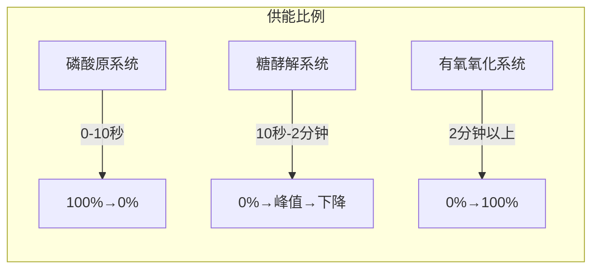
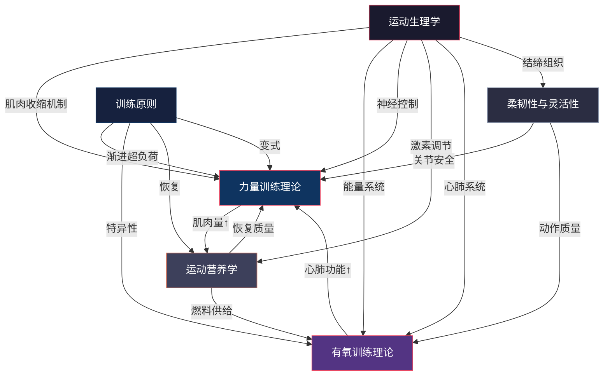

## 七、本节要点回顾

前六节系统讲解了运动训练的科学基础——从细胞层面的肌肉收缩机制到宏观层面的心肺系统适应，从力量训练的生理原理到运动营养的精准策略。本节将这些知识整合为一个完整的认知框架，帮助你建立"从原理到行动"的思维模型。

### 7.1 核心知识体系总览

整个"基础理论"部分的知识体系可以用一张图来概括：

```mermaid
graph TD
    A[运动训练科学基础] --> B[运动生理学]
    A --> C[训练原则]
    A --> D[力量训练理论]
    A --> E[有氧训练理论]
    A --> F[柔韧性与灵活性]
    A --> G[运动营养学]

    B --> B1[肌肉结构与收缩]
    B --> B2[能量系统]
    B --> B3[神经控制]
    B --> B4[激素调节]
    B --> B5[心肺系统]
    B --> B6[结缔组织适应]

    C --> C1[渐进超负荷]
    C --> C2[特异性原则]
    C --> C3[恢复与可逆性]
    C --> C4[个体差异与变式]

    D --> D1[肌肥大三机制]
    D --> D2[力量七要素]
    D --> D3[容量-强度关系]
    D --> D4[周期化训练]

    E --> E1[心率区间训练]
    E --> E2[乳酸阈值]
    E --> E3[VO2max提升]
    E --> E4[有氧-力量兼容]

    F --> F1[拉伸技术对比]
    F --> F2[灵活性评估]
    F --> F3[热身与放松]

    G --> G1[宏量营养素]
    G --> G2[微量营养素]
    G --> G3[补剂策略]
    G --> G4[热量管理]
```

### 7.2 十大核心要点详解

以下不是简单的罗列，而是将每个要点放在完整的知识网络中，说明"是什么、为什么、怎么用"。

#### 要点一：肌肉生长的三重驱动力

**核心机制**：肌肉肥大由三个机制协同驱动——机械张力（最重要）、代谢压力和肌肉损伤。

| 驱动因素 | 作用机制 | 训练变量 | 实操指标 |
|----------|---------|---------|---------|
| **机械张力** | 激活mTOR通路，启动蛋白质合成；高张力直接刺激肌纤维增粗 | 强度（%1RM）、离心控制 | 60-85% 1RM，离心阶段3-4秒 |
| **代谢压力** | 乳酸、H⁺积累引发激素反应（GH、IGF-1）；细胞肿胀促进合成代谢 | 次数范围、组间休息、训练技巧 | 8-15次/组，短间歇（60-90秒），递减组/超级组 |
| **肌肉损伤** | 触发炎症修复级联，卫星细胞激活并融合到肌纤维 | 离心负荷、新动作、拉长位训练 | 每4-6周更换部分动作，包含离心强调训练 |

**关键认知**：三者并非独立开关，而是相互叠加。一次好的训练同时激活所有三个机制，但侧重点随训练阶段而变——新手期以机械张力为主，进阶期需要三者协调配合。

**常见误区**：过度追求"泵感"（代谢压力）而忽略渐进加重（机械张力），会导致训练停留在舒适区。机械张力始终是第一位的——没有足够的负荷，代谢压力和肌肉损伤都缺乏意义。

#### 要点二：滑丝学说与肌肉收缩的分子逻辑

**核心原理**：肌肉收缩是肌球蛋白头部与肌动蛋白之间反复"抓取-拉动-脱离"的循环过程，ATP是这个循环的润滑剂和能量来源。

收缩循环的七个步骤（简化记忆版）：

1. **信号到达** → 乙酰胆碱释放，触发动作电位
2. **钙离子释放** → 肌质网打开，Ca²⁺涌入肌浆
3. **结合位点暴露** → 肌钙蛋白构象变化，原肌球蛋白移开
4. **横桥形成** → 肌球蛋白头部与肌动蛋白结合
5. **动力冲程** → 头部摆动，细丝滑动约10nm
6. **ATP结合** → 横桥脱离（没有ATP就无法脱离=尸僵）
7. **ATP水解** → 头部重新蓄力，准备下一轮

**训练启示**：理解这个过程，你就明白为什么ATP（来自磷酸原系统）对最大力量至关重要——每一组大重量训练的前1-2秒完全依赖即时ATP储备。也理解了为什么钙离子释放是"开关"——肌肉放松和收缩都依赖于Ca²⁺的精确调控。

#### 要点三：三大能量系统——不是"切换"而是"混合"

**核心认知**：人体在任何时刻都同时使用三种能量系统，只是比例不同。训练的目标不是"激活某个系统"，而是提升所有系统的效率和切换速度。

| 能量系统 | 核心燃料 | 产能效率 | 恢复时间 | 训练方法 |
|----------|---------|---------|---------|---------|
| 磷酸原 | ATP+PCr | 最快，最少（1 ATP/PCr） | PCr完全恢复3-5分钟 | 1-5次大重量/爆发力，充分休息 |
| 糖酵解 | 肌糖原 | 中速，中等（2-3 ATP/葡萄糖） | 乳酸清除15-30分钟 | 8-15次中等重量，中等休息 |
| 有氧氧化 | 碳水+脂肪 | 最慢，最多（36-38 ATP/葡萄糖） | 糖原完全恢复24-48小时 | 30-90分钟持续运动 |

**关于乳酸的真相**：乳酸不是废物，而是有价值的燃料。心脏、慢肌纤维和肝脏都可以将乳酸重新转化为能量。真正的疲劳元凶是氢离子积累（降低pH值）和无机磷酸盐积累（干扰钙离子功能）。

**代谢灵活性**：优秀训练者能够根据运动强度高效切换燃料来源（脂肪↔碳水）。Zone 2训练是提升代谢灵活性最有效的手段。

#### 要点四：六大训练原则——从理论到纪律

训练原则不是"建议"，而是身体适应规律的客观描述。违反它们不会"少一点效果"，而是直接导致停滞或受伤。

**1. 渐进超负荷（最核心）**

身体只在被"逼迫"时才会适应。超负荷的方式不仅限于加重：

| 超负荷维度 | 具体方法 | 适用阶段 |
|-----------|---------|---------|
| 增加负荷 | 每次增加1-2.5kg | 所有阶段 |
| 增加次数 | 同重量多做1-2次 | 初级→中级 |
| 增加组数 | 每个肌群增加1-2组/周 | 中级→高级 |
| 缩短休息 | 组间休息减少15-30秒 | 提升训练密度 |
| 增加幅度 | 增大动作范围 | 改善灵活性后 |
| 控制节奏 | 延长离心阶段时间 | 所有阶段 |
| 提升动作质量 | 更好的肌肉感受和控制 | 所有阶段 |

**进度参考**：新手每周增加2.5-5kg（复合动作），中级每2-4周增加2.5kg，高级每4-8周增加1-2.5kg。力量增长是对数曲线——初期快速，后期极慢。

**2. 特异性原则（SAID）**

身体适应你反复做的事情。训练必须与目标高度匹配：

- **动作模式特异性**：想提高深蹲就练深蹲，而不是腿举
- **能量系统特异性**：想提升爆发力就练爆发力，而不是慢跑
- **肌肉特异性**：想增大胸肌就训练胸肌，俯卧撑不够就加卧推

**3. 恢复与可逆性**

- 能力不用就会退化：力量退化速度（2-3周开始）慢于有氧退化速度（1-2周开始）
- 肌肉"记忆"存在：额外的细胞核不会丢失，恢复训练后速度更快
- 最低维持训练量：每个肌群每周6-8组即可维持现有水平

**4. 个体差异**

基因、训练史、年龄、性别、生活方式——所有这些因素意味着同一个训练计划不可能对所有人有效。关键是通过系统试验找到适合自己的参数：最佳次数范围、最佳训练频率、最佳组间休息、最佳动作选择。

**5. 变式与周期化**

身体会适应任何固定的刺激。变式有四个层次：
- **微调**：改变次数范围、休息时间、动作角度
- **动作替换**：用相似但不同的动作替换（如用前蹲替换后蹲）
- **阶段切换**：从增肌阶段转为力量阶段
- **目标调整**：阶段性降低体脂或转为功能训练

#### 要点五：力量 vs 肌肥大——不同的训练逻辑

| 目标 | 强度 | 次数 | 组数 | 休息 | 关键变量 |
|------|------|------|------|------|---------|
| **最大力量** | 85-100% 1RM | 1-5次 | 3-5组 | 3-5分钟 | 强度为王，动作速度 |
| **肌肥大** | 60-80% 1RM | 6-20次 | 3-6组 | 60-120秒 | 容量为王，机械张力+代谢压力 |
| **肌耐力** | <60% 1RM | 15-25次 | 2-4组 | 30-60秒 | 总容量和乳酸耐受 |

**力量的七大决定因素**：
1. 肌肉横截面积（更大的肌肉=更大的力量潜力）
2. 运动单位募集能力（神经系统能"召唤"多少肌纤维）
3. 运动单位发放频率（肌纤维收缩的"火力密度"）
4. 肌纤维类型比例（II型纤维越多，绝对力量越大）
5. 肌肉间协调（多块肌肉的配合效率）
6. 动作技术熟练度（神经效率）
7. 肌腱刚度和杠杆效率（结构因素）

**关键认知**：新手前4-6周的力量增长几乎100%来自神经适应，而非肌肉增长。之后力量增长逐渐转向肌肉横截面积为主导。这就是为什么初学者应该优先学习正确的动作模式，而不是追求大重量。

#### 要点六：心率区间训练——精准瞄准训练适应

| 区间 | 心率范围 | 训练目的 | 每周建议 |
|------|---------|---------|---------|
| Zone 1 | 50-60% HRmax | 主动恢复 | 可每日 |
| Zone 2 | 60-70% HRmax | 有氧基础、线粒体增殖、脂肪氧化 | 3-5次，30-90分钟 |
| Zone 3 | 70-80% HRmax | 乳酸阈值提升 | 2-3次，20-60分钟 |
| Zone 4 | 80-90% HRmax | 无氧耐力 | 1-2次，10-30分钟 |
| Zone 5 | 90-100% HRmax | VO2max提升 | 1次，3-8分钟×间歇 |

**Zone 2的特殊地位**：

Zone 2是有氧训练的"甜蜜点"——在这个强度下，I型慢肌纤维中的线粒体以最高效率工作，脂肪氧化速率达到接近最大值。长期Zone 2训练可以：
- 显著提升线粒体密度和功能
- 提升乳酸清除能力（慢肌纤维"吞噬"快肌纤维产生的乳酸）
- 改善心脏每搏输出量
- 不干扰力量训练的恢复

**Zone 2的判断方法**：
1. 谈话测试：能说完整句子但不能唱歌
2. 鼻呼吸测试：能完全用鼻子呼吸
3. 心率监测：60-70% HRmax（如28岁→115-134 bpm）
4. 血乳酸测试：维持在1.7-2.0 mmol/L（最精确）

#### 要点七：柔韧性与灵活性——被低估的训练基础

**核心区别**：柔韧性是被动拉长的能力（静态），灵活性是在运动中主动控制关节活动范围的能力（动态）。灵活性 = 柔韧性 + 力量 + 神经控制。

**四大拉伸技术对比**：

| 技术 | 适用场景 | 注意事项 |
|------|---------|---------|
| 静态拉伸 | 训练后放松，改善长期柔韧性 | 训练前静态拉伸可能降低力量输出 |
| 动态拉伸 | 训练前热身，提升灵活性 | 幅度渐进，不弹震 |
| PNF拉伸 | 快速改善活动范围 | 需要搭档或工具，效果最好 |
| 泡沫轴放松 | 缓解筋膜紧张，促进恢复 | 每个部位30-60秒，避开骨骼和关节 |

**训练启示**：柔韧性和灵活性是安全训练的前提。如果髋关节活动范围不足，深蹲时腰椎就会代偿——这不是"意志力"问题，而是结构性限制。先解决灵活性，再追求负荷。

#### 要点八：运动营养——热量平衡与蛋白质充足

**营养优先级金字塔**：

        ┌──────────┐
        │   补剂   │  ← 锦上添花（层级5）
        ├──────────┤
        │ 微量营养素 │  ← 维生素矿物质（层级4）
        ├──────────┤
        │  营养时机  │  ← 训练前后（层级3）
        ├──────────┤
        │ 宏量营养素 │  ← 蛋白质/碳水/脂肪比例（层级2）
        ├──────────┤
        │ 热量平衡   │  ← 总热量摄入 vs 消耗（层级1，最基础）
        └──────────┘

**蛋白质摄入标准**：
- 增肌：1.6-2.2g/kg体重/天
- 减脂：2.0-2.4g/kg体重/天（高蛋白保护肌肉）
- 维持：1.2-1.6g/kg体重/天
- 每餐至少30g蛋白质（达到亮氨酸阈值，最大化肌肉蛋白合成）
- 蛋白质质量排序：鸡蛋 > 乳清 > 牛肉/鸡肉/鱼 > 大豆 > 谷物

**碳水的战略价值**：
- 训练表现的"燃料"——高强度训练几乎100%依赖碳水
- 蛋白质的"保护者"——碳水充足时身体不会分解蛋白质供能
- 肌糖原恢复需要24-48小时——训练日碳水摄入应高于休息日

**体态重组**：训练新手可以在热量平衡或轻微赤字的状态下同时增肌减脂。关键条件：蛋白质充足（2.0-2.4g/kg）、力量训练持续进行、热量赤字不超过300-500kcal。

#### 要点九：恢复与训练同等重要

训练是"破坏"，恢复是"建设"。没有充分的恢复，训练的破坏就无法转化为适应。

**恢复的四大支柱**：

| 支柱 | 具体措施 | 权重 |
|------|---------|------|
| 睡眠 | 7-9小时，固定作息，18-20°C卧室温度 | ★★★★★ |
| 营养 | 充足蛋白质+碳水，训练后30-60分钟内补充 | ★★★★☆ |
| 压力管理 | 冥想/呼吸练习/社交/自然接触 | ★★★☆☆ |
| 主动恢复 | Zone 1有氧、拉伸、泡沫轴、冷水浸泡 | ★★☆☆☆ |

**睡眠的不可替代性**：
- 生长激素70%以上在深度睡眠中分泌
- 每减少1小时睡眠，睾酮下降10-15%
- 睡眠不足升高皮质醇15-25%
- 肌肉蛋白合成高峰在睡眠中

**过度训练综合征的警示信号**：
- 静息心率持续升高5-10bpm
- 睡眠质量持续下降
- 训练动力显著降低
- 力量水平停滞或下降超过2周
- 频繁生病（上呼吸道感染）
- 情绪波动、易怒、焦虑

#### 要点十：激素环境——你的体内"教练"

**优化合成代谢环境的四大策略**：

1. **睡眠为王**（权重最高）：7-9小时，固定作息，黑暗安静凉爽
2. **复合动作训练**：深蹲、硬拉、卧推、划船比孤立动作更能刺激全身激素分泌
3. **营养支持**：健康脂肪25-35%热量（激素合成原料）、充足蛋白质、避免长期极端热量赤字
4. **压力控制**：慢性压力→皮质醇升高→睾酮合成被"抢走"原料

**关键激素速查表**：

| 激素 | 促进因素 | 抑制因素 |
|------|---------|---------|
| 睾酮 | 充足睡眠、复合训练、健康脂肪、适度体脂 | 睡眠不足、过度训练、高体脂、慢性压力 |
| 生长激素 | 深度睡眠、高强度训练、低血糖状态 | 高血糖、睡眠质量差、酒精 |
| IGF-1 | 充足蛋白质（尤其亮氨酸）、充足睡眠 | 营养不足、长期热量赤字 |
| 皮质醇（应控制） | 慢性压力、过长训练（>75分钟）、长期热量赤字 | 充足睡眠、压力管理、合理训练量 |

### 7.3 知识关联图：六个板块如何相互支撑

**关键关联**：
- **生理学→一切**：不理解肌肉收缩机制，力量训练就是盲目搬铁；不理解能量系统，有氧训练就是瞎跑
- **训练原则→训练计划**：六大原则是训练计划设计的"宪法"，任何违反都是在浪费时间
- **力量↔有氧**：心肺功能提升→组间恢复更快→力量训练容量更高；肌肉量增加→静息代谢提升→减脂更高效
- **柔韧性→安全**：灵活性不足会限制动作幅度，迫使其他关节代偿，增加受伤风险
- **营养→一切恢复**：没有足够的蛋白质和热量，肌肉无法修复；没有足够的碳水，训练表现无法保证

### 7.4 从理论到行动：实操决策框架

理解理论的最终目的是指导实践。以下是将理论转化为日常训练决策的框架：

#### 决策一：如何安排一周训练

第一步：确定目标
├── 增肌为主 → 4-5天力量 + 1-2天Zone 2有氧
├── 减脂为主 → 3-4天力量 + 2-3天有氧（混合Zone 2和HIIT）
└── 健康为主 → 2-3天力量 + 2-3天Zone 2 + 1天灵活性

第二步：安排力量训练
├── 每个肌群每周10-20组（训练量=组数×次数×重量）
├── 频率：每个肌群每周2次（恢复周期48-72小时）
├── 强度：60-85% 1RM为主，偶尔低次数大重量
└── 复合动作优先，孤立动作补充

第三步：安排有氧训练
├── Zone 2：3-5次/周，30-60分钟/次（与力量训练不冲突）
├── HIIT：1-2次/周，20-30分钟/次（避免安排在腿训后）
└── 有氧和力量间隔6小时以上（同一天训练时）

第四步：安排恢复
├── 每4-6周安排一个减量周（训练量降低40-60%）
├── 每天7-9小时睡眠
├── 训练前动态热身10-15分钟
└── 训练后静态拉伸+泡沫轴10-15分钟

#### 决策二：如何选择训练强度和次数

| 你的水平 | 主要刺激 | 推荐次数范围 | 推荐强度 |
|----------|---------|-------------|---------|
| 新手（<6个月） | 神经适应 | 8-12次 | 60-70% 1RM |
| 初级（6-18个月） | 肌肉量+神经 | 6-12次 | 65-80% 1RM |
| 中级（1.5-3年） | 肌肥大为主 | 6-20次（混合） | 60-85% 1RM |
| 高级（3年+） | 周期化混合 | 1-20次（按阶段） | 按周期变化 |

#### 决策三：如何判断是否需要调整

| 信号 | 可能原因 | 调整策略 |
|------|---------|---------|
| 力量连续2周停滞 | 渐进超负荷不足或过度 | 检查睡眠和营养，考虑减量周 |
| 训练后持续酸痛超过72小时 | 训练量过大或恢复不足 | 降低训练量，增加蛋白质，改善睡眠 |
| 静息心率持续升高 | 过度训练或压力过大 | 降低训练强度，优先睡眠和压力管理 |
| 动作幅度受限 | 柔韧性/灵活性不足 | 增加针对性拉伸和灵活性训练 |
| 体重长期不变 | 热量平衡未打破 | 调整热量摄入（增肌+300，减脂-300） |

### 7.5 进阶概念：给高级读者的深度提示

#### 概念一：MEV/MAV/MRV容量管理模型

| 缩写 | 含义 | 应用 |
|------|------|------|
| **MEV** | 最小有效容量（Minimum Effective Volume） | 低于此量不会产生适应，每个肌群约6-8组/周 |
| **MAV** | 最大适应容量（Maximum Adaptive Volume） | 最佳适应区间的上限，每个肌群约12-20组/周 |
| **MRV** | 最大可恢复容量（Maximum Recoverable Volume） | 超过此量恢复不足，每个肌群约20-25组/周 |

训练应在MEV和MRV之间波动——长期在MRV附近训练会导致过度训练，长期在MEV附近训练则进展缓慢。

#### 概念二：周期化训练模型

| 模型 | 特点 | 适用对象 |
|------|------|---------|
| 线性周期化 | 强度逐步升高，容量逐步降低 | 新手、赛季前准备 |
| 波动周期化 | 每周或每天改变强度/容量 | 中级、全年训练 |
| 区块周期化 | 每个阶段集中发展一个素质 | 高级、竞技运动员 |
| 自动调节 | 根据当天状态调整训练负荷 | 所有水平（使用RPE/RIR） |

#### 概念三：干扰效应与兼容策略

同时进行大量有氧和力量训练时，会互相干扰（干扰效应）。缓解策略：
- 有氧安排在力量训练后至少6小时
- 优先选择低冲击有氧（骑车、游泳）而非跑步
- 有氧强度以Zone 2为主，避免过多高强度有氧
- 确保总热量和蛋白质充足

### 7.6 常见认知误区总结

| 误区 | 真相 | 纠正方法 |
|------|------|---------|
| "乳酸导致酸痛" | 氢离子和Pi才是元凶，乳酸是有价值的燃料 | 理解能量系统生化过程 |
| "必须练到力竭" | 留1-3次余量（RIR）同样有效且更安全 | 使用RPE/RIR系统 |
| "有氧掉肌肉" | 适量Zone 2有氧不干扰增肌，反而促进恢复 | 合理安排有氧类型和时机 |
| "拉伸降低力量" | 训练前静态拉伸可能降低爆发力，但动态拉伸不会 | 训练前动态，训练后静态 |
| "吃越多蛋白质越好" | 超过2.2g/kg的额外蛋白质不会带来更多增肌收益 | 按1.6-2.2g/kg摄入 |
| "脂肪是敌人" | 健康脂肪是激素合成的原料，低于20%热量会降低睾酮 | 保持总热量25-35%来自脂肪 |
| "出汗=减脂" | 出汗只是体温调节，减掉的是水分不是脂肪 | 关注热量赤字和长期趋势 |
| "新手要孤立训练" | 新手应优先学习复合动作模式，建立神经基础 | 前6个月以深蹲/硬拉/卧推/划船为主 |

### 7.7 本节核心公式与速查卡

**热量平衡公式**：
体重变化 = 热量摄入 - 热量消耗
增肌：TDEE + 300~500 kcal/天
减脂：TDEE - 300~500 kcal/天
维持：TDEE ± 0 kcal/天

**蛋白质需求公式**：
增肌期：体重(kg) × 1.6~2.2 = 每日蛋白质(g)
减脂期：体重(kg) × 2.0~2.4 = 每日蛋白质(g)

**心率区间公式（Karvonen公式）**：
目标心率 = (HRmax - HRrest) × 目标% + HRrest
HRmax ≈ 220 - 年龄（粗略估算）

**训练容量计算**：
总容量 = 组数 × 次数 × 重量
例：深蹲 4组 × 8次 × 100kg = 3200kg

**PCr恢复时间参考**：
30秒休息 → 恢复约50%
60秒休息 → 恢复约75%
2分钟休息 → 恢复约85%
3-5分钟休息 → 恢复95%+

---

> 理解了这些原理，你就不再是盲目地举铁，而是在有目的地改造自己的身体。每一个训练决策——从今天练什么、用多重、做几组、休息多久、吃什么——都可以追溯到这些生理学原理。接下来，我们将把这些理论转化为具体的训练方案和计划模板，让科学真正落地为行动。
