# 第三章 穿搭：用衣着重塑你的外在形象

> "服装不会改变世界，但穿着服装的人会。" ——Vivienne Westwood

## 一、为什么穿搭值得你认真对待

### 1.1 科学依据：第一印象的形成机制

人们常说"人不可貌相"，但认知心理学的研究结论恰恰相反——人类的大脑天生就是一台高速运转的"印象生成器"，而且它的运转速度远比你想象的快。

美国普林斯顿大学心理学家Janine Willis和Alexander Todorov在2006年发表的经典研究《First Impressions》中发现：人类在看到一张面孔的**100毫秒**（0.1秒）内，就已经形成了关于此人可信赖度、能力和亲和力的初步判断。更关键的是，当给予更长的观察时间后，受试者的信心增加了，但判断结果并没有显著改变——也就是说，**第一印象一旦形成，极难被推翻**。

而在第一印象的构成要素中，穿着打扮占据了核心地位。美国心理学家阿尔伯特·梅拉比安（Albert Mehrabian）提出的"7-38-55法则"指出，在人际沟通的情感态度传递中：

- **语言内容**仅占 **7%**
- **语调声音**占 **38%**
- **视觉形象**（穿着、体态、表情）占到 **55%**

虽然这个法则最初是针对"情感态度传递"这一特定场景，后续研究也对其适用范围做了修正，但核心结论是成立的：**视觉信息在人际判断中的权重远超语言信息**。

2015年《Social Psychological and Personality Science》期刊上的一项研究进一步证实：穿着正式的被试者在谈判中更容易获得对方让步，自我评价也更高。研究者将这种现象称为"着装认知效应"（Enclothed Cognition）——**你穿什么，不仅影响别人怎么看你，还影响你怎么看自己**。

### 1.2 穿搭的四重价值

对于一位28岁的男性来说，穿搭远不止遮体御寒的基本需求。它承载着四层递进的价值：

**第一层：功能价值——保护与舒适**

这是穿搭的底层需求。合适的面料和版型保护你免受环境侵害（紫外线、寒冷、摩擦），让你在各种活动中保持舒适。很多人忽略了这一层——穿着不合身的衣服会不自觉地调整、拉扯，这些小动作会让你看起来不安、不自信。

**第二层：社交价值——信号传递**

你的穿着是一种无声的社交语言，向周围的人传递着关于你的信息：

| 传递信号 | 具体表现 | 社交效果 |
|---------|---------|---------|
| 专业能力 | 合身的正装、整洁的细节 | 被认为更可靠、更有能力 |
| 经济水平 | 面料质感、品牌选择 | 影响他人对你的社交定位 |
| 审美品味 | 配色和谐、风格统一 | 提升社交吸引力 |
| 态度立场 | 风格选择（极简/潮流/正式） | 传递你的价值观和生活方式 |
| 职业身份 | 符合行业规范的着装 | 快速建立职业认同感 |

哈佛商学院的研究表明，穿着得体的求职者在面试中获得录用的概率比穿着随意者高出**20-30%**。

**第三层：心理价值——自信构建**

这是穿搭最容易被忽视但最具实操意义的价值。当你知道自己看起来不错时：

- 你的**姿态**会更加挺拔（减少含胸驼背）
- 你的**眼神**会更加坚定（减少闪躲和不安）
- 你的**语速**会更加从容（减少急促和紧张）
- 你的**肢体语言**会更加开放（减少交叉手臂等防御动作）

心理学上将这种现象称为"着装认知效应"（Enclothed Cognition）。2012年《Journal of Experimental Social Psychology》上的研究发现，穿着白大褂的被试者在注意力测试中的表现显著优于穿便装的被试者——前提是他们被告知这是"医生的白大褂"而非"画家的工作服"。**你穿的衣服会直接影响你的认知能力和行为表现**。

**第四层：个人品牌——长期投资**

在社交媒体和视频会议主导的今天，你的穿搭已经成为个人品牌的重要组成部分。一个稳定、得体的穿搭风格会让你在他人记忆中形成鲜明的印象，成为你的"视觉标签"。

### 1.3 中国男性的穿搭现状

在进入具体方案之前，有必要正视一个现实：中国男性的整体穿搭水平还有很大的提升空间。

2023年天猫发布的《男性消费趋势报告》显示，中国男性年均服装消费约为女性的**1/3**。更值得关注的是消费结构——男性的服装消费中，功能性服装（运动服、工装）占比超过60%，而时尚性和社交性服装的占比远低于女性。

造成这一现象的原因是多方面的：

- **教育缺失**：国内基础教育中几乎没有美育和着装教育的内容
- **社交压力**：男性关注穿搭容易被贴上"不够man"的标签
- **信息不对称**：相比女性穿搭内容的海量供给，男性穿搭指南严重不足
- **试错成本**：不买不试永远不知道什么适合自己，但买了试了又怕浪费

这恰恰是本章存在的意义——为你提供一套**系统化、可执行、有理论支撑**的穿搭提升方案，让你用最小的试错成本找到最适合自己的穿搭方式。

## 二、你的穿搭挑战：精准画像

每个人的穿搭方案都应该从了解自己的身体开始。以下是你的个人特征分析，以及每个特征对应的穿搭挑战。

### 2.1 身体数据概览

| 项目 | 数据 | 对应挑战 |
|------|------|---------|
| 身高 | 普通身高 | 视觉显高 |
| 体重 | 正常体重（67kg） | 视觉显瘦 |
| BMI | 24.5 | 正常偏上，需要优化视觉比例 |
| 身材比例 | 五五开 | 拉长下半身视觉比例 |
| 脸型 | 五角形（菱形/钻石脸） | 柔化颧骨线条，平衡面部比例 |
| 年龄 | 28岁 | 在青春与成熟间找到平衡点 |
| 皮肤 | 中性偏微油 | 避免闷热面料，注重透气性 |
| 头发 | 塌发 | 与发型配合，优化头部轮廓 |

### 2.2 身高与体重：双重优化目标

普通身高的身高在男性中属于偏矮的范围。根据国家卫健委2020年发布的《中国居民营养与慢性病状况报告》，中国18-44岁男性的平均身高为**169.7cm**。你的身高低于平均值约5cm。

正常体重的体重对应BMI约为24.5，处于正常范围（18.5-24.9）的上限附近。结合55开的身材比例，你需要在穿搭上同时实现两个核心目标：**视觉显高**和**视觉显瘦**。

好消息是：这两个目标在大多数情况下可以同时达成。核心策略是——

1. **拉长纵向线条**：统一上下身色系，避免水平切割
2. **优化比例分割**：提高腰线位置，让下半身看起来更长
3. **控制服装体量**：合身但不紧身，避免过于宽松或过于紧绷

### 2.3 五五开身材比例：最大的挑战

"五五开"意味着你的上半身和下半身的视觉长度接近1:1，缺乏理想的比例感。

要理解这个问题的严重性，需要知道一个关键数据：**黄金分割比例（0.618）**。在穿搭领域，理想的身体比例是腰线位于身高的0.618处，即下半身占比约61.8%。以普通身高计算，理想腰线位置约为102cm（从地面算起），而五五开的腰线在82.5cm处——这意味着你需要在视觉上将腰线"提升"将近**20cm**。

当然，实际操作中不可能完全弥补20cm的差距，但通过以下策略可以实现**视觉上提升8-12cm**的效果：

- 高腰裤（提高实际腰线3-5cm）
- 上衣塞入裤腰（明确腰线位置）
- 同色系鞋裤（延伸腿部线条3-4cm）
- 短款上衣（避免遮挡腰线）

### 2.4 颧骨突出与方形脸型

方形脸（也称为菱形脸或钻石脸）的特征是：颧骨是脸部最宽的位置，额头和下巴相对较窄。这种脸型的优势是轮廓分明、有立体感；劣势是颧骨过于突出会让脸部看起来更宽、更有攻击性。

穿搭中需要关注的面部相关因素包括：

- **领型选择**：V领、小圆领、衬衫领可以柔化颧骨线条；高领、窄领会加重颧骨的视觉宽度
- **发型配合**：两侧稍有蓬松感的发型可以平衡颧骨宽度；两侧完全推光的发型会让颧骨更突出
- **眼镜选择**：椭圆形或圆角矩形镜框可以柔化脸部棱角；方形或尖角镜框会加重棱角感
- **帽子选择**：中等帽檐的帽子（如渔夫帽、棒球帽）可以平衡脸型比例

### 2.5 28岁的年龄定位

28岁是一个微妙的年龄——你已经不是刚毕业的"职场新人"，但也还没到需要"沉稳老成"的阶段。这个年龄段的穿搭需要把握几个平衡：

| 维度 | 太过（避免） | 不足（避免） | 恰到好处 |
|------|------------|------------|---------|
| 正式程度 | 全套西装+领带（太老气） | 卫衣+运动裤（太随意） | 休闲西装+针织衫+修身裤 |
| 色彩选择 | 全黑或全灰（太沉闷） | 大面积荧光色（太幼稚） | 中性色为主+1-2个亮点色 |
| 品牌Logo | 满身大Logo（太浮夸） | 完全不关注品质（太随意） | 无Logo高品质基础款 |
| 潮流元素 | 全身潮流单品（太跟风） | 完全不关注潮流（太保守） | 经典款为主+1-2个潮流细节 |

## 三、本章知识体系与内容导航

本章按照"道法术器"的逻辑框架组织，从理论到实践，为你提供一套完整的穿搭提升方案。

```mermaid
graph TD
    A[第三章 穿搭] --> B[01 基础理论]
    A --> C[02 具体方案]
    A --> D[03 产品推荐]
    A --> E[04 学习路径]
    A --> F[05 常见误区]
    A --> G[06 本章小结]

    B --> B1[色彩理论]
    B --> B2[体型分析]
    B --> B3[风格理论]
    B --> B4[面料知识]
    B --> B5[服装史与时尚趋势]
    B --> B6[穿搭原则]

    C --> C1[显高穿搭方案]
    C --> C2[修饰脸型方案]
    C --> C3[五五开身材优化]
    C --> C4[场合穿搭方案]

    D --> D1[10件必备单品]
    D --> D2[品牌推荐]
    D --> D3[配饰推荐]
    D --> D4[购物策略]

    E --> E1[零基础入门]
    E --> E2[进阶提升]
    E --> E3[精通之路]

    F --> F1[10个常见错误]
    F --> F2[纠正方法]

    style A fill:#2d3748,stroke:#4a5568,color:#fff
    style B fill:#2b6cb0,stroke:#2c5282,color:#fff
    style C fill:#2f855a,stroke:#276749,color:#fff
    style D fill:#b7791f,stroke:#975a16,color:#fff
    style E fill:#6b46c1,stroke:#553c9a,color:#fff
    style F fill:#c53030,stroke:#9b2c2c,color:#fff
    style G fill:#4a5568,stroke:#2d3748,color:#fff
```

### 3.1 各小节内容概要

| 小节 | 主题 | 核心内容 | 与你相关的关键点 |
|------|------|---------|----------------|
| 01 | 基础理论 | 色彩理论、体型分析、风格类型、面料知识、服装史、穿搭原则 | 个人色彩诊断、五五开体型的理论基础、适合28岁的风格定位 |
| 02 | 具体方案 | 显高穿搭、修饰脸型、五五开身材优化、场合穿搭 | 视觉显高5-8cm的实操技巧、方形脸的领型和发型方案、不同场合的搭配模板 |
| 03 | 产品推荐 | 10件必备单品、品牌推荐、配饰推荐、购物策略 | 适合普通身高/正常体重身材的尺码选择、性价比品牌清单、配饰的点睛之笔 |
| 04 | 学习路径 | 从零基础到精通的系统学习计划 | 3个月速成方案、持续精进的长期计划 |
| 05 | 常见误区 | 最常犯的穿搭错误及纠正方法 | 矮个子最常见的5个穿搭陷阱、五五开身材的3大致命错误 |
| 06 | 本章小结 | 核心要点回顾与行动清单 | 一页纸速查表、30天穿搭升级行动计划 |

### 3.2 推荐阅读路径

**快速通道（2小时）**：如果你时间紧迫，按以下顺序阅读核心内容：
1. 本概览（当前文件）→ 了解全局
2. 02-具体方案/01-显高穿搭方案 → 掌握最关键的实操技巧
3. 02-具体方案/03-五五开身材优化方案 → 解决最核心的身材问题
4. 05-常见误区 → 避开最常见的坑
5. 06-本章小结 → 拿到行动清单

**完整通道（1-2周）**：如果你想要系统性地提升穿搭能力，建议按章节顺序阅读，每天1-2个小节：
- 第1天：本概览 + 基础理论/色彩理论
- 第2天：基础理论/体型分析 + 风格理论
- 第3天：基础理论/面料知识 + 服装史与时尚趋势
- 第4天：基础理论/穿搭原则
- 第5-6天：具体方案（4个小节）
- 第7天：产品推荐
- 第8天：学习路径 + 常见误区
- 第9天：本章小结 + 制定个人行动计划

**实践建议**：无论选择哪条路径，都建议你在阅读过程中准备一面全身镜，边读边尝试文中的搭配建议。穿搭是一门实践性极强的技能——**光看不练是学不会的**。

## 四、本章核心方法论

在进入具体内容之前，先了解本章贯穿始终的几个核心方法论。理解这些方法论，能帮助你在学习过程中更好地理解和应用具体技巧。

### 4.1 视觉错觉原理

穿搭的本质是**视觉管理**——通过服装的颜色、线条、比例来改变他人对你身体的视觉感知。以下是贯穿本章的四个核心视觉原理：

**原理一：垂直延伸原理**

垂直方向的线条和色块能够拉长视觉感知。应用方式包括：
- 竖条纹面料
- V领设计
- 上下身同色系
- 垂直排列的纽扣或拉链

**原理二：视觉切割原理**

水平方向的色块边界会将身体"切断"，让视觉上显得更矮。需要避免的切割线包括：
- 上下身颜色对比强烈的分界线
- 颜色与裤子差异过大的腰带
- 横条纹
- 上衣下摆遮挡臀部形成的水平线

**原理三：视觉重心引导原理**

人的视线会自然被以下元素吸引：亮色、图案、装饰、对比色。因此：
- 想让别人注意你的上半身（适合头身比好的人）→ 上装用亮色或有细节
- 想让别人弱化下半身（适合腿型需要修饰的人）→ 下装保持简洁深色

**原理四：比例重塑原理**

通过改变腰线位置和上下身长度比例，可以重塑身体的视觉比例：
- 提高腰线 → 下半身变长 → 显高
- 降低腰线 → 上半身变长 → 适合上半身偏短的人
- 延伸鞋裤同色 → 腿部线条延伸 → 显高

### 4.2 衣橱投资回报率（ROI）思维

很多人买衣服凭感觉、看心情，结果衣橱里塞满了"只穿过一次"的衣服。本章引入"衣橱ROI"的概念——把每件衣服当作一笔投资，用以下公式评估：

单次穿着成本 = 购买价格 ÷ 预期穿着次数

举例：
- 一件300元的高品质白T恤，每周穿2次，穿1年 → 单次成本 = 300 ÷ 104 ≈ **2.9元/次**
- 一件80元的廉价白T恤，穿3次就起球变形 → 单次成本 = 80 ÷ 3 ≈ **26.7元/次**

**结论：高品质的基础款反而是最经济的选择。**

本章的产品推荐部分将基于这一原则，帮你筛选出性价比最高的单品。

### 4.3 20/80法则在穿搭中的应用

穿搭提升不需要一次性购入全新衣橱。根据帕累托法则：

- **20%的核心单品**决定了你**80%的穿搭效果**
- 你需要优先投资的是：合身的上衣（衬衫、T恤、针织衫）和下装（西裤、牛仔裤）、一双好鞋
- 配饰、外套、特殊场合服装可以后续逐步添置

## 五、章节学习目标

完成本章学习后，你将能够：

### 5.1 知识目标（理解"为什么"）

1. **色彩理论**：理解色轮、色彩三属性、冷暖色调的概念，能够解释为什么某些颜色搭配好看而另一些不好看
2. **体型分析**：掌握五种男性体型分类及其穿搭策略，能够准确判断自己的体型类型
3. **风格定位**：了解至少6种主流穿搭风格的特征和适用场景，能够为自己的风格定位
4. **面料认知**：辨别常见面料的特性和适用场景，能够在购买时做出明智的面料选择

### 5.2 技能目标（掌握"怎么做"）

5. **视觉显高**：掌握至少5种视觉显高技巧，预期效果：视觉上显高5-8cm
6. **脸型修饰**：了解如何通过领型、发型、配饰修饰方形脸型和颧骨突出
7. **身材优化**：掌握针对五五开身材的穿搭优化方案，创造更好的比例感
8. **场合着装**：建立至少5套适合不同场合的基础穿搭方案（日常通勤、正式会议、休闲社交、运动户外、约会）

### 5.3 实践目标（做到"买了穿"）

9. **衣橱精简**：能够识别并淘汰衣橱中不合身、不合适的单品
10. **精准购物**：知道哪些单品值得投资、哪些品牌性价比最高、如何选择合适的尺码
11. **自主搭配**：能够不依赖他人建议，独立完成日常穿搭决策
12. **持续进化**：形成系统的穿搭学习习惯，持续提升品味

## 六、关键术语表

在阅读本章之前，先熟悉以下术语，它们会在后续内容中反复出现：

| 术语 | 英文 | 含义 |
|------|------|------|
| 廓形 | Silhouette | 服装的整体轮廓，如修身、宽松、A字型等 |
| 剪裁 | Cut/Tailoring | 服装的裁剪和缝制方式，决定合身度 |
| 色温 | Color Temperature | 颜色的冷暖属性，影响视觉感受 |
| 色相 | Hue | 颜色的基本名称（红、蓝、黄等） |
| 明度 | Value/Lightness | 颜色的明暗程度 |
| 饱和度 | Saturation | 颜色的纯度和鲜艳程度 |
| 莫兰迪色 | Morandi Colors | 以画家莫兰迪命名的低饱和度灰色调 |
| 中性色 | Neutral Colors | 黑、白、灰、棕、米色等百搭色 |
| 腰线 | Waistline | 腰部的位置线，是比例优化的关键 |
| 肩线 | Shoulder Line | 肩膀与袖子的接缝线，合身度的第一判断标准 |
| Break | Break | 西裤裤脚与鞋面接触形成的褶皱 |
| 叠穿 | Layering | 多件衣服的层次搭配 |
| 基础款 | Basics/Foundation Pieces | 设计简洁、百搭的服装，如白T恤、深色牛仔裤 |
| 点缀色 | Accent Color | 小面积使用的亮色，用于提亮整体搭配 |
| 着装认知效应 | Enclothed Cognition | 穿着特定服装对穿着者心理和行为的影响 |

## 七、开始之前的心理准备

在正式进入穿搭学习之前，有几个重要的心理认知需要提前建立：

### 7.1 穿搭不是天赋，是技能

很多人认为"会穿"是一种天生的审美天赋，自己"不是那块料"。这是一个巨大的误解。

穿搭和编程、开车、做饭一样，是一门可以通过学习和练习掌握的技能。它的底层逻辑是**可学习的知识体系**（色彩理论、体型分析、风格分类）加上**可训练的实践能力**（搭配练习、购物技巧、衣橱管理）。

那些看起来"天生会穿"的人，大多数只是从小耳濡目染，或者在成长过程中无意间完成了穿搭的学习曲线。你现在要做的，是有意识地、系统地走完这条曲线——效率反而比他们更高。

### 7.2 改变需要过程，不要急于求成

穿搭风格的改变不是一夜之间的事。如果你明天突然从"T恤+运动裤"变成"全套西装"，周围的人会觉得你"怪怪的"，你自己也会觉得不自在。

本章推荐的渐进策略是：

1. **第1个月**：优化基础款——淘汰不合身的衣服，购入2-3件合身的基础单品
2. **第2-3个月**：学习搭配——尝试文中的配色公式和搭配方案
3. **第4-6个月**：形成风格——确定1-2个适合自己的核心风格
4. **6个月以后**：精进突破——尝试更多可能性，形成自己的穿搭品味

### 7.3 不要追求完美，追求"更好"

穿搭没有"标准答案"。同一件衣服在不同人身上会呈现完全不同的效果，同一个场合也可以有多种合适的着装方案。

你的目标不是成为"穿搭达人"或"时尚博主"，而是——**比昨天的自己穿得更好**。每一点进步都值得肯定。

### 7.4 实践比理论重要100倍

穿搭是一门"做了才会"的技能。你可以把本章的理论背得滚瓜烂熟，但如果不去商场试穿、不去镜子前搭配、不去真实场景中检验，你的穿搭水平不会有任何提升。

**强烈建议**：阅读本章时，准备一面全身镜。每学完一个搭配技巧，立刻在镜子前尝试。如果身边有值得信任的朋友或家人，让他们给你真实的反馈——比任何理论都有用。

## 八、阅读建议

### 工具准备

在开始阅读之前，建议准备以下工具：

- **全身镜**：必备，用于试穿和搭配练习
- **手机相机**：记录每天的穿搭，方便对比和复盘
- **尺子或卷尺**：测量自己的肩宽、胸围、腰围、臀围、裤长等关键尺寸
- **笔记本或备忘录**：记录学习心得和搭配灵感
- **穿搭APP**（可选）：如小红书、Pinterest，用于收集穿搭灵感

### 你的身体数据清单

在进入具体方案之前，建议你先测量以下数据，这些数据将在后续章节中反复使用：

| 测量项目 | 测量方法 | 你的数据 |
|---------|---------|---------|
| 肩宽 | 两肩骨头之间的距离 | ___cm |
| 胸围 | 绕胸部最丰满处一圈 | ___cm |
| 腰围 | 绕腰部最细处一圈 | ___cm |
| 臀围 | 绕臀部最宽处一圈 | ___cm |
| 内缝长 | 从裆部到脚踝的长度 | ___cm |
| 外缝长 | 从腰部到脚踝的长度 | ___cm |
| 上半身长 | 从肩部到腰线的长度 | ___cm |
| 下半身长 | 从腰线到脚底的长度 | ___cm |
| 颈围 | 绕脖子底部一圈 | ___cm |

有了这些数据，你就能在购买衣服时精准选择尺码，避免"看起来不错但穿上不合身"的常见问题。

---

**准备好了吗？让我们开始这段穿搭升级之旅。**

记住一句话：**穿搭不是为了让别人觉得你好看，而是为了让你自己觉得你值得。** 当你穿上一套精心搭配的衣服，站在镜子前看到一个更精神、更自信的自己时——那种感觉，就是穿搭最大的回报。
