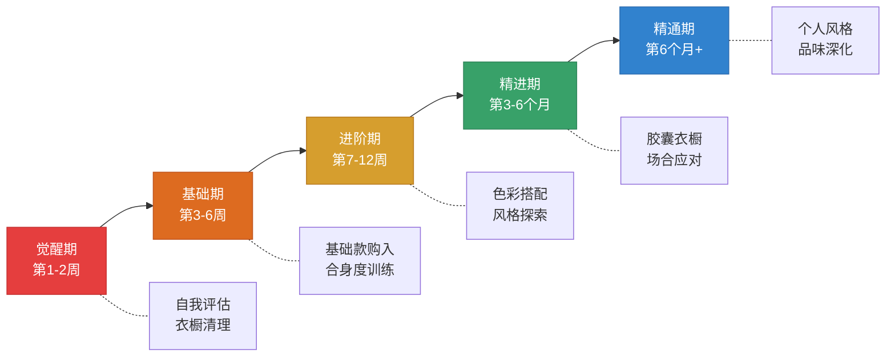
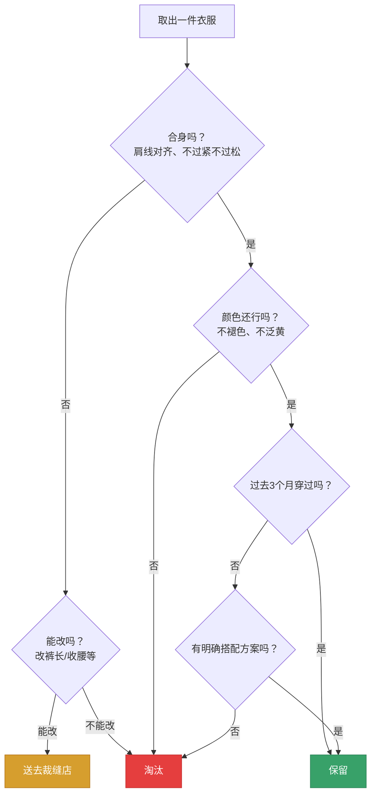
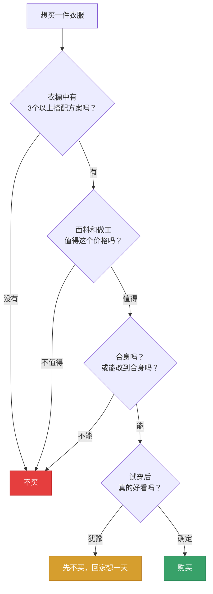

# 穿搭学习路径：从零基础到个人风格的系统进化

> "风格不是你穿了什么，而是你如何穿它。" ——Giorgio Armani

穿搭是一门可以通过系统学习和刻意练习来掌握的技能，而不是所谓的"天生审美"。本节为你规划了一条从零基础到精通的完整学习路径——五个阶段、六条主线、一套可量化的评估体系。每个阶段都有明确的学习目标、具体到动作的练习任务、可衡量的评估标准，以及针对你个人身材特点（普通身高、五五开比例、方形脸）的定制化调整建议。

***

## 为什么需要分阶段学习

在展开具体路径之前，先理解背后的学理依据。穿搭学习遵循技能习得的通用规律——认知心理学家德雷福斯兄弟（Dreyfus & Dreyfus）提出的"五阶段技能习得模型"：

| 阶段 | 认知状态 | 穿搭表现 | 学习策略 |
|------|---------|---------|---------|
| 新手 | 依赖规则，无法判断情境 | 照搬搭配公式，不知道为什么好看 | 给明确规则，减少选择 |
| 高级初学者 | 开始识别情境模式 | 能分辨"这个场合该穿什么" | 增加场景练习 |
| 胜任者 | 能制定计划，分清主次 | 能主动规划衣橱和搭配 | 强调系统思维 |
| 精通者 | 直觉判断，整体感知 | 一眼看出搭配问题所在 | 大量真实场景反馈 |
| 专家 | 不依赖规则，自然流露 | 穿搭成为本能，风格自成一体 | 创新与传承 |

五个阶段并非机械的时间切割，而是能力跃迁的节点。你在每个阶段停留的时间取决于投入的练习量和反思深度——一个每天拍照复盘的人，进步速度是"偶尔想想"的人的5倍以上。

***

## 第一阶段：觉醒期（第1-2周）

### 核心目标

这个阶段不急于买衣服或学搭配，而是做三件事：**看清自己、清空衣橱、建立动机**。没有准确的自我认知，后续所有学习都是空中楼阁。

### 1.1 建立你的"穿搭基线档案"

在做任何改变之前，先用数据建立你的起点记录。这个档案将贯穿整个学习过程，是你衡量进步的唯一客观依据。

**全身照记录（必做）**：

- 穿上你最常穿的3套搭配
- 在自然光下（白天靠窗），用手机定时拍摄
- 拍摄角度：正面、左侧45度、左侧90度、右侧45度、右侧90度，共5个角度
- 每套搭配5张，3套共15张
- 这些照片是你的"穿搭起点"——6个月后对比，你会看到惊人的变化

**为什么要拍5个角度？** 正面照只能看到宽度，侧面照才能暴露衣长、裤长、腰线位置等纵向比例问题。很多人正面看着还行，侧面就暴露了上衣过长、裤脚堆叠等问题。

**身体数据测量（必做）**：

用软尺测量以下数据，精确到0.5cm。这些数据在后续购买和修改衣服时会反复使用：

| 测量项目 | 测量方法 | 你的数据 |
|---------|---------|---------|
| 肩宽 | 左肩骨到右肩骨的直线距离 | ___cm |
| 胸围 | 绕胸部最丰满处水平一圈 | ___cm |
| 腰围 | 绕腰部最细处（通常是肚脐上方2-3cm）水平一圈 | ___cm |
| 臀围 | 绕臀部最宽处水平一圈 | ___cm |
| 内缝长 | 从裆部到脚踝骨的长度（穿平时的鞋测量） | ___cm |
| 外缝长 | 从腰部到脚踝骨的长度 | ___cm |
| 上半身长 | 从肩点到腰线（手臂自然下垂时手腕骨的位置） | ___cm |
| 颈围 | 绕脖子底部（喉结下方）一圈 | ___cm |

**普通身高身高的关键参考**：你的内缝长大概率在74-78cm之间。买裤子时，这个数据比"S/M/L"标签靠谱10倍。不同品牌的S码对应的实际尺寸差异可达5-8cm。

### 1.2 衣橱盘点与淘汰

把衣橱里所有衣服拿出来，按以下流程逐一评估：

**淘汰的衣服怎么处理？**
- 品相好的：闲鱼出售、捐赠给飞蚂蚁等旧衣回收平台
- 品相差的：剪成抹布或直接丢弃
- 不要因为"花了钱舍不得"就留下不穿的衣服——它们占据衣橱空间，增加选择困难，是沉没成本谬误的典型表现

**盘点记录表**（建议用手机备忘录或Excel）：

| 类别 | 数量 | 经常穿 | 偶尔穿 | 不穿 | 淘汰 |
|------|------|--------|--------|------|------|
| T恤/背心 | | | | | |
| 衬衫 | | | | | |
| 针织衫/毛衣 | | | | | |
| 外套/夹克 | | | | | |
| 牛仔裤 | | | | | |
| 休闲裤/西裤 | | | | | |
| 运动裤 | | | | | |
| 鞋子 | | | | | |
| 配饰 | | | | | |

### 1.3 问题识别与优先级排序

对照以下清单，标记你当前存在的问题（打勾即可），然后按优先级排序——优先解决排在前面的问题，因为它们对整体效果的影响最大：

**高优先级（影响最大）**：
- [ ] 衣服不合身（肩线偏移、衣长过长/过短、裤长堆叠）
- [ ] 全身颜色超过4种，视觉混乱
- [ ] 上下装比例分割不明确（看不出腰线在哪里）

**中优先级（影响较大）**：
- [ ] 风格不统一（上半身商务、下半身运动）
- [ ] 衣服起球、褪色、变形但仍在穿
- [ ] 鞋子与整体搭配不协调

**低优先级（锦上添花）**：
- [ ] 缺乏配饰点缀
- [ ] 没有针对不同场合的搭配方案
- [ ] 不了解自己的适合色

### 1.4 觉醒期的练习任务

| 任务 | 具体要求 | 完成标志 |
|------|---------|---------|
| 拍摄基线照 | 3套搭配×5角度=15张照片 | 照片存入手机专属相册 |
| 完成身体测量 | 8项数据，精确到0.5cm | 数据记录在手机备忘录 |
| 衣橱盘点 | 按流程图逐一评估 | 完成盘点记录表 |
| 淘汰处理 | 淘汰不合身/不穿的衣服 | 衣橱减量30%以上 |
| 阅读基础理论 | 本章第一节"基础理论"全部内容 | 能说出3个以上穿搭原则 |

### 1.5 评估标准

- [ ] 能准确说出自己的3个身材优势和3个身材劣势
- [ ] 身体8项数据已测量并记录
- [ ] 衣橱已清理，淘汰率不低于20%
- [ ] 知道什么是"合身度"，能判断肩线是否对齐
- [ ] 理解显高的基本原理（垂直延伸、视觉切割、比例重塑）

***

## 第二阶段：基础期（第3-6周）

### 核心目标

掌握穿搭的"安全区"——用最少的单品、最简单的配色，搭建一个不会出错的日常衣橱。这个阶段的核心原则是**先学会规则，再考虑突破**。

### 2.1 基础款购入策略

根据20/80法则，20%的核心单品决定了80%的穿搭效果。以下是按优先级排序的购入清单：

**第一批（第3-4周，预算800-1500元）**：

| 单品 | 数量 | 颜色建议 | 预算参考 | 选购要点 |
|------|------|---------|---------|---------|
| 白色牛津纺衬衫 | 1件 | 纯白 | 150-300 | 肩线对齐、领围能插入一根手指 |
| 浅蓝色衬衫 | 1件 | 浅蓝 | 150-300 | 同上 |
| V领T恤 | 2件 | 白+黑 | 60-120/件 | 纯棉或棉混纺，克重180g以上 |
| 深色修身直筒裤 | 1条 | 深蓝或炭灰 | 200-400 | 裤长刚好到鞋面，不堆叠 |
| 深色修身牛仔裤 | 1条 | 深蓝原色 | 200-400 | 无破洞、无大面积水洗 |
| 白色简洁运动鞋 | 1双 | 纯白 | 200-500 | 皮面比布面更好打理 |

**普通身高身高的选购要点**：
- **衬衫**：选择"修身版"或"亚洲版"，避免欧美版（衣长通常偏长5-8cm）。衣长标准：下摆刚好覆盖腰带扣。
- **裤子**：选择"修身直筒"而非"宽松"或"紧身"。裤长买回来第一件事——去裁缝店改到合适的长度（内缝长-2cm左右）。
- **鞋子**：避免厚底鞋（显笨重），选择鞋底厚度2-3cm的款式，既有一点增高效果又不突兀。

**第二批（第5-6周，预算500-1000元）**：

| 单品 | 数量 | 颜色建议 | 预算参考 |
|------|------|---------|---------|
| V领毛衣 | 1件 | 深蓝或灰色 | 150-300 |
| 深色Polo衫 | 1件 | 深蓝 | 100-200 |
| 深色皮带 | 1条 | 黑色或深棕 | 80-150 |
| 深色袜子 | 3双 | 黑/深蓝/深灰 | 30-60 |

### 2.2 合身度训练：穿搭的"地基"

合身度是所有搭配技巧的前提。一件不合身的衣服，无论颜色多好看、品牌多高级，穿在身上都是灾难。

**合身度自检七步法**（每天穿衣服时对着镜子执行）：

1. **肩线**：衬衫和外套的肩缝线是否正好落在你肩膀的边缘？偏差超过1.5cm就需要调整尺码。
2. **领围**：衬衫扣上最上面一颗扣子后，能插入一根手指为宜。太紧勒脖子，太松显得邋遢。
3. **胸围**：扣上扣子后，胸前布料没有紧绷的横纹，但也不过于宽松形成"帐篷感"。
4. **衣长**：衬衫下摆刚好覆盖腰带扣，大约到裤子拉链中点。太长会遮住臀部、降低腰线——对普通身高身高来说是致命的。
5. **袖长**：手臂自然下垂，袖口在手腕骨处。衬衫袖口应露出外套袖口1-2cm。
6. **裤腰**：不系皮带也能挂在胯骨上不下滑。如果需要系紧皮带才能穿住，说明腰围偏大。
7. **裤长**：西裤到鞋面形成轻微褶皱（break）；休闲裤/牛仔裤到脚踝骨即可，九分裤露出2-3cm脚踝。

**裁缝店是你最被低估的武器**：

大多数成衣不可能完美贴合你的身材，但裁缝可以。以下是常见的修改项目和参考价格：

| 修改项目 | 价格参考 | 效果提升 |
|---------|---------|---------|
| 改裤长 | 15-30元 | 极高——消除裤脚堆叠 |
| 收腰（衬衫） | 30-50元 | 高——消除腰部多余布料 |
| 收袖长 | 20-40元 | 中——让袖口位置更精准 |
| 改肩宽 | 50-100元 | 高但成本高——建议直接买对尺码 |

**建议**：第一批衣服买回来后，把所有需要修改的衣服一次性送去裁缝店。改裤长是最常见、最便宜、效果最显著的修改——一条裤子改完裤长，上身效果可以提升一个档次。

### 2.3 基础搭配公式

这个阶段只练习3个最安全的搭配公式，练到闭着眼睛都能搭出来：

**公式一：浅上深下（最安全）**
浅色上衣（白T/浅蓝衬衫）+ 深色下装（深蓝牛仔裤/炭灰西裤）+ 白色鞋
原理：上浅下深将视觉重心上移，显高；白色鞋与浅色上衣呼应，整体和谐。

**公式二：同色系纵向延伸（最显高）**
深色上衣（黑T/深蓝针织衫）+ 深色下装（黑裤/深蓝牛仔裤）+ 深色鞋
原理：上下身同色系避免视觉切割，纵向线条连贯，是普通身高身高最有效的显高公式。

**公式三：商务休闲万能公式（最实用）**
衬衫（白/浅蓝）+ 休闲西裤（炭灰/卡其）+ 乐福鞋/德比鞋
原理：衬衫和西裤的组合覆盖了从办公室到晚餐的大多数场合，卷起袖口可以降低正式感。

### 2.4 每日搭配练习流程

养成以下习惯，坚持21天即可形成肌肉记忆：

1. **前一天晚上**：看明天的天气和日程，从3个公式中选择合适的搭配，把衣服挂出来
2. **早上穿上后**：在全身镜前执行"合身度自检七步法"（约2分钟）
3. **拍照记录**：用手机正面拍一张全身照，存入"穿搭日记"相册
4. **每周复盘**：周末打开本周的穿搭照片，问自己：哪天最好看？为什么？哪天最差？差在哪里？

### 2.5 基础期练习任务

| 任务 | 具体要求 | 完成标志 |
|------|---------|---------|
| 完成第一批购入 | 6件基础单品 | 衣橱中有至少3套完整搭配 |
| 裤长修改 | 所有新裤子送去改裤长 | 裤长到鞋面，不堆叠 |
| 每日搭配练习 | 每天执行3个公式之一 | 连续14天拍照记录 |
| 合身度自检 | 每天穿衣服时执行七步法 | 能快速判断衣服是否合身 |
| 建立个人尺码表 | 记录适合自己的各品牌尺码 | 手机备忘录中有记录 |

### 2.6 评估标准

- [ ] 拥有至少3套合身的、能闭眼搭配的日常方案
- [ ] 能在5秒内判断一件衣服的肩线是否合身
- [ ] 所有裤子的裤长都已调整到合适长度
- [ ] 衣橱中"不知道怎么穿"的衣服已被淘汰或修改
- [ ] 连续14天的穿搭照片已记录在案

***

## 第三阶段：进阶期（第7-12周）

### 核心目标

从"安全不出错"进化到"有意识地好看"。这个阶段引入色彩搭配、身材针对性技巧和个人风格探索三大主线。

### 3.1 色彩搭配实践

在第二阶段你已经掌握了"浅上深下"和"同色系"两个最安全的配色策略。现在开始引入更多可能性。

**每周色彩挑战**（共6周，每周一个主题）：

| 周次 | 主题 | 具体练习 | 目标 |
|------|------|---------|------|
| 第7周 | 单色层次 | 同一色相不同深浅，如深蓝毛衣+浅蓝牛仔裤+蓝灰色鞋 | 理解明度差异的力量 |
| 第8周 | 互补色点缀 | 中性色为主+一个小面积互补色，如全灰+一个橙色配饰 | 学会用点缀色提亮 |
| 第9周 | 大地色系 | 棕+卡其+米白+深棕的组合 | 掌握暖色系搭配 |
| 第10周 | 冷色系组合 | 深蓝+灰蓝+白色的组合 | 掌握冷色系搭配 |
| 第11周 | 黑白灰极简 | 纯黑+纯白+不同灰度的组合 | 理解无彩色的高级感 |
| 第12周 | 自由搭配 | 综合运用前5周学到的技巧 | 内化色彩感觉 |

**练习要求**：每周至少拍3套不同搭配的照片，标注使用的配色方案，周末回顾时分析哪些效果好、哪些不好、为什么。

### 3.2 针对你的身材特点的专项训练

这一部分是根据你的个人数据（普通身高、五五开比例、方形脸、正常体重）定制的专项练习。

**显高技巧练习（每次穿衣服时检查）**：

| 技巧 | 操作方法 | 预期效果 | 适用场景 |
|------|---------|---------|---------|
| 上衣塞入裤中 | 衬衫/T恤前摆塞入裤腰，后摆可以不塞 | 视觉腰线提高5-8cm | 衬衫、Polo衫、较薄的T恤 |
| 九分裤 | 裤长到脚踝骨上方2-3cm | 腿部视觉延伸3-5cm | 休闲裤、牛仔裤 |
| 鞋裤同色 | 鞋子颜色与裤子接近或一致 | 腿部线条延伸到脚尖 | 所有场合 |
| 短款上衣 | 上衣下摆到腰带扣位置 | 避免遮挡腰线 | 夹克、针织衫 |
| V领设计 | 选择V领或尖领上衣 | 颈部线条向下延伸 | T恤、毛衣、衬衫 |
| 高腰裤 | 选择中高腰款式的裤子 | 实际腰线提高2-3cm | 西裤、休闲裤 |

**五五开身材比例优化练习**：

你的核心问题是腰线位置偏低。练习以下技巧的组合使用：

1. **高腰+塞衣+鞋裤同色**：三重叠加效果最显著，预期视觉腰线提高8-12cm
2. **短款外套**：外套下摆到腰部或髋骨位置，避免到臀部的中长款
3. **腰带与裤子同色**：避免腰带形成额外的水平切割线
4. **避免横条纹在腰部区域**：横条纹放在上半身可以增加肩宽，放在腰部会增加宽度

**方形脸型修饰练习**：

| 修饰方向 | 具体方法 | 练习方式 |
|---------|---------|---------|
| 领型选择 | V领、尖领、小圆领——柔化颧骨线条 | 在镜子前对比V领和圆领的效果 |
| 发型配合 | 两侧保留适当蓬松感，避免两侧完全推光 | 咨询发型师，尝试2-3种发型 |
| 眼镜选择 | 椭圆形或圆角矩形镜框 | 去眼镜店试戴不同款式拍照对比 |
| 帽子搭配 | 中等帽檐的棒球帽、渔夫帽 | 购入1-2顶试戴 |

### 3.3 进阶单品购入

在基础款已到位的前提下，引入能提升搭配层次的进阶单品：

**第三批购入（预算1500-3000元）**：

| 单品 | 颜色建议 | 预算 | 为什么买它 |
|------|---------|------|-----------|
| 修身西装外套 | 深蓝 | 400-800 | 一件深蓝西装可以覆盖从商务到约会的所有场合 |
| 深色切尔西靴 | 黑色或深棕 | 300-600 | 靴子自带2-3cm增高效果，且比运动鞋更显成熟 |
| 卡其色休闲裤 | 卡其/浅卡其 | 200-400 | 打破深色下装的单调，增加搭配可能性 |
| 深色Polo衫×1 | 深蓝或墨绿 | 150-250 | 比T恤正式，比衬衫休闲，是商务休闲的利器 |
| 条纹T恤×1 | 蓝白条纹/黑白条纹 | 80-150 | 打破纯色的单调，条纹有纵向延伸效果 |

### 3.4 风格探索：找到你的方向

**建立"穿搭灵感板"**：

1. 在手机相册中创建"穿搭灵感"文件夹
2. 每天花10分钟浏览小红书/Pinterest/Instagram，收集喜欢的穿搭图片
3. 每周收集10-20张，持续4周
4. 4周后回顾所有收集的图片，寻找共同点：是什么颜色？什么风格？什么廓形？

**风格分析问题**（回顾灵感板时自问）：
- 我收藏的图片中，中性色占多大比例？（判断你偏保守还是大胆）
- 修身款多还是宽松款多？（判断你偏精致还是随性）
- 运动鞋多还是皮鞋多？（判断你偏休闲还是正式）
- 有没有反复出现的颜色？（可能是你的潜意识偏好）

**推荐学习渠道**：

| 平台 | 搜索关键词 | 学习方式 |
|------|-----------|---------|
| 小红书 | "男生穿搭"、"普通身高穿搭"、"显高穿搭" | 关注3-5个与你身材相似的博主 |
| B站 | "男装搭配教程"、"基础款搭配" | 看系统教程而非碎片视频 |
| YouTube | Teachingmensfashion, Alpha M, TMF | 英文频道，内容更系统 |
| Pinterest | "men's outfit ideas"、"smart casual men" | 用画板功能收集灵感 |

### 3.5 进阶期练习任务

| 任务 | 具体要求 | 完成标志 |
|------|---------|---------|
| 完成6周色彩挑战 | 每周拍3套不同配色方案 | 18张配色练习照片 |
| 显高技巧综合练习 | 每次出门至少使用2个显高技巧 | 能随口说出5种显高方法 |
| 进阶单品购入 | 第三批5件单品到位 | 衣橱覆盖商务+休闲+社交场景 |
| 建立灵感板 | 收集40-80张穿搭图片 | 找出自己的风格偏好方向 |
| 场合搭配方案 | 为5个场合各准备2套方案 | 10套搭配照片存档 |

### 3.6 评估标准

- [ ] 能够不翻书就说出3种以上配色方法（单色、互补、类似色等）
- [ ] 穿搭照片中，至少80%使用了至少1个显高技巧
- [ ] 灵感板已有明确的风格倾向（能说出"我喜欢XX风格"）
- [ ] 衣橱中有覆盖5个场合的完整搭配方案
- [ ] 朋友或同事开始注意到你的穿搭变化并给出正面反馈

***

## 第四阶段：精进期（第3-6个月）

### 核心目标

从"刻意搭配"进化到"自然搭配"。这个阶段的核心成果是建成一个高效的胶囊衣橱——用最少的单品覆盖最多的场合，每天5分钟完成搭配。

### 4.1 胶囊衣橱建设

**什么是胶囊衣橱？** 胶囊衣橱（Capsule Wardrobe）的概念最早由伦敦时装设计师Susie Faux在1970年代提出，后来被Donna Karan推广到全球。核心理念是：由少量高品质、高百搭性的单品组成精简衣橱，每件单品都能与衣橱中至少3件其他单品搭配。

**胶囊衣橱的数学逻辑**：

假设你有10件上装、6条下装、4双鞋：
- 理论搭配组合 = 10 × 6 × 4 = **240种搭配**
- 扣除明显不协调的组合（约30%），仍有 **168种有效搭配**
- 即使每天穿不同的搭配，可以连续 **5个半月不重复**

这就是"少即是多"的数学证明。

**你的四季胶囊衣橱框架**：

以下框架根据普通身高身高和五五开身材特点进行了优化——所有上装都是短款或修身款，所有下装都标注了显高关键点：

**春夏季（约18件）**：

| 类别 | 单品 | 颜色 | 显高要点 |
|------|------|------|---------|
| 上装×7 | 白色牛津纺衬衫×1 | 纯白 | 衣长到腰带扣，修身版 |
| | 浅蓝衬衫×1 | 浅蓝 | 同上 |
| | 白色V领T恤×2 | 纯白 | 克重180g以上，不透 |
| | 黑色V领T恤×1 | 纯黑 | 同上 |
| | 深蓝Polo衫×1 | 深蓝 | 短款，下摆到腰带 |
| | 条纹T恤×1 | 蓝白竖条纹 | 竖条纹纵向延伸 |
| 下装×5 | 深蓝修身牛仔裤×1 | 原色深蓝 | 九分或改裤长 |
| | 黑色修身裤×1 | 纯黑 | 同上 |
| | 炭灰休闲西裤×1 | 炭灰 | 同上 |
| | 卡其色休闲裤×1 | 卡其 | 打破深色单调 |
| | 深蓝短裤×1 | 深蓝 | 膝盖上方5cm |
| 鞋子×3 | 白色运动鞋×1 | 纯白 | 鞋底2-3cm |
| | 深色乐福鞋×1 | 深棕 | 配西裤/休闲裤 |
| | 帆布鞋×1 | 黑色/深蓝 | 配牛仔裤 |
| 配饰×3 | 黑色皮带×1 | 黑 | 与黑鞋呼应 |
| | 棕色皮带×1 | 深棕 | 与棕鞋呼应 |
| | 手表×1 | - | 简洁表盘 |

**秋冬季（约22件）**：

| 类别 | 单品 | 颜色 | 显高要点 |
|------|------|------|---------|
| 内搭×6 | 春夏的V领T恤和衬衫继续使用 | | |
| | 深蓝V领毛衣×1 | 深蓝 | V领拉长颈部线条 |
| | 灰色V领毛衣×1 | 中灰 | 同上 |
| | 黑色高领针织衫×1 | 纯黑 | 全黑纵向延伸 |
| 外套×3 | 深蓝西装外套×1 | 深蓝 | 短款，下摆到髋骨 |
| | 黑色短夹克×1 | 纯黑 | 机车夹克或飞行员夹克 |
| | 深色大衣×1 | 深灰/藏蓝 | 中长款到大腿中部，不要到膝盖 |
| 下装×4 | 春夏的牛仔裤和西裤继续使用 | | |
| | 深色工装裤×1 | 深蓝/军绿 | 修身款，非宽松 |
| 鞋子×3 | 深色切尔西靴×1 | 黑色 | 自带2-3cm增高 |
| | 春夏的白色运动鞋继续使用 | | |
| | 深色德比鞋×1 | 黑色 | 配正装西裤 |

**胶囊衣橱的数字总结**：

| 季节 | 上装 | 下装 | 外套 | 鞋子 | 配饰 | 合计 |
|------|------|------|------|------|------|------|
| 春夏 | 7 | 5 | 0 | 3 | 3 | 18 |
| 秋冬 | 6+3内搭 | 4 | 3 | 3 | 3 | 22 |
| 全年可组合 | 10 | 6 | 3 | 4 | 3 | **26件核心单品** |

26件单品，理论搭配组合超过200种——一年不重复都够用。

### 4.2 场合应对能力

精进期的核心能力是：面对任何场合，5分钟内完成得体搭配。

**场合搭配速查表**：

| 场合 | 上装 | 下装 | 鞋子 | 配饰 | 注意事项 |
|------|------|------|------|------|---------|
| 正式商务 | 白衬衫+深蓝西装外套 | 炭灰西裤 | 黑色德比鞋 | 黑色皮带+手表 | 衣服提前熨烫 |
| 日常办公 | 浅蓝衬衫（袖口卷起） | 卡其休闲裤 | 乐福鞋 | 棕色皮带+手表 | 可以不穿外套 |
| 朋友聚会 | 深蓝Polo衫/条纹T恤 | 深蓝牛仔裤 | 白色运动鞋 | 手表 | 轻松但不随便 |
| 社交派对 | 黑色高领针织+深蓝西装外套 | 黑色修身裤 | 切尔西靴 | 手表 | 全深色系最安全 |
| 周末休闲 | 白色V领T恤 | 深蓝牛仔裤 | 帆布鞋/运动鞋 | 棒球帽 | 舒适为主 |
| 约会 | 浅蓝衬衫+深蓝V领毛衣 | 深色修身裤 | 切尔西靴 | 手表+淡淡香水 | 精致但不刻意 |

### 4.3 细节优化：从"不错"到"精致"

当你已经能搭配出得体的穿着后，开始关注那些让人从"穿得不错"升级到"穿得精致"的细节：

**袜子**：
- 深色裤子配深色袜子（黑/深蓝/深灰），永远不要穿白袜配深色裤子
- 袜子长度：坐下时不露出皮肤，即到小腿中部以上
- 可以尝试有趣的袜子图案（波点、条纹）作为隐藏的个性表达

**裤脚处理**：
- 休闲裤可以卷一道（pinroll），露出脚踝和鞋帮，增加层次感
- 卷裤脚宽度：2-3cm为宜，太宽像渔夫，太窄看不出来

**袖口处理**：
- 衬衫卷袖：先解开纽扣，向上卷2-3次到前臂中部，可以不规则
- 毛衣/针织衫：推到前臂，露出手表

**衣服保养**：
- 衬衫每次穿完挂起来，不要揉成一团
- 毛衣叠放不要挂（会变形）
- 深色牛仔裤前3次不洗（保色），之后翻面冷水洗
- 白色运动鞋每周擦拭一次，用软毛刷+小苏打去污
- 西装外套穿完挂起，用刷子刷去灰尘，不要频繁干洗

**香水入门**：
- 选择1-2款淡香水（EDT），浓度适中不刺鼻
- 喷在脉搏点：手腕内侧、耳后、颈侧
- 距离皮肤15-20cm喷洒，每次2-3下
- 入门推荐：宝格丽大吉岭茶、爱马仕大地、祖马龙鼠尾草与海盐

### 4.4 精进期练习任务

| 任务 | 具体要求 | 完成标志 |
|------|---------|---------|
| 胶囊衣橱建成 | 按框架购入并整理 | 26件核心单品到位 |
| 场合搭配方案 | 6个场合各2套=12套 | 拍照存档，能快速搭配 |
| 细节优化 | 袜子、裤脚、袖口、保养习惯养成 | 连续2周注意细节 |
| 衣橱整理系统 | 衣橱分区：上装区、下装区、外套区、鞋子区 | 5秒内找到任何单品 |
| 衣物保养 | 掌握基本的洗涤、熨烫、收纳方法 | 衣服无褶皱、无异味 |

### 4.5 评估标准

- [ ] 衣橱中没有"不知道怎么穿"的衣服——每件单品都有至少2个搭配方案
- [ ] 能在5分钟内完成任意场合的搭配决策
- [ ] 朋友开始主动问你"衣服在哪买的"或"怎么搭配的"
- [ ] 衣橱总量控制在30件以内（不含内衣袜子）
- [ ] 穿搭照片中，细节处理（袜子、裤脚、袖口）无明显失误

***

## 第五阶段：精通期（第6个月以后）

### 核心目标

穿搭成为无需思考的本能，风格自成体系。这个阶段的重点从"学规则"转向"懂规则后打破规则"。

### 5.1 风格深化

**从"好看"到"有辨识度"**：

经过前4个阶段的积累，你应该已经有了明确的风格偏好。现在要做的是在偏好方向上深化，让你的穿搭形成"视觉标签"——别人看到某种搭配就能想到你。

风格深化的三个维度：
1. **色彩标签**：确定2-3个你的"标志性颜色"，让它们反复出现在你的搭配中
2. **廓形标签**：确定你喜欢的廓形语言（修身精致 vs 宽松随性 vs 混搭碰撞）
3. **细节标签**：确定你的标志性细节（总是卷起的袖口、特定款式的手表、某种类型的鞋）

**面料知识深化**：

| 面料 | 特性 | 适用季节 | 保养要点 | 价格区间 |
|------|------|---------|---------|---------|
| 纯棉 | 透气、吸汗、易皱 | 春夏 | 可机洗，中温熨烫 | 低-中 |
| 亚麻 | 极透气、有质感、易皱 | 夏季 | 手洗或轻柔机洗，接受自然褶皱 | 中-高 |
| 羊毛 | 保暖、挺括、有弹性 | 秋冬 | 干洗或冷水手洗，平铺晾干 | 中-高 |
| 羊绒 | 极轻极暖、柔软 | 秋冬 | 干洗为主，叠放不挂 | 高 |
| 丝绸 | 光泽、凉爽、娇贵 | 春夏 | 干洗，低温熨烫 | 高 |
| 聚酯纤维 | 不易皱、耐磨、不透气 | 全年 | 可机洗 | 低 |
| 天丝/莫代尔 | 柔软、垂感好、透气 | 春夏 | 轻柔机洗 | 中 |

**投资优先级**：在精通期，你的购衣策略应该从"买基础款"转向"升级面料"。同一件白衬衫，聚酯纤维版和高支棉版穿上身的效果天差地别。

### 5.2 审美提升路径

**训练眼睛的方法**：

1. **看展**：参观美术馆、设计展览，不是为了"懂艺术"，而是训练对色彩、比例、构图的感知力
2. **看电影时注意穿搭**：如《007》系列（James Bond的穿搭是男性经典参考）、《浴血黑帮》（复古英伦风的极致演绎）
3. **读面料**：去高端服装店（如Zegna、Brunello Cucinelli）不是为了买，而是用手感受不同面料的质感差异
4. **关注经典**：研究那些经得起时间考验的单品——白T恤、深蓝西装、卡其裤、白色运动鞋——理解它们为什么能流行几十年

**推荐阅读**：

| 书名 | 作者 | 核心价值 |
|------|------|---------|
| 《风格的要素》 | - | 经典男装风格指南，建立审美基准 |
| 《The Curated Closet》 | Anuschka Rees | 胶囊衣橱建设的系统方法论 |
| 《Dress Like a Man》 | - | 男性穿搭实用指南，适合入门到进阶 |
| 《Fashion: The Definitive History of Costume and Style》 | DK出版社 | 服装史全景，理解风格演变 |

### 5.3 持续进化

**季节性衣橱轮换**：
- 每年春秋换季时（3月和10月），进行一次衣橱盘点
- 检查衣服状态：起球、褪色、变形的及时淘汰
- 评估过去一季的穿着频率：低于5次的单品考虑淘汰
- 规划下一季的购入计划：按"缺什么买什么"的原则，避免冲动消费

**购衣决策流程**（精通期的理性购物）：

### 5.4 帮助他人与知识输出

将你学到的穿搭知识系统化并分享，是巩固学习成果的最佳方式：

- 帮身边的朋友做一次衣橱盘点
- 为朋友搭配一套出席特定场合的衣服
- 在社交媒体上记录你的穿搭进化过程
- 写一篇穿搭心得文章或拍一个穿搭教程视频

教是最好的学——当你能向别人清楚解释"为什么这件衣服适合你"时，说明你真正理解了穿搭的底层逻辑。

***

## 全程预算规划

穿搭提升不需要一次性大量投入。以下是分阶段的预算规划，基于"少买精买"的原则：

| 阶段 | 时间 | 核心投入 | 预算范围 | 累计预算 |
|------|------|---------|---------|---------|
| 觉醒期 | 第1-2周 | 衣橱清理（可能有裁缝修改费） | 0-200元 | 0-200元 |
| 基础期 | 第3-6周 | 基础款购入+改裤长 | 800-2000元 | 800-2200元 |
| 进阶期 | 第7-12周 | 进阶单品+色彩练习 | 1500-3000元 | 2300-5200元 |
| 精进期 | 第3-6个月 | 胶囊衣橱补充+保养用品 | 1000-3000元 | 3300-8200元 |
| 精通期 | 第6个月+ | 面料升级+按需替换 | 按需 | - |

**预算优化策略**：

1. **优衣库是你的基础款工厂**：衬衫、T恤、针织衫、裤子的基础款品质稳定，价格亲民（单品100-300元），是建立基础衣橱的最佳选择
2. **换季打折是最佳购入时机**：每年1-2月（冬装清仓）和7-8月（夏装清仓）是服装折扣最大的时期
3. **奥特莱斯淘品牌基础款**：如果你想尝试稍好的品牌（如COS、Massimo Dutti），奥特莱斯的价格通常是正价的5-7折
4. **闲鱼淘"九成新"**：很多人买了不穿的衣服会在闲鱼出售，价格通常是原价的3-5折
5. **单次穿着成本思维**：一件300元穿100次的衬衫（3元/次）比一件80元穿5次的衬衫（16元/次）更划算

***

## 常见学习障碍与突破方案

### 障碍1："我不知道什么适合我"

**根因**：缺少自我认知和试穿经验。

**突破方案**：
- 回到第一阶段，认真完成身体数据测量和基线照片拍摄
- 去实体店试穿——不要网购，至少在前两个阶段不要。你需要亲手摸面料、亲眼看到上身效果
- 试穿时拍照，回家后对比不同款式的效果
- 建立"适合我"的记录：哪些领型好看、哪些版型合身、哪些颜色衬肤色

### 障碍2："我怕改变太大，别人会笑话"

**根因**：社交焦虑和对变化的恐惧。

**突破方案**：
- 采用渐进式改变——没有人会注意到你从"不合身的T恤"变成"合身的T恤"，但你会感觉到不同
- 先从合身度和基础款开始，这些变化非常自然，不会引起注意
- 记住一个心理学事实：**聚光灯效应**——你以为别人在注意你，但其实大多数人都在忙自己的事
- 如果有人评论你的穿搭变化，正面回应就好："最近在学习穿搭"——这比遮遮掩掩更自信

### 障碍3："预算有限，买不起好衣服"

**根因**：对"好衣服"的定义有误解——好衣服不等于贵衣服。

**突破方案**：
- 重新理解"好"的定义：合身+面料过得去+颜色对=好衣服。这三个条件可以用200元满足
- 优衣库的100元白T恤，合身的话，比不合身的2000元名牌T恤好看10倍
- 关注打折季和奥特莱斯
- 先投资基础款，它们的"穿着次数/价格"比最高

### 障碍4："我懒得每天想搭配"

**根因**：没有建立搭配系统，每次都在从零开始思考。

**突破方案**：
- 建胶囊衣橱——当衣橱中每件单品都能与至少3件其他单品搭配时，你怎么搭都不会错
- 建立"周一到周五"的固定搭配轮换：5套搭配循环穿，省去每天的决策疲劳
- 前一天晚上准备好第二天的衣服——这个习惯能让你早上多睡5分钟
- 把搭配变成自动化流程，而不是每天的创意挑战

### 障碍5："我的工作环境对着装没有要求"

**根因**：将穿搭等同于"工作需求"而非"自我投资"。

**突破方案**：
- 穿搭的回报不只是职场——它影响你的社交、约会、自信、甚至心理健康
- 即使在最随意的环境中，合身干净的衣服也会让人觉得你更靠谱
- 把穿搭当作自我关爱的一种方式——就像健身、护肤一样

### 障碍6："我学了很多但还是搭不好"

**根因**：理论学习和实践脱节——看了100个穿搭视频但从没在镜子前试过。

**突破方案**：
- 减少信息输入，增加实践输出——每天在镜子前花10分钟试搭配，比看1小时穿搭视频有用
- 拍照记录是关键——照片能暴露镜子前看不到的问题
- 找一个穿搭水平比你好的朋友，每周给他看你本周的穿搭照片，请他给反馈
- 不要追求完美，追求"比昨天好一点"

***

## 学习进度追踪表

建议将以下表格打印或保存在手机中，每周填写一次：

| 周次 | 阶段 | 本周完成的任务 | 本周搭配照片数 | 最满意的搭配 | 需要改进的地方 |
|------|------|--------------|--------------|------------|--------------|
| 第1周 | 觉醒期 | | | | |
| 第2周 | 觉醒期 | | | | |
| 第3周 | 基础期 | | | | |
| 第4周 | 基础期 | | | | |
| 第5周 | 基础期 | | | | |
| 第6周 | 基础期 | | | | |
| 第7周 | 进阶期 | | | | |
| 第8周 | 进阶期 | | | | |
| 第9周 | 进阶期 | | | | |
| 第10周 | 进阶期 | | | | |
| 第11周 | 进阶期 | | | | |
| 第12周 | 进阶期 | | | | |
| 第13-24周 | 精进期 | | | | |
| 第25周+ | 精通期 | | | | |

***

## 小结

穿搭学习是一场持续6个月以上的技能习得过程，而不是一次性的购物行动。核心学习逻辑可以用三句话概括：

**第一句：先学会走再学会跑。** 基础款和合身度是地基，没有地基的一切装饰都是空中楼阁。觉醒期和基础期的工作看起来不起眼，但它们决定了你后续所有进阶学习的上限。

**第二句：实践的权重是理论的10倍。** 你可以把整本书背下来，但如果不在镜子前练习、不拍照记录、不获得真实反馈，你的穿搭水平不会有任何提升。每天10分钟的镜子练习，胜过1小时的穿搭视频。

**第三句：穿搭的终极目标是"不思考"。** 当搭配变成像刷牙一样的日常习惯——5分钟完成、不需要纠结、出门时心里有数——你就真正掌握了这门技能。

**6个月后的你**：衣橱精简到30件以内，每件单品都有明确的搭配方案，能在5分钟内完成任何场合的搭配，朋友开始问你"衣服在哪买的"。更重要的是——你不再为"今天穿什么"焦虑，因为你知道自己穿什么都得体、自信。

开始行动吧。第一步：拿出手机，拍一张全身照。这就是你的起点。
