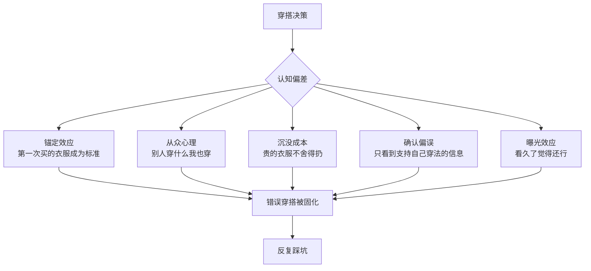
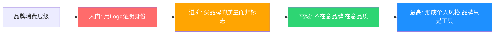
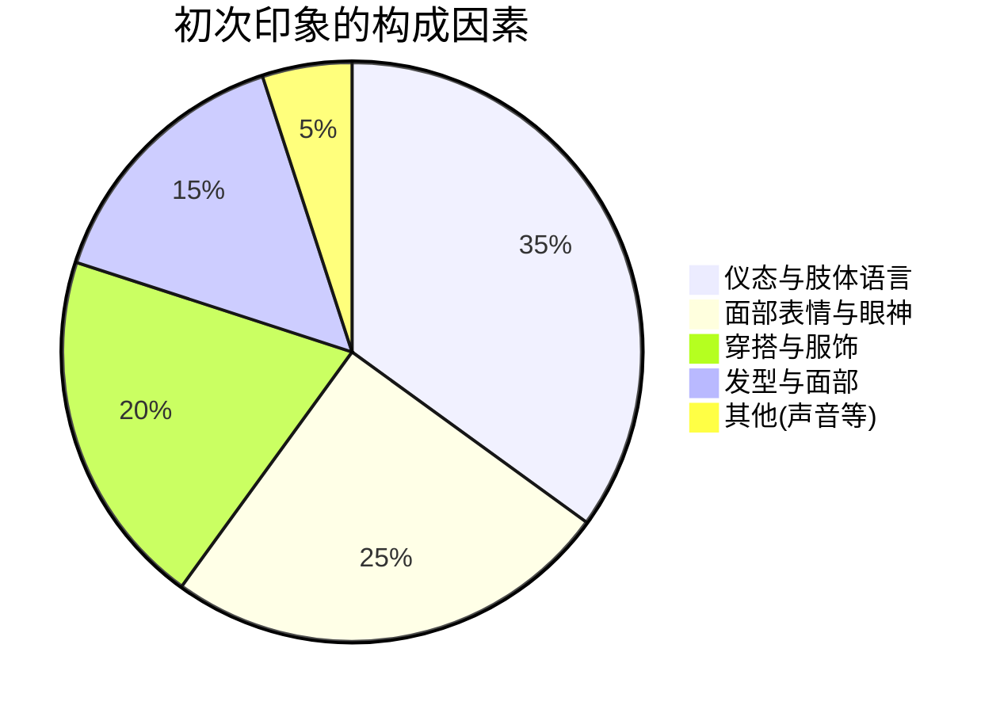
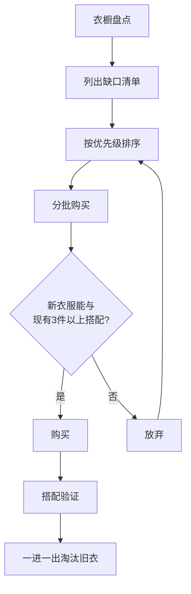
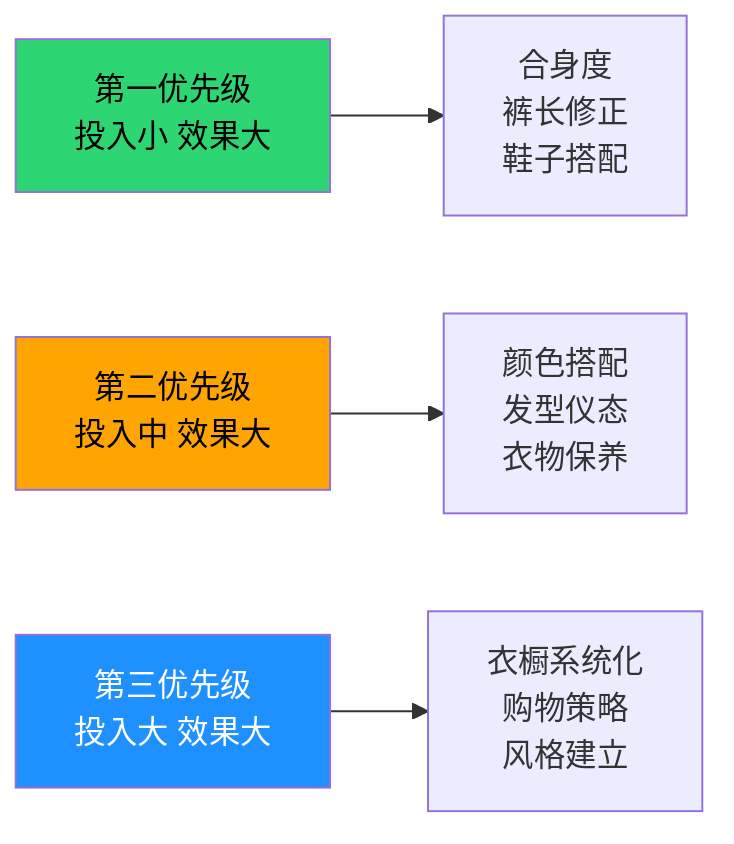

# 穿搭常见误区：从踩坑到避坑的完整指南

穿搭是一门实践性极强的技能，而犯错是学习过程中不可避免的环节。但并非所有错误都需要亲自踩过才能学会——前人走过的弯路，完全可以成为你的捷径。本章系统梳理了男性穿搭中最常见的误区，不仅告诉你"什么是错的"，更深入分析"为什么会犯错"以及"如何从根本上纠正"。

## 为什么我们会反复犯同样的穿搭错误？

在逐一拆解具体误区之前，有必要先理解一个底层问题：为什么很多人明明知道某些穿法不对，却还是会反复踩坑？这背后有深层的心理机制在起作用。

### 认知偏差与穿搭决策

**锚定效应**：你买的第一件"还不错"的衣服会成为后续购买的参照标准。如果那件衣服本身就偏大，你之后买的都会往偏大的方向走，因为"正常尺寸"在你心里已经被锚定在一个错误的位置上。

**从众心理**：身边的朋友、同事穿什么，你很容易跟着穿。如果周围的人都穿宽松运动服，你穿合身的衬衫反而会觉得"太正式了"。这就是环境对审美的驯化。

**沉没成本**：花800块买了一件不合适的外套，理性做法是止损，但大多数人会选择"将就穿"，结果每次穿都不满意，还占着衣橱的位置。

**确认偏误**：当你喜欢某种穿法时，你会选择性地忽略负面反馈。有人说你穿黑色显老，你会想"他不懂时尚"，而不是认真考虑这个意见。

**曝光效应**：任何东西看久了都会觉得"还行"。这就是为什么你衣橱里那些三年没穿过的衣服，每次整理时你都会觉得"说不定哪天能穿"然后又放回去。

### 误区形成的典型路径

大多数穿搭误区遵循一个共同的形成路径：

1. **起点**：某次穿搭获得正面反馈（或自我感觉良好）
2. **固化**：将这次成功归因于某个具体元素（如黑色、宽松、大Logo）
3. **泛化**：在所有场合复制这个元素，不管是否合适
4. **僵化**：形成固定的穿搭模式，拒绝尝试新的可能性
5. **脱节**：这个模式与你的实际身材、年龄、场合需求逐渐脱节

打破这个循环的关键，是学会**将穿搭决策建立在客观事实（身材数据、色彩理论、场合需求）之上，而不是主观感觉和惯性**。

***

## 误区一：衣服越宽松越舒服，也越能遮肉

### 误区描述

很多人（尤其是对自己身材不太自信的人）倾向于穿宽松的衣服，认为这样既舒服又能遮住身材的缺点。常见的表现是：买大一号的衣服、选择宽松版型的裤子、避免一切修身款式。

### 心理根源

这个误区的核心是**逃避心理**——与其面对身材问题并用穿搭技巧去优化，不如直接用布料把身体"藏起来"。但布料不会因为你躲进去就让你变瘦，它只会让你看起来更大。

### 为什么是误区？

宽松的衣服不仅不能遮肉，反而会让你看起来更胖更矮。具体原因如下：

| 宽松穿搭的效果 | 修身穿搭的效果 |
|----------------|----------------|
| 增加视觉体积，整体轮廓扩大 | 展现身体自然线条，轮廓清晰 |
| 上下身混为一体，看不到腰线 | 明确腰线位置，上下身比例分明 |
| 衣服起皱堆叠，显得邋遢 | 衣服平整服帖，显得精神利落 |
| 压低视觉重心，腿显得更短 | 提高视觉重心，腿显得更长 |
| 给人"放弃自己"的信号 | 给人"注重形象"的信号 |

### 正确做法

- **选择合身但不紧身的衣服**：衣服应该贴合身体曲线，但不紧勒
- **判断标准**：穿上衣服后，能在衣服和身体之间放入一个拳头的空间
- **修身不等于紧身**：修身（Slim Fit）是有一定活动空间的贴合，紧身（Skinny）是紧紧包裹身体
- **你的特别建议**：普通身高/正常体重的身材更适合修身直筒版型，既不太紧也不太松，能在视觉上收窄身体轮廓

### "遮肉"的正确方式

遮肉不是用宽松的衣服把身体包起来，而是通过**视觉引导**让别人的眼睛忽略你不想展示的部分：

- **V领上衣**：引导视线纵向移动，拉长颈部线条，弱化脸部和腹部的视觉宽度
- **竖条纹**：在视觉上产生纵向拉伸效果，比横条纹显瘦
- **深色上装+浅色下装**：将视线从上半身（如果上半身偏胖）引导到下半身
- **合身的肩线**：肩线落在肩膀边缘，而不是掉到手臂上——这是合身与否最关键的判断点

### 具体改进方案

1. 把衣橱中所有大一号的衣服淘汰或送去裁缝修改
2. 购买衣服时，以合身度为第一标准，而不是品牌或价格
3. 在试衣间做抬手、弯腰、坐下的动作，确保活动自如
4. 学会看尺码表：不要只看S/M/L，关注胸围、肩宽、衣长这三个核心数据
5. 如果在线上购买，先量好自己的身体数据，对照尺码表下单

***

## 误区二：黑色最百搭，所以全部买黑色

### 误区描述

"不知道穿什么就穿黑色"——这句话本身没错，但很多人因此把衣橱变成了"全黑系列"，从头到脚都是黑色，没有任何变化。

### 心理根源

黑色之所以成为"安全色"，是因为它**不需要搭配能力**。全黑出门不会出错，但也绝对不会出彩。选择全黑本质上是用"不出错"替代了"要出彩"——这是一种防守型思维，而不是进攻型思维。

### 为什么是误区？

- **过于沉闷**：全身黑色如果没有面料和质感的变化，会显得非常沉闷压抑，尤其在自然光下
- **缺乏层次**：全黑搭配如果处理不好，会像一个"黑色柱子"，没有视觉焦点
- **不适合所有场合**：在一些轻松的社交场合，全黑可能显得过于严肃、有距离感
- **忽略肤色**：对亚洲人来说，大面积黑色会让脸色显得暗沉，尤其是靠近脸部的黑色上衣
- **面料限制**：黑色对棉质面料非常不友好——棉质黑色衣物洗几次就会发灰发旧，质感大打折扣

### 正确做法

- **黑色作为基础，但不是全部**：衣橱中黑色占30-40%即可
- **用其他深色替代**：深蓝色、深灰色、深棕色都是很好的替代色，它们同样百搭但更有层次感
- **全黑搭配时注重层次**：通过不同面料（棉、毛、皮）和不同明度（纯黑、深灰黑）创造视觉层次
- **加入一个亮点**：全黑搭配时，用一个非黑色的单品（如白色鞋、棕色包、银色手表）打破沉闷

### 深色系的替代方案

| 替代色 | 适合肤色 | 搭配难度 | 推荐单品 |
|--------|----------|----------|----------|
| 藏青/海军蓝 | 所有肤色 | 低 | 西裤、西装外套、针织衫 |
| 炭灰色 | 所有肤色 | 低 | 西裤、卫裤、大衣 |
| 深棕色/咖啡色 | 暖肤色 | 中 | 皮鞋、皮带、针织衫 |
| 墨绿色 | 冷肤色 | 中 | 夹克、衬衫、卫衣 |
| 深酒红 | 暖肤色 | 高 | 针织衫、领带、配饰 |

### 具体改进方案

1. 衣橱中加入深蓝色、炭灰色、卡其色等其他中性色
2. 尝试"深色+深色"但不同色的搭配（如深蓝上衣+深灰裤子）
3. 全黑搭配时，选择有质感差异的面料组合（如黑色毛衣+黑色皮裤+黑色麂皮鞋）
4. 买黑色衣物时优先选择羊毛、羊绒、皮革等高级面料，避免纯棉黑色（容易发灰）
5. 如果肤色偏黄偏暗，将黑色从靠近脸部的位置移到下半身

***

## 误区三：追求品牌Logo，认为Logo越大越有面子

### 误区描述

很多人买衣服时首先看的是品牌Logo，认为穿着大Logo的衣服能彰显身份和品味。常见的表现是：T恤胸前印着巨大的品牌标志、外套上满是品牌图案、鞋子选择最显眼的款式。

### 心理根源

大Logo的本质是**用金钱购买社交信号**。当你还没有建立起自己的穿搭品味时，品牌Logo提供了一个"捷径"——不需要懂搭配，穿上名牌就能显得"有身份"。但真正的品味恰恰体现在**不需要借助品牌标志就能展现质感**的能力上。

### 为什么是误区？

- **过时的趋势**：大Logo是2000年代的时尚，现在的趋势是低调和极简。时尚圈有一句话："Logos are for people who can't afford taste."
- **显得廉价**：真正有品味的人通常选择低调的款式，大Logo反而显得"在炫耀"，这种炫耀在社交场合中往往适得其反
- **搭配困难**：大Logo的衣服很难与其他单品搭配，因为它本身就是视觉焦点，限制了穿搭的可能性
- **降低质感**：Logo越大，衣服的设计感越弱。品牌会把更多的成本花在Logo印刷上，而不是面料和剪裁上
- **信号错位**：大Logo传达的信号是"我需要品牌来证明自己"，而不是"我本身就有品味"

### 正确做法

- **选择无Logo或小Logo的款式**：让衣服本身的剪裁和面料说话
- **投资质感而非标志**：同样价格，选择面料更好、剪裁更精的无Logo款
- **配饰可以有品牌感**：手表、皮带扣等配饰可以展示品牌，但应低调精致（如一块简洁的机械表比满身Logo更有说服力）
- **"老钱风"（Old Money）才是真高级**：真正的品味体现在面料、剪裁和搭配上，而不是Logo上

### 品牌消费的正确姿态

### 具体改进方案

1. 逐步淘汰衣橱中大Logo的衣服
2. 购买基础款时优先选择无Logo设计
3. 如果预算允许，投资在面料和剪裁上，而不是品牌标志上
4. 学会辨识"隐性品质"：看走线密度、纽扣材质、面料成分标签
5. 了解品牌的产品线层级：同一品牌的不同产品线品质差异巨大

***

## 误区四：忽略衣服的保养和打理

### 误区描述

很多人只关注买衣服，却不关注衣服的保养。常见表现是：衣服起球了继续穿、衬衫有褶皱不熨烫、鞋子脏了不擦、衣服洗后变形了不处理。

### 心理根源

这个误区的本质是**重购买轻维护**。购买新衣服能带来即时的满足感，而保养衣服是一个持续的、没有即时回报的行为。人的大脑天生倾向于追求即时满足，而忽视长期价值。

### 为什么是误区？

- **降低衣服寿命**：不当的保养会让衣服快速老化。一件500元的衬衫如果保养得当可以穿3年，保养不当可能1年就不像样了——相当于每年多花了333元
- **影响整体形象**：再好的搭配，如果衣服起球、褶皱、脏污，都会大打折扣。褶皱的衬衫比没有衬衫更糟糕，因为它传递的信息是"我注意到了但不在乎"
- **浪费金钱**：不保养导致衣服提前报废，需要更频繁地购买新衣。统计数据显示，注重衣物保养的人每年在服装上的支出比不注重保养的人少30-40%

### 核心保养体系

#### 洗涤保养

| 面料类型 | 洗涤方式 | 水温 | 注意事项 |
|----------|----------|------|----------|
| 棉质 | 机洗 | 30-40°C | 深色翻面洗，避免烘干 |
| 羊毛 | 手洗或干洗 | 冷水 | 不可拧绞，平铺晾干 |
| 羊绒 | 干洗为主 | — | 手洗用专用洗涤剂 |
| 丝绸 | 手洗 | 冷水 | 不可暴晒，阴干 |
| 牛仔 | 机洗 | 冷水 | 翻面洗，少洗（穿3-5次再洗） |
| 亚麻 | 机洗 | 30°C | 接受褶皱是亚麻的特性 |
| 化纤 | 机洗 | 30°C | 避免高温烘干 |

#### 熨烫指南

- **棉质衬衫**：中高温（200°C），可喷蒸汽，从领子开始往下熨
- **羊毛/羊绒**：低温（140°C），必须垫湿布，避免直接接触
- **丝绸**：低温（110°C），反面熨烫，垫布
- **西裤**：中高温，熨出裤线（裤线从裤脚一直延伸到裤裆处）
- **T恤**：一般不需要熨烫，如需要则低温反面熨烫

#### 收纳体系

衣橱分区：
├── 悬挂区（外套、衬衫、西装）
│   ├── 使用宽肩木质衣架（避免铁丝衣架导致肩膀变形）
│   ├── 衣物间距保持2-3cm（通风防皱）
│   └── 按颜色深浅排列
├── 折叠区（T恤、毛衣、卫衣）
│   ├── 毛衣必须折叠（悬挂会拉长变形）
│   ├── 使用抽屉分隔器
│   └── 按类别分区
├── 裤架区（西裤、休闲裤）
│   ├── 西裤倒挂（裤脚朝上）可减少褶皱
│   └── 使用裤夹衣架
└── 配件区（皮带、领带、手表）
    ├── 皮带卷起存放
    ├── 领带挂起或卷起
    └── 使用专用收纳盒

### 具体改进方案

1. 购买以下保养工具：去球器（30-50元）、蒸汽熨斗（200-400元）、鞋刷+鞋油（50元）、毛衣防虫片
2. 每周花30分钟整理和保养衣物（建议固定在周日晚上）
3. 建立衣物洗涤指南（打印出来贴在洗衣机旁）
4. 购买衣物时注意看洗标，不接受"只能干洗"的日常衣物（成本太高）
5. 季节交替时做一次衣橱大整理：清洗、修补、淘汰

***

## 误区五：盲目追随潮流，忽略自身特点

### 误区描述

每当新的时尚潮流出现，就立刻跟进购买。别人穿什么自己就穿什么，不考虑是否适合自己。

### 心理根源

盲目追潮流的背后是**身份焦虑**——害怕被群体排斥，害怕被认为"土"。社交媒体加剧了这种焦虑，每天刷到的穿搭博主都在展示最新的潮流单品，让人觉得不跟上就会"落伍"。

但事实是：**潮流是商业驱动的，不是审美驱动的**。品牌每季推出新潮流，本质上是为了让你觉得上一季的衣服"过时了"，从而继续消费。

### 为什么是误区？

- **潮流变化快**：每一季的潮流都在变化，盲目追赶会导致衣橱中充满过时的单品。一个潮流的平均生命周期只有2-3季
- **不适合所有人**：很多潮流款是为特定身材设计的（模特身材），不一定适合普通人的日常穿着
- **浪费金钱**：潮流单品的穿着周期短，性价比低。花500元买的潮流款可能只穿3次就过时了，而500元买的经典款可以穿3年
- **失去个人风格**：总是追随别人，无法形成自己的风格。风格需要时间沉淀，频繁切换潮流只会让你永远在模仿

### 正确做法

- **以经典款为基础**：80%的衣橱应该是不受潮流影响的经典款
- **选择性跟进潮流**：只选择适合自己的潮流元素，小面积尝试（如一个配饰、一种颜色）
- **关注适合自己身材的款式**：潮流可以参考，但要根据自己的身材做调整
- **建立个人风格**：找到适合自己的风格后，不轻易被潮流左右

### 经典款 vs 潮流款

| 维度 | 经典款 | 潮流款 |
|------|--------|--------|
| 生命周期 | 5年以上 | 1-2季 |
| 搭配性 | 极高，百搭 | 有限，特定搭配 |
| 单次穿着成本 | 低（穿得多） | 高（穿得少） |
| 适合投资金额 | 中高 | 低 |
| 代表单品 | 白衬衫、深色西裤、Polo衫、风衣 | 当季流行色、特殊剪裁、联名款 |

### 具体改进方案

1. 衣橱中经典款和潮流款的比例控制在8:2
2. 尝试新潮流时，先从小件配饰开始，不直接购买大件
3. 关注长期趋势（如极简主义、可持续时尚），而不是短期潮流
4. 建立一个"冷静期"规则：看到潮流单品想买时，等3天再决定
5. 定期整理衣橱，把超过一年没穿过的衣服淘汰——它们大概率是潮流踩坑

***

## 误区六：颜色搭配混乱，全身超过3种颜色

### 误区描述

很多人穿衣服时颜色搭配随意，身上同时出现4-5种甚至更多颜色。常见表现是：彩色上衣+花裤子+彩色鞋+花哨配饰。

### 心理根源

颜色搭配混乱通常源于两个原因：一是**缺乏色彩基础知识**，不知道哪些颜色能放在一起；二是**用颜色数量来表达个性**，认为颜色越多越"有活力"。但高级感恰恰来自于克制。

### 为什么是误区？

- **视觉混乱**：过多的颜色让人眼花缭乱，不知道看哪里。人类视觉系统在处理3种以内的颜色时最舒适
- **降低质感**：颜色越多，越难显得高级。高端品牌的广告几乎都是2-3色系
- **增加搭配难度**：颜色越多，出错的概率越大。每增加一种颜色，出错概率指数级增长
- **掩盖剪裁**：当颜色成为视觉焦点时，衣服的剪裁和面料这些真正体现品质的元素反而被忽略了

### 正确做法

- **全身颜色不超过3种**（不含黑白灰等无彩色）
- **用中性色做基础**：黑、白、灰、深蓝、卡其等中性色占全身的70-80%
- **一个亮点原则**：每套搭配最多一个彩色亮点
- **同色系搭配最安全**：不同深浅的同一色系怎么搭都不会错

### 颜色搭配的三个安全公式

**公式一：中性色+一个亮点色**
上衣：白色/浅灰
裤子：深蓝/黑色
鞋：白色/棕色
亮点：一件彩色配饰或一件彩色内搭

**公式二：同色系深浅搭配**
上衣：浅蓝衬衫
裤子：深蓝西裤
鞋：棕色皮鞋
整体：蓝色系，深浅变化，和谐统一

**公式三：对比色但低饱和度**
上衣：灰蓝色针织衫
裤子：卡其色休闲裤
鞋：棕色皮鞋
整体：冷暖对比但都不刺眼

### 具体改进方案

1. 衣橱以中性色为主（70%），点缀色为辅（30%）
2. 搭配时先选定一个主色，再用中性色搭配
3. 拍照后检查，如果颜色超过3种，去掉一个
4. 学习基本的色彩搭配理论（参考本章色彩理论部分）
5. 建立自己的"安全色卡"：记录哪些颜色组合在自己身上效果好

***

## 误区七：不注意裤子的长度和版型

### 误区描述

很多人在购买裤子时只关注腰围，忽略了裤长和版型。常见问题：裤腿过长堆在鞋面上、裤子过紧暴露腿型、裤子过宽显得腿粗。

### 为什么是误区？

- **裤长影响身材比例**：过长的裤腿会在视觉上缩短腿部，这对普通身高的身高来说尤其致命——每一厘米的视觉身高都很宝贵
- **版型影响整体效果**：不合适的版型会让身材缺点更加明显
- **容易显得邋遢**：裤腿堆积在鞋面上是穿搭中最常见的"失误"，它会让最贵的鞋子看起来也像地摊货

### 裤长的精确标准

| 裤型 | 理想长度 | 视觉效果 | 适合场合 |
|------|----------|----------|----------|
| 正式西裤 | 轻微接触鞋面，1-2个褶皱（Break） | 优雅、正式 | 商务、正式场合 |
| 休闲西裤 | 刚好到鞋面，无褶皱（No Break） | 干练、现代 | 办公室、约会 |
| 九分裤 | 露出2-3cm脚踝 | 轻松、年轻 | 休闲、夏季 |
| 牛仔裤 | 到鞋面或微卷 | 随性、自然 | 日常休闲 |
| 短裤 | 膝盖上方5-10cm | 利落 | 夏季休闲 |

### 版型选择指南

对于普通身高/正常体重、55开比例的身材：

- **首选：修身直筒（Slim Straight）**——从大腿到裤脚宽度一致，既不紧也不松，是万能版型
- **次选：锥形裤（Tapered）**——大腿处略宽松，裤脚逐渐收窄，适合大腿偏粗的人
- **避免：紧身（Skinny）**——太紧会暴露腿部每一条线条，包括不完美的部分
- **避免：宽松（Relaxed/Baggy）**——会让腿部看起来更粗，压低视觉重心

### 具体改进方案

1. 检查衣橱中所有裤子的长度，过长的送去修改（改裤长通常只需20-30元）
2. 以后购买裤子时，先确认裤长是否合适
3. 准备2-3种不同长度的裤子：全长、九分、七分
4. 买裤子时一定试穿并搭配常穿的鞋子——不同鞋型需要不同裤长
5. 学会判断裤裆位置：裤裆应该在实际裆部位置，过高不舒服，过低显腿短

***

## 误区八：忽略鞋子的重要性

### 误区描述

很多男性在穿搭上花了大量心思在衣服上，却忽略了鞋子。常见表现是：一双运动鞋穿所有场合、鞋子脏了不擦、鞋子与整体风格不搭配。

### 为什么是误区？

- **鞋子是穿搭的"地基"**：再好的搭配，如果鞋子不对，整体效果都会大打折扣。心理学研究表明，人们在评估他人整体形象时，鞋子的权重高达20-30%
- **别人会注意你的鞋**：研究表明，人们在初次见面时会下意识地从下往上看——先看鞋，再看衣服，最后看脸
- **鞋子影响身材比例**：鞋子的款式和颜色直接影响腿部线条和整体比例。深色鞋子让腿看起来更长，笨重的鞋子让腿看起来更短

### 鞋柜的最小可行配置

至少准备以下3双鞋，覆盖95%的日常场合：

| 鞋型 | 颜色 | 适合场合 | 预算建议 |
|------|------|----------|----------|
| 白色运动鞋 | 白色 | 日常休闲、轻运动 | 300-800元 |
| 深色皮鞋 | 黑色或深棕 | 正式场合、商务 | 500-1500元 |
| 休闲靴 | 棕色或黑色 | 秋冬季节、约会 | 400-1000元 |

### 鞋裤搭配原则

- **深色裤子配深色鞋**：黑色裤子配黑色鞋，深蓝裤子配深棕鞋
- **浅色裤子配浅色鞋**：卡其裤配白色运动鞋或浅棕皮鞋
- **鞋裤颜色不要完全一样**：要有一定的色差，否则腿和脚会连成一片
- **裤脚宽度要与鞋子匹配**：窄裤脚配窄鞋型，宽裤脚配稍宽的鞋型

### 具体改进方案

1. 购买一双白色运动鞋和一双深色皮鞋作为基础
2. 每周花5分钟擦拭鞋子（皮鞋用鞋油，运动鞋用湿巾）
3. 准备鞋撑，延长皮鞋寿命（木质鞋撑50-100元）
4. 雨天穿防水鞋或用防水喷雾保护鞋子
5. 运动鞋发黄可以用牙膏+旧牙刷清洁

***

## 误区九：认为穿搭只靠衣服，忽略发型和仪态

### 误区描述

很多人把所有注意力都放在衣服上，却忽略了发型、仪态和整体形象的协调。常见表现是：衣服穿得很精致但头发乱糟糟、弯腰驼背、表情疲惫。

### 为什么是误区？

- **发型是"第二张脸"**：发型对整体形象的影响可能比衣服还大。一个合适的发型可以让脸型更协调，一个不合适的发型会让精心搭配的衣服白费
- **仪态决定气质**：再好的穿搭，如果弯腰驼背也会大打折背也会大打折扣。研究表明，良好的姿态可以让人看起来高2-3cm、瘦5-10斤
- **整体协调才是真高级**：穿搭是包括衣服、发型、仪态、表情在内的整体。只做好其中一项，效果有限

### 整体形象的权重分配

### 发型建议

对于方形脸（颧骨突出）的男性：

- **推荐**：两侧短、顶部稍长的发型，可以用纹理感弱化颧骨
- **推荐**：侧分发型，利用斜线条打破脸部的棱角感
- **避免**：两侧和顶部一样长的"蘑菇头"，会强调颧骨宽度
- **避免**：完全向后梳的大背头，会让颧骨完全暴露

### 仪态训练

良好的仪态不需要刻意"挺胸收腹"，而是通过日常训练形成肌肉记忆：

1. **靠墙站立**：每天靠墙站5分钟，后脑勺、肩胛骨、臀部、脚后跟贴墙
2. **下巴微收**：想象头顶有一根绳子向上拉，下巴自然微收
3. **肩膀后展**：肩膀向后打开，不要前扣
4. **步幅适中**：走路时步幅不要太大也不要太小，脚尖朝前
5. **坐姿端正**：坐椅子前1/2-2/3，不要靠在椅背上

### 具体改进方案

1. 找一个好理发师，沟通适合自己的发型（参考本章关于方形脸的发型建议）
2. 每天花2分钟对着镜子练习站姿
3. 建立基本的面部护理习惯（洁面→保湿→防晒，早上3分钟搞定）
4. 拍全身照检查自己的仪态，发现问题及时纠正
5. 录一段自己走路的视频，观察是否有驼背、低头等问题

***

## 误区十：一次性买太多，没有系统规划

### 误区描述

很多人在意识到穿搭问题后，一次性购买大量衣服，结果发现很多衣服买回来不知道怎么搭配，或者买了重复的款式。

### 心理根源

这是**补偿心理**在起作用——觉得自己"落后太多"，想一次性"追上来"。但穿搭能力的提升是一个渐进的过程，不可能通过一次购物就完成。一次性大量购买的最大问题是：你在还没有建立好穿搭品味的时候就做出了大量决策，这些决策的质量一定不高。

### 为什么是误区？

- **冲动消费**：一次性购买容易冲动，买回不需要的衣服。商场的环境、导购的话术都会影响你的判断
- **缺乏系统**：没有整体规划，买的衣服之间难以搭配。10件各自好看但互相不搭的衣服，等于0套可穿的搭配
- **浪费金钱**：买回来不穿的衣服就是浪费。研究表明，普通人衣橱中只有20-30%的衣服被 regular 穿着
- **衣橱混乱**：衣服越多，越难选择，越容易穿错——这就是"选择悖论"

### 正确的购物策略

### 具体改进方案

1. 每次购物前先查看衣橱，确认真正需要什么
2. 制定季度购物计划，按优先级购买
3. 买回来的衣服先在镜子前搭配现有衣橱中的单品
4. 如果一件新衣服不能与现有3件以上的单品搭配，考虑退换
5. 遵循"一进一出"原则：买一件新衣服，就淘汰一件旧衣服
6. 设定月度服装预算，避免超支

***

## 进阶误区：容易被忽视的隐性陷阱

以上十个是最常见的误区，但还有一些容易被忽视的隐性陷阱同样值得警惕。

### 误区十一：忽略面料的选择

很多人只关注衣服的款式和颜色，完全忽略面料。但面料是决定衣服质感和舒适度的核心因素。

| 面料 | 优点 | 缺点 | 适合场景 |
|------|------|------|----------|
| 纯棉 | 舒适透气，价格亲民 | 易皱、易变形、黑色易发灰 | 日常休闲 |
| 羊毛 | 质感好、保暖、不易皱 | 需要保养、价格较高 | 正式场合、秋冬 |
| 羊绒 | 极致舒适、轻盈保暖 | 价格高、需要精心保养 | 秋冬高品质单品 |
| 亚麻 | 透气凉爽、有质感 | 极易皱、需要接受褶皱 | 夏季休闲 |
| 聚酯纤维 | 不易皱、易打理 | 透气性差、质感一般 | 运动服、快时尚 |
| 丝绸 | 光泽好、舒适 | 难打理、不适合日常 | 特殊场合 |

**建议**：日常穿着优先选择棉质（含棉量>80%）和棉混纺；正式场合选择羊毛或羊毛混纺；夏季选择亚麻或高支棉。

### 误区十二：忽略季节性搭配

很多人一年四季穿同样的衣服，没有根据季节调整穿搭策略。

- **春季**：层次叠穿的最佳季节。薄外套+衬衫+T恤的三层叠穿既实用又有层次感
- **夏季**：注重面料的透气性。浅色比深色凉爽（浅色反射阳光，深色吸收热量）
- **秋季**：是展示色彩搭配能力的好时机。大地色系（棕色、卡其、橄榄绿）在秋季最和谐
- **冬季**：大衣是提升质感的利器。一件好的大衣比三件便宜的外套更有价值

### 误区十三：用衣服来"表达情绪"

很多人在心情不好时随便穿，心情好时过度穿。穿搭应该基于场合和目的，而不是情绪。

- 心情不好时随便穿→给别人留下不好的印象→心情更差→恶性循环
- 正确做法：保持基本的穿搭标准，无论心情如何

### 误区十四：过度依赖他人建议

听取建议是好的，但完全依赖他人（朋友、导购、博主）的建议而没有自己的判断，会导致穿搭缺乏个性。

- **朋友的建议**：可能带有个人偏好，不一定客观
- **导购的建议**：目标是让你购买，不一定是让你好看
- **博主的建议**：他们的身材和生活方式与你不同，照搬不一定合适

**正确做法**：广泛听取建议，但最终决策要基于自己的身材数据、场合需求和个人风格偏好。

***

## 自我诊断：你踩了几个坑？

用以下清单快速检查自己的穿搭习惯：

| # | 检查项 | ✅ 健康 | ⚠️ 需改进 |
|---|--------|---------|-----------|
| 1 | 衣服合身度 | 肩线在肩膀边缘，能放入一个拳头 | 肩线掉到手臂上，衣服明显偏大/偏小 |
| 2 | 衣橱颜色分布 | 中性色70%，彩色30% | 全黑或颜色过于杂乱 |
| 3 | Logo情况 | 无Logo或小Logo为主 | 大Logo衣物超过衣橱的20% |
| 4 | 衣物状态 | 干净平整，无起球褶皱 | 有起球、褶皱、污渍的衣物在穿 |
| 5 | 经典vs潮流 | 经典款占80% | 潮流款超过30% |
| 6 | 颜色数量 | 每套搭配不超过3种颜色 | 经常4种以上颜色 |
| 7 | 裤子长度 | 合适，无多余堆积 | 过长堆在鞋面上 |
| 8 | 鞋子情况 | 至少3双，保持干净 | 一双鞋穿所有场合 |
| 9 | 发型+仪态 | 整洁发型+良好姿态 | 头发凌乱或驼背 |
| 10 | 购物方式 | 有计划，分批购买 | 冲动购物，一次性大量购买 |

**评分标准**：
- 8-10项✅：穿搭基础扎实，继续保持
- 5-7项✅：有改进空间，优先解决⚠️项
- 0-4项✅：需要系统性改善，建议从最容易的开始

***

## 误区纠正的优先级排序

不是所有误区都需要同时纠正。按照**投入产出比**排序，建议按以下顺序改进：

**第一优先级（本周就能改）**：
- 把过长的裤子送去裁缝修改（20-30元/条）
- 试穿时检查肩线是否合身
- 准备一双干净的白色运动鞋

**第二优先级（一个月内改）**：
- 学习基本的色彩搭配（参考本章色彩理论）
- 找理发师沟通适合自己的发型
- 建立每周30分钟的衣物保养习惯

**第三优先级（三个月内改）**：
- 盘点衣橱，制定购物清单
- 建立系统的购物策略
- 逐步形成个人风格

***

## 总结：从误区到正途的核心原则

| 误区 | 核心纠正 | 底层逻辑 |
|------|----------|----------|
| 穿宽松遮肉 | 选择合身但不紧身的修身款 | 合身展现线条 > 宽松增加体积 |
| 全买黑色 | 黑色占30-40%，加入其他深色 | 多样深色比单调黑色更有层次 |
| 追求大Logo | 选择无Logo或小Logo的质感款 | 品质说话 > 标志说话 |
| 忽略保养 | 建立基本的衣物保养习惯 | 维护比购买更省钱 |
| 盲目追潮流 | 经典款80%+潮流款20% | 经典永不过时 |
| 颜色过多 | 全身不超过3种颜色 | 克制即高级 |
| 不注意裤长 | 裤长精确控制，过长就改 | 细节决定成败 |
| 忽略鞋子 | 至少3双鞋，保持干净 | 鞋子是穿搭地基 |
| 忽略发型仪态 | 发型+仪态+穿搭三位一体 | 整体大于部分之和 |
| 一次性买太多 | 分批购买，先买基础款 | 系统规划 > 冲动消费 |
| 忽略面料 | 了解面料特性，按需选择 | 面料决定质感 |
| 忽略季节 | 根据季节调整穿搭策略 | 适应环境 > 一成不变 |

**最后的建议**：改变穿搭习惯需要时间，不要期望一夜之间变成时尚达人。从最容易改变的地方开始（如合身度、裤长），逐步优化。每一次小小的改变，都是向更好的自己迈进的一步。穿搭的终极目标不是成为时尚达人，而是**让外表与内在的你相匹配**——当你穿对了衣服，你会更自信，更自在，更像你自己。
