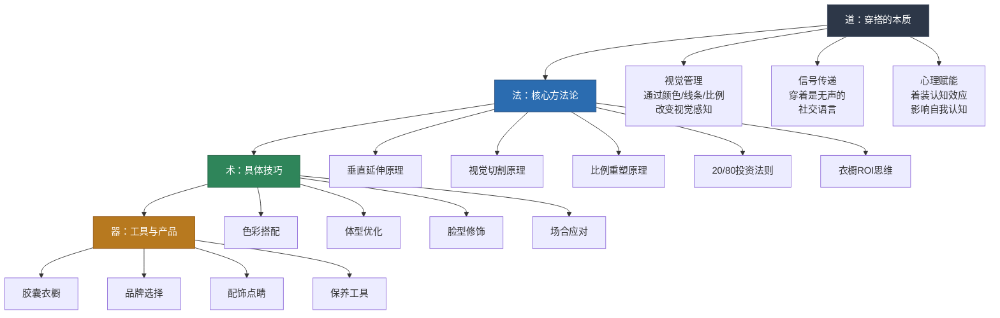
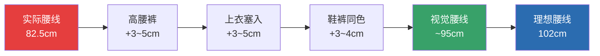
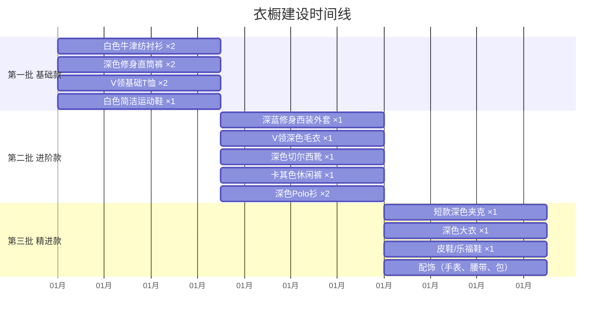
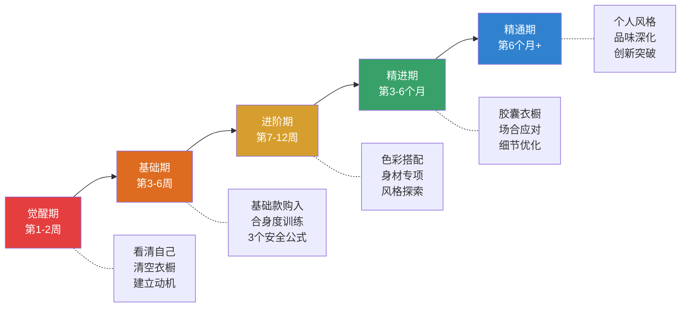

# 第三章小结：穿搭知识体系全景回顾与行动指南

> "知道规则的人是聪明的，知道何时打破规则的人是智慧的。" ——Coco Chanel

本章从基础理论到具体方案，从产品推荐到学习路径，为你构建了一套完整的穿搭提升体系。作为章节的收尾，本小结不只是简单复述要点——它是一张**全景地图**，帮你把分散在各小节的知识点串联成完整的认知网络；它也是一份**实战速查手册**，让你在日常穿搭决策中能快速找到答案。

## 一、本章知识架构总览

本章按照"道法术器"的逻辑框架展开，从底层原理到实操工具层层递进。理解这个架构，能帮你建立系统性的穿搭思维，而不是零散地记技巧。

## 二、四大核心原理：贯穿全章的底层逻辑

穿搭技巧千变万化，但底层原理只有四个。掌握这四个原理，你就能理解所有技巧背后的"为什么"，从而在任何情况下都能自主判断，而不是死记硬背搭配公式。

### 2.1 垂直延伸原理——让身体"变长"

**核心机制**：人眼会沿着连续的线条移动。当垂直方向的线条或色块连贯时，大脑会感知到"更长"的纵向距离。

**实操方法**：

| 技巧 | 操作 | 显高效果 | 适用场景 |
|------|------|---------|---------|
| 同色系纵向 | 上下身使用同一色系不同深浅 | 显高5-6cm | 所有场合 |
| V领延伸 | 选择V领或尖领上衣 | 颈部延伸2-3cm | T恤、毛衣、衬衫 |
| 竖条纹 | 选择竖条纹面料 | 视觉拉伸3-4cm | 衬衫、针织衫 |
| 鞋裤同色 | 鞋子颜色与裤子接近 | 腿部延伸3-4cm | 所有场合 |

**你的关键应用**：普通身高身高 + 五五开比例，垂直延伸原理是你最核心的武器。优先使用"同色系纵向"和"鞋裤同色"两个技巧，叠加使用效果最显著。

### 2.2 视觉切割原理——避免身体"变短"

**核心机制**：水平方向的色块边界会将身体"切断"，让大脑感知为多个独立段落，从而缩短整体纵向感知。

**需要避免的切割线**：

| 切割来源 | 问题描述 | 解决方案 |
|---------|---------|---------|
| 上下身强对比 | 浅色上衣+深色下装形成明显分界线 | 用腰带过渡色衔接，或选择中间色调 |
| 腰带颜色突兀 | 腰带颜色与裤子反差过大 | 腰带与裤子同色或近似色 |
| 上衣过长遮臀 | 衣摆垂到臀部形成水平线 | 选择短款上衣或塞入裤中 |
| 横条纹在腰部 | 横向纹路增加腰部视觉宽度 | 横条纹只用在上半身（增加肩宽） |

**你的关键应用**：五五开身材最大的敌人就是腰线位置不明确导致的视觉切割。每一套搭配都要检查：腰线在哪里？是否被上衣下摆遮挡？腰带颜色是否造成了额外切割？

### 2.3 比例重塑原理——创造"黄金分割"

**核心机制**：通过改变腰线位置和上下身长度比例，可以重塑身体的视觉比例。理想比例是黄金分割（0.618），即下半身占比约62%。

**针对你的情况**：普通身高身高，理想腰线位置约102cm（从地面算起），而五五开的实际腰线约82.5cm。虽然不可能完全弥补，但通过以下叠加技巧可以实现视觉上提升8-12cm的效果：

**操作优先级**：高腰裤 > 上衣塞入 > 鞋裤同色 > 短款上衣。前三个技巧叠加使用，效果最为显著。

### 2.4 视觉重心引导——控制"看哪里"

**核心机制**：人眼会自然被亮色、图案、装饰、对比色等元素吸引。通过控制这些元素的位置，可以引导他人的视线。

**应用策略**：

| 目标 | 方法 | 你的适用性 |
|------|------|-----------|
| 引导视线到上半身 | 亮色上衣、有趣的配饰、V领设计 | 适合——将注意力从五五开的下半身转移 |
| 弱化下半身 | 下装保持简洁、深色、无装饰 | 适合——深色修身裤是最优解 |
| 强调面部区域 | 领口设计、项链、帽子 | 适合——配合方形脸的修饰策略 |

## 三、你的个人穿搭策略速查表

以下是根据你的个人数据（普通身高、正常体重、五五开比例、方形脸、28岁）定制的核心策略总结。

### 3.1 显高策略矩阵

| 维度 | 策略 | 具体操作 | 效果 |
|------|------|---------|------|
| 色彩 | 上下同色系 | 深蓝上衣+深蓝牛仔裤+深色鞋 | 消除视觉切割，显高5-6cm |
| 腰线 | 提升腰线位置 | 高腰裤+上衣塞入 | 视觉腰线提高5-8cm |
| 领型 | V领延伸 | 选择V领T恤、尖领衬衫 | 颈部线条延伸2-3cm |
| 鞋子 | 鞋裤同色 | 深色裤配深色鞋 | 腿部延伸到脚尖 |
| 裤长 | 精准裤长 | 裤脚到鞋面，不堆叠 | 避免裤脚堆积"吃掉"腿长 |
| 上衣 | 短款优先 | 衣长到腰带扣位置 | 不遮挡腰线 |

### 3.2 五五开身材优化矩阵

| 策略 | 操作 | 原理 |
|------|------|------|
| 高腰裤 | 选择中高腰款式，裤腰在肚脐附近 | 实际提高腰线2-3cm |
| 上衣塞入 | 衬衫/T恤前摆塞入裤腰 | 明确腰线位置，拉长下半身视觉 |
| 短款外套 | 外套下摆到髋骨，不到臀部 | 避免遮挡腰线 |
| 腰带同色 | 腰带颜色与裤子接近 | 避免额外水平切割线 |
| 深色下装 | 下半身统一深色 | 收缩下半身视觉宽度 |
| 扣位偏高的西装 | 两粒扣西装，扣子位置偏高 | 西装的视觉腰线上移 |

### 3.3 方形脸修饰矩阵

| 修饰方向 | 推荐 | 避免 |
|---------|------|------|
| 领型 | V领、尖领、小圆领 | 高领、窄领、一字领 |
| 发型 | 两侧保留适当蓬松感，纹理短发，侧分 | 两侧完全推光、蘑菇头、大背头 |
| 眼镜 | 椭圆形或圆角矩形镜框 | 方形或尖角镜框 |
| 帽子 | 中等帽檐棒球帽、渔夫帽 | 窄檐礼帽、过于紧贴的针织帽 |
| 围巾 | 松散围法，增加下巴区域视觉宽度 | 紧裹式围法 |

### 3.4 色彩搭配安全公式

| 公式 | 上装 | 下装 | 鞋子 | 适用场合 |
|------|------|------|------|---------|
| 浅上深下 | 白T/浅蓝衬衫 | 深蓝牛仔裤/炭灰西裤 | 白色运动鞋 | 日常休闲、办公 |
| 同色系纵向 | 深蓝针织衫 | 深蓝牛仔裤 | 深色鞋 | 所有场合（最显高） |
| 商务休闲 | 白/浅蓝衬衫 | 卡其休闲裤 | 乐福鞋 | 办公室、约会 |
| 全深色系 | 黑色高领+深蓝西装外套 | 黑色修身裤 | 切尔西靴 | 派对、正式社交 |
| 中性色+亮点 | 灰色基础款 | 深色下装 | 中性色鞋 | 用一个彩色配饰提亮 |

**核心规则**：全身颜色不超过3种（不含黑白灰无彩色），中性色占70-80%。

## 四、衣橱建设全景图

### 4.1 分阶段购入路线图

### 4.2 预算规划参考

| 阶段 | 单品数量 | 预算范围 | 品牌建议 | 核心目标 |
|------|---------|---------|---------|---------|
| 第一批 | 7件 | 800-1500元 | 优衣库、Zara、H&M | 建立"不出错"的日常衣橱 |
| 第二批 | 6件 | 1000-2500元 | COS、Massimo Dutti、Levi's | 覆盖商务休闲场景 |
| 第三批 | 4件+配饰 | 1500-4000元 | Hugo Boss、Theory、Suitsupply | 建成完整胶囊衣橱 |
| **合计** | **~17件+配饰** | **3300-8000元** | — | **覆盖全部日常场合** |

**核心原则**：合身度 > 质感 > 品牌。一件合身的优衣库衬衫，比一件不合身的名牌衬衫穿起来好看得多。

### 4.3 胶囊衣橱的数学逻辑

你不需要上百件衣服才能穿得好看。胶囊衣橱的核心理念是：少量高百搭性单品，每件都能与至少3件其他单品搭配。

| 季节 | 上装 | 下装 | 外套 | 鞋子 | 配饰 | 合计 |
|------|------|------|------|------|------|------|
| 春夏 | 7 | 5 | 0 | 3 | 3 | 18件 |
| 秋冬 | 6+3内搭 | 4 | 3 | 3 | 3 | 22件 |
| 全年核心 | 10 | 6 | 3 | 4 | 3 | **26件** |

26件单品 × 理论搭配组合 > 200种 → 一年不重复都够用。

## 五、场合穿搭速查表

面对任何场合，5分钟内完成得体搭配——这是精进期的核心能力目标。以下是速查表：

| 场合 | 上装 | 下装 | 鞋子 | 关键细节 |
|------|------|------|------|---------|
| 正式商务 | 白衬衫+深蓝西装外套 | 炭灰西裤 | 黑色德比鞋 | 提前熨烫，皮带与鞋同色 |
| 日常办公 | 浅蓝衬衫（袖口卷起） | 卡其/炭灰休闲裤 | 乐福鞋 | 可不穿外套 |
| 朋友聚会 | 深蓝Polo衫/条纹T恤 | 深蓝牛仔裤 | 白色运动鞋 | 轻松但不随便 |
| 社交派对 | 黑色高领针织+深蓝西装外套 | 黑色修身裤 | 切尔西靴 | 全深色系最安全 |
| 周末休闲 | 白色V领T恤 | 深蓝牛仔裤 | 帆布鞋/运动鞋 | 舒适为主 |
| 约会 | 浅蓝衬衫+深蓝V领毛衣 | 深色修身裤 | 切尔西靴 | 精致但不刻意，淡香水 |
| 户外活动 | 军绿/深蓝夹克+T恤 | 工装裤/深色休闲裤 | 运动鞋/工装靴 | 注重功能性 |

## 六、常见误区速查表

以下是本章"常见误区"部分的核心纠正要点，在日常穿搭决策中随时对照：

| 误区 | 错误做法 | 正确做法 | 核心原理 |
|------|---------|---------|---------|
| 宽松遮肉 | 买大一号、穿宽松版型 | 修身直筒，衣服与身体一拳空间 | 宽松增加视觉体积，反而显胖 |
| 全黑百搭 | 衣橱全黑，无色彩变化 | 黑色占30-40%，加入深蓝/炭灰/深棕 | 全黑沉闷，且棉质黑色易发灰 |
| 追求大Logo | 满身品牌标志 | 无Logo高品质基础款 | 大Logo是用钱买信号，真品味靠质感 |
| 忽略保养 | 起球、褶皱、脏鞋继续穿 | 每周30分钟保养，去球器+蒸汽熨斗 | 保养得当，单次穿着成本降70% |
| 盲目追潮流 | 每季跟进最新款 | 80%经典款+20%潮流元素 | 潮流是商业驱动，经典才是审美驱动 |
| 颜色混乱 | 全身4-5种颜色 | 不超过3种，中性色占70-80% | 3色以内视觉最舒适 |
| 忽略裤长 | 裤脚堆在鞋面上 | 改裤长（15-30元），到鞋面不堆叠 | 裤脚堆积"吃掉"腿长 |
| 忽略鞋子 | 一双运动鞋穿所有场合 | 至少3双：白运动鞋+深色皮鞋+休闲靴 | 鞋子占初次印象权重20-30% |
| 忽略发型仪态 | 衣服精致但头发乱、驼背 | 适合脸型的发型+靠墙站训练 | 仪态好可显高2-3cm、显瘦5-10斤 |

## 七、学习路径阶段回顾

本章规划了一条从零基础到精通的五阶段学习路径，每个阶段都有明确的能力目标和评估标准：

### 各阶段核心里程碑

| 阶段 | 时间 | 核心里程碑 | 完成标志 |
|------|------|-----------|---------|
| 觉醒期 | 第1-2周 | 自我评估+衣橱清理 | 衣橱减量30%+，8项身体数据已测量 |
| 基础期 | 第3-6周 | 基础款到位+合身度训练 | 3套能闭眼搭配的日常方案 |
| 进阶期 | 第7-12周 | 色彩搭配+身材专项 | 能自主运用3种以上配色方法 |
| 精进期 | 第3-6个月 | 胶囊衣橱+场合应对 | 26件核心单品，200+搭配组合 |
| 精通期 | 第6个月+ | 个人风格形成 | 朋友/同事注意到穿搭变化 |

## 八、自我检验清单

完成本章学习后，用以下清单检验自己的掌握程度：

### 理论知识（知道"为什么"）

- [ ] 能解释垂直延伸、视觉切割、比例重塑、视觉重心引导四大原理
- [ ] 能判断自己的体型类型，并说明对应的穿搭策略
- [ ] 能说出至少3种色彩搭配方法（单色、互补、类似色等）
- [ ] 理解"着装认知效应"——穿着如何影响自我认知

### 实操技能（知道"怎么做"）

- [ ] 能在5秒内判断一件衣服的肩线是否合身
- [ ] 能执行"合身度自检七步法"
- [ ] 能不翻书就搭出3套以上日常搭配方案
- [ ] 知道自己的裤长、肩宽、胸围等核心身体数据

### 实践成果（做到"买了穿"）

- [ ] 衣橱已清理，淘汰了不合身的衣服
- [ ] 基础款已到位（至少白衬衫、深色裤、白鞋）
- [ ] 所有裤子的裤长已调整到合适长度
- [ ] 建立了至少5套固定搭配方案

### 持续进化（养成了习惯）

- [ ] 每天穿衣服时会做合身度自检
- [ ] 每周花30分钟保养衣物
- [ ] 有穿搭灵感收集的习惯（小红书/Pinterest）
- [ ] 能为不同场合快速搭配

## 九、一页纸速查卡

以下是可以打印出来贴在衣柜门上的速查卡，每天出门前看一眼：

┌─────────────────────────────────────────────────┐
│              每日穿搭自检清单                      │
├─────────────────────────────────────────────────┤
│                                                   │
│  ✅ 肩线：是否落在肩膀边缘？                       │
│  ✅ 衣长：是否到腰带扣位置？                       │
│  ✅ 裤长：是否到鞋面，不堆叠？                     │
│  ✅ 腰线：是否明确可见？                           │
│  ✅ 颜色：全身是否不超过3种？                      │
│  ✅ 鞋子：是否与裤子/场合搭配？                    │
│  ✅ 整体：是否整洁无褶皱？                         │
│                                                   │
│  ─────────── 你的核心策略 ───────────             │
│  ▸ 显高：同色系 + 高腰 + 塞衣 + 鞋裤同色         │
│  ▸ 五五开：明确腰线 + 短款上衣 + 深色下装         │
│  ▸ 五角脸：V领 + 两侧蓬松发型 + 圆角镜框         │
│                                                   │
│  ─────────── 安全配色公式 ───────────             │
│  ▸ 日常：浅上深下（白T+深蓝裤+白鞋）             │
│  ▸ 显高：同色系纵向（深蓝全身+深色鞋）            │
│  ▸ 商务：衬衫+休闲裤+乐福鞋                       │
│  ▸ 派对：全深色系+切尔西靴                        │
│                                                   │
└─────────────────────────────────────────────────┘

## 十、行动清单：从今天开始

理论的价值在于行动。以下是按时间分解的具体行动项，每一步都对应本章的具体内容。

### 本周内完成

- [ ] 在全身镜前拍摄当前穿搭基线照（3套搭配×5角度=15张）
- [ ] 用软尺测量8项身体数据（肩宽、胸围、腰围、臀围、内缝长、外缝长、上半身长、颈围），记录在手机备忘录
- [ ] 按衣橱盘点流程评估每件衣服：合身吗？颜色行吗？3个月内穿过吗？
- [ ] 淘汰不合身和超过一年未穿的衣服，淘汰率不低于20%
- [ ] 列出最想改善的3个穿搭问题，按优先级排序

### 两周内完成

- [ ] 购入第一批基础款：白衬衫×1-2、深色修身直筒裤×1-2、白色运动鞋×1、V领T恤×2
- [ ] 找到一家靠谱的裁缝店（朋友推荐或大众点评4.5分以上）
- [ ] 将所有新裤子送去改裤长，目标：裤脚刚好到鞋面，不堆叠
- [ ] 建立个人尺码表：记录优衣库、Zara等常买品牌的适合尺码

### 一个月内完成

- [ ] 建立5套固定的日常搭配方案，每天执行"合身度自检七步法"
- [ ] 每天拍照记录穿搭，持续21天，形成肌肉记忆
- [ ] 找到适合方形脸的发型（咨询发型师，尝试2-3种方案拍照对比）
- [ ] 购入第一批配饰：黑色皮带×1、棕色皮带×1、简洁手表×1

### 三个月内完成

- [ ] 完成进阶款购入（第二批+第三批），衣橱覆盖商务+休闲+社交场景
- [ ] 能够不翻书就运用至少3种配色方法
- [ ] 为5种不同场合各准备3套搭配方案（共15套），拍照存档
- [ ] 建立穿搭灵感板，收集40-80张图片，明确自己的风格偏好方向

### 六个月内完成

- [ ] 建成完整的胶囊衣橱（26件核心单品，200+搭配组合）
- [ ] 形成稳定的个人风格，能5分钟内完成任何场合的搭配
- [ ] 朋友或同事开始注意到你的穿搭变化并给出正面反馈
- [ ] 建立衣物保养习惯：每周30分钟整理保养，季节交替时大整理

## 十一、最后的话

穿搭的提升是一个循序渐进的过程，不是一个一夜之间的蜕变。不要期望第一天就穿出杂志封面的效果，也不要因为偶尔穿错而气馁。每一次尝试都是学习，每一次搭配都是练习，每一次在镜子前的审视都是进步。

你需要记住三句话：

**第一，规则是工具，不是枷锁。** 本章所有的搭配规则——同色系显高、V领延伸、不超过3种颜色——都是"安全区"，不是"牢笼"。当你熟练掌握这些规则后，你自然会开始理解什么时候可以打破它们。一个穿搭高手和一个穿搭新手穿同样的"违规"搭配，效果可能完全不同——因为高手知道自己在做什么，而新手只是不知道规则。

**第二，合身度是一切的基础。** 如果你只记住本章的一个知识点，就记住这个：合身度比品牌、价格、潮流都重要。一件合身的100元白T恤，胜过一件不合身的1000元名牌T恤。投资在裁缝店改裤长上的15-30元，可能是你穿搭回报率最高的一笔投资。

**第三，穿搭是为了你自己。** 穿搭不是为了让别人觉得你好看，而是为了让你自己觉得你值得。当你穿上一套精心搭配的衣服，站在镜子前看到一个更精神、更自信的自己时——那种感觉，就是穿搭最大的回报。你值得看起来更好，也值得因此而更自信。

从今天开始，用穿搭为自己的人生加分。
