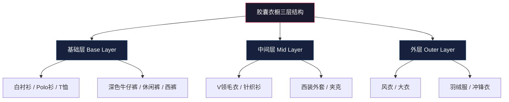
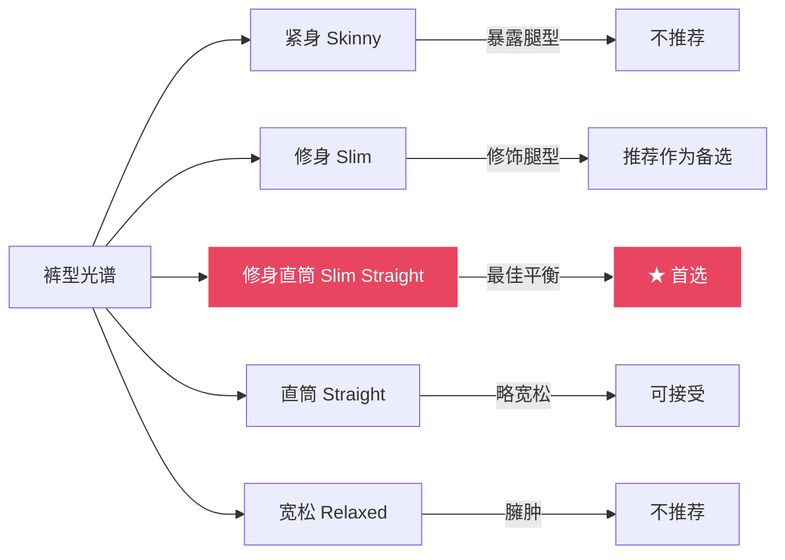
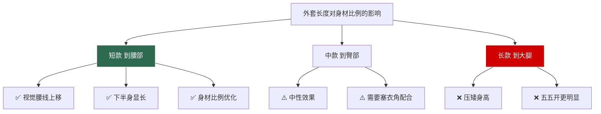
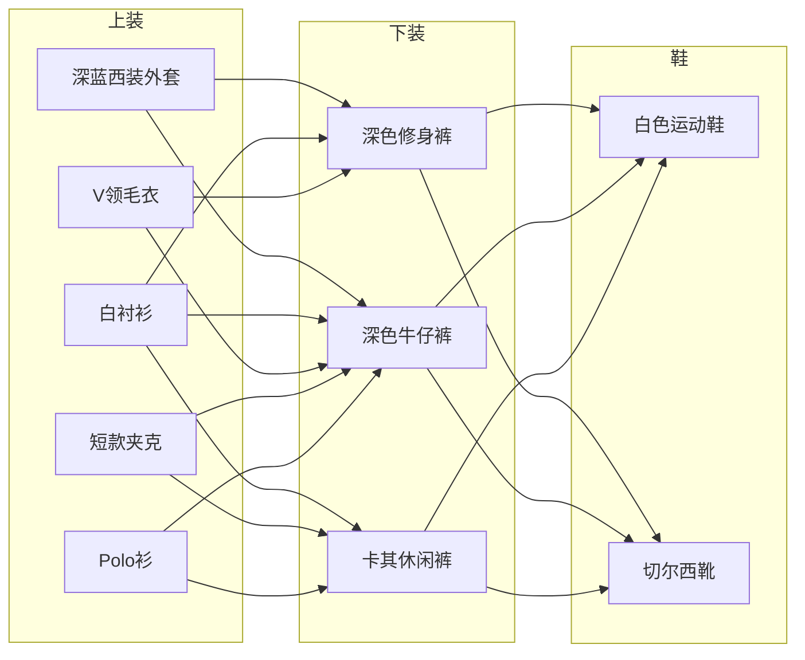

## 一、10件必备单品：胶囊衣橱的核心构建

### 1.1 什么是胶囊衣橱

胶囊衣橱（Capsule Wardrobe）的概念最早由伦敦设计师 Susie Faux 在1970年代提出，核心理念是用少量高品质、高兼容性的单品，通过排列组合覆盖所有日常场景。对一个普通身高、正常体重、五五开身材比例的男性来说，胶囊衣橱不是"省钱策略"，而是**视觉优化的最优解**——每一件单品都经过精心挑选，确保穿上身后在视觉上拉长比例、修饰脸型、提升质感。

一个成熟的男性胶囊衣橱通常由三个层次构成：

### 1.2 为什么是这10件

这10件单品的选择基于三个筛选标准：

1. **场景覆盖率**：单品能出现在多少种场合中（商务、休闲、社交、约会）
2. **组合兼容性**：与衣橱中其他单品的搭配自由度
3. **身材适配度**：对普通身高身高、五五开比例、方形脸型的视觉优化效果

| 筛选维度 | 权重 | 说明 |
|---------|------|------|
| 场景覆盖率 | 40% | 一件单品能应对的场合越多，优先级越高 |
| 组合兼容性 | 35% | 能与至少5件其他单品搭配才算合格 |
| 身材适配度 | 25% | 对显高、修饰比例有直接帮助的单品加分 |

---

### 单品1：深蓝色修身西装外套（Navy Blazer）

#### 为什么它是第一名

深蓝色西装外套在男装中的地位，相当于建筑中的承重墙——它不是最亮眼的，但没有它整个结构就塌了。深蓝色（Navy）比黑色更有层次感，在光线下会呈现出微妙的蓝色调变化，比灰色更有正式感，比浅色更显瘦。对亚洲男性肤色来说，深蓝色是最安全、最提气色的外套颜色。

从场景覆盖来看，一件深蓝西装外套可以出现在：商务会议、商务午餐、约会晚餐、朋友聚会、婚礼宾客、面试、演讲——几乎所有需要"看起来得体"的场合。

#### 选购技术要点

**面料选择**：

| 面料类型 | 优点 | 缺点 | 适用场景 | 价格区间 |
|---------|------|------|---------|---------|
| 100%纯羊毛 | 垂感好、透气、抗皱 | 需要干洗、价格高 | 全年通用 | 2000-8000元 |
| 羊毛混纺(70/30) | 性价比高、易打理 | 质感略逊于纯羊毛 | 全年通用 | 800-3000元 |
| 棉质 | 透气、可水洗 | 易皱、不够正式 | 春夏 | 500-2000元 |
| 亚麻 | 极度透气 | 极易皱、只适合度假 | 盛夏 | 600-2500元 |
| 聚酯混纺 | 便宜、抗皱 | 透气差、廉价感 | 预算极有限 | 300-800元 |

**剪裁要点**（针对普通身高身材）：

- **肩线**：肩垫厚度不超过1.5cm，肩线刚好落在肩骨上，不超出。过宽的肩线会让头显得更小，身材比例更失调
- **扣位**：两粒扣，第一颗扣子位置在腰线以上2-3cm，这样系扣后能在视觉上提升腰线
- **衣长**：双手自然下垂，衣摆到虎口位置。对普通身高身高来说，衣长绝对不能超过臀部中线，否则会压矮
- **收腰**：后背要有轻微收腰（suppression），从侧面看形成一个柔和的S曲线，而不是H型直筒
- **驳领宽度**：7-8cm为宜，过宽的驳领会让上半身显得更宽

**颜色细节**：真正的海军蓝（Navy Blue）在色谱上接近#001f3f，比纯黑更有温度，比藏青更沉稳。购买时在自然光下观察——如果看起来像黑色，说明颜色太深；如果能看出明显的蓝色调，说明颜色正确。

#### 预算与品牌推荐

| 价位 | 价格区间 | 代表品牌 | 品质预期 |
|------|---------|---------|---------|
| 入门 | 500-1000元 | Zara、H&M、G2000 | 穿1-2季，版型尚可，面料一般 |
| 中端 | 1000-3000元 | Massimo Dutti、COS、Selected、Suitsupply | 穿2-3年，版型好，面料达标 |
| 高端 | 3000-8000元 | Hugo Boss、Theory、Canali、Zegna | 穿5年以上，剪裁精良，面料顶级 |

**购买建议**：如果预算有限，中端价位（1500-2500元）是性价比最高的区间。西装外套是衣橱中"单次穿着成本"最低的单品——一件2000元的西装外套穿3年、每周穿2次，单次成本不到7元。

#### 常见误区

- **误区1**：买黑色西装外套当万能外套。黑色西装在非正式场合会显得过于严肃，甚至像去参加葬礼。深蓝色才是真正的万能色
- **误区2**：追求"韩版修身"到极致。过于紧身的西装外套会暴露身材短板（五五开比例），而且活动受限。修身≠紧身，扣上扣子后胸前应能插入一个拳头
- **误区3**：忽略肩线直接买大一码。肩线是西装外套的灵魂，宁可买肩线合适的大码去改腰身，也不要买肩线偏宽的"合适"码数

#### 保养指南

1. **日常**：穿完后用马毛刷轻刷表面灰尘，挂在木质宽肩衣架上（不要用细铁丝衣架，会变形）
2. **去皱**：挂在浴室利用洗澡时的蒸汽自然去皱，或用挂烫机低温处理
3. **干洗**：一个季度干洗1-2次即可，过于频繁会损伤面料
4. **存放**：换季时套上透气防尘袋，放入樟木条防虫，不要用塑料袋密封

---

### 单品2：白色牛津纺衬衫（White Oxford Shirt）

#### 为什么它排第二

如果说深蓝西装外套是衣橱的"骨架"，白色衬衫就是"皮肤"——它是几乎所有搭配的底层。白色牛津纺衬衫（Oxford Cloth Button Down，简称OCBD）的面料表面有独特的颗粒纹理，比普通府绸（Poplin）更厚实、更有质感，既不会像正装衬衫那样一丝不苟，也不会像T恤那样过于随意。

对方形脸型来说，衬衫的领型选择至关重要——合适的领型能在视觉上柔化颧骨线条，平衡脸部比例。

#### 面料深度解析

| 面料 | 纹理 | 厚度 | 正式度 | 打理难度 | 最佳用途 |
|------|------|------|--------|---------|---------|
| 牛津纺 Oxford | 粗颗粒编织 | 厚 | ★★★☆☆ | 低（可不熨烫） | 商务休闲、日常 |
| 府绸 Poplin | 平整光滑 | 薄 | ★★★★★ | 高（必须熨烫） | 正式商务、面试 |
| 精梳棉 Combed | 细腻柔软 | 中 | ★★★★☆ | 中 | 全年通用 |
| 亚麻 Linen | 粗糙自然 | 中 | ★★☆☆☆ | 低（接受褶皱） | 夏季度假 |
| 牛津纺混纺 | 颗粒+弹力 | 厚 | ★★★☆☆ | 极低 | 日常高频穿着 |

#### 领型与脸型的匹配

对方形脸（颧骨突出、下颌线条明显）来说，领型选择的原则是：**用领尖的延伸方向引导视线，弱化颧骨的横向视觉宽度**。

- **标准领（Point Collar）**：领尖长度7-8cm，角度适中。适合方形脸，领尖的纵向线条能拉长脸部视觉
- **展角领（Spread Collar）**：领尖角度大于120°。适合长脸型，但会让宽脸型显得更宽，**不推荐用于方形脸**
- **纽扣领（Button-Down）**：领尖有扣子固定。风格更休闲，适合日常，但正式感不足
- **圆角领（Round Collar）**：领尖圆润。会让脸部显得更圆润，**不适合方形脸**

**最佳选择**：标准领或中等展角领（领尖角度90-110°），领尖长度7-8cm。

#### 选购与尺码

- **领围**：系好最上面扣子后，能插入一根手指的松紧度。过紧会勒，过松会在领口形成褶皱
- **肩线**：落在肩骨上，不超出
- **胸围**：修身但不紧绷，抬手时不会从裤腰中拽出来
- **袖长**：手臂自然下垂时，袖口到手腕骨位置。穿西装外套时，衬衫袖口应露出西装袖口1-2cm
- **衣长**：到腰带位置偏下2-3cm，确保塞进裤子后不会在活动中跑出来

#### 品牌与预算

| 价位 | 价格区间 | 代表品牌 | 特点 |
|------|---------|---------|------|
| 入门 | 100-300元 | 优衣库、海澜之家、JACK & JONES | 基础款够用，面料一般 |
| 中端 | 300-800元 | COS、Massimo Dutti、Brooks Brothers Outlet | 面料和版型明显提升 |
| 高端 | 800-2000元 | Brooks Brothers、Ralph Lauren、Charvet | 面料顶级，做工精细 |

**购买建议**：白色衬衫消耗频率高（容易发黄、领口磨损），建议中端价位买2-3件轮换，总花费与买一件高端衬衫相当，但实用性强得多。

#### 常见误区

- **误区1**：买太白的衬衫。纯白（Stark White）会让肤色偏黄的亚洲男性显得气色不好。选择"自然白"（Off-White）或"奶白"（Cream White）更安全
- **误区2**：忽视领型直接买。不同领型对脸型的修饰效果差异巨大，必须试穿
- **误区3**：穿短袖衬衫配西装。短袖衬衫在正式场合是不被接受的，而且短袖会暴露手臂比例。选择长袖衬衫，热的时候卷袖子

#### 保养指南

1. **洗涤**：40°C以下水温，深浅色分开。白色衬衫单独洗，避免被其他衣物染色
2. **去黄**：领口和袖口发黄时，用小苏打+双氧水（3%浓度）调成糊状涂抹，静置30分钟后正常洗涤
3. **熨烫**：牛津纺可以不熨烫（这是它的优势之一），但如果要正式穿着，中温蒸汽熨烫
4. **存放**：挂起来而不是叠起来，避免产生永久折痕

---

### 单品3：深色修身直筒裤（Dark Slim-Straight Pants）

#### 为什么它对你的身材至关重要

对普通身高、五五开身材比例的男性来说，裤子的选择直接决定了视觉身高和比例。深色修身直筒裤是显高穿搭中"下半身"的核心武器。深色在视觉上有收缩效果，修身直筒版型能勾勒出干净的腿部线条而不暴露腿型缺陷，中腰设计能提升腰线位置。

#### 版型详解

**修身直筒（Slim Straight）的关键特征**：
- 大腿处贴合但不紧绷，坐下时不会有明显勒感
- 从膝盖到裤脚宽度一致（直筒），不收窄
- 裤脚宽度在17-19cm之间（对普通身高身高来说）
- 中腰设计，腰线在肚脐附近或略低1-2cm

#### 颜色选择

| 颜色 | 百搭指数 | 正式度 | 显瘦效果 | 推荐场景 |
|------|---------|--------|---------|---------|
| 炭灰色 Charcoal | ★★★★★ | ★★★★★ | ★★★★★ | 商务、正式场合 |
| 深蓝 Navy | ★★★★★ | ★★★★☆ | ★★★★☆ | 全年通用 |
| 深灰 Dark Grey | ★★★★☆ | ★★★★☆ | ★★★★☆ | 全年通用 |
| 黑色 Black | ★★★★☆ | ★★★★☆ | ★★★★★ | 秋冬、夜场 |
| 卡其色 Khaki | ★★★☆☆ | ★★★☆☆ | ★★☆☆☆ | 春夏休闲 |

**购买顺序建议**：先买一条炭灰色（最百搭、最正式），再买一条深蓝色（最休闲、最日常）。

#### 面料与季节

- **春秋**：棉质斜纹（Cotton Twill）或棉弹混纺（98%棉+2%弹力纤维），厚度适中
- **夏季**：轻薄棉质或亚麻混纺，透气性优先
- **冬季**：精纺毛料（Wool Flannel）或羊毛混纺，保暖且有垂感

#### 品牌与预算

| 价位 | 价格区间 | 代表品牌 | 特点 |
|------|---------|---------|------|
| 入门 | 150-400元 | 优衣库、Zara | 版型尚可，面料一般 |
| 中端 | 400-1000元 | COS、Levi's、Lee、Dockers | 版型好，面料达标 |
| 高端 | 1000-3000元 | Acne Studios、APC、Theory、Incotex | 剪裁精良，面料顶级 |

#### 常见误区

- **误区1**：买太长的裤子。裤脚堆积（break过多）会让腿显得更短。到鞋面刚好、或微露脚踝（no break）是普通身高身高的最佳裤长
- **误区2**：穿低腰裤。低腰裤会把腰线拉低，让五五开比例更明显。必须选中腰
- **误区3**：裤脚太宽。直筒≠宽松，裤脚宽度超过20cm会显得邋遢

---

### 单品4：V领深色毛衣（Dark V-Neck Sweater）

#### V领的视觉魔法

V领毛衣是秋冬季节对方形脸型最友好的上装。V形领口在视觉上创造了一条纵向的深色线条，这条线条有两个作用：

1. **延长颈部线条**：让头身比更好（普通身高身高尤其需要）
2. **柔化脸部轮廓**：V形的锐角与方形脸的棱角形成对比，反而让脸型看起来更柔和

对比不同领型的效果：

| 领型 | 对脸型的影响 | 对身高的影响 | 搭配难度 | 推荐指数 |
|------|------------|------------|---------|---------|
| V领 | 拉长脸型、弱化颧骨 | 显高 | 低 | ★★★★★ |
| 圆领 | 让脸显得更圆 | 无明显效果 | 低 | ★★★☆☆ |
| U领 | 过于暴露、不够正式 | 显高 | 中 | ★★☆☆☆ |
| 高领 | 压缩颈部、显脸大 | 显矮 | 高 | ★★☆☆☆ |
| 半高领 | 适度保暖 | 中性 | 中 | ★★★☆☆ |

#### 面料等级

| 面料 | 保暖性 | 触感 | 耐久性 | 价格 | 保养难度 |
|------|--------|------|--------|------|---------|
| 美利奴羊毛 Merino | ★★★★☆ | 柔软、不扎 | ★★★★☆ | 中 | 中 |
| 羊绒 Cashmere | ★★★★★ | 极致柔软 | ★★★☆☆ | 高 | 高 |
| 开司米混纺 | ★★★★☆ | 柔软 | ★★★★☆ | 中高 | 中 |
| 普通羊毛 | ★★★★☆ | 可能扎人 | ★★★★★ | 低 | 低 |
| 棉质针织 | ★★☆☆☆ | 柔软 | ★★★★☆ | 低 | 低 |
| 羊毛+羊绒混纺 | ★★★★★ | 很柔软 | ★★★★☆ | 中高 | 中 |

**最佳选择**：美利奴羊毛（Merino Wool）。它兼顾了保暖性、触感和价格，且比纯羊绒更耐穿。

#### 内搭方案

V领毛衣的最大优势是内搭自由度高：

- **商务正式**：V领毛衣 + 白色衬衫 + 领带 → 三件套层次感
- **商务休闲**：V领毛衣 + 白色衬衫（不系领带，领口解开一粒扣）
- **日常休闲**：V领毛衣 + 同色系T恤
- **叠穿进阶**：V领毛衣 + 衬衫 + 西装外套 → 秋冬最强组合

#### 品牌与预算

| 价位 | 价格区间 | 代表品牌 | 特点 |
|------|---------|---------|------|
| 入门 | 200-500元 | 优衣库、Zara | 美利奴羊毛款性价比高 |
| 中端 | 500-1500元 | COS、Massimo Dutti、Johnstons of Elgin | 羊毛/羊绒品质好 |
| 高端 | 1500-5000元 | Brunello Cucinelli、Loro Piana、Pringle of Scotland | 顶级羊绒，工艺精湛 |

#### 保养指南

1. **洗涤**：冷水手洗或羊毛模式机洗，使用专用羊毛洗涤液（如The Laundress Wool & Cashmere Shampoo）
2. **去球**：用毛球修剪器处理，不要用手拽（会拉变形）
3. **晾晒**：平铺晾干，不要挂起来（会被拉长变形）
4. **存放**：折叠存放，放入雪松木球防虫，不要用樟脑丸（味道难去除）

---

### 单品5：修身深色牛仔裤（Dark Slim Jeans）

#### 原色牛仔裤的学问

深色牛仔裤是休闲穿搭的万能底座。这里要特别推荐**原色牛仔裤（Raw Denim）**——未经水洗处理的牛仔布，出厂时为深靛蓝色，随着穿着会自然褪色，形成独特的纹理和褶皱，这个过程被称为"养牛"。

原色牛仔裤的优势：
- 颜色更深、更均匀，视觉上更显瘦
- 随着穿着会形成个人独有的褪色纹理
- 面料更厚实、更耐穿
- 不含化学水洗剂，对皮肤更友好

#### 牛仔布重量与季节

| 重量(盎司/平方码) | 厚度 | 适用季节 | 穿着感受 |
|------------------|------|---------|---------|
| 8-10oz | 轻薄 | 夏季 | 轻便透气 |
| 11-13oz | 中等 | 春秋 | 最通用的厚度 |
| 14-16oz | 厚实 | 秋冬 | 硬挺，需要磨合期 |
| 17oz+ | 超厚 | 深冬 | 极硬，养牛玩家专用 |

**推荐**：12-13oz的原色牛仔布，兼顾四季通用性和养牛效果。

#### 版型与尺码

- **版型**：修身直筒（Slim Straight），与单品3的裤子版型逻辑一致
- **腰围**：原色牛仔裤通常会缩水1-2cm，购买时选大半码或接受初始偏紧（穿几次后会松）
- **裤长**：原色牛仔裤建议买长2-3cm，因为多次穿着后裤脚会自然收缩
- **弹力**：含2%弹性纤维（Elastane/Spandex）的牛仔布更舒适，但养牛效果不如100%棉

#### 选购要点

- **颜色**：深靛蓝（Dark Indigo，色号接近#1a237e）最百搭；黑色次之
- **水洗**：原色（Raw/Unwashed）最佳；轻度水洗（Light Wash）次之；重度做旧（Heavy Distress）不推荐——做旧效果不自然，且会显得廉价
- **口袋**：后袋设计简洁，避免大面积刺绣或金属装饰
- **缝线**：与牛仔布同色系的缝线更低调，橙色缝线是经典但稍显张扬

#### 品牌与预算

| 价位 | 价格区间 | 代表品牌 | 特点 |
|------|---------|---------|------|
| 入门 | 200-500元 | 优衣库（E系列）、Zara、Levi's 511 | 基础款够用 |
| 中端 | 500-1200元 | Levi's Premium、Lee Premium、G-Star | 面料和版型明显提升 |
| 高端 | 1200-3000元 | APC Petit Standard、Nudie Jeans、Acne Studios | 养牛入门首选 |

#### 保养指南

1. **洗涤频率**：原色牛仔裤建议穿3-6个月再第一次洗，之后每穿10-15次洗一次
2. **洗涤方式**：冷水浸泡+翻面手洗，不要机洗（会不均匀褪色）
3. **晾晒**：翻面阴干，不要暴晒（会加速褪色）
4. **去味**：不洗的时候可以放进冰箱冷冻过夜，能去除异味

---

### 单品6：白色简洁运动鞋（White Minimal Sneakers）

#### 为什么白色运动鞋取代了皮鞋

在当代男装语境中，白色简洁运动鞋已经取代了黑色皮鞋，成为最百搭的鞋款。它的优势在于：

1. **场景跨度大**：从牛仔裤到西裤都能搭配
2. **年龄跨度大**：20岁到40岁穿都不会违和
3. **风格跨度大**：休闲、商务休闲、甚至轻正装都能驾驭
4. **对身高友好**：白色鞋款在视觉上不会"切断"腿部线条（深色鞋会在脚部形成一个明显的视觉断点）

#### 选购核心指标

**款式**：
- 低帮（Low-top）：最百搭，适合所有身材
- 中帮（Mid-top）：适合腿较长的人，普通身高身高慎选
- 高帮（High-top）：会"吃掉"脚踝线条，显矮，**不推荐**

**材质**：

| 材质 | 质感 | 打理难度 | 耐久性 | 价格 |
|------|------|---------|--------|------|
| 小牛皮 | ★★★★★ | 中（需定期保养） | ★★★★★ | 高 |
| 合成皮 | ★★★☆☆ | 低（擦洗即可） | ★★★☆☆ | 低 |
| 帆布 | ★★★☆☆ | 中（可水洗） | ★★☆☆☆ | 低 |
| 麂皮 | ★★★★☆ | 高（怕水怕污） | ★★★★☆ | 中高 |

**最佳选择**：小牛皮或优质合成皮。皮面运动鞋比帆布更有质感，也更容易打理。

**设计细节**：
- 鞋底厚度：2-3cm的白色橡胶底，能悄悄增高又不显得笨重
- Logo：越小越好，最好是无Logo设计（如Common Projects只有后跟处一个金色编号）
- 鞋头：圆润但不臃肿，线条流畅
- 鞋带：白色扁平鞋带，与鞋面融为一体

#### 品牌与预算

| 价位 | 价格区间 | 代表品牌 | 推荐款式 |
|------|---------|---------|---------|
| 入门 | 200-500元 | 回力、飞跃、Converse Jack Purcell | 基础款，帆布为主 |
| 中端 | 500-1500元 | Adidas Stan Smith、Nike Air Force 1 Low、Vans Old Skool | 皮面款优先 |
| 高端 | 1500-5000元 | Common Projects Achilles Low、Axel Arigato、Koio Capri | 极简设计标杆 |

**购买建议**：中端价位的Adidas Stan Smith或Nike Air Force 1 Low是性价比之王。如果预算允许，Common Projects是极简白色运动鞋的天花板。

#### 保养指南

1. **日常**：穿完后用微湿布擦拭表面，去除灰尘和污渍
2. **深度清洁**：用专用球鞋清洁液（如Jason Markk）+软毛刷，每月一次
3. **防氧化**：白色鞋底会随时间氧化变黄，存放时避免阳光直射，可以在鞋底涂一层薄薄的凡士林减缓氧化
4. **鞋撑**：不穿时塞入鞋撑或报纸，保持鞋型
5. **鞋带**：发黄的鞋带可以直接更换，成本很低

#### 常见误区

- **误区1**：穿脏了才清洁。白色运动鞋需要"预防性维护"，穿完就擦比脏了再洗效果好得多
- **误区2**：买帆布款图便宜。帆布白色运动鞋容易发黄且难清洗，皮面款长期来看更划算
- **误区3**：搭配深色袜子。白色运动鞋配白色或浅色袜子，深色袜子会在裤脚和鞋口之间形成突兀的色块

---

### 单品7：深色切尔西靴（Dark Chelsea Boots）

#### 切尔西靴的显高原理

切尔西靴（Chelsea Boots）起源于英国维多利亚时代，由女王的御用制鞋师J. Sparkes-Hall于1851年发明。它的设计特点是：无鞋带、弹性侧板、低靴筒。对普通身高身高来说，切尔西靴有三个显高优势：

1. **鞋跟高度**：2-3cm的粗跟，自然增高且不显刻意
2. **靴筒贴合**：紧贴脚踝的靴筒不会在视觉上"切断"腿部线条
3. **鞋头延伸**：略尖的鞋头在视觉上延伸了脚部长度，进而拉长腿部比例

#### 选购技术要点

**颜色选择**：

| 颜色 | 百搭指数 | 正式度 | 最佳搭配裤色 |
|------|---------|--------|------------|
| 黑色 | ★★★★★ | ★★★★★ | 黑、深蓝、炭灰 |
| 深棕 | ★★★★☆ | ★★★★☆ | 卡其、深蓝、深灰 |
| 棕褐色 | ★★★☆☆ | ★★★☆☆ | 卡其、浅蓝、白色 |
| 麂皮深蓝 | ★★★☆☆ | ★★☆☆☆ | 牛仔、卡其 |

**最佳选择**：黑色小牛皮。它能搭配衣橱中几乎所有裤子，从正式西裤到休闲牛仔裤。

**鞋头形状**：
- **略尖（Almond Toe）**：最推荐，延伸脚部线条，显高效果最好
- **方头（Square Toe）**：可以接受，但不够精致
- **圆头（Round Toe）**：过于休闲，且不会延伸脚部线条
- **尖头（Pointed Toe）**：过于夸张，不适合日常

**靴筒高度**：到脚踝骨上方2-3cm，不能太高（到小腿中段就变成了骑马靴），也不能太低（失去了靴子的修饰效果）。

**靴筒松紧**：弹性侧板应贴合脚踝，不紧不松。太紧会影响血液循环，太松会在脚踝处形成褶皱，显得邋遢。

#### 品牌与预算

| 价位 | 价格区间 | 代表品牌 | 特点 |
|------|---------|---------|------|
| 入门 | 300-800元 | 国产真皮品牌（意尔康、奥康）、Clarks基础款 | 能穿1-2年 |
| 中端 | 800-2000元 | Clarks、Dr. Martens、Thursday Boot、Loake | 皮质好，耐穿 |
| 高端 | 2000-5000元 | Church's、RM Williams、Bottega Veneta | 手工制作，传家级品质 |

#### 保养指南

1. **日常**：穿完后用鞋拔脱鞋（不要踩后跟），用马毛刷清除灰尘
2. **上油**：每穿5-8次涂一次鞋油（黑色鞋用黑色鞋油），用软布打圈涂抹后抛光
3. **防水**：新鞋第一次穿前喷一层防水喷雾
4. **存放**：塞入鞋撑，放在通风处，避免阳光直射
5. **换底**：鞋底磨损后及时换底（约200-400元），能延长使用寿命2-3年

---

### 单品8：短款深色夹克（Dark Short Jacket）

#### 为什么短款夹克是你的身材救星

对五五开身材比例来说，短款夹克（到腰部）是最关键的外套类型。原理很简单：**外套的下摆位置决定了视觉腰线的位置**。当夹克下摆在腰部时，观众的视线会自然聚焦在身体上半部分的最高点，从而在视觉上提升腰线，让下半身显得更长。

对比不同长度外套的效果：

#### 夹克类型详解

| 夹克类型 | 风格 | 正式度 | 最佳季节 | 适合场景 |
|---------|------|--------|---------|---------|
| 飞行员夹克 Bomber | 休闲运动 | ★★☆☆☆ | 春秋 | 日常、朋友聚会 |
| 机车夹克 Biker | 硬朗摇滚 | ★★☆☆☆ | 春秋 | 休闲、约会 |
| 教练夹克 Coach | 简约休闲 | ★★☆☆☆ | 春秋 | 日常、户外 |
| 哈灵顿夹克 Harrington | 商务休闲 | ★★★☆☆ | 春秋 | 商务休闲、社交 |
| 棒球夹克 Varsity | 青春休闲 | ★★☆☆☆ | 春秋 | 校园、休闲 |
| 短款风衣 Trench | 经典优雅 | ★★★★☆ | 春秋 | 商务、正式场合 |

**最推荐**：哈灵顿夹克（Harrington Jacket）。它比飞行员夹克正式，比西装外套休闲，是商务休闲场景的最佳选择。

#### 选购要点

- **长度**：下摆到腰带位置或略低1-2cm，绝对不能超过臀部上缘
- **肩线**：与西装外套一样，肩线落在肩骨上
- **拉链**：金属拉链比塑料拉链更有质感
- **内衬**：格纹内衬（如Barbour的苏格兰格纹）是加分项，翻出来时有层次感
- **口袋**：简洁的插袋或拉链袋，避免过多口袋设计

#### 品牌与预算

| 价位 | 价格区间 | 代表品牌 | 特点 |
|------|---------|---------|------|
| 入门 | 300-800元 | Zara、H&M、优衣库 | 款式多样，面料一般 |
| 中端 | 800-2000元 | COS、Massimo Dutti、AllSaints、Barbour | 面料好，版型正 |
| 高端 | 2000-8000元 | Acne Studios、Sandro、Belstaff | 皮革/高端面料 |

---

### 单品9：卡其色休闲裤（Khaki/Beige Chinos）

#### 卡其裤的定位

在衣橱的颜色光谱中，深色裤子（深蓝、炭灰、黑色）占据了正式和深色搭配的阵地，而卡其色休闲裤则覆盖了浅色和休闲的场景。它是深色裤子的完美补充——当上半身穿深色时，卡其裤能提亮整体色调；当上半身穿浅色时，卡其裤能保持协调。

卡其裤的正式度介于西裤和牛仔裤之间，是"商务休闲"着装规范（Business Casual）中最标准的下装选择。

#### 颜色细分

| 颜色 | 色调描述 | 最佳搭配 | 适用季节 |
|------|---------|---------|---------|
| 经典卡其 Khaki | 沙色/土黄色 | 白、深蓝、酒红 | 春夏秋 |
| 驼色 Beige | 浅米色/奶油色 | 白、浅蓝、灰色 | 春夏 |
| 浅灰 Light Grey | 柔和的浅灰色 | 白、深蓝、黑色 | 全年 |
| 橄榄绿 Olive | 军绿色调 | 白、卡其、深蓝 | 秋冬 |
| 深卡其 Dark Khaki | 偏棕的深色 | 白、浅蓝、酒红 | 秋冬 |

**最推荐**：经典卡其色。它是最百搭的浅色裤装颜色，几乎不会出错。

#### 选购要点

- **版型**：修身直筒，与深色裤子的版型要求一致
- **面料**：棉质斜纹（Cotton Twill），厚度适中，有一定的挺括度。避免过于软塌的面料
- **腰型**：中腰，与深色裤子一致
- **裤长**：到鞋面，或微露脚踝（夏季可以卷裤脚露出2-3cm脚踝）
- **口袋**：侧口袋为斜插袋（比直插袋更修身），后袋简洁无装饰

#### 品牌与预算

| 价位 | 价格区间 | 代表品牌 | 特点 |
|------|---------|---------|------|
| 入门 | 150-400元 | 优衣库、Zara | 基础款够用 |
| 中端 | 400-1000元 | COS、Massimo Dutti、Dockers Premium | 版型和面料提升明显 |
| 高端 | 1000-2500元 | Incotex、PT01、Ralph Lauren | 意大利面料，剪裁精良 |

#### 常见误区

- **误区1**：卡其色=土气。关键在于版型和搭配。修身直筒+简洁上衣，卡其裤可以非常高级
- **误区2**：卡其裤只能春夏穿。深卡其色或橄榄绿在秋冬搭配深色毛衣和靴子同样出色
- **误区3**：忽略裤长。卡其裤对裤长的要求比牛仔裤更严格——裤脚堆积会显得非常邋遢

---

### 单品10：深色Polo衫（Dark Polo Shirt）

#### Polo衫的得体感

Polo衫在正式度光谱中的位置非常微妙：它比T恤正式（有领子），比衬衫休闲（不用系扣到顶），是夏季"看起来得体但不过度"的最佳选择。对方形脸来说，Polo衫的翻领形成的V形区域与V领毛衣有类似的修饰效果——拉长颈部线条，弱化颧骨的横向视觉。

#### 面料对比

| 面料 | 触感 | 透气性 | 耐久性 | 价格 | 适合场景 |
|------|------|--------|--------|------|---------|
| 珠地棉 Piqué | 有颗粒纹理 | ★★★★★ | ★★★★☆ | 中 | 全年通用 |
| 平纹棉 Jersey | 柔软光滑 | ★★★★☆ | ★★★☆☆ | 低 | 日常休闲 |
| 精梳棉 Combed | 极致细腻 | ★★★★☆ | ★★★★☆ | 中高 | 商务休闲 |
| 丝光棉 Mercerized | 有光泽感 | ★★★☆☆ | ★★★★☆ | 高 | 正式场合 |
| 亚麻混纺 | 粗糙自然 | ★★★★★ | ★★★☆☆ | 中 | 盛夏 |

**最推荐**：珠地棉（Piqué Cotton）。它是Polo衫最经典的面料，表面的蜂巢状纹理有良好的透气性，且不容易贴身（对微胖身材友好）。

#### 选购要点

- **领型**：标准翻领，领尖长度5-6cm。领子要有一定的挺括度，不能软塌
- **门襟**：2-3粒扣，扣子颜色与衣服同色系。不要全解开（太随意），也不要全扣上（太像正装衬衫）
- **袖口**：到上臂中部，袖口有轻微收紧（不是弹性收紧，而是剪裁收紧）
- **衣长**：到腰带位置。Polo衫的衣长比T恤更讲究——太长需要塞进去，太短抬手会露腰
- **下摆**：后摆比前摆长2-3cm，这是Polo衫的传统设计，方便塞进裤子后不会跑出来

#### 颜色推荐

| 颜色 | 搭配建议 | 场景 |
|------|---------|------|
| 深海军蓝 | 搭配卡其裤、白色裤子 | 全年通用 |
| 黑色 | 搭配浅灰色裤子、牛仔裤 | 秋冬、夜场 |
| 深灰 | 搭配深色裤子、卡其裤 | 全年通用 |
| 酒红 Burgundy | 搭配深蓝裤子、卡其裤 | 秋冬 |
| 白色 | 搭配深色裤子 | 夏季（注意防透） |

**购买顺序**：先买深海军蓝（最百搭），再买黑色（最显瘦），第三件选酒红（增加色彩层次）。

#### 品牌与预算

| 价位 | 价格区间 | 代表品牌 | 特点 |
|------|---------|---------|------|
| 入门 | 100-300元 | 优衣库、Zara、JACK & JONES | 基础款够用 |
| 中端 | 300-800元 | Ralph Lauren、Lacoste、Fred Perry、Tommy Hilfiger | 经典款，品质好 |
| 高端 | 800-2000元 | Brunello Cucinelli、Loro Piana、Sunspel | 顶级面料，低调奢华 |

#### 常见误区

- **误区1**：Polo衫立领。把Polo衫领子立起来是2000年代初的潮流，现在这样做会被认为过时
- **误区2**：选太大的尺码。Polo衫应该是修身的，过大的Polo衫会显得像工作服
- **误区3**：Polo衫塞进裤子。除非是正式商务休闲场合，否则Polo衫一般不塞进裤子（除非衣长确实太长）

---

### 1.3 10件单品的搭配组合矩阵

这10件单品的真正价值不在于单件，而在于它们之间的组合能力。以下矩阵展示了核心搭配方案：

### 1.4 五套核心搭配方案

#### 方案一：商务正式

| 部位 | 单品 | 说明 |
|------|------|------|
| 外套 | 深蓝西装外套 | 扣上第一粒扣 |
| 内搭 | 白色衬衫 | 系好领口，袖口露出西装1-2cm |
| 下装 | 炭灰色修身直筒裤 | 裤线清晰 |
| 鞋 | 黑色切尔西靴 | 增高2-3cm |
| 配件 | 深色皮带+简约手表 | 皮带与鞋同色 |

#### 方案二：商务休闲

| 部位 | 单品 | 说明 |
|------|------|------|
| 外套 | 深蓝西装外套 | 不系扣 |
| 内搭 | 白色衬衫 | 领口解开一粒扣 |
| 下装 | 卡其色休闲裤 | 微露脚踝 |
| 鞋 | 白色运动鞋 | 增加休闲感 |
| 配件 | 无 | 简洁为主 |

#### 方案三：秋冬日常

| 部位 | 单品 | 说明 |
|------|------|------|
| 外套 | 短款深色夹克 | 拉链拉到胸口 |
| 内搭 | V领毛衣+白衬衫 | 衬衫领露出毛衣V区 |
| 下装 | 深色牛仔裤 | 原色最佳 |
| 鞋 | 切尔西靴 | 搭配深色袜子 |
| 配件 | 围巾（可选） | 深灰色羊绒围巾 |

#### 方案四：夏季休闲

| 部位 | 单品 | 说明 |
|------|------|------|
| 上装 | 深色Polo衫 | 不塞进裤子 |
| 下装 | 卡其色休闲裤 | 卷起裤脚2-3cm |
| 鞋 | 白色运动鞋 | 白色袜子 |
| 配件 | 墨镜（可选） | 增加造型感 |

#### 方案五：约会穿搭

| 部位 | 单品 | 说明 |
|------|------|------|
| 外套 | 深蓝西装外套 | 不系扣，袖子微卷 |
| 内搭 | 深色Polo衫或V领毛衣 | 展示颈部线条 |
| 下装 | 深色修身牛仔裤 | 干净利落 |
| 鞋 | 白色运动鞋或切尔西靴 | 根据场合正式度选择 |
| 配件 | 简约手表+香水 | 提升质感 |

---

### 1.5 购买优先级与预算规划

如果预算有限，建议按以下顺序逐步购入：

| 优先级 | 单品 | 建议预算 | 购买理由 |
|--------|------|---------|---------|
| 1 | 白色牛津纺衬衫 | 300-500元 | 最基础、使用频率最高 |
| 2 | 深色修身直筒裤 | 400-800元 | 下装基础，显高核心 |
| 3 | 深色修身牛仔裤 | 400-800元 | 休闲场景必备 |
| 4 | 白色运动鞋 | 500-1000元 | 最百搭的鞋款 |
| 5 | 深蓝西装外套 | 1500-2500元 | 场景跨度最大 |
| 6 | V领毛衣 | 500-1000元 | 秋冬必备 |
| 7 | 切尔西靴 | 800-1500元 | 秋冬鞋款+增高 |
| 8 | 短款夹克 | 800-1500元 | 春秋外套 |
| 9 | 卡其色休闲裤 | 300-600元 | 浅色下装补充 |
| 10 | 深色Polo衫 | 300-600元 | 夏季上装 |

**总预算估算**：
- 入门方案：约4000-6000元（全部入门级品牌）
- 均衡方案：约8000-12000元（中端为主）
- 品质方案：约15000-25000元（中高端混合）

### 1.6 衣橱维护通用法则

#### 日常护理

1. **轮换穿着**：同一件单品不要连续穿两天，给面料恢复的时间
2. **及时处理**：沾上污渍后立即处理，不要等干了再洗
3. **正确挂放**：外套和衬衫用木质宽肩衣架，裤子用裤夹衣架倒挂
4. **定期整理**：每季度检查一次衣橱，淘汰变形、褪色、不合身的单品

#### 洗涤通用规则

| 面料 | 洗涤方式 | 水温 | 注意事项 |
|------|---------|------|---------|
| 棉质 | 机洗 | 30-40°C | 深浅色分开 |
| 羊毛 | 手洗/羊毛模式 | 冷水 | 使用专用洗涤液 |
| 牛仔 | 尽量少洗 | 冷水 | 翻面洗，不烘干 |
| 皮革 | 不水洗 | — | 用皮革护理油 |
| 合成纤维 | 机洗 | 30°C | 低温烘干或自然晾干 |

#### 季节性存储

- **换季时**：清洗干净后再存放（残留汗渍和污渍会吸引虫蛀）
- **防虫**：使用雪松木块或薰衣草香囊，不要用樟脑丸（化学残留）
- **防潮**：在衣柜中放置除湿盒，尤其是南方梅雨季节
- **防尘**：外套和西装套上透气防尘袋，不要用塑料袋（不透气会导致发霉）
