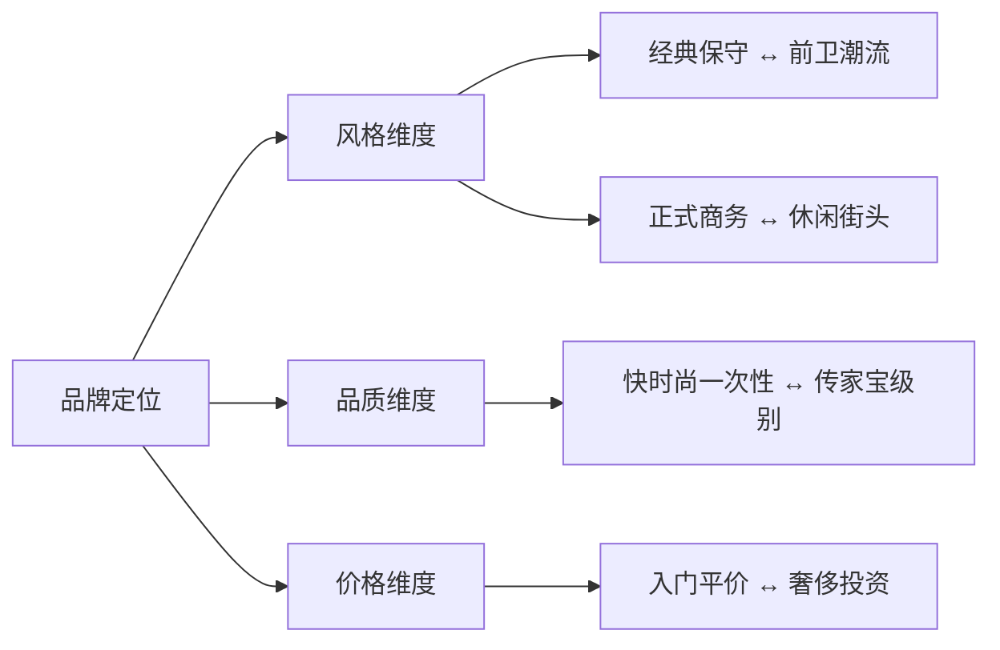
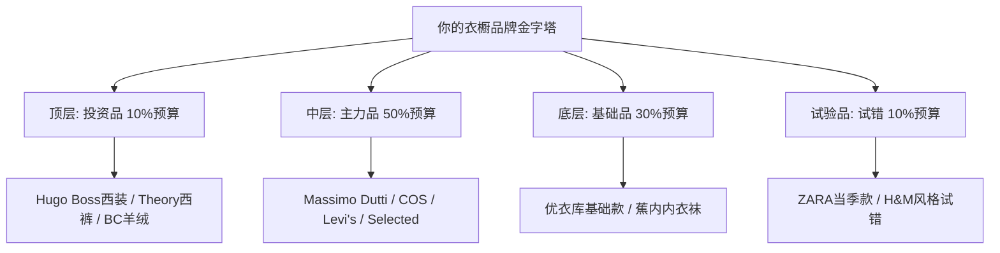

## 二、品牌推荐

选品牌不是"越贵越好"，而是找到**风格匹配、品质可靠、价格合理**的最优解。一个200元的优衣库基础T恤，可能比一个2000元的设计师品牌T恤更适合你的日常场景。品牌选择的核心逻辑是：**用最少的钱，买到最匹配你风格需求的最高品质**。

### 2.1 品牌评估框架：如何判断一个品牌值不值得买

在具体推荐之前，你需要一套评估品牌的底层逻辑。盲目跟风买"网红品牌"或只看价格高低，都会浪费预算。

#### 品质的四个硬指标

| 指标 | 具体检查方法 | 合格标准 |
|------|-------------|---------|
| **面料成分** | 看洗标/吊牌的成分表 | 天然纤维（棉、羊毛、丝、麻）占比≥60%为佳；化纤不等于差，关键看用途 |
| **缝线工艺** | 翻看内侧缝线，拉扯接缝处 | 线迹均匀、无跳线、接缝处无明显皱褶；每英寸≥8针为合格 |
| **版型一致性** | 同一尺码多件对比 | 同款同码差异≤1cm说明品控好；差异大说明代工厂管理松散 |
| **辅料品质** | 检查纽扣、拉链、衬布 | 纽扣无毛边、拉链顺滑（YKK/SBS为品牌拉链）、领衬挺括不起泡 |

#### 品牌定位的三个维度

一个品牌在这三个维度上的位置，决定了它适不适合你。比如ZARA在风格维度上偏前卫潮流，品质维度上偏快时尚，价格维度上中等偏低——这意味着它适合买当季流行款，但不适合投资基础款。

#### "性价比"的真正含义

性价比不是"便宜"，而是**每元钱买到的穿着价值**。穿着价值 = 品质 × 适用场景数 × 穿着次数 ÷ 价格。一件800元的COS羊毛大衣，如果你能穿3年、每周穿2次、适用于5个场景，它的单次穿着成本不到1元。而一件200元的快时尚大衣，穿一季就变形，单次穿着成本可能超过5元。

**判断公式**：单次穿着成本 = 购入价格 ÷ 预期穿着次数。低于2元/次的单品就是高性价比。

### 2.2 入门级品牌（月穿搭预算500-1500元）

入门级品牌的使命是帮你用最低成本建立基础衣橱。这个阶段不要追求设计感，重点是**品质稳定、版型合身、百搭实用**。

#### 优衣库（UNIQLO）

**品牌DNA**：日本快时尚品牌，1984年创立，核心理念是"LifeWear"（服适人生）。优衣库的本质不是快时尚，而是**高品质基础款供应商**——它和ZARA/H&M的商业模式完全不同：优衣库靠面料科技和基础款走量，不追逐潮流。

**为什么它排在第一位**：对于身材条件特殊（普通身高、五五开比例）的人来说，优衣库的亚洲版型是最友好的。它的尺码体系基于亚洲人体型数据开发，肩宽、袖长、衣长的比例比欧版品牌更贴合。

**推荐单品与选购要点**：

| 单品 | 价格区间 | 核心推荐理由 | 选购注意事项 |
|------|---------|-------------|-------------|
| 圆领/V领T恤（U系列） | 79-149元 | 250g/m²重磅棉，不易变形；U系列廓形更高级 | 选V领修饰脸型，深色系（黑/深灰/藏蓝）更百搭 |
| 牛津纺衬衫 | 149-199元 | 免烫处理，面料有一定厚度和质感 | 选Slim Fit版型，普通身高建议选S码 |
| 修身牛仔裤 | 199-299元 | 弹力面料舒适，修身版型显腿直 | 选深色原色款（Rigid），洗后会自然褪色更有味道 |
| 轻薄羽绒服 | 299-599元 | 业界标杆产品，640蓬松度，可收纳成拳头大小 | 选V领款搭配衬衫更利落，避免立领款显脖子短 |
| 高级精纺美利奴毛衣 | 199-299元 | 100%美利奴羊毛，触感细腻亲肤 | 选V领深色款，外穿内搭两相宜 |
| HEATTECH保暖内衣 | 79-149元 | 发热面料技术，极寒天气的救星 | Ultra Warm系列适合零下，普通款适合5-15℃ |

**优衣库的隐藏宝藏系列**：

- **+J系列**（与Jil Sander合作）：极简主义大师的设计，价格仅为Jil Sander主线的1/10，版型和剪裁远超普通优衣库。每年发售两次，需要抢购。
- **U系列**（与Christophe Lemaire合作）：Lemaire是爱马仕前创意总监，U系列的廓形更有建筑感，适合追求"看起来比实际贵"的效果。
- **高级轻型羽绒**：优衣库的王牌产品线，2006年首发至今已售出超过10亿件。它的技术壁垒在于超轻面料和高蓬松度的结合，至今没有平替品牌能做到同等品质。

**购买时机**：优衣库很少大幅打折（通常9折），但每年12月底和6月底有季末清仓，部分款式降至5-7折。另外关注天猫旗舰店的满减活动。

#### ZARA

**品牌DNA**：西班牙Inditex集团旗下，全球最大的快时尚品牌之一。ZARA的核心竞争力是**从设计到上架只需2周**的极速供应链，每周上新两次。这意味着它的款式永远走在潮流最前沿，但也意味着品质是次要考量。

**适合买什么**：ZARA的优势在于**设计驱动型单品**——那些需要紧跟潮流、但不需要穿很多年的品类。具体来说：

- **西装外套**（399-799元）：ZARA的西装外套设计感强，剪裁偏修身，适合尝试不同风格。但面料多为聚酯混纺，久穿易起球，建议作为"试水"购买——先用ZARA确定自己喜欢什么版型，再升级到中端品牌。
- **休闲西裤**（199-499元）：版型多样，从锥形到直筒都有，适合找到最适合自己的裤型。
- **大衣**（599-999元）：设计好看但面料一般，适合买来穿1-2个冬季。

**不适合买什么**：

- 基础款T恤、衬衫——品质不如优衣库，价格却更高
- 牛仔裤——版型不如Levi's，面料不如优衣库
- 皮鞋——ZARA的皮鞋多为合成皮革，不透气且不耐穿

**ZARA的品质鉴别技巧**：ZARA有三条产品线——普通线（最低价）、Studio系列（限量设计款，品质最好）、SRPLS系列（运动风）。购买时认准Studio系列，品质明显优于普通线。另外，ZARA TRF是女装线，男装不涉及。

#### H&M

**品牌DNA**：瑞典品牌，全球第二大时尚零售商。H&M的定位比ZARA更低——它是**用最低价格满足"穿新衣"需求**的品牌。品质在快时尚中垫底，但价格也最低。

**值得买的品类**：

- **Conscious系列**（有机棉/再生材料）：H&M的环保系列，面料品质比普通线好一个档次，价格只贵20-30%。基础T恤、卫衣值得入手。
- **运动休闲装**：DryMove系列的运动T恤和运动裤，性价比不错，适合健身和居家。
- **配饰**：帽子、围巾、袜子等小件配饰，设计不错价格低，是试错成本最低的选择。

**需要避开的品类**：

- 正装衬衫和西裤——面料太薄、版型太差，穿出去会显得廉价
- 皮带和皮具——合成皮革，用几个月就会开裂
- 任何需要"穿三年"的单品——H&M的设计寿命就是一个季度

**购买策略**：H&M的最大价值是**风格试验田**。如果你想尝试一个新风格（比如工装风、日系风），先在H&M花100-200元买一件试试效果，确认适合自己后再去中端品牌买高品质版本。另外，H&M的会员APP经常发85折券和生日折扣。

#### 海澜之家（HLA）

**品牌DNA**：中国最大男装品牌，门店超过8000家，覆盖全国几乎所有城市。海澜之家的核心优势是**对中国男性体型的深入理解**——它的版型数据来自数千万中国消费者的试穿反馈。

**值得买的品类**：

- **衬衫**（150-400元）：版型对中国男性友好，尤其是领围和肩宽的比例。商务衬衫选DP3.5级以上免烫处理的款式。
- **西裤**（200-500元）：弹力面料舒适，腰围尺码齐全（从28到40），适合各种体型。
- **夹克/棉服**（300-800元）：秋冬季节性单品，设计简洁，性价比不错。

**需要避开的品类**：

- 过于花哨的设计款——海澜之家的一些款式印花过于繁复，容易显得老气
- 牛仔裤——版型和面料都不如专业牛仔品牌
- 配饰——设计感不足

**购买技巧**：海澜之家经常做"买二送一"或"满减"活动，折后价格比标价低30-50%。另外，它的奥特莱斯店价格更低，基础款衬衫折后可能只要80-120元。

#### 入门级品牌对比总结

| 品牌 | 最适合买 | 最不适合买 | 品质评分 | 设计评分 | 性价比评分 |
|------|---------|-----------|---------|---------|-----------|
| 优衣库 | 基础款、面料科技产品 | 潮流设计款 | ★★★★☆ | ★★★☆☆ | ★★★★★ |
| ZARA | 设计款外套、当季流行 | 基础款、需要耐穿的 | ★★★☆☆ | ★★★★★ | ★★★☆☆ |
| H&M | 风格试错、运动休闲、配饰 | 正装、任何长期单品 | ★★☆☆☆ | ★★★☆☆ | ★★★★☆ |
| 海澜之家 | 衬衫、西裤、季节性外套 | 设计款、牛仔裤 | ★★★☆☆ | ★★☆☆☆ | ★★★★☆ |

### 2.3 中端品牌（月穿搭预算1500-5000元）

中端品牌是**性价比最高的价格带**。这个价位的品牌已经具备了优秀的面料、剪裁和设计能力，但还没有进入"品牌溢价"的区间。对于28岁的你来说，中端品牌应该是衣橱的主力。

#### COS

**品牌DNA**：H&M集团旗下的高端品牌，2007年创立于伦敦。COS的设计语言是**北欧极简主义**——干净的线条、建筑感的廓形、克制的色彩。它不是"便宜版的Celine"，而是有自己独立美学体系的品牌。

**为什么特别适合你**：

COS的版型特点恰好对你有利：它的肩线通常略微下落1-2cm（不是oversize，而是设计语言），这会让肩部看起来更宽，视觉上改善五五开比例。同时COS的上衣长度通常偏短，刚好到腰线位置，对普通身高身高非常友好。

**推荐单品深度分析**：

- **针织系列**（300-900元）：COS的针织品是它最值得买的品类。面料多为美利奴羊毛或羊毛混纺，织法紧密不易起球。推荐V领和半高领毛衣，颜色选黑、深灰、驼色。一件COS的美利奴毛衣可以穿3年以上，手感依然细腻。
- **大衣系列**（1000-2000元）：COS的大衣设计极简但不单调，廓形硬朗。推荐中长款羊毛大衣，颜色选驼色或深灰——这两个颜色几乎可以搭配你衣橱里所有的衣服。
- **基础T恤**（150-250元）：COS的T恤比优衣库贵一倍，但面料更厚实、版型更有建筑感。如果你追求"看起来不便宜"的效果，COS的T恤是升级首选。
- **西裤**（400-800元）：锥形剪裁，面料垂坠感好，适合商务休闲场合。

**购买时机**：COS每年6月底和12月底有两次大促，折扣力度5-7折。另外COS有自己的会员体系，注册后可享受提前进入打折季的特权。

#### Massimo Dutti

**品牌DNA**：Inditex集团（ZARA母公司）的高端线，1985年创立于西班牙。如果说ZARA是"快时尚"，Massimo Dutti就是**"慢时尚"**——它的设计更新速度慢得多，但每一件的品质和设计都经得起时间考验。风格定位是**都市商务休闲（Smart Casual）**。

**为什么它是28岁男性的最佳选择之一**：

Massimo Dutti的设计刚好介于"太正式"和"太休闲"之间——它既有职场需要的专业感，又不会像Hugo Boss那样过于严肃。28岁正是从"年轻人"过渡到"职场人"的阶段，Massimo Dutti的风格恰好帮你完成这个过渡。

**推荐单品深度分析**：

- **西装外套**（1000-2500元）：这是Massimo Dutti的王牌产品。面料多为意大利进口羊毛混纺，剪裁修身但不紧绷。推荐深蓝和炭灰两个颜色，这两个颜色能覆盖90%的商务和社交场合。购买建议：每年1月和7月打折季入手，折扣后约700-1500元。
- **衬衫**（400-800元）：面料多为高支棉（80s-100s），手感细腻。推荐浅蓝色和白色商务衬衫，以及牛津纺休闲衬衫。Massimo Dutti的衬衫领型设计很好看——尖领和温莎领的比例都很协调。
- **休闲西裤**（500-1000元）：弹力混纺面料，穿着舒适度很高。推荐锥形版型，裤脚微收，搭配乐福鞋或小白鞋都好看。
- **皮鞋**（800-2000元）：真皮材质，做工在同价位中算优秀。推荐德比鞋（Derby）和乐福鞋（Loafer），颜色选深棕和黑色。
- **大衣**（1500-3000元）：羊毛或羊毛羊绒混纺，廓形经典。打折季入手性价比极高。

**购买渠道**：Massimo Dutti在中国有线下门店（主要在一二线城市），也可以在天猫旗舰店购买。线下试穿后线上购买是最佳策略——线上经常有满减活动。

#### Selected

**品牌DNA**：丹麦Bestseller集团旗下品牌，与VERO MODA、JACK & JONES同属一个集团，但Selected的定位最高。风格是**都市时尚（Urban Contemporary）**——比Massimo Dutti更年轻、更时尚，但比ZARA更有品质感。

**推荐理由**：Selected的设计有一种"北欧式的酷"——不张扬但有态度。它的西装外套和夹克设计感强，适合周末社交和约会场合。

**推荐单品**：

- **修身西装**（800-2000元）：版型比Massimo Dutti更修身，适合身材偏瘦的人。面料多为棉混纺，适合春秋穿着。
- **夹克**（600-1500元）：飞行员夹克、教练夹克等休闲款式设计出色，适合搭配牛仔裤和运动鞋。
- **针织衫**（400-800元）：设计简洁，面料不错，适合日常穿着。

**注意**：Selected的牛仔裤版型偏欧版，裤长偏长，普通身高身高可能需要改裤脚。

#### Levi's

**品牌DNA**：1853年创立于美国旧金山，牛仔裤的发明者。Levi's在牛仔裤领域的地位，相当于可口可乐在饮料领域的地位——它就是标准本身。

**为什么牛仔裤要单独选品牌**：牛仔裤是男性衣橱中穿着频率最高的单品之一（仅次于T恤），一条好牛仔裤可以穿5年以上。而牛仔裤的版型差异极大——同一个尺码，不同品牌的腰围、大腿围、裤脚宽度可能差2-3cm。选对品牌和版型，比选对尺码更重要。

**适合你的版型推荐**：

- **511 Slim Fit**（400-800元）：修身窄脚版型，大腿处贴合但不紧绷，裤脚收窄。这是最适合普通身高身高的版型——修身的裤型会在视觉上拉长腿部线条。推荐深蓝色（Dark Indigo）和黑色。
- **502 Regular Taper**（400-800元）：锥形版型，大腿处宽松、裤脚收窄。如果你大腿偏粗或喜欢更舒适的穿着感，502比511更适合。
- **501 Original**（500-1000元）：经典直筒版型，纽扣门襟。这是Levi's最经典的版型，但对普通身高身高来说可能偏宽松，建议试穿后决定。

**Levi's的面料学问**：Levi's的牛仔布克重（Weight）通常在11-14oz之间。克重越高越厚实耐穿但越不舒适。日常穿着推荐12oz左右的中等克重。另外，原色（Rigid/Stf）牛仔裤未经水洗处理，颜色最深、最显质感，但需要"养牛"——穿一段时间后会自然形成独特的褪色纹路。

**购买渠道**：Levi's在中国的价格偏高（比美国贵50-100%），建议在天猫旗舰店的打折季购买，或者通过海淘渠道（Amazon、官网直邮）。

#### Ralph Lauren（Polo Ralph Lauren）

**品牌DNA**：1967年创立于纽约，美式休闲风格的代表。Ralph Lauren卖的不是衣服，而是**一种生活方式**——东海岸精英的休闲审美。Polo衫上的小马Logo已经成为全球辨识度最高的服装标志之一。

**推荐理由**：Ralph Lauren的Polo衫和牛津纺衬衫是业界标杆。它的Polo衫面料厚实（通常为珠地棉），领子挺括不易变形，洗100次依然有型。

**推荐单品**：

- **Polo衫**（500-900元）：经典款Polo衫，推荐Slim Fit版型（比Classic Fit更修身）。颜色推荐白色、海军蓝、灰色——避免过于鲜艳的颜色和大面积Logo。
- **牛津纺衬衫**（600-1000元）：面料厚实、领型经典。推荐Classic Oxford Button-Down，这是Ralph Lauren最经典的单品之一。
- **针织毛衣**（800-2000元）：美利奴羊毛或羊绒混纺，品质优秀。

**购买建议**：Ralph Lauren在中国的定价偏高，建议在美国官网海淘（经常有额外7折活动）或在奥特莱斯购买。奥特莱斯的Polo Ralph Lauren品质与正价店相同，只是款式是过季款。

#### 中端品牌对比总结

| 品牌 | 风格定位 | 最值得买 | 单次穿着成本参考 | 适合场景 |
|------|---------|---------|----------------|---------|
| COS | 北欧极简 | 针织、大衣、基础T | 1-3元/次 | 商务休闲、日常 |
| Massimo Dutti | 都市商务休闲 | 西装、衬衫、皮鞋 | 2-5元/次 | 职场、社交 |
| Selected | 都市时尚 | 夹克、西装、针织 | 2-4元/次 | 周末、约会 |
| Levi's | 经典美式休闲 | 511/502牛仔裤 | 1-2元/次 | 日常、休闲 |
| Ralph Lauren | 美式经典 | Polo衫、牛津纺衬衫 | 2-5元/次 | 休闲、社交 |

### 2.4 高端品牌（月穿搭预算5000元以上）

高端品牌的投资逻辑和入门/中端完全不同。买高端不是为了"贵"，而是为了**不可替代的品质和设计**。一件高端单品应该能做到：穿5年以上不显旧、设计经典不过时、面料和做工让你每次穿上都有愉悦感。

#### Hugo Boss

**品牌DNA**：1924年创立于德国，欧洲商务正装的标杆。Hugo Boss有两条主线——Boss系列偏正式商务，Hugo系列偏年轻时尚。对于28岁的你，**Boss系列**更值得投资。

**核心产品深度分析**：

- **西装**（3000-8000元）：Hugo Boss的西装采用意大利和德国面料，剪裁以"欧洲修身"为特点——肩线利落、腰线明显、整体轮廓干净。它的西装分三个等级：Boss（主力线）、Boss Selection（高端线，全手工制作）、Made to Measure（定制）。推荐从Boss主力线入手，性价比最高。购买建议：深蓝和炭灰各一件，覆盖所有正式场合。
- **大衣**（3000-8000元）：羊毛或羊绒混纺，廓形经典。Hugo Boss的大衣设计有一个特点——领型设计特别好，无论是翻领还是立领，都能修饰颈部线条。
- **衬衫**（1000-2000元）：高支棉面料（100s-120s），免烫处理。适合搭配西装穿着。

**购买策略**：Hugo Boss在中国的定价比欧洲高30-50%。如果有机会去欧洲旅游，可以在当地购买（还能退税10-15%）。国内购买建议在奥特莱斯——Hugo Boss的奥特莱斯线（核心系列）品质与正价店相同。

#### Theory

**品牌DNA**：1997年创立于纽约，核心理念是"Better basics"——用最好的面料做最简洁的设计。Theory在面料科技上的投入远超同价位品牌——它有自己开发的面料系列（如Tech系列的四面弹力面料）。

**为什么它被称为"都市精英的制服"**：Theory的设计哲学是"less is more"——没有任何多余的设计元素，全靠面料和剪裁说话。这种风格的好处是**永远不过时**，一件Theory的西装外套，10年前买的和今年买的，看起来几乎一样。

**推荐单品**：

- **西裤**（1500-3000元）：Theory的西裤是它最值得买的单品。Tech系列四面弹力面料，穿着体验堪比运动裤，但外观完全就是正式西裤。对于需要长时间坐着办公的人来说，这是终极选择。
- **针织衫**（1500-3000元）：美利奴羊毛或羊绒，织法紧密，手感如丝。一件Theory的羊绒衫可以穿5年以上，依然柔软不起球。
- **西装外套**（3000-6000元）：面料和剪裁都是一流水平。推荐灰色和深蓝色。

#### Suitsupply

**品牌DNA**：2000年创立于荷兰阿姆斯特丹，只做一件事——**把西装做到极致性价比**。Suitsupply的商业模式是"中端价格、高端品质"——它砍掉了传统西装品牌的中间环节（经销商、品牌溢价），直接用最好的面料和工艺做西装。

**为什么它是西装入门的最佳选择**：在2000-6000元价位，Suitsupply的西装品质是无敌的。它使用的面料来自意大利知名面料商（如VBC、E。Thomas），做工采用半麻衬（Half Canvas）工艺——这个价位其他品牌通常是粘合衬（Fused）。

**适合亚洲人的版型**：

- **Lazio**：修身版型，肩线自然（无垫肩或极薄垫肩），适合身材偏瘦的亚洲人。这是Suitsupply最受欢迎的版型。
- **Havana**：休闲版型，单排扣、贴袋设计，适合非正式场合。肩线自然，腰部略有余量。
- **Napoli**：经典版型，略有垫肩，适合需要更强肩部线条的人。

**购买建议**：Suitsupply在中国有线下门店（北京、上海、深圳等），可以预约量体定制（Made to Measure），价格约4000-8000元，比成衣贵50%但合身度大幅提升。

#### Brunello Cucinelli

**品牌DNA**：1978年创立于意大利Solomeo小镇，被称为"静奢"（Quiet Luxury）的鼻祖。Brunello Cucinelli的衣服**没有任何可见Logo**，全靠面料和做工说话。它的羊绒制品被誉为"世界上最好的羊绒"。

**为什么一件羊绒毛衣值1万元**：BC的羊绒来自蒙古高原的Hircus山羊，每只山羊每年只能产出约200克可用绒毛。BC使用的羊绒纤维直径≤15微米（普通羊绒为16-19微米），纤维越细越柔软、越不易起球。一件BC的羊绒毛衣，面料成本就超过2000元，加上意大利手工编织和品牌价值，定价自然不菲。

**购买建议**：如果预算允许，建议从一件BC的羊绒毛衣开始——它能穿10年以上，每次穿上都有"被温柔包裹"的感觉。颜色推荐灰色、驼色、深蓝——这三个颜色几乎不会过时。购买渠道建议在欧洲（意大利本土价格最低）或Net-a-Porter等奢侈品电商平台的打折季。

### 2.5 日韩品牌：被低估的品质之选

日韩品牌在中国的知名度不如欧美品牌，但在面料品质和版型设计上，它们有独特的优势——**更懂亚洲人的身材和审美**。

#### 日系品牌

**无印良品（MUJI）**

MUJI的服装线是"优衣库的升级版"——同样是基础款，但面料选择更讲究、设计更有禅意。推荐它的有机棉系列和法国亚麻系列。价格区间：100-800元。MUJI的亚麻衬衫是夏天的最佳选择——透气性远超棉质，而且越洗越柔软。

**United Arrows / Beauty & Youth**

日本买手店品牌，集合了多个日本设计师的作品。风格介于日系极简和美式休闲之间。价格区间：500-3000元。在国内可以通过代购或海淘购买。

**Beams**

日本最大的生活方式买手店，自有品牌Beams系列品质不错、价格合理。风格偏日系休闲，适合日常穿着。价格区间：300-2000元。

#### 韩系品牌

**8 Seconds**

三星旗下的快时尚品牌，设计偏韩系简约。价格区间：100-500元。适合购买基础款和配饰。

**Solid Homme**

韩国设计师品牌，风格偏都市极简。价格区间：500-3000元。剪裁修身，适合亚洲人身材。

### 2.6 国内新兴品牌：中国设计的崛起

近年来，国内涌现出一批优秀的男装品牌，它们的共同特点是：**用国际化的审美做中国人的衣服**，品质不输中端国际品牌，价格通常只有其60-70%。

#### 蕉内（Bananain）

**品牌DNA**：2016年创立于深圳，核心理念是"重新设计基本款"。蕉内不是在做"便宜的基础款"，而是用**面料科技和人体工学**重新思考基础款应该是什么样。

**值得买的品类**：

- **基础T恤**（79-169元）：蕉内的T恤采用自有面料技术（如"热皮"系列），面料厚度、弹性、透气性都经过精心设计。它的T恤有一个细节——领口采用"无感标签"设计，洗标信息直接印在面料上，不会刺痒脖子。
- **内裤**（49-99元）：蕉内的内裤是它最出圈的产品。采用一片式裁剪，无侧缝设计，穿着体感远超传统内裤。
- **袜子**（29-69元）：抗菌防臭面料，脚趾处无缝合线，穿着舒适度很高。

**购买建议**：蕉内的产品在天猫旗舰店购买即可，经常有满减活动。关注它的新品发布——蕉内每隔2-3个月就会推出新系列。

#### 致知（ZHI）

**品牌DNA**：定位"新中式极简男装"，将中国传统面料工艺与现代设计结合。价格区间：300-1500元。

**推荐理由**：致知的亚麻和棉麻混纺系列品质优秀，设计有东方美学的克制感。适合追求"低调有内涵"风格的人。

#### 蓝布屋（LANBUWU）

**品牌DNA**：专注牛仔裤和工装裤的国产设计师品牌。价格区间：300-800元。

**推荐理由**：蓝布屋使用日本和国产优质牛仔布，做工扎实，版型针对中国男性身材优化。它是Levi's的优质国产替代——品质接近，价格只有1/2到1/3。

#### 三宅一生（ISSEY MIYAKE）副线

**品牌DNA**：三宅一生是日本设计大师，以褶皱面料闻名于世。它的副线（如Pleats Please、Homme Plissé）将主线的设计语言以更亲民的价格呈现。

**推荐单品**：Homme Plissé系列的褶皱裤（1500-3000元）是近年最受欢迎的单品——面料轻盈、无需熨烫、四季可穿、几乎不会变形。搭配一件纯色T恤就能出门，是"懒人穿搭"的终极解决方案。

### 2.7 品牌组合策略：如何搭配使用不同品牌

选品牌不是"只买一个品牌"，而是**建立一个品牌组合**——用不同品牌的优势互补，构建完整的衣橱。

#### 品牌金字塔模型

#### 针对你身材的品牌搭配建议

以你的身材特点（普通身高、正常体重、五五开比例、颧骨突出、方形脸），推荐以下品牌组合：

| 部位 | 首选品牌 | 备选品牌 | 选择理由 |
|------|---------|---------|---------|
| 上装（衬衫/T恤） | 优衣库V领、COS | Massimo Dutti | V领修饰脸型，COS肩线设计改善比例 |
| 下装（裤子） | Levi's 511、COS锥形裤 | Massimo Dutti西裤 | 修身裤型拉长腿部视觉 |
| 外套 | COS、Massimo Dutti | Selected | 短款外套+修身裤型优化比例 |
| 鞋子 | Massimo Dutti、Clarks | Cole Haan | 3-5cm鞋跟的皮鞋显高 |
| 内衣袜 | 蕉内 | 优衣库 | 舒适度优先 |
| 配饰 | 无印良品、COS | - | 极简风格配饰不抢视觉重心 |

#### 品牌升级路径

不要一步到位买最贵的，而是**随着审美提升逐步升级**：

1. **第一阶段（建立基础）**：优衣库+蕉内，建立基础衣橱，预算约3000-5000元
2. **第二阶段（风格探索）**：加入COS+Massimo Dutti+Levi's，找到自己的风格，追加预算约5000-10000元
3. **第三阶段（品质升级）**：逐步替换为Theory+Suitsupply+高端配饰，追加预算约10000-20000元
4. **第四阶段（精准投资）**：根据已确定的风格，精准投资1-2件Brunello Cucinelli或同级别单品

每个阶段建议用6-12个月完成，不要急于求成。衣橱建设是一个迭代优化的过程，不是一次性购物。

### 2.8 常见品牌认知误区

**误区1："大牌一定比小牌好"**

事实：品牌溢价在奢侈品行业可达300-500%。一件售价5000元的奢侈品品牌衬衫，面料和做工成本可能只有500-800元。而一件售价800元的中端品牌衬衫，面料和做工成本可能有300-400元——后者的"品质/价格比"反而更高。

**误区2："奥特莱斯的东西是残次品"**

事实：大多数品牌的奥特莱斯线是**专门为奥特莱斯生产的独立产品线**，使用与正价店相同的标准和工厂。比如Hugo Boss的奥特莱斯线品质与正价店相同，只是款式是过季款或奥特莱斯专供款。但Coach、Michael Kors等品牌的奥特莱斯线确实品质较低——购买前需要了解该品牌的奥特莱斯策略。

**误区3："海淘一定比国内便宜"**

事实：海淘的隐性成本包括：关税（服装类约13-20%）、运费（100-300元/单）、退换货不便。对于3000元以下的单品，国内打折季购买可能比海淘更划算。海淘真正有优势的是：欧美品牌打折季（黑五、年末）、国内没有的品牌、以及国内定价明显偏高的品牌。

**误区4："面料成分100%天然纤维就是好的"**

事实：化纤（聚酯、尼龙、氨纶）不是"差面料"的代名词。运动服需要聚酯的速干性能，西装需要氨纶的弹力，户外服装需要尼龙的耐磨性。关键是看**化纤用在什么地方**。一件95%棉+5%氨纶的T恤，比100%棉的T恤穿着更舒适、更不容易变形。

**误区5："国内品牌不如国际品牌"**

事实：在基础款领域，蕉内、致知等国内品牌的品质已经不输国际中端品牌。在牛仔裤领域，蓝布屋等品牌的做工和面料可以与Levi's媲美。国内品牌的主要短板在于设计积累和品牌叙事——但如果你看重的是"实际穿着品质"而非"品牌光环"，国内品牌是极具性价比的选择。
