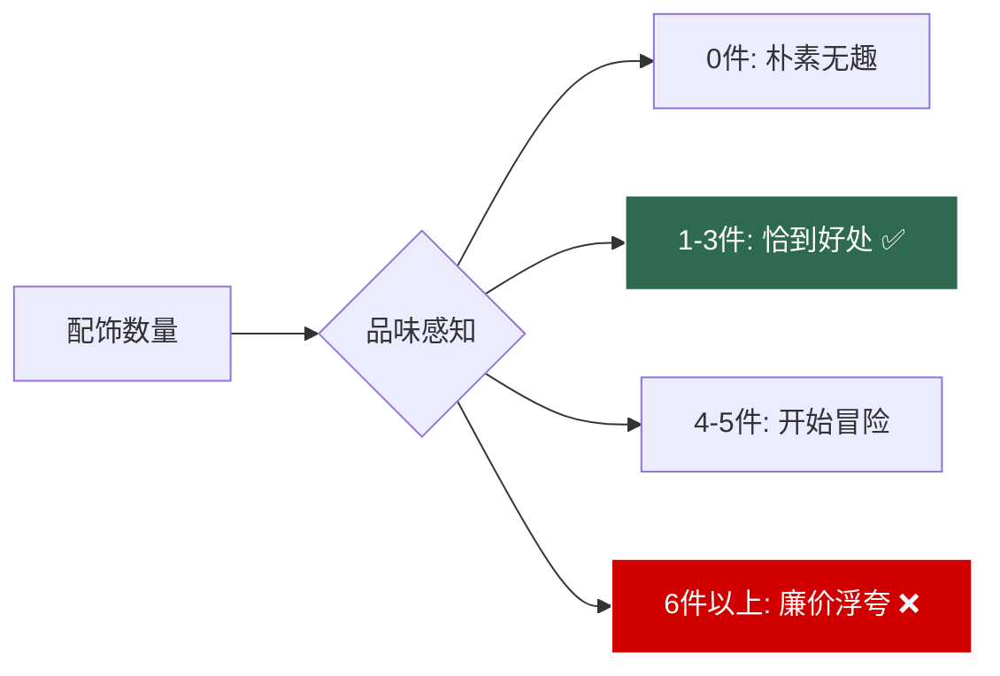
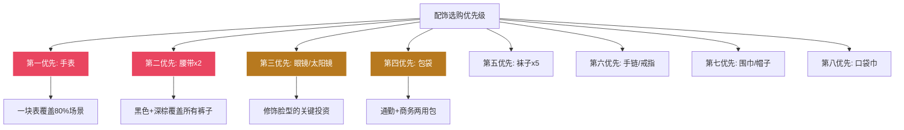

## 三、配饰推荐：用细节完成穿搭的最后一公里

> "细节决定成败，配饰决定品味。" ——Tom Ford

### 3.1 配饰的本质：视觉锚点与比例调节器

很多男性在穿搭中忽略配饰，认为它"可有可无"。但从视觉心理学的角度看，配饰承担着服装本身无法替代的功能——**它是观众视线的锚点，是比例的微调器，是个人风格最精确的表达载体**。

#### 3.1.1 配饰在穿搭中的三大功能

**功能一：视觉锚点（Visual Anchor）**

人的视线会自然被小而精致、与周围形成对比的元素吸引。一枚合适的手表、一副恰到好处的眼镜，能在不改变服装的前提下，将观众的注意力引导到你希望被看到的位置。

对于普通身高、五五开身材的男性来说，这个功能尤为重要——**将视线引导到上半身（面部、手腕），可以弱化对身材比例的关注**。

**功能二：比例微调（Proportion Adjustor）**

配饰的大小、位置、长度直接影响身体各部位的视觉比例：

| 配饰 | 调节效果 | 适用场景 |
|------|---------|---------|
| 手表（大表盘） | 让手腕和手部视觉上更醒目 | 手腕偏细时使用 |
| 长项链/吊坠 | 创造纵向线条，拉长上半身 | 五五开身材的救星 |
| 窄腰带 | 弱化腰线切割感 | 避免上下身对比过大 |
| 宽檐帽 | 增加头部视觉体量 | 平衡窄肩或小头 |
| 短款围巾 | 增加上半身层次和视觉重量 | 秋冬优化比例 |

**功能三：风格信号（Style Signal）**

在服装趋于同质化的今天（大家都穿深色牛仔裤+白T恤），配饰是区分"会穿"和"穿了"的关键变量。同一件白T恤配牛仔裤：
- 加上金属手链+飞行员墨镜 → 休闲酷感
- 加上皮质手表+丝巾 → 法式优雅
- 加上简约银饰+帆布包 → 文艺清新

#### 3.1.2 配饰的"少即是多"原则

配饰数量与品味之间不是线性关系，而是一个**倒U型曲线**：

**黄金法则**：日常场景同时佩戴的配饰不超过3件（手表算1件，戒指算1件，项链算1件，眼镜不算——因为它是功能性的）。正式场合可以适当增加到4件，但需要确保材质和风格统一。

### 3.2 手表：男性最重要的配饰

#### 3.2.1 为什么手表是配饰之王

在所有男性配饰中，手表的地位独一无二。原因有三：

1. **功能与装饰的完美融合**：它既是实用工具，又是身份符号，这种双重属性是其他配饰不具备的
2. **社交场景的通行证**：在商务场合，一块合适的手表传递"守时、可靠、注重品质"的信号。研究显示，在商务谈判中佩戴手表的参与者被认为更值得信赖
3. **五五开身材的比例调节器**：手表将视线引导到手腕和手部，有效转移对身材比例的注意力

#### 3.2.2 手表选择的核心参数

**表盘直径与手腕的关系**

这是选择手表时最容易犯错的地方。表盘直径需要与手腕粗细匹配，不是越大越好：

| 手腕周长 | 推荐表盘直径 | 风格倾向 |
|---------|------------|---------|
| 14-15cm | 34-38mm | 精致优雅 |
| 15-17cm | 38-42mm | 适中百搭 |
| 17-19cm | 42-46mm | 硬朗运动 |
| 19cm以上 | 44mm+ | 大表盘运动 |

**你的手腕周长大约在16-17cm区间，最佳表盘直径为38-42mm**。超过42mm会让手腕显得更细，低于36mm则在视觉上存在感不足。

**表壳厚度**：理想厚度在8-12mm之间。过厚（>13mm）的表壳会在衬衫袖口处卡住，影响穿着体验。

**表带材质选择**：

| 材质 | 优点 | 缺点 | 适用场景 | 价格影响 |
|------|------|------|---------|---------|
| 不锈钢 | 耐用、百搭、正式 | 偏重、冬天冰冷 | 全年通用、商务 | 中等 |
| 真皮（牛皮） | 轻便、舒适、有质感 | 怕水、需要更换 | 商务休闲、日常 | 低-中 |
| 真皮（鳄鱼皮） | 极致质感、正式感强 | 昂贵、怕水 | 正式场合 | 高 |
| NATO尼龙 | 轻便、防水、多彩 | 不够正式 | 运动、休闲 | 低 |
| 橡胶 | 防水、舒适 | 廉价感（好的除外） | 运动、户外 | 低-中 |
| 米兰尼斯钢带 | 透气、舒适、时尚 | 容易夹毛 | 全年通用 | 中等 |

**推荐策略**：入门阶段先买一条不锈钢带的表，额外配一条深棕色真皮表带。钢带用于正式场合，皮带用于日常，一块表覆盖两种场景。

**机芯类型**：

| 机芯类型 | 原理 | 精度 | 维护 | 价格 | 适合人群 |
|---------|------|------|------|------|---------|
| 石英机芯 | 电池驱动 | 极高（月误差±15秒） | 每2-3年换电池（100-300元） | 低 | 追求精准和低维护 |
| 自动机械机芯 | 手腕运动上链 | 较高（日误差±5-15秒） | 每3-5年保养一次（500-2000元） | 中-高 | 享受机械工艺的爱好者 |
| 手动机械机芯 | 手动上链 | 较高 | 每3-5年保养 | 中-高 | 追求传统制表工艺 |

**建议**：如果你是第一块手表，选**自动机械机芯**——它不需要每天上链（石英需要换电池，手动需要每天上链），佩戴即走，同时机械表的背透设计和内部齿轮运转本身就是一种审美享受。

#### 3.2.3 按预算分层推荐

**入门级（500-2000元）：建立佩戴习惯**

| 品牌 | 推荐型号 | 价格 | 核心卖点 | 适合场景 |
|------|---------|------|---------|---------|
| Casio（卡西欧） | MTP系列（如MTP-1302） | 200-500元 | 极致性价比，设计简洁 | 日常、学生 |
| Seiko 5 | SNK系列（如SNK809） | 500-1000元 | 最便宜的自动机械表 | 日常、入门机械表 |
| Timex | Marlin系列、Weekender | 400-800元 | 美式经典设计，Indiglo夜光 | 日常休闲 |
| Casio Edifice | EFR系列 | 800-1500元 | 商务运动风格 | 商务休闲 |
| Orient（东方双狮） | Bambino系列 | 1000-2000元 | 性价比最高的正装机械表 | 商务正式 |

**特别推荐：Orient Bambino**——在1500元价位，它是唯一拥有蓝宝石镜面、自动机芯、经典正装设计的手表。对28岁的你来说，Bambino能覆盖从日常到正式商务的所有场景，是入门机械表的最优解。

**中端（2000-10000元）：建立品味认知**

| 品牌 | 推荐型号 | 价格 | 核心卖点 | 适合场景 |
|------|---------|------|---------|---------|
| Tissot（天梭） | PRX、Le Locle | 2000-5000元 | 瑞士入门级机械表标杆 | 全场景通用 |
| Seiko Presage | Cocktail Time系列 | 2000-4000元 | 日本匠心工艺，表盘纹理绝美 | 商务休闲、约会 |
| Hamilton（汉密尔顿） | Khaki Field、Jazzmaster | 3000-6000元 | 美国血统瑞士制造，军表风格 | 休闲、户外 |
| Frederique Constant（康斯登） | Classics系列 | 3000-8000元 | 瑞士品牌中的性价比之王 | 正式商务 |
| Longines（浪琴） | Master Collection | 5000-10000元 | 瑞士经典品牌，品牌认知度高 | 商务正式 |

**特别推荐：Tissot PRX**——2021年复刻的经典设计，一体式表带+酒桶形表盘，既有70年代的复古感又有现代的精致感。价格在3000-4000元区间，自动机芯，蓝宝石镜面，是中端价位的颜值天花板。

**高端（10000元以上）：长期投资级单品**

| 品牌 | 推荐型号 | 价格 | 核心卖点 | 适合场景 |
|------|---------|------|---------|---------|
| Longines（浪琴） | 名匠系列、经典复刻 | 10000-25000元 | 历史底蕴深厚，设计经典 | 全场景 |
| Tudor（帝舵） | Black Bay、Royal | 15000-30000元 | 劳力士副线，品质接近 | 全场景 |
| Omega（欧米茄） | 海马、蝶飞 | 25000-50000元 | 瑞士制表巅峰之一 | 全场景 |
| Grand Seiko（精工） | Snowflake、Heritage | 30000-60000元 | 日本极致工艺，Spring Drive机芯 | 全场景 |

**特别推荐：Tudor Black Bay 36**——36mm表径对你的手腕来说完美合适（不是常见的41mm太大），深蓝色表盘百搭，防水150米，劳力士品质平替。它是"每天戴、戴一辈子"的表款。

#### 3.2.4 手表与场合的搭配规则

| 场合 | 表壳直径 | 表带材质 | 表盘颜色 | 复杂度 |
|------|---------|---------|---------|--------|
| 正式商务 | 38-40mm | 黑色/深棕皮带 | 白色/黑色 | 越简单越好 |
| 商务休闲 | 38-42mm | 钢带/皮带 | 任意 | 可有日期显示 |
| 日常休闲 | 38-44mm | 任意 | 任意 | 无限制 |
| 运动户外 | 40-44mm | 橡胶/NATO | 深色 | 计时功能可接受 |
| 约会社交 | 38-42mm | 棕色皮带/米兰尼斯 | 深蓝/白色 | 简洁优雅 |

#### 3.2.5 常见误区

- **误区1：买太大表盘的表**。很多人认为大表盘更"有气场"，但对普通身高身材来说，42mm以上的表盘会让手腕和手部显得更小，反而暴露身材短板
- **误区2：只看品牌不看尺寸**。一块尺寸不合的浪琴，不如一块尺寸完美的卡西欧——尺寸是第一位的
- **误区3：正式场合戴运动表**。计时码表（Chronograph）和潜水表（Diver）虽然好看，但在正式商务场合不够得体。正式场合需要简洁的三针表或两针表
- **误区4：忽视表带保养**。皮表带每6-12个月需要更换（长期使用会硬化、开裂），钢带需要定期用软毛刷+肥皂水清洁缝隙中的污垢

#### 3.2.6 保养指南

1. **日常佩戴**：避免剧烈运动时佩戴机械表（冲击会损伤机芯），避免接触强磁场（手机、电脑包扣、冰箱门磁条）
2. **清洁**：钢带每月用软毛刷+温肥皂水清洗一次；皮带用微湿布擦拭后自然阴干
3. **防水认知**："30米防水"只能防生活溅水（洗手），不能游泳；"100米防水"可以游泳但不能潜水；"200米以上"才能潜水
4. **机械表存放**：不戴时放在摇表器（Watch Winder）上保持上链，或每隔2-3天手动上链一次，避免机芯润滑油凝固
5. **定期保养**：自动机械表每3-5年送品牌售后做一次全面保养（洗油、校准、防水检测），费用500-2000元

---

### 3.3 眼镜：面部框架的视觉重塑

#### 3.3.1 眼镜的战略地位

对方形脸（颧骨突出、额头和下巴相对较窄）的你来说，眼镜不是"视力辅助工具"，而是**面部比例的核心调节器**。一副合适的镜框能在视觉上：

1. **柔化颧骨线条**：圆润的镜框轮廓与突出的颧骨形成视觉平衡
2. **增加额头和太阳穴区域的视觉宽度**：平衡方形脸上窄下宽的问题
3. **引导视线聚焦于眼部**：让观众关注你的眼睛而非脸型轮廓

即使你不近视，一副平光镜或防蓝光眼镜也是值得投资的配饰。

#### 3.3.2 镜框形状与方形脸的匹配

这是选择眼镜时最关键的技术决策：

| 镜框形状 | 对方形脸的效果 | 推荐度 | 原因 |
|---------|---------------|--------|------|
| 椭圆形 | ✅ 柔化棱角 | ★★★★★ | 圆润线条平衡突出的颧骨 |
| 圆角矩形 | ✅ 方圆平衡 | ★★★★★ | 现代感强，适合日常和商务 |
| 飞行员形（Aviator） | ✅ 上窄下宽互补 | ★★★★☆ | 适合休闲和户外 |
| 大框圆形 | ⚠️ 看脸型细节 | ★★★☆☆ | 框太大会显得头重脚轻 |
| 方形（直角） | ❌ 强化棱角 | ★☆☆☆☆ | 让颧骨更突出 |
| 窄框/无框 | ❌ 存在感不足 | ★★☆☆☆ | 无法起到修饰脸型的作用 |
| 猫眼形 | ❌ 偏女性化 | ★☆☆☆☆ | 不适合男性 |

**最佳选择**：椭圆形或圆角矩形镜框。镜框宽度应与脸部最宽处（颧骨位置）相当或略宽2-3mm，这样能在颧骨两侧创造视觉"缓冲区"，弱化颧骨的突出感。

**镜框高度**：中等高度（35-42mm）最佳。太高的镜框会让脸显得更长，太矮则修饰效果不足。

**镜框颜色**：

| 肤色 | 推荐镜框颜色 | 避免颜色 |
|------|------------|---------|
| 偏白 | 金色、玳瑁色、深蓝 | 纯白、浅粉 |
| 偏黄 | 黑色、深灰、深棕 | 黄色、金色（加重黄调） |
| 偏黑 | 银色、黑色、深色半透明 | 浅色、粉色 |

**你的肤色**（中性偏微油，亚洲男性常见偏暖黄调）：**黑色、深灰色、玳瑁色**是最安全的选择。

#### 3.3.3 按预算分层推荐

**入门级（300-1000元）**

| 品牌 | 价格区间 | 特点 | 推荐理由 |
|------|---------|------|---------|
| JINS | 399-799元 | 日本品牌，钛合金镜框轻便 | 免费配1.60非球面镜片，性价比极高 |
| Zoff | 399-999元 | 日本品牌，设计时尚 | 与JINS类似的性价比模式 |
| 木九十 | 299-699元 | 国产品牌，设计感不错 | 线下门店多，试戴方便 |
| LOHO | 299-799元 | 国产品牌，覆盖面广 | 价格低，适合试错 |

**特别推荐：JINS**——它家的镜框多为钛合金材质（重量仅10-15g），长时间佩戴不会压鼻梁。399元套餐包含镜框+基础镜片，对第一次配眼镜的人来说试错成本极低。

**中端（1000-3000元）**

| 品牌 | 价格区间 | 特点 | 推荐理由 |
|------|---------|------|---------|
| Gentle Monster | 1500-3000元 | 韩国品牌，设计前卫 | 框型独特，辨识度高 |
| ic! berlin | 1500-3000元 | 德国品牌，无螺丝设计 | 极致工艺，轻若无物 |
| Ray-Ban | 800-2000元 | 美国经典品牌 | 经典款永不过时 |
| Oakley | 800-2000元 | 运动光学 | 运动场景首选 |

**特别推荐：ic! berlin**——德国手工制作的无螺丝镜框，重量仅8g左右（相当于两枚硬币），佩戴感几乎为零。对需要长时间戴眼镜的人来说，轻便是最重要的舒适度指标。

**高端（3000元以上）**

| 品牌 | 价格区间 | 特点 | 推荐理由 |
|------|---------|------|---------|
| Lindberg | 3000-10000元 | 丹麦品牌，极简主义标杆 | 无螺丝、极轻、可定制 |
| Tom Ford | 2000-5000元 | 意大利设计，奢华感 | 品牌辨识度高 |
| Mykita | 2000-5000元 | 德国品牌，设计创新 | 无焊接、极轻 |
| DITA | 3000-8000元 | 日本手工制作 | 工艺极致 |

**特别推荐：Lindberg**——如果你打算长期佩戴眼镜（比如防蓝光平光镜），Lindberg是终极选择。它的Strip系列重量仅2.9g，几乎感觉不到眼镜的存在。

#### 3.3.4 镜片选择指南

很多人只关注镜框，忽略了镜片同样重要：

| 镜片类型 | 折射率 | 厚度 | 重量 | 价格 | 适合度数 |
|---------|--------|------|------|------|---------|
| 1.56非球面 | 标准 | 较厚 | 较重 | 最低 | 0-300度 |
| 1.60非球面 | 中等 | 中等 | 中等 | 中低 | 200-500度 |
| 1.67非球面 | 较高 | 较薄 | 较轻 | 中高 | 400-800度 |
| 1.74非球面 | 最高 | 最薄 | 最轻 | 最高 | 600度以上 |

**附加功能选择**：
- **防蓝光镜片**：适合长时间面对屏幕的程序员，但会轻微偏黄，影响色彩判断
- **变色镜片**：室内外自动切换，省去配太阳镜的费用，但变色速度和恢复速度因品牌差异大
- **抗反射涂层**：强烈推荐，减少镜片反光，拍照时不会出现"白光遮眼"的效果
- **防雾涂层**：戴口罩时有用，但耐久性一般

#### 3.3.5 太阳镜选择

太阳镜对方形脸的修饰效果甚至优于普通眼镜，因为镜片面积更大，修饰范围更广：

| 太阳镜款式 | 对方形脸的效果 | 风格 | 推荐度 |
|-----------|---------------|------|--------|
| 飞行员 Aviator | ✅ 下宽上窄平衡颧骨 | 硬朗、经典 | ★★★★★ |
| Clubmaster半框 | ✅ 上框线引导视线 | 复古、文艺 | ★★★★☆ |
| 大号圆框 | ✅ 柔化棱角 | 波西米亚 | ★★★☆☆ |
| Wayfarer旅行者 | ⚠️ 需选圆角版 | 经典美式 | ★★★☆☆ |
| 方形运动 | ❌ 强化棱角 | 运动 | ★★☆☆☆ |

**推荐品牌**：
- 入门（200-600元）：Harenohi、Polaroid（偏光镜片）
- 中端（600-2000元）：Ray-Ban（飞行员款经典不过时）、Gentle Monster
- 高端（2000元+）：Tom Ford、Persol、Moscot

---

### 3.4 包袋：功能与品味的平衡点

#### 3.4.1 男包的选择逻辑

很多男性对包袋有天然的抗拒感——觉得"男人背包不够man"。但在实际生活中，包袋是不可或缺的功能性配饰。问题不在于"要不要背"，而在于"背什么"。

对28岁男性来说，包袋的选择遵循三个原则：

1. **功能性优先**：容量满足日常需求，分区合理
2. **材质决定质感**：真皮或高品质尼龙，避免廉价帆布和塑料感合成皮
3. **体量与身材匹配**：普通身高的身高不适合过大的包——包袋的宽度不应超过你身体宽度的2/3

#### 3.4.2 包袋类型详解

**双肩包：日常通勤的最优解**

| 选择要素 | 推荐标准 | 原因 |
|---------|---------|------|
| 容量 | 15-20升 | 能放下笔记本+水壶+钱包+充电宝 |
| 材质 | 尼龙/皮面 | 轻便耐用且有质感 |
| 设计 | 简洁无Logo | 避免学生气，提升专业感 |
| 颜色 | 黑色/深灰/深蓝 | 最安全百搭 |
| 背带 | 有胸带和腰带 | 分散重量，背负舒适 |

推荐品牌：
- 入门（200-600元）：小米城市双肩包、90分（设计简洁，价格亲民）
- 中端（600-2000元）：Tumi Alpha（商务精英标配）、Herschel（设计好看）、Incase（苹果用户首选）
- 高端（2000元+）：Tumi Alpha 3、Mismo（丹麦极简设计）

**公文包/手提包：商务场合的门面**

| 选择要素 | 推荐标准 | 原因 |
|---------|---------|------|
| 材质 | 头层牛皮 | 质感和耐久性最佳 |
| 颜色 | 黑色/深棕 | 黑色更正式，深棕更有温度 |
| 大小 | 能放下14寸笔记本 | 覆盖工作需求 |
| 结构 | 有分隔层 | 文件、电脑、个人物品分区 |
| 开合 | 拉链或翻盖扣 | 安全性好 |

推荐品牌：
- 入门（500-1500元）：新秀丽（Samsonite）基础款
- 中端（1500-4000元）：Tumi、Montblanc入门款
- 高端（4000元+）：Montblanc大班系列、万宝龙Meisterstück

**斜挎包/邮差包：休闲场景的灵活选择**

| 选择要素 | 推荐标准 | 原因 |
|---------|---------|------|
| 容量 | 5-10升 | 手机、钱包、钥匙即可 |
| 材质 | 尼龙/轻薄皮 | 轻便不累赘 |
| 大小 | 不超过A4纸的一半 | 斜挎包过大显得拖沓 |
| 颜色 | 黑色/军绿/深蓝 | 休闲百搭 |

推荐品牌：
- 入门（100-400元）：优衣库、无印良品
- 中端（400-1500元）：Fjallraven（北极狐）、Porter（日本吉田包）
- 高端（1500元+）：Acne Studios、Master-Piece（日本）

#### 3.4.3 包袋与场景的匹配

| 场合 | 推荐包型 | 材质 | 颜色 |
|------|---------|------|------|
| 日常通勤 | 双肩包 | 尼龙/皮面 | 黑色/深灰 |
| 正式商务 | 公文包 | 真皮 | 黑色 |
| 商务休闲 | 公文包/邮差包 | 真皮/尼龙 | 深棕/黑色 |
| 休闲社交 | 斜挎包 | 尼龙/轻皮 | 任意深色 |
| 约会 | 小型斜挎包或不带包 | 皮质 | 黑色/深棕 |
| 旅行 | 双肩包+行李箱 | 尼龙 | 黑色 |

#### 3.4.4 常见误区

- **误区1：背过大的双肩包**。普通身高的身高背大号登山包会显得人更矮，选择中号（15-20升）即可
- **误区2：公文包用帆布材质**。帆布在正式商务场合不够得体，真皮公文包是商务场合的标配
- **误区3：包里塞太满**。包袋鼓鼓囊囊会破坏轮廓，影响整体美感。只带必需品，给包留出1/3的余量

---

### 3.5 腰带：被低估的比例调节器

#### 3.5.1 腰带的战略意义

对五五开身材的你来说，腰带不只是"固定裤子"的工具——**它是视觉腰线位置的直接标记物**。一条腰带的颜色、宽度、位置，直接决定了观众认为你的腰在哪里。

#### 3.5.2 腰带选择的核心参数

**宽度**

| 宽度 | 风格 | 适用场合 | 推荐度 |
|------|------|---------|--------|
| 2.5-3cm | 精致、正式 | 正装、商务 | ★★★★★ |
| 3-3.5cm | 标准、百搭 | 全场景通用 | ★★★★★ |
| 3.5-4cm | 粗犷、休闲 | 休闲、牛仔裤 | ★★★☆☆ |
| 4cm以上 | 工装、粗犷 | 工装风 | ★★☆☆☆ |

**你的最佳宽度：2.5-3.5cm**。过宽的腰带会在腰部形成一条粗壮的水平线，加重五五开比例的视觉效果。

**颜色**

| 颜色 | 百搭度 | 正式度 | 搭配建议 |
|------|--------|--------|---------|
| 黑色 | ★★★★★ | ★★★★★ | 黑色皮鞋、深色裤子 |
| 深棕 | ★★★★☆ | ★★★★☆ | 棕色皮鞋、卡其裤、深蓝裤子 |
| 浅棕/驼色 | ★★★☆☆ | ★★★☆☆ | 春夏休闲、浅色裤子 |
| 编织腰带 | ★★★☆☆ | ★★☆☆☆ | 夏季休闲 |

**铁律：腰带颜色必须与鞋子颜色一致。** 黑鞋配黑带，棕鞋配棕带——这是男装搭配中最基本的规则之一。破例只会发生在刻意打破规则的时尚场景中。

**材质**

| 材质 | 质感 | 耐久性 | 价格 | 适用场合 |
|------|------|--------|------|---------|
| 头层牛皮 | ★★★★★ | ★★★★★ | 中-高 | 全场景 |
| 二层牛皮 | ★★★☆☆ | ★★★☆☆ | 低 | 日常 |
| 编织皮 | ★★★★☆ | ★★★★☆ | 中 | 休闲 |
| 帆布/尼龙 | ★★☆☆☆ | ★★★★☆ | 低 | 运动、户外 |

**只买头层牛皮腰带。** 二层牛皮在使用3-6个月后会出现表层脱落、开裂等问题，单次穿着成本反而更高。

**扣头**

| 扣头类型 | 风格 | 正式度 | 推荐场景 |
|---------|------|--------|---------|
| 针扣（针插入孔） | 经典、正式 | ★★★★★ | 正装、商务 |
| 板扣（平滑金属板） | 现代、简洁 | ★★★★☆ | 商务休闲 |
| 自动扣（弹力卡扣） | 方便但不够精致 | ★★☆☆☆ | 不推荐正式场合 |

**推荐**：正式场合用针扣，日常用板扣。自动扣虽然方便，但金属弹簧的"咔哒"声和塑料质感会拉低整体品味。

#### 3.5.3 品牌推荐

| 价位 | 价格区间 | 推荐品牌 | 特点 |
|------|---------|---------|------|
| 入门 | 100-300元 | 海澜之家、优衣库、Charles Tyrwhitt | 头层牛皮基础款 |
| 中端 | 300-800元 | Massimo Dutti、COS、Saddleback Leather | 皮质好，扣头精致 |
| 高端 | 800-2000元 | Montblanc、Hugo Boss、Braun Buffel | 品牌辨识度高，品质顶级 |
| 顶级 | 2000元+ | Hermès（爱马仕）H扣、Bottega Veneta编织 | 传家级单品 |

**建议**：先买一条黑色针扣+一条深棕板扣，覆盖95%的场景。

#### 3.5.4 常见误区

- **误区1：腰带系太紧**。腰带的作用是"固定"不是"勒紧"。系好后能插入一根手指的松紧度最佳——太紧会在腰腹形成鼓包，不舒服且不美观
- **误区2：腰带太长**。扣好后腰带尾端不应超过第一个裤袢，多余的部分塞进裤袢或剪短。腰带尾端在外面甩来甩去极其不雅
- **误区3：一条腰带走天下**。至少需要两条：一条黑色正装+一条深棕休闲，才能覆盖衣橱中的所有裤子

---

### 3.6 袜子：最容易被忽视的细节

#### 3.6.1 为什么袜子值得单独讨论

袜子是男装中"隐藏的评分项"——大多数时候没人注意，但一旦露出破绽（坐下时裤脚上移露出白色运动袜），立刻扣分。对普通身高身高来说，袜子的颜色还会直接影响腿部的视觉长度。

#### 3.6.2 袜子选择的三条铁律

**铁律一：颜色跟着裤子走，不跟着鞋走**

| 裤子颜色 | 推荐袜子颜色 | 效果 |
|---------|------------|------|
| 黑色 | 黑色 | 腿部线条无限延伸 |
| 深蓝 | 深蓝/深灰 | 视觉连贯 |
| 炭灰 | 深灰/黑色 | 过渡自然 |
| 卡其色 | 深棕/藏蓝 | 保持色系统一 |
| 浅色 | 浅灰/米色 | 避免深色袜子突兀 |

**原理**：袜子颜色与裤子一致时，裤脚到鞋口之间不会出现"色块断层"，腿部线条从裤腰一直延伸到鞋口——这对普通身高身高的视觉显高效果至关重要。

**铁律二：正式场合不露腿**

坐下来时裤脚上移，袜子如果不够长，露出一截小腿——这是男装搭配中最常见的"翻车现场"。正式场合袜子长度必须到小腿中段以上（Mid-calf或Over-the-calf）。

**铁律三：纯色优于花纹**

日常穿纯色袜子最安全。如果你想用袜子增加个性（如波点、条纹、印花），确保它与整体搭配有色彩呼应，而不是孤立的"惊喜"。

#### 3.6.3 面料选择

| 面料 | 透气性 | 吸汗性 | 耐久性 | 价格 | 适合季节 |
|------|--------|--------|--------|------|---------|
| 精梳棉 | ★★★★☆ | ★★★★★ | ★★★☆☆ | 低 | 全年通用 |
| 美利奴羊毛 | ★★★★★ | ★★★★★ | ★★★★☆ | 中高 | 秋冬首选 |
| 丝光棉 | ★★★★☆ | ★★★★☆ | ★★★★☆ | 中 | 全年通用 |
| 竹纤维 | ★★★★★ | ★★★★☆ | ★★☆☆☆ | 低-中 | 夏季 |
| 尼龙混纺 | ★★☆☆☆ | ★★☆☆☆ | ★★★★★ | 低 | 不推荐 |

**你的皮肤（中性偏微油）**：夏季推荐竹纤维或精梳棉（透气吸汗），冬季推荐美利奴羊毛（保暖不闷脚）。

#### 3.6.4 品牌推荐

| 价位 | 价格区间 | 推荐品牌 | 特点 |
|------|---------|---------|------|
| 入门 | 10-30元/双 | 优衣库、蕉内 | 品质稳定，颜色选择多 |
| 中端 | 30-80元/双 | Falke、Pantherella、Tabio（靴下屋） | 舒适度和耐久性显著提升 |
| 高端 | 80-200元/双 | Bresciani、Mazarin、Pantherella | 意大利/英国手工，极致舒适 |

**特别推荐：Tabio（靴下屋）**——日本品牌，价格在40-80元/双，面料和做工在这个价位几乎无敌。它家的精梳棉商务袜是我见过的性价比最高的袜子。

---

### 3.7 其他配饰：进阶的点睛之笔

#### 3.7.1 手链/手环

**佩戴原则**：
- 只戴一只手（左手或右手，不双手都戴）
- 手链与手表戴同一只手时，材质要协调（金属表配金属链，皮表配皮手环）
- 数量：最多2条，多了像"地摊货"

**推荐款式**：

| 类型 | 适合场景 | 推荐材质 | 价格区间 |
|------|---------|---------|---------|
| 简约金属链 | 商务休闲 | 925银、不锈钢 | 200-1000元 |
| 皮革编织 | 日常休闲 | 头层牛皮 | 100-500元 |
| 串珠（石材/木质） | 休闲度假 | 黑曜石、檀木 | 50-300元 |
| 手绳 | 日常 | 编织绳 | 20-200元 |

**品牌推荐**：
- 入门：潘多拉（Pandora）基础银饰、国产银饰工作室
- 中端：Miansai（美国极简金属配饰）、Thomas Sabo
- 高端：Chrome Hearts、John Hardy

#### 3.7.2 戒指

**男性戒指的佩戴规则**：
- **数量**：一只手最多1枚
- **位置**：食指或小指（时尚感）；无名指（已婚/订婚信号，慎选）
- **材质**：银、钨钢、钛合金、K金
- **宽度**：4-8mm（太细像女戒，太粗像暴发户）

**推荐**：
- 入门：925银素圈（100-300元），造型简洁，试错成本低
- 中端：Tiffany & Co.经典款、Chrome Hearts（1000-5000元）
- 高端：Cartier Love系列、Bvlgari B.zero1（10000元+）

#### 3.7.3 围巾/领巾

围巾是秋冬季节提升穿搭层次感的利器，对方形脸还有额外的修饰作用：

| 类型 | 材质 | 大小 | 适合场景 | 搭配方式 |
|------|------|------|---------|---------|
| 长围巾 | 羊毛/羊绒 | 180×30cm | 秋冬日常 | 绕脖一圈，两端自然下垂 |
| 方巾/领巾 | 丝/棉 | 50×50cm | 全年通用 | 对折塞入衬衫领口 |
| 羊绒围巾 | 羊绒 | 200×70cm | 冬季 | 披肩式或绕脖式 |

**颜色选择**：
- 第一条围巾选**驼色或深灰色**——能与深蓝西装外套、黑色大衣完美搭配
- 第二条可以尝试**酒红或深绿**——秋冬的高级点缀色

**品牌推荐**：
- 入门（100-400元）：优衣库（羊绒围巾性价比极高）、Zara
- 中端（400-1500元）：Acne Studios、Johnstons of Elgin
- 高端（1500元+）：Loro Piana、Brunello Cucinelli、Hermès

#### 3.7.4 帽子

帽子对方形脸的修饰效果显著，但选择需要谨慎：

| 帽型 | 对方形脸的效果 | 适合场合 | 推荐度 |
|------|---------------|---------|--------|
| 棒球帽 | ✅ 帽檐遮挡额头宽度 | 日常休闲 | ★★★★☆ |
| 渔夫帽 | ✅ 柔化脸部线条 | 休闲、户外 | ★★★★☆ |
| 贝雷帽 | ⚠️ 看搭配功力 | 文艺场合 | ★★★☆☆ |
| 报童帽 | ✅ 增加头部体量 | 复古风格 | ★★★☆☆ |
| 礼帽 | ⚠️ 太正式日常少用 | 正式活动 | ★★☆☆☆ |
| 毛线帽 | ⚠️ 塌发问题需要注意 | 冬季 | ★★★☆☆ |

**棒球帽选择要点**：
- 帽檐：微微弯曲（不要平檐，那是嘻哈风格）
- 帽冠：中等高度，不要太高（显得头大）或太塌（塌发问题会加重）
- 颜色：黑色、深蓝、军绿最安全
- Logo：无Logo或小Logo，避免大面积品牌标志

#### 3.7.5 口袋巾（Pocket Square）

口袋巾是西装外套胸口口袋的装饰方巾，是提升正装品味的最小成本投资：

**折叠方式**：

| 折法 | 难度 | 正式度 | 适合场景 |
|------|------|--------|---------|
| 一字折（Presidential Fold） | ★☆☆☆☆ | ★★★★★ | 正式商务 |
| 三角折（One-Point Fold） | ★★☆☆☆ | ★★★★☆ | 商务社交 |
| 泡芙折（Puff Fold） | ★★★☆☆ | ★★★☆☆ | 休闲派对 |
| 多点折（Multi-Point） | ★★★★☆ | ★★☆☆☆ | 时尚场合 |

**面料选择**：真丝最正式，棉质次之，亚麻最休闲。

**颜色搭配原则**：口袋巾的颜色应与领带或衬衫有呼应，但不要完全相同——同中有异才显品味。

**品牌推荐**：
- 入门（30-100元）：淘宝手工真丝口袋巾
- 中端（100-400元）：Drake's、SuitSupply
- 高端（400元+）：Hermès、Turnbull & Asser

---

### 3.8 配饰的整体搭配体系

#### 3.8.1 材质统一原则

配饰之间的材质需要形成统一感，避免"混搭翻车"：

| 材质体系 | 包含配饰 | 适合场景 |
|---------|---------|---------|
| 金属体系（银/不锈钢） | 手表钢带+银手链+银戒指 | 现代、商务 |
| 皮革体系（深棕） | 皮表带+棕腰带+棕鞋+皮手环 | 温暖、休闲 |
| 皮革体系（黑色） | 皮表带+黑腰带+黑鞋 | 正式、商务 |
| 混合体系 | 金属表+皮腰带+皮鞋 | 日常（最常见） |

#### 3.8.2 场景配饰组合模板

**场景一：日常通勤**

手表：38-42mm钢带简约款
眼镜：黑框圆角矩形（近视/防蓝光）
双肩包：黑色尼龙简洁款
腰带：黑色/深棕皮带
袜子：深色纯色中筒袜
总计配饰数：4件（刚好）

**场景二：正式商务**

手表：38-40mm黑色/深棕皮带正装表
眼镜：黑框椭圆形（如需要）
公文包：黑色真皮
腰带：黑色针扣头层牛皮
口袋巾：白色真丝一字折
袜子：黑色纯色过膝袜
总计配饰数：5-6件（正式场合可稍多）

**场景三：休闲约会**

手表：38-42mm棕色皮带款
手链：1条银质或皮质
眼镜：玳瑁色椭圆形（如需要）
斜挎包：黑色小型
腰带：深棕板扣
袜子：深色纯色
总计配饰数：4-5件

**场景四：运动户外**

手表：40-44mm运动表/智能手表
帽子：黑色棒球帽
双肩包：运动款
腰带：编织/弹性腰带
袜子：运动专用袜
总计配饰数：3件（运动场景减负）

#### 3.8.3 配饰选购的优先级

如果你的预算有限，按以下优先级逐步添置：

**预算参考**：按上述优先级，总投入约2000-5000元即可建立一套完整的配饰体系：

| 优先级 | 配饰 | 推荐预算 | 说明 |
|--------|------|---------|------|
| 1 | 手表 | 1000-3000元 | 一块自动机械表用5年+ |
| 2 | 腰带×2 | 400-800元 | 黑色+深棕，头层牛皮 |
| 3 | 眼镜/太阳镜 | 400-1500元 | 根据视力需求选择 |
| 4 | 包袋 | 300-1000元 | 一只通勤双肩包 |
| 5 | 袜子×5 | 100-300元 | 深色纯色中筒袜 |
| 6 | 手链/戒指 | 200-500元 | 简约银饰即可 |
| 7 | 围巾/帽子 | 200-500元 | 秋冬季节添置 |
| 8 | 口袋巾 | 50-200元 | 有正装需求时再买 |

---

### 3.9 配饰的保养与存放

配饰的使用寿命和观感，50%取决于购买时的选择，50%取决于日常的保养。

#### 3.9.1 金属配饰保养

| 配饰 | 日常保养 | 深度保养 | 存放 |
|------|---------|---------|------|
| 钢带手表 | 每月软毛刷+肥皂水清洗 | 每年超声波清洗 | 原装表盒或摇表器 |
| 银饰（手链/戒指） | 擦银布擦拭 | 银饰清洗液浸泡 | 密封袋+防氧化纸 |
| 不锈钢配饰 | 微湿布擦拭 | 无特殊需求 | 干燥处存放 |

#### 3.9.2 皮革配饰保养

| 配饰 | 日常保养 | 深度保养 | 存放 |
|------|---------|---------|------|
| 皮表带 | 避免沾水，微湿布擦拭 | 每月涂皮革保养油 | 平放，避免折弯 |
| 皮腰带 | 用完挂起，避免折痕 | 每季度涂鞋油/保养油 | 挂在衣架上 |
| 皮包 | 定期擦拭，避免暴晒 | 每季度涂皮革护理霜 | 塞填充物保持形状 |

#### 3.9.3 眼镜保养

1. **清洁**：用专用眼镜布+清洗液擦拭，不要用衣角擦（布料纤维会刮花镜片）
2. **摘戴**：双手摘戴，不要单手掰——长期单手操作会导致镜框变形
3. **存放**：不用时放入镜盒，镜片朝上放置
4. **调整**：镜框松动时去眼镜店免费调整（大多数品牌门店提供免费调校）

***

### 3.10 配饰进阶：从"戴对"到"戴好"

当你已经掌握了基础配饰的选购和搭配，以下是进阶方向：

#### 3.10.1 学会"做减法"

进阶不是增加配饰数量，而是提升每一件配饰的**精准度**。初学者的错误是"什么都想戴"，高手的做法是"只戴最对的那一件"。

一个简单的检验方法：出门前在全身镜前，依次摘掉每一件配饰，观察整体效果。如果摘掉某件配饰后整体更好看了——说明这件配饰不该戴。

#### 3.10.2 培养"配饰直觉"

配饰搭配的终极目标是形成直觉性的审美判断，这需要：
1. **大量观察**：关注穿搭博主和杂志中的配饰搭配，Pinterest搜索"men's accessories outfit"
2. **记录反馈**：拍照记录每天的配饰搭配，一周后回看哪些好评最多
3. **模仿→理解→创新**：先模仿成熟方案，理解背后的逻辑，再创造自己的风格

#### 3.10.3 关于配饰的"个性表达"

配饰是穿搭中最具个人表达空间的部分。在掌握了基本规则之后，你可以通过配饰传递自己的审美偏好和生活态度：

- **极简主义者**：一块好表+一条好腰带，其他全省略
- **复古爱好者**：怀表、古董眼镜、编织手环
- **科技爱好者**：智能手表+钛合金配饰
- **文艺青年**：手工银饰、帆布包、棉麻围巾

**但记住一个底线**：个性表达的前提是不出错。先保证"戴对"，再追求"戴好"，最后才是"戴出个性"。
