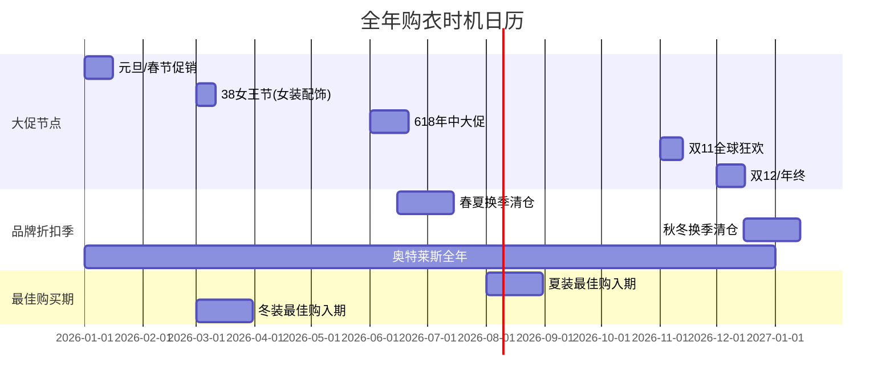
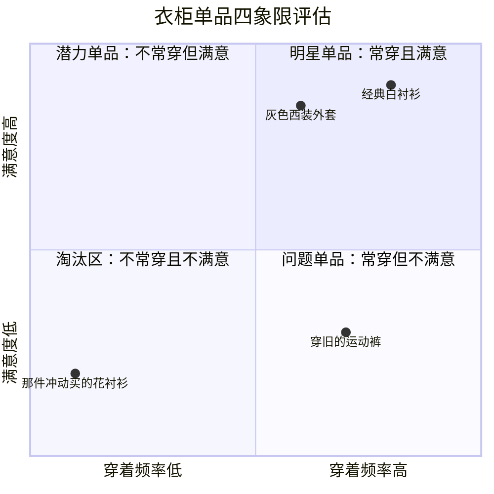
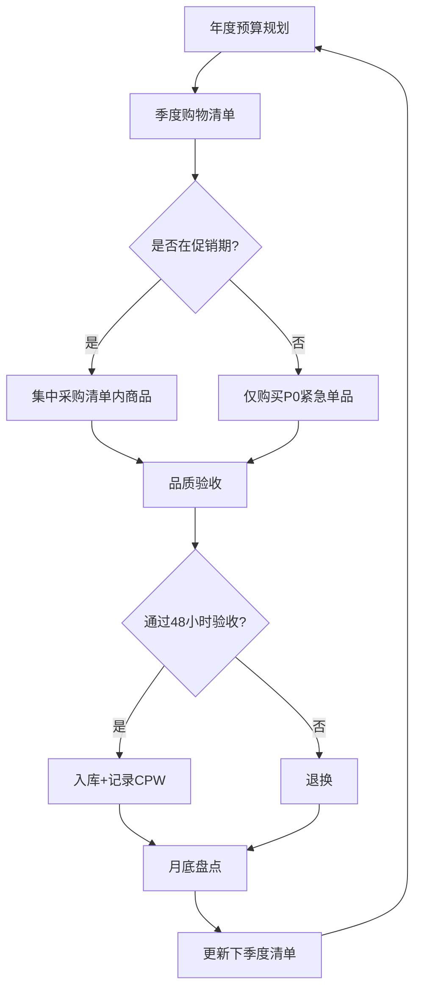

## 四、购物策略

买衣服不是冲动消费，而是一门需要系统规划的决策科学。很多人衣柜里塞满了衣服却总觉得"没衣服穿"，根源不在于衣服少，而在于购买时缺乏策略——买了一堆不适合的单品，真正需要的却没买到。本章将从预算管理、时机选择、渠道策略、品质验收、库存管理五个维度，构建一套完整的购物决策体系，帮你把每一分钱花在刀刃上。

### 4.1 购物决策的底层逻辑

#### 4.1.1 为什么需要购物策略

大多数人的购衣行为遵循"看到→心动→购买→后悔"的模式。心理学研究表明，人类在购物时存在以下认知偏差：

| 认知偏差 | 表现 | 后果 |
|---------|------|------|
| **锚定效应** | 看到原价1000元打折到500元，觉得"赚了" | 买了不需要的东西 |
| **从众心理** | "这个款式今年很火" | 买了不适合自己风格的衣服 |
| **沉没成本** | "排了这么久队不买可惜了" | 在错误的决策上继续投入 |
| **即时满足** | 想要立刻拥有，不愿等待 | 错过更好的选择或更低的价格 |
| **峰终定律** | 被店铺体验/销售话术打动 | 把场景好感转移到商品上 |

理解这些偏差不是为了消灭它们（这是不可能的），而是为了在关键决策点插入"缓冲机制"，给自己理性思考的时间。

#### 4.1.2 策略性购物 vs 冲动性购物

两种购物模式的核心差异：

**冲动性购物**：外部刺激（广告、促销、社交压力）→ 即时决策 → 购买 → 满足感消退 → 后悔

**策略性购物**：需求分析 → 列清单 → 比较研究 → 等待时机 → 购买 → 长期满意

策略性购物不是"不买"或"少买"，而是"买对"。一套策略性购入的10件单品，穿着频率和满意度远超冲动购入的30件。

#### 4.1.3 "每次穿着成本"思维

判断一次购物是否值得，不看价格标签，看**每次穿着成本（Cost Per Wear, CPW）**：

> **CPW = 购买价格 ÷ 预期穿着次数**

举例对比：

| 单品 | 价格 | 预期穿着次数 | CPW | 结论 |
|------|------|------------|-----|------|
| 基础白衬衫 | ¥300 | 100次 | ¥3/次 | 极高性价比 |
| 设计师限量T恤 | ¥800 | 5次 | ¥160/次 | 低性价比 |
| 高品质深色牛仔裤 | ¥600 | 200次 | ¥3/次 | 极高性价比 |
| 潮牌联名卫衣 | ¥1200 | 10次 | ¥120/次 | 低性价比 |
| 经典款深蓝西装 | ¥2000 | 80次 | ¥25/次 | 高性价比 |

CPW思维的核心启示：
- **基础款值得投资**：因为穿着频率高，高品质基础款的CPW极低
- **潮流款要克制**：因为时效性强，建议选择平价替代
- **外套/鞋子值得多花钱**：它们的使用寿命长，分摊下来反而便宜
- **"便宜"的东西可能更贵**：一件¥100穿3次的T恤，CPW是¥33，比¥300穿100次的白衬衫贵10倍

---

### 4.2 预算管理体系

#### 4.2.1 建立年度穿搭预算

穿搭预算不应该是"有多少花多少"，而是一个有计划的年度支出。建议按以下步骤确定预算：

**第一步：计算可支配穿搭预算**

> 月穿搭预算 = (月收入 - 必要生活开支 - 储蓄目标) × 15%~25%

15%~25%是一个合理区间。如果你刚开始建立衣橱（第一年），可以适当提高到25%~30%；衣橱成熟后可以降到10%~15%。

**第二步：确定年度总预算**

将月预算×12，得到年度总预算。例如月预算1500元，年度总预算为18000元。

**第三步：按品类分配**

建议的分配比例（以月预算1500元为例）：

| 品类 | 预算占比 | 月均金额 | 说明 |
|------|---------|---------|------|
| 上装（衬衫、T恤、毛衣） | 25%~30% | 375~450元 | 高频更换，品类多样 |
| 下装（裤子、牛仔裤、休闲裤） | 20%~25% | 300~375元 | 更换频率较低，但需要耐穿 |
| 外套（西装、夹克、大衣） | 15%~20% | 225~300元 | 件数少但单价高，按季度集中采购 |
| 鞋子 | 15%~20% | 225~300元 | 好鞋耐穿，投资回报高 |
| 配饰（腰带、围巾、包） | 5%~10% | 75~150元 | 提升精致度的杠杆点 |
| 修改/保养 | 5% | 75元 | 改裤脚、干洗、鞋保养等 |

**第四步：设置弹性储备**

预留年度总预算的10%~15%作为"机会基金"，用于：
- 突然发现的高性价比好物
- 重要场合的应急购买
- 换季时的补充采购

#### 4.2.2 预算管理的实操工具

**方法一：信封法（适合现金管理）**

将每月预算分别装入不同信封，每个信封对应一个品类。花完即止，不再追加。

**方法二：电子表格法（推荐）**

创建一个简单的Excel/在线表格，包含以下字段：

日期 | 品类 | 单品名称 | 品牌 | 价格 | 购买渠道 | CPW目标 | 实际穿着次数 | 实际CPW

每月汇总一次，对比实际支出和预算计划。

**方法三：记账App法**

使用记账App（如随手记、MoneyNote）创建"穿搭"分类，每笔购衣支出都记录在内，定期回顾。

#### 4.2.3 不同预算档位的策略差异

| 月预算档位 | 策略重心 | 品牌选择 | 核心建议 |
|-----------|---------|---------|---------|
| 500元以下 | 精准购买，一件是一件 | 优衣库、GU、迪卡侬基础款 | 优先补基础款空白，不追潮流 |
| 500~1500元 | 基础款+少量品质升级 | 优衣库+国产中端品牌 | 每月重点买1~2件品质单品 |
| 1500~3000元 | 品质优先，品牌入门 | 国产中端+快时尚高端线 | 开始关注面料和版型 |
| 3000元以上 | 品牌组合，质感升级 | 轻奢+设计师品牌 | 可以投资经典款外套/鞋 |

---

### 4.3 购买时机与促销策略

#### 4.3.1 全年购衣日历

掌握全年促销节奏，可以节省30%~50%的穿搭预算：

**关键时间节点详解：**

| 时间段 | 促销类型 | 适合购买 | 折扣力度 | 注意事项 |
|--------|---------|---------|---------|---------|
| 1月中旬~2月初 | 年末清仓+春节促销 | 冬装、新年战袍 | 5~7折 | 热门尺码可能断货，提前关注 |
| 3月初 | 38节 | 配饰、内衣、运动装 | 6~8折 | 男装折扣力度一般，重点关注运动品牌 |
| 5月下旬~6月中 | 618预热+正式期 | 夏装、基础款囤货 | 4~7折 | 最佳囤基础款时机，提前加购物车 |
| 6月中旬~7月底 | 夏季清仓 | 夏装尾货 | 3~5折 | 适合买经典款，不追当季爆款 |
| 8月~9月 | 秋装上新 | 秋装新品 | 9折左右 | 新品折扣少，但尺码全，适合刚需 |
| 10月下旬~11月11日 | 双11 | 全品类 | 3~6折 | 年度最大促销，制定详细清单 |
| 12月中旬~1月底 | 冬季清仓 | 冬装、大衣、羽绒服 | 3~5折 | 反季购买冬装的最佳时机 |

#### 4.3.2 促销避坑指南

促销是节省预算的利器，也是冲动消费的温床。以下是最常见的促销陷阱：

**陷阱一：先涨后降**

商家在促销前悄悄提高原价，打折后价格和平时差不多甚至更贵。

应对方法：
- 使用比价工具（如慢慢买、什么值得买、历史价格查询插件）
- 提前1~2个月将目标商品加入购物车，观察价格变化
- 大促前截图保存原价

**陷阱二：满减凑单**

"满300减50"看似划算，但为了凑单买了不需要的东西，实际支出反而增加。

应对方法：
- 只计算真正需要的商品是否达到满减门槛
- 如果差额小于满减金额，用日用品（袜子、内衣）凑单
- 差额过大时，放弃满减，直接购买

**陷阱三：限时抢购制造焦虑**

"最后3件""限时2小时"制造紧迫感，让你来不及思考就下单。

应对方法：
- 提前列好清单，只抢清单上的商品
- 设定"犹豫清单"——看到但不在清单上的商品，先记下来，等大促结束后再决定
- 记住：下一次促销总会来

**陷阱四：直播带货的冲动诱导**

主播的"3、2、1上链接"和"家人们"话术会激发群体购买冲动。

应对方法：
- 只关注你**事先确定**要买的品牌/品类的直播
- 关闭弹幕，减少从众心理影响
- 直播间价格不一定最低，多平台比价

#### 4.3.3 反季购买的进阶策略

反季购买是最高效的省钱方式之一，但需要技巧：

**适合反季购买的品类**：
- 羽绒服（冬天2000元→夏天800~1200元）
- 羊绒大衣（冬天3000元→夏天1200~1800元）
- 防风夹克/冲锋衣（秋冬→来年春天清仓）

**不适合反季购买的品类**：
- 基础款T恤、Polo衫（价格稳定，反季折扣不大）
- 牛仔裤（四季可穿，折扣空间小）
- 运动鞋（款式更新快，反季款可能过时）

**操作要点**：
1. 冬装在3~4月购买（冬末清仓，库存最充足）
2. 夏装在8~9月购买（夏末清仓，但注意下一年款式变化）
3. 优先买经典色经典款，避免买了明年不喜欢的颜色/设计
4. 反季购买前确认退换政策，防止尺码不对无法处理

---

### 4.4 购买渠道的选择与对比

#### 4.4.1 渠道全景对比

| 渠道 | 优势 | 劣势 | 适合购买 | 价格参考 |
|------|------|------|---------|---------|
| **品牌官方店/专柜** | 正品保证、试穿体验、售后完善 | 价格最高、选择受门店库存限制 | 首次购买某品牌（确认尺码）、外套/西装等需要试穿的品类 | 原价~9折 |
| **天猫/京东旗舰店** | 正品保证、退换方便、促销力度大 | 无法试穿、色差可能 | 已知尺码的基础款、复购品 | 促销时5~7折 |
| **品牌官网/小程序** | 会员积分、独家款式 | 退换不如平台方便 | 品牌忠粉、会员日 | 7~8折 |
| **奥特莱斯** | 品牌正品折扣、可试穿 | 款式偏旧、库存不稳定 | 经典款外套/鞋、基础款 | 3~7折 |
| **唯品会** | 品牌特卖、价格低 | 款式较旧、退换周期长 | 不追求当季款的基础品 | 2~5折 |
| **得物/Nice** | 潮牌正品鉴定 | 溢价严重、不适合基础款 | 限量款/联名款（非必需不推荐） | 视稀缺度 |
| **二手平台（闲鱼/转转）** | 价格极低 | 品质不确定、无售后 | 尝试新风格的试错成本低 | 1~3折 |
| **批发市场/工厂店** | 价格最低 | 品质参差不齐、无品牌保障 | 基础白T、袜子等标准化产品 | 1~2折 |

#### 4.4.2 线上购物的系统化流程

线上购物最大的风险是"看不见实物"，以下流程可以将退货率降低60%以上：

**第一步：建立个人尺码数据库**

创建一个专属文档，记录你在不同品牌的尺码数据：

品牌：优衣库
衬衫：M码（合身）/ L码（宽松）
T恤：M码
裤子：W30 L32（直筒）/ W31 L32（修身）
外套：M码

品牌：ZARA
衬衫：M码（偏小，建议L）
T恤：M码
裤子：38码（欧码偏大）

品牌：Nike
运动鞋：42码（标准脚型）
运动裤：M码

每次在新品牌购买后，将尺码信息补充到数据库中。

**第二步：研究商品详情**

重点查看以下信息：
- **面料成分表**：天然纤维含量、是否有弹性纤维
- **尺码表对照**：对比自己已知品牌的尺码数据
- **买家秀图片**：比卖家秀更真实，注意身高体重和你相近的买家
- **差评内容**：重点关注"偏大/偏小""起球""褪色""缩水"等关键词
- **退货率**：如果一件商品退货率很高，通常说明版型有问题

**第三步：下单前的最终检查**

- 确认退换政策（7天无理由、运费险）
- 对比至少3个平台的价格
- 检查是否有隐藏优惠券（店铺首页、商品详情页下方）
- 大件商品确认是否支持上门取件退货

#### 4.4.3 线下购物的效率最大化

线下购物的优势是能摸到面料、看到上身效果，但效率低、容易被销售引导。以下是提升效率的方法：

**出发前准备**：
1. 明确目标：今天要买什么？（最多列3个品类）
2. 设定预算上限
3. 选择2~3家目标店铺，规划路线
4. 穿着你打算搭配的衣服（方便试穿时看整体效果）

**试穿的黄金法则**：

| 检查项目 | 具体操作 | 合格标准 |
|---------|---------|---------|
| 肩线 | 站直，看肩线是否落在肩峰 | 肩线与肩峰齐平或略宽1cm |
| 胸围 | 扣上扣子，做拥抱动作 | 不紧绷、不空荡，能放入一个拳头 |
| 衣长 | 双手自然下垂 | 上衣下摆在裤腰线以下5~10cm |
| 袖长 | 手臂自然下垂 | 袖口在手腕骨上方1~2cm |
| 裤腰 | 系好腰带后能插入两根手指 | 不紧不松，不会下滑 |
| 裤长 | 穿上常穿的鞋 | 裤脚刚好触及鞋面或略堆1cm |
| 舒适度 | 抬手、蹲下、坐下、走动 | 所有动作无明显束缚感 |

**应对销售话术**：
- "这个款卖得很好，最后一件了" → 真正好的东西不需要制造紧迫感
- "这个颜色很衬你" → 自己照镜子判断，销售的审美不一定适合你
- "现在打折，明天就恢复原价" → 先冷静10分钟，走出店铺再决定
- 万能回应："我再看看，谢谢"——这不是拒绝，是保护自己的决策空间

---

### 4.5 品质验收：买之前和买之后

#### 4.5.1 购买前的品质快检

无论是线上还是线下，拿到实物后（或试穿时），用以下方法快速检验品质：

**面料触感测试**：
- 用手掌揉搓面料，感受柔软度和回弹性
- 优质棉：柔软、有微弹、不起皱
- 优质羊毛：温暖、有弹性、不扎手
- 劣质化纤：滑腻、无质感、容易起静电

**缝线检查**：
- 翻到内侧，检查主要接缝处的缝线
- 合格标准：线迹均匀、无跳线、无散线头、每厘米≥3针
- 重点检查：肩缝、侧缝、裤裆缝——这些是受力最大的部位

**辅料检查**：
- 拉链：拉动是否顺滑，拉上后是否对齐
- 纽扣：是否牢固（轻轻拽一下），材质是否与衣服匹配
- 内衬：外套和西装必须有内衬，检查内衬是否平整、有无起球

**洗涤标识检查**：
- 确认洗涤方式你是否能接受（如"仅干洗"意味着每次保养成本约30~50元）
- 如果一件标价200元但只能干洗的衣服穿20次，洗涤成本就额外增加了300~500元

#### 4.5.2 到手后的48小时验收期

线上购买的衣服到手后，给自己48小时的验收期（在7天无理由退货的范围内）：

**第一天：静态检查**
1. 拆包后检查是否有质量问题（色差、污渍、破损）
2. 对比商品详情页描述是否一致
3. 试穿，检查尺码和版型
4. 用手机拍下上身效果（自然光下正面+侧面+背面）

**第二天：搭配测试**
1. 用这件衣服搭配你衣柜里现有的3套look
2. 如果搭配不出3套满意的look，说明这件衣服和你的衣柜不兼容，考虑退掉
3. 穿着在家里活动2小时，感受舒适度
4. 如果以上全部通过，保留；任何一项不通过，果断退掉

#### 4.5.3 洗涤后的最终判断

第一次洗涤是品质的"试金石"：

| 洗涤现象 | 可能原因 | 处理建议 |
|---------|---------|---------|
| 严重缩水（>5%） | 面料预缩处理不到位 | 如果影响穿着，退货/下次买大一号 |
| 明显褪色 | 染色工艺差 | 深色衣服首次单独洗，持续褪色则品质差 |
| 起球 | 短纤维面料或编织松散 | 轻微起球用毛球修剪器，严重起球说明品质不达标 |
| 变形 | 弹性纤维质量差或编织结构问题 | 平铺晾干试试能否恢复，不能则品质不达标 |
| 缝线开裂 | 缝线质量差或受力点未加固 | 修补后继续穿，但该品牌列入观察名单 |

---

### 4.6 衣柜库存管理与购物清单

#### 4.6.1 衣柜盘点：购物的起点

每次购物前，先做一次快速的衣柜盘点。这不是要你把所有衣服翻出来，而是用15分钟快速评估：

**盘点四象限法**：

- **明星单品**（高频+高满意）：核心资产，保护好，有同款可考虑备用
- **潜力单品**（低频+高满意）：可能是缺少搭配伙伴，优先用购物来激活它们
- **淘汰区**（低频+低满意）：果断处理（捐赠/二手/丢弃），释放空间
- **问题单品**（高频+低满意）：升级替换的优先目标

#### 4.6.2 购物清单的制定方法

基于盘点结果，制定"有缺口才购物"的清单：

**步骤一：识别缺口**

对比你的"场合需求表"（见第二章风格定位）和当前衣柜，找出：
- 哪些场合缺少对应的衣服？
- 哪些基础款已经磨损需要替换？
- 哪些"潜力单品"缺少搭配伙伴？

**步骤二：按优先级排序**

| 优先级 | 类型 | 示例 |
|--------|------|------|
| P0-紧急 | 已破损/不合身的基础款 | 唯一的白衬衫领口发黄了 |
| P1-重要 | 缺少的关键品类 | 没有一件像样的深色外套 |
| P2-提升 | 提升搭配丰富度 | 一条卡其裤能让3件上衣焕新 |
| P3-锦上添花 | 非必要但能提升 | 一块好的手表或一条丝巾 |

**步骤三：设定购买窗口**

将清单上的物品分配到全年的购买窗口中：
- P0级：随时购买（不等促销）
- P1级：安排在最近的大促期间
- P2级：分配到下一个合适的促销节点
- P3级：等反季或超低价时再买

#### 4.6.3 "一进一出"原则

控制衣柜规模的黄金法则：每买进一件新衣服，就淘汰一件旧衣服。

这个原则的好处：
- 强迫你思考"这件新衣服是否值得替换掉一件旧的"
- 防止衣柜膨胀到失控
- 保持衣物总量在一个可管理的范围内（建议上装20~30件，下装8~12件，外套3~5件）

淘汰标准：
- 超过1年没穿过（季节性衣物除外）
- 有明显破损且修补后仍不体面
- 不再符合你的风格定位
- 尺码不合适且无法修改

---

### 4.7 购物心理学与冲动控制

#### 4.7.1 识别"假需求"

以下信号说明你可能在被"假需求"驱动：

| 信号 | 真实含义 | 应对 |
|------|---------|------|
| "我心情不好，想买点东西" | 用购物缓解情绪 | 替代方案：运动、见朋友、看电影 |
| "这件衣服打折好便宜" | 价格驱动而非需求驱动 | 问自己：如果原价，我还会买吗？ |
| "同事/朋友都有" | 社交压力 | 你的风格是你自己的，不是别人的副本 |
| "万一以后需要呢" | 焦虑驱动的囤积 | 真正需要的时候再买，现在的选择以后未必喜欢 |
| "再不买就没了" | 稀缺性焦虑 | 99%的"限量"最终都会补货或有替代品 |

#### 4.7.2 "48小时冷静期"规则

当你想买一件不在清单上的衣服时，强制自己等48小时：

1. **当场**：拍照记录这件衣服（正面+价格+品牌），告诉自己"48小时后如果还想要，再回来买"
2. **24小时后**：回忆一下，你还记得这件衣服吗？如果已经忘了，说明不是真需求
3. **48小时后**：如果还想要，问自己三个问题：
   - 我衣柜里有3件以上能搭配的衣服吗？
   - 我能在至少3个场合穿它吗？
   - 如果它不打折，我还会买吗？
4. 三个问题全部回答"是"，再下单

#### 4.7.3 "试衣间脱下"法则

线下购物时，在试衣间脱下衣服后不要立刻做出购买决定。先穿回自己的衣服，走出店铺，走5分钟。如果5分钟后你还在想那件衣服，再回去买。

这个法则的原理：试衣间的灯光、镜子和环境会营造一种"滤镜效应"，让你比实际更好看。走出那个环境后，你才能更客观地评估。

---

### 4.8 进阶策略

#### 4.8.1 二手市场的淘金术

二手市场是低成本试错和淘好物的宝矿，但需要技巧：

**适合在二手市场购买的品类**：
- 外套/大衣（磨损小，价格低至原价1~3折）
- 品牌鞋（鞋底磨损不严重的）
- 正装/西装（很多人只穿过一两次）
- 设计师品牌（试错成本低）

**不适合在二手市场购买的品类**：
- 内衣/袜子（卫生问题）
- T恤/衬衫（领口/腋下磨损难以判断）
- 运动鞋（鞋底缓震性能已衰减）

**二手购买检查清单**：
1. 要求卖家拍摄实物细节图（接缝处、标签、磨损部位）
2. 确认尺码数据（不要只看标签，要实际测量）
3. 了解退换政策（闲鱼通常不支持无理由退，但质量问题可投诉）
4. 优先选择有品牌吊牌或购买凭证的商品
5. 对比同款新品价格，确保折扣足够大（建议≥5折）

#### 4.8.2 定制与改衣的智慧

有时候，买一件衣服然后找裁缝修改，比买一件完美合身的衣服更划算：

**值得改衣的情况**：
- 裤长需要调整（改裤脚10~20元，几乎所有裤子都需要）
- 衬衫袖长微调（20~30元）
- 腰围收放（30~50元）
- 大衣/西装的合身度微调（50~150元）

**不值得改衣的情况**：
- 肩宽不合适（修改难度高，效果差）
- 整体风格/版型不对（改不了根本问题）
- 修改费用超过衣服价格的30%

**找裁缝的建议**：
- 优先找社区里口碑好的老裁缝（手艺稳定、收费合理）
- 复杂的修改（如西装改版型）找专业改衣店
- 第一次合作先用一件不贵的衣服试手

#### 4.8.3 建立"核心衣橱"的渐进策略

如果你的衣柜几乎是从零开始，不要试图一次性买齐所有东西。以下是分阶段的渐进策略：

**第一阶段（第1~2个月）：基础骨架**
- 2件高品质基础T恤（白色+深灰/藏蓝）
- 1条深色直筒牛仔裤
- 1条卡其色休闲裤
- 1双白色运动鞋
- 预算：约1500~2500元

**第二阶段（第3~4个月）：场景覆盖**
- 2件衬衫（白色+浅蓝）
- 1件Polo衫
- 1件针织开衫或轻薄夹克
- 1双皮鞋或乐福鞋
- 预算：约2000~3500元

**第三阶段（第5~6个月）：风格深化**
- 1件深色西装外套
- 1件休闲外套（牛仔夹克/工装夹克）
- 配饰：腰带、手表、围巾
- 预算：约2000~4000元

**第四阶段（6个月后）：优化迭代**
- 根据实际穿着体验替换/升级单品
- 反季购入高品质外套/大衣
- 补充季节性单品
- 预算：按月度计划持续投入

---

### 4.9 常见购物误区与纠正

| 误区 | 为什么是错的 | 正确做法 |
|------|------------|---------|
| "打折不买就亏了" | 不需要的东西打再低折也是浪费 | 只买清单上的东西，折扣是锦上添花 |
| "贵的就一定好" | 价格包含品牌溢价、渠道成本、营销费用 | 学会看面料成分和做工，用品质而非价格判断 |
| "基础款随便买就行" | 基础款穿着频率最高，品质差的很快报废 | 基础款值得花更多钱买好的 |
| "一件衣服要穿很多年才值" | 衣服有合理使用寿命，强求不切实际 | 用CPW思维评估，而非总年限 |
| "网上买便宜就行" | 退换成本（时间+运费）可能抵消差价 | 已知尺码的基础款网上买，新品/外套线下试 |
| "跟着博主买准没错" | 博主的身材、风格、预算和你不同 | 博主是灵感来源，不是购买指南 |
| "衣柜越大越好" | 衣服越多，选择越困难，实际穿着率反而下降 | 精简到可管理的规模，每件都是精品 |

---

### 4.10 本章小结

购物策略的核心可以浓缩为三句话：

1. **买之前有计划**：盘点衣柜→识别缺口→制定清单→分配预算→等待时机
2. **买的时候有标准**：CPW思维→品质验收→搭配测试→48小时冷静期
3. **买之后有管理**：记录穿着→定期盘点→一进一出→持续优化

记住：**最好的购物策略不是买到最多的东西，而是用最少的钱和时间，构建一个让你每天出门都自信的衣橱。**

> 下一步：掌握了购物策略后，你应该能够有计划、有节奏地构建自己的衣橱。记住，好的衣橱不是一天建成的，而是在持续的策略性购买中逐步完善的。
