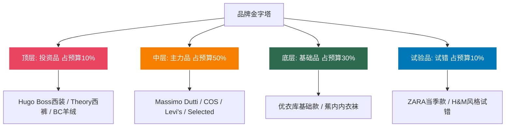
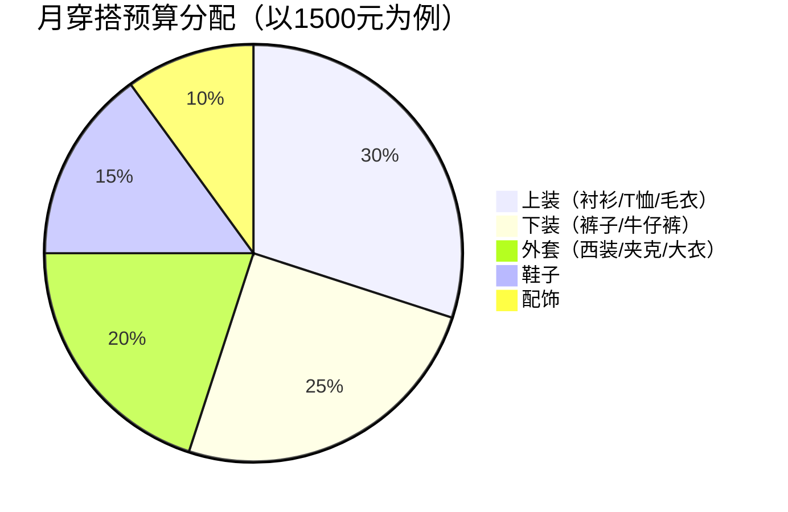
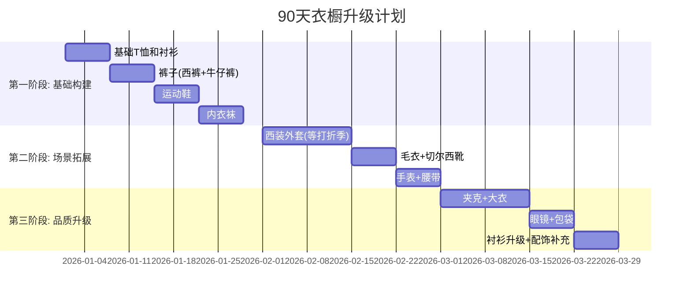
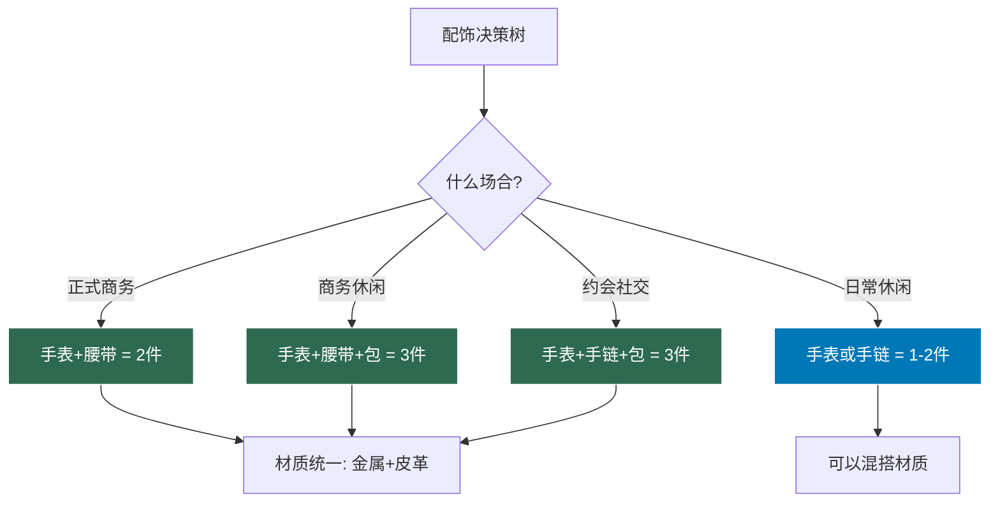

## 五、产品推荐小结：从认知到行动的完整路线图

前面四节分别从**单品选择、品牌体系、配饰搭配、购物策略**四个维度，构建了一套完整的男装产品推荐体系。本节不是简单的"要点回顾"，而是将四节内容整合成一套**可执行的行动框架**——帮你把零散的知识转化为实际的衣橱升级行动。

### 5.1 核心知识体系回顾

#### 四节内容的逻辑关系

```mermaid
graph TD
    A[产品推荐体系] --> B[第一章: 10件必备单品]
    A --> C[第二章: 品牌推荐]
    A --> D[第三章: 配饰推荐]
    A --> E[第四章: 购物策略]
    
    B --> B1[解决"买什么"的问题]
    C --> C1[解决"买哪个品牌"的问题]
    D --> D1[解决"如何用细节提升"的问题]
    E --> E1[解决"怎么买最划算"的问题]
    
    B1 --> F[完整的购物决策链]
    C1 --> F
    D1 --> F
    E1 --> F
    
    style A fill:#1a1a2e,stroke:#e94560,color:#fff
    style F fill:#e94560,stroke:#fff,color:#fff
```

四节内容构成了一个完整的购物决策链：先确定需要什么单品（第一章），再选择合适的品牌（第二章），然后用配饰画龙点睛（第三章），最后用科学的购物策略执行购买（第四章）。缺了任何一个环节，决策链就不完整。

#### 10件必备单品的核心逻辑

10件单品的选择不是随意的，而是基于三个筛选标准的系统性结果：

| 单品 | 核心功能 | 针对普通身高身材的关键作用 | 场景覆盖 |
|------|---------|---------------------|---------|
| 深蓝西装外套 | 衣橱骨架 | 修身剪裁提升上半身比例 | 商务、社交、约会 |
| 白色牛津纺衬衫 | 万能内搭 | 标准领型修饰方形脸 | 全场景通用 |
| 深色修身直筒裤 | 下半身核心 | 深色+中腰显高显腿长 | 全场景通用 |
| V领深色毛衣 | 秋冬主力 | V领拉长颈部、柔化脸型 | 秋冬全场景 |
| 深色修身牛仔裤 | 休闲底座 | 原色深蓝视觉收缩 | 日常、休闲 |
| 白色简洁运动鞋 | 百搭鞋款 | 低帮不断裂腿部线条 | 休闲、商务休闲 |
| 深色切尔西靴 | 显高利器 | 粗跟2-3cm自然增高 | 商务休闲、约会 |
| 短款深色夹克 | 比例优化器 | 短款提升视觉腰线 | 春秋全场景 |
| 深色中长款大衣 | 秋冬外层 | 修身版型不压身高 | 商务、正式场合 |
| 深色Polo衫/圆领T | 夏季基础 | 修身款型利落不拖沓 | 夏季日常、休闲 |

**核心原则**：这10件单品的共同特征是——深色为主、修身不紧身、设计简洁、百搭性强。深色在视觉上有收缩效果，修身剪裁能勾勒身材线条，简洁设计确保不同单品之间可以自由组合。10件单品理论上可以产生**上百种组合**，覆盖一年365天的所有场合。

#### 品牌体系的核心认知

品牌选择的本质不是"越贵越好"，而是建立一个**分层的品牌组合**：



**各层级的关键认知**：

- **底层（基础品）**：优衣库不是"穷人的选择"，而是高品质基础款的最佳供应商。它的亚洲版型对普通身高身材最友好，HEATTECH和轻薄羽绒是业界标杆产品。蕉内的无感标签内裤和抗菌袜子，用50-100元的价格解决了穿着体感的基础问题
- **中层（主力品）**：COS的北欧极简风格和肩线设计天然改善五五开比例；Massimo Dutti是28岁男性从"年轻人"过渡到"职场人"的最佳桥梁品牌；Levi's 511是普通身高身高的牛仔裤最优解
- **顶层（投资品）**：不是为了"炫富"，而是为了不可替代的品质。一件Suitsupply的半麻衬西装（3000-5000元），面料和做工可以媲美万元级别的传统品牌
- **试验品**：ZARA/H&M的最大价值是"风格试验田"——用100-200元试错，确认风格后再去中端品牌买高品质版本

#### 配饰的战略意义

配饰不是"锦上添花"，而是穿搭体系中不可或缺的战略组件：

| 配饰 | 核心功能 | 对普通身高身材的关键作用 | 投资优先级 |
|------|---------|---------------------|-----------|
| 手表 | 视觉锚点+身份信号 | 将视线引导到手腕，转移对身材比例的注意力 | ★★★★★ |
| 眼镜 | 面部框架重塑 | 椭圆/圆角矩形框柔化方形脸的棱角 | ★★★★★ |
| 腰带 | 比例调节器 | 窄腰带(2.5-3.5cm)弱化腰线切割感 | ★★★★☆ |
| 包袋 | 功能+品味载体 | 中等体量(15-20升)不压身高 | ★★★★☆ |
| 袜子 | 隐藏评分项 | 跟裤子颜色走，避免腿部色块断层 | ★★★☆☆ |
| 手链/围巾 | 风格信号 | 增加上半身视觉重量，优化头身比 | ★★★☆☆ |

**配饰的"少即是多"原则**：日常场景同时佩戴不超过3件配饰。1-3件是品味的甜蜜区，超过6件就进入了廉价浮夸的危险区。

### 5.2 购物策略的执行要点

#### 预算分配的科学方法

月穿搭预算1000-2000元的合理分配：



**预算分配的底层逻辑**：

- **上装占30%**：上装是视觉重心所在，也是最靠近面部的区域。一件好的衬衫或毛衣，对整体形象的提升效果远大于一条好裤子
- **下装占25%**：裤子的穿着频率最高（几乎每天），需要耐穿性。好裤子的单次穿着成本可以低至1-2元
- **外套占20%**：虽然件数少，但单价高、使用年限长。一件好的西装外套可以穿3-5年
- **鞋子占15%**：好鞋是长期投资。一双Clarks切尔西靴穿3-5年，单次成本不到3元
- **配饰占10%**：小投入大回报。一块1500元的Orient Bambino手表，可以让全身上下的质感提升一个档次

#### 购买时机的最优策略

| 购买时机 | 时间节点 | 折扣力度 | 适合购买的品类 | 注意事项 |
|---------|---------|---------|-------------|---------|
| 品牌打折季 | 每年1月、7月 | 5-7折 | COS、Massimo Dutti等中端品牌 | 先列清单再逛，避免冲动消费 |
| 电商大促 | 双11(11月)、618(6月) | 满减+券叠加 | 优衣库、蕉内等基础款 | 提前加购物车比价 |
| 反季购买 | 夏买冬装、冬买夏装 | 4-6折 | 大衣、羽绒服、夏装T恤 | 仅限基础款，不要反季买流行款 |
| 奥特莱斯 | 全年 | 5-7折 | Hugo Boss、Ralph Lauren | 了解品牌的奥莱策略，避免买到低品质线 |
| 海淘 | 黑五(11月)、年末 | 3-5折 | 国内定价偏高的欧美品牌 | 计算关税+运费后的实际成本 |

**关键原则**：永远不要因为"打折"而买不合身的衣服。折扣再大，不合身的衣服穿一次就压箱底，单次穿着成本反而更高。

#### 试穿与退换的实操清单

**线下试穿的5步检查法**：

1. **远看整体**：站在全身镜2米外，看整体轮廓是否干净利落
2. **近看细节**：检查肩线是否落在肩骨上、扣子位置是否在腰线以上、衣长是否合适
3. **动态测试**：抬手、坐下、弯腰、走路——衣服在动态中是否依然合身
4. **搭配测试**：穿着你打算搭配的裤子和鞋子去试穿，看整体效果
5. **对比测试**：同一品类至少试3个品牌的同类型产品，建立参照系

**线上购物的尺码管理**：

建立一份个人尺码表，记录你在不同品牌的实际穿着尺码：

| 品牌 | 上装尺码 | 下装尺码 | 鞋码 | 备注 |
|------|---------|---------|------|------|
| 优衣库 | S | 28-29 | 39 | 亚洲版型，尺码标准 |
| COS | S | 44 | 40 | 版型偏大，建议试穿 |
| Massimo Dutti | S/38 | 29 | 39-40 | 修身版型正常 |
| Levi's | - | 28×30 | - | 511版型，裤长需改 |
| ... | ... | ... | ... | ... |

这份表格需要持续更新——品牌每年的版型可能微调，你的体型也会变化。

### 5.3 从零开始的90天衣橱升级计划

#### 第一阶段：基础构建（第1-30天）

**目标**：用最低成本建立能覆盖日常场景的基础衣橱

| 优先级 | 单品 | 推荐品牌 | 预算 | 说明 |
|--------|------|---------|------|------|
| 1 | 白色牛津纺衬衫×2 | 优衣库 | 300-400元 | 日常轮换，防止单件过度损耗 |
| 2 | 深色修身直筒裤×1 | 优衣库/COS | 200-400元 | 炭灰色最百搭 |
| 3 | 深色修身牛仔裤×1 | Levi's 511 | 400-600元 | 深靛蓝色，原色款最佳 |
| 4 | V领T恤×3(黑/深灰/深蓝) | 优衣库U系列 | 240-450元 | 250g重磅棉，不易变形 |
| 5 | 白色运动鞋×1 | Adidas Stan Smith | 500-800元 | 皮面款，比帆布更耐穿 |
| 6 | 内衣袜套装 | 蕉内 | 200-400元 | 无感标签内裤+抗菌袜 |

**第一阶段总预算**：1840-3050元

**第一阶段完成后的衣橱状态**：可以覆盖日常通勤、朋友聚会、休闲购物等非正式场景。看起来干净整洁，但还缺少正式场合的应对能力。

#### 第二阶段：场景拓展（第31-60天）

**目标**：补充正式场合单品，开始建立配饰意识

| 优先级 | 单品 | 推荐品牌 | 预算 | 说明 |
|--------|------|---------|------|------|
| 1 | 深蓝西装外套×1 | Massimo Dutti/COS | 1000-2500元 | 打折季入手性价比最高 |
| 2 | V领深色毛衣×1 | COS美利奴 | 300-600元 | 秋冬叠穿核心 |
| 3 | 深色切尔西靴×1 | Clarks/Dr. Martens | 800-1500元 | 黑色小牛皮最百搭 |
| 4 | 手表×1 | Orient Bambino/Tissot PRX | 1500-4000元 | 自动机械，覆盖全场景 |
| 5 | 黑色针扣腰带×1 | Massimo Dutti | 300-500元 | 头层牛皮，配合西装使用 |
| 6 | 深棕板扣腰带×1 | 优衣库/海澜之家 | 100-300元 | 配合休闲裤和牛仔裤 |

**第二阶段总预算**：4000-9400元

**第二阶段完成后的衣橱状态**：可以覆盖商务会议、约会晚餐、婚礼宾客等正式场合。整体形象从"干净整洁"升级到"得体有品味"。

#### 第三阶段：品质升级（第61-90天）

**目标**：用高品质单品替换入门款，开始关注配饰细节

| 优先级 | 单品 | 推荐品牌 | 预算 | 说明 |
|--------|------|---------|------|------|
| 1 | 短款深色夹克×1 | Selected/COS | 600-1500元 | 哈灵顿夹克或教练夹克 |
| 2 | 深色中长款大衣×1 | COS/Massimo Dutti | 1500-3000元 | 驼色或深灰，打折季入手 |
| 3 | 眼镜/太阳镜×1 | JINS/Ray-Ban | 400-2000元 | 椭圆或圆角矩形框 |
| 4 | 公文包/双肩包×1 | Tumi/小米 | 300-2000元 | 黑色，简洁无Logo |
| 5 | 衬衫升级×1 | Massimo Dutti/Brooks Brothers | 400-1000元 | 高支棉面料，质感明显提升 |
| 6 | 配饰补充 | 无印良品/COS | 200-500元 | 围巾、手链等季节性配饰 |

**第三阶段总预算**：3400-10000元

**第三阶段完成后的衣橱状态**：拥有一个完整的、分层的胶囊衣橱。从日常休闲到正式商务，从春夏到秋冬，所有场景都有对应的穿搭方案。整体形象从"得体有品味"升级到"精致有风格"。

#### 90天计划总览



### 5.4 常见执行误区与纠正

#### 误区一：一步到位买齐所有单品

**错误做法**：一次性花大价钱买齐10件单品，甚至直接买高端品牌

**为什么是错的**：
- 你的审美在变化。90天后你对风格的理解会比今天深入得多，早期买的"高端货"可能不再符合你的审美
- 体型可能变化。如果你开始健身或调整饮食，体型变化会导致部分衣服不再合身
- 预算压力大。一步到位的总花费可能是分阶段购买的1.5-2倍（因为你会买很多"看起来需要"但实际不需要的东西）

**正确做法**：按照90天计划分阶段执行，每个阶段结束后给自己1-2周的"消化期"——穿着新衣橱生活，感受哪些单品真正高频使用，哪些被冷落。下一阶段的购买计划基于实际穿着体验调整。

#### 误区二：只看价格不看单次穿着成本

**错误做法**：觉得200元的衣服比800元的"便宜"

**真实计算**：

| 单品 | 购入价 | 预期穿着次数 | 单次成本 | 品质表现 |
|------|--------|------------|---------|---------|
| 快时尚西装外套 | 400元 | 30次(一季) | 13.3元/次 | 起球、变形 |
| COS西装外套 | 1500元 | 200次(3年) | 7.5元/次 | 挺括如新 |
| Massimo Dutti西装外套(打折) | 1200元 | 250次(3年) | 4.8元/次 | 版型稳定 |

**结论**：中端品牌的打折商品，单次穿着成本可能只有入门品牌的1/3。"便宜"不等于"划算"。

#### 误区三：忽视保养直接买新的

**错误做法**：衣服脏了、皱了、旧了就买新的

**保养的价值**：
- 一件定期保养的西装外套可以多穿2-3年
- 一双定期上油的皮鞋可以多穿3-5年
- 一块定期保养的手表可以多用10年以上

**最低保养清单**：

| 单品 | 保养频率 | 保养方法 | 成本 |
|------|---------|---------|------|
| 西装外套 | 每次穿后 | 马毛刷除尘+宽肩衣架悬挂 | 0元 |
| 白衬衫 | 每次穿后 | 40°C以下水洗+挂起晾干 | 0元 |
| 皮鞋/靴子 | 每穿5-8次 | 鞋油打圈涂抹+抛光 | 10元/次 |
| 毛衣 | 每穿4-5次 | 冷水手洗+平铺晾干 | 0元 |
| 手表 | 每月 | 软毛刷+温肥皂水清洗表带 | 0元 |
| 牛仔裤 | 每穿10-15次 | 冷水翻面手洗+阴干 | 0元 |

保养的总成本几乎为零，但它能让你的衣橱使用寿命延长2-3倍——这相当于帮你省下了几千甚至上万元的重购费用。

#### 误区四：跟风买"网红款"

**错误做法**：看到社交媒体上的穿搭博主推荐就下单

**为什么是错的**：
- 穿搭博主的身材条件与你不同。他们可能是180cm、偏瘦身材，同款衣服穿在普通身高、五五开身材上效果完全不同
- 穿搭博主有商业推广利益。很多"推荐"是付费合作，不是真实评价
- 网红款通常追求视觉冲击力，不适合日常穿着

**正确做法**：以本书推荐的10件必备单品为骨架，根据自己的实际穿着场景填充细节。如果你确实想尝试某个网红款，先在ZARA/H&M买一件平价版试穿，确认适合自己后再去中端品牌买高品质版本。

#### 误区五：配饰要么不戴，要么戴太多

**错误做法**：要么完全不戴配饰（"男人不需要这些"），要么手表+手链+项链+戒指+帽子全上

**正确的配饰策略**：



### 5.5 进阶：建立个人风格的三个阶段

基础衣橱建立之后，你的穿搭之旅才刚刚开始。从"穿得对"到"穿得有自己的风格"，需要经历三个阶段：

#### 阶段一：模仿期（0-6个月）

**特征**：严格遵循本书的推荐，按规则穿衣

**方法**：
- 从本书推荐的10件单品和品牌组合开始
- 每天出门前对着全身镜检查：比例是否协调、颜色是否统一、场合是否得体
- 记录每天的穿搭（拍照），每周回顾哪些搭配效果好、哪些不好

**目标**：建立"穿得对"的基本功——确保在任何场合都不会"穿错"

#### 阶段二：理解期（6-18个月）

**特征**：开始理解"为什么这样穿好看"，而不仅仅是"书上说这样穿"

**方法**：
- 学习色彩理论（本书基础理论部分），理解为什么深蓝配灰色好看而红配绿不好看
- 研究不同风格体系（英式、意式、日式、美式），找到最吸引自己的方向
- 开始尝试微调：把标准领衬衫换成温莎领、把纯色毛衣换成条纹、把黑色腰带换成编织款

**目标**：理解穿搭背后的视觉原理，能独立判断"好看"和"不好看"

#### 阶段三：表达期（18个月以后）

**特征**：穿衣成为个人表达的载体，形成可辨识的个人风格

**方法**：
- 确定自己的风格关键词（如"都市极简"、"商务休闲"、"日系质感"）
- 在基础单品上增加个人标志性元素（如特定品牌的手表、特定材质的包、特定颜色的围巾）
- 学会"打破规则"——在深刻理解规则的基础上，有意打破某些规则来表达个性

**目标**：别人看到你的穿搭就能感受到你的审美态度和生活状态

### 5.6 本节核心要点速查

将四节内容提炼为**10条黄金法则**，可以在购物决策时快速参考：

| 编号 | 法则 | 详细说明 |
|------|------|---------|
| 1 | **先买基础款** | 白衬衫、深色裤子、白色运动鞋、深色外套——这4件能覆盖80%的日常场景 |
| 2 | **合身度 > 品牌** | 一件合身的优衣库比一件不合身的Hugo Boss好看10倍。必要时花钱请裁缝修改 |
| 3 | **深色为主** | 深蓝、炭灰、黑色是普通身高身材的最优色彩——视觉收缩、百搭、不挑场合 |
| 4 | **修身不紧身** | 扣上扣子后胸前能插入一个拳头。紧身暴露短板，宽松显邋遢，修身才是正解 |
| 5 | **单次穿着成本思维** | 购入价 ÷ 预期穿着次数 < 2元/次 = 高性价比。中端打折 > 入门原价 |
| 6 | **配饰不超过3件** | 手表+腰带+包是正式场合的安全组合。多了显浮夸，少了显朴素 |
| 7 | **腰带颜色跟鞋走** | 黑鞋配黑带，棕鞋配棕带。这是男装搭配中最基础也最不可违反的规则 |
| 8 | **建立尺码表** | 记录自己在每个品牌的实际穿着尺码，避免线上购物的退换成本 |
| 9 | **等打折季买大件** | 西装外套、大衣、皮鞋等单价高的单品，在1月/7月打折季入手，省30-50% |
| 10 | **保养 > 重购** | 定期保养的单品寿命延长2-3倍，相当于帮你省下几千元重购费用 |

> **记住**：衣橱建设不是一次性购物，而是一个持续迭代优化的过程。从10件基础单品出发，随着审美提升和预算增长，逐步升级、逐步完善。每一件单品都应该经过思考——它为什么出现在你的衣橱里，它能与哪些单品搭配，它能在哪些场合穿。当你的衣橱中每一件单品都有明确的存在理由时，你就再也不用在出门前纠结"今天穿什么"了。
