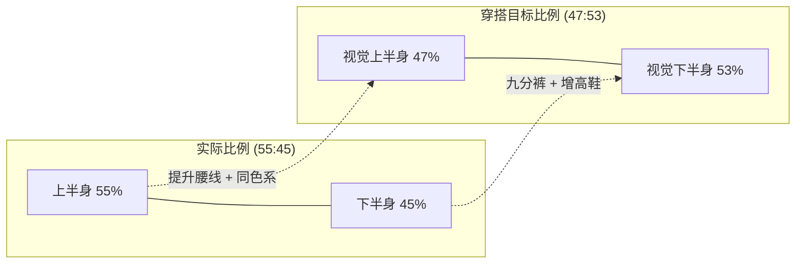
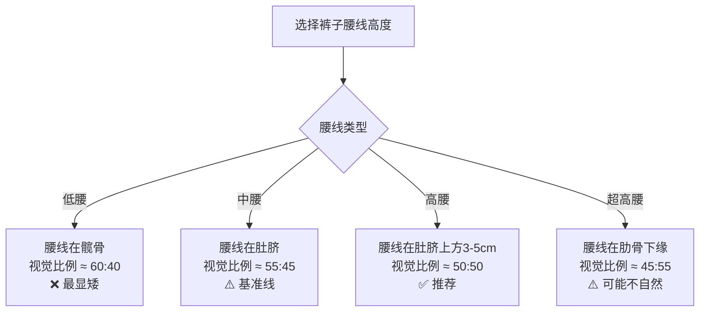

## 一、显高穿搭方案

### 1.1 显高的底层原理

#### 1.1.1 为什么视觉能"欺骗"身高判断

人类对身高的判断并非基于精确测量，而是依赖大脑的视觉推断系统。心理学研究表明，观察者对一个人身高的感知，70%来自**纵向比例**而非绝对数值。这意味着：一个普通身高但纵向比例协调的人，在视觉上可以比一个170cm但比例被破坏的人显得更高。

大脑判断身高时依赖三个核心线索：

| 视觉线索 | 作用机制 | 对普通身高身高的意义 |
|---------|---------|-----------------|
| 头身比 | 头部越小，身体看起来越长 | 避免让头部视觉变大（大帽檐、蓬松发型） |
| 腿身比 | 腿部占身体比例越高，看起来越高 | 提升视觉腰线是最高优先级 |
| 纵向连续性 | 身体被水平线切割越少，看起来越修长 | 减少颜色/材质/比例的水平切割 |

#### 1.1.2 普通身高身材的黄金比例分析

中国成年男性平均身高约169.7cm（2020年《中国居民营养与慢性病状况报告》），普通身高处于第25-30百分位。但身高的视觉效果取决于**比例**，而非数字。

**你的关键比例数据**：

- **实际头身比**：普通身高身高，头部约22-23cm，头身比约7.2:1（理想值为7.5-8:1）
- **实际腿身比**：55开身材（上下半身等长），理想值为45:55（腿占55%）
- **改善目标**：通过穿搭将视觉比例调整到接近46:54或47:53

这个8个百分点的比例调整，完全可以通过穿搭技巧实现——相当于视觉上"增高"约13cm的效果感知。

#### 1.1.3 显高的三大视觉机制

**机制一：纵向延伸（Vertical Elongation）**

让眼睛沿纵向方向移动，而不是被横向线条截断。实现方式包括：同色系穿搭、竖条纹、V领设计。这就像把一根短木棍竖起来放——它看起来比横放时长得多。

**机制二：腰线重置（Waistline Reset）**

55开身材的最大问题是腰线位置偏低。将视觉腰线上移3-5cm，就能让腿身比从55:45变成接近50:50甚至更优。这是单一效果最大的显高技巧。

**机制三：视觉压缩上半身（Upper Body Compression）**

通过缩短上半身的视觉长度来增加腿的相对比例。具体手段包括：短款外套、将上衣塞入裤中、避免低腰设计。

### 1.2 同色系穿搭——最高效的显高基础

#### 1.2.1 原理详解

当上下装颜色接近时，身体不会被颜色分割，视觉上形成一个完整的纵向线条。这不是玄学，而是基于格式塔心理学的**连续性法则**（Law of Continuity）——大脑倾向于将连续的、不被截断的线条感知为一个整体。

**色差与显高效果的关系**：

| 上下装色差程度 | 显高效果 | 适用场景 |
|--------------|---------|---------|
| 完全同色（全黑） | ★★★★★ | 最佳显高，但可能单调 |
| 同色系深浅差（深蓝+浅蓝） | ★★★★☆ | 兼顾层次感和显高 |
| 相邻色系（深蓝+深灰） | ★★★☆☆ | 可接受范围 |
| 对比色（白T+黑裤） | ★★☆☆☆ | 明显切割，显矮 |

#### 1.2.2 五套经典同色系方案

**方案一：全黑体系（显高指数 ★★★★★）**

全黑是最强显高方案，但执行不好会显得沉闷。关键在于**用材质差异制造层次**：

- 上装：黑色修身圆领/V领T恤（棉质或混纺）
- 下装：黑色修身直筒裤（牛仔或休闲西裤面料）
- 鞋子：黑色运动鞋或切尔西靴（厚底2-3cm）
- 层次感来源：T恤的棉质感 vs 裤子的牛仔质感 vs 鞋面的皮质/网面质感

**为什么全黑如此有效**：黑色对光线的吸收率高达95%以上，当全身黑色时，身体轮廓的边界变得模糊，纵向线条得到最大程度的延伸。这就是为什么正装摄影中，摄影师常建议矮个子穿全黑。

**方案二：深蓝体系（显高指数 ★★★★☆）**

深蓝比黑色更日常，适合通勤和休闲场景：

- 上装：深蓝V领针织衫或Polo衫
- 下装：深蓝修身牛仔裤（颜色接近上装）
- 鞋子：深蓝或黑色运动鞋
- 腰带：深蓝或黑色（与裤子同色）

**方案三：灰色渐变体系（显高指数 ★★★★☆）**

灰色系的妙处在于可以在同色系内做深浅过渡，既显高又有层次：

- 上装：浅灰色V领毛衣
- 下装：中灰色修身直筒裤
- 鞋子：深灰色运动鞋或靴子
- 原则：上浅下深，避免上深下浅（头重脚轻）

**方案四：卡其/棕体系（显高指数 ★★★☆☆）**

适合秋冬季节，温暖又有质感：

- 上装：浅卡其色休闲衬衫
- 下装：深卡其色/棕色休闲裤
- 鞋子：棕色切尔西靴
- 腰带：棕色皮带（与鞋子同色系）

**方案五：军绿体系（显高指数 ★★★☆☆）**

适合休闲户外场景：

- 上装：军绿色工装夹克（短款）
- 内搭：深灰色T恤
- 下装：深军绿色修身工装裤
- 鞋子：黑色或军绿色工装靴

#### 1.2.3 同色系穿搭的常见错误

**错误一：颜色完全一致但材质也一致**

全身同材质同色（比如全身棉质黑）会像穿了制服。正确做法是用不同材质制造微妙的层次差异。

**错误二：忽略鞋子的颜色衔接**

上衣和裤子同色，但鞋子颜色跳脱（比如全黑穿搭配白色运动鞋），会在脚部形成一个明显的视觉截断点，破坏纵向线条。如果必须穿浅色鞋，确保裤子与鞋子之间有颜色过渡。

**错误三：配饰颜色突兀**

一条亮色腰带、一个亮色背包，都可能成为视觉焦点，将注意力吸引到身体中部，破坏纵向延伸。配饰颜色应融入整体色系。

### 1.3 腰线重置——单一效果最大的显高技巧

#### 1.3.1 腰线对身高的定量影响

腰线每提升1cm，视觉腿长增加约1cm，视觉身高增加约0.5cm。对于55开身材，将腰线从自然位置提升5cm，可以将视觉比例从55:45改善到约50:50，这相当于视觉"增高"约4-5cm。

#### 1.3.2 提升腰线的五种实操方法

**方法一：上衣前塞（French Tuck）**

将上衣前摆塞入裤中，后摆自然垂下。这是最自然、最易执行的提升腰线方法。

- 适用上衣：衬衫、T恤、Polo衫、针织衫
- 操作要点：只塞前面约1/3到1/2的衣摆，后面自然垂下
- 效果：视觉腰线上移3-5cm，同时保持休闲自然感
- 注意：塞入后要轻轻拉出一点，制造微微的蓬松感，避免像军人扎腰带那样紧绷

**方法二：全塞法**

将上衣全部塞入裤中，适合正式或半正式场合。

- 适用上衣：衬衫、薄款针织衫
- 操作要点：塞入后从两侧均匀拉出少许，避免褶皱堆积
- 效果：最干净的腰线位置，适合搭配腰带
- 注意：如果腹部有赘肉，全塞可能暴露问题，此时改用前塞法

**方法三：选择高腰/中腰裤**

裤腰高度直接决定了腰线的物理位置。

- 中腰裤：腰线在肚脐附近，适合大多数场景
- 高腰裤：腰线在肚脐上方3-5cm，显高效果最佳
- 绝对避免：低腰裤（腰线在髋骨），这会让你的腿看起来极短
- 购买建议：试穿时确认腰线位置在肚脐或以上

**方法四：短款外套**

外套长度是影响腰线的关键因素。

- 最佳长度：外套下摆在腰部到臀部之间（约到腰带位置）
- 可接受长度：到臀部中部
- 应避免长度：过臀到大腿中部（会将身体切成两半，显矮显胖）
- 具体单品：短款夹克、飞行员夹克、短款羽绒服、西装外套（正常版型）

**方法五：腰带策略**

腰带可以强化腰线位置，但用错反而适得其反。

- 颜色：与裤子同色或相近色，避免高对比度腰带（如黑裤配白腰带）
- 宽度：3-3.5cm为最佳，太宽会增加腰部视觉面积，太窄没有存在感
- 材质：皮质腰带最百搭，帆布腰带适合休闲
- 扣头：简约款，避免过大的金属扣头（会成为视觉焦点）

### 1.4 领口设计——被低估的显高细节

#### 1.4.1 V领的视觉延伸原理

V领形成的三角形区域在视觉上延长了颈部线条，使上半身看起来更修长。对于头身比不够理想（头部偏大）的人来说，V领还能在视觉上缩小头部比例。

**V领深度与效果**：

| V领类型 | 开口深度 | 显高效果 | 适用场景 |
|--------|---------|---------|---------|
| 浅V领 | 锁骨下方2-3cm | ★★★☆☆ | 日常休闲 |
| 标准V领 | 锁骨下方5-7cm | ★★★★☆ | 通勤、约会 |
| 深V领 | 锁骨下方10cm+ | ★★★★★ | 过于暴露，不推荐 |
| 小V领/鸡心领 | 锁骨下方1-2cm | ★★★☆☆ | T恤、Polo衫 |

#### 1.4.2 不同领型的显高效果对比

- **V领/开领**：★★★★★——最强显高领型，纵向延伸效果最佳
- **衬衫领（解扣1-2颗）**：★★★★☆——自然形成V形，适合正式场合
- **Polo领**：★★★☆☆——小V形开口，比圆领好但不如大V领
- **圆领**：★★☆☆☆——缺乏纵向延伸，但不会显矮
- **高领/半高领**：★★☆☆☆——缩短颈部线条，显矮
- **立领/中式领**：★★★☆☆——有一定纵向感，但面积太大可能显头大

#### 1.4.3 执行方案

- 将衣橱中的圆领T恤逐步替换为V领或小V领款式
- 秋冬季节的毛衣首选V领，内搭衬衫露出V形区域
- 衬衫日常解开最上面1-2颗扣子，形成自然V形
- 冬季高领毛衣如果必须穿，外面搭一件V领开衫或西装外套来补偿

### 1.5 竖条纹与图案选择

#### 1.5.1 竖条纹的科学依据

竖条纹能产生**亥姆霍兹错觉**（Helmholtz Illusion）：被竖条纹覆盖的物体看起来比被横条纹覆盖的更窄更高。1867年德国物理学家亥姆霍兹首次记录了这一视觉现象。

**条纹参数与效果**：

| 参数 | 显高显瘦 | 显矮显胖 | 说明 |
|------|---------|---------|------|
| 条纹方向 | 竖条纹 | 横条纹 | 竖条引导纵向视线 |
| 条纹宽度 | 细条纹（<1cm） | 宽条纹（>3cm） | 细条纹更精致显瘦 |
| 条纹间距 | 密集 | 稀疏 | 密集条纹视觉效果更强 |
| 底色 | 深色 | 浅色 | 深底色收缩效果更好 |

#### 1.5.2 最佳条纹单品推荐

**细条纹衬衫**：深蓝底白色细条纹是最经典的显高商务衬衫，条纹间距控制在0.5-0.8cm。搭配深色西裤和皮鞋，正式又显高。

**条纹针织衫**：深色底细条纹V领针织衫，同时叠加V领和竖条纹两个显高元素，效果加倍。

**避免的条纹**：
- 宽条纹（间距>3cm）——不仅不显高，还可能显胖
- 横条纹——虽然不一定会显胖（取决于条纹宽度和身体曲线），但对显高没有帮助
- 彩色条纹——过于花哨会吸引视线停留在上半身，不利于纵向延伸

#### 1.5.3 非条纹图案的显高选择

如果不喜欢条纹，以下图案也有不错的显高效果：

- **纯色**：最安全的选择，尤其是深色纯色
- **细格纹**：远看接近纯色，近看有细节，不会破坏纵向线条
- **小型图案**：小碎花、小圆点等，图案越小越不会切割身体
- **应避免**：大面积色块拼接、横条纹、大面积图案（会增加视觉体积感）

### 1.6 鞋子的显高策略——被忽视的"隐形高度"

#### 1.6.1 鞋子对身高的三层贡献

鞋子对身高的提升不仅仅是物理增高，还包括视觉延伸效果：

| 增高层级 | 方式 | 增高幅度 | 可见性 |
|---------|------|---------|--------|
| 物理增高 | 内增高鞋垫 | 2-5cm | 完全隐藏 |
| 物理增高 | 厚底鞋/靴子 | 1-3cm | 外观可见但自然 |
| 视觉延伸 | 鞋裤同色 | 0cm（纯视觉） | 无形 |
| 视觉延伸 | 尖头设计 | 0cm（纯视觉） | 无形 |

将以上方式叠加使用，鞋子可以贡献3-8cm的视觉增高效果。

#### 1.6.2 内增高鞋垫完全指南

**选择标准**：
- 高度：2-3cm是最安全的区间，穿着舒适且不被察觉
- 材质：记忆棉或乳胶，有缓冲减震功能
- 透气性：选择有透气孔或透气面料的款式
- 鞋码适配：选择比鞋码大半码的鞋来容纳增高垫

**穿着注意事项**：
- 第一次穿增高鞋垫时，先在家中短时间适应，逐步增加穿着时长
- 2-3cm的增高垫通常不需要买大鞋码，但4cm以上建议买大半码到一码
- 长时间行走时，增高垫可能导致前脚掌压力增大，选择带前掌缓冲的款式
- 增高鞋垫会改变鞋子的包裹感，系鞋带时稍微松一点

**推荐搭配**：
- 运动鞋/跑鞋：选择鞋舌较长的款式，能完全遮盖增高垫带来的脚背抬高
- 皮鞋/乐福鞋：选择深口款，增高垫不会导致脚背露出
- 靴子：靴筒本身有高度，搭配增高垫效果最好

#### 1.6.3 厚底鞋的选择策略

厚底鞋是外增高最自然的方式，关键在于选择"看不出是厚底"的款式：

**推荐款式**：
- 切尔西靴：靴底2-3cm，靴跟1-2cm，总增高3-5cm，外观自然
- 马丁靴/工装靴：鞋底本身就有3-4cm厚度，风格硬朗
- 厚底运动鞋：New Balance 574、Nike Air Force 1等经典厚底款
- 厚底乐福鞋：近年流行的厚底乐福鞋，增高2-3cm且时尚

**应避免的款式**：
- 松糕鞋/超厚底鞋：底厚超过5cm会显得笨重不自然
- 坡跟鞋：男性穿坡跟鞋容易显得刻意
- 底部颜色与鞋面对比强烈的厚底：会暴露厚底设计

#### 1.6.4 鞋裤同色的视觉魔法

当鞋子和裤子颜色接近时，腿部线条会自然延伸到脚尖，视觉上增加3-5cm的腿长感。这是最被低估的显高技巧之一。

**最佳组合**：
- 黑裤 + 黑鞋：最强组合，视觉延伸效果最佳
- 深蓝裤 + 深蓝/黑色鞋：日常最佳组合
- 灰裤 + 灰/黑色鞋：通勤推荐
- 卡其裤 + 棕色鞋：休闲推荐

**应避免的组合**：
- 黑裤 + 白鞋：脚部形成明显的视觉截断点
- 深色裤 + 浅色鞋：同样的问题，将腿部切成两段

### 1.7 裤子选择——显高的关键战场

#### 1.7.1 裤型对身高的影响

裤型直接决定了下半身的视觉形状，是显高穿搭中最重要的单品之一。

| 裤型 | 显高效果 | 原因分析 | 推荐度 |
|------|---------|---------|--------|
| 修身直筒裤 | ★★★★★ | 直线条纵向延伸，不紧不松 | 最推荐 |
| 锥形裤（上宽下窄） | ★★★★☆ | 脚踝处收窄，显腿细长 | 推荐 |
| 九分裤 | ★★★★★ | 露出脚踝，视觉上腿更长 | 最推荐 |
| 阔腿裤 | ★★☆☆☆ | 增加下半身体积，显矮显胖 | 不推荐 |
| 低腰裤 | ★☆☆☆☆ | 压低腰线，腿看起来极短 | 禁止 |
| 紧身裤 | ★★★☆☆ | 显腿型但可能暴露腿部缺陷 | 谨慎 |

#### 1.7.2 裤长的精确控制

裤长是很多人忽略的细节，但对显高效果影响巨大：

- **最佳裤长**：裤脚刚好到鞋面，或露出1-2cm脚踝
- **九分裤**：裤脚在脚踝骨上方3-5cm，搭配低帮鞋效果最佳
- **绝对避免**：裤脚堆积在鞋面上——这不仅显得邋遢，还会在视觉上缩短腿部长度

**裤长调整建议**：
- 购买裤子后，到裁缝店精确调整裤长（费用通常10-30元）
- 准备两种裤长：全长裤（到鞋面）和九分裤（到脚踝），覆盖不同季节
- 牛仔裤可以卷边（卷1-2折），制造九分裤效果

#### 1.7.3 裤子颜色的选择

裤子颜色直接影响下半身的视觉重量：

- **深色裤子**（黑、深蓝、深灰）：收缩效果好，显腿细长，显高效果最佳
- **中性色裤子**（中灰、卡其、军绿）：效果中等，适合日常搭配
- **浅色裤子**（白、浅灰、浅卡其）：视觉膨胀，会让下半身显得更宽更重

**你的最佳选择**：以深色裤子为主力（占裤子总量的70%以上），中性色作为辅助，浅色裤子仅在夏季偶尔使用。

### 1.8 配饰与细节——最后一公里的显高优化

#### 1.8.1 发型与身高的关系

发型虽然不属于穿搭，但对整体身高视觉有显著影响：

- **增加头顶高度**：适度的蓬松发型（如纹理烫、锡纸烫）可以在头顶增加2-3cm的视觉高度
- **避免两侧蓬松**：两侧蓬松的发型会增加头部的视觉宽度，破坏头身比
- **推荐发型**：两侧推短、顶部留长并向上或向后梳的发型（如侧分、背头、飞机头）
- **避免发型**：蘑菇头、中分长发、两侧蓬松的卷发

#### 1.8.2 帽子的显高技巧

帽子是直接增加头顶高度的工具：

- **棒球帽**：帽顶有一定的高度，可以增加1-2cm视觉身高
- **渔夫帽**：帽檐向下，会在视觉上缩短脸部宽度，但帽顶高度有限
- **针织帽/冷帽**：冬季最佳选择，帽顶可以增加2-3cm高度
- **避免**：宽檐帽、大礼帽——帽檐宽度超过肩宽会显得人更矮

#### 1.8.3 包袋的选择

包袋的大小和携带方式也会影响身高视觉：

- **最佳选择**：小号双肩包或斜挎包，紧贴身体
- **避免**：过大的双肩包、手提旅行包——大会增加身体的视觉体积
- **携带位置**：斜挎包的包体放在腰部以上，避免放在臀部位置（会拉低视觉重心）

#### 1.8.4 手表与手链

手腕配饰对显高影响较小，但细节决定品质：

- **手表**：表盘直径38-42mm最佳，过大会显得手腕细小
- **手链**：简约款，不超过一条，避免过于花哨吸引视线到手腕

### 1.9 场景化完整搭配方案

#### 1.9.1 春季搭配方案

**方案A：日常通勤（春季版）**
- 浅灰色V领毛衣（前摆塞入裤中）
- 深蓝色修身直筒裤（裤长到鞋面）
- 深棕色皮带（3cm宽，简约扣头）
- 深棕色切尔西靴（2cm内增高）
- 总视觉增高效果：约5-7cm

**方案B：商务正式（春季版）**
- 白色衬衫（全塞，解开第一颗扣子）
- 深蓝色细条纹西装外套（正常版型，不过臀）
- 炭灰色九分西裤
- 黑色尖头皮鞋（2cm内增高）
- 黑色皮带（与鞋同色）
- 总视觉增高效果：约6-8cm

#### 1.9.2 夏季搭配方案

**方案C：周末休闲（夏季版）**
- 黑色V领T恤（前半塞）
- 黑色修身九分牛仔裤
- 黑色厚底运动鞋（增高3cm）
- 简约银色项链
- 总视觉增高效果：约6-8cm

**方案D：约会穿搭（夏季版）**
- 深蓝色Polo衫（前半塞）
- 卡其色修身直筒裤
- 棕色乐福鞋（2cm内增高）
- 棕色皮带
- 总视觉增高效果：约4-6cm

#### 1.9.3 秋季搭配方案

**方案E：层次叠穿（秋季版）**
- 白色衬衫（全塞，解开两颗扣子）
- 深灰色V领针织背心
- 黑色修身直筒裤
- 黑色切尔西靴（3cm增高）
- 总视觉增高效果：约6-8cm

**方案F：休闲出街（秋季版）**
- 黑色长袖T恤（前半塞）
- 军绿色短款工装夹克（到腰部）
- 深蓝色修身牛仔裤
- 黑色厚底运动鞋
- 总视觉增高效果：约5-7cm

#### 1.9.4 冬季搭配方案

**方案G：保暖显高（冬季版）**
- 黑色高领打底衫
- 深蓝色短款羽绒服（到腰部）
- 黑色修身直筒裤
- 黑色切尔西靴（3cm增高）
- 深灰色针织帽（增加头顶2cm）
- 总视觉增高效果：约8-10cm

**方案H：商务冬装（冬季版）**
- 白色衬衫
- 深灰色V领毛衣
- 黑色短款呢子大衣（不过臀）
- 炭灰色修身西裤
- 黑色尖头皮鞋（2cm内增高）
- 总视觉增高效果：约6-8cm

### 1.10 显高穿搭的常见误区与纠正

#### 误区一："增高鞋垫越高越好"

**错误认知**：增高垫放得越高，效果越好。
**事实**：超过4cm的增高垫会导致走路姿态不自然，脚踝外露暴露增高痕迹，长时间穿着脚部疼痛。2-3cm是安全上限，加上厚底鞋的2-3cm，总物理增高4-6cm已经足够。

#### 误区二："穿宽松衣服能遮盖身材缺点"

**错误认知**：身材不高，穿宽松衣服可以遮盖。
**事实**：宽松衣服会增加身体的视觉体积，让人看起来更矮更胖。正确的做法是穿**合身但不紧身**的衣服——贴合身体轮廓但不勒出线条。

#### 误区三："只有深色才能显高"

**错误认知**：显高只能穿黑色或深色。
**事实**：深色确实有收缩效果，但浅色同色系（如全身浅灰、全身米白）同样可以显高。关键在于**上下装颜色接近**，而非必须深色。只不过深色在显高的同时还有显瘦效果，所以综合评分更高。

#### 误区四："帽子/发型对身高没影响"

**错误认知**：穿搭只看衣服裤子鞋子。
**事实**：头部占身体比例约1/7.5，发型的高度和宽度直接影响头身比。一个增加3cm头顶高度的发型，等效于物理增高3cm，而且完全自然。

#### 误区五："横条纹一定显矮显胖"

**错误认知**：任何横条纹都会显矮显胖。
**事实**：细横条纹（间距<1cm）的效果接近纯色，不会明显显胖。但粗横条纹确实会增加视觉宽度。对显高来说，竖条纹始终优于横条纹，但不必完全排斥细横条纹。

### 1.11 显高效果自检清单

每次出门前，用这个清单快速检查：

- [ ] 上下装颜色是否接近？（色差越小越显高）
- [ ] 腰线位置是否在肚脐或以上？（检查上衣是否塞好）
- [ ] 裤脚是否干净利落？（无堆积、无拖地）
- [ ] 鞋子颜色是否与裤子衔接？（无明显色差截断）
- [ ] 领口是否有纵向延伸？（V领或开领优于圆领）
- [ ] 整体是否有过多水平切割线？（腰带、包带、外套下摆等）
- [ ] 头部比例是否协调？（发型不过宽、帽子不超肩宽）

### 1.12 购物清单——显高衣橱基础配置

以下是建立显高衣橱的优先购买顺序：

**第一批（最高优先级，预算约800-1200元）**：
1. 深色修身直筒裤 ×2（黑色、深蓝各一）
2. V领T恤 ×3（黑色、深灰、白色各一）
3. 2-3cm内增高鞋垫 ×2
4. 黑色厚底运动鞋 ×1

**第二批（次高优先级，预算约600-1000元）**：
1. 深色九分西裤 ×1
2. V领毛衣/针织衫 ×2（灰色、深蓝各一）
3. 黑色切尔西靴 ×1
4. 简约皮带 ×2（黑色、棕色各一）

**第三批（完善衣橱，预算约800-1500元）**：
1. 深蓝细条纹衬衫 ×1
2. 短款夹克/外套 ×1
3. 简约手表 ×1
4. 针织帽（冬季）×1
