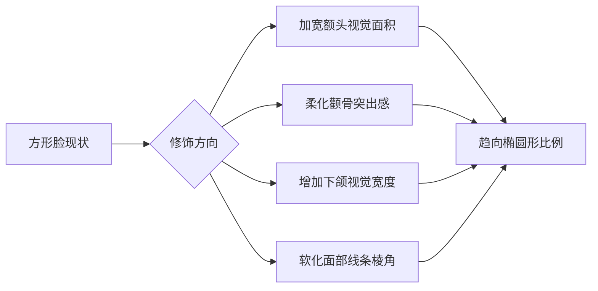
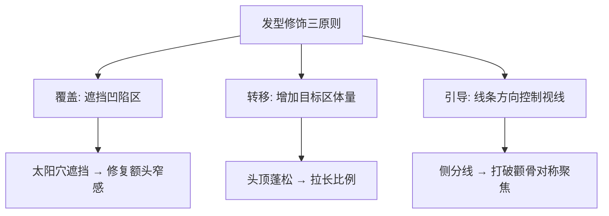
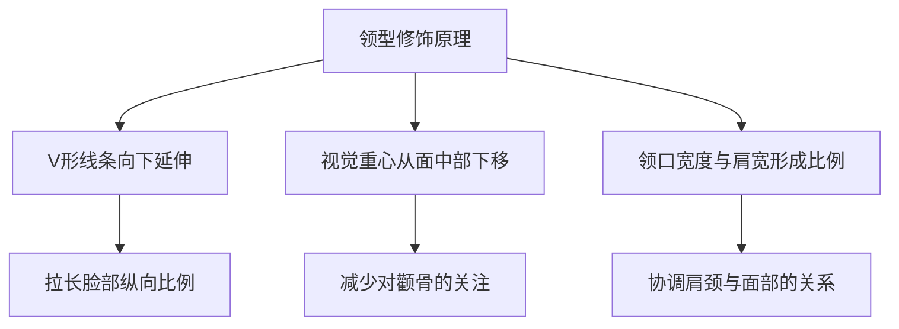

## 二、修饰脸型方案

脸型是所有穿搭决策的起点。发型、领型、配饰的选择都围绕一个核心目标——调整面部视觉比例，让整体轮廓趋向理想的椭圆形。本节以方形脸（菱形脸/钻石脸）为例，从视觉原理出发，给出一套完整的修饰方案。

### 2.1 方形脸的面部特征分析

#### 2.1.1 骨骼结构特点

方形脸的核心特征是**颧骨为面部最宽点**，额头和下颌相对收窄，整体呈菱形轮廓。具体表现为：

| 特征维度 | 方形脸表现 | 与理想椭圆脸的差异 |
|---------|------------|------------------|
| 额头宽度 | 较窄，太阳穴凹陷 | 比理想值窄15-25% |
| 颧骨宽度 | 最宽，明显突出 | 比理想值宽10-20% |
| 下颌宽度 | 窄，线条收拢 | 比理想值窄10-20% |
| 下巴形态 | 尖或V形 | 比理想值更尖锐 |
| 脸部长度 | 中等偏长 | 接近理想值 |
| 线条感 | 棱角分明，转折明显 | 比理想的柔和曲线更硬朗 |

#### 2.1.2 方形脸的视觉感知

从视觉心理学角度看，人眼在观察面部时遵循**重心法则**——视线会自然聚焦于面部最宽的区域。方形脸的颧骨最宽，导致视线停留在面中部，产生以下视觉效果：

- **横向膨胀感**：颧骨的突出让脸看起来比实际更宽
- **棱角攻击性**：尖锐的下巴和突出的颧骨组合，给人偏冷、偏硬的印象
- **比例失衡感**：上窄下窄中间宽的结构，打破了视觉平衡

#### 2.1.3 修饰的总体目标

核心原则：**上宽下宽、中间收**——通过发型和配饰加宽额头和下颌区域的视觉体量，同时弱化颧骨的横向存在感。

### 2.2 发型方案

发型是修饰脸型最直接、最有效的手段，因为它直接改变头部轮廓线。

#### 2.2.1 修饰原理

发型修饰脸型的底层逻辑是**轮廓线覆盖与体量转移**：

1. **覆盖**：用头发遮挡需要隐藏的区域（如凹陷的太阳穴）
2. **转移**：在需要增加体量的区域制造蓬松感（如头顶、两侧上方）
3. **引导**：用线条方向引导视线移动（如侧分线打破对称）

#### 2.2.2 推荐发型详解

**发型一：纹理短发（Textured Crop）**

这是方形脸的首选发型，修饰效果最佳。

| 维度 | 具体参数 |
|------|---------|
| 顶部长度 | 5-8cm，需要足够长度制造纹理 |
| 两侧长度 | 渐变推短，从上到下0.5-2mm |
| 后部 | 跟随两侧渐变，干净收拢 |
| 刘海 | 可前推、可侧分，根据额头宽度调整 |
| 打理难度 | ★★☆☆☆，日常吹干即可 |
| 适合度 | ★★★★★ |

修饰原理详解：
- 顶部蓬松的纹理感在视觉上**增加头部上方的体量**，让额头区域看起来更宽
- 两侧渐变推短**不增加颧骨区域的横向宽度**，避免加重菱形感
- 纹理的不规则线条**柔化面部棱角**，让整体轮廓更柔和
- 顶部的高度**拉长脸部纵向比例**，削弱颧骨的横向主导感

打理步骤：
1. 洗发后用毛巾吸干水分（不要搓揉，会破坏纹理方向）
2. 用吹风机从发根向上吹，同时用手指抓起发丝制造蓬松度
3. 吹至八成干时，取黄豆大小的发蜡/发泥，在掌心搓开
4. 从发根向发梢方向涂抹，重点抓顶部和刘海区域
5. 用手指随意拨弄出纹理感，不需要整齐，随意感更好

产品推荐：
- **发泥**（哑光质感）：适合日常，不油腻，如施华蔻 Got2b 尖钉系列
- **发蜡**（中等光泽）：适合稍正式场合，如杰士派灰泥
- **定型喷雾**：最后轻喷一层固定，距离20cm，不要喷太多

**发型二：侧分短发（Side Part）**

经典商务风格，适合职场和正式场合。

| 维度 | 具体参数 |
|------|---------|
| 顶部长度 | 6-10cm |
| 侧分线 | 自然分线或剃出明显的分线 |
| 两侧 | 修剪整齐，长度1-3cm |
| 打理难度 | ★★★☆☆ |
| 适合度 | ★★★★☆ |

修饰原理详解：
- 侧分线将头发分为不对称的两部分，**打破面部的左右对称**，让颧骨不再是视觉焦点
- 分线一侧的头发自然垂落，**遮挡部分太阳穴**，修复额头窄的问题
- 另一侧的头发向上向后梳起，**增加该侧的体量感**
- 整体线条从额头向下延伸，**引导视线纵向移动**

打理步骤：
1. 湿发状态下找到自然分线位置（通常在眉毛最高点的正上方）
2. 用梳子沿分线将头发分为两部分
3. 吹风机配合圆梳，将两侧分别吹出弧度
4. 分线多的一侧向下吹顺，少的一侧向后吹
5. 取少量发蜡定型，保持线条感

**发型三：韩式逗号刘海（Comma Hair）**

年轻感强，修饰效果好，适合日常休闲场景。

| 维度 | 具体参数 |
|------|---------|
| 刘海长度 | 遮住眉毛，约8-12cm |
| 两侧 | 自然过渡，不推太短 |
| 打理难度 | ★★★☆☆ |
| 适合度 | ★★★★☆ |

修饰原理详解：
- 逗号刘海**直接遮挡额头边缘**，让窄额头的边界变得模糊
- 刘海的弧形线条**柔化额头与颧骨之间的过渡**
- 中间分开的逗号形状**在视觉上模拟了宽额头的效果**
- 整体风格柔和，**中和了菱形脸的棱角感**

**发型四：纹理中长发（Messy Medium）**

适合想要更多造型变化的人，需要一定的头发长度。

| 维度 | 具体参数 |
|------|---------|
| 整体长度 | 顶部10-15cm，两侧5-8cm |
| 打理难度 | ★★★★☆ |
| 适合度 | ★★★☆☆ |

修饰原理：较长的头发可以**完全覆盖太阳穴凹陷区域**，同时通过层次感分散对颧骨的注意力。但要注意两侧不能太厚，否则会在颧骨位置增加视觉宽度。

#### 2.2.3 必须避免的发型

| 发型 | 为什么不适合 | 加重的问题 |
|------|------------|-----------|
| 完全露额的背头 | 将窄额头完全暴露 | 额头显得更窄，颧骨更突出 |
| 中分长发 | 将脸切为两半，强调对称性 | 颧骨成为视觉焦点 |
| 两侧过长的波波头 | 在颧骨位置增加横向体量 | 脸看起来更宽更菱形 |
| 寸头/板寸 | 无法提供任何修饰效果 | 所有面部特征完全暴露 |
| 两侧蓬松的爆炸头 | 在颧骨区域增加最大宽度 | 严重加重菱形感 |
| 紧贴头皮的油头 | 暴露头部真实轮廓 | 太阳穴凹陷明显 |

#### 2.2.4 发型师沟通指南

去理发店时，很多问题源于沟通不清。以下是与发型师沟通的具体话术：

**你需要说清楚的要点：**
1. "我脸型偏菱形，颧骨比较宽，额头和下巴偏窄"
2. "希望顶部蓬松一些，两侧推短但要有渐变过渡"
3. "不要在颧骨位置增加宽度"
4. "刘海想要能遮挡太阳穴的效果"

**带参考图：** 找2-3张与你脸型相似的模特照片，比任何语言描述都有效。可以在小红书搜索"菱形脸男生发型"或"diamond face men hairstyle"。

### 2.3 领型选择方案

领型是离脸部最近的服装元素，对脸型的修饰效果仅次于发型。

#### 2.3.1 修饰原理

领型修饰脸型的核心原理是**V形线条引导**和**视觉重心下移**：

#### 2.3.2 推荐领型详解

**领型一：尖领/长尖领衬衫**

修饰效果最强的领型，正式感也最高。

| 维度 | 说明 |
|------|------|
| 领尖长度 | 7-9cm为最佳，太短效果弱，太长显得夸张 |
| 领尖角度 | 75-90度，越尖V形效果越强 |
| 适用场景 | 正式场合、职场、约会 |
| 修饰效果 | ★★★★★ |

具体穿法：
- **扣到最上面一颗**：V形最完整，修饰效果最强
- **解开一颗扣子**：日常商务风格，V形依然有效
- **搭配领带**：领带的纵向线条进一步强化拉长效果

选择要点：
- 面料要挺括，软塌的领子撑不起V形
- 领座高度3-4cm，太高会缩短颈部
- 白色、浅蓝色最百搭，深色衬衫的领型修饰效果会被颜色削弱

**领型二：V领毛衣/T恤**

日常休闲场景的最佳选择。

| 维度 | 说明 |
|------|------|
| V领深度 | T恤浅V（5-8cm）、毛衣中V（10-15cm） |
| 适用场景 | 日常休闲、商务休闲、约会 |
| 修饰效果 | ★★★★☆ |

具体穿法：
- **V领T恤 + 外套**：内搭V领，外穿开衫或夹克，V领从领口露出
- **V领毛衣 + 衬衫**：衬衫领从V领中露出，双重V形叠加
- **单独穿V领T恤**：最简单的日常方案

选择要点：
- V领不要太深，超过胸口就过了
- 面料厚度适中，太薄会贴身暴露身材，太厚显得臃肿
- 颜色选择深色（黑、深灰、藏蓝）效果更好，深色有收缩感

**领型三：翻领夹克/西装**

通过外套的翻领创造V形区域。

| 维度 | 说明 |
|------|------|
| 翻领宽度 | 7-9cm（标准）或更宽（时尚款） |
| 驳头类型 | 平驳领（日常）、戗驳领（正式） |
| 适用场景 | 正式及半正式场合 |
| 修饰效果 | ★★★★☆ |

**领型四：Polo衫领**

介于圆领和V领之间的折中方案。

- Polo衫的翻领和门襟形成小V形
- 适合运动休闲场景
- 修饰效果中等，但比圆领好很多
- 选择门襟稍长的款式，V形更明显

#### 2.3.3 必须避免的领型

| 领型 | 为什么不适合 | 替代方案 |
|------|------------|---------|
| 标准圆领T恤 | 圆形线条让脸看起来更宽，没有纵向引导 | 换成V领T恤 |
| 高领/半高领 | 缩短颈部线条，让颧骨到领口的距离变短 | 换成中低V领 |
| 大方领 | 宽大的领口让肩膀和颧骨之间不协调 | 换成V领或尖领 |
| 紧束的立领 | 包裹颈部，让脸显得更大 | 换成立领但解开扣子 |
| 船领/一字领 | 横向拉宽，强调面部横向线条 | 换成V领 |

#### 2.3.4 叠穿时的领型组合

叠穿是强化V形效果的高级技巧：

**公式一：衬衫 + V领毛衣**
- 衬衫的尖领从V领毛衣中露出
- 双重V形叠加，修饰效果最强
- 适合秋冬商务休闲

**公式二：圆领T恤 + V领开衫**
- 开衫的V形弥补了圆领的不足
- 开衫敞开穿，V形区域最大
- 适合春秋季节

**公式三：V领T恤 + 翻领夹克**
- 内外都有V形元素
- 夹克的翻领进一步扩展V形区域
- 适合日常通勤

### 2.4 配饰修饰方案

配饰是精细化调整的工具，在发型和服装的基础上做最后的视觉修正。

#### 2.4.1 眼镜选择

眼镜对脸型的修饰效果极强，因为它直接位于面中部，改变颧骨区域的视觉线条。

**推荐镜框款式：**

| 镜框类型 | 修饰原理 | 适合度 | 推荐品牌/型号参考 |
|---------|---------|--------|-----------------|
| 椭圆形镜框 | 圆润线条柔化棱角 | ★★★★★ | Ray-Ban RB3447圆形金属框 |
| 眉线框（Clubmaster） | 上框强调额头线条，下半框轻盈 | ★★★★☆ | Ray-Ban Clubmaster |
| 圆角方形框 | 方圆之间平衡，不过圆不过方 | ★★★★☆ | 多品牌均有此基础款 |
| 大框圆形 | 遮挡面积大，柔化效果强 | ★★★☆☆ | 适合脸部较大的情况 |

**选择参数：**
- **镜框宽度**：与颧骨宽度相当或略宽，不要选太小的框
- **镜框高度**：中等高度（35-45mm），太高会压缩面部纵向比例
- **镜框颜色**：深色（黑、玳瑁、深棕）有存在感，修饰效果更强
- **鼻托**：选择有鼻托的款式，可以调整镜框在面部的高度

**必须避免的镜框：**
- 过于方正的直角框：强调面部棱角
- 过小的镜框：让颧骨区域显得更空旷，突出颧骨
- 无框眼镜：缺乏视觉存在感，修饰效果几乎为零
- 过于花哨的颜色/造型：分散注意力但不修饰脸型

**配镜建议：**
如果不确定哪种款式适合自己，去眼镜店时多试几款，用手机拍照对比。不要只照镜子——照片能更客观地反映实际效果。每种款式试戴时，注意观察颧骨区域是否看起来柔和了。

#### 2.4.2 帽子选择

帽子改变头部上半部分的轮廓，直接影响额头区域的视觉宽度。

**推荐帽款：**

| 帽款 | 修饰原理 | 适合度 | 适用季节 |
|------|---------|--------|---------|
| 渔夫帽 | 帽檐向外延伸，在视觉上加宽额头 | ★★★★★ | 春夏秋 |
| 棒球帽 | 帽檐向前延伸，平衡脸部上下的比例 | ★★★★☆ | 四季 |
| 报童帽 | 顶部蓬松，增加头部上方的体量感 | ★★★★☆ | 秋冬 |
| 贝雷帽 | 斜戴时打破对称，增加头顶体量 | ★★★☆☆ | 秋冬 |
| 针织冷帽（宽松款） | 蓬松的顶部增加高度，拉长比例 | ★★★☆☆ | 冬季 |

**帽款选择的注意事项：**
- 渔夫帽的帽檐不要太宽，超过肩宽就不协调了
- 棒球帽选择弯檐款，平檐会让脸看起来更宽
- 报童帽的材质要挺括，软塌的帽子撑不出蓬松效果
- 贝雷帽斜戴比正戴更修饰脸型

**必须避免的帽款：**
- 紧贴头部的薄针织帽：暴露头部形状，没有修饰作用
- 大檐礼帽：与28岁日常场景不搭，且可能让头部比例失调
- 正戴的窄檐帽：没有增加横向体量的效果

#### 2.4.3 围巾/颈饰

围巾是秋冬季节修饰脸型的重要配饰，容易被忽视。

**推荐系法：**
- **松散围法**：围巾在颈部松散环绕，增加颈部和下巴区域的体量，平衡颧骨
- **V形垂挂**：围巾在胸前形成V形，强化领口区域的V形效果
- **单圈松绕**：绕一圈后两端自然垂下，创造纵向线条

**材质选择：**
- 秋冬：羊绒、羊毛围巾，体量感足够
- 春秋：薄款棉麻围巾，不会太热
- 颜色：深色系（与服装协调），或与肤色对比适度的中性色

### 2.5 面部毛发管理

面部毛发（鬓角、胡须）是直接改变面部轮廓线的工具，效果显著但需要维护。

#### 2.5.1 鬓角管理

鬓角连接头发和面部，是发型与脸型之间的过渡带。

**方形脸的鬓角原则：**
- **长度**：到耳垂位置即可，不要延伸到颧骨位置——在颧骨处增加任何体量都会加重菱形感
- **宽度**：保持窄而清晰的线条，不要让鬓角变粗变宽
- **形状**：自然向下收窄，不要剪成方块形
- **密度**：保持均匀，如果鬓角稀疏就剪短一些，比稀疏的长鬓角好看

**操作步骤：**
1. 用电动推剪的3-6mm限位梳修剪鬓角主体
2. 用剃刀或修容刀精修鬓角的下缘线条
3. 鬓角与头发的过渡区域要自然渐变，不要有明显的分界线
4. 每周修剪一次保持整洁

#### 2.5.2 胡须方案

胡须对方形脸有独特的修饰价值——可以在下巴和下颌区域增加体量，加宽视觉上的下半脸。

**推荐胡型：**

| 胡型 | 修饰原理 | 维护难度 | 适合度 |
|------|---------|---------|--------|
| 短胡茬（Stubble） | 增加下巴区域的视觉重量，不增加宽度 | ★★☆☆☆ | ★★★★★ |
| 络腮胡（短款） | 填充下颌角，加宽下半脸 | ★★★★☆ | ★★★★☆ |
| 山羊胡（Goatee） | 集中增加下巴体量 | ★★★☆☆ | ★★★☆☆ |

**短胡茬是最推荐的方案：**
- 用电动推剪的1-3mm限位梳，每隔2-3天修剪一次
- 下巴和下颌线区域可以稍长（3mm），颧骨区域剪短或剃光
- 嘴唇上方保持与下巴一致的长度
- 颈部的胡须线条要干净，喉结上方2cm处为下界

**关键原则：**
- **下巴和下颌线区域的胡须可以保留甚至加厚**——增加下半脸的视觉宽度
- **颧骨位置的胡须要剃干净**——不在最宽处增加任何体量
- **整体保持整洁**——凌乱的胡须会加重面部的不整洁感

#### 2.5.3 眉毛修整

眉毛虽然不是传统意义上的"配饰"，但对面部比例有显著影响。

**方形脸的眉形建议：**
- **眉形**：略带弧度的自然眉，不要太平也不要太弯
- **眉尾**：自然延伸，不要过长下垂
- **眉头**：保持自然宽度，不要修得太细
- **眉间距**：与一只眼睛的宽度相当

**修眉步骤：**
1. 用眉笔标记眉头、眉峰、眉尾三个点
2. 眉头：鼻翼垂直向上
3. 眉峰：鼻翼到瞳孔外缘的延长线
4. 眉尾：鼻翼到外眼角的延长线
5. 用修眉刀刮除标记线以外的杂毛
6. 用眉剪修剪过长的眉毛
7. 最后用眉刷梳理整齐

### 2.6 肤色与配色策略

脸型修饰不仅靠形状，颜色也起重要作用。深色收缩、浅色膨胀的原则同样适用于面部区域。

#### 2.6.1 服装配色与脸型的关系

| 策略 | 操作方法 | 效果 |
|------|---------|------|
| 上浅下深 | 上衣浅色，裤子深色 | 视觉重心上移，增加面部下方的视觉重量 |
| 内深外浅 | 内搭深色，外套浅色 | 深色内搭收缩肩颈区域，浅色外套平衡 |
| 领口深色 | V领区域选择深色 | V形深色区域向下引导视线 |
| 配饰亮色 | 眼镜、帽子选择有存在感的颜色 | 吸引视线到配饰上，减少对脸型的关注 |

#### 2.6.2 上衣颜色选择

- **靠近脸部的上衣**：选择能与肤色形成适度对比的颜色，不要选与肤色太接近的颜色（会让脸和衣服融为一体，反而突出脸型轮廓）
- **V领/翻领区域**：深色更佳，深色V领的收缩+引导双重效果
- **避免**：大面积高饱和度的亮色在肩颈区域，会让颧骨区域更显眼

### 2.7 不同场景的完整搭配方案

#### 2.7.1 职场通勤

发型：侧分短发，整洁但不过于刻板
上衣：浅蓝色尖领衬衫，扣到倒数第二颗
下装：深灰色西裤
外套：藏蓝色西装外套，翻领V形效果
鞋子：黑色德比鞋
配饰：椭圆形金属框眼镜

修饰效果：尖领+翻领的双重V形拉长脸部，侧分发型遮挡太阳穴，整体专业且修饰到位。

#### 2.7.2 日常休闲

发型：纹理短发，自然随意
上衣：黑色V领T恤
下装：深蓝色直筒牛仔裤
外套：卡其色工装夹克（翻领）
鞋子：白色运动鞋
配饰：棒球帽（弯檐）

修饰效果：V领T恤+翻领夹克的叠穿创造V形，棒球帽加宽额头视觉，深色V领收缩面中部。

#### 2.7.3 约会场景

发型：韩式逗号刘海，精心打理
上衣：白色衬衫，尖领，解开一颗扣子
下装：黑色修身西裤
外套：深灰色针织开衫（V领）
鞋子：棕色切尔西靴
配饰：细框椭圆形眼镜（可选）

修饰效果：逗号刘海柔化额头，衬衫尖领+开衫V领叠穿，整体柔和且有层次感。

#### 2.7.4 运动休闲

发型：纹理短发，打理简单
上衣：深灰色V领运动Polo衫
下装：黑色运动裤/束脚裤
鞋子：运动鞋
配饰：渔夫帽或棒球帽

修饰效果：Polo衫的翻领比圆领运动衫好很多，帽子提供额头修饰。

### 2.8 常见误区与纠正

| 误区 | 错误原因 | 正确做法 |
|------|---------|---------|
| 觉得寸头最省事 | 寸头无法修饰任何脸型问题，所有缺陷完全暴露 | 即使想要短发，也要保持顶部3-5cm的长度 |
| 穿高领毛衣遮下巴 | 高领会缩短颈部，让颧骨更突出 | 换成V领毛衣，反而更修饰 |
| 戴大框眼镜遮颧骨 | 过大的镜框不成比例，适得其反 | 选择与脸宽相当的镜框 |
| 留长发遮脸 | 两侧长发在颧骨位置增加宽度 | 两侧推短，顶部留长 |
| 不打理鬓角 | 杂乱的鬓角让面部轮廓不清晰 | 每周修剪，保持线条干净 |
| 所有衣服都选深色 | 深色有收缩感但不代表全部深色就好 | 靠近脸部用深色，整体搭配需要明暗对比 |
| 忽视领型选择 | 认为领型不重要 | 领型是除发型外最有效的脸型修饰手段 |
| 胡须不修整 | 认为有胡须就有修饰效果 | 杂乱胡须不如干净剃光，修整才是关键 |

### 2.9 进阶：理解视觉修饰的底层原理

#### 2.9.1 格式塔视觉原理在穿搭中的应用

格式塔心理学中的几个核心原则，是所有穿搭修饰的理论基础：

**接近性原则**：人眼会将空间上接近的元素视为一个整体。因此，V领T恤和翻领夹克叠穿时，两个V形会被感知为一个更大的V形——这就是叠穿强化效果的原理。

**连续性原则**：人眼倾向于将连续的线条视为一个整体。发型的侧分线从额头延伸到头顶，形成一条连续线，引导视线纵向移动，打断对颧骨的横向关注。

**闭合性原则**：人脑会自动补全不完整的形状。当渔夫帽的帽檐遮住额头边缘时，大脑会自动将帽檐的宽度"补"到额头上——这就是帽子加宽额头视觉的原理。

**图形-背景原则**：人眼会将视觉元素分为前景和背景。深色V领区域作为"背景"，让面部作为"图形"更加突出且比例更好。

#### 2.9.2 黄金比例与面部理想比例

理想面部比例参考：

| 比例关系 | 理想值 | 方形脸常见值 | 差异 |
|---------|--------|-------------|------|
| 额宽:颧宽 | 1:1.05 | 1:1.2-1.3 | 颧骨过宽 |
| 颧宽:颌宽 | 1.1:1 | 1.3-1.5:1 | 下颌过窄 |
| 脸长:脸宽 | 1.6:1 | 1.5-1.7:1 | 接近理想 |
| 发际线到眉:眉到鼻底:鼻底到下巴 | 1:1:1 | 比例基本均等 | 差异不大 |

理解这些比例后，所有的修饰操作都有了量化目标：让视觉比例从"五角形"向"椭圆"靠拢。

#### 2.9.3 视线引导的综合运用

最终效果 = 发型引导（30%） + 领型引导（25%） + 配饰点缀（20%） + 配色策略（15%） + 面部毛发（10%）

每一层都在做同一件事——控制视线的移动路径。当所有元素协同工作时，观察者的视线会沿着你设计的路径移动：从头顶（蓬松发型）→ 经过V形区域（尖领/V领）→ 到达胸口（领带或配饰），完全跳过对颧骨的关注。

这就是穿搭修饰的终极目标：**不是让颧骨消失，而是让视线不再停留在那里。**

***
