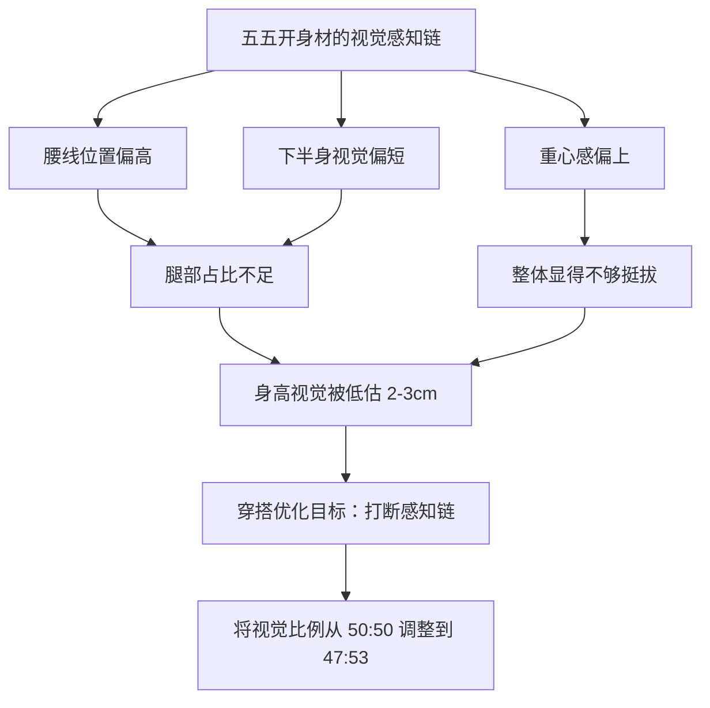
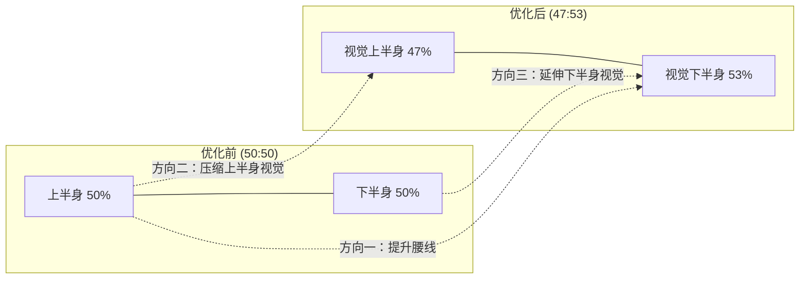
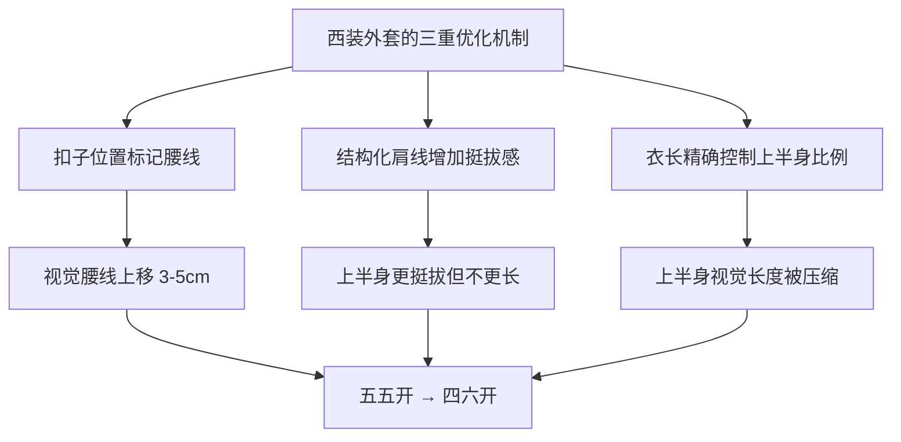

## 三、五五开身材优化方案

五五开身材是亚洲男性中最常见的身材类型之一——上半身和下半身的视觉长度比例接近1:1。本章将从视觉科学原理出发，系统讲解如何通过穿搭将五五开比例优化为接近黄金比例的视觉效果。

### 3.1 理解五五开身材

#### 3.1.1 什么是五五开身材

五五开身材的定义很直观：从肩线到腰线的长度（上半身），与从腰线到脚底的长度（下半身），比例接近1:1。以普通身高身高为例，上半身和下半身各约82-83cm，这就是典型的五五开比例。

**理想的身材比例参照**：

| 比例类型 | 上半身:下半身 | 视觉效果 | 说明 |
|---------|-------------|---------|------|
| 五五开 | 50:50 | 腿部显短，重心偏高 | 需要通过穿搭优化 |
| 黄金比例 | 45:55 | 协调自然，腿长感强 | 穿搭优化的目标 |
| 超模比例 | 40:60 | 腿部修长 | 天赋型，无需优化 |
| 四六开 | 47:53 | 接近理想 | 穿搭可达的最佳状态 |

#### 3.1.2 五五开身材的视觉科学原理

为什么五五开看起来"不够好"？这涉及人类视觉感知系统的工作机制。

**格式塔心理学的接近性法则**：大脑会自动将身体按照腰线位置分成上下两部分来评估比例。当这两部分等长时，大脑会认为"中规中矩"；当下半身明显更长时，大脑会自动标记为"腿长"，产生更好的视觉印象。

**进化心理学视角**：研究表明，人类对长腿的偏好有进化基础。2012年发表在《英国皇家学会学报B》上的跨文化研究发现，腿身比略高于平均值（腿偏长）的人在不同文化中都被认为更具吸引力。这不是审美霸权，而是长腿在进化上与更好的营养状况和健康水平相关联。

**头身比的联动效应**：五五开身材的人，如果同时头身比不够理想（如7.2:1而非7.5:1以上），视觉上的"矮"感会被进一步放大。这是因为大脑会同时处理多个比例信息，形成综合判断。

#### 3.1.3 五五开身材的三大优化方向

理解了原理之后，优化方向就变得非常清晰：

**方向一：提升视觉腰线（效果最大）**
将腰线上移3-5cm，让下半身看起来更长。这是单一效果最大的技巧，相当于把50:50变成47:53。具体方法包括：上衣塞入裤中、选择高腰裤、短款外套。

**方向二：压缩上半身视觉长度**
让上半身看起来更短，下半身自然就显得更长。具体方法包括：V领延伸（让视线向下移动）、避免低腰设计、上装选择短款。

**方向三：延伸下半身视觉长度**
让下半身看起来更修长。具体方法包括：鞋裤同色、修身裤型、尖头鞋、九分裤露出脚踝。

### 3.2 上半身穿搭策略

#### 3.2.1 短款上衣——缩短上半身的核心手段

上衣的长度是影响上半身视觉比例的最直接因素。衣摆每缩短1cm，上半身的视觉长度就缩短1cm，下半身比例相应增加。

**上衣长度的精确标准**：

| 上衣类型 | 最佳长度 | 可接受长度 | 应避免长度 |
|---------|---------|-----------|-----------|
| T恤/Polo衫 | 下摆到腰带位置 | 裤子拉链中部以内 | 超过拉链中部 |
| 衬衫 | 下摆到腰带位置 | 裤子纽扣位置 | 遮盖臀部 |
| 针织衫/毛衣 | 下摆到腰带位置 | 裤子拉链中部 | 遮盖臀部以上 |
| 夹克/外套 | 到腰部或臀部上1/3 | 臀部中部 | 大腿中部 |
| 西装外套 | 到臀部上半部分 | 臀部中部 | 臀部以下 |

**选购实操指南**：

- **看尺码表**：购买前查看商品详情中的"衣长"数据。以普通身高身高为例，衣长66-68cm是T恤/衬衫的最佳范围，外套可以到70-72cm
- **试穿验证**：穿上后双手自然下垂，衣摆应该在虎口位置或以上，不要到大拇指
- **线上购物技巧**：在详情页搜索"衣长"，对比自己现有合身上衣的尺寸
- **避免"加长款"标签**：部分品牌有"Regular"和"Long"两种版型，五五开身材选Regular

#### 3.2.2 上衣塞法——最简单有效的腰线重置

上衣塞入裤中是五五开身材优化的第一优先级操作。这个动作直接明确了腰线位置，让上半身的视觉长度被压缩到腰线以上。

**三种塞法的适用场景**：

**全塞法（Full Tuck）**
- 操作：将上衣全部塞入裤中，从两侧均匀拉出少许
- 适用场景：正式/半正式场合、搭配西装外套、搭配腰带
- 效果：最干净的腰线位置，显高效果最强
- 注意：如果腹部有轻微赘肉，全塞可能暴露，改用前塞法

**前塞法（French Tuck）**
- 操作：只塞前面约1/3到1/2的衣摆，后面自然垂下
- 适用场景：日常休闲、通勤、不想太正式但需要提升腰线
- 效果：自然随意，腰线上移3-5cm
- 注意：塞入后轻轻拉出一点蓬松感，避免紧绷

**侧面塞法（Side Tuck）**
- 操作：只塞一侧的衣摆，另一侧自然垂下
- 适用场景：休闲出街、打造不对称造型
- 效果：视觉重心上移，但比前塞法更随意
- 注意：适合休闲风格，不适合正式场合

**塞衣的常见问题与解决**：

| 问题 | 原因 | 解决方案 |
|------|------|---------|
| 塞入后鼓包 | 衣服面料太厚或太长 | 选择薄款面料，或只塞前半部分 |
| 走几步就散开 | 裤腰太松或衣服太滑 | 内穿打底衫固定，或用裤腰夹 |
| 腹部显凸 | 腹部有赘肉 | 改用前塞法，只塞前面遮住腹部 |
| 看起来太正式 | 衣服太挺括 | 选择柔软面料的上衣，塞入后拉松 |

#### 3.2.3 V领与领口选择——纵向延伸上半身

领口设计是压缩上半身视觉长度的隐藏武器。V领形成的三角形区域引导视线向下移动，让上半身看起来更修长，同时拉长颈部线条。

**领型效果对比**：

| 领型 | 纵向延伸效果 | 适用场景 | 对五五开的帮助 |
|------|-----------|---------|--------------|
| 深V领 | ★★★★★ | 约会、休闲 | 最强，但日常可能过于暴露 |
| 标准V领 | ★★★★☆ | 通勤、日常 | 强推荐，平衡效果与得体 |
| 浅V领/鸡心领 | ★★★☆☆ | 日常T恤 | 适度帮助，比圆领好 |
| 衬衫领（解扣1-2颗） | ★★★★☆ | 通勤、商务 | 强推荐，自然形成V形 |
| Polo领 | ★★★☆☆ | 休闲、运动 | 中等，小V形开口 |
| 圆领 | ★★☆☆☆ | 日常 | 帮助有限，不推荐作为主力 |
| 高领/半高领 | ★☆☆☆☆ | 冬季 | 反而缩短颈部，慎用 |

**执行方案**：
- 将衣橱中50%的圆领T恤替换为V领或小V领
- 衬衫日常解开最上面1-2颗扣子，形成自然V形
- 秋冬毛衣首选V领，内搭衬衫露出V形领口区域
- 如果必须穿高领毛衣，外面搭一件V领开衫或西装外套来补偿

#### 3.2.4 颜色策略——上装颜色的取舍

上半身的颜色选择需要平衡两个目标：缩短上半身视觉长度 + 整体协调。

**原则**：上装颜色可以比下装稍浅或同色，但避免上深下浅（头重脚轻）。

| 上装颜色策略 | 效果 | 适用场景 |
|------------|------|---------|
| 上下同色 | 最强纵向延伸 | 需要最大化显高时 |
| 上浅下深 | 上半身膨胀感+下半身收缩 | 日常通勤，最推荐 |
| 上深下浅 | 上半身收缩但下半身膨胀 | 不推荐，加重五五开 |
| 上深下深（不同深浅） | 纵向延伸好 | 秋冬季节 |

**关键细节**：如果选择浅色上装，面料要选有垂坠感的（如针织、薄棉），避免过于蓬松膨胀的面料（如oversize卫衣），否则会增加上半身体积。

### 3.3 下半身穿搭策略

#### 3.3.1 高腰/中腰裤——腰线的物理重置

裤子的腰线高度直接决定了下半身的物理起点。对于五五开身材，这是最基础也最重要的单品选择。

**腰线高度与比例关系**：

| 裤腰类型 | 腰线位置 | 对五五开身材的效果 | 推荐度 |
|---------|---------|------------------|--------|
| 低腰裤 | 髋骨下方 | 严重恶化比例，腿看起来极短 | ❌ 禁止 |
| 中低腰裤 | 髋骨 | 略微恶化，但不明显 | ⚠️ 谨慎 |
| 中腰裤 | 肚脐附近 | 维持基准，可接受 | ✅ 基础款 |
| 中高腰裤 | 肚脐上方2-3cm | 明显改善比例 | ✅✅ 推荐 |
| 高腰裤 | 肚脐上方3-5cm | 最佳改善效果 | ✅✅✅ 最推荐 |

**选购指南**：
- **试穿验证**：穿上后裤腰应该在肚脐位置或以上，用手指确认位置
- **尺码调整**：高腰裤可能需要比低腰裤大一码，因为腰围测量点不同
- **面料选择**：有弹力的面料（含2-5%氨纶）更舒适，不会在坐下时勒腰
- **品牌参考**：优衣库、ZARA、H&M都有中高腰款，购买时注意看"腰型"描述

#### 3.3.2 裤型选择——修身但不紧身

裤型决定了下半身的视觉轮廓。五五开身材需要的是纵向延伸的裤型，避免增加下半身视觉宽度。

**裤型效果对比**：

| 裤型 | 对五五开的效果 | 原因 | 推荐度 |
|------|-------------|------|--------|
| 修身直筒裤 | ★★★★★ | 直线条纵向延伸，不紧不松 | 最推荐 |
| 锥形裤（上宽下窄） | ★★★★☆ | 脚踝收窄，显腿细长 | 推荐 |
| 九分裤 | ★★★★★ | 露出脚踝，视觉上腿更长 | 最推荐 |
| 微喇裤 | ★★★☆☆ | 脚踝处微张，有平衡感 | 可接受 |
| 阔腿裤 | ★★☆☆☆ | 增加下半身体积，显矮 | 不推荐 |
| 紧身裤 | ★★★☆☆ | 显腿型但可能暴露腿部缺陷 | 谨慎 |
| 宽松休闲裤 | ★☆☆☆☆ | 完全遮盖腿部线条，显矮显胖 | 禁止 |

**修身直筒裤的选购标准**：
- 大腿处留有1-2cm的余量，不紧贴皮肤
- 小腿处自然收窄，到脚踝处略窄于大腿
- 面料有轻微弹力，坐下时不会紧绷
- 颜色首选深色（黑、深蓝、深灰），占裤子总量的70%以上

#### 3.3.3 裤长的精确控制

裤长是五五开身材优化中被严重忽视的细节。裤脚堆积在鞋面上，会在视觉上缩短腿部长度，加重五五开的比例问题。

**裤长标准**：

| 裤长类型 | 长度标准 | 适用场景 | 鞋子搭配 |
|---------|---------|---------|---------|
| 标准裤长 | 裤脚刚好到鞋面，无堆积 | 正式/通勤 | 皮鞋、乐福鞋 |
| 九分裤 | 裤脚在脚踝骨上方3-5cm | 日常/休闲 | 运动鞋、低帮鞋 |
| 卷边效果 | 牛仔裤卷1-2折 | 休闲出街 | 任何低帮鞋 |

**裤长调整建议**：
- 购买裤子后到裁缝店精确调整裤长，费用通常10-30元
- 准备两种裤长的裤子：全长（到鞋面）和九分（到脚踝），覆盖不同场景
- 牛仔裤可以手动卷边制造九分效果，但注意卷边宽度不超过3cm
- 西裤必须改裤长，因为西裤的原长通常偏长，堆积效果在正装中非常明显

#### 3.3.4 鞋裤同色——下半身视觉延伸的终极技巧

当鞋子和裤子颜色接近时，腿部线条会自然延伸到脚尖，视觉上增加3-5cm的腿长感。这个技巧在第一章中已有详细论述，这里专门针对五五开身材做进一步说明。

**五五开身材的鞋裤同色执行方案**：

| 裤子颜色 | 最佳鞋色 | 次选鞋色 | 避免鞋色 |
|---------|---------|---------|---------|
| 黑色 | 黑色 | 深灰 | 白色、浅色 |
| 深蓝 | 深蓝/黑色 | 深灰 | 白色、棕色 |
| 深灰 | 深灰/黑色 | 黑色 | 白色、亮色 |
| 炭灰 | 黑色 | 深灰 | 白色 |
| 卡其/棕色 | 棕色 | 深棕 | 白色、黑色 |

**袜子的衔接**：袜子是鞋裤之间的过渡层。选择与裤子同色的袜子，避免视觉断裂。如果穿九分裤，袜子颜色应与鞋子接近；如果穿全长裤，袜子颜色应与裤子接近。船袜（隐形袜）适合夏季穿九分裤时使用，但要注意鞋子内部的舒适度。

#### 3.3.5 鞋子选择——物理增高与视觉延伸并重

五五开身材的鞋子选择需要同时考虑物理增高和视觉延伸两个维度。

**鞋子对五五开身材的双重贡献**：

| 贡献维度 | 方式 | 效果幅度 | 隐蔽性 |
|---------|------|---------|--------|
| 物理增高 | 内增高鞋垫（2-3cm） | +2-3cm身高 | 完全隐蔽 |
| 物理增高 | 厚底鞋/靴子 | +1-3cm身高 | 外观可见但自然 |
| 视觉延伸 | 鞋裤同色 | +3-5cm腿长感 | 完全无形 |
| 视觉延伸 | 尖头/略尖设计 | +2-3cm腿长感 | 完全无形 |
| 视觉延伸 | 低帮款露出脚踝 | +1-2cm腿长感 | 完全无形 |

**推荐鞋型**（按五五开身材优化效果排序）：

1. **切尔西靴**（★★★★★）：靴底2-3cm，靴跟1-2cm，总增高3-5cm，外观自然，搭配内增高垫效果翻倍
2. **厚底运动鞋**（★★★★☆）：New Balance 574、Nike Air Force 1等经典厚底款，增高2-3cm
3. **尖头/略尖皮鞋**（★★★★☆）：视觉延伸效果好，适合通勤/商务
4. **马丁靴/工装靴**（★★★★☆）：鞋底本身3-4cm，风格硬朗
5. **厚底乐福鞋**（★★★☆☆）：增高2-3cm，近年流行，适合休闲通勤

**应避免的鞋型**：
- 松糕鞋/超厚底鞋（底厚>5cm）：笨重不自然
- 白色运动鞋搭配深色裤子：脚部形成明显视觉截断点
- 圆头笨重鞋型：增加脚部视觉面积，显得重心低

### 3.4 腰带的使用——腰线强化器

#### 3.4.1 腰带对五五开身材的特殊意义

腰带是唯一能在身体中部创造明确水平线条的配饰。对于五五开身材，腰带的作用不是装饰，而是**腰线定位器**——它明确告诉观察者"腿从这里开始"。

**腰带位置的定量影响**：

- 腰带系在肚脐位置：标准腰线，维持50:50比例
- 腰带系在肚脐上方3cm：腰线上移，比例改善到约48:52
- 腰带系在髋骨位置：腰线下移，比例恶化到约53:47

#### 3.4.2 腰带的正确使用方法

**颜色选择**：
- 最佳：腰带颜色与裤子接近，不形成强烈颜色对比（如黑裤配黑腰带、深蓝裤配深蓝腰带）
- 可接受：腰带颜色与鞋子接近（如棕鞋配棕腰带）
- 避免：腰带颜色与裤子形成强烈对比（如白裤子配黑腰带），这会形成明显的视觉切割线，将身体切成两半

**宽度标准**：
- 最佳宽度：3-3.5cm，这个宽度既有存在感又不夸张
- 太窄（<2cm）：没有存在感，起不到定位腰线的作用
- 太宽（>4cm）：增加腰部视觉面积，让腰部看起来更宽

**扣头选择**：
- 简约款：小方形扣、针扣、日字扣
- 避免：大Logo扣、夸张造型扣、过大的金属扣头
- 原因：大扣头会成为视觉焦点，将注意力吸引到腰部

**系法**：
- 腰带应该系在腰带袢的正确位置，不要歪斜
- 多余的腰带应该塞入腰带袢中或剪到合适长度，不要垂在外面
- 前面的腰带扣应该在正中间，不要偏左或偏右

#### 3.4.3 腰带的常见错误

| 错误做法 | 为什么错 | 正确做法 |
|---------|---------|---------|
| 白裤子配黑腰带 | 强对比切割身体，加重五五开 | 腰带与裤子同色系 |
| 腰带系在髋骨位置 | 压低腰线，腿显短 | 系在肚脐位置 |
| 使用大Logo腰带扣 | 视觉焦点落在腰部 | 用简约扣头 |
| 腰带过宽（>4cm） | 增加腰部视觉宽度 | 选择3-3.5cm宽度 |
| 腰带多余部分垂在外面 | 显得邋遢，吸引视线到腰部 | 塞入腰带袢 |

### 3.5 西装外套——五五开身材的最佳单品

#### 3.5.1 为什么西装外套是五五开身材的救星

西装外套是唯一能同时满足三个优化条件的单品：

1. **扣子位置提升视觉腰线**：西装的扣子位置通常在腰线附近，扣上扣子后自然形成腰线标记
2. **结构化肩线增加上半身挺拔感**：垫肩和结构化肩线让肩部更挺拔，但不会增加上半身的视觉长度
3. **衣长精确可控**：西装外套的衣长通常在臀部上半部分，不会过长

#### 3.5.2 西装外套的选购标准

**扣子系统**：
- **单排两粒扣**（最推荐）：扣子位置偏高，扣上上面一粒扣子时腰线标记最明显
- **单排一粒扣**（推荐）：扣子位置通常在腰线，简洁利落
- **双排扣**（谨慎）：扣子较多，视觉上可能增加上半身体积
- **三粒扣**（不推荐）：扣子位置偏低，不利于提升腰线

**衣长标准**：
- 最佳：到臀部上半部分（约在臀峰位置）
- 可接受：到臀部中部
- 避免：超过臀部到大腿中部——这会将身体切成两半

**肩线选择**：
- 合身但略带结构感的肩线，能增加上半身的挺拔感
- 肩线应该刚好在肩膀边缘，不要溜肩也不要超过肩膀
- 适度的垫肩（0.5-1cm）可以改善肩部线条，但不要过度

**面料选择**：
- 春秋：中厚羊毛混纺，有垂坠感
- 夏季：亚麻、薄款棉混纺、泡泡纱
- 冬季：厚款羊毛、粗花呢

**开衩设计**：
- 后中开衩：最经典，方便活动且修身效果好
- 双侧开衩：更方便活动，适合需要经常坐下的场景
- 无开衩：修身效果最好，但活动受限

#### 3.5.3 西装外套的穿着技巧

**扣子规则**：
- 两粒扣西装：只扣上面一粒，下面的永远不扣
- 一粒扣西装：站立时扣上，坐下时解开
- 原因：扣子位置在腰线，扣上后明确标记腰线；下面的扣子扣上会限制活动且显得不自然

**内搭搭配**：
- 衬衫（全塞）：最正式，腰线最明确
- T恤（前塞）：半正式，休闲但有型
- 针织衫（全塞）：秋冬季节，保暖又有型
- 原则：内搭必须塞入裤中，否则衣摆外露会破坏西装的腰线效果

**袖长标准**：
- 西装外套的袖口应该比内搭衬衫袖口短1-2cm
- 这样衬衫袖口会微微露出，增加层次感
- 西装袖长到手腕骨位置，不要过长

**肩线维护**：
- 西装外套不用时挂在宽肩衣架上，保持肩线形状
- 不要长时间折叠存放，会产生不可逆的褶皱
- 定期送干洗，保持面料的挺括感

### 3.6 叠穿与层次——五五开身材的进阶技巧

#### 3.6.1 叠穿对比例的影响

叠穿（Layering）是秋冬季节的核心穿搭技巧，但对五五开身材来说，叠穿是一把双刃剑：用好了能优化比例，用错了会加重五五开。

**叠穿的优化原则**：
- 内层（贴身层）：薄款，颜色与裤子接近或同色
- 中层（保暖层）：到腰带位置，不要过长
- 外层（防风层）：到臀部上半部分，结构化肩线

**叠穿的常见错误**：
- 内层太厚导致鼓包：选择薄款打底衫，如发热内衣
- 中层过长遮盖腰线：选择短款针织衫或开衫
- 外层过长到大腿：选择短款夹克或到臀的外套
- 层次过多导致臃肿：控制在2-3层，用面料厚度而非层数保暖

#### 3.6.2 各季节的叠穿方案

**春季叠穿**：
- 内：白色薄款T恤（前塞）
- 外：深色短款夹克（到腰部）
- 效果：腰线明确，上半身视觉缩短

**秋季叠穿**：
- 内：白色衬衫（全塞，解扣1-2颗）
- 中：深色V领针织背心
- 外：深色短款夹克
- 效果：V领延伸+腰线提升双重优化

**冬季叠穿**：
- 内：发热内衣（薄款）
- 中：深色V领毛衣
- 外：短款羽绒服/短款呢子大衣（到腰部）
- 效果：保暖不臃肿，腰线仍然可见

### 3.7 季节化搭配方案

#### 3.7.1 春季方案（15-25°C）

**方案A：日常通勤**
- 浅灰色V领薄款毛衣（前塞入裤中）
- 深蓝色修身直筒裤（中高腰）
- 深棕色皮带（3cm宽，简约针扣）
- 深棕色切尔西靴（2cm内增高）
- 比例改善：50:50 → 约47:53

**方案B：周末休闲**
- 白色V领T恤（前塞）
- 黑色修身九分牛仔裤（中高腰）
- 黑色皮带
- 黑色厚底运动鞋（增高3cm）
- 比例改善：50:50 → 约46:54

#### 3.7.2 夏季方案（25°C+）

**方案C：清凉出街**
- 黑色V领短袖T恤（前塞）
- 深灰色修身九分休闲裤（中腰）
- 黑色厚底运动鞋
- 简约银色项链（增加V领区域的纵向感）
- 比例改善：50:50 → 约47:53

**方案D：约会穿搭**
- 深蓝色Polo衫（前塞）
- 卡其色修身直筒裤（中高腰）
- 棕色皮带
- 棕色乐福鞋（2cm内增高）
- 比例改善：50:50 → 约48:52

**方案E：同色延伸（最强显高）**
- 全黑：黑色V领T恤 + 黑色修身裤 + 黑色运动鞋
- 比例改善：50:50 → 约46:54
- 原理：全身同色消除水平切割，纵向线条最完整

#### 3.7.3 秋季方案（10-20°C）

**方案F：层次叠穿**
- 白色衬衫（全塞，解扣2颗）
- 深灰色V领针织背心
- 黑色修身直筒裤（中高腰）
- 黑色切尔西靴（3cm增高）
- 黑色皮带
- 比例改善：50:50 → 约45:55

**方案G：休闲工装**
- 深灰色长袖T恤（前塞）
- 军绿色短款工装夹克（到腰部）
- 深蓝色修身牛仔裤（中高腰）
- 黑色厚底运动鞋
- 比例改善：50:50 → 约47:53

#### 3.7.4 冬季方案（0-10°C）

**方案H：保暖显高**
- 薄款发热内衣
- 深色V领毛衣
- 深蓝色短款羽绒服（到腰部）
- 黑色修身直筒裤（中高腰）
- 黑色切尔西靴（3cm增高）
- 深灰色针织帽（增加头顶2cm）
- 比例改善：50:50 → 约45:55

**方案I：商务冬装**
- 白色衬衫
- 深灰色V领毛衣
- 黑色短款呢子大衣（到臀部上半部分）
- 炭灰色修身西裤（中高腰）
- 黑色尖头皮鞋（2cm内增高）
- 比例改善：50:50 → 约46:54

### 3.8 比例优化的进阶技巧

#### 3.8.1 视觉重心上移策略

除了腰线提升，还可以通过将视觉重心上移到达上半身来间接优化比例。当观察者的注意力集中在上半身时，对下半身长度的感知会相对减弱。

**视觉重心上移的方法**：
- **上装有细节设计**：胸口口袋、领口设计、胸针等
- **配饰放在上半身**：项链、围巾、帽子
- **V领区域有层次**：衬衫+针织衫的V形区域
- **避免上装过于素净**：纯色无细节的上装会让人注意下半身

#### 3.8.2 竖条纹的叠加使用

竖条纹能在视觉上增加纵向延伸感，与五五开身材的优化目标完美契合。

**竖条纹的参数选择**：
- 条纹方向：竖条纹，不要横条纹
- 条纹宽度：细条纹（<1cm），不要宽条纹（>3cm）
- 条纹底色：深色底，收缩效果更好
- 适用单品：衬衫、针织衫、西装外套

**最佳组合**：深蓝色细条纹衬衫 + 深色修身裤 + V领设计 = 纵向延伸 + 腰线提升 + 视觉压缩上半身，三重效果叠加。

#### 3.8.3 纹理与材质的运用

面料的纹理和材质也会影响视觉效果：
- **垂坠感面料**（如针织、薄羊毛）：贴合身体线条，不增加体积
- **挺括面料**（如厚棉、粗花呢）：增加结构感，但可能增加上半身体积
- **光泽面料**（如丝绸、缎面）：反射光线，增加视觉面积，慎用
- **哑光面料**（如棉、亚麻）：吸收光线，收缩效果好，推荐

### 3.9 常见误区与纠正

#### 误区一："穿宽松衣服能遮盖五五开身材"

**错误认知**：身材比例不好，穿宽松衣服可以遮盖。
**事实**：宽松衣服会增加身体的视觉体积，让上半身看起来更长更宽，反而加重五五开的比例问题。正确的做法是穿合身但不紧身的衣服——贴合身体轮廓但不勒出线条。

#### 误区二："上衣越短越好"

**错误认知**：既然要缩短上半身，那就穿最短的上衣。
**事实**：上衣太短会露出腹部或腰带，显得不自然。最佳长度是下摆到腰带位置，既能明确腰线又不会暴露过多。

#### 误区三："高腰裤就是穿老式高腰裤"

**错误认知**：高腰裤是老土的穿法，不适合年轻人。
**事实**：现代的中高腰裤设计已经非常时尚，腰线在肚脐上方2-3cm即可，不会像80年代的超高腰裤那样夸张。关键在于选择合身的版型和现代的面料。

#### 误区四："五五开身材不能穿浅色裤子"

**错误认知**：浅色裤子会显矮，五五开身材绝对不能穿。
**事实**：浅色裤子确实会增加下半身的视觉宽度，但并非绝对不能穿。关键在于搭配：浅色裤子 + 同色系鞋子 + 上衣塞入 + 深色短款外套，仍然可以保持不错的比例。

#### 误区五："腰带只是装饰，不需要讲究"

**错误认知**：腰带随便买一条就行，只要能系住裤子。
**事实**：腰带是五五开身材的腰线定位器，用错反而会加重比例问题。颜色、宽度、扣头、位置都有讲究，详见3.4节。

#### 误区六："鞋子只看舒适度，与身材比例无关"

**错误认知**：鞋子就是走路用的，跟身材比例没关系。
**事实**：鞋子是五五开身材优化的重要环节。鞋裤同色能延伸3-5cm的腿长感，厚底鞋能物理增高2-3cm，两者叠加效果显著。详见3.3.5节。

### 3.10 购物清单与优先级

根据优化效果从高到低排列，以下是五五开身材优化的购物优先级：

| 优先级 | 单品 | 预算参考 | 优化效果 | 说明 |
|--------|------|---------|---------|------|
| P0 | 中高腰修身直筒裤（深色） | 200-500元 | ★★★★★ | 基础中的基础 |
| P0 | 2-3cm内增高鞋垫 | 30-80元 | ★★★★★ | 隐形增高 |
| P1 | 深色短款夹克/外套 | 300-800元 | ★★★★☆ | 上半身缩短 |
| P1 | V领上衣（2-3件） | 100-300元 | ★★★★☆ | 纵向延伸 |
| P1 | 与裤子同色的皮带 | 100-300元 | ★★★★☆ | 腰线定位 |
| P2 | 切尔西靴 | 300-800元 | ★★★★☆ | 增高+延伸 |
| P2 | 厚底运动鞋 | 400-1000元 | ★★★☆☆ | 增高 |
| P3 | 西装外套（深色） | 500-2000元 | ★★★★★ | 最强单品 |
| P3 | 竖条纹衬衫 | 200-500元 | ★★★☆☆ | 纵向延伸 |

### 3.11 五五开身材优化自检清单

出门前用这个清单快速检查：

- [ ] 腰线位置：上衣是否塞入裤中？裤腰是否在肚脐位置或以上？
- [ ] 上衣长度：下摆是否到腰带位置？是否过长遮盖臀部？
- [ ] 裤型：是否修身直筒？是否避免了宽松/阔腿裤？
- [ ] 裤长：裤脚是否到鞋面或露出脚踝？是否有堆积？
- [ ] 鞋裤颜色：鞋子和裤子颜色是否接近？是否有明显断裂？
- [ ] 腰带：颜色是否与裤子接近？扣头是否简约？位置是否正确？
- [ ] 领口：是否选择了V领或解扣衬衫？是否避免了圆领/高领？
- [ ] 整体比例：上半身看起来是否比下半身短？视觉重心是否偏上？
- [ ] 整体协调：颜色是否统一？是否有突兀的亮色打断纵向线条？

***

*本章的五五开身材优化方案与第一章的显高穿搭方案高度互补。建议将两章内容结合使用，形成完整的比例优化体系。*
