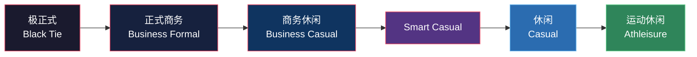
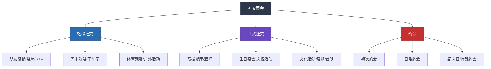
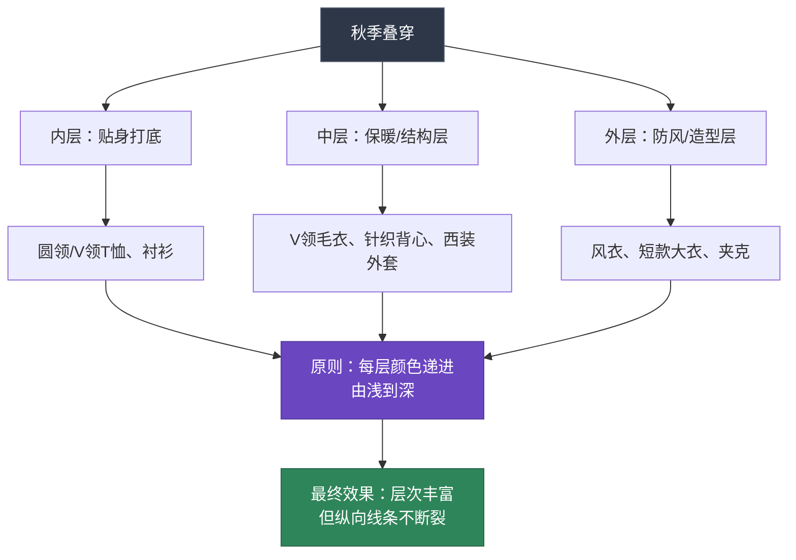
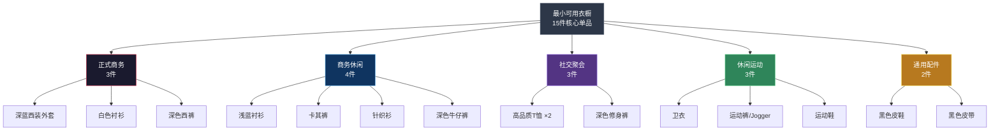

## 四、场合穿搭方案

> "穿对衣服，不是取悦别人，而是让每一个场合都成为你的主场。"

### 4.1 场合穿搭的底层逻辑

#### 4.1.1 为什么场合穿搭如此重要

很多人把穿搭理解为"好看就行"，但真正决定穿搭成败的不是好不好看，而是**是否得体**。心理学中的"社会角色理论"（Social Role Theory）指出，人们在不同社会场景中扮演不同角色，而着装是角色认同的第一信号。

想象两个场景：你穿全套西装去朋友的烧烤聚会，和你穿运动背心去行业峰会——两种情况下，你都会在开口说话之前就已经被贴上"格格不入"的标签。这就是**场合错配**的代价。

2017年《Journal of Business Research》的一项研究表明，在商务场景中，穿着与场合正式度匹配的人，被认为**可信度高出23%**，**专业能力评分高出18%**。而在社交场景中，穿着过于正式反而会让人觉得你"端着"、"不好亲近"。

#### 4.1.2 正式度光谱：理解场合的底层框架

所有场合都可以放在一条"正式度光谱"上，穿搭的核心任务是**让你的着装正式度与场合正式度匹配**。

**核心原则：高半级原则**

面试穿搭的黄金法则——比目标场合的日常着装正式**半个到一个级别**。这个原则其实适用于所有场合：

| 场合日常着装 | 你的最佳着装 | 原因 |
|------------|------------|------|
| T恤+运动裤 | 合身Polo衫+修身裤 | 高半级，显得重视 |
| Polo衫+休闲裤 | 衬衫+西裤+乐福鞋 | 高半级，有型但不刻意 |
| 衬衫+西裤 | 西装外套+衬衫+西裤 | 高半级，增添正式感 |
| 全套西装 | 全套西装（面料/细节更讲究） | 同级但更高品质 |

**绝对禁忌：低于场合正式度。** 穿运动装去参加婚礼、穿拖鞋去见客户——这些不是"随性"，而是不尊重。

#### 4.1.3 场合穿搭的三个核心变量

决定一套穿搭是否适合某个场合，需要同时考虑三个变量：

| 变量 | 定义 | 普通身高/正常体重的特殊考量 |
|------|------|---------------------|
| **正式度** | 场合要求的严肃程度 | 不需要通过增高鞋来显得更"权威"，合身剪裁比物理增高更重要 |
| **社交距离** | 你与他人的物理距离 | 近距离社交（约会、聚餐）更注重细节品质；远距离（大会场）更注重整体轮廓 |
| **活动强度** | 身体活动的幅度 | 活动量大时选择弹力面料、宽松一点的版型；久坐时注重透气性 |

### 4.2 正式商务场合

#### 4.2.1 场景定义与边界

正式商务场合的典型场景包括：

- **重要商务会议**：与高层客户、投资人、合作伙伴的正式会面
- **行业峰会/论坛**：需要上台发言或参与圆桌讨论
- **正式谈判**：合同签署、合作协议商讨
- **公司年会/颁奖典礼**：正式晚宴级别的公司活动
- **法院/政府机关**：需要体现严肃和尊重的场合

**不属于正式商务**：日常办公室、部门例会、与熟客的午餐会——这些属于商务休闲，穿全套西装反而过头。

#### 4.2.2 西装：正式商务的核心单品

对于普通身高、正常体重、五五开身材的男性来说，西装是优化比例的最佳武器——但前提是**选对版型**。

**版型选择的四项铁律**：

| 检查项 | 正确标准 | 常见错误 | 为什么重要 |
|-------|---------|---------|----------|
| **肩线** | 肩缝落在肩膀骨头正上方，不超过1cm | 肩线过宽（显得肩塌）、过窄（显得局促） | 肩线是西装合身度的第一判断标准，错了一切白费 |
| **衣长** | 双手自然下垂，衣摆到拇指根部（约到臀部上1/3） | 过长到大腿中部（显矮）、过短露臀（比例失调） | 对五五开身材，衣长精准控制是优化比例的关键 |
| **扣位** | 两粒扣的上扣位于腰部最细处或略上方 | 扣位偏低（压低腰线） | 扣位就是视觉腰线——对五五开身材极其重要 |
| **收腰** | 侧面看有自然的S型曲线，腰部收紧2-3cm | 完全直筒（像穿麻袋）、过度收紧（像女装） | 收腰让上半身有结构感，避免五五开身材的"桶型"视觉 |

**颜色选择**：

- **首选：深蓝色（Navy Blue）**——这是男装中"万能色"，比黑色更有层次感，适合亚洲人肤色，在任何光线下都不会出错
- **次选：炭灰色（Charcoal Grey）**——沉稳、正式，适合秋冬季节
- **避免：纯黑色西装**——在中国文化语境中，纯黑西装容易与服务员、销售人员、殡仪场合混淆。除非是极正式的Black Tie场合，否则选深蓝或炭灰
- **面料**：纯羊毛或羊毛混纺，克重260-300g/m²适合四季穿着

**普通身高身材的西装特殊处理**：

1. **选择短款版型（Short Fit）**：很多品牌（如Zara、Massimo Dutti、Hugo Boss）都有S/Short版型，衣长短2-3cm，专门为矮个子设计
2. **后开衩选择**：优先选双侧开衩（Side Vent），方便活动且不影响修身效果
3. **口袋设计**：避免大贴袋（会增加视觉体积），选暗袋（Welt Pocket）
4. **垫肩**：适度垫肩可以增加肩宽（你的肩宽可能偏窄），但不要选过度垫肩的款式

#### 4.2.3 衬衫：西装的最佳搭档

**面料**：

| 面料 | 特点 | 适用场景 | 推荐度 |
|------|------|---------|--------|
| 精梳棉（Combed Cotton） | 光滑、耐穿、不易起球 | 日常通勤、正式场合 | ★★★★★ |
| 府绸（Poplin） | 细密、挺括、有光泽 | 正式商务 | ★★★★★ |
| 牛津纺（Oxford） | 厚实、有纹理、略休闲 | 商务休闲 | ★★★★☆ |
| 亚麻混纺 | 透气、有褶皱感 | 夏季、休闲 | ★★★☆☆ |

**领型选择**（与脸型配合）：

- **长尖领（Point Collar）**：领尖较长，向下延伸——**最适合方形脸型**，因为V形区域可以柔化颧骨的视觉宽度，同时纵向延伸效果最好
- **温莎领（Spread Collar）**：领尖张开角度大（120-180°）——适合搭配宽领带结，但对方形脸型的修饰效果不如长尖领
- **纽扣领（Button-Down）**：领尖有扣子固定——略休闲，适合商务休闲而非正式场合

**尺码要点**（普通身高身材）：

- **领围**：量脖子底部一圈+1.5cm（能插入一根手指的余量），中国男性常用38-40cm
- **袖长**：西装袖口露出衬衫袖口1-2cm——如果手臂较短，选择"Slim Fit"或"Short"版型的衬衫
- **衣长**：衬衫衣长要足够塞入裤中且坐下时不拉出来——一般到臀部中部

#### 4.2.4 领带：正式感的点睛之笔

**系法选择**：

| 结型 | 适用领型 | 难度 | 适合脸型 |
|------|---------|------|---------|
| 四手结（Four-in-Hand） | 长尖领、标准领 | ★☆☆ | 最通用，不对称感增添个性 |
| 半温莎结（Half Windsor） | 温莎领、标准领 | ★★☆ | 对称三角形，正式感强 |
| 温莎结（Full Windsor） | 温莎领、宽角领 | ★★★ | 完全对称，最正式但较宽 |

**对普通身高身材的建议**：选择**四手结**或**半温莎结**，因为温莎结太宽会在胸部形成大面积色块，对偏矮身材不够友好。领带宽度选择7-8cm（窄领带），与你的身材比例更协调。

**长度控制**：领带尖端刚好到腰带扣位置——这是唯一正确的长度。过长显得邋遢，过短显得局促。

**颜色与图案**：

- **安全色**：深蓝、酒红、银灰——几乎搭配任何深色西装都不会出错
- **商务图案**：纯色、细斜条纹、小圆点——远看接近纯色，近看有细节
- **避免**：卡通图案、大面积亮色、荧光色——除非你确定场合允许

#### 4.2.5 鞋子与配饰

**鞋子**：

| 鞋型 | 正式度 | 适合场合 | 普通身高建议 |
|------|--------|---------|----------|
| 牛津鞋（Oxford） | ★★★★★ | 最正式商务 | 选择2cm鞋跟+2cm内增高垫 |
| 德比鞋（Derby） | ★★★★☆ | 正式商务 | 比牛津鞋略休闲，更适合日常 |
| 孟克鞋（Monk Strap） | ★★★★☆ | 商务+时尚感 | 双扣款比单扣更有存在感 |
| 乐福鞋（Loafer） | ★★★☆☆ | 商务休闲 | 不适合最正式场合 |

**颜色**：黑色最正式，深棕色更日常。鞋子颜色应与腰带颜色一致（黑鞋配黑腰带，棕鞋配棕腰带）。

**其他配饰**：

- **手表**：金属表带或深色皮表带，表盘直径38-42mm。正式场合避免智能手表和塑料表
- **口袋巾（Pocket Square）**：如果想在基本款西装上增添亮点，白色亚麻口袋巾是最安全的选择——折成直线形或一角露出即可
- **袖扣**：如果穿法式袖口衬衫，选择银色或深蓝色简约袖扣
- **公文包**：选择深色皮革公文包或手提包，避免双肩包（太休闲）

#### 4.2.6 完整搭配方案

**方案一：经典深蓝西装（四季通用）**

| 单品 | 具体规格 | 价格区间 |
|------|---------|---------|
| 深蓝两粒扣西装 | 羊毛混纺，修身Slim Fit | 800-3000元 |
| 白色长尖领衬衫 | 精梳棉府绸，38-40领围 | 200-500元 |
| 酒红色斜条纹领带 | 7-8cm宽度，桑蚕丝 | 100-400元 |
| 炭灰色西裤 | 与西装配套或同色系 | 配套 |
| 黑色牛津鞋 | 2cm鞋跟，内置2cm增高垫 | 500-1500元 |
| 黑色皮带 | 3cm宽，银色简约扣头 | 100-300元 |
| 白色口袋巾 | 亚麻材质，直线折法 | 50-150元 |

**视觉增高效果**：鞋跟2cm + 增高垫2cm + 竖向比例优化 ≈ **视觉增高6-8cm**

**方案二：炭灰西装（秋冬版）**

| 单品 | 具体规格 |
|------|---------|
| 炭灰两粒扣西装 | 羊毛，280g/m² |
| 浅蓝温莎领衬衫 | 精梳棉 |
| 银灰色丝质领带 | 纯色或微纹理 |
| 配套西裤 | 裤脚到鞋面，无堆积 |
| 深棕德比鞋 | 2cm鞋跟 + 内增高垫 |
| 深棕皮带 | 与鞋同色 |
| 羊毛大衣（外出时） | 深蓝或黑色，到膝盖中部 |

**方案三：无领带方案（半正式会议）**

当场合不需要领带但又需要正式感时：

- 深蓝西装外套
- 白色衬衫（解开第一颗扣子）
- 深色修身西裤
- 棕色乐福鞋或德比鞋
- 简约手表

这种"去掉领带"的穿法正式度降低半级，适合非正式的商务午餐、内部高层会议、客户拜访等场景。

#### 4.2.7 正式商务场合的常见错误

| 错误 | 具体表现 | 正确做法 |
|------|---------|---------|
| 西装过大 | 肩线宽出2-3cm，袖子遮住手掌 | 找裁缝修改，或买S/Short版型 |
| 袜子颜色错误 | 黑色西裤配白色运动袜 | 穿深色袜子（黑、深蓝、深灰），长度到小腿中部 |
| 裤脚堆积 | 裤脚在鞋面上堆成"褶皱山" | 裁剪到刚好到鞋面的长度 |
| 领带过长/过短 | 超过腰带或在腰带以上 | 领带尖端正好到腰带扣 |
| 衬衫颜色不合适 | 花哨图案、粉色、过于鲜艳 | 以白色和浅蓝为主，图案以细条纹为限 |
| 皮鞋不亮 | 满是灰尘和划痕 | 出门前擦拭，定期上鞋油保养 |
| 口袋鼓起 | 西装口袋塞满手机、钱包、钥匙 | 只放薄型物品（手帕、卡片），其他放公文包 |

### 4.3 日常职场穿搭（商务休闲 / Smart Casual）

#### 4.3.1 商务休闲的定义边界

商务休闲（Business Casual）是现代职场最常见的着装要求，但也是最容易穿错的场合——因为它没有明确的"标准"，弹性范围很大。

**商务休闲的核心特征**：
- 不需要西装外套和领带
- 但不能穿运动服、破洞牛仔裤、拖鞋
- 面料和剪裁仍然要讲究——"休闲"指的是风格放松，不是品质放松
- 整体印象：**看起来既专业又有亲和力**

**Smart Casual vs Business Casual**：

| 维度 | Business Casual | Smart Casual |
|------|----------------|-------------|
| 正式度 | 偏正式 | 偏休闲 |
| 典型上装 | 衬衫、针织衫 | Polo衫、高品质T恤 |
| 典型下装 | 西裤、卡其裤 | 修身牛仔裤、休闲裤 |
| 鞋子 | 皮鞋、乐福鞋 | 乐福鞋、白色运动鞋 |
| 适用场景 | 客户拜访、重要会议 | 日常办公、团队活动 |

#### 4.3.2 衬衫方案（最经典的商务休闲）

**衬衫选择的三个维度**：

**面料**：
- **牛津纺（Oxford Cloth）**：厚实有质感，微粗糙的纹理让它比府绸衬衫更休闲，是商务休闲的首选面料
- **斜纹棉（Twill）**：柔软、有光泽，比府绸休闲但比牛津纺正式
- **亚麻混纺**：透气、有自然褶皱感，适合夏季

**颜色推荐**（按安全性排序）：

| 颜色 | 搭配难度 | 适合肤色 | 场合适应性 |
|------|---------|---------|----------|
| 浅蓝 | ★☆☆☆☆ | 适合所有肤色 | 最通用，一年四季 |
| 白色 | ★☆☆☆☆ | 适合所有肤色 | 最安全，但容易脏 |
| 浅粉 | ★★☆☆☆ | 适合偏白/偏黄肤色 | 春夏佳选 |
| 淡紫 | ★★★☆☆ | 适合偏白肤色 | 有个性但不张扬 |
| 淡绿/鼠尾草 | ★★★☆☆ | 适合偏黄/小麦肤色 | 春夏限定 |

**普通身高身材的衬衫穿着技巧**：

1. **前塞法（French Tuck）**：将衬衫前摆塞入裤中，后摆自然垂下——明确腰线位置，显高效果立竿见影
2. **袖子处理**：卷袖到前臂中部（约手肘下方5cm），露出前臂，显得利落又放松
3. **合身度**：衬衫肩线落在肩膀上，腰部略有收窄但不紧绷。避免"麻袋型"直筒衬衫
4. **领子状态**：解开最上面一颗扣子（不需要领带时），形成自然的V形，纵向延伸颈部

#### 4.3.3 裤装方案

**卡其裤/休闲西裤**：

- **颜色**：卡其色（Khaki）、深灰、藏蓝——这三种颜色覆盖了90%的商务休闲场景
- **版型**：修身直筒或微锥形，裤脚到鞋面
- **面料**：棉质斜纹布（Chino）最经典，弹力混纺更舒适
- **腰线**：中腰到高腰，确保裤腰在肚脐附近

**修身牛仔裤**：

- **颜色**：深蓝或深灰——避免浅蓝（太休闲）、破洞（太街头）
- **版型**：修身直筒（Slim Straight），不紧不松
- **裤长**：刚好到鞋面，或九分微露脚踝
- **搭配关键**：牛仔裤要与上半身的"正式感"形成平衡——上装越正式，牛仔裤越能穿出Smart Casual的味道

#### 4.3.4 鞋子方案

商务休闲是鞋子选择最灵活的场合：

| 鞋型 | 正式度 | 舒适度 | 搭配建议 |
|------|--------|--------|---------|
| 乐福鞋（Loafer） | ★★★★☆ | ★★★★☆ | 搭配卡其裤+衬衫，"一脚蹬"方便又优雅 |
| 德比鞋（Derby） | ★★★★☆ | ★★★☆☆ | 搭配西裤或卡其裤，适合偏正式的商务休闲 |
| 切尔西靴（Chelsea Boot） | ★★★☆☆ | ★★★★☆ | 秋冬首选，搭配修身裤，增高3-5cm |
| 白色运动鞋 | ★★☆☆☆ | ★★★★★ | 搭配牛仔裤+针织衫，Smart Casual标配 |
| 帆布鞋 | ★★☆☆☆ | ★★★★☆ | 夏季休闲，搭配九分裤 |

**普通身高身材的鞋子策略**：
- 商务休闲不强制皮鞋，可以选择有一定厚度的乐福鞋或厚底运动鞋
- 切尔西靴是秋冬最佳选择——靴底2-3cm + 内增高垫2cm = 物理增高4-5cm
- 白色运动鞋选择厚底款（如Common Projects、Veja等），增高2-3cm且不突兀

#### 4.3.5 完整搭配方案

**方案A：经典商务休闲（通勤首选）**

- 浅蓝色牛津纺衬衫（前塞法）
- 卡其色修身直筒裤（中腰，裤长到鞋面）
- 棕色乐福鞋（2cm内增高垫）
- 棕色皮带（与鞋同色系）
- 简约金属手表
- 秋冬加：深蓝色休闲西装外套（非套装，单独搭配）

**方案B：Smart Casual（偏休闲的办公日）**

- 深色Polo衫（黑色或深蓝，修身版型）
- 深色修身牛仔裤（深蓝，无破洞）
- 白色厚底运动鞋
- 简约银色手链或手表
- 秋冬加：V领针织开衫

**方案C：秋冬职场叠穿**

- 白色衬衫（全塞）
- 驼色V领毛衣（露出衬衫领和V形区域）
- 深灰色修身西裤
- 深棕色切尔西靴（3cm增高）
- 短款深蓝色大衣（外出时）
- 棕色皮带

**方案D：夏季轻商务**

- 浅蓝色短袖衬衫（修身版型，前塞法）
- 深灰色九分西裤
- 棕色乐福鞋（不穿袜子或穿隐形袜）
- 简约手表
- 墨镜（外出时，选择适合方形脸的椭圆框）

#### 4.3.6 商务休闲的常见错误

| 错误 | 为什么是错的 | 正确做法 |
|------|------------|---------|
| 穿Logo T恤上班 | "Smart"意味着有品质感，大Logo削弱了这一点 | 纯色或低调图案的高品质T恤/Polo衫 |
| 运动裤当休闲裤 | 运动裤的面料和剪裁与"Smart"矛盾 | 卡其裤、休闲西裤、修身牛仔裤 |
| 夹脚拖/人字拖 | 完全不适合任何"Business"场景 | 乐福鞋、帆布鞋、运动鞋 |
| 过多叠穿 | 三层以上的叠穿容易显得臃肿，对矮个子更不友好 | 最多三层：内搭+中间层+外套 |
| 裤子太松 | 宽松裤破坏修身线条，显矮显胖 | 修身直筒，合身但不紧 |
| 衣服皱巴巴 | 休闲不等于邋遢——褶皱传递"不重视"的信号 | 出门前熨烫，或选择抗皱面料 |

### 4.4 社交聚会穿搭

#### 4.4.1 社交场景的正式度分层

社交聚会的正式度跨度很大，从朋友间的烧烤到高档餐厅的晚宴，穿搭策略完全不同：

#### 4.4.2 轻松社交穿搭

**核心原则**：看起来**不经意但有品味**——这是最难的穿搭境界，因为你需要在"随意"和"有型"之间找到精确的平衡点。

**搭配公式**：基础款 + 一个亮点 + 合身剪裁

**方案A：朋友聚餐/周末聚会**

| 单品 | 具体建议 | 普通身高优化要点 |
|------|---------|-------------|
| 上装 | 合身圆领/V领T恤（纯色，面料厚实不透） | V领优先，纵向延伸颈部 |
| 下装 | 修身直筒牛仔裤（深蓝） | 裤长到鞋面，不堆积 |
| 鞋子 | 白色简洁运动鞋 | 选择厚底款，增高2-3cm |
| 配饰 | 简约项链或手链（银色） | 一两件即可，不过多 |

**面料选择的关键**：

轻松社交的T恤不是随便一件就行。面料厚度和质感直接决定了你是"有品味的休闲"还是"真的只是随便穿穿"：

| 面料克重 | 质感 | 效果 | 推荐度 |
|---------|------|------|--------|
| 180-220g/m² | 厚实挺括，不透光 | 高级感，轮廓清晰 | ★★★★★ |
| 150-170g/m² | 适中 | 日常可接受 | ★★★★☆ |
| <150g/m² | 薄透，容易贴身 | 廉价感，暴露身材缺点 | ★☆☆☆☆ |

**方案B：周末咖啡/下午茶**

- 浅灰色圆领高品质长袖T恤（200g/m²以上）
- 深蓝色修身卡其裤
- 白色低帮运动鞋
- 双肩包或帆布托特包
- 墨镜（户外时）

#### 4.4.3 正式社交穿搭

正式社交场合（高档餐厅、酒吧、生日宴会、文化活动）的着装要求是**"看起来有精心打扮但不刻意"**。

**搭配核心**：以深色修身衬衫或针织衫为锚点，搭配质感面料的裤子和有品质感的鞋子。

**方案A：高档餐厅/酒吧**

| 单品 | 具体建议 | 为什么选这个 |
|------|---------|------------|
| 上装 | 深色修身衬衫（黑色/深蓝/深灰），解开第一颗扣子 | 深色衬衫传递沉稳感，解开扣子增添松弛感 |
| 下装 | 深色修身裤（黑色或深灰西裤面料） | 与上装同色系，纵向延伸 |
| 鞋子 | 黑色皮鞋或深色乐福鞋 | 提升正式感，但比牛津鞋更放松 |
| 配饰 | 简约金属手表、深色皮带 | 精致但不浮夸 |
| 外套 | 修身西装外套（可选） | 如果餐厅Dress Code要求 |

**普通身高身材的关键优化**：
- 衬衫选择修身版型，避免过宽的肩线
- 裤子锥形或直筒，裤脚到鞋面
- 鞋子选择2-3cm鞋跟的款式
- 全身深色系（黑衬衫+黑裤+黑鞋），最强显高组合

**方案B：生日宴会/庆祝活动**

这种场合可以稍微增添一些个性元素：

- 深蓝色修身针织衫（V领或半开领）
- 白色修身衬衫内搭（露出领子和V形区域）
- 深色修身牛仔裤或西裤
- 棕色切尔西靴或德比鞋
- 可以尝试一条有质感的围巾（秋冬）或一个别致的胸针

**方案C：文化活动/展览/首映**

这类场合的着装文化氛围更浓，可以展现个人审美：

- 黑色高领针织衫
- 灰色修身西裤
- 黑色皮靴
- 简约黑色大衣（秋冬）
- 设计感的配饰（如建筑师风格的手表、独立设计师品牌的包）

#### 4.4.4 约会穿搭

约会穿搭是所有场合中**最需要个性化**的——因为你的目标不是"符合场合规范"，而是"展现最好的自己"。

**初次约会的核心原则**：

1. **不要穿全新的衣服**——新衣服可能不合身、不舒适，会让你不自觉地调整，显得不自信
2. **选择你穿过的、确定好看的搭配**——约会不是试新衣的场合
3. **合身永远第一**——镜头和近距离社交会暴露所有不合身的细节
4. **舒适度不能妥协**——约会可能持续数小时，不舒服的衣服会让你的注意力从对方身上转移

**方案A：咖啡馆/轻松约会**

- 合身的V领针织衫（浅灰、驼色或深蓝——选择让你肤色看起来最好的颜色）
- 修身深色裤（深蓝牛仔裤或深灰休闲裤）
- 干净的小白鞋或乐福鞋
- 淡香水（木质调或清新调——不要用太浓的）
- 简约手表

**方案B：餐厅约会**

- 深色修身衬衫（深蓝或黑色，解开一颗扣子）
- 深色修身裤
- 皮鞋或切尔西靴
- 简约手表
- 淡香水
- 秋冬加：修身夹克或西装外套

**方案C：户外约会（公园、展览、市集）**

- 高品质圆领T恤（纯色，200g/m²+）
- 修身卡其裤或牛仔裤
- 干净的运动鞋
- 棒球帽或渔夫帽（可选）
- 双肩包或斜挎包

**约会穿搭的心理学细节**：

- **颜色选择**：研究表明，穿红色的男性在女性眼中更具吸引力（《Journal of Experimental Psychology》2010年研究）。但大面积红色太aggressive，可以选择酒红色针织衫或红色点缀的配饰
- **袖子卷起**：卷起衬衫或针织衫的袖子露出前臂，在多项研究中被女性评为"男性最性感的穿搭细节"之一
- **香水**：喷在手腕内侧和耳后——这两个部位体温较高，有助于香水散发。不要喷太多——约会距离近，2-3喷足够
- **口袋巾**：如果你想在餐厅约会中显得更讲究，白色口袋巾是最安全的"小心机"

#### 4.4.5 社交聚会穿搭的常见错误

| 错误 | 场景 | 为什么是错的 | 正确做法 |
|------|------|------------|---------|
| 过度打扮 | 朋友聚餐穿全套西装 | 让朋友觉得你"端着"，社交距离感增大 | Smart Casual即可 |
| 过于随意 | 高档餐厅穿拖鞋+运动裤 | 不尊重场合和同伴 | 至少穿有领上衣+皮鞋 |
| 全身潮流单品 | 任何社交场合 | 容易显得"用力过猛"，且潮流单品对矮个子的版型通常不够友好 | 1-2个潮流元素+经典基础款 |
| 穿太紧的衣服 | 任何场合 | 过紧的衣服暴露身材缺点（腹部、手臂），且活动不自如 | 修身但不紧身，能轻松活动 |
| 忘记检查细节 | 出门前 | 衣领翻折不平、鞋子脏、衣服有污渍 | 出门前全身镜检查：正面→侧面→背面→低头看鞋 |

### 4.5 休闲运动穿搭

#### 4.5.1 休闲与运动的细分

"休闲运动"其实包含两个不同的场景域：

| 维度 | 运动休闲（Athleisure） | 城市休闲（Urban Casual） |
|------|---------------------|----------------------|
| 定义 | 运动风格融入日常穿搭 | 城市日常生活中的休闲穿搭 |
| 典型场景 | 健身房→超市→咖啡馆 | 周末逛街、看电影、朋友聚餐 |
| 核心单品 | 运动鞋、卫衣、束脚裤 | 工装裤、帆布鞋、牛仔夹克 |
| 面料重点 | 速干、弹力、透气 | 质感、剪裁、耐用性 |
| 风格关键词 | 功能性、活力、轻松 | 有型、随性、层次感 |

#### 4.5.2 运动休闲（Athleisure）方案

Athleisure的核心理念是：**穿运动服但不像要去运动**。关键在于运动单品与非运动单品的混搭。

**方案A：健身房后直接出门**

- 速干运动T恤（黑色或深灰——深色不会看起来太"运动"）
- 黑色束脚裤/Jogger（修身版型，脚踝收口）
- 运动鞋（选择设计简洁的款式，如Nike Killshot、Adidas Stan Smith）
- 棒球帽（可选）
- 运动手表或智能手表

**方案B：周末运动休闲**

- 简洁卫衣/连帽衫（纯色，无大Logo）
- 修身运动裤或工装束脚裤
- 运动鞋
- 双肩包

**普通身高身材的Athleisure优化**：

1. **束脚裤（Jogger）是最佳选择**——脚踝收口设计让裤脚不会堆积，露出脚踝的视觉效果类似九分裤，显高
2. **卫衣/连帽衫选择短款**——下摆到腰带位置，不要过长。很多运动品牌的卫衣偏长，注意选择"标准版型"而非"加长版型"
3. **运动鞋选择低帮**——高帮运动鞋会截断脚踝线条，对矮个子不友好。低帮款露出脚踝，视觉上腿更长
4. **避免过于宽松的运动裤**——宽松的运动裤让腿看起来粗且短，选择修身版型

#### 4.5.3 城市休闲（Urban Casual）方案

城市休闲是日常生活中最常见的穿搭状态，目标是**"看起来随意但有品味"**。

**方案A：周末逛街**

| 单品 | 具体建议 | 品质要点 |
|------|---------|---------|
| 上装 | 简洁圆领T恤或亨利领T恤 | 纯色，面料厚实（180g/m²+），领口不变形 |
| 外套 | 牛仔夹克或工装夹克（短款） | 夹克下摆到腰部，不过臀 |
| 下装 | 修身工装裤或卡其裤 | 锥形裤脚，深色优先 |
| 鞋子 | 运动鞋或帆布鞋 | 低帮，干净 |
| 包 | 双肩包或斜挎包 | 大小适中，不比身体宽 |

**方案B：秋日户外**

- 深灰色长袖T恤
- 军绿色短款工装夹克
- 深蓝色修身直筒裤
- 棕色工装靴（增高3-4cm）
- 简约手表

**方案C：冬日城市漫步**

- 黑色高领打底衫
- 深蓝色短款羽绒服（到腰部）
- 黑色修身直筒裤
- 黑色切尔西靴（3cm增高）
- 针织帽（增加头顶2cm）
- 简约围巾

#### 4.5.4 运动场合（真正的运动）

真正的运动场合（跑步、健身、球类运动等）的穿搭以**功能性**为第一优先级：

**跑步**：
- 速干T恤（避免纯棉——吸汗后变重、不透气）
- 运动短裤或压缩裤
- 专业跑鞋（根据脚型选择：内翻/外翻/中性）
- 运动手表

**健身房**：
- 吸湿排汗的背心或T恤
- 运动短裤或训练裤
- 综合训练鞋（不能穿跑鞋做力量训练——鞋底太软不稳）

**球类运动**：
- 根据运动类型选择专业服装
- 关键：鞋子一定要专业——篮球鞋、羽毛球鞋、足球鞋的支撑和防滑设计完全不同

#### 4.5.5 休闲运动的常见错误

| 错误 | 为什么是错的 | 正确做法 |
|------|------------|---------|
| 全身运动品牌Logo | 看起来像品牌代言人而非穿搭 | 上装或下装只保留一个品牌的Logo，或选无Logo款 |
| 运动裤配皮鞋 | 风格不匹配，不伦不类 | 运动裤配运动鞋/休闲鞋；皮鞋配休闲裤/西裤 |
| 穿睡衣风格出门 | 过于松垮的卫衣+运动裤像睡衣 | 至少保证一件单品有结构感（夹克、帽子、好鞋） |
| 袜子不配 | 白色运动袜配深色裤 | 深色裤配深色袜子；或穿隐形袜（低帮鞋时） |
| 忽略干净度 | 运动鞋太脏、衣服有汗渍 | 定期清洗运动鞋，运动后换干净衣服再出门 |

### 4.6 季节性穿搭策略

#### 4.6.1 季节穿搭的核心矛盾

每个季节的穿搭都面临一个核心矛盾：**温度需求 vs 视觉效果**。对普通身高身材来说，这个矛盾更尖锐——因为保暖往往意味着增加衣物层次和体积，而这恰恰是显高显瘦的大敌。

**解决策略**：通过精选面料和控制叠穿层次，在保暖和修身之间找到平衡。

#### 4.6.2 春季穿搭（3-5月）

**温度特点**：日夜温差大（10-25°C），需要灵活应对

**面料选择**：

| 面料 | 克重 | 适用温度 | 特点 |
|------|------|---------|------|
| 薄棉 | 150-180g/m² | 15-25°C | 透气舒适，春季基础面料 |
| 轻薄针织 | 200-250g/m² | 12-22°C | 保暖不闷，适合早晚温差 |
| 薄款羊毛 | 250-280g/m² | 8-18°C | 春寒时的保暖主力 |

**核心叠穿公式**：薄内搭 + 轻薄外套 = 灵活应对温差

**方案A：春日通勤**
- 浅蓝色牛津纺衬衫（前塞法）
- 深蓝色薄款休闲西装外套（到臀部上1/3）
- 卡其色修身直筒裤
- 棕色乐福鞋（2cm内增高）
- 简约手表

**方案B：春日周末**
- 白色圆领T恤（厚实款，200g/m²+）
- 军绿色薄款工装夹克（短款，到腰部）
- 深蓝色修身牛仔裤
- 白色低帮运动鞋

**配色策略**：春季可以尝试一些浅色和暖色——浅蓝、米色、浅灰、鼠尾草绿。但**下装保持深色**，用上装的浅色提亮整体。

#### 4.6.3 夏季穿搭（6-8月）

**温度特点**：高温闷热（28-38°C），出汗量大

**面料的生死线**：夏季面料的选择直接决定你是否舒适和体面。

| 面料 | 透气性 | 吸湿性 | 抗皱性 | 夏季推荐度 |
|------|--------|--------|--------|----------|
| 纯亚麻 | ★★★★★ | ★★★★☆ | ★☆☆☆☆ | ★★★★☆（褶皱是风格） |
| 棉麻混纺 | ★★★★☆ | ★★★★☆ | ★★★☆☆ | ★★★★★ |
| 精梳棉 | ★★★☆☆ | ★★★★★ | ★★★★☆ | ★★★★☆ |
| 速干面料 | ★★★★★ | ★★☆☆☆ | ★★★★★ | ★★★★☆（运动场景） |
| 真丝 | ★★★★★ | ★★★☆☆ | ★★☆☆☆ | ★★★☆☆（太贵，难打理） |
| 聚酯纤维 | ★★☆☆☆ | ★☆☆☆☆ | ★★★★★ | ★★☆☆☆（闷热不透气） |

**方案A：夏季通勤**
- 浅蓝色短袖衬衫（棉麻混纺，修身版型，前塞法）
- 深灰色九分西裤（透气面料）
- 棕色乐福鞋（不穿袜子或隐形袜）
- 简约手表
- 防晒霜（必须——紫外线加速皮肤老化）

**方案B：夏日周末**
- 深色高品质T恤（V领，纯棉200g/m²+）
- 卡其色修身短裤（到膝盖上方2-3cm，不要到膝盖以下）
- 白色低帮运动鞋
- 棒球帽
- 墨镜（适合方形脸的椭圆框或圆角矩形框）

**夏季穿搭的特殊注意事项**：

1. **出汗管理**：中性偏微油的皮肤在夏季出汗更多。选择浅色上装——深色衣服的汗渍更明显。在容易出汗的部位（腋下）可以使用止汗露
2. **防晒**：除了涂防晒霜，还可以选择UPF50+的防晒面料衬衫，既防晒又不会太热
3. **颜色选择**：浅色反射热量，深色吸收热量——但浅色也更容易透汗渍。最佳方案：**浅色上装 + 深色下装**
4. **内衣选择**：穿浅色T恤时，内衣颜色要接近肤色而非白色——白色内衣在浅色T恤下会很明显

#### 4.6.4 秋季穿搭（9-11月）

**温度特点**：逐渐转凉（8-22°C），叠穿黄金季

秋季是普通身高身材展现穿搭功力的最佳季节——叠穿可以增加层次感和质感，但**必须控制叠穿的体积和长度**。

**叠穿的显高法则**：

**方案A：秋日通勤叠穿**
- 白色衬衫（全塞，解开第一颗扣子）
- 驼色V领毛衣（露出衬衫领和V形区域，下摆到腰带位置）
- 深灰色修身西裤
- 深棕色切尔西靴（3cm增高）
- 棕色皮带
- 外出加：深蓝色短款呢子大衣（到臀部上1/3）

**方案B：秋日休闲**
- 黑色长袖T恤（前塞法）
- 军绿色短款工装夹克（到腰部）
- 深蓝色修身牛仔裤
- 棕色工装靴（3-4cm增高）

**普通身高身材的秋季叠穿要点**：

1. **外层一定短款**：风衣、大衣的下摆不能超过臀部中部。到膝盖的长款大衣对矮个子是灾难
2. **中层用V领**：V领毛衣或V领开衫，可以纵向延伸颈部线条，不会让叠穿显得臃肿
3. **三层为上限**：T恤+毛衣+外套已经足够。第四层会让身体体积膨胀，显矮显胖
4. **颜色递进**：内浅外深，或全身同色系深浅过渡——避免每层颜色跳跃

#### 4.6.5 冬季穿搭（12-2月）

**温度特点**：严寒（-5到10°C），保暖是刚需

冬季是普通身高身材最大的挑战——保暖衣物（羽绒服、厚毛衣、围巾）不可避免地增加视觉体积。核心策略：**用版型控制体积，用颜色维持线条**。

**保暖层的正确选择**：

| 保暖类型 | 体积感 | 保暖性 | 显高适合度 |
|---------|--------|--------|----------|
| 轻薄羽绒（短款） | ★★☆☆☆ | ★★★★☆ | ★★★★★ |
| 厚羽绒服（长款） | ★★★★★ | ★★★★★ | ★☆☆☆☆ |
| 呢子大衣（短款） | ★★★☆☆ | ★★★★☆ | ★★★★☆ |
| 羊绒毛衣 | ★★☆☆☆ | ★★★★★ | ★★★★★ |
| 抓绒卫衣 | ★★★☆☆ | ★★★★☆ | ★★★☆☆ |

**方案A：冬日保暖显高**
- 黑色高领打底衫（薄款羊绒或美利奴羊毛，贴身保暖不臃肿）
- 深蓝色短款羽绒服（到腰部或臀部上1/3，修身版型）
- 黑色修身直筒裤
- 黑色切尔西靴（3cm增高）
- 深灰色针织帽（增加头顶2cm视觉高度）
- 简约围巾（深灰色，绕一圈自然下垂）
- 全身深色系，纵向线条不断裂

**方案B：冬日商务**
- 白色衬衫
- 深灰色V领毛衣
- 深蓝色短款呢子大衣（到臀部上1/3）
- 炭灰色修身西裤
- 黑色德比鞋（2cm内增高垫）
- 黑色皮带
- 深色围巾（可选）

**方案C：冬日约会**
- 黑色高领针织衫
- 深灰色修身西裤
- 棕色切尔西靴
- 深蓝色短款呢子大衣
- 简约围巾
- 淡香水

**冬季穿搭的普通身高身材关键策略**：

1. **短款外套是铁律**：冬季外套到腰部或臀部上1/3，绝不过大腿
2. **内搭要薄但暖**：选择羊绒、美利奴羊毛等薄但保暖的面料，避免过厚的棉衣内胆
3. **同色系穿搭**：冬季衣物层次多，颜色越统一，纵向线条越连贯
4. **围巾打法**：不要绕太多圈（会缩短颈部），简单绕一圈自然下垂即可
5. **帽子选择**：针织帽的帽顶可以增加2-3cm视觉高度，是冬季的显高利器

#### 4.6.6 季节过渡期的特殊处理

春秋换季时温度变化大，需要一天之内应对多个温度带：

**"洋葱式"穿搭法**：

出门（早晚凉）→ 到达室内（暖气/空调）→ 午间外出（温度回升）
[薄内搭+厚外套]    [脱掉外套只留内搭]    [可能只需内搭]

关键是每一件单独穿都好看——因为你可能在室内只穿内搭数小时。

### 4.7 特殊场合穿搭

#### 4.7.1 面试穿搭

面试是所有特殊场合中**最需要提前准备**的，因为着装直接影响面试官对你的第一印象。

**核心原则：比目标公司日常着装正式一个级别**

**按行业分类的面试穿搭方案**：

| 行业类型 | 公司日常着装 | 面试着装 | 具体搭配 |
|---------|------------|---------|---------|
| 金融/法律/咨询 | 全套西装 | 深蓝西装+白衬衫+领带 | 最正式方案 |
| 科技/互联网 | T恤+牛仔裤 | 衬衫+卡其裤+皮鞋 | Smart Casual |
| 创意/广告/设计 | 个性穿搭 | 有设计感的衬衫+修身裤 | 展示审美品味 |
| 教育/政府 | 商务休闲 | 衬衫+西裤+皮鞋 | 稳重可靠 |
| 初创公司 | 极度休闲 | 干净的衬衫/Polo+牛仔裤 | 轻松但有准备 |

**普通身高身材面试穿搭的特别注意**：

1. **合身度比品牌更重要**——面试官不会看你衣服的品牌标签，但会注意到过长的袖子和堆积的裤脚
2. **选择深色系**——深蓝和深灰给人沉稳可靠的感觉，且显高显瘦
3. **鞋子擦亮**——很多面试官会注意到鞋子的状态，干净的皮鞋传递"注重细节"的信号
4. **发型整洁**——面试是展示"精神面貌"的场合，头发塌的问题需要提前用发蜡/发泥处理
5. **提前一天试穿全套**——确认所有单品搭配协调，没有褶皱、污渍、破损

#### 4.7.2 婚礼/宴会穿搭

**作为宾客的穿搭**：

- **万能方案**：深色西装（深蓝或深灰）+ 白色衬衫 + 领带或领结
- **领带颜色**：酒红、银灰、深蓝——避免黑色（像出席葬礼）和大红色（抢新郎风头）
- **鞋子**：黑色或深棕色皮鞋，擦亮
- **不要穿全黑**：在中国文化中，全黑参加婚礼不吉利
- **不要穿白色**：白色是新娘的专属颜色（西式婚礼），宾客应避免

**作为伴郎的穿搭**：

- 通常需要与新郎方协调统一——提前确认Dress Code
- 一般选择与新郎同色系但略有区别的西装
- 配饰（领带、口袋巾）可以统一颜色

#### 4.7.3 拍照穿搭

无论是证件照、职业照还是社交媒体照片，拍照穿搭都有特殊的讲究：

**颜色选择**：
- **纯色优于花纹**——花纹在照片中容易产生摩尔纹（画面干扰），且分散注意力
- **避免大面积白色**——相机测光会被白色"欺骗"，导致面部曝光不足
- **避免全黑**——黑色在照片中缺乏细节，显得没有层次
- **最佳选择**：深蓝色、深灰色、酒红色——在照片中既有层次又不会干扰面部

**合身度**：
- 镜头会放大不合身的缺点——尤其是肩线过宽和袖子过长
- 拍照前确保所有衣物熨烫平整，领口、袖口、裤脚都整齐

**配饰**：
- 手表可以佩戴，但避免反光太强的金属表（会分散注意力）
- 眼镜如果有反光，可以稍微向下调整角度

#### 4.7.4 视频会议穿搭

远程办公时代，视频会议成了高频场合：

**上半身策略**（摄像头只看到上半身）：
- 选择有领上装（衬衫、Polo衫、针织衫）——比圆领T恤更专业
- 颜色选择深蓝、浅蓝、灰色——避免纯白（屏幕过曝）和纯黑（缺乏细节）
- 避免细条纹和小格纹——摄像头会产生摩尔纹

**下半身策略**（虽然可能看不到，但心理准备很重要）：
- 穿完整的裤子——万一需要起身拿东西，穿睡裤会很尴尬
- 这也是"着装认知效应"的应用：穿正式的衣服会让你在视频会议中表现更专业

#### 4.7.5 出差穿搭

出差需要在有限的行李空间中覆盖多种场合：

**3天出差的极简衣橱方案**：

| 单品 | 数量 | 覆盖场合 |
|------|------|---------|
| 深蓝修身西装外套 | 1件 | 商务会议、正式晚餐 |
| 白色衬衫 | 2件 | 商务场合、社交场合 |
| 深色修身裤 | 1条 | 全场合通用 |
| 深色修身牛仔裤 | 1条 | 休闲、差旅 |
| 黑色/深蓝T恤 | 2件 | 休闲、酒店内 |
| 黑色皮鞋 | 1双 | 商务、正式 |
| 白色运动鞋 | 1双 | 休闲、差旅 |
| 黑色皮带 | 1条 | 全场合通用 |
| 内衣袜子 | 3套 | — |

**出差穿搭的打包技巧**：
- 西装外套内翻折叠，减少褶皱
- 衬衫卷起来而非折叠——减少折痕
- 鞋子内塞袜子节省空间
- 选择抗皱面料的衣物

### 4.8 场合转换的穿搭策略

#### 4.8.1 一天多场合的穿搭挑战

真实生活中，你可能一天之内经历多个场合：早上开会→中午客户午餐→下午办公室→晚上朋友聚餐。频繁换衣服不现实，所以你需要**一套能够灵活调整的穿搭**。

**"加减法"穿搭策略**：

基础层（Smart Casual） → 正式场合：+西装外套+领带 → 休闲场合：-外套，卷袖

**具体方案**：

| 时间 | 场合 | 操作 | 效果 |
|------|------|------|------|
| 早上9点 | 团队会议 | 白色衬衫+深蓝西裤+皮鞋+西装外套 | 正式商务 |
| 中午12点 | 客户午餐 | 同上，但去掉领带（如果有） | 商务休闲 |
| 下午3点 | 办公室工作 | 去掉西装外套，卷起衬衫袖子 | Smart Casual |
| 晚上7点 | 朋友聚餐 | 换一件深色T恤（如果有备），或衬衫解开两颗扣子 | 轻松社交 |

**万能过渡单品**：

有些单品天生适合场合转换——它们可以通过小调整跨越多个正式度级别：

- **深色修身衬衫**：扣到顶+袖口扣好=正式；解开两颗扣子+袖子卷起=休闲
- **深蓝西装外套**：配西裤+衬衫=商务；配牛仔裤+T恤=Smart Casual
- **深色修身裤**：配衬衫+皮鞋=商务休闲；配T恤+运动鞋=城市休闲
- **切尔西靴**：配西装=有型商务；配牛仔裤=休闲帅气

### 4.9 场合穿搭进阶：建立个人"场合衣橱系统"

#### 4.9.1 从"一件一件买"到"系统化构建"

穿搭初学者是"看到好看的就买"，进阶者是"根据场合需求系统化构建衣橱"。下面是针对普通身高/正常体重身材的**最小可用衣橱（Minimum Viable Wardrobe）**：

#### 4.9.2 场合衣橱的扩展路径

当你掌握了15件核心单品后，按以下优先级逐步扩展：

| 优先级 | 添加单品 | 覆盖的新场合/场景 |
|--------|---------|----------------|
| P1 | 酒红色领带 | 正式商务的完整度 |
| P2 | 棕色乐福鞋 | 商务休闲的鞋子选择 |
| P3 | 短款呢子大衣 | 秋冬正式/商务场合 |
| P4 | 短款羽绒服 | 冬季保暖显高 |
| P5 | 工装夹克 | 城市休闲 |
| P6 | Polo衫 ×2 | 夏季Smart Casual |
| P7 | 切尔西靴 | 秋冬全场合万能鞋 |
| P8 | 围巾 | 冬季保暖+点缀 |

#### 4.9.3 投资回报率（ROI）思维

回顾章节概览中的"衣橱ROI"概念，将其应用到场合穿搭中：

**高ROI单品**（能跨多个场合穿着）：
- 深蓝西装外套：正式商务+商务休闲+社交聚会+约会+面试+婚礼 → 覆盖6+场合
- 白色衬衫：正式商务+商务休闲+约会+婚礼+拍照 → 覆盖5+场合
- 深色修身裤：几乎所有场合 → 覆盖7+场合
- 切尔西靴：商务休闲+社交+约会+休闲 → 覆盖4+场合

**低ROI单品**（只能覆盖1-2个场合）：
- 运动背心：仅限运动
- 领结：仅限极正式场合
- 沙滩裤：仅限海边度假

**建议**：优先购买高ROI单品，用最少的件数覆盖最多的场合。

### 4.10 场合穿搭常见误区与纠正

#### 误区一："越贵越好"

**错误认知**：穿名牌就能穿对场合。
**事实**：一件500元但合身剪裁的衬衫，效果远好于一件3000元但肩线过宽的名牌衬衫。场合穿搭的核心是**得体**，不是**贵**。合身度、颜色搭配、面料质感——这些才是决定因素，价格只是其中一个变量。

#### 误区二："穿得越正式越好"

**错误认知**：不知道穿什么时，穿西装总没错。
**事实**：过度正式和过度随意一样不得体。穿全套西装去朋友的烧烤聚会，会让人觉得你"端着"、"不合群"。正确做法是**匹配场合的正式度**，而不是一味往高了穿。

#### 误区三："找到一个万能搭配就够了"

**错误认知**：找到一套穿得好看的搭配，所有场合都用。
**事实**：不同场合对着装的要求差异巨大。一套搭配不可能同时适合正式会议和周末烧烤。你需要建立**至少4套**覆盖不同正式度的基本搭配。

#### 误区四："别人穿什么我就穿什么"

**错误认知**：模仿同事或朋友的穿搭就行。
**事实**：每个人的身体条件、肤色、气质不同，同一套搭配在不同人身上的效果天差地别。你需要基于**自己的身材特征**（普通身高/正常体重/五五开）来调整和优化，而非照搬他人。

#### 误区五："场合穿搭只要衣服对就行"

**错误认知**：衣服选对了，其他细节不重要。
**事实**：场合穿搭是一个**系统工程**——衣服、鞋子、配饰、发型、香水、仪态共同构成你在某个场合的整体形象。一双脏皮鞋可以毁掉一套完美的西装，一头乱发可以破坏精心搭配的Smart Casual。

#### 误区六："夏天随便穿穿就行"

**错误认知**：夏天太热，穿什么都一样，随便套一件就好。
**事实**：夏天恰恰是**最考验穿搭功力**的季节——衣服少、层次少，每一件单品的品质和合身度都暴露无遗。而且夏季社交活动（聚会、约会、户外）频率更高，穿搭的曝光率比冬季大得多。

### 4.11 场合穿搭自检清单

每次出门前，用以下清单快速检查：

□ 正式度检查：我的着装正式度是否匹配目标场合？
□ 合身度检查：肩线、衣长、裤长是否合适？（正面镜→侧面镜→低头看裤脚和鞋）
□ 颜色检查：上下装颜色是否协调？鞋裤颜色是否衔接？
□ 细节检查：领口是否整齐？袖口是否干净？扣子是否扣对？
□ 鞋子检查：鞋子是否干净？与整体风格是否匹配？
□ 配饰检查：手表、腰带、包是否与整体协调？
□ 舒适度检查：能否自如活动？面料是否适合当天温度？
□ 普通身高特别检查：是否有显高元素（V领/高腰/同色系/增高鞋）？是否避免了显矮元素（低腰裤/宽松上衣/横条纹）？
□ 天气检查：是否有应对天气变化的准备（外套/雨伞/防晒）？
□ 仪态检查：发型是否整洁？面容是否清爽？

***
