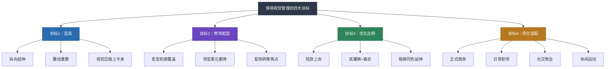
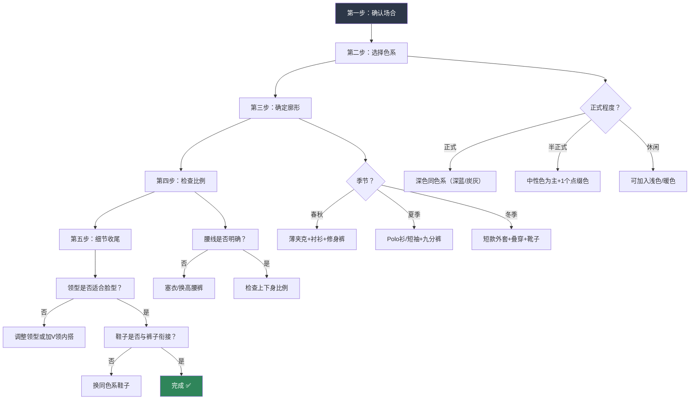
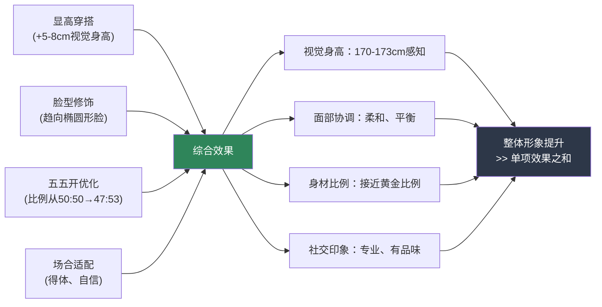

## 小结：四大方案的整合与行动指南

前面四节分别从**显高穿搭**、**脸型修饰**、**五五开身材优化**和**场合穿搭**四个维度，为你的身材特点（普通身高、正常体重、五五开、颧骨突出、方形脸）提供了系统化的解决方案。本节将这四条线索整合为一套完整的穿搭决策框架，帮助你在面对任何穿搭场景时，能够快速、自信地做出最优选择。

### 一、四大方案的核心逻辑回顾

四大方案并非孤立存在，它们共享同一套底层视觉原理，只是应用场景不同：

#### 1.1 每个方案的核心策略一句话总结

| 方案 | 核心问题 | 一句话策略 | 效果量化 |
|------|---------|-----------|---------|
| 显高穿搭 | 普通身高偏矮 | 纵向延伸 + 腰线重置 + 避免水平切割 | 视觉显高5-8cm |
| 修饰脸型 | 颧骨突出、方形脸 | 上宽下宽中间收 + 发型覆盖 + 领型柔化 | 面部视觉趋向椭圆形 |
| 五五开优化 | 上下半身等长 | 短款上衣 + 高腰裤 + 鞋裤同色 | 比例从50:50优化至47:53 |
| 场合适配 | 不同场景需求不同 | 基础公式 + 正式度调节 | 覆盖95%生活场景 |

#### 1.2 四大方案的交集与协同

这四个方案之间存在大量交集——同一个穿搭技巧往往同时服务于多个目标。理解这些交集，能让你用最少的动作实现最大的效果：

| 穿搭技巧 | 显高 | 修饰脸型 | 五五开优化 | 场合适配 |
|---------|:----:|:-------:|:--------:|:-------:|
| V领上衣 | ✅ 纵向延伸 | ✅ 柔化颧骨 | ✅ 压缩上半身 | ✅ 多场景适用 |
| 短款上衣塞入裤中 | ✅ 腰线重置 | — | ✅ 核心技巧 | ✅ 正式/休闲均可 |
| 同色系鞋裤 | ✅ 腿部延伸 | — | ✅ 延伸下半身 | ✅ 多场景适用 |
| 纹理短发 | ✅ 降低头部占比 | ✅ 首选发型 | — | ✅ 全场景通用 |
| 修身直筒裤 | ✅ 纵向线条 | — | ✅ 腿型优化 | ✅ 百搭单品 |
| 深色系穿搭 | ✅ 视觉收缩 | — | ✅ 上深下浅调节 | ✅ 安全色系 |

**关键洞察**：当你穿上一件V领短款深色上衣，搭配高腰修身裤和同色系鞋子时，你同时在执行显高、五五开优化和脸型修饰三个策略。这就是为什么掌握底层原理比死记搭配公式更重要——原理内化后，你可以自由组合。

### 二、穿搭决策流程图

面对任何一个穿搭场景，按以下五步流程决策：

#### 2.1 第一步：确认场合——决定正式度区间

场合决定了你穿搭的正式度上限和下限。偏离场合的穿搭，无论多好看都是失败的。

| 场合 | 正式度（1-10） | 核心公式 | 绝对禁忌 |
|------|:-------------:|---------|---------|
| 正式商务会议 | 8-9 | 深色西装+白衬衫+领带+皮鞋 | 牛仔裤、运动鞋、无领上衣 |
| 一般职场 | 5-7 | 衬衫/Polo+休闲西裤+乐福鞋 | 卫衣、短裤、人字拖 |
| 社交聚会 | 4-6 | 合身上衣+修身裤+干净鞋子 | 过于正式的全套西装 |
| 约会 | 5-7 | 针织衫/V领+修身裤+小白鞋 | 过于随意的运动装 |
| 休闲运动 | 2-4 | 舒适为主，保持整洁 | 西装革履 |
| 面试 | 6-8 | 比目标公司高一个等级 | 过于花哨的颜色和配饰 |

#### 2.2 第二步：选择色系——同色系是安全牌

对你的身材而言，同色系穿搭是效果最确定的策略。以下是五套经过验证的色系方案：

| 色系方案 | 上装 | 下装 | 鞋子 | 适用季节 | 显高指数 |
|---------|------|------|------|---------|:-------:|
| 全黑体系 | 黑色V领T恤/针织衫 | 黑色修身直筒裤 | 黑色运动鞋/切尔西靴 | 四季 | ★★★★★ |
| 深蓝体系 | 深蓝V领Polo衫 | 深蓝修身牛仔裤 | 深蓝/黑色运动鞋 | 四季 | ★★★★☆ |
| 灰色渐变 | 浅灰V领毛衣 | 中灰修身直筒裤 | 深灰运动鞋/靴子 | 秋冬 | ★★★★☆ |
| 卡其/棕体系 | 浅卡其休闲衬衫 | 深卡其/棕色休闲裤 | 棕色切尔西靴 | 秋冬 | ★★★☆☆ |
| 军绿体系 | 军绿短款工装夹克 | 深军绿修身工装裤 | 黑色工装靴 | 秋冬 | ★★★☆☆ |

**配色安全法则**：如果你对色彩搭配没有把握，遵循"全身不超过三个颜色"的铁律，并且确保鞋子和腰带颜色一致。

#### 2.3 第三步：确定廓形——合身是第一优先级

无论什么风格、什么场合，**合身**是一切的前提。以下是合身度的检查清单：

| 部位 | 合身标准 | 常见问题 | 你的注意事项 |
|------|---------|---------|------------|
| 肩线 | 肩缝落在肩膀边缘 | 肩线滑落→衣服偏大 | 普通身高选S或M码，看肩宽数据 |
| 胸围 | 贴合但不紧绷，能插入一个拳头 | 过紧显胖，过松显邋遢 | 正常体重选修身版型（Slim Fit） |
| 衣长 | 下摆到腰带位置 | 过长遮挡腰线→显矮 | T恤衣长66-68cm，外套70-72cm |
| 裤长 | 裤脚刚好到鞋面或露出脚踝 | 堆叠→显腿短 | 九分裤或刚好盖住鞋面 |
| 裤围 | 修身但不紧贴大腿 | 过紧暴露腿型，过松显腿粗 | 直筒或微锥形裤型最佳 |

#### 2.4 第四步：检查比例——五五开的最终校验

穿好衣服后，站在全身镜前，检查以下三个比例指标：

1. **腰线位置**：腰带或衣服下摆形成的水平线，是否在肚脐以上3-5cm？如果在肚脐以下，说明腰线不够高
2. **上下身颜色分割**：如果上下身颜色不同，分割线是否偏下？分割线越低，上半身看起来越长
3. **鞋裤衔接**：鞋子和裤子之间是否有明显的颜色断层？理想状态是鞋子和裤子颜色接近，形成流畅的纵向线条

#### 2.5 第五步：细节收尾——脸型与配饰

全身搭配完成后，回到面部区域做最终调整：

- **领型检查**：是否为V领、小圆领或衬衫领？避免高领和窄领
- **发型检查**：头顶是否有蓬松感？两侧是否避免了完全推光？
- **配饰检查**：眼镜是否为椭圆形或圆角矩形？避免方形尖角镜框
- **整体平衡**：面部区域的视觉重量是否与身体协调？

### 三、30天穿搭升级行动计划

理论再好，不落地就是空谈。以下是将四大方案转化为日常习惯的30天行动路线图：

#### 第一周：基础建设（Day 1-7）

| 天数 | 行动 | 预计耗时 | 目标 |
|:----:|------|:-------:|------|
| Day 1 | 清理衣橱：淘汰所有不合身、起球、变形的衣服 | 1-2小时 | 精简衣橱，明确缺口 |
| Day 2 | 测量身体数据：肩宽、胸围、腰围、臀围、裤长 | 30分钟 | 建立个人尺码档案 |
| Day 3 | 购入第一条高腰修身直筒裤（深色） | 1小时 | 解决五五开优化的基础单品 |
| Day 4 | 学习三种塞衣方法（全塞、前塞、侧塞），对着镜子练习 | 30分钟 | 掌握腰线重置的核心技巧 |
| Day 5 | 购入2件V领上衣（一深一浅） | 1小时 | 同时服务显高和脸型修饰 |
| Day 6 | 尝试第一套同色系搭配（全黑或深蓝体系） | 30分钟 | 验证同色系的显高效果 |
| Day 7 | 拍照记录本周穿搭，对比Day 1和Day 6的效果 | 15分钟 | 建立穿搭记录习惯 |

#### 第二周：脸型优化（Day 8-14）

| 天数 | 行动 | 预计耗时 | 目标 |
|:----:|------|:-------:|------|
| Day 8 | 找理发师沟通纹理短发方案，参考本章发型参数 | 1小时 | 解决脸型修饰的第一步 |
| Day 9 | 学习发蜡/发泥的使用方法，练习吹风造型 | 30分钟 | 掌握发型打理技能 |
| Day 10 | 评估现有眼镜是否适合脸型，必要时试戴椭圆形镜框 | 1小时 | 配饰对脸型的辅助修饰 |
| Day 11 | 整理领型库存：现有上衣中哪些是V领/圆领，哪些是高领/窄领 | 30分钟 | 淘汰不适合脸型的领型 |
| Day 12 | 尝试"发型+V领+同色系"的完整组合 | 30分钟 | 验证脸型修饰的综合效果 |
| Day 13 | 向信任的朋友展示搭配变化，收集真实反馈 | 30分钟 | 获取外部视角的客观评价 |
| Day 14 | 拍照记录，与Day 7对比 | 15分钟 | 观察两周进步 |

#### 第三周：场合拓展（Day 15-21）

| 天数 | 行动 | 预计耗时 | 目标 |
|:----:|------|:-------:|------|
| Day 15 | 整理未来两周的日程，标记所有需要不同着装的场合 | 30分钟 | 明确场合需求 |
| Day 16 | 按照场合穿搭方案，为每个场合准备一套完整搭配 | 1小时 | 建立场合穿搭模板库 |
| Day 17 | 购入一双百搭鞋（白色运动鞋或深色切尔西靴） | 1小时 | 鞋子是场合切换的关键变量 |
| Day 18 | 尝试正式商务场合的搭配方案 | 30分钟 | 验证正装的合身度和比例 |
| Day 19 | 尝试社交聚会场合的搭配方案 | 30分钟 | 验证休闲搭配的舒适度 |
| Day 20 | 尝试约会场景的搭配方案 | 30分钟 | 验证针织衫+修身裤的组合 |
| Day 21 | 拍照记录三套场合搭配，建立个人搭配相册 | 30分钟 | 形成可复用的搭配库 |

#### 第四周：内化习惯（Day 22-30）

| 天数 | 行动 | 预计耗时 | 目标 |
|:----:|------|:-------:|------|
| Day 22 | 建立"前一晚选衣"的习惯，提前搭配好第二天的衣服 | 10分钟/天 | 减少早上决策疲劳 |
| Day 23 | 学习叠穿技巧（衬衫+针织衫、T恤+夹克） | 30分钟 | 增加搭配变化 |
| Day 24 | 购入一件短款夹克或外套 | 1小时 | 完善秋冬搭配体系 |
| Day 25 | 尝试用配饰（手表、项链、围巾）为搭配增添个性 | 30分钟 | 从"穿得对"到"穿得好" |
| Day 26 | 回顾30天穿搭照片，总结最有效的搭配公式 | 30分钟 | 提炼个人最佳搭配 |
| Day 27 | 清理30天内从未穿过的衣服，考虑捐赠或转卖 | 30分钟 | 持续精简衣橱 |
| Day 28 | 制定下一个月的穿搭预算和购物清单 | 30分钟 | 有计划地投资衣橱 |
| Day 29 | 将穿搭决策流程图打印或存入手机，作为日常参考 | 15分钟 | 建立快速决策工具 |
| Day 30 | 总结30天变化，设定下一阶段的穿搭目标 | 30分钟 | 完成闭环，持续迭代 |

### 四、核心技巧速查表

以下是四大方案中最关键的技巧汇总，可作为日常穿搭的快速参考：

#### 4.1 显高技巧速查

| 优先级 | 技巧 | 操作难度 | 效果 | 适用场景 |
|:------:|------|:-------:|:----:|---------|
| ★★★★★ | 上衣塞入裤中 | 极简单 | 显高3-5cm | 全场景 |
| ★★★★★ | 同色系鞋裤 | 简单 | 显高3-4cm | 全场景 |
| ★★★★☆ | 选择短款上衣 | 购物时注意 | 显高2-3cm | 全场景 |
| ★★★★☆ | V领上衣 | 购物时注意 | 显高1-2cm | 全场景 |
| ★★★☆☆ | 增高鞋/厚底鞋 | 简单 | 实际增高2-4cm | 全场景 |
| ★★★☆☆ | 竖条纹面料 | 购物时注意 | 视觉拉长 | 正式/商务 |
| ★★☆☆☆ | 尖头鞋 | 购物时注意 | 腿部延伸 | 正式场合 |

#### 4.2 脸型修饰速查

| 优先级 | 技巧 | 操作 | 避免 |
|:------:|------|------|------|
| ★★★★★ | 纹理短发 | 顶部5-8cm蓬松，两侧渐变推短 | 两侧完全推光、贴头皮的发型 |
| ★★★★☆ | V领/小圆领 | 选择V领针织衫、Polo衫、衬衫 | 高领、窄圆领、立领 |
| ★★★★☆ | 侧分发型 | 自然分线，打破对称 | 中分（加重颧骨对称感） |
| ★★★☆☆ | 椭圆形眼镜 | 圆角矩形或椭圆镜框 | 方形尖角镜框 |
| ★★★☆☆ | 发蜡定型 | 哑光发泥，制造纹理感 | 过于光滑的背头 |

#### 4.3 五五开优化速查

| 优先级 | 技巧 | 效果量化 | 注意事项 |
|:------:|------|:-------:|---------|
| ★★★★★ | 短款上衣+塞衣 | 腰线上移3-5cm | 衣长不超过裤子拉链中部 |
| ★★★★★ | 高腰裤 | 腰线上移3-5cm | 选择中高腰，避免超高腰 |
| ★★★★☆ | 鞋裤同色 | 腿部延伸3-4cm | 深色裤配深色鞋最安全 |
| ★★★★☆ | 修身直筒裤 | 腿型优化 | 避免紧身裤和阔腿裤 |
| ★★★☆☆ | 九分裤 | 露出脚踝显腿长 | 秋冬可配深色袜子 |
| ★★☆☆☆ | 尖头鞋 | 腿部延伸 | 日常场景不太实用 |

#### 4.4 场合穿搭速查

| 场合 | 上装 | 下装 | 鞋子 | 关键细节 |
|------|------|------|------|---------|
| 正式商务 | 深蓝/炭灰西装+白衬衫 | 配套西裤 | 黑色牛津鞋 | 领带到腰带位置，皮鞋擦亮 |
| 日常职场 | 浅蓝衬衫或深色针织衫 | 卡其/深灰休闲西裤 | 棕色乐福鞋 | 前塞法提升腰线 |
| 社交聚会 | 合身V领T恤或深色衬衫 | 修身牛仔裤 | 白色运动鞋 | 解开第一颗扣子 |
| 约会 | V领针织衫或半开领 | 修身深色裤 | 小白鞋或乐福鞋 | 淡香水加分 |
| 休闲运动 | 运动T恤或速干衣 | 束脚裤或运动短裤 | 运动鞋 | 保持整洁即可 |
| 面试 | 比目标公司高一级 | 保守色系 | 皮鞋 | 深蓝/炭灰最安全 |

### 五、常见组合误区与纠正

在整合四大方案时，最容易出现以下冲突和错误：

#### 5.1 误区一：为了显高牺牲所有风格

**错误表现**：全身同色系、塞衣、高腰裤、增高鞋全部堆叠，看起来像"增高套餐"而非自然穿搭。

**纠正方法**：同色系不需要完全一致，可以用同色系的深浅差（如深蓝+浅蓝）来制造层次感。塞衣选择前塞法而非全塞，更自然随意。增高鞋选择内增高而非外增高厚底鞋。

#### 5.2 误区二：忽略脸型只管身材

**错误表现**：精心搭配了显高和优化比例的方案，但发型贴头皮、领型不适合脸型，上半身看起来依然不协调。

**纠正方法**：每次穿搭决策都从领型检查开始。记住一个简单原则：V领几乎适用于所有方形脸型的人。发型是投资回报率最高的单项改善——一个好的发型对整体形象的提升，可能超过三件新衣服。

#### 5.3 误区三：场合错配

**错误表现**：为了追求显高效果，在正式场合穿运动鞋配西裤，或者在休闲场合穿全套西装。

**纠正方法**：场合优先级永远高于身材优化。如果场合要求穿西装，就按西装的规则来，在西装的框架内做比例优化（如选择短款西装外套、V领衬衫、同色系鞋裤）。如果场合要求休闲，就按休闲的规则来，用前塞法和修身裤做基础优化。

#### 5.4 误区四：过度关注单点而忽略整体

**错误表现**：花了大量精力选对了上衣和裤子，但鞋子随便穿了一双不搭配的运动鞋，或者腰带颜色和鞋子完全不搭。

**纠正方法**：穿搭是一个系统工程。每次出门前，从头到脚检查一遍：发型→领型→上衣→腰线→裤子→鞋子→配饰。任何一个环节的疏忽都可能破坏整体效果。

### 六、从"知道"到"做到"的关键心态

穿搭提升的最大障碍不是知识不足，而是执行不力。以下是帮助你持续执行的三个心态原则：

#### 6.1 二八法则：先搞定20%的核心动作

不需要一次性掌握所有技巧。以下三个动作占据了80%的效果：

1. **塞衣**：每天花5秒钟把上衣前塞入裤中，立刻提升腰线
2. **选对领型**：买衣服时优先选V领，淘汰衣橱里的高领和窄领
3. **鞋裤同色**：出门前确认鞋子和裤子颜色接近

先让这三个动作成为本能，再逐步扩展到其他技巧。

#### 6.2 拍照复盘：建立穿搭反馈回路

每天用手机拍一张全身照（不需要发朋友圈，自己看就行）。一周后回顾这七张照片，你会发现：

- 哪些搭配看起来最好——记下来，下次重复
- 哪些搭配看起来不对——分析原因，下次避免
- 自己的进步轨迹——从Day 1到Day 30的变化会非常明显

这种可视化的反馈回路，比任何理论都能更快地提升你的穿搭直觉。

#### 6.3 渐进迭代：不要试图一步到位

穿搭风格的改变是一个渐进过程。如果你明天突然从"运动裤+卫衣"变成"西装革履"，不仅你自己不自在，周围的人也会觉得奇怪。

正确的节奏是：

- **第一个月**：掌握基础技巧（塞衣、同色系、合身度），淘汰不合身的衣服
- **第二个月**：优化脸型相关（发型、领型、眼镜），购入2-3件核心单品
- **第三个月**：建立场合穿搭模板，形成稳定的日常搭配习惯
- **三个月后**：在稳定基础上尝试更多风格变化，逐步形成个人品味

### 七、四大方案的协同效果：整体大于部分之和

当你同时执行四大方案时，效果不是简单的相加，而是指数级的放大。一个穿对了衣服的人给人的整体印象，远好于"只显高但脸型没修饰"或"脸型修饰了但比例没优化"的效果。

这就是为什么值得花时间系统性地学习穿搭——每一个单项技巧的提升都是有限的，但当它们协同工作时，产生的综合效果远超你的预期。

**最后记住一句话**：最好的穿搭方案是你能够持续执行的方案。不需要一次性全部实施，从最容易的开始——塞衣、选V领、鞋裤同色——逐步优化，让穿搭成为一种自然而然的习惯，而非每天的负担。
