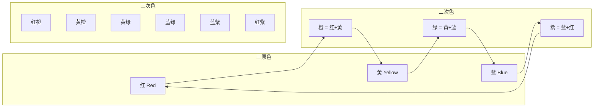

## 一、色彩理论

色彩是穿搭的第一语言。在你说话之前，别人已经通过你身上的颜色对你做出了判断——你的职业、性格、情绪状态、甚至收入水平。掌握色彩理论不是为了成为画家，而是为了掌控这种无声的表达。

本章从色彩的物理本质出发，经过个人色彩诊断，最终落脚到可直接套用的配色公式。无论你是穿搭小白还是进阶玩家，都能找到对应的层级内容。

---

### 1.1 色彩的基本概念

#### 色轮与色彩体系

色轮（Color Wheel）是理解色彩关系的基础工具，由12种基本颜色组成：

- **三原色**：红、黄、蓝——无法通过其他颜色混合得到，是所有色彩的起点
- **二次色（间色）**：橙（红+黄）、绿（黄+蓝）、紫（蓝+红）——由两种原色等量混合
- **三次色（复色）**：由相邻的原色和二次色混合而成，如红橙、黄绿、蓝紫等——共6种

色轮的价值在于它直观地呈现了颜色之间的关系：相邻的颜色天然和谐，相对的颜色形成对比。这不是审美偏好，而是人眼视锥细胞的工作机制决定的。

#### 色彩三属性

每种颜色都可以从三个维度来描述，这三个维度共同决定了一个颜色的"身份"：

| 属性 | 英文 | 定义 | 穿搭意义 |
|------|------|------|----------|
| 色相 | Hue | 颜色的名称（红、蓝、黄等） | 决定搭配的基调和情绪 |
| 明度 | Value/Brightness | 颜色的明暗程度 | 决定层次感和身形效果 |
| 饱和度 | Saturation | 颜色的鲜艳程度 | 决定高级感和搭配难度 |

**色相（Hue）**：色相是我们区分不同颜色的最直接依据。暖色调（红橙黄）给人亲近感，冷色调（蓝绿紫）给人距离感。但色相并不是穿搭中最重要的因素——很多人过度关注"穿什么颜色"，而忽略了明度和饱和度。

**明度（Value）**：白色明度最高，黑色明度最低。明度是穿搭中影响最大的属性，原因有二：第一，明度差异创造了视觉层次，同一色相不同明度的组合（如浅蓝+深蓝）是最安全也最高级的搭配方式；第二，明度直接影响身形的视觉效果——深色收缩、浅色膨胀，这比色相的选择更能影响你看起来胖还是瘦。

**饱和度（Saturation）**：饱和度越高颜色越鲜艳，越低则越灰暗。低饱和度的颜色（如莫兰迪色系、大地色系）比高饱和度的颜色更显高级，原因在于：高饱和度颜色在自然界中较少出现大面积存在，人眼对它们更敏感，容易产生视觉疲劳；而低饱和度颜色更接近自然环境中的色彩，视觉上更舒适、更"沉稳"。

> **核心认知**：在穿搭中，明度和饱和度的影响力远大于色相。一个高级的配色方案，往往不是靠鲜艳的颜色取胜，而是靠明度和饱和度的巧妙搭配。这也是为什么时尚达人偏爱"高级灰"色调——它们的饱和度较低，色相之间不会产生强烈冲突。

#### 冷暖色调与中性色

色彩可以分为冷色调、暖色调和中性色三大类：

**暖色调**（红、橙、黄及其衍生色）：给人温暖、活力、热情的感觉。暖色调服装适合营造亲切、随和的形象，在社交场合中更容易拉近与他人的距离。但大面积暖色调在正式商务场合可能显得不够严肃。

**冷色调**（蓝、绿、紫及其衍生色）：给人冷静、专业、沉稳的感觉。冷色调服装适合营造专业、可靠的形象，在职场和正式场合中更具说服力。深蓝色在商务领域的地位相当于"万能色"。

**中性色**（黑、白、灰、棕、米、卡其）：穿搭中最重要的基础色群。中性色的最大优势是百搭——它们几乎可以与任何颜色搭配而不显突兀，是构建衣橱的基石。

> **衣橱比例建议**：中性色应占据衣橱的60-70%。剩余30-40%分配给你的季节色彩中的强调色和点缀色。这个比例适用于绝大多数人和绝大多数生活场景。

#### 色彩的视觉效果

颜色不仅有冷暖之分，还有前进/后退、膨胀/收缩的视觉效果。这是由人眼对不同波长光线的聚焦差异决定的，不是主观感受：

| 效果 | 颜色特征 | 视觉感受 | 穿搭应用 |
|------|----------|----------|----------|
| 前进/膨胀 | 暖色、高明度、高饱和 | 显大、显近、显突出 | 用于想强调的部位 |
| 后退/收缩 | 冷色、低明度、低饱和 | 显小、显远、显收敛 | 用于想弱化的部位 |

**实用场景**：

- **想显瘦**：将收缩色穿在你希望"缩小"的部位。最常见的是深色下装+浅色上装，视觉上收窄下半身
- **想显高**：上下身使用同一色系（尤其是深色系），避免水平切割线。裤鞋同色是显高的经典技巧
- **想突出上半身**：上装使用暖色或浅色，下装使用冷色或深色
- **想弱化肩宽**：上装选择深色、冷色，避免浅色和横条纹
- **想增加下半身分量**：下装选择浅色、暖色，如浅卡其、白色牛仔裤

#### 色彩心理学

颜色对人的心理和情绪有直接影响。这不是玄学，而是有神经科学研究支撑的——不同波长的光会刺激大脑不同区域，产生不同的情绪反应。

| 颜色 | 心理联想 | 适合场景 | 使用注意 |
|------|----------|----------|----------|
| 黑色 | 权威、神秘、正式、力量 | 需要展现权威的场合 | 全黑易显沉闷，需注重面料质感差异 |
| 白色 | 纯洁、干净、简洁、开放 | 几乎所有场合的上装 | 注意面料厚度，避免透视 |
| 灰色 | 中立、平衡、成熟、知性 | 商务、创意行业 | 深灰比浅灰更显瘦更正式 |
| 深蓝 | 专业、可靠、信任、深度 | 商务场合首选 | 比黑色更友善，比浅色更权威 |
| 棕/驼色 | 温暖、自然、可靠、接地气 | 休闲社交、秋冬季节 | 黄皮肤慎用大面积驼色靠近脸部 |
| 红色 | 热情、自信、能量、权力 | 需要关注和影响力的场合 | 最强视觉冲击力，小面积点缀为佳 |
| 绿色 | 自然、和谐、平衡、成长 | 创意行业、户外场合 | 橄榄绿比荧光绿更适合穿搭 |
| 紫色 | 创意、神秘、高贵、独特 | 艺术活动、创意场合 | 较难驾驭，小面积点缀更安全 |

---

### 1.2 个人色彩分析

#### 为什么要了解自己的色彩

个人色彩分析（Personal Color Analysis）是根据你的肤色、发色、瞳孔色等自然特征，确定最适合你的颜色范围。这套理论起源于20世纪80年代，由美国色彩顾问Carolle Jackson在其著作《Color Me Beautiful》中系统化提出。

了解个人色彩的实际价值：

1. **减少试错成本**：你知道哪些颜色穿在身上一定好看，哪些一定踩雷，购买效率大幅提升
2. **提升气色**：合适的颜色会让你肤色均匀、气色红润；不合适的颜色会让你面色蜡黄、黑眼圈加重
3. **建立个人风格**：当你的颜色范围确定后，你的衣橱自然会形成统一的色彩体系，搭配变得轻松

#### 四季色彩理论

最经典的个人色彩分析体系是"四季色彩理论"，将人的自然色彩特征分为四个季节类型：

**春季型（Spring）**

春季型人的整体印象是"温暖而明亮"，像春天盛开的花朵。

- **肤色特征**：偏暖，带有金色或蜜桃色底调；皮肤薄透，容易看到红晕
- **发色特征**：偏浅，常见浅棕、金棕、红棕、栗色
- **瞳孔特征**：较浅，常见浅棕、绿色、浅蓝、琥珀色
- **适合色**：暖调的明亮色——珊瑚橙、暖黄、草绿、浅驼色、蜜桃粉、亮红、暖白（奶白而非纯白）
- **不适合**：过于灰暗或冰冷的颜色——纯黑、深灰、冷粉、薰衣草紫
- **穿搭关键词**：清新、活力、明亮、温暖
- **面料建议**：适合有光泽感的面料，如丝质、缎面，能衬托出春季型人的明亮气质

**夏季型（Summer）**

夏季型人的整体印象是"柔和而优雅"，像夏日傍晚的薰衣草田。

- **肤色特征**：偏冷，带有粉调或蓝调底色；皮肤细腻，不易晒黑
- **发色特征**：偏灰，常见灰棕、深灰、灰黑
- **瞳孔特征**：较浅且偏灰，常见灰蓝、灰绿、浅灰棕
- **适合色**：冷调的柔和色——薰衣草紫、玫瑰粉、灰蓝、鼠尾草绿、莓果色、柔白（珍珠白）
- **不适合**：过于饱和或暖调的颜色——橙色、暖黄、铁锈红、焦糖色
- **穿搭关键词**：柔和、优雅、精致、知性
- **面料建议**：适合柔软、有垂坠感的面料，如羊绒、真丝、雪纺，与夏季型的柔和气质匹配

**秋季型（Autumn）**

秋季型人的整体印象是"沉稳而浓郁"，像秋天的落叶和暖阳。

- **肤色特征**：偏暖，带有金色或橄榄色底调；皮肤质感厚实，容易晒黑
- **发色特征**：偏深，常见深棕、黑棕、红棕、铜色
- **瞳孔特征**：较深，常见深棕、深绿、琥珀色
- **适合色**：暖调的深沉色——铁锈红、橄榄绿、芥末黄、焦糖棕、深橙、酒红、暖米色
- **不适合**：过于明亮或冷调的颜色——亮粉、电光蓝、薰衣草紫、纯白
- **穿搭关键词**：沉稳、温暖、自然、厚重
- **面料建议**：适合有质感和纹理的面料，如粗花呢、灯芯绒、麂皮，与秋季型的厚重气质匹配

**冬季型（Winter）**

冬季型人的整体印象是"鲜明而强烈"，像雪地里的红梅。

- **肤色特征**：偏冷，带有蓝调或粉调底色；皮肤对比度高
- **发色特征**：深且对比强烈，通常是纯黑或深黑
- **瞳孔特征**：深且清晰，常见深棕、黑色、深蓝
- **适合色**：冷调的高对比色——纯白、正红、宝蓝、翠绿、纯黑、酒红、亮粉、电光蓝
- **不适合**：过于柔和或暖调的颜色——驼色、焦糖色、暖黄、柔和的粉色
- **穿搭关键词**：鲜明、对比、大气、力量
- **面料建议**：适合有光泽和对比感的面料，如皮革、丝绒、高支棉，与冬季型的强烈气质匹配

#### 16季色彩理论

四季色彩理论虽然经典，但粒度较粗。近年来被进一步细化为16季体系，每个季节被分为"纯（True/Pure）"、"亮（Bright）"、"柔（Soft）"、"深（Deep/Dark）"四个子类型：

| 季节 | 子类型 | 特征 | 代表色 |
|------|--------|------|--------|
| 春 | 浅春 Light | 最浅的春季型 | 浅桃、浅金、浅绿 |
| 春 | 暖春 Warm | 标准春季型 | 珊瑚、暖黄、草绿 |
| 春 | 亮春 Bright | 春季型中最鲜艳的 | 亮橘、亮蓝、翠绿 |
| 夏 | 浅夏 Light | 最浅的夏季型 | 浅蓝、浅紫、浅灰 |
| 夏 | 柔夏 Soft | 夏季型中最柔和的 | 灰粉、灰蓝、灰绿 |
| 夏 | 冷夏 Cool | 标准夏季型 | 玫瑰粉、薰衣草、冷蓝 |
| 秋 | 暖秋 Warm | 标准秋季型 | 铁锈红、焦糖、芥末黄 |
| 秋 | 柔秋 Soft | 秋季型中最柔和的 | 灰棕、柔绿、灰驼 |
| 秋 | 深秋 Deep | 秋季型中最深的 | 深棕、深橄榄绿、酒红 |
| 冬 | 冷冬 Cool | 标准冬季型 | 纯白、正红、宝蓝 |
| 冬 | 深冬 Deep | 冬季型中最深的 | 墨黑、深紫、深红 |
| 冬 | 亮冬 Bright | 冬季型中最鲜明的 | 纯白、纯黑、电光蓝 |

16季体系的优势在于精确度更高，劣势在于边界更模糊，自测难度更大。对于大多数人来说，先确定季节大类（春夏秋冬），再逐步细化子类型是比较务实的路径。

> **专业诊断建议**：如果预算允许（500-2000元），建议前往专业的形象顾问机构进行一对一测试。专业诊断会在标准光源下用色布进行对比，准确率远高于自测。测试结果通常包含详细的色彩报告和搭配建议。

#### 快速自我诊断方法

如果暂时不想花钱做专业诊断，可以通过以下方法进行初步判断：

**步骤一：判断冷暖**

在自然光下（不是室内日光灯），将金色和银色的布料或首饰分别靠近脸部：

- 金色更衬肤色 → 偏暖（春季型或秋季型）
- 银色更衬肤色 → 偏冷（夏季型或冬季型）
- 都还行 → 可能是中性色调，需要进一步测试

**步骤二：判断深浅**

观察自己的头发和眼睛的颜色深度：

- 发色浅、瞳孔色浅 → 偏浅（春季型或夏季型）
- 发色深、瞳孔色深 → 偏深（秋季型或冬季型）

**步骤三：判断对比度**

观察肤色与发色之间的对比度：

- 对比强烈（白皮肤+黑头发）→ 冬季型
- 对比柔和（肤色和发色接近）→ 夏季型
- 暖调+高对比（暖白皮+浅棕发）→ 春季型
- 暖调+低对比（暖黄皮+深棕发）→ 秋季型

**辅助判断方法**：

- 观察晒后反应：容易晒伤不易晒黑 → 冷色调；容易晒黑不易晒伤 → 暖色调
- 观察静脉颜色：手腕静脉偏蓝紫 → 冷色调；偏绿 → 暖色调
- 白纸测试：在自然光下将白纸放在脸旁，如果肤色看起来偏黄 → 暖色调，偏粉 → 冷色调

#### 不同肤色的通用色彩建议

**偏黄肤色（东亚人最常见）**：

- 安全色：海军蓝、深灰、白色、米色、酒红、深绿
- 避免色：大面积黄色、橙色、军绿、驼色（会让肤色更显黄）
- 提亮技巧：在靠近脸部使用冷色调（如浅蓝、白色），可以中和肤色的黄调
- 进阶技巧：选择"有蓝底"的颜色，如宝蓝而非湖蓝，冷粉而非珊瑚粉

**偏白肤色**：

- 适合色：几乎所有颜色都适合，特别是深色和鲜艳色
- 特别推荐：深蓝、酒红、翠绿、珊瑚粉
- 注意：过于浅淡的颜色（如浅黄、浅粉）可能让面部显得苍白无血色

**偏黑肤色**：

- 适合色：高饱和度的纯色——纯白、正红、宝蓝、明黄
- 避免色：浅灰、卡其色、浅粉色（会显得肤色更暗沉）
- 提亮技巧：选择明度高的颜色作为上装，避免全身暗色
- 进阶技巧：金属色（金色、铜色）在偏黑肤色上有极好的效果

---

### 1.3 色彩搭配法则

掌握了色彩基础和个人色彩定位后，以下是系统化的色彩搭配方法。每种方法都有明确的适用场景和操作要点。

#### 单色搭配法（Monochromatic）

使用同一色相的不同明度和饱和度进行搭配。

- **操作方法**：选择一个基础色相，然后用这个色相的深、中、浅三个层次来搭配。例如：深蓝西装 + 浅蓝衬衫 + 蓝色领带，或者浅灰毛衣 + 深灰裤子 + 灰色鞋
- **优点**：最安全、最显高级，还能在视觉上拉长身形
- **适用场景**：正式场合、身材优化（显高显瘦）、极简风格
- **进阶技巧**：选择不同材质来增加层次感——棉质上衣 + 毛料裤子 + 皮质鞋子，即使颜色相同，不同材质的光泽和质感差异也会创造出丰富的视觉效果
- **常见错误**：全身同一明度同一饱和度，看起来像"穿了制服"。解决方法是确保至少有2个明度层级的差异

#### 互补色搭配法（Complementary）

使用色轮上相对的两种颜色进行搭配：蓝+橙、红+绿、黄+紫。

- **操作方法**：确定主色（占80%面积），用互补色做点缀（占20%面积）。例如：深蓝西装+橙色口袋巾，而非蓝衬衫+橙裤子
- **优点**：视觉冲击力强，引人注目，适合需要展现创意和活力的场合
- **降低风险**：选择低饱和度版本的互补色（如深蓝+暗橙），比高饱和度版本更容易驾驭
- **常见错误**：两种互补色各占50%，看起来像"番茄炒蛋"。关键在于比例控制——主色压倒性地多，互补色只是点缀

#### 类似色搭配法（Analogous）

使用色轮上相邻的2-3种颜色进行搭配：蓝+蓝绿+绿，或红+红橙+橙。

- **操作方法**：选择一个主色，搭配它左右各一个相邻色。例如：蓝色毛衣+蓝绿色围巾+深蓝裤子
- **优点**：和谐自然，有层次感但不突兀
- **适用场景**：商务休闲、日常搭配、任何需要和谐感的场合
- **进阶技巧**：类似色之间通过面积比例来创造层次——主色60%，辅色30%，点缀色10%

#### 分裂互补搭配法（Split-Complementary）

选择一个主色，然后搭配其互补色两侧的颜色。例如：蓝色 + 黄橙 + 红橙。

- **操作方法**：先在色轮上找到主色的互补色，然后用互补色两边的颜色替代直接互补色
- **优点**：既有互补色的视觉张力，又比直接互补色更柔和、更易驾驭
- **适用场景**：需要个性但不想过于突兀的场合

#### 三角搭配法（Triadic）

使用色轮上等距的三种颜色进行搭配：红+黄+蓝。

- **操作方法**：三种颜色的饱和度都应该降低，或选择一种为主色、其他两种为小面积点缀
- **优点**：丰富多彩，充满活力
- **适用场景**：创意行业、艺术活动、节日场合
- **常见错误**：三种高饱和色各占1/3，看起来像"小丑"。务必控制比例——一个主色、两个辅色

#### 无彩色搭配法（Achromatic）

使用黑、白、灰三种无彩色进行搭配。

- **操作方法**：通过面料质感和剪裁来创造层次，而非颜色
- **优点**：永不过时，极简高级，不需要考虑色彩和谐问题
- **注意事项**：全黑搭配需要注重面料质感的差异（如哑光棉+亮面皮），避免沉闷；全白搭配需要注意面料的厚薄和透明度
- **适用场景**：极简风格、正式场合、创意行业

#### 比例法则：60-30-10

无论使用哪种搭配法则，面积比例都是决定成败的关键。最经典的配色比例是 **60-30-10**：

- **60%**：主色，通常是外套/裤子/大面积服装
- **30%**：辅色，通常是上装/内搭
- **10%**：点缀色，通常是配饰（围巾、领带、包、鞋、首饰）

这个比例之所以有效，是因为它模仿了自然界中色彩的分布规律——大面积的背景色+中面积的主体色+小面积的强调色。违反这个比例（如三种颜色各占1/3）会产生视觉上的混乱感。

---

### 1.4 面料与色彩的交互

很多人忽略了一个事实：同一种颜色在不同面料上呈现的效果完全不同。

#### 面料质感对色彩的影响

| 面料类型 | 对色彩的影响 | 适合的颜色 | 穿搭效果 |
|----------|-------------|-----------|----------|
| 丝绸/缎面 | 增加光泽和深度，颜色更饱满 | 深色、宝石色 | 华丽、高级 |
| 棉质 | 颜色最"真实"，接近色卡 | 所有颜色 | 自然、日常 |
| 羊毛/羊绒 | 颜色偏柔和，有哑光质感 | 莫兰迪色、大地色 | 温暖、高级 |
| 皮革 | 增加深度和反光，颜色更酷 | 黑色、棕色、深色 | 酷感、力量 |
| 雪纺/纱质 | 颜色变浅变透，轻盈感 | 浅色、柔和色 | 柔美、浪漫 |
| 牛仔 | 颜色偏暗偏旧，有岁月感 | 蓝色系、深色 | 休闲、随性 |
| 针织 | 颜色偏暗，有纹理感 | 中性色、大地色 | 温暖、慵懒 |

**实际应用**：

- 想让一个颜色看起来更"贵"？选择有光泽感的面料（丝绸、缎面、高支棉）
- 想让一个颜色看起来更"低调"？选择哑光面料（棉麻、粗花呢、羊绒）
- 想让深色不沉闷？选择有纹理差异的面料组合（如光面皮带+哑光棉裤+磨砂皮鞋）

#### 条纹与图案中的色彩

纯色搭配是最安全的，但现实中你的衣橱不可能全是纯色。图案中的色彩搭配有额外的规则：

- **图案中至少有一个颜色是你的安全色**（通常是中性色）
- **图案中的强调色应该与你的其他单品呼应**——例如格纹衬衫中的蓝色条纹，应该与你的裤子或外套中的蓝色一致
- **图案越复杂，其他单品越简单**——花衬衫配纯色裤子，而非花衬衫配条纹裤
- **图案的大小影响视觉效果**：大图案显膨胀，小图案显收缩；竖条纹显高，横条纹显宽（但细横条纹的收缩效果其实也不错）

---

### 1.5 光线与环境对色彩的影响

同一件衣服在不同光线下可能看起来完全不同。这不是错觉，而是光源色温的物理作用。

#### 常见光源的色温影响

| 光源 | 色温 | 对服装颜色的影响 | 应对策略 |
|------|------|-----------------|----------|
| 自然日光（正午） | ~5500K | 最真实，颜色偏差最小 | 购买服装时尽量在自然光下看色 |
| 阴天自然光 | ~6500K | 偏冷，暖色会被削弱 | 阴天出门可适当增加暖色 |
| 白炽灯 | ~2700K | 偏暖，冷色会被削弱 | 室内约会穿冷色不会太突兀 |
| 荧光灯 | ~4000K | 偏绿，肤色显差 | 办公室环境避免黄绿色 |
| LED灯 | 3000-6500K | 取决于具体色温 | 无法一概而论，注意观察 |
| 餐厅暖光 | ~2700K | 一切偏暖偏柔 | 正式餐厅适合穿暖色或深色 |

**实用建议**：

- 买衣服时，一定在自然光下确认颜色。商场的灯光通常是暖色调的，会让衣服看起来比实际更暖
- 如果你的主要社交场景是餐厅/酒吧（暖光），暖色调衣服在这些场景中效果更好
- 如果你在日光灯办公室工作，避免穿黄绿色系，因为荧光灯会放大这些色调

---

### 1.6 实用配色公式

以下是一些经过验证的配色公式，涵盖从正式到休闲的主要场景：

#### 商务与职场

| 公式 | 上装 | 下装 | 鞋 | 适用场景 |
|------|------|------|-----|----------|
| 经典商务 | 白色衬衫 | 深蓝/炭灰西裤 | 黑/深棕皮鞋 | 正式商务会议 |
| 权威商务 | 浅蓝衬衫 | 深灰西裤 | 黑色皮鞋 | 演讲、谈判 |
| 商务休闲 | 浅蓝衬衫 | 卡其裤 | 棕色乐福鞋 | 办公室日常 |
| 柔和知性 | 浅粉衬衫 | 灰色西裤 | 灰色/米色鞋 | 职场日常（女性） |
| 稳重亲和 | 浅灰毛衣 | 深蓝西裤 | 深棕皮鞋 | 面试、客户拜访 |

#### 日常与休闲

| 公式 | 上装 | 下装 | 鞋 | 适用场景 |
|------|------|------|-----|----------|
| 周末休闲 | 灰色T恤 | 深蓝牛仔裤 | 白色运动鞋 | 日常出行 |
| 轻松活力 | 白色Polo衫 | 橄榄绿休闲裤 | 棕色帆布鞋 | 周末外出 |
| 大地色调 | 橄榄绿外套 | 卡其裤+白T | 棕色靴子 | 户外休闲 |
| 秋冬温暖 | 驼色毛衣 | 深色牛仔裤 | 棕色切尔西靴 | 休闲社交 |
| 极简高级 | 黑色高领 | 黑色西裤 | 黑色皮靴 | 正式社交、约会 |

#### 配饰点缀

配饰是色彩搭配中的"调味料"——用最小的面积产生最大的效果：

- **口袋巾/丝巾**：在中性色西装上加入一点亮色（如深蓝西装+橙色口袋巾）
- **手表/首饰**：金属色（金/银/玫瑰金）应与你的肤色冷暖匹配——暖皮选金，冷皮选银
- **包袋**：中性色包（黑、棕、米）最百搭；亮色包是整套搭配的"亮点"
- **袜子**：低调时选与裤子同色；张扬时选与领带/口袋巾呼应的颜色

> **黄金法则**：当你不确定怎么配色时，选择"一深一浅"永远不会错——深色下装 + 浅色上装是最安全的组合。进阶一步：中性色为主 + 一个强调色点缀。

---

### 1.7 常见配色误区与纠正

| 误区 | 问题 | 纠正方法 |
|------|------|----------|
| 全身鲜艳色 | 视觉疲劳，像"调色盘" | 全身最多一个鲜艳色，其余用中性色 |
| 黑白灰万能论 | 忽略了个人色彩，错失提升机会 | 黑白灰是安全牌但不是最优解，加入适合自己的彩色 |
| 红绿不能搭 | 误解了互补色法则 | 低饱和红+低饱和绿（如酒红+橄榄绿）非常高级 |
| 深色显瘦就全身黑 | 缺乏层次，反而显得"一团" | 深色为主但要有明度差异，用配饰打破沉闷 |
| 跟风流行色 | 不考虑个人色彩，穿什么颜色都"不对" | 流行色只是一种参考，先确认它是否适合你的季节类型 |
| 忽略配饰色彩 | 配饰颜色与整体不协调 | 配饰颜色应与服装中的某个颜色呼应 |
| 图案混搭失控 | 两种以上图案混搭，视觉混乱 | 图案最多两种，且大小要有差异（大格纹+细条纹） |
| 忽略面料对颜色的影响 | 同色不同面料差异巨大 | 购买前在自然光下看实物，不要只看图片 |

---

### 1.8 进阶：色彩搭配的高级策略

#### 色彩与个人风格的融合

色彩不是孤立存在的，它需要与你的个人风格统一：

- **极简风格**：以中性色为主（黑、白、灰、米），通过面料质感和剪裁创造变化
- **复古风格**：以大地色系为主（棕、驼、墨绿、酒红），搭配复古面料（灯芯绒、粗花呢）
- **街头风格**：可以大胆使用对比色和高饱和色，通过比例和层次来平衡
- **商务精英**：以深蓝、深灰为基础，用白色和浅蓝做内搭，配饰小面积点缀

#### 构建个人色彩体系

经过以上所有分析，你可以建立自己的"个人色卡"：

1. **确定你的季节类型**（春/夏/秋/冬，或更精确的16季）
2. **列出你的10个核心色**：5个中性色（日常基础）+ 3个辅助色（常用搭配）+ 2个点缀色（提亮用）
3. **淘汰不适合的颜色**：把不适合你的颜色从购物清单中彻底删除
4. **按色卡购物**：每次购买前，对照你的色卡确认颜色是否在范围内

> **终极建议**：色彩理论是工具，不是枷锁。规则存在的意义是让你知道什么时候在"安全区"，什么时候在"冒险区"。当你对色彩有了足够的理解和经验，完全可以打破规则——但在此之前，先把规则内的搭配做到极致。

***
