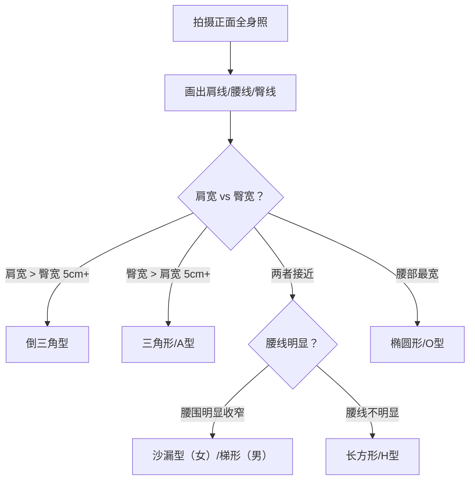
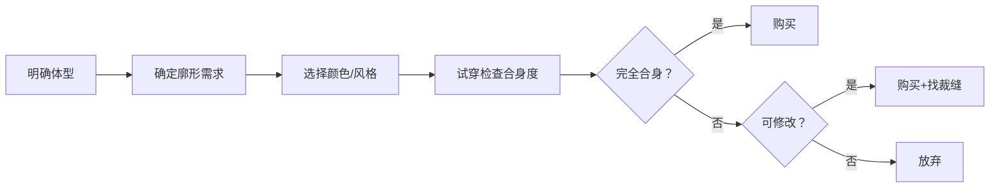

## 二、体型分析

体型分析是穿搭的"地基工程"。色彩理论告诉你什么颜色好看，风格理论告诉你穿什么类型的衣服，但体型分析回答的是最根本的问题——**这件衣服穿在我身上为什么好看/不好看**。不懂体型分析，你买衣服就是在碰运气；掌握了它，你就能从"这件衣服好看"升级到"这件衣服适合我"。

本章从科学测量出发，建立完整的体型认知体系，覆盖男性和女性的所有常见体型，然后深入到身材比例、视觉原理、合身度标准等核心议题，最终让你拥有一套可执行的自我诊断和穿搭优化方法。

### 2.1 体型分类系统

#### 2.1.1 体型分类的科学基础

体型分类并非简单的"胖瘦"二分法，而是基于人体骨骼结构、脂肪分布和肌肉比例的系统化分类。现代体型学有三个经典理论源头：

**威廉·谢尔顿的体型三分类（Somatotype）**：1940年代，哈佛心理学家谢尔顿提出三种基本体型——内胚型（Endomorph，偏圆润，脂肪易堆积）、中胚型（Mesomorph，肌肉发达，骨架大）、外胚型（Ectomorph，瘦长，四肢细）。这个分类虽然最初用于体质人类学研究，但至今仍是理解体型差异的基础框架。

**时尚界的实用分类**：服装设计师和造型师在此基础上发展出了更贴合穿搭需求的分类系统，核心思路是**用几何形状描述身体轮廓**——倒三角、长方形、椭圆形、三角形、沙漏等。这种分类的优势是直观，能快速与服装廓形（Silhouette）对应。

**关键认知**：大多数人的体型并非严格的某一类型，而是**混合型**，比如"微倒三角+略偏长方形"。实际穿搭时，应该先找到自己最接近的主类型，再根据次要特征微调策略。

#### 2.1.2 如何科学测量自己的体型

很多人凭感觉判断体型，但感觉往往不准。以下是两种可靠的自测方法：

**方法一：软尺测量法（推荐）**

准备一根软尺，穿着贴身衣物（或裸体），测量以下四个关键数据：

| 测量部位 | 测量方法 | 记录数据 |
|---------|---------|---------|
| 肩宽 | 从左肩骨外缘量到右肩骨外缘，经过后颈 | ____ cm |
| 胸围 | 经过胸部最高点水平环绕一圈 | ____ cm |
| 腰围 | 腰部最细处（通常在肚脐上方2-3cm）水平环绕一圈 | ____ cm |
| 臀围 | 臀部最宽处水平环绕一圈 | ____ cm |

测量完成后，用以下比值判断体型：

```text
判断逻辑（男性）：
  肩宽 - 臀宽 > 5cm    → 倒三角型倾向
  臀宽 - 肩宽 > 5cm    → 三角形倾向
  腰围 / 胸围 > 0.95   → 椭圆形倾向
  以上差值均 < 5cm      → 长方形型
  肩宽明显 > 臀宽且腰线明显 → 梯形型

判断逻辑（女性）：
  肩宽 ≈ 臀宽，腰围 / 臀宽 < 0.75 → 沙漏型
  臀宽 > 肩宽 > 5cm                 → 梨形
  腰围 / 胸围 > 0.90               → 苹果形
  肩宽 ≈ 腰宽 ≈ 臀宽               → 矩形型
  肩宽 > 臀宽 > 5cm                 → 倒三角型
```

**方法二：镜子拍照法**

如果你没有软尺，可以用拍照法：

1. 穿贴身内衣裤，站在全身镜前
2. 双脚分开与肩同宽，双臂自然下垂
3. 从正面拍一张全身照
4. 在照片上画出三条水平线——肩线、腰线、臀线
5. 观察三条线的宽度关系和上下半身长度比例



**常见误区**：不要只看体重秤上的数字。同样170cm/70kg的人，因为肌肉和脂肪分布不同，体型可能完全不同。体型分析看的是**比例和轮廓**，不是绝对重量。

---

### 2.2 男性体型详解与穿搭策略

#### 2.2.1 倒三角型（V型）

**典型特征**：肩膀明显宽于臀部，胸肌发达，手臂较粗，腰线相对收窄。这类体型在健身人群中最为常见，也包括天生骨架较大的人。

**优势**：倒三角型是公认的"衣架子"身材，穿正装尤其好看。宽阔的肩膀能撑起西装的轮廓，窄腰则让整体比例显得干练有力。

**穿搭目标**：保持上半身的优势感，同时避免上半身视觉过于膨胀导致比例失衡。

| 策略 | 具体操作 | 原因 |
|------|---------|------|
| 强调腰线 | 选择收腰剪裁的上衣，用腰带标记腰线 | 突出V型身材最大的优势——肩宽腰窄的对比 |
| 平衡下半身 | 浅色下装（卡其色、浅灰、白色裤子） | 浅色膨胀，增加下半身视觉宽度 |
| 适度控制上半身 | 合身而非紧身的上衣，避免过度宽大 | 太紧暴露肌肉轮廓显得刻意，太宽浪费身材优势 |
| 选择V领或小圆领 | V领T恤、衬衫解一颗扣 | V领纵向延伸，避免横向过度扩展肩膀 |
| 下装选择直筒或微锥 | 直筒裤、slim fit牛仔裤（非skinny） | 与上半身宽度匹配，整体比例协调 |

**具体避雷**：
- ❌ 垫肩外套：你的肩膀不需要额外加宽，垫肩会让你看起来像橄榄球运动员
- ❌ 过于紧身的polo衫：容易显得"刻意秀身材"，在大多数社交场合不讨好
- ❌ 横条纹上衣：横向扩展肩膀视觉宽度，打破已有的平衡
- ❌ 上浅下深的搭配：会让上半身更膨胀，下半身更窄小

**推荐搭配示例**：
- 商务场景：合身深蓝西装 + 浅蓝衬衫 + 卡其色休闲裤 + 棕色皮鞋
- 休闲场景：合身灰色圆领T恤 + 浅卡其直筒裤 + 白色运动鞋
- 约会场景：深色修身衬衫（袖子挽到前臂）+ 深色牛仔裤 + 切尔西靴

#### 2.2.2 长方形型（H型）

**典型特征**：肩宽和腰宽接近，上下半身宽度差异不大，腰线不够明显。这是亚洲男性中最常见的体型类型之一，大多数不胖不瘦的普通身材都属于这一类。

**优势**：H型身材的最大优势是"百搭"——不会出现某个部位特别突出或特别臃肿的问题，大多数基础款都能穿。劣势是容易穿得"没特色"，看起来像衣架模特而非有个人风格。

**穿搭目标**：创造层次感和腰线，用服装"雕刻"出身体的曲线和结构感。

| 策略 | 具体操作 | 原因 |
|------|---------|------|
| 制造腰线 | 高腰裤 + 塞衣角，或用腰带标记腰部 | 人为创造上下半身的视觉分割点 |
| 增加上半身结构感 | 有肩线设计的外套、牛津衬衫 | 让肩部线条更清晰，制造倒三角的视觉暗示 |
| 利用层次搭配 | 内搭+外搭+下装三层结构 | 层次感让平淡的身材轮廓变得丰富 |
| 选择有"型"的面料 | 棉麻混纺、轻薄羊毛、牛津纺 | 这些面料自带挺括感，帮身体塑形 |
| 色彩分区 | 上深下浅或上浅下深，制造视觉差异 | 打破全身"一样宽一样色"的平淡感 |

**具体避雷**：
- ❌ 全身宽松搭配：H型身材穿Oversize会像穿麻袋，因为没有身体曲线来"撑"出廓形
- ❌ 上下同色同宽：这是H型身材最糟糕的搭配，完全放弃了自己的塑造空间
- ❌ 过于修身的连体衣或紧身搭配：暴露"上下一样宽"的缺点

**H型身材的进阶技巧——层叠穿搭**：

H型身材最适合玩层次感。一个实用公式：

```text
基础公式：修身内搭 + 有结构感的中间层 + 合身外搭

春季：白色T恤 + 牛津衬衫（不扣） + 轻薄夹克
秋季：高领毛衣 + 西装外套 + 大衣
冬季：保暖内衣 + 针织衫 + 羽绒背心 + 大衣（四层）
```

#### 2.2.3 椭圆形型（O型）

**典型特征**：腰腹部最为突出，整体轮廓偏圆润，肩部和臀部宽度接近，四肢相对较细。这类体型在久坐办公族和中年人群中非常常见。

**穿搭目标**：视觉收窄腰腹区域，拉长整体身形线条，让注意力从腰腹部转移开。

| 策略 | 具体操作 | 原因 |
|------|---------|------|
| 深色为主 | 黑色、深灰、藏蓝、深棕 | 深色收缩效果明显，是最直接的显瘦手段 |
| V领优先 | V领毛衣、Polo衫、衬衫解两颗扣 | V领创造纵向线条，拉长躯干，弱化横向宽度 |
| 竖条纹 | 细竖条纹衬衫、竖纹针织衫 | 竖纹产生纵向延伸的视觉错觉 |
| 修身但不紧身 | 略有余量但不宽松的剪裁 | 太紧暴露赘肉轮廓，太宽像帐篷反而更显胖 |
| 合理使用外套 | 西装外套、轻薄风衣 | 外套的结构感能"框"出身体形状，掩盖腰腹曲线 |
| 高腰裤 | 腰带到肚脐或略上方 | 提升腰线位置，避免裤子在腹部最宽处勒出赘肉 |

**O型身材的核心原则——"框"和"拉"**：

"框"是指用有结构感的外套框出身体的矩形轮廓，让腰腹的圆润被外套的直线所替代。"拉"是指用V领、竖条纹、纵向色块等手段拉长视线，让身体看起来更修长而非更宽。

**具体避雷**：
- ❌ 横条纹：视觉横向扩展，让腰部看起来更宽
- ❌ 浅色上衣（尤其在腰部区域）：膨胀效果加重臃肿感
- ❌ 过于紧身的衣服：暴露每一寸赘肉的轮廓
- ❌ 过于宽松的衣服：显得更臃肿，失去身体形状
- ❌ 低腰裤：让躯干看起来更长，腹部更突出
- ❌ 亮色腰带：将注意力直接引导到腰部

**O型身材的面料选择特别重要**：

| 推荐面料 | 原因 | 避免面料 | 原因 |
|---------|------|---------|------|
| 哔叽、法兰绒 | 挺括有型，自然垂坠不贴身 | 莱卡、弹力棉 | 过于贴身，暴露轮廓 |
| 牛津纺、府绸 | 有筋骨感，不会软塌 | 丝绸、冰丝 | 贴身且反光，放大视觉 |
| 轻薄羊毛 | 垂坠感好，显瘦 | 粗针织毛衣 | 增加体积感 |

#### 2.2.4 三角形型（A型）

**典型特征**：下半身比上半身宽，臀部和大腿较粗壮，肩部相对较窄。在亚洲男性中相对少见，但也存在于天生骨盆较宽或下半身脂肪堆积较多的人群中。

**穿搭目标**：增加上半身的视觉宽度和存在感，弱化下半身的宽度。

| 策略 | 具体操作 | 原因 |
|------|---------|------|
| 扩展上半身 | 有肩线设计的外套、浅色上装、有口袋/装饰的上衣 | 增加肩部视觉宽度，平衡上下比例 |
| 收缩下半身 | 深色下装、简洁无装饰的裤子 | 深色+简洁=视觉收缩 |
| 选择A字廓形 | 裤管从大腿处自然向下展开的直筒裤 | 避免贴合大腿轮廓，同时不增加额外体积 |
| 上装外扩 | 牛仔夹克、工装外套、飞行员夹克 | 这些外套的廓形天然增加上半身体积 |

**具体避雷**：
- ❌ 紧身裤/skinny裤：完全暴露大腿和臀部轮廓
- ❌ 浅色裤子：膨胀效果让下半身更突出
- ❌ 臀部/大腿区域有口袋或装饰的裤子：视觉放大最不需要放大的区域
- ❌ 上半身过于修身：加剧上下半身的宽度差异

#### 2.2.5 梯形型（T型）

**典型特征**：肩膀明显宽于臀部，同时腰线清晰——可以说是倒三角型的"完美版本"。这类身材在经常锻炼且体脂较低的人群中出现，也被认为是男性最理想的身体比例。

**优势**：梯形型几乎可以驾驭所有风格，是真正的"穿衣自由"身材。

**穿搭目标**：保持和强调现有比例，不需要过多修饰。

**策略**：可以大胆尝试各种颜色、廓形和风格。合身的款式能最好地展现身材优势。唯一需要注意的是不要过度装饰上半身（比如过大的口袋、夸张的肩章），因为你的身体已经是最好的"廓形"了。

---

### 2.3 女性体型详解与穿搭策略

女性体型分类比男性更强调**曲线感**和**腰线位置**，因为女性的身体轮廓天然包含更多的弧线变化。以下是五种经典女性体型的深度解析。

#### 2.3.1 沙漏型（Hourglass）

**典型特征**：肩宽和臀宽接近，腰部明显纤细（腰围通常比臀围小20%以上），胸围丰满。这是传统审美中最受推崇的女性身材比例，也是最容易穿搭的体型。

**穿搭核心原则**：强调自然曲线，突出腰线——这是沙漏型身材最大的武器。

**具体策略**：

- **收腰设计是第一选择**：收腰连衣裙、裹身裙（Wrap Dress）、高腰裤配塞入式上衣。收腰的位置应该在你自然腰线最细的地方，大约在肚脐上方2-3cm。
- **面料选择**：有一定弹力的面料能更好地贴合曲线——针织、弹力棉、丝绸混纺。避免过于硬挺的面料（如厚帆布），它们会掩盖曲线。
- **领型选择**：V领和心形领最能展现胸部线条和颈部长度。船领也不错，展现锁骨的同时不会过度暴露。
- **裤装**：高腰直筒裤、微喇裤、铅笔裙都能很好地展现腰臀比。

**具体避雷**：
- ❌ Oversize毛衣/卫衣：完全掩盖身材优势，让沙漏型身材白白浪费
- ❌ 无腰线的连衣裙（麻袋裙）：让你看起来比实际胖5斤
- ❌ 上下完全一样宽的搭配（如宽松T恤+宽松裤子）：抹杀了曲线感

#### 2.3.2 梨形（Pear/Triangle）

**典型特征**：下半身比上半身宽，臀部和大腿较丰满，肩部和腰部较纤细。这是亚洲女性中最常见的体型之一。

**穿搭核心原则**：将视觉焦点引导到上半身，平衡上下半身比例。

**具体策略**：

- **上半身"做加法"**：选择有肩部设计的上装（泡泡袖、垫肩、荷叶边领口）、亮色或有图案的上衣、有特色的项链或耳环。这些装饰能增加上半身的视觉存在感。
- **下半身"做减法"**：选择A字裙（从腰部自然展开，不贴合臀部和大腿）、阔腿裤、深色下装。简洁的线条+深色=视觉收缩。
- **最佳裙型**：A字裙是梨形身材的最佳搭档——它从腰部开始展开，完美遮盖了臀部和大腿，同时保留了腰部的纤细感。
- **外套选择**：长度过臀的外套（如中长款西装、风衣），能遮盖臀部最宽的位置。

**具体避雷**：
- ❌ 紧身裤/铅笔裙：完全暴露下半身轮廓
- ❌ 低腰裤：让臀部看起来更宽更长
- ❌ 浅色下装：膨胀效果让下半身更突出
- ❌ 在臀部和大腿区域有口袋或装饰的裤子/裙子

#### 2.3.3 苹果形（Apple）

**典型特征**：腰腹部较丰满，四肢相对较细，胸部较丰满。脂肪主要集中在躯干中部，手臂和腿部保持纤细。

**穿搭核心原则**：弱化腰部，展示纤细的四肢——苹果形身材的四肢是你的"秘密武器"。

**具体策略**：

- **帝国腰线（Empire Waist）**：裙装或上衣的腰线在胸下而非自然腰部，这能跳过最丰满的腰腹区域，创造"胸下全是腿"的视觉效果。
- **V领优先**：V领创造纵向线条，将注意力引导到胸部和颈部，同时拉长上半身视觉。
- **展示手臂**：无袖或七分袖上衣，展示纤细的手臂——这是苹果型身材最被低估的优势。
- **裙装选择**：直筒裙、帝国腰线裙、A字裙——避免在腰部收紧的款式。
- **高腰阔腿裤**：腰线拉高，裤管不贴合大腿，整体拉长下半身线条。

**具体避雷**：
- ❌ 腰部有紧束设计的衣服（如束腰、紧身腰带）：勒出赘肉轮廓
- ❌ 过于贴身的针织衫：暴露腰腹曲线
- ❌ 横条纹：让腰部看起来更宽
- ❌ 上下两截式搭配（露腰装）：直接暴露腰部

#### 2.3.4 矩形型（Rectangle/Straight）

**典型特征**：肩宽、腰宽、臀宽接近，身体轮廓呈直线型，没有明显的曲线。这在偏瘦的女性和运动型女性中比较常见。

**穿搭核心原则**：用服装创造曲线感和层次感，让你的身体看起来有"起伏"。

**具体策略**：

- **制造腰线**：收腰上衣、腰带、高腰裤配塞入式上衣——人为创造沙漏型的视觉暗示。
- **层叠搭配**：利用不同长度、材质和颜色的层叠，创造身体的层次感。
- **选择有结构感的外套**：有肩线设计的西装、有腰带的风衣——用服装的"骨架"给身体塑形。
- **裙子选择**：蓬蓬裙、百褶裙、鱼尾裙——这些廓形能增加下半身的曲线感。
- **利用面料质感**：褶皱、蕾丝、荷叶边等细节能在视觉上增加"体积"和曲线。

**具体避雷**：
- ❌ 过于直筒的衣服：强化"直上直下"的轮廓
- ❌ 全身宽松搭配：让你看起来像一个"矩形"
- ❌ 完全纯色无层次的搭配：放弃了所有创造曲线的机会

#### 2.3.5 倒三角型（Inverted Triangle）

**典型特征**：肩部和胸部较宽，臀部和腰部较窄。这类体型在运动员（游泳、排球）中较为常见。

**穿搭核心原则**：弱化上半身宽度，增加下半身视觉体积。

**具体策略**：

- **上半身"做减法"**：深色、简洁、无装饰的上装。避免在肩部增加任何额外体积。
- **下半身"做加法"**：浅色下装、有细节和装饰的裙子/裤子、百褶裙、阔腿裤。
- **领型选择**：V领（纵向延伸，视觉上收窄肩部）优于船领或一字领（横向扩展肩部）。
- **裙装选择**：A字裙、百褶裙、蓬蓬裙——增加下半身体积，平衡肩宽。
- **裤装选择**：阔腿裤、直筒裤——避免紧身裤，会让上半身显得更宽。

**具体避雷**：
- ❌ 垫肩、泡泡袖：你的肩膀不需要任何加宽
- ❌ 过于宽大的上衣：放大上半身的体积
- ❌ 紧身裤/铅笔裙：下半身过窄会加剧上下失衡
- ❌ 一字领/船领：横向扩展肩部线条

---

### 2.4 体型分析的横向知识

#### 2.4.1 体型与年龄变化

体型不是一成不变的。随着年龄增长，人体会经历以下变化：

- **20-30岁**：新陈代谢旺盛，肌肉量较高，体型相对稳定。这是建立穿搭认知的最佳时期。
- **30-40岁**：肌肉开始流失（每年约1-2%），脂肪开始向腰腹部集中。许多男性从倒三角型逐渐向椭圆形型转变；女性的腰臀比开始增加。
- **40-50岁**：体脂率进一步升高，骨密度开始下降。穿搭需要更多地考虑"修饰"而非"展现"。
- **50岁以上**：肩部可能开始前倾，脊柱弯曲度增加，整体身高可能缩短1-2cm。选择有肩线支撑的外套和挺括的面料变得更加重要。

**实际意义**：每隔3-5年应该重新评估一次自己的体型，调整穿搭策略。很多人30岁还在用25岁时的穿搭公式，这往往不再适用。

#### 2.4.2 体型与文化审美

不同文化对体型的审美标准存在显著差异：

- **东亚审美**：偏好纤细、匀称的体型。男性偏好的体型是"穿衣显瘦、脱衣有肉"的梯形型；女性偏好纤细的矩形型或沙漏型。
- **欧美审美**：更接受肌肉发达的倒三角型（男性）和曲线明显的沙漏型或梨形（女性）。
- **实际建议**：穿搭的终极目标是让自己满意和自信，而不是迎合某种审美标准。了解文化差异的意义在于——当你在不同文化环境中时，知道哪些穿搭策略会引发不同的视觉评价。

#### 2.4.3 体型分类的局限性

必须指出，体型分类系统有其局限：

1. **大多数人是混合型**：严格的单一类型只存在于理论上。实际操作中，应该找到自己最接近的主类型，然后参考相邻类型的建议。
2. **不适用于极端身材**：过胖或过瘦的人，体型分类的参考价值降低，需要更专门的穿搭指导。
3. **忽略个体差异**：同样的H型身材，普通身高和185cm的人穿搭策略完全不同。体型分类只是第一步，还需要结合比例、身高等因素综合判断。

---

### 2.5 身材比例分析

体型分类告诉你"身体是什么形状"，而比例分析告诉你"身体各部分之间的关系"。比例对穿搭的影响往往比体型更具体、更可操作。

#### 2.5.1 上下半身比例

**测量方法**：穿贴身衣物，用软尺测量从肩线（肩骨外缘）到腰线（腰部最细处）的长度，以及从腰线到地面的长度。两个数字的比值就是你的上下半身比例。

```text
上半身长度 = 肩线到腰线 = ____ cm
下半身长度 = 腰线到地面 = ____ cm
比例 = 上半身 : 下半身 = ____
```

**理想的上下半身比例**：

| 比例类型 | 上半身:下半身 | 视觉效果 | 说明 |
|---------|-------------|---------|------|
| 黄金比例 | 45:55 | 腿长感强，比例协调 | 穿搭优化的目标 |
| 四六开 | 47:53 | 接近理想 | 通过穿搭很容易达到黄金比例 |
| 五五开 | 50:50 | 腿部显短，重心偏高 | 亚洲男性最常见的比例 |
| 三七开 | 40:60 | 腿部修长 | 天赋型比例 |

**优化策略**：

- **比例偏短的上半身（上半身<45%）**：选择短款上衣或高腰下装来提升视觉腰线。避免长款上衣，会让上半身看起来更长。
- **比例偏长的上半身（上半身>50%）**：选择中长款上衣或中低腰下装来降低视觉腰线。同时，高跟鞋/厚底鞋能直接增加下半身长度。
- **黄金比例的实现手段**：塞衣角（提升腰线3-5cm）、高腰裤（提升腰线5-8cm）、厚底鞋（增加下半身2-4cm）、同色鞋裤（视觉上延伸腿部线条）。

#### 2.5.2 头身比

头身比是指头部长度与身高的比例关系，它是影响整体穿搭效果的一个被严重低估的因素。

**测量方法**：面对镜子，用手指标记头顶和下巴的位置，测量这个长度。用身高除以头部长度，得到头身比。

```text
理想头身比：7-8头身（身高 = 头长 × 7~8）

普通身高 ÷ 7 = 23.6cm → 如果你的头长 < 23.6cm，你就是7头身
普通身高 ÷ 8 = 20.6cm → 如果你的头长 < 20.6cm，你就是8头身
```

**头身比与穿搭的关系**：

- **头较大（<7头身）**：选择V领、深色上装，避免高领和过于宽大的外套。V领能在视觉上"延伸"颈部，让头显得更小。避免戴过大的帽子。
- **头较小（>7.5头身）**：可以选择更多领型，但避免过于宽大的外套（会让头显得更小，比例失调）。适当增加头部配饰（帽子、发型体积）来平衡。
- **帽子的选择**：头大的人选择窄檐帽或无檐帽；头小的人可以尝试宽檐帽、贝雷帽等增加头部体积的帽子。

#### 2.5.3 四肢比例

- **手臂偏长**：避免七分袖（会强调手臂长度），选择全长袖子或刚好到手腕的袖长。
- **手臂偏短**：七分袖是最佳选择，露出前臂能让手臂看起来更修长。挽袖子也是好策略。
- **腿部偏短**：高腰裤+厚底鞋+同色鞋裤组合是最直接的拉长手段。避免靴子（截断腿部线条）。
- **腿部偏长**：你有穿搭自由，但避免过于高腰的裤子（会让躯干看起来过短）。

#### 2.5.4 肩颈比例

- **脖子较短**：V领、低圆领、衬衫解开两颗扣。避免高领、小圆领、围在脖子上的围巾。
- **脖子较长**：高领、choker、立领衬衫都是好选择。避免过低的V领（会让脖子看起来更长更突兀）。
- **溜肩**：选择有肩线或垫肩的外套，避免落肩款。插肩袖（raglan）会让溜肩更明显。
- **平肩**：大多数领型和肩型都能驾驭，是穿搭上的优势。

---

### 2.6 显高的视觉原理

无论男女，显高都是最常见的穿搭需求之一。理解背后的视觉科学，才能真正掌握显高穿搭，而不是机械地记住几条规则。

#### 2.6.1 垂直延伸原理

人眼判断身高的主要依据是**垂直线条的连续性**。任何打断垂直线条的因素都会让人显矮，任何增强垂直线条的因素都会让人显高。

**增强垂直线条的方法**：

- **竖条纹**：细竖条纹比粗竖条纹效果更好。竖条纹的宽度应该小于2cm，间距小于3cm。
- **V领**：V领从颈部向下的两条斜线构成了纵向延伸。
- **纵向拉链/门襟**：大衣、夹克前中线的拉链是天然的纵向线条。
- **同色鞋裤**：鞋子和裤子颜色一致时，腿部线条向下自然延伸到脚尖，没有色彩断裂。
- **中缝线**：西裤的中缝烫得笔直，能强化腿部的纵向线条。

#### 2.6.2 视觉切割原理

与垂直延伸相反，**过多的颜色分区和水平线条会将身体切成多段**，每一段看起来都更短。

**视觉切割的常见元凶**：

- 全身超过3种颜色——颜色越多，切割越频繁
- 腰带颜色与裤子/上衣差异过大——在腰部形成明显的水平切割线
- 短靴+裤子的组合——在脚踝处截断腿部线条
- 低腰裤——在臀部最宽处切割，让上半身看起来更长，腿更短
- 上衣下摆太长——在臀部甚至大腿处水平切割

**最佳实践**：

```text
全身颜色控制：
  主色调（占70%）：外套、裤子/裙子
  辅助色（占20%）：上衣、内搭
  点缀色（占10%）：配饰、鞋包

鞋子+裤子的颜色关系：
  最佳：同色或近似色（黑色裤子+黑色鞋子）
  次佳：同色系深浅搭配（深蓝裤子+浅蓝鞋）
  避免：强烈对比色（白色裤子+红色鞋子）——除非你就是要突出腿部
```

#### 2.6.3 视觉焦点原理

人眼会自动被视觉焦点吸引。将焦点引导到上半身，可以让人的视线"向上走"，产生更高的视觉印象。

**创造上半身焦点的方法**：

- 亮色或有图案的上衣
- 有特色的领型（如古巴领、立领）
- 围巾、项链、胸针等配饰
- 发型和帽子
- 有细节设计的上衣口袋

**避免下半身成为焦点的方法**：

- 下装保持简洁、深色
- 避免过于花哨的鞋子
- 避免裤子上有过多装饰

#### 2.6.4 对角线原理

对角线是介于垂直线和水平线之间的视觉元素。它既有纵向延伸的效果，又有动态感和活力。

- 斜挎包的带子在身体上形成对角线——比单肩包更显高
- 不对称拉链的夹克——创造斜向视觉流动
- 斜裁领口——比水平领口更有纵向感
- 围巾的斜向缠绕——增加纵向线条的同时添加层次感

---

### 2.7 关键尺寸与合身度

合身度是穿搭中最重要的单一因素——比品牌重要，比价格重要，甚至比款式重要。一件合身的平价T恤，比一件不合身的名牌衬衫更好看。

#### 2.7.1 合身度的黄金法则

```text
合身 ≠ 紧身。合身 = 衣服的轮廓与身体轮廓之间有恰到好处的余量。

- 太紧：暴露身体缺陷，限制活动，显得刻意
- 太松：失去身体形状，显得邋遢或臃肿
- 刚好：衣服跟随身体轮廓，但不贴合——用手指可以轻松插入衣服和身体之间的缝隙
```

#### 2.7.2 各部位合身标准详解

**肩线**（最重要）

肩线是判断衣服是否合身的第一指标。肩线不对，其他一切都白搭。

| 判断标准 | 正确 | 错误 |
|---------|------|------|
| 位置 | 肩线正好落在肩膀的边缘（肩骨外缘） | 过宽：肩线滑落到上臂；过窄：肩线在肩膀内侧 |
| 视觉效果 | 肩膀线条清晰，显得精神 | 过宽显得邋遢，过窄显得紧绷 |
| 试穿方法 | 穿上后面对镜子，看肩线是否与肩膀边缘对齐 | 如果肩线明显偏离肩膀边缘，无论多喜欢这件衣服都不要买 |

**衣长**

不同品类的衣长标准不同，但核心原则是**衣长应该服务于你的身材比例目标**。

```text
衬衫衣长：
  正式：下摆刚好覆盖腰带扣，大约到裤子拉链中点
  休闲塞入式：可以稍长（方便塞入后不易跑出来）
  休闲外穿式：到臀部上缘，不宜超过臀部中点

T恤衣长：
  标准：下摆到裤子腰带附近
  外穿：到腰带以下5-8cm
  避免：超过臀部中点（会显得腿短）

外套衣长：
  短款（到腰部）：显腿长，适合比例偏长的上半身
  标准款（到臀部中点）：最安全的选择
  长款（到大腿中部）：拉长整体线条，适合高个子
```

**裤长**

裤长是最影响整体视觉效果的细节之一：

| 裤型 | 理想裤长 | 说明 |
|------|---------|------|
| 正式西裤 | 轻微break（裤脚与鞋面接触形成的1-2cm褶皱） | 经典商务标准，显得稳重 |
| 休闲裤 | 到鞋面或微露脚踝 | 更利落现代 |
| 九分裤 | 露出2-3cm脚踝 | 显高的利器，适合春夏 |
| 牛仔裤 | 到鞋面或微微堆叠（不超过2cm） | 堆叠过多显得邋遢 |
| 阔腿裤 | 刚好覆盖鞋面，不拖地 | 拖地弄脏裤脚，也显得不精神 |

**袖长**

| 品类 | 理想袖长 | 说明 |
|------|---------|------|
| 衬衫 | 手臂自然下垂时，袖口在手腕骨处 | 外套下应露出1-2cm衬衫袖口 |
| 西装外套 | 比衬衫袖口短1-2cm | 露出衬衫袖口是正式穿搭的基本礼仪 |
| T恤 | 到上臂中点或略下 | 太短显得女性化（男性），太长显得拖沓 |
| 七分袖 | 前臂2/3处 | 露出前臂最纤细的部分，最显瘦的袖长 |

#### 2.7.3 常见合身度问题与解决

| 问题 | 原因 | 解决方案 |
|------|------|---------|
| 衬衫肩线过宽 | 选大了一码或品牌版型偏大 | 换小一码，或选择slim fit版型 |
| 裤子腰部合适但大腿紧 | 腿部肌肉发达 | 选择straight fit或relaxed fit |
| 裤子大腿合适但腰部松 | 腰臀比差异大 | 选择腰部有调节扣的裤子，或找裁缝收腰 |
| 外套袖子太长 | 品牌版型通用 | 改袖长（大多数外套可以改短2-3cm） |
| 衣服整体合适但领口太紧 | 脖子较粗 | 选择领口有弹力的面料，或选大一码后改其他部位 |

**关于找裁缝修改**：大多数人都不知道，改衣服比买对衣服更经济。一件200元的衬衫花30元改一下肩线和袖长，效果可能比一件800元但不合身的衬衫好得多。建立和一位好裁缝的长期关系，是提升穿搭水平的秘密武器。

#### 2.7.4 各体型的合身度侧重点

不同体型在合身度上有不同的优先关注点：

| 体型 | 最关键的合身点 | 原因 |
|------|-------------|------|
| 倒三角型 | 肩线和上衣胸围 | 肩宽的人最常遇到上衣合身但肩线过窄的问题 |
| 长方形型 | 腰线和衣长 | 需要用合身的衣服来创造腰线 |
| 椭圆形型 | 腰腹区域的余量 | 太紧暴露赘肉，太宽松像帐篷 |
| 三角形型 | 臀围和大腿围 | 下半身合身是最大的挑战 |
| 沙漏型（女） | 胸围和腰围的匹配 | 胸大腰细的人很难找到同时合身的衣服 |
| 梨形（女） | 臀围和腰围的匹配 | 腰合适但臀紧，或臀合适但腰松 |

---

### 2.8 体型分析的常见误区

#### 误区一："我胖所以穿什么都不好看"

**真相**：胖瘦不是穿搭好坏的决定因素，比例和合身度才是。一个160斤但穿对了合身度和比例的人，比一个120斤但穿着松垮衣服的人好看得多。体型分析的意义不是让你"看起来瘦"，而是让你"看起来比例好"。

#### 误区二："显瘦就是最高目标"

**真相**：显瘦只是众多穿搭目标之一。展现个人风格、增加气场、表达态度同样重要。有些人穿宽松的衣服比穿紧身的更有范儿——关键是廓形和搭配逻辑对不对，而不是"紧=好看"。

#### 误区三："我属于X体型，所以只能穿推荐的那些"

**真相**：体型分类是指南，不是牢笼。了解自己体型的意义是知道"默认策略"是什么，但你完全可以打破规则——前提是你知道你在打破什么规则，以及为什么。

#### 误区四："看网上博主的穿搭就能学"

**真相**：大多数穿搭博主的身材比例远好于普通人（这就是他们成为博主的原因之一）。他们的穿搭方案直接照搬到不同体型上，效果可能完全不同。理解体型分析的原理，比模仿任何博主的穿搭更有价值。

#### 误区五："我的体型永远不会变"

**真相**：如前所述，体型会随着年龄、体重变化、运动习惯改变而改变。此外，即使是同一个人，体脂分布也会随季节和荷尔蒙水平变化。定期重新评估自己的体型，及时调整穿搭策略。

#### 误区六："只关注体型就够了"

**真相**：体型只是穿搭决策的输入之一。完整的穿搭决策体系还包括：色彩（肤色适合什么颜色）、风格（你想传达什么形象）、场合（在什么场景穿）、季节（什么面料和厚度）、预算（花多少钱）。体型分析是地基，但不是整栋建筑。

---

### 2.9 体型分析的进阶应用

#### 2.9.1 混合体型的穿搭策略

大多数人的体型是混合型——比如"上半身倒三角+下半身长方形"或"整体矩形但腰腹微椭圆"。处理混合体型的策略是**分区域处理**：

```text
步骤一：确定每个身体区域（肩/胸/腰/臀/腿）各自接近哪种类型
步骤二：对每个区域分别应用对应的穿搭策略
步骤三：检查各区域策略之间是否有冲突
步骤四：有冲突时，优先处理视觉上最突出的区域
```

例如：一个肩宽（倒三角特征）但腰腹微凸（椭圆特征）的人——上半身用倒三角策略（避免过度扩展肩部），腰腹区域用椭圆策略（深色+有结构感的外套），两个策略不冲突，可以同时执行。

#### 2.9.2 同一体型的不同风格演绎

体型分类不决定风格。同一个沙漏型身材，可以穿出完全不同的风格：

- **商务风格**：收腰西装裙 + 尖头高跟鞋 + 简约手表
- **休闲风格**：高腰牛仔裤 + 合身T恤 + 运动鞋
- **文艺风格**：收腰棉麻连衣裙 + 编织包 + 平底鞋
- **街头风格**：高腰工装裤 + 短款卫衣 + 厚底靴

关键在于——**先按体型选择廓形和比例，再在廓形内填充风格元素**。廓形是骨架，风格是皮肤。

#### 2.9.3 体型分析在购物中的应用

掌握了体型分析，购物效率会大幅提升：

1. **买衣服前**：明确自己的体型类型和关键合身点
2. **选衣服时**：先看廓形是否适合自己的体型，再看颜色和细节
3. **试衣服时**：重点检查关键合身点（肩线、腰线、裤长）
4. **买回家后**：如果不完全合身，评估是否值得找裁缝修改
5. **定期清理衣柜**：体型变化后，不再合身的衣服应该果断淘汰



---

### 2.10 本节小结

体型分析是穿搭科学中最具实操价值的部分。以下是本节的核心要点：

```text
1. 测量先行：用软尺或拍照法确定自己的体型类型，不要凭感觉
2. 策略清晰：每种体型都有明确的穿搭目标和避雷清单
3. 比例补充：体型之外，上下半身比例、头身比、四肢比例同样重要
4. 合身为王：合身度是穿搭的第一要素，肩线是合身度的第一检查点
5. 动态调整：体型会随年龄和生活方式变化，定期重新评估
6. 灵活应用：体型分类是指南不是牢笼，理解原理才能灵活变通
```

掌握体型分析后，你已经拥有了穿搭决策的"地基"。接下来的风格理论将告诉你如何在这块地基上建造属于自己的风格建筑。
