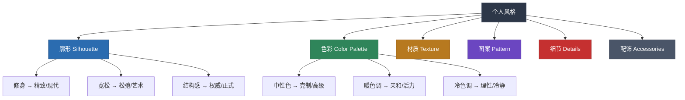
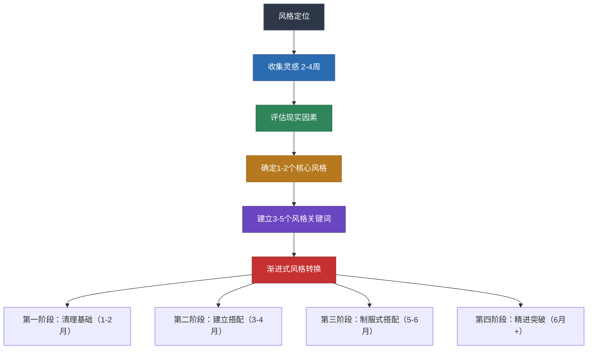

## 三、风格理论

风格是穿搭的灵魂。色彩告诉你"什么颜色好看"，体型分析告诉你"什么版型合适"，而风格理论回答的是最根本的问题——**你想通过穿着表达什么样的自己**。没有风格意识的穿搭，哪怕每件单品都不错，组合在一起也只是一堆衣服的堆砌，而不是一个有灵魂的形象。

### 3.1 风格的本质

#### 3.1.1 什么是穿搭风格

穿搭风格（Personal Style）不是指"今年流行什么"，而是你通过服装向外界持续传递的一套视觉语言系统。它包含两个层面：

**外在层面**——别人看到的：廓形、色彩、材质、图案、细节、配饰的组合方式，形成一个可辨识的视觉形象。

**内在层面**——你想表达的：你的审美偏好、生活态度、职业身份、价值取向。风格是内在自我的外化。

理解这两层关系至关重要：只追求外在好看而忽略内在一致性，穿出来的只是"模仿"，不是风格。真正的风格是"你觉得这样穿舒服"和"别人觉得这样穿好看"的交集。

#### 3.1.2 风格的六大构成要素

每一种穿搭风格都是由以下六个要素组合而成的。理解这些要素，你就掌握了"拆解"和"重建"任何风格的能力：

| 要素 | 英文 | 定义 | 对风格的影响 |
|------|------|------|-------------|
| **廓形** | Silhouette | 服装的整体轮廓——修身、宽松、直线、曲线 | 决定了风格的"骨架"。修身廓形传递精致和现代感，宽松廓形传递松弛和艺术感 |
| **色彩** | Color Palette | 偏好的色系和配色方式 | 决定了风格的"情绪"。中性色传递克制和高级，亮色传递活力和自信 |
| **材质** | Texture | 面料的触感和视觉质感——光滑/粗糙、柔软/挺括 | 决定了风格的"质感"。羊毛和真丝传递高级，牛仔和帆布传递粗犷 |
| **图案** | Pattern | 纯色、条纹、格纹、印花、迷彩等 | 决定了风格的"节奏"。纯色极简，印花奔放，格纹经典 |
| **细节** | Details | 纽扣、拉链、刺绣、褶皱、口袋、车线 | 决定了风格的"精度"。隐藏式纽扣传递极简，金属拉链传递工业感 |
| **配饰** | Accessories | 手表、眼镜、围巾、帽子、首饰、包袋 | 决定了风格的"个性"。配饰是风格表达的最高杠杆——一条丝巾就能改变整套搭配的气质 |

这六个要素的关系可以用一个比喻来理解：廓形是骨架，色彩是皮肤，材质是肌肉，图案是表情，细节是微表情，配饰是首饰。一个完整的风格形象，需要这六个要素协调统一。

#### 3.1.3 风格与"好看"的区别

很多人把"穿得好看"等同于"有风格"，这是一个常见的误解。两者的区别在于：

| 维度 | 穿得好看 | 有风格 |
|------|---------|-------|
| **一致性** | 每天穿得不一样，今天韩系明天欧美 | 有一条贯穿始终的视觉主线 |
| **可辨识度** | 别人觉得你穿得不错，但说不出具体特点 | 别人一看就知道"这是你的风格" |
| **内在驱动** | 跟着流行趋势走 | 基于个人审美偏好和生活理念 |
| **持久性** | 流行过了就不穿了 | 经典单品反复搭配，越穿越有味道 |
| **适应性** | 换个场合就不知道穿什么了 | 能在不同场合中保持风格一致性 |

简单来说：好看是"别人觉得你穿得不错"，风格是"别人觉得这就是你"。好看是瞬间的评价，风格是长期的印象。我们的目标不是每天都让人惊艳，而是建立一个稳定、得体、有辨识度的个人形象。

### 3.2 经典风格分类详解

以下是当代最主流的十种男性穿搭风格。每种风格我都会从**起源背景、核心美学、典型单品、配色方案、适用场景、适合人群、常见误区**七个维度进行深度解析，而不是简单罗列关键词。

#### 3.2.1 经典商务风（Classic Business）

**起源背景**：经典商务风起源于19世纪英国萨维尔街（Savile Row）的定制西装传统。19世纪中期，英国贵族将骑马和户外运动的服装改良为正式场合穿着，逐渐形成了现代西装的雏形。20世纪初，华尔街的金融精英们将这种风格标准化为"商务正装"，并沿用至今。

**核心美学**：经典商务风的美学内核是**权威、秩序、可靠**。它通过合身的剪裁、克制的配色和精致的细节来传递"我是专业的、值得信赖的"这一信号。这种风格不追求个性表达，而追求**得体**——在正确的场合做正确的装扮。

**典型单品与搭配**：

| 单品 | 规格要求 | 常见错误 |
|------|---------|---------|
| 西装外套 | 两粒扣或三粒扣，深蓝或炭灰色，合身肩线 | 肩线过宽（像穿了别人的衣服）、衣长过长（遮住臀部全部） |
| 衬衫 | 白色或浅蓝色，领型与脸型匹配，袖长露出西装1-2cm | 领子过松（显得邋遢）、颜色过亮（不正式） |
| 领带 | 丝绸材质，宽度与西装翻领匹配（7-8.5cm），纯色或小图案 | 领带过窄（过于休闲）、颜色过于花哨 |
| 西裤 | 与西装同面料同色，裤脚微有Break或无Break | 裤腿过宽（显得腿粗）、裤长堆积在鞋面（拖沓感） |
| 皮鞋 | 牛津鞋（Oxford）或德比鞋（Derby），黑色或深棕色 | 鞋面不干净（细节致命）、方头鞋型（过时） |
| 腰带 | 与皮鞋同色同材质，宽度3-3.5cm，简洁扣头 | 腰带与皮鞋颜色不一致（最常见的低级错误） |

**配色方案**：
- **核心色**：深海军蓝（Navy）、炭灰色（Charcoal）、深灰色
- **辅助色**：白色、浅蓝色（衬衫）
- **点缀色**：酒红色（领带）、深绿色（口袋巾）
- **禁忌**：黑色西装在白天商务场合（过于正式，接近丧礼感）、全身超过三种颜色

**适合人群**：金融、法律、政府、咨询等传统行业的从业者；需要出席正式商务会议、谈判、面试的场合。

**常见误区**：
- 误区一："黑色西装最正式最好"——在白天的商务场合，深蓝色或炭灰色才是首选。纯黑色西装在西方传统中主要用于丧礼和晚宴，在中国虽然没那么严格，但深蓝/炭灰比黑色更显品味。
- 误区二："西装要买大一号好活动"——西装的精髓在于合身。如果活动受限，说明这件西装的剪裁不适合你，不是需要买大一号。
- 误区三："领带越贵越好"——领带的效果取决于材质、宽度和颜色是否与整体搭配协调，而非价格。一条100元的真丝领带如果选对了颜色和宽度，效果远好于一条1000元但颜色不搭的名牌领带。

#### 3.2.2 商务休闲风（Smart Casual）

**起源背景**：商务休闲风诞生于1990年代美国硅谷的科技公司文化。当时，大批年轻的科技从业者拒绝穿着传统正装上班，但又需要在商务场合保持一定的专业形象，于是"商务休闲"这种介于正式和随意之间的风格应运而生。1992年，美国NPD集团的调查显示，"Casual Friday"（周五便装日）政策迅速从科技行业扩散到了全美各行各业。

**核心美学**：商务休闲风的美学核心是**有控制的放松**。它保留了正装的结构感和品质感，但去掉了束缚感和距离感。关键词是"看起来是认真打扮过的，但又不像是要去开会"。

**典型单品与搭配方案**：

- **休闲西装（Blazer）**：不系领带，可以解开一到两粒扣子。面料选棉麻混纺或轻质羊毛，避免过于正式的精纺面料。颜色首选海军蓝，其次炭灰、卡其色。
- **针织衫/Polo衫**：代替衬衫作为内搭，V领针织衫最百搭。纯色优于图案。
- **卡其裤/休闲西裤**：代替正式西裤。卡其色、海军蓝、灰色是万能色。
- **乐福鞋/德比鞋**：比牛津鞋休闲，比运动鞋正式。皮质乐福鞋（Penny Loafer或Tassel Loafer）是商务休闲风的标配。
- **高品质手表**：不需要名表，但需要一块看起来"认真选择过"的手表。皮带表比钢带表更适合商务休闲。

**搭配公式示例**：
- 海军蓝Blazer + 白色Polo衫 + 卡其色休闲裤 + 棕色乐福鞋 → 经典不出错
- 炭灰色针织衫 + 浅蓝色衬衫（露出领子）+ 深色牛仔裤 + 深棕德比鞋 → 科技公司标配
- 驼色针织开衫 + 白色T恤 + 海军蓝休闲裤 + 白色运动鞋（干净简洁款）→ 创意行业休闲日

**适合人群**：科技行业、创意行业、咨询行业的日常办公；需要参加商务午餐、客户拜访但不需要全套正装的场合。

**常见误区**：
- 误区一："商务休闲=穿什么都行"——商务休闲有底线，牛仔裤可以破洞款不行，运动鞋可以但要干净简洁的款（如Common Projects风格），拖鞋、运动短裤绝对不行。
- 误区二："把正装拆开穿就是商务休闲"——正式的精纺面料西装拆开单穿，会显得像"穿了半套西装"，反而尴尬。商务休闲需要专门选择休闲感更强的单品。

#### 3.2.3 都市休闲风（Urban Casual）

**起源背景**：都市休闲风根植于1970-80年代美国的城市街头文化，特别是纽约的嘻哈文化和滑板文化。它从底层青年的穿着习惯中生长出来，经过几十年的演变，已经成为全球年轻人最普遍的日常穿搭方式。Supreme、Stüssy、A Bathing Ape等品牌是这一风格的文化标志。

**核心美学**：都市休闲风强调**舒适、自我表达、不拘束**。它的美学逻辑不是"穿给别人看"，而是"穿给自己舒服"。但"舒服"不等于"随便"——真正好看的都市休闲风，是在放松的基础上有意识地控制比例、配色和层次。

**典型单品与搭配**：
- **T恤**：圆领纯色T恤是基础中的基础。选择重磅棉（200g以上），版型微宽松但不垮塌。
- **牛仔裤**：直筒或微锥形，深色水洗（最百搭）。避免过于花哨的水洗和破洞。
- **运动鞋**：小白鞋（Stan Smith、Air Force 1）是万能选择。可以进阶到New Balance、Asics等复古跑鞋。
- **连帽衫/卫衣**：纯色oversized卫衣是层次搭配的利器。
- **棒球帽**：纯色棒球帽，Logo不宜过大。
- **夹克**：教练夹克（Coach Jacket）、飞行员夹克（Bomber Jacket）、牛仔夹克。

**配色逻辑**：以黑、白、灰为基础色，然后通过一件亮色单品（鞋子、帽子、卫衣）作为视觉焦点。全身只保留一个亮点，其他部分保持中性。

**适合人群**：20-35岁的城市年轻人；日常休闲、朋友聚会、周末出行等非正式场合。

**常见误区**：
- 误区一："宽松=oversized=有型"——宽松不等于大两号。正确的oversized是有意识地选择放大了剪裁的版型，而不是买大了尺码。
- 误区二："全身运动品牌就是休闲风"——全身Nike/Adidas加运动裤是"运动装"，不是"都市休闲风"。都市休闲风需要在运动元素和日常服装之间做混搭。

#### 3.2.4 日系简约风（Japanese Minimalism）

**起源背景**：日系简约风的哲学根基可以追溯到日本传统美学中的"侘寂"（Wabi-Sabi）——在不完美和不持久中发现美。20世纪80年代，三宅一生、川久保玲、山本耀司三位日本设计师在巴黎时装周上掀起了"日本风暴"，他们以宽大的廓形、不对称的设计和深沉的色调，挑战了西方时装界对"合身"和"性感"的定义。后来，无印良品（MUJI）将这种美学平民化，使之成为一种生活方式。

**核心美学**：日系简约风的核心是**克制、留白、层次**。它不追求视觉冲击力，而是通过低饱和度的色彩、宽松但有结构感的廓形、以及细腻的面料质感来传递一种"安静的力量"。日本美学中的"间"（Ma，留白的空间）在穿搭中的体现就是——不把身体填满，留出呼吸感。

**典型单品与搭配**：
- **宽松T恤/衬衫**：版型比正常码大半码到一码，但肩线仍然合肩。面料偏厚实有质感。
- **阔腿裤/直筒裤**：裤腿有一定宽度但不夸张，裤长刚好到鞋面或微堆。
- **帆布鞋/皮质低帮鞋**：Converse 1970s、匡威日本线、或简约皮质便鞋。
- **帆布包/托特包**：不追求名牌，追求材质和设计的简洁。
- **大地色系外套**：米色风衣、卡其色工装外套、灰色棉质夹克。

**配色方案**：米色、浅灰、深灰、藏蓝、黑色——全部是低饱和度的中性色。全身颜色不超过三种，且色调统一（要么全暖调，要么全冷调）。白色作为"留白色"大量使用。

**适合人群**：追求"少即是多"哲学的人；创意行业、艺术相关从业者；身材偏瘦或中等的人（过于壮硕的人穿宽松款容易显得更壮）。

**常见误区**：
- 误区一："日系=穿得宽松就行"——日系简约风的宽松是有结构感的宽松，不是松垮。面料必须有质感，版型必须有设计感。
- 误区二："日系=不讲究"——恰恰相反，日系风格对细节的要求极高。面料的垂坠感、车线的颜色、纽扣的材质——这些"看不见的地方"才是日系风格的灵魂。

#### 3.2.5 美式休闲风（American Casual / Ivy Style）

**起源背景**：美式休闲风起源于1950年代美国常春藤联盟（Ivy League）大学的学生穿着，因此也被称为"Ivy Style"。普林斯顿、耶鲁、哈佛的学生们将运动服和正装混搭，创造出一种"看起来随意但实际很讲究"的穿着方式。Ralph Lauren、J.Crew、Brooks Brothers等品牌将这种风格商业化并推广到全世界。

**核心美学**：美式休闲风的核心是**从容、实用、不刻意**。它传达的信息是"我有品味，但我不会刻意炫耀"。与日系简约的"克制"不同，美式休闲的从容来自于"这是我的生活方式，不是我精心打扮的结果"。

**典型单品**：
- **牛津衬衫（Oxford Cloth Button Down，OCBD）**：美式休闲风的灵魂单品。扣领设计，面料略带粗糙感，白色和浅蓝色最经典。
- **卡其裤（Chinos）**：直筒或微锥形，卡其色最经典，其次海军蓝、橄榄绿。
- **工装靴/乐福鞋**：Red Wing工装靴代表粗犷的一面，Penny Loafer代表精致的一面。
- **棒球夹克/飞行员夹克**：Varsity Jacket是美式休闲的标志性外套。
- **针织领带/编织腰带**：在正式和休闲之间找到平衡。

**适合人群**：喜欢"看起来不费力但实际很讲究"的人；身材中等或偏壮的人（美式休闲风的廓形比较宽容）；户外生活方式爱好者。

#### 3.2.6 韩系简约风（Korean Minimal）

**起源背景**：韩系穿搭风格在2010年代随着韩流文化（K-pop、韩剧）传播到全球。它融合了日系的极简理念和西方的修身剪裁，发展出一种更适合亚洲人体型和审美的穿搭方式。韩国时尚杂志《GQ Korea》和《Elle Korea》、以及韩剧男主角的穿搭（如《鬼怪》孔刘、《黑暗荣耀》中的造型）是这一风格的重要推手。

**核心美学**：韩系简约风的核心是**干净、修身、精致**。它比日系更注重身体线条的展现，比美式更注重整体造型的精致度。关键词是"看起来很干净"——色彩纯净、线条利落、没有多余的装饰。

**典型单品与搭配**：
- **修身西装/休闲西装**：比欧美版型更窄更短，适合亚洲人偏瘦的体型。
- **九分裤**：露出脚踝是韩系穿搭的标志性细节，视觉上拉长腿部线条。
- **小白鞋**：纯白色、设计简洁的低帮运动鞋。
- **oversized外套+修身内搭**：韩系穿搭的标志性搭配——外松内紧，营造层次感。
- **简洁配饰**：细框眼镜、简约手表、小号胸针。

**配色方案**：黑白灰为主色调，加入淡粉、淡蓝、淡绿等低饱和度的柔和色。全身大面积使用中性色，只用一件柔和色单品做点缀。

**适合人群**：亚洲年轻人（20-35岁）；偏瘦或中等身材；追求精致但不想太正式的场合。

**常见误区**：
- 误区一："韩系=女性化"——韩系风格的修身和精致不等于女性化。孔刘、李钟硕的穿搭就是韩系风格的男性化演绎。
- 误区二："韩系=九分裤+小白鞋"——这只是韩系风格最容易模仿的表层。真正的韩系风格在于对比例和层次的精确控制。

#### 3.2.7 法式优雅风（French Chic）

**起源背景**：法式风格的精髓可以用一个词概括——**effortless chic**（不经意的精致感）。这种美学理念源自法国女性的生活哲学：美不应该是刻意追求的结果，而应该是生活态度的自然流露。Coco Chanel、Jane Birkin、Ines de la Fressange是法式风格的文化偶像。虽然法式风格传统上以女性为主，但其核心理念——"少即是多、品质胜于数量、不刻意才是最高级"——对男性穿搭同样适用。

**核心美学**：法式风格在男性穿搭中的体现是**自然、优雅、不费力**。具体表现为：经典款为主、色彩克制、面料考究、剪裁合身但不紧绷、细节精致但不张扬。法国男人的穿搭哲学可以总结为："买少一点，买好一点，穿久一点。"

**男性法式风格的典型单品**：
- **条纹海魂衫（Breton Stripe）**：蓝白条纹，源自法国海军，是法式风格的标志。
- **深色修身牛仔裤**：无水洗无破洞的深靛蓝色，直筒或微锥形。
- **驼色/海军蓝大衣**：中长款，面料有垂坠感。
- **丝巾/围巾**：男士丝巾是法式风格的点睛之笔。
- **简洁皮鞋**：深棕色皮质便鞋或切尔西靴。

**适合人群**：追求"看起来不费力但实际很有品味"的人；30岁以上、有一定生活阅历的男性。

#### 3.2.8 学院风（Preppy Style）

**起源背景**：Preppy一词来自"Preparatory School"（预备学校），指美国东海岸私立寄宿学校和常春藤大学学生的穿着风格。这种风格在1950-60年代的肯尼迪家族时期达到鼎盛，代表着美国上层中产阶级的审美品味。Ralph Lauren的Polo品牌、Lacoste的鳄鱼衬衫、Vineyard Vines等品牌是学院风的商业代表。

**核心美学**：学院风的核心是**知性、整洁、传统但年轻**。它传递的是"我受过良好教育，注重品质和传统"的信号。与美式休闲风相比，学院风更加整洁和正式；与经典商务风相比，学院风更加活泼和年轻。

**典型单品**：
- **Polo衫**：修身但不紧身，纯色或小Logo，领子挺括。
- **针织开衫/V领毛衣**：可以搭在肩上或系在胸前，是学院风的标志性穿法。
- **百褶裙/卡其裤**：女生百褶裙、男生卡其裤。
- **乐福鞋/船鞋**：便士乐福鞋（Penny Loafer）和帆船鞋（Boat Shoes）是学院风的标配。
- **牛津衬衫**：与美式休闲风共享的单品，但学院风中更注重"衬衫塞入裤子+腰带"的整洁感。

**配色方案**：藏蓝、酒红、白色、卡其色——这四种颜色是学院风的"万能四色"。可以加入粉色、浅绿色作为点缀，但面积不宜过大。

**适合人群**：学生和年轻职场人（20-30岁）；追求知性形象、不想太正式也不想太休闲的场合。

#### 3.2.9 工装风（Workwear）

**起源背景**：工装风的源头是19世纪末至20世纪初的美国工人阶级穿着。Carhartt（1889年创立）、Dickies（1922年）、Levi's的工装系列都是为矿工、铁路工人、木匠等体力劳动者设计的功能性服装。2010年代，日本潮流文化将美式工装"反哺"回了时尚界——日本品牌如WTAPS、Neighborhood将工装元素与街头文化融合，创造出"Urban Workwear"这一新流派。

**核心美学**：工装风的核心是**实用、耐用、粗犷的美感**。它的魅力在于"这些衣服本来就是为干活设计的"——每一个口袋、每一处加固车线、每一个金属扣都有其功能性的理由。工装风不追求精致，追求的是**真实感**和**岁月感**——一件穿了五年、越穿越好看的丹宁夹克，比全新的更有味道。

**典型单品**：
- **丹宁夹克/工装夹克**：重磅丹宁面料（14oz以上），原色未水洗款最佳。
- **工装裤（Cargo Pants）**：多口袋设计，卡其色或军绿色。
- **法兰绒衬衫**：格纹图案，红黑格纹最经典。
- **工装靴**：Red Wing Iron Ranger、Timberland 6-inch是代表款。
- **重磅T恤**：200g以上的厚实棉T恤，白色和灰色最百搭。

**配色方案**：靛蓝（丹宁色）、军绿、棕色、卡其色——全部是"大地色系"。这些颜色之间可以自由混搭，基本不会出错。

**适合人群**：喜欢复古和实用美学的人；身材偏壮或中等的人（工装风的廓形比较宽松，适合骨架较大的人）；户外活动和休闲社交场合。

**常见误区**：
- 误区一："工装风=穿得旧和脏"——工装风的"旧"是岁月感，不是不洗衣服。新的工装单品同样可以穿出味道。
- 误区二："全身工装品牌就是工装风"——全身Carhartt从头到脚更像是"穿制服"。工装风需要与其他风格元素混搭，比如丹宁夹克+白色T恤+深色牛仔裤+简约运动鞋，就是工装和都市休闲的融合。

#### 3.2.10 静奢风（Quiet Luxury / Old Money）

**起源背景**：静奢风（Quiet Luxury）在2023年成为全球时尚界最热门的趋势之一，但它并不是新事物。这种"没有Logo但一看就很贵"的审美，一直是欧洲老钱家族（Old Money）的穿衣传统——真正的贵族不需要用Logo来证明自己的身份。Loro Piana、Brunello Cucinelli、The Row等品牌是静奢风的商业代表。

**核心美学**：静奢风的核心是**低调的奢华——不炫耀，但处处透露着品质**。它的反面是"Logo满身"的显性消费。静奢风的逻辑是：真正的品质不需要Logo来证明，面料的手感、剪裁的精度、做工的细节本身就是最好的"标识"。

**典型单品与品质标准**：

| 单品 | 品质标准 | 价格区间参考 | 判断方法 |
|------|---------|------------|---------|
| 羊绒毛衣 | 100%羊绒，12-gauge以上织法 | 800-3000元 | 手感柔软无刺痒感，轻薄但保暖 |
| 精纺西裤 | 高支数羊毛面料（120支以上） | 600-2000元 | 面料有自然垂坠感，不起皱 |
| 乐福鞋 | 全粒面皮革，固特异缝线工艺 | 800-3000元 | 鞋面能看到皮革的自然纹理，弯折时无死褶 |
| 高品质大衣 | 羊毛或羊绒混纺，内里全衬 | 2000-8000元 | 重量轻但保暖，版型挺括不臃肿 |
| 白色T恤 | 长绒棉（Supima或埃及棉），200g以上 | 150-500元 | 面料光滑细腻，多次洗涤后不变形不发黄 |

**配色方案**：驼色、海军蓝、白色、灰色、酒红——全部是低饱和度的经典色。全身颜色不超过三种，且色调和谐统一。静奢风的配色哲学是"这些颜色100年后也不会过时"。

**适合人群**：追求品质而非品牌的人；30岁以上、经济条件允许在服装上投入更多的人；所有场合——静奢风最大的魅力在于它的普适性。

**常见误区**：
- 误区一："静奢=花大钱买贵的"——静奢的核心是品质和低调，不是价格标签。一件500元的高品质羊绒衫比一件2000元的Logo毛衣更"静奢"。
- 误区二："静奢=没有个性"——静奢风的个性体现在面料选择、细节处理和搭配方式上，只是不通过Logo和夸张设计来表达。

### 3.3 十大风格速查对比表

下表从六个维度对十种风格进行横向对比，方便快速定位适合自己的风格：

| 风格 | 正式度（1-10） | 修身程度 | 色彩倾向 | 预算门槛 | 最佳年龄段 | 适合体型 |
|------|:----------:|---------|---------|:------:|:--------:|---------|
| 经典商务 | 9 | 修身 | 深色保守 | 高 | 25-55 | 倒三角、长方形 |
| 商务休闲 | 6 | 合身 | 中性偏暖 | 中高 | 25-45 | 倒三角、长方形、梯形 |
| 都市休闲 | 3 | 合身到微宽松 | 灵活多变 | 低 | 18-35 | 不限 |
| 日系简约 | 4 | 宽松有型 | 低饱和中性 | 中 | 20-35 | 偏瘦、中等 |
| 美式休闲 | 4 | 合身偏宽松 | 大地色系 | 中 | 20-40 | 中等、偏壮 |
| 韩系简约 | 5 | 修身 | 黑白灰+柔和色 | 中低 | 20-30 | 偏瘦、中等 |
| 法式优雅 | 6 | 合身 | 经典色 | 中高 | 25-45 | 中等 |
| 学院风 | 5 | 合身 | 藏蓝酒红白卡其 | 中 | 18-30 | 中等 |
| 工装风 | 2 | 宽松 | 大地色 | 中低 | 20-35 | 中等、偏壮 |
| 静奢风 | 7 | 合身到修身 | 低饱和经典色 | 高 | 28-55 | 不限 |

### 3.4 风格混合：如何打造个人风格

几乎没有人的风格是100%纯粹的某一种。现实中的穿搭高手，都是将2-3种风格元素融合在一起，形成自己的独特风格。问题是：哪些风格可以混搭？怎么混搭才不出错？

#### 3.4.1 风格混搭的基本原则

**原则一：确定主风格和辅风格**

你的整体穿搭应该有一个明确的主风格（占70-80%），然后用1-2个辅风格（占20-30%）来增加层次和个人特色。例如：
- 主风格：商务休闲风（西装外套、卡其裤、乐福鞋）
- 辅风格：日系简约元素（低饱和度配色、简洁的内搭）
- 结果：一套有质感但不刻板的日常通勤装

**原则二：正式度相近的风格更容易混搭**

正式度差异太大的风格混搭会显得"精神分裂"。比如：
- 商务休闲+工装 → 可以（正式度都在4-6之间）
- 经典商务+街头休闲 → 困难（正式度9 vs 3，冲突太大）

**原则三：在同一个色温体系内混搭**

不同风格的色彩倾向可能不同，但混搭时应该统一色温（暖色系或冷色系）。比如：
- 美式休闲的大地色（暖调）+ 日系简约的米灰色（暖调）→ 和谐
- 韩系的黑白灰（冷调）+ 工装的军绿（暖调）→ 需要谨慎处理

#### 3.4.2 适合28岁男性的推荐风格组合

针对你28岁的年龄、普通身高的身高和偏中等的身材，以下几种风格组合特别值得参考：

**组合一：商务休闲 + 韩系简约** → "精致通勤风"
- 适合场景：日常工作、客户会议、商务午餐
- 核心搭配：修身休闲西装 + 九分裤 + 小白鞋
- 配色：深灰/海军蓝为主，黑白灰为辅
- 优势：修身剪裁对矮个子友好，九分裤露出脚踝显高

**组合二：都市休闲 + 日系简约** → "质感休闲风"
- 适合场景：周末出行、朋友聚会、创意行业工作
- 核心搭配：重磅白T + 直筒裤 + 帆布鞋/皮质便鞋
- 配色：低饱和度中性色，全身不超过三种颜色
- 优势：宽松有型的日系廓形可以遮掩身材不足，低饱和度配色显高级

**组合三：美式休闲 + 工装** → "实用主义风"
- 适合场景：户外活动、休闲社交、非正式场合
- 核心搭配：牛津衬衫 + 工装裤 + 工装靴
- 配色：靛蓝、军绿、棕色、卡其色的大地色系
- 优势：工装元素增加硬朗感，对五五开身材有视觉填充效果

#### 3.4.3 风格混搭的视觉参考

```mermaid
graph LR
    subgraph 正式端
        A[经典商务 9] --> B[静奢风 7]
        B --> C[法式优雅 6]
    end

    subgraph 中间地带
        C --> D[商务休闲 6]
        D --> E[韩系简约 5]
        E --> F[学院风 5]
    end

    subgraph 休闲端
        F --> G[美式休闲 4]
        G --> H[日系简约 4]
        H --> I[都市休闲 3]
        I --> J[工装风 2]
    end

    style A fill:#1a202c,stroke:#2d3748,color:#fff
    style B fill:#2d3748,stroke:#4a5568,color:#fff
    style C fill:#4a5568,stroke:#718096,color:#fff
    style D fill:#2b6cb0,stroke:#2c5282,color:#fff
    style E fill:#6b46c1,stroke:#553c9a,color:#fff
    style F fill:#b7791f,stroke:#975a16,color:#fff
    style G fill:#2f855a,stroke:#276749,color:#fff
    style H fill:#319795,stroke:#2c7a7b,color:#fff
    style I fill:#d69e2e,stroke:#b7791f,color:#fff
    style J fill:#c53030,stroke:#9b2c2c,color:#fff
```

上图中，正式度相邻的风格之间混搭最自然。相隔越远，混搭难度越大，但也越有个性——前提是你能用配色和比例把它们统一起来。

### 3.5 个人风格定位：四步法

找到适合自己的风格不是凭感觉，而是一个有方法论支撑的系统过程。以下是经过验证的四步定位法：

#### 3.5.1 步骤一：收集灵感（2-4周）

**目标**：通过大量浏览建立视觉品味库，发现自己无意识中偏好的审美方向。

**操作方法**：
1. 创建一个专属的灵感文件夹（手机相册、Pinterest画板或小红书收藏夹均可）
2. 每天花15-20分钟浏览穿搭内容，遇到"我喜欢这个"的图片就保存——不需要分析原因，凭直觉
3. 坚持2-4周，收集至少50张图片

**灵感来源推荐**：
| 来源 | 推荐理由 | 搜索关键词 |
|------|---------|-----------|
| Pinterest | 全球最优质的视觉灵感平台，算法推荐精准 | "men's style outfit"、"smart casual men" |
| 小红书 | 中文内容，适合参考国内品牌和价格 | "男生穿搭"、"普通身高男生穿搭"、"轻熟风" |
| Instagram | 关注穿搭博主的日常穿搭，更接地气 | @doyoutravel、@mattgstyle |
| 电影/电视剧 | 角色造型通常经过专业造型师设计 | 《007》系列（绅士风）、《继承之战》（静奢风） |
| 街拍网站 | 真实路人的穿搭，参考价值高 | The Sartorialist、Tommy Ton |

**关键步骤——分析共性**：收集完成后，把50张图片铺开（或在电脑上排列），问自己以下问题：
- **廓形倾向**：这些图片中的衣服是偏修身、偏宽松还是混合？
- **色彩倾向**：整体色调是偏中性（黑白灰棕）还是偏大胆（亮色、撞色）？
- **正式程度**：整体偏正式（西装、衬衫）还是偏休闲（T恤、卫衣）？
- **风格归类**：它们最接近3.2节中哪种或哪几种风格？
- **重复元素**：有没有某个单品或搭配方式反复出现？（比如你保存了8张图都有乐福鞋，说明你潜意识喜欢乐福鞋）

这一步的核心是**发现你的真实偏好**，而不是"我应该喜欢什么"。

#### 3.5.2 步骤二：评估现实因素

你的风格选择必须建立在现实条件之上。以下六个因素会直接影响你能穿什么、应该穿什么：

**1. 职业要求**
不同行业对着装的要求差异巨大。你的风格必须在行业允许的范围内——不是"我想穿什么"，而是"我在什么框架内选择"。

| 行业类型 | 着装宽松度 | 参考风格 |
|---------|:--------:|---------|
| 金融/法律/政府 | 低 | 经典商务、静奢 |
| 咨询/会计/医药 | 中低 | 商务休闲、静奢 |
| 科技/互联网 | 中高 | 商务休闲、韩系、都市休闲 |
| 创意/设计/媒体 | 高 | 日系、法式、都市休闲 |
| 自由职业/远程 | 极高 | 不限 |

**2. 生活方式**
你的日常活动决定了服装的功能需求。问自己：我大部分时间在做什么？
- 90%办公室 + 10%社交 → 商务休闲为主
- 50%办公室 + 30%外出 + 20%休闲 → 需要一套能快速切换场合的衣橱
- 80%自由活动 + 20%正式场合 → 休闲为主，备一套正式装

**3. 体型特点**（已在第二章详细分析）
- 普通身高身高 → 需要修身但不紧身的廓形，避免过于宽大的衣服
- 五五开比例 → 需要高腰线设计，上衣不宜过长
- 方形脸型 → V领和小圆领更适合，高领要慎选

**4. 个人色彩**
你的肤色、发色、瞳色决定了你适合的色彩范围。虽然详细的内容在色彩理论一节中，但风格定位时需要将色彩因素纳入考虑：
- 暖肤色（偏黄）→ 大地色系、暖色调风格（美式休闲、工装风）更和谐
- 冷肤色（偏白/偏粉）→ 冷色调风格（韩系、经典商务）更协调

**5. 预算**
不同风格的预算门槛不同。如果你的预算有限，应该：
- 优先选择预算门槛低的风格（都市休闲、韩系简约）
- 或者用"高性价比替代"策略：在预算友好的品牌中选择符合高品质风格特征的单品

**6. 气候**
你所在地区的气候直接影响面料和层次选择：
- 南方湿热地区（广州、深圳等）→ 轻薄透气面料优先，层叠搭配实用性低
- 北方干燥地区（北京、东北等）→ 需要更丰富的层次搭配，大衣和围巾成为必需品
- 四季分明地区 → 需要建立包含四季的完整衣橱

#### 3.5.3 步骤三：定义核心风格（1-2个）

经过灵感收集和现实评估，你应该能初步确定1-2个核心风格。以下是几种常见的风格组合模式：

**模式一：单一风格深度精通**
- 选一个风格，所有单品和搭配都围绕这个风格展开
- 优点：最容易执行，一致性最高
- 缺点：可能显得单调
- 适合：不想在穿搭上花太多时间和精力的人

**模式二：主风格 + 辅风格元素**
- 70-80%的单品是主风格，20-30%加入辅风格的元素
- 例如："商务休闲为主 + 静奢元素为辅"——大部分时间穿商务休闲，但用高品质面料和低调配色来提升质感
- 优点：有层次感，不单调
- 适合：大多数人的最优解

**模式三：场合切换风格**
- 不同场合穿不同风格，但在色彩和配饰上保持一致性
- 例如：工作日穿商务休闲，周末穿都市休闲，但都以海军蓝和灰色为主色调
- 优点：适应性强
- 缺点：需要更多单品，预算更高

#### 3.5.4 步骤四：建立风格关键词（3-5个）

风格关键词是你以后所有穿搭决策的"过滤器"。它应该满足以下条件：
- 用词精确，不能是"好看"这种模糊词
- 数量3-5个，太多等于没有
- 涵盖不同维度（廓形、色彩、气质等）

**建立方法**：从你的灵感图片中提炼出反复出现的特征，用形容词表达。

**示例**：

| 风格组合 | 关键词 | 购买决策示例 |
|---------|--------|------------|
| 商务休闲+韩系 | 简洁、修身、中性色、精致 | 一件花衬衫→不符合"简洁"和"中性色"→不买 |
| 日系简约+法式 | 质感、宽松、低饱和、自然 | 一件亮黄色卫衣→不符合"低饱和"→不买 |
| 美式休闲+工装 | 实用、大地色、耐穿、硬朗 | 一件粉色Polo衫→不符合"大地色"和"硬朗"→不买 |

**使用方法**：面对一件犹豫不决的衣服时，对照你的3-5个关键词。如果符合至少3个，值得考虑；如果只符合1-2个，果断放弃——无论它多好看、多打折。

### 3.6 风格转换的渐进策略

风格转换最忌讳"一步到位"——如果明天你突然从"T恤+运动裤"变成"全套西装"，周围的人会觉得不对劲，你自己也会不自在。科学的风格转换需要6个月的渐进过程。

#### 3.6.1 第一阶段：清理基础（第1-2个月）

**目标**：淘汰问题单品，购入高品质基础款，建立穿搭的"地基"。

**具体操作**：

**清理衣橱**——用以下标准逐件审视你的衣橱：
| 判断标准 | 保留 | 淘汰 |
|---------|------|------|
| 合身度 | 肩线合肩、衣长合适、不紧不松 | 肩线过宽/过窄、衣长过长/过短 |
| 面料状态 | 无起球、无褪色、无变形 | 起球、褪色、领口变形、缩水 |
| 穿着频率 | 近6个月穿过至少3次 | 近6个月没穿过（排除季节性单品） |
| 风格一致性 | 符合你的风格关键词 | 与你确定的核心风格明显冲突 |

**购入基础款**——淘汰之后，衣橱可能只剩下30-50%的衣物。这时需要补充以下基础款（以"商务休闲+韩系简约"为例）：

| 基础款 | 数量 | 预算参考 | 选择标准 |
|-------|:----:|---------|---------|
| 白色圆领T恤 | 2-3件 | 100-300元/件 | 200g以上重磅棉，领口不变形 |
| 白色/浅蓝色衬衫 | 2件 | 200-500元/件 | 合身肩线，领型适合脸型 |
| 深色修身牛仔裤 | 1-2条 | 300-800元/条 | 深靛蓝无水洗，直筒或微锥形 |
| 深色休闲西裤 | 1-2条 | 300-600元/条 | 合身不紧，裤长合适 |
| 海军蓝休闲西装 | 1件 | 800-2000元 | 合身肩线，轻质面料，可搭配T恤 |

#### 3.6.2 第二阶段：建立搭配习惯（第3-4个月）

**目标**：在基础款之上添加风格感单品，开始有意识地练习搭配。

**具体操作**：
1. 每天晚上花5分钟，根据明天的场合和天气，提前搭好一套衣服
2. 搭好后拍一张全身照，记录在手机相册中
3. 每周回顾本周的5张穿搭照，分析哪些好看、哪些不好看、为什么
4. 每两周购入1-2件有风格感的单品（质感针织衫、有设计感的外套、好看的配饰等）

**搭配练习的黄金公式**：

基础公式：基础款上衣 + 基础款下装 + 风格感鞋子
进阶公式：基础款下装 + 风格感上衣 + 基础款鞋子
高阶公式：风格感上衣 + 风格感下装 + 基础款鞋子（只留一个视觉焦点）

记住：全身只能有一个"主角"。如果你穿了一件有设计感的外套，其他部分就应该保持简洁。

#### 3.6.3 第三阶段：形成"制服式"搭配（第5-6个月）

**目标**：整理出3-5套固定的搭配方案，减少每天的决策成本。

"制服式搭配"不是指每天穿一样的衣服，而是指建立几套经过验证的"公式化搭配"——你知道这几套搭配穿出来一定好看，不需要每天早上对着镜子纠结。

**建立方法**：
1. 从第二阶段的穿搭照片中，选出收到最多正面反馈（或自己最满意）的5-8套搭配
2. 记录每套搭配的具体单品和配色
3. 确保这5-8套搭配能覆盖你80%的日常场合
4. 把这些搭配方案拍照存在手机里，每天早上直接"照方抓药"

**示例——5套"制服式"搭配**：

| 套装编号 | 适用场合 | 上装 | 下装 | 鞋 | 外套 |
|:------:|---------|------|------|-----|------|
| 1 | 日常通勤 | 白色衬衫 | 深色西裤 | 棕色乐福鞋 | 海军蓝Blazer |
| 2 | 休闲社交 | 白色重磅T恤 | 深色牛仔裤 | 小白鞋 | 无或牛仔夹克 |
| 3 | 正式会议 | 浅蓝衬衫+深色领带 | 炭灰西裤 | 黑色德比鞋 | 炭灰西装外套 |
| 4 | 周末出行 | 灰色针织衫 | 卡其裤 | 复古跑鞋 | 教练夹克 |
| 5 | 约会/晚餐 | 黑色高领针织 | 深色修身裤 | 切尔西靴 | 驼色大衣 |

#### 3.6.4 第四阶段：精进与突破（6个月以后）

**目标**：在已有基础上拓展风格边界，形成真正的个人穿搭品味。

进入这个阶段，你已经具备了以下能力：
- 知道什么颜色和版型适合自己
- 有几套经过验证的搭配方案
- 购物时能快速判断一件衣服值不值得买

现在可以开始：
1. **尝试新的颜色**：在中性色安全区内加入一个点缀色（酒红、墨绿、暗橙等）
2. **尝试新的面料**：灯芯绒、粗花呢、亚麻等有特色的面料
3. **尝试风格混搭**：在你的主风格中融入其他风格的元素
4. **关注配饰升级**：一块有品味的手表、一条质感围巾、一副好眼镜
5. **建立个人"签名单品"**：找到一两件能代表你风格的标志性单品（比如总是戴某款眼镜、总是围某条围巾）

### 3.7 风格与体型的协同策略

风格不是空中楼阁——它必须建立在你真实的体型之上。同样的风格，在不同体型上需要做不同的调整。以下是针对你普通身高/五五开身材的各风格适配建议：

#### 3.7.1 高矮问题与风格选择

矮个子的核心穿搭策略是**拉长纵向线条、减少水平切割**。不同风格在这方面的"友好度"不同：

| 风格 | 对矮个子友好度 | 原因 | 调整建议 |
|------|:----------:|------|---------|
| 韩系简约 | ★★★★★ | 修身剪裁、九分裤、小白鞋天然显高 | 直接穿即可，韩系的廓形对矮个子最友好 |
| 商务休闲 | ★★★★ | 合身剪裁，可以利用高腰线和同色系鞋裤 | 西裤选高腰款，裤长不要堆积 |
| 经典商务 | ★★★★ | 西装本身有结构感，V区拉长上身线条 | 选择单排扣两粒扣西装，扣位偏高 |
| 静奢风 | ★★★★ | 合身剪裁、简洁廓形 | 注意大衣长度——不超过膝盖 |
| 法式优雅 | ★★★ | 合身但不刻意修身 | 避免过长的风衣和宽松的阔腿裤 |
| 学院风 | ★★★ | 合身整洁 | 避免过于厚重的叠穿层次 |
| 日系简约 | ★★ | 宽松廓形容易压身高 | 如果选日系，上衣不宜过长，下装选直筒而非阔腿 |
| 美式休闲 | ★★ | 偏宽松的廓形 | 选择合身版型而非宽松版型 |
| 工装风 | ★ | 多层次叠穿、宽松廓形都压身高 | 如果喜欢工装元素，选择单件工装单品而非全身工装 |
| 都市休闲 | ★★★ | 取决于具体单品 | oversized卫衣选短款，运动鞋选厚底款 |

**结论**：对于普通身高的身高，**韩系简约、商务休闲、经典商务**是最友好的三种风格。如果喜欢休闲风，需要在廓形上做更多调整。

#### 3.7.2 五五开身材与风格适配

五五开身材的核心问题是腰线不明显、上下身比例接近1:1。不同风格对这个问题的处理方式不同：

**最友好的风格**：任何强调腰线、使用高腰设计的风格
- 经典商务：西装的收腰设计和高腰西裤天然优化比例
- 韩系简约：高腰九分裤 + 上衣塞入裤腰，完美解决比例问题
- 商务休闲：用Blazer的下摆位置明确腰线

**需要调整的风格**：
- 日系简约：宽松长款上衣会遮挡腰线，需要选择短款上衣或将上衣前襟塞入裤腰
- 都市休闲：长款卫衣会拉低视觉腰线，选择到腰线位置的短款卫衣
- 工装风：多层次叠穿会模糊腰线，需要用腰带或短款内搭明确腰线位置

**核心法则**：无论什么风格，五五开身材的男人都应该把"明确腰线"作为穿搭的第一优先级。具体方法——上衣塞入裤腰（全塞或前塞）、使用腰带、选择高腰下装、上短下长的比例搭配。

### 3.8 风格的心理学：你的穿着在说什么

穿搭风格不仅仅是美学问题，它还是一个心理学问题。你的穿着会在潜意识层面影响别人对你的判断，也会影响你自己的心理状态和行为表现。

#### 3.8.1 风格信号理论

社会心理学中的"信号理论"（Signaling Theory）认为，人们会通过外在符号（包括穿着）向他人传递关于自身特质的信息。不同风格传递的核心信号如下：

| 风格 | 传递的核心信号 | 潜台词 |
|------|------------|--------|
| 经典商务 | 权威、可靠、专业 | "我值得信赖，我知道我在做什么" |
| 商务休闲 | 专业但不刻板 | "我很专业，但我也很好相处" |
| 都市休闲 | 年轻、活力、不拘束 | "我是现代的、开放的" |
| 日系简约 | 审美品味、文化素养 | "我对美有自己的理解" |
| 静奢风 | 经济实力、低调自信 | "我不需要用Logo证明什么" |
| 工装风 | 真实、不做作 | "我是实实在在的人" |

理解这些信号，不是让你去"演"一个角色，而是让你有意识地选择你想要传递的信息。**风格是一种主动的沟通，而不是被动的习惯**。

#### 3.8.2 风格一致性与信任感

心理学研究表明，人们对"表里一致"的人更容易产生信任感。如果你的穿着风格与你的言谈举止、职业身份高度一致，别人会觉得你"真实"、"靠谱"。反之，如果穿着与行为不一致——比如穿着全套西装但说话粗鲁，或者穿着嘻哈风但做事一板一眼——别人会感到"不对劲"，虽然可能说不出具体原因。

这意味着：选择风格时，不仅要考虑"好不好看"，还要考虑"这像不像我"。最持久、最有说服力的风格，是与你真实性格和生活方式高度吻合的风格。

### 3.9 常见误区与纠正

#### 误区一：盲目追随潮流

**表现**：每季都跟着时尚博主买"今年的流行色""今年的流行款"，结果衣橱里堆满了穿一季就过时的衣服。

**纠正**：潮流是"大多数人现在穿什么"，风格是"我一直穿什么"。聪明的做法是：以经典款为基础（占80%），用少量潮流元素作为点缀（占20%）。潮流元素最好选择配饰、鞋子等价格较低的单品——即使过时了，损失也不大。

#### 误区二：把"买贵的"等同于"穿得好"

**表现**：认为只要买名牌就能穿出好效果，结果花了大钱但搭配混乱。

**纠正**：穿得好取决于搭配能力，而不是单品价格。一件300元的白T恤如果版型合身、面料有质感，搭配得当，效果远好于一件3000元的名牌T恤但搭配不当。投资顺序应该是：先提升搭配能力，再逐步提升单品品质。

#### 误区三：全凭个人喜好，不考虑场合

**表现**：只买自己喜欢的衣服，不考虑穿着场合。结果日常穿的太正式、正式场合穿的太休闲。

**纠正**：衣橱应该是"场景化"的——你需要为你的主要生活场景（工作、休闲、社交、运动）分别准备合适的衣物。理想的比例是：工作装占40%、日常休闲装占30%、社交/正式场合装占20%、运动/户外装占10%。

#### 误区四：忽视合身度

**表现**：只关注颜色和款式，忽略了衣服是否合身。结果衣服的风格是对的，但穿上就是不好看。

**纠正**：合身度是穿搭的第一优先级，比颜色、款式、品牌都重要。一件合身的平价白T恤比一件不合身的设计师白T恤好看100倍。购买时一定要试穿，重点关注肩线（是否合肩）、衣长（是否合适）、胸围和腰围（是否活动自如但不宽松）。

#### 误区五：风格定位模糊，什么都想要

**表现**：觉得每种风格都好看，结果衣橱里什么风格的衣服都有，每天早上不知道穿什么。

**纠正**：风格的精髓在于取舍。选择1-2个核心风格，然后围绕它们构建衣橱。"什么都有"等于"什么都没有"。记住前面说的风格关键词法——用3-5个关键词作为过滤器，不符合的果断放弃。

### 3.10 本节小结

风格理论的核心要点可以归纳为以下几点：

1. **风格是可学习的技能**，不是天赋。它由廓形、色彩、材质、图案、细节、配饰六个要素构成。
2. **十大经典风格**各有其起源、美学内核和适用场景，没有好坏之分，只有适合与否。
3. **风格混合**是大多数人的最优解——确定一个主风格（70-80%），搭配一个辅风格（20-30%）。
4. **个人风格定位**遵循四步法：收集灵感→评估现实→定义核心→建立关键词。
5. **风格转换需要6个月渐进**：清理基础→建立搭配→形成"制服式"搭配→精进突破。
6. **风格必须与体型协同**：对于普通身高/五五开身材，韩系简约和商务休闲是最友好的风格选择。
7. **风格是主动的沟通**：你的穿着每天都在向外界传递信息，确保这个信息是你想传递的。

---

*下一节我们将进入面料知识——风格是穿搭的灵魂，而面料是风格的载体。了解面料，你才能真正理解为什么有些衣服"看起来就贵"，而另一些"看起来就廉价"。*
