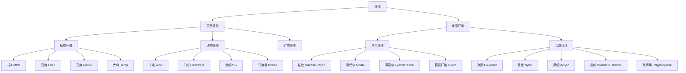
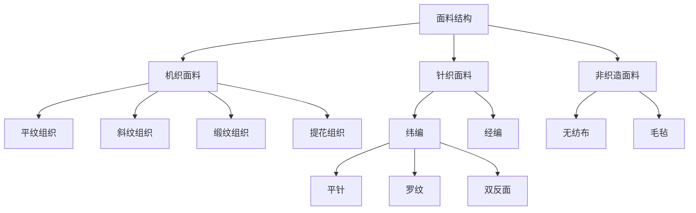

## 四、面料知识

面料是服装的"灵魂"。同样一件白衬衫，高支棉的光泽细腻如丝缎，廉价涤纶却透着塑料般的死光；同是黑色西装，精纺羊毛在灯光下呈现深邃的层次，聚酯混纺则显得平板而廉价。面料决定了服装的外观、触感、耐久性、季节适配性和场合正式度——而这些，恰恰是穿搭中最容易被忽略、却最影响质感的维度。

很多人买衣服只看款式和颜色，却忽略了面料这个底层变量。实际上，面料对穿着体验的影响远超你的想象：一件面料选错的衣服，哪怕版型再好、颜色再对，穿上身也会显得廉价、不舒服、不耐穿。掌握面料知识，是从"会买衣服"进阶到"会选衣服"的关键一步。

### 4.1 面料的核心作用

面料不只是"布料"这么简单。它是一个复杂的工程系统，由纤维原料、纱线结构、织造工艺、后整理技术四个层面共同决定。理解面料的作用，要从这五个维度切入：

**外观质感**：面料的光泽度、纹理和垂坠感直接决定了服装的"高级感"。天然丝的珍珠光泽、高支棉的细腻手感、精纺羊毛的哑光质感，这些都是化学纤维难以模仿的。即使是颜色相同的两件衣服，面料不同，视觉效果可能天差地别。

**穿着舒适度**：透气性、吸湿性、弹性、重量——这些面料的物理属性决定了你穿上这件衣服是"自在"还是"受罪"。夏天穿聚酯纤维衬衫的人，和穿亚麻衬衫的人，体感温度可能相差 3-5°C。

**耐久性与维护成本**：面料的耐磨度、抗皱性、抗起球性决定了这件衣服能穿多久。一件 200 元的精梳棉 T 恤穿两年不变形，一件 80 元的普通棉 T 恤穿三个月就松垮——长期来看，面料好的衣服反而更省钱。

**季节与场合适配**：面料的保暖性、透气性、正式程度决定了它适合什么场景。你不会穿亚麻西装去参加冬季婚礼，也不会穿羊绒毛衣去健身房。面料选择错误，再好的搭配也是白搭。

**身体修饰效果**：不同的面料对身材有不同的修饰作用。垂坠感好的面料能拉长身形，挺括的面料能塑造轮廓，哑光面料比亮面面料更显瘦。这一点，很多人完全没有意识到。

### 4.2 纤维分类体系

面料的起点是纤维。理解纤维分类，是掌握面料知识的第一步。纤维分为三大类：天然纤维、化学纤维（再生纤维和合成纤维）。

**天然纤维**来自自然界，可直接使用或简单加工。植物纤维（棉、亚麻等）来自植物的种子、茎、叶；动物纤维（羊毛、丝绸等）来自动物的毛发或分泌物。

**再生纤维**以天然高分子（如木材、竹子中的纤维素）为原料，通过化学方法重新纺丝而成。它们保留了天然纤维的部分优点（如吸湿性），同时改善了某些缺点（如强度）。

**合成纤维**完全由石油化工产品合成，不依赖天然原料。它们通常强度高、耐磨、易护理，但吸湿性和舒适性不如天然纤维和再生纤维。

### 4.3 天然纤维详解

#### 4.3.1 棉（Cotton）

棉是世界上使用最广泛的天然纤维，占全球纤维消费量的约 27%。它来自棉花植株的种籽纤维，经过采摘、轧棉、纺纱后成为可用的纺织原料。

**核心特性**：

| 特性 | 表现 | 说明 |
|------|------|------|
| 吸湿性 | ★★★★★ | 回潮率 8-10%，能吸收自重 25 倍的水分 |
| 透气性 | ★★★★☆ | 天然中空结构，空气流通好 |
| 舒适度 | ★★★★★ | 亲肤不刺激，适合敏感肌肤 |
| 耐久性 | ★★★☆☆ | 耐磨一般，湿态强度提升 10-20% |
| 抗皱性 | ★★☆☆☆ | 容易起皱，需要熨烫 |
| 保暖性 | ★★★☆☆ | 中等，适合春秋，冬天需叠穿 |

**棉的品质等级**：

棉的品质主要看三个指标：纤维长度（绒长）、纤维细度（支数）、产地。

- **粗绒棉**（纤维长度 < 25mm）：最普通的棉，手感粗糙，用于低端服装和工业用途
- **细绒棉**（纤维长度 25-33mm）：最常见的商业棉，大部分日常服装用的就是这种
- **长绒棉**（纤维长度 > 33mm）：品质最高的棉，纤维长、强度高、光泽好

**支数（Thread Count/TC）**是衡量棉织物细腻程度的关键指标。支数越高，纱线越细，面料越光滑柔软：

| 支数范围 | 品质等级 | 手感描述 | 典型用途 |
|----------|----------|----------|----------|
| 20-40 支 | 普通 | 略粗糙，有颗粒感 | 牛仔裤、工装、帆布 |
| 40-60 支 | 中等 | 平整，日常舒适 | 普通 T 恤、床品 |
| 60-80 支 | 良好 | 光滑细腻 | 优质衬衫、内衣 |
| 80-100 支 | 优秀 | 丝滑，有微光泽 | 高端衬衫、精品床品 |
| 100-140 支 | 顶级 | 如丝绸般细腻 | 奢侈品衬衫 |
| 140 支以上 | 珍品 | 极致细腻，需精心护理 | 定制衬衫、收藏品 |

**重要提示**：支数不是越高越好。超过 140 支的面料虽然极致细腻，但非常娇贵，容易起皱和磨损，日常穿着反而不方便。日常衬衫选 80-100 支是最佳平衡点。

**长绒棉的主要品种**：

- **埃及棉（Egyptian Cotton）**：产自尼罗河谷，纤维长度 35-40mm，光泽度极高，被誉为"棉中白金"。注意：市面上大量标称"埃及棉"的产品并非真正的埃及棉，真正的埃及棉有 GIZA 认证标识。
- **皮马棉（Pima/Supima Cotton）**：主要产自美国、秘鲁，纤维长度 34-38mm，耐用性和色牢度优秀。Supima 是美国皮马棉的品牌认证，质量有保障。
- **海岛棉（Sea Island Cotton）**：产自加勒比海地区，纤维长度超过 40mm，是世界上最稀有的棉，年产量不到全球棉花的 0.0004%，价格极其昂贵。

**棉织物的常见组织**：

- **平纹（Plain Weave）**：经纬纱一上一下交织，结构紧密，质地较硬。代表织物：府绸（Poplin）、牛津纺（Oxford）、平纹细布（Broadcloth）
- **斜纹（Twill Weave）**：经纬纱呈对角线交织，表面有明显斜向纹路，手感柔软。代表织物：斜纹布（Twill）、卡其布（Khaki）、牛仔布（Denim）
- **缎纹（Satin Weave）**：经纬纱浮长较长，表面光滑有光泽。代表织物：贡缎（Sateen）

**常见棉织物类型详解**：

| 织物名称 | 英文 | 特点 | 适合场景 |
|----------|------|------|----------|
| 府绸 | Poplin | 细密平滑，轻薄有光泽 | 商务衬衫 |
| 牛津纺 | Oxford | 粗糙质感，耐磨，略带休闲感 | 休闲衬衫、Polo 衫 |
| 斜纹布 | Twill | 斜纹纹理，柔软不易皱 | 衬衫、裤装 |
| 卡其布 | Khaki | 结实耐用，有沙质纹理 | 休闲裤、工装 |
| 牛津布 | Oxford Cloth | 结实粗犷，透气 | 休闲外套、包袋 |
| 法兰绒 | Flannel | 柔软厚实，表面有绒毛 | 秋冬衬衫、睡衣 |
| 牛仔布 | Denim | 厚实耐磨，靛蓝染色 | 牛仔裤、夹克 |
| 灯芯绒 | Corduroy | 表面有纵向绒条，复古质感 | 秋冬裤装、外套 |
| 华夫格 | Waffle Knit | 蜂巢状纹理，吸湿透气 | 内衣、休闲上衣 |
| 贡缎 | Sateen | 缎纹组织，光滑有光泽 | 高端衬衫、床品 |

#### 4.3.2 羊毛（Wool）

羊毛是最重要的动物纤维之一，主要来自绵羊。羊毛纤维的独特之处在于其天然卷曲结构和鳞片表面，这赋予了它优异的保暖性、弹性和抗皱性。

**核心特性**：

| 特性 | 表现 | 说明 |
|------|------|------|
| 保暖性 | ★★★★★ | 天然卷曲结构锁住空气，隔热效果极佳 |
| 弹性 | ★★★★★ | 可拉伸 30-50% 后恢复原状 |
| 抗皱性 | ★★★★☆ | 天然弹性使其不易起皱 |
| 吸湿性 | ★★★★★ | 回潮率 15-17%，远高于棉 |
| 抗臭性 | ★★★★★ | 羊毛纤维能吸收汗臭分子，减少异味 |
| 耐久性 | ★★★★☆ | 耐磨性好，但湿态下强度下降 |

**羊毛的品质等级——纤维细度是核心**：

羊毛的品质主要看纤维直径（微米数）。纤维越细，手感越柔软，品质越高：

| 等级 | 纤维直径 | 名称 | 特点 | 价格 |
|------|----------|------|------|------|
| 超细 | < 17.5μm | 超级美利奴（Superfine Merino） | 如丝绸般细腻，可贴身穿着 | 极高 |
| 细 | 17.5-19.5μm | 细美利奴（Fine Merino） | 柔软舒适，适合高品质毛衣 | 高 |
| 中细 | 19.5-23μm | 中等美利奴（Medium Merino） | 日常毛衣和围巾的主力 | 中高 |
| 中粗 | 23-30μm | 服装级羊毛 | 略有扎感，适合外套 | 中 |
| 粗 | > 30μm | 地毯级羊毛 | 扎皮肤，仅适合地毯、工业用途 | 低 |

**羊毛的主要品种**：

**美利奴羊毛（Merino Wool）**是服装领域最重要的羊毛品种。美利奴羊原产于西班牙，现主要在澳大利亚和新西兰养殖。其纤维直径通常在 15-24 微米之间，远细于普通绵羊毛（30-40 微米），因此手感极其柔软，可以贴身穿着而不扎皮肤。澳大利亚美利奴羊毛的分级体系（由 The Woolmark Company 制定）是全球公认的品质标准。

**羊绒（Cashmere）**来自山羊（不是绵羊）的底层绒毛，是世界上最珍贵的天然纤维之一。每只山羊每年只能产 50-200 克可用绒毛，因此产量极低。羊绒的纤维直径通常在 14-19 微米，比最细的美利奴还要细，因此手感极为柔滑。其保暖性是普通羊毛的 1.5-2 倍，重量却只有羊毛的 1/3。

选购羊绒时需要注意的关键指标：

- **纤维细度**：14-16μm 为顶级，16-18μm 为优质，18μm 以上品质下降
- **纤维长度**：越长越好，长纤维不易起球，36mm 以上为优
- **产地**：内蒙古和蒙古国的羊绒品质最高（气候寒冷，绒毛更细更密）
- **含量**：真正的高品质羊绒产品，羊绒含量应在 95% 以上

**马海毛（Mohair）**来自安哥拉山羊，纤维表面光滑如丝，具有独特的光泽感和良好的垂坠性。马海毛比羊毛更轻、更亮，常用于制作高档西装面料（如"Fresco"面料）和奢华针织品。其缺点是价格较高，且容易起静电。

**粗花呢（Tweed）**是一种粗纺羊毛面料，源自苏格兰和爱尔兰。其特点是厚实、保暖、耐磨，表面有丰富的纹理和色彩变化。Harris Tweed 是受法律保护的名称，只有在苏格兰外赫布里底群岛用传统方法织造的粗花呢才能使用这个名称。粗花呢适合制作秋冬外套、西装夹克和帽子，风格偏复古和乡村。

**开司米混纺的陷阱**：市面上很多标称"开司米混纺"的产品，羊绒含量可能只有 5-10%，其余是普通羊毛甚至腈纶。这类产品手感和保暖性远不如纯羊绒。购买时一定要看成分标签，羊绒含量低于 30% 的"开司米"基本是营销噱头。

#### 4.3.3 丝绸（Silk）

丝绸是由家蚕（Bombyx mori）吐出的丝液凝固而成的天然蛋白质纤维。中国是丝绸的发源地，距今已有 5000 多年的历史。丝绸被誉为"纤维皇后"，是天然纤维中最具奢华感的品种。

**核心特性**：

| 特性 | 表现 | 说明 |
|------|------|------|
| 光泽度 | ★★★★★ | 天然珍珠光泽，独一无二 |
| 垂坠感 | ★★★★★ | 轻盈飘逸，自然下垂 |
| 亲肤性 | ★★★★★ | 蛋白质纤维，与人体皮肤成分相近 |
| 吸湿性 | ★★★★☆ | 回潮率 11%，冬暖夏凉 |
| 强度 | ★★★★☆ | 天然纤维中强度最高 |
| 抗皱性 | ★★☆☆☆ | 容易起皱，需要精心护理 |

**丝绸的主要类型**：

| 类型 | 英文 | 特点 | 适合用途 |
|------|------|------|----------|
| 乔其纱 | Georgette | 轻薄透明，有轻微绉感 | 连衣裙、丝巾 |
| 双绉 | Crepe de Chine | 细腻哑光，不易皱 | 衬衫、连衣裙 |
| 缎面 | Charmeuse/Satin | 光滑亮丽，正面有光泽 | 内衣、晚装、领带 |
| 雪纺 | Chiffon | 极轻极薄，透明 | 叠穿、礼服 |
| 电力纺 | Habotai | 轻薄平滑，有光泽 | 衬里、丝巾 |
| 塔夫绸 | Taffeta | 挺括有声，有丝光 | 礼服、正式场合 |
| 欧根纱 | Organza | 硬挺透明，有骨架感 | 婚纱、礼服外层 |
| 真丝双宫 | Dupioni | 不规则纹理，有天然竹节 | 外套、装饰面料 |

**丝绸的等级**：

丝绸的品质用"姆米"（Momme，简写 mm）来衡量。姆米是丝绸的重量单位，1 姆米 = 1 平方米丝绸重 4.34 克。姆米数越高，丝绸越厚实耐用：

| 姆米数 | 品质 | 特点 | 典型用途 |
|--------|------|------|----------|
| 4-6mm | 轻薄 | 极轻极薄，透明 | 围巾、手帕 |
| 8-10mm | 轻型 | 轻盈飘逸 | 衬衫、连衣裙 |
| 12-14mm | 中型 | 适中厚度，最常用 | 床品、衬衫 |
| 16-19mm | 厚型 | 厚实耐用，有质感 | 高端床品、外套 |
| 22-25mm | 加厚 | 极厚实，奢华 | 奢侈品、定制 |

**辨别真假丝绸的方法**：

- **触感**：真丝摸起来凉爽顺滑，有"丝鸣"声（摩擦时发出轻微声响）；假丝（聚酯仿真丝）摸起来温热、滑腻
- **光泽**：真丝光泽柔和自然，随角度变化；假丝光泽死板刺眼
- **燃烧测试**：真丝燃烧时有烧头发的气味，灰烬可捏碎；聚酯纤维燃烧时有塑料味，结硬球
- **价格**：真正的丝绸不会太便宜。一件真丝衬衫如果低于 200 元，基本可以排除是真丝

#### 4.3.4 亚麻（Linen）

亚麻来自亚麻植物（Linum usitatissimum）的茎部纤维，是人类最早使用的纺织纤维之一，历史超过 10000 年。亚麻是天然纤维中透气性最好的，是夏季面料的首选。

**核心特性**：

| 特性 | 表现 | 说明 |
|------|------|------|
| 透气性 | ★★★★★ | 天然纤维中最高，比棉高 25% |
| 吸湿性 | ★★★★★ | 回潮率 12%，快速吸收和释放水分 |
| 散热性 | ★★★★★ | 纤维导热快，穿着凉爽 |
| 强度 | ★★★★★ | 天然纤维中强度最高，湿态下更强 |
| 抗菌性 | ★★★★☆ | 天然抑菌，不易发霉 |
| 抗皱性 | ★☆☆☆☆ | 极易皱，这是亚麻的"宿命" |

**亚麻的"褶皱美学"**：

亚麻容易起皱，但这恰恰是亚麻的独特魅力所在。在高端男装和地中海风格穿搭中，亚麻的自然褶皱被视为一种"不刻意的优雅"——它传递出一种悠闲、自在、不拘小节的生活态度。如果你追求的是这种风格，就不必执着于把亚麻熨得笔挺。

当然，如果你需要在正式场合穿亚麻，可以选择棉麻混纺面料，既保留亚麻的透气性，又减少了褶皱。

**亚麻的品质指标**：

- **纤维长度**：长纤维亚麻（Line Flax）品质最高，纤维长度超过 60cm，光泽好、强度高
- **产地**：法国、比利时、荷兰的亚麻品质最好（尤其是法国诺曼底和比利时佛兰德斯地区的亚麻）
- **支数**：与棉类似，支数越高越细腻
- **织造密度**：高密度亚麻更挺括，低密度更柔软透气

#### 4.3.5 其他天然纤维

**苎麻（Ramie）**：产自苎麻植物，纤维强度极高（是棉的 8 倍），吸湿透气性好，但弹性差、易皱。常与棉或涤纶混纺，用于夏季服装。

**大麻（Hemp）**：大麻纤维是天然纤维中最环保的——种植大麻几乎不需要农药和灌溉，而且大麻生长迅速，单位面积产量是棉的 2-3 倍。大麻纤维具有天然抗菌、防紫外线功能，手感类似亚麻但更柔软。近年来"可持续时尚"运动推动了大麻纤维的复兴。

**竹纤维（Bamboo Fiber）**：严格来说，市面上的"竹纤维"大多是竹浆粘胶纤维——将竹子溶解后重新纺丝，属于再生纤维而非天然纤维。虽然营销上常宣传其"天然抗菌"，但经过化学处理后，这些天然特性已大大减弱。真正的竹原纤维（直接从竹子中提取）确实具有天然抗菌性，但产量极低、价格昂贵。

### 4.4 化学纤维详解

#### 4.4.1 再生纤维（半合成纤维）

再生纤维以天然高分子（主要是纤维素）为原料，通过化学方法重新纺丝。它们介于天然纤维和合成纤维之间，兼具两者的部分优点。

**粘胶纤维（Viscose/Rayon）**：

粘胶纤维是最早的再生纤维，由木材或棉短绒中的纤维素经化学处理后纺丝而成。它的手感柔软、垂坠感好、吸湿性接近棉，常被用来模仿丝绸的质感。但粘胶纤维有一个重大缺点：湿态强度极低——浸水后强度下降 40-70%，容易变形和缩水。这也是为什么很多粘胶面料的衣物洗涤标签上都标注"干洗"。

**莫代尔（Modal）**：

莫代尔是粘胶纤维的升级版，由兰精公司（Lenzing）开发。它比普通粘胶更柔软、强度更高（尤其是湿态强度）、不易缩水。莫代尔最突出的特点是"越洗越软"，非常适合贴身衣物和内衣。常见品牌如优衣库的 AIRism 系列就大量使用莫代尔。

**莱赛尔/天丝（Lyocell/Tencel）**：

莱赛尔是目前最先进的再生纤维素纤维。Tencel 是兰精公司旗下莱赛尔纤维的品牌名。莱赛尔的生产过程采用封闭式溶剂循环系统，溶剂回收率超过 99%，对环境的影响远小于传统粘胶。

莱赛尔的核心优势：
- 强度高，湿态下强度损失极小
- 吸湿性好，回潮率 11-13%
- 手感丝滑，有独特的"凉感"
- 可生物降解，环保性极佳
- 不易起球，耐洗涤

莱赛尔非常适合夏季服装、内衣和运动服饰，是"可持续时尚"中最受推崇的纤维之一。

**铜氨纤维（Cupro/Bemberg）**：

铜氨纤维由棉短绒溶解在铜氨溶液中纺丝而成，是再生纤维中质感最接近丝绸的品种。它极度光滑、吸湿透气、防静电，是高端西装内衬的首选材料（Bemberg 是 Asahi Kasei 公司的铜氨纤维品牌名）。如果你看到西装内衬标签上写着"Bemberg"，说明这是一件用料讲究的西装。

#### 4.4.2 合成纤维

合成纤维完全由石油化工产品合成，是现代纺织工业的支柱。它们的共同优点是强度高、耐磨、易护理、价格低；共同缺点是吸湿性差、容易产生静电、质感不如天然纤维。

**聚酯纤维（Polyester）**：

聚酯纤维是世界上产量最大的合成纤维，占全球纤维产量的约 52%。它耐磨、不易皱、易洗快干、价格低廉，但透气性差、容易产生静电、质感廉价。

聚酯纤维的两面性：

- **正面**：高性能聚酯（如 Coolmax、Dri-FIT）经过特殊截面设计，能快速将汗水导出到面料表面蒸发，是运动服装的理想材料。再生聚酯（由回收塑料瓶制成）也在环保领域发挥了重要作用。
- **负面**：廉价聚酯衬衫穿着闷热、手感塑料、光泽刺眼，是"廉价感"的主要来源之一。每洗涤一次，聚酯纤维衣物会释放约 700,000 个微塑料颗粒，污染水体。

**穿搭建议**：正装衬衫和商务西装应避免纯聚酯纤维。聚酯含量超过 60% 的混纺面料通常质感较差。运动服装中的功能性聚酯是例外，可以放心选择。

**尼龙（Nylon/Polyamide）**：

尼龙是最早的合成纤维（1938 年由杜邦公司发明），强度极高、耐磨性好、弹性优良。它常用于丝袜、户外服装、背包和运动装备。尼龙的手感比聚酯更柔滑，但吸湿性同样较差。高性能尼龙（如 Cordura）被广泛用于军事和户外装备。

**腈纶（Acrylic）**：

腈纶常被用来"模仿"羊毛——它的外观和手感接近羊毛，但价格只有羊毛的 1/5-1/10。然而，腈纶的保暖性、弹性和耐久性都远不如羊毛，而且容易起球和产生静电。市面上很多便宜的"羊毛衫"实际上主要成分是腈纶，购买时一定要看成分标签。

**氨纶（Spandex/Elastane/Lycra）**：

氨纶是弹性最高的合成纤维，可以拉伸 500-700% 后恢复原状。它几乎从不单独使用，而是以少量（通常 2-10%）混入其他纤维中，赋予面料弹力。莱卡（Lycra）是英威达公司旗下氨纶的品牌名。修身牛仔裤、运动内衣、泳装等都需要氨纶提供弹力。

### 4.5 面料的织造工艺

了解了纤维，下一步是理解面料的织造工艺。同样的纤维，用不同的织造方法，会产出完全不同的面料。

**机织面料（Woven Fabric）**：经纬纱线以 90 度角交织而成，结构稳定、不易变形。大部分衬衫、裤子、西装面料都是机织面料。

**针织面料（Knitted Fabric）**：纱线通过线圈相互串套而成，具有良好的弹性和柔软性。T 恤、毛衣、运动服等都是针织面料。

**关键区别**：机织面料挺括、不易变形，但弹性差；针织面料柔软、有弹性，但容易变形和勾丝。理解这个区别，有助于你判断面料的特性和护理方式。

### 4.6 面料的功能特性

除了基本的纤维成分，面料的功能特性也越来越重要，尤其是在运动服装和户外服装领域。

**吸湿排汗（Moisture Wicking）**：通过特殊的纤维截面设计（如四沟槽截面），将汗水从皮肤表面快速导出到面料外层蒸发。代表技术：Coolmax、Dri-FIT、Climacool。

**抗紫外线（UPF）**：UPF（Ultraviolet Protection Factor）是面料的紫外线防护系数。UPF 30 表示只有 1/30 的紫外线能穿透面料。深色面料、高密度织物、含二氧化钛的面料通常具有更好的 UPF 值。

**抗菌防臭（Anti-microbial）**：通过银离子、铜离子或其他抗菌剂处理，抑制细菌繁殖，减少异味。美利奴羊毛和竹原纤维具有天然抗菌性；合成纤维通常需要后整理处理才能获得抗菌功能。

**速干（Quick-dry）**：疏水性纤维（如聚酯、尼龙）结合特殊织造结构，使面料快速干燥。速干面料的干燥速度通常是棉的 2-3 倍。

**防风防水（Windproof/Waterproof）**：通过涂层（如 PU 涂层）或薄膜（如 Gore-Tex）实现防风防水。Gore-Tex 膜的微孔比水滴小 2 万倍，但比水蒸气分子大 700 倍，因此能同时实现防水和透气。

### 4.7 混纺面料的搭配逻辑

现代服装大量使用混纺面料，将不同纤维的优点结合起来。理解混纺的逻辑，能帮你更好地判断面料的性价比。

| 混纺组合 | 目的 | 常见比例 | 典型应用 |
|----------|------|----------|----------|
| 棉 + 氨纶 | 增加弹力 | 95% 棉 + 5% 氨纶 | 修身牛仔裤、T 恤 |
| 棉 + 聚酯 | 降低成本，增加耐久性 | 60/40 或 50/50 | 日常衬衫、工装 |
| 棉 + 亚麻 | 结合舒适和透气 | 55/45 或 70/30 | 夏季衬衫、裤子 |
| 羊毛 + 聚酯 | 降低成本，增加耐久性 | 70/30 或 50/50 | 西装、大衣 |
| 羊毛 + 羊绒 | 增加柔软度 | 70/30 或 80/20 | 高端毛衣、围巾 |
| 羊毛 + 丝绸 | 增加光泽 | 80/20 或 70/30 | 高端西装面料 |
| 聚酯 + 氨纶 | 运动弹力 | 85/15 或 90/10 | 运动服、瑜伽裤 |
| 粘胶 + 聚酯 | 改善手感 | 60/40 或 50/50 | 快时尚女装 |
| 莱赛尔 + 棉 | 增加柔软和光泽 | 50/50 或 60/40 | T 恤、内衣 |

**混纺的陷阱**：

- 含量比例很重要：一件"羊毛混纺"西装，如果羊毛只有 20%、聚酯 80%，本质上就是一件聚酯西装
- 天然纤维含量越高通常越好：棉含量低于 50% 的"棉质"衣物，穿着体验会大打折扣
- 氨纶含量不要超过 10%：过多氨纶会使面料失去骨架，容易变形

### 4.8 不同场景的面料选择

#### 4.8.1 按季节选择

| 季节 | 首选面料 | 可选面料 | 避免面料 |
|------|----------|----------|----------|
| 春季 | 精梳棉、轻薄羊毛、莱赛尔 | 棉麻混纺、粘胶 | 厚重羊绒、加绒面料 |
| 夏季 | 亚麻、莱赛尔、高支棉、真丝 | 棉麻混纺、薄款莫代尔 | 聚酯、尼龙、厚实牛仔 |
| 秋季 | 羊毛、灯芯绒、法兰绒 | 棉混纺、薄款羊绒 | 夏季薄纱、纯亚麻 |
| 冬季 | 羊绒、美利奴羊毛、粗花呢 | 羽绒、摇粒绒 | 亚麻、薄款真丝 |

#### 4.8.2 按场合选择

**正式商务场合**：

- 西装：首选 100-130 支精纺羊毛（Super 100's - Super 130's），深色系
- 衬衫：80-120 支精梳棉府绸或斜纹布，白色或浅蓝色
- 领带：真丝或高品质羊毛
- 避免：聚酯纤维、牛仔布、灯芯绒、亚麻

**商务休闲场合**：

- 上装：棉质牛津纺衬衫、Polo 衫、轻薄羊毛毛衣
- 下装：卡其裤、斜纹布裤、棉质休闲裤
- 避免：运动面料、过于正式的深色西装面料

**休闲日常场合**：

- 上装：T 恤（长绒棉或莱赛尔）、卫衣、牛仔夹克
- 下装：牛仔裤、棉质休闲裤
- 面料选择自由度最高，注重舒适度和个人风格

**运动健身场合**：

- 上下装：功能性聚酯或尼龙（Dri-FIT、Coolmax 等）
- 内衣：莫代尔或运动型聚酯
- 避免：纯棉（吸汗后变重、不易干）

#### 4.8.3 按身材选择

面料对身材的修饰作用常被忽略，但其实非常关键：

**偏胖体型**：

- 选择：哑光面料、有垂坠感的面料（如精纺羊毛、高支棉）、竖条纹织物
- 避免：亮面面料（反光显胖）、过于贴身的针织面料、横条纹、厚重面料

**偏瘦体型**：

- 选择：有骨架感的面料（如粗花呢、灯芯绒、华夫格）、厚实的针织面料
- 避免：过于垂坠的面料（会显得更单薄）、过于贴身的弹性面料

**矮个子**：

- 选择：垂坠感好、线条流畅的面料（如精纺羊毛、高支棉）
- 避免：过于厚重蓬松的面料（会压缩视觉身高）、过于硬挺的面料

**高个子**：

- 面料选择自由度最高，大部分面料都能驾驭
- 粗花呢、灯芯绒等有纹理的面料能增加视觉层次

### 4.9 面料的保养与护理

正确的保养能将服装寿命延长 3-5 倍。不同面料需要不同的护理方式，搞错了可能导致永久损伤。

#### 4.9.1 洗涤指南

| 面料 | 洗涤方式 | 水温 | 注意事项 |
|------|----------|------|----------|
| 棉 | 机洗 | 30-40°C | 深色翻面洗，首次冷水单独洗 |
| 羊毛 | 冷水手洗或干洗 | ≤30°C | 不要拧干，平铺晾干 |
| 羊绒 | 冷水手洗或干洗 | ≤30°C | 用专用洗涤剂，轻轻挤压 |
| 真丝 | 冷水手洗或干洗 | ≤30°C | 不要搓揉，不要暴晒 |
| 亚麻 | 机洗 | 40°C | 接受自然褶皱 |
| 聚酯 | 机洗 | 40°C | 避免高温烘干 |
| 粘胶 | 冷水手洗或干洗 | ≤30°C | 不要拧干，湿态易变形 |
| 莱赛尔 | 机洗 | 30-40°C | 比粘胶耐用，但仍建议轻柔 |
| 莫代尔 | 机洗 | 30-40°C | 越洗越软 |

#### 4.9.2 洗涤标签解读

国际通用的洗涤标签系统（ISO 3758）包含五个基本符号，每个符号代表一种护理操作：

| 符号 | 含义 | 图形描述 |
|------|------|----------|
| 🫧 | 水洗 | 水盆形状 |
| △ | 漂白 | 三角形 |
| ⬜ | 干燥 | 方形 |
| 🔲 | 熨斗 | 熨斗形状 |
| ⭕ | 干洗 | 圆形 |

**关键温度标识**：
- 水盆内数字（30/40/50/60/70）= 最高水温
- 水盆下一条横线 = 轻柔洗涤
- 水盆下两条横线 = 非常轻柔
- 水盆上一只手 = 仅手洗

**干燥标识**：
- 方形内一条横线 = 平铺晾干
- 方形内两条斜线 = 阴干
- 方形内圆圈 = 可烘干
- 方形内圆圈加点 = 低温烘干

#### 4.9.3 存储建议

| 面料 | 存储方式 | 注意事项 |
|------|----------|----------|
| 羊毛/羊绒 | 折叠存放，放入防虫片 | 不要挂放（会变形），用雪松木防虫 |
| 真丝 | 悬挂或折叠，避免阳光直射 | 用无酸纸包裹，不要用塑料袋 |
| 棉 | 折叠或悬挂均可 | 深色避免阳光直射 |
| 皮革 | 悬挂，通风处 | 定期上油，避免潮湿 |
| 羽绒 | 松散悬挂或大空间存放 | 不要压缩存放，会损伤绒朵 |

#### 4.9.4 常见污渍处理

| 污渍类型 | 处理方法 | 适用面料 |
|----------|----------|----------|
| 咖啡/茶 | 立即用冷水冲洗，涂白醋，静置 15 分钟后洗涤 | 棉、聚酯 |
| 油渍 | 涂洗洁精，静置 10 分钟后温水洗涤 | 所有面料 |
| 血渍 | 冷水浸泡（不要用热水！），涂双氧水 | 棉、聚酯 |
| 墨水 | 涂酒精，用棉球轻拍（不要搓） | 棉、聚酯 |
| 红酒 | 撒盐吸干，涂白醋，冷水洗涤 | 棉、聚酯 |
| 汗渍/黄斑 | 涂小苏打糊，静置 30 分钟后洗涤 | 棉 |
| 霉斑 | 涂白醋或柠檬汁，阳光下晒 1 小时 | 棉 |
| 口香糖 | 冷冻后刮除，残余用酒精擦拭 | 所有面料 |

**重要原则**：污渍越早处理越容易去除。处理时先在不显眼处测试，避免损伤面料。

### 4.10 面料选购的实用技巧

#### 4.10.1 如何在实体店判断面料品质

**看**：

- 对着光线看面料的密度——密度越高，品质通常越好
- 观察面料表面是否有棉结、粗节、跳纱等瑕疵
- 看颜色是否均匀，有无色差
- 翻到内侧看织造纹理是否整齐

**摸**：

- 用手掌感受面料的柔软度和光滑度
- 握紧面料再松开，观察恢复速度——弹性好的面料能快速恢复
- 用指尖轻搓面料，感受纤维的细腻程度
- 羊毛面料可以贴在脸颊上测试——扎皮肤说明纤维较粗

**捏**：

- 用拇指和食指捏住面料轻轻揉搓
- 如果感觉滑腻、有"蜡感"，可能添加了过多的柔软剂（洗涤后会消失）
- 如果感觉涩手、有颗粒感，可能是低品质面料

**拉**：

- 轻轻拉伸面料，观察弹性和恢复性
- 针织面料不应过度变形
- 机织面料应有适度的张力，不应松弛

#### 4.10.2 看懂成分标签

学会看服装的成分标签（水洗标），是选购面料的基本功。成分标签按含量从高到低排列，例如：

- "100% 棉"：纯棉面料
- "80% 棉 20% 聚酯纤维"：以棉为主的混纺
- "65% 聚酯纤维 35% 棉"：以聚酯为主的混纺（虽然标着"棉"，但棉是次要成分）
- "95% 棉 5% 氨纶"：棉弹力面料

**常见营销话术 vs 真相**：

| 营销话术 | 真相 |
|----------|------|
| "冰丝" | 通常是聚酯纤维或锦纶的营销名称 |
| "天丝" | 可能是 Tencel（莱赛尔），也可能是其他再生纤维 |
| "人造丝" | 粘胶纤维，不是真丝 |
| "仿羊绒" | 通常是腈纶，和羊绒没有关系 |
| "牛奶丝" | 牛奶蛋白改性聚丙烯腈纤维，大部分成分是腈纶 |
| "竹纤维" | 大部分是竹浆粘胶，非天然竹纤维 |
| "木代尔" | 莫代尔（Modal）的音译，是再生纤维 |
| "铜氨丝" | 铜氨纤维，再生纤维，比粘胶更高级 |

### 4.11 可持续面料与环保考量

纺织工业是全球第二大污染行业（仅次于石油化工业）。选择环保面料，不仅是对环境负责，也往往意味着更好的面料品质。

**有机棉（Organic Cotton）**：不使用化学农药和化肥种植的棉花。有机棉的生产过程用水量比传统棉少 91%，碳排放减少 46%。GOTS（Global Organic Textile Standard）认证是最权威的有机纺织品标准。

**再生聚酯（Recycled Polyester）**：由回收的塑料瓶或废旧聚酯纺织品制成。每吨再生聚酯可以减少 3 吨碳排放，同时减少石油消耗。Patagonia、Nike、Adidas 等品牌大量使用再生聚酯。

**天丝/莱赛尔（Tencel/Lyocell）**：采用封闭式溶剂循环系统生产，溶剂回收率超过 99%。原料来自可持续管理的森林（FSC 认证）。是目前环保性最好的再生纤维。

**大麻（Hemp）**：种植过程几乎不需要农药和灌溉，生长速度快，还能改善土壤质量。是环保性最好的天然纤维之一。

**面料寿命与环保的关系**：

最环保的衣服不是买了有机棉的，而是穿得最久的那件。一件高质量面料的衣服穿 5 年，比 5 件便宜衣服穿 1 年，对环境的影响小得多。从这个角度看，投资面料品质本身就是一种环保行为。

### 4.12 面料知识的进阶应用

掌握了基础面料知识后，可以进一步学习以下进阶内容：

**面料的色牢度（Color Fastness）**：衡量面料颜色抵抗各种因素（水洗、摩擦、光照、汗渍）褪色的能力。高品质面料的色牢度通常在 4 级以上（满分 5 级）。选购深色衣物时，可以用白布在面料上摩擦几下，如果掉色明显，说明色牢度差。

**面料的缩水率（Shrinkage）**：天然纤维面料洗涤后通常会缩水 1-5%。高品质面料在出厂前已经做过预缩处理（Pre-shrunk），缩水率控制在 1% 以内。购买棉质衣物时可以适当选大半码。

**面料的手感整理**：很多面料在出厂前会经过柔软剂处理，使其在商店里摸起来特别柔软。但这种柔软感在洗涤 2-3 次后就会消失。选购时不要只凭手感判断面料品质，还要看成分和织造工艺。

**面料的重量（GSM）**：GSM（Grams per Square Meter，克/平方米）是衡量面料厚度和重量的指标。一般来说：

| GSM 范围 | 厚度感 | 典型应用 |
|----------|--------|----------|
| 50-100 | 轻薄 | 夏季衬衫、丝巾 |
| 100-150 | 中薄 | T 恤、休闲衬衫 |
| 150-250 | 中等 | 牛仔裤、休闲裤 |
| 250-350 | 中厚 | 卫衣、厚衬衫 |
| 350-500 | 厚实 | 外套面料、粗花呢 |
| 500+ | 极厚 | 冬季大衣、地毯 |

### 4.13 常见误区与纠正

**误区一：面料越贵越好**

纠正：面料的价值在于与用途的匹配度。一件 200 元的美利奴羊毛衫可能比一件 500 元的普通羊毛衫更值得买。关键是看纤维细度、织造工艺和实际需求，而不是盲目追求高价。

**误区二：纯天然面料一定比化纤好**

纠正：高性能聚酯在运动场景下的表现远超纯棉。莱赛尔（再生纤维）的综合性能优于大部分天然纤维。关键是根据场景选择最合适的面料，而不是一概而论地排斥化纤。

**误区三：羊绒含量越高越好**

纠正：100% 纯羊绒确实最柔软，但也最容易起球和变形。85% 羊绒 + 15% 羊毛的混纺往往更实用——既保留了羊绒的柔软，又增加了耐久性。

**误区四：面料不起球就是好面料**

纠正：起球与纤维长度和织造方式有关，与面料品质不是简单的正相关。长纤维面料不易起球，但短纤维面料（如法兰绒）的起球是正常现象。有些化纤面料不起球，但不代表它品质高。

**误区五：聚酯面料都是廉价的**

纠正：功能性聚酯（如 Coolmax、Polartec）和高端聚酯面料（如 Loro Piana 的 Storm System）品质极高，价格不输天然纤维。问题不在于聚酯本身，而在于低端聚酯面料的滥用。

**误区六：洗涤标签可以忽略**

纠正：洗涤标签是面料工程师根据纤维特性和织造工艺制定的护理建议。忽略洗涤标签导致的面料损伤是不可逆的——缩水、变形、褪色、起球，这些都可能是错误洗涤方式造成的。

***

掌握了面料知识，你就能在选购服装时做出更明智的判断——不再被营销话术迷惑，不再因为面料选错而后悔。面料是穿搭的基石，花时间了解它，是投资回报率最高的穿搭功课。
