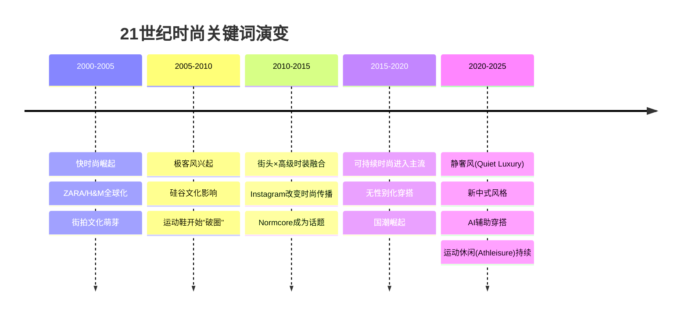
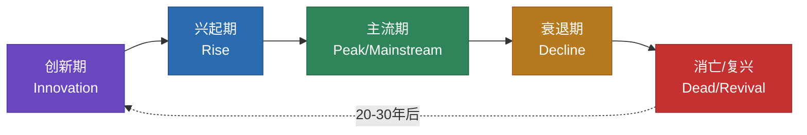

## 五、服装史与时尚趋势

了解服装的历史演变不是为了成为时尚史学家，而是为了建立一个**判断框架**——理解为什么某些搭配规则存在、为什么某些款式被称为"经典"、以及如何在纷繁的潮流中做出不后悔的消费决策。时尚是一面镜子，映照着社会变迁、经济周期和文化心理。读懂这面镜子，你就能在穿搭上拥有远超普通人的判断力。

### 5.1 西方服装史：从身份标识到自我表达

#### 5.1.1 古代至18世纪：服装即权力

在人类历史的绝大部分时间里，服装的核心功能不是审美，而是**身份标识**。

**古埃及（公元前3000-300年）**：亚麻是主要面料，服装的复杂程度直接对应社会地位。法老穿戴多层亚麻缠腰布和假发，平民只能穿简单的裹布。服装史上第一次出现"面料等级"的概念——精细亚麻 vs 粗糙亚麻。

**古希腊与古罗马（公元前800-476年）**：古希腊人发明了**希顿（Chiton）**——一块方形布料通过别针和腰带固定在身上，追求自然垂坠的美感。这种"以布料的自然形态创造美"的理念，至今仍影响着极简主义设计。罗马人在此基础上发展出**托加（Toga）**，成为身份和公民权的象征——只有罗马公民才能穿托加，奴隶和外邦人不被允许。

**中世纪（476-1453年）**：欧洲各国开始通过**着装法令（Sumptuary Laws）**明确规定不同阶层可以穿什么颜色、什么面料、什么款式。紫色是皇室专属（因为提尔紫染料极其昂贵），丝绸和金线只有贵族才能使用。服装第一次成为**立法管控的对象**，这说明了服装的社会影响力有多大。

**文艺复兴至巴洛克时期（14-17世纪）**：服装成为权力和财富的展示工具。男性穿紧身裤、填充上衣、高领褶领（Ruff），女性穿鲸骨胸衣和巨大的裙撑。这一时期的服装极度华丽但极不舒适——为了美可以牺牲一切。这种"形式压倒功能"的理念，在后来的极简主义运动中被彻底推翻。

**关键启示**：在长达数千年的时间里，普通人几乎没有"穿搭选择权"——你穿什么取决于你是什么身份。现代人享有的穿搭自由，其实是最近200年才出现的。

#### 5.1.2 19世纪：现代男装的诞生

19世纪是服装史的分水岭。工业革命带来了成衣制造业，中产阶级的崛起打破了贵族对时尚的垄断，而一个叫**博·布鲁梅尔（Beau Brummell）**的人，彻底改写了男装的规则。

布鲁梅尔是19世纪初英国社交界的风云人物，他是乔治四世王子的密友，被誉为"现代男装之父"。在那个男装也讲究蕾丝、刺绣和高跟鞋的时代，布鲁梅尔提出了一个革命性的理念：**真正的优雅不在于装饰，而在于合身与简洁**。

他确立了沿用至今的男装核心原则：
- **合身剪裁**：服装应该贴合身体线条，而不是用填充物制造虚假的轮廓
- **深色为主**：黑色、深蓝、深灰取代了此前贵族偏好的明亮色彩
- **面料质感**：用顶级面料的触感和光泽替代花哨的装饰
- **细节考究**：衬衫的领型、袖扣的材质、鞋子的抛光程度——细节体现品味

**维多利亚时代（1837-1901年）**：西装三件套（外套+马甲+裤子）的基本形态在这一时期确立。裁缝行业从伦敦萨维尔街（Savile Row）起步，成为全球定制男装的圣地。1858年，英国人查尔斯·弗雷德里克·沃斯（Charles Frederick Worth）在巴黎开设了第一家高级定制时装屋（Haute Couture），第一次将设计师的名字标签缝在衣服上——**设计师品牌**的概念由此诞生。

**关键启示**：布鲁梅尔的理念在200年后依然成立——合身、简洁、注重面料和细节，是男装品味的永恒基石。追求这四点永远不会出错，无论潮流如何变化。

#### 5.1.3 20世纪：女性时装的五次革命

20世纪的女性时装经历了五次根本性的变革，每一次都折射着社会运动和女性地位的变化：

**第一次革命（1900-1920年代）：从束缚到解放**

19世纪末的女性被紧身胸衣（Corset）牢牢束缚，腰围被压缩到极端的16-18英寸（40-46厘米），导致肋骨变形和内脏移位。一战期间，女性进入工厂工作，紧身胸衣成为工作的障碍。

**可可·香奈儿（Coco Chanel）**是这场革命的核心人物。她做了几件划时代的事：
- 用**杰西针织（Jersey）**面料制作女装——这种此前只用于男性内衣的面料，赋予了女性前所未有的行动自由
- 推出了**小黑裙（Little Black Dress, LBD）**——此前黑色只用于丧服，香奈儿将它变成了优雅的代名词
- 设计了**香奈儿套装（Chanel Suit）**——无领对襟外套搭配及膝裙，既优雅又实用
- 她本人的名言成为时尚哲学的基石："**潮流易逝，风格永存。**"

**第二次革命（1940-50年代）：曲线的回归**

二战结束后，克里斯汀·迪奥（Christian Dior）在1947年推出了"新风貌"（New Look）系列——收腰、宽裙、强调女性曲线。在物资配给的战争年代，女性被迫穿着朴素实用的服装；迪奥的"新风貌"象征着和平年代对美的重新追求。

**关键单品**：收腰连衣裙（Full Skirt Dress）、迪奥Bar套装、高跟鞋回归

**第三次革命（1960年代）：青年文化的冲击**

1960年代，"青年"第一次成为一个独立的消费群体和社会力量。**玛丽·奎恩特（Mary Quant）**发明了迷你裙（Mini Skirt），安德烈·库雷热（André Courrèges）推出了太空时代的白色靴子和几何剪裁。服装第一次开始**服务年轻人的审美**，而不是复制上一代的穿着。

**关键单品**：迷你裙、过膝靴、A字连衣裙、波普艺术图案

**第四次革命（1980年代）：权力着装**

女性大量进入职场，需要一套能传达专业感和权威感的着装。**乔治·阿玛尼（Giorgio Armani）**设计了女性权力套装（Power Suit）——宽肩、直线剪裁、深色调，模糊了男装和女装的界限。电视剧《豪门恩怨》（Dynasty）中的琼·柯林斯穿着垫肩套装的形象，成为80年代的标志性画面。

**关键单品**：宽肩西装、铅笔裙、大号耳环、红唇

**第五次革命（1990年代至今）：解构与多元**

从极简主义到街头风格，从高级定制到快时尚，女性时装进入了**多元化时代**。没有一种风格能主宰一切，每个人都可以定义自己的美。

**关键转变**：
- 90年代极简主义：卡尔文·克莱因（Calvin Klein）和吉尔·桑达（Jil Sander）用纯净的线条和中性色重新定义了高级感
- 2000年代快时尚：ZARA、H&M让T台趋势在数周内到达普通消费者的衣橱
- 2010年代街头化：运动鞋成为正装的一部分，卫衣可以搭配西装外套
- 2020年代可持续化：消费者开始反思"过度消费"，买少买好成为新共识

#### 5.1.4 20世纪中后期男装的多样化

20世纪的男装同样经历了从单调到多元的演变，但节奏比女装慢得多：

| 年代 | 核心风格 | 代表元素 | 代表人物/品牌 | 社会背景 |
|------|---------|---------|-------------|---------|
| 1920-50年代 | 传统常春藤 | 灰色法兰绒西装、牛津衬衫、乐福鞋 | Brooks Brothers | 战后稳定、中产阶级扩张 |
| 1960年代 | Mod风 | 修身西装、切尔西靴、帕克大衣、意大利 Vespa 摩托车 | The Beatles、The Who | 青年反叛、英国文化输出 |
| 1970年代 | 嬉皮与迪斯科 | 喇叭裤、花衬衫、厚底鞋、皮夹克 | David Bowie、Bee Gees | 反战运动、性解放、经济危机 |
| 1980年代 | 权力套装 | 宽肩大垫肩、双排扣西装、鲜艳领带 | Giorgio Armani、Donna Karan | 经济繁荣、华尔街文化 |
| 1990年代 | 极简与Grunge | 法兰绒衬衫、破洞牛仔裤、马丁靴；或极简纯色T恤+直筒裤 | Calvin Klein、Nirvana | 泡沫经济破裂、反消费主义 |
| 2000年代 | 嘻哈与品牌化 | 大Logo、宽松牛仔、运动鞋、棒球帽 | Jay-Z、Pharrell Williams | 嘻哈文化主流化、品牌崇拜 |
| 2010年代 | 精致休闲 | 修身剪裁、高帮运动鞋、层次叠穿、Normcore | Kanye West、Uniqlo、Acne Studios | 社交媒体、时尚民主化 |

**关键启示**：男装的每一次重大变化，都与社会事件密切相关。1960年代的修身西装反映青年反叛——他们拒绝父辈的宽松老派。1980年代的宽肩权力套装映射经济繁荣——穿得大、穿得贵就是成功。理解这一点，你就能预判趋势的走向——当社会心态发生变化时，服装风格一定会随之改变。

#### 5.1.5 21世纪：去中心化与个性化

21世纪的时尚格局发生了根本性变化——**没有单一的主流风格，只有无数的"微趋势"并存**。

**2000年代**：快时尚的黄金时代。ZARA的"两周上新"模式让普通消费者第一次能快速获得T台同款。但代价是巨大的环境成本——全球每年生产约1000亿件服装，其中85%最终进入垃圾填埋场。

**2010年代**：Instagram的崛起彻底改变了时尚的传播方式。以前时尚杂志编辑决定什么是美的，现在每一个有手机的人都可以成为时尚传播者。街头风格（Street Style）从亚文化变成主流——运动鞋+西装外套的组合在2015年前后从"不得体"变成了"时髦"。

**2020年代**：三个趋势同时主导：
1. **静奢风（Quiet Luxury）**：拒绝Logo，强调面料和剪裁——这是对快时尚过度消费的反弹
2. **可持续时尚**：从口号变成行动，二手交易平台年交易额突破百亿美元
3. **AI与个性化**：算法推荐、虚拟试衣、AI造型师开始改变购物体验

### 5.2 中国服装史：从"衣冠之国"到当代融合

作为中国读者，不了解本国服装史是一种巨大的知识缺失。中国有超过5000年的服饰文化，其中蕴含的美学原则和设计智慧，至今仍具有极高的参考价值。

#### 5.2.1 古代中国的服饰体系

中国是世界上最早建立**系统化服饰制度**的国家之一。早在周代（公元前1046-256年），就有详细的《周礼》规定了天子、诸侯、大夫、士的服饰标准——什么场合穿什么颜色、什么纹样、什么面料，都有严格规定。

**汉服的基本形制**：

| 形制 | 特征 | 适用场景 | 现代对应 |
|------|------|---------|---------|
| 深衣 | 上衣下裳连为一体，交领右衽 | 日常、礼服 | 连衣长袍 |
| 襦裙 | 短上衣+长裙 | 日常女性 | 衬衫+半裙 |
| 直裾 | 直襟长袍，不开衩 | 日常文人 | 长款风衣 |
| 曲裾 | 绕身缠裹的长袍 | 礼服 | 礼仪场合着装 |
| 圆领袍 | 圆领、窄袖、长袍 | 官服、军服 | 中山装的原型之一 |

**"衣冠之国"的深层含义**：中国古人认为，服装不仅是遮体的工具，更是**道德修养的外在表现**。《左传》记载："中国有礼仪之大，故称夏；有服章之美，谓之华。"——"华夏"这个名字本身就与服饰之美相关。

**中国古代的色彩体系**：中国的传统色彩不是简单的"红黄蓝绿"，而是一套精密的文化语言：
- **正色**（青、赤、黄、白、黑）：五行对应，地位最高
- **间色**：正色混合而成，地位较低
- **黄色**在唐代以后成为皇室专用
- **紫色**在某些朝代（如唐代）比朱色地位更高

#### 5.2.2 近代中国的服饰变革

**中山装的诞生（1920年代）**：孙中山先生主导设计的中山装，是中国从传统服饰向现代服饰过渡的标志性作品。它融合了西式军装的结构和中式审美的含蓄——四个口袋代表礼义廉耻，五个纽扣代表五权分立，袖口三个纽扣代表三民主义。中山装证明了一件事：**服装可以承载价值观和文化认同**。

**旗袍的演变（1920-40年代）**：旗袍从清代满族的宽大袍服，经过上海裁缝的改良，变成了贴合女性曲线的现代时装。1930年代的上海旗袍黄金期，产生了"中西合璧"的经典美学——西式裁剪技术+中式面料图案+东方女性体态。

**1949年后的制服时代**：
- 1950-60年代：中山装、列宁装成为主流，服装高度统一化
- 1966-76年代：军装成为全民追捧的对象，绿色军装是那个时代的"时尚单品"
- 1978年改革开放：牛仔裤、喇叭裤、花衬衫涌入中国，年轻人第一次有了穿搭选择

#### 5.2.3 当代中国时尚的崛起

**1990-2000年代：模仿与追赶期**。中国消费者大量接触西方品牌，"穿名牌"成为身份象征。这一时期的核心问题是：**穿什么品牌比怎么穿更重要**。

**2010年代：国潮觉醒**。李宁在2018年纽约时装周的"悟道"系列成为中国时尚的转折点——它证明了中国品牌可以同时拥有文化自信和国际水准。此后，安踏收购FILA、波司登转型高端羽绒服、鄂尔多斯重塑羊绒形象，中国品牌开始从"便宜替代品"变成"有文化价值的选择"。

**2020年代：新中式风格**。新中式不是简单地在衣服上加盘扣和龙纹，而是将中国传统美学的**精神内核**（含蓄、留白、不对称美、自然材质）融入现代设计。

**新中式在日常穿搭中的融入方式**：

| 元素 | 传统形态 | 现代演绎 | 适用场景 |
|------|---------|---------|---------|
| 立领 | 明代竖领 | 立领衬衫、立领夹克 | 办公、文化活动 |
| 盘扣 | 手工花式盘扣 | 简化盘扣装饰 | 休闲、半正式 |
| 中式面料 | 织锦、香云纱 | 棉麻混纺、改良丝绸 | 四季皆可 |
| 不对称门襟 | 交领右衽 | 不对称拉链、斜襟设计 | 个性化穿搭 |
| 水墨色调 | 靛蓝、月白、鸦青 | 低饱和度蓝灰系 | 日常百搭 |

**关键启示**：对于28岁的中国男性，新中式是一个值得探索的风格方向。它既体现了文化认同，又不过度张扬。一件改良立领衬衫搭配修身西裤，在文化活动、节日聚会甚至某些职场环境中，都是既有品味又得体的选择。

### 5.3 时尚趋势的运作机制

大多数人对时尚趋势的理解停留在"今年流行什么"的层面。要真正掌握趋势，需要理解它的**底层运作机制**——趋势是如何产生、传播和消退的。

#### 5.3.1 时尚周期理论

时尚研究者通常将趋势分为五个阶段，形成一个完整的生命周期：

| 阶段 | 时间跨度 | 谁在穿 | 风险等级 | 你的策略 |
|------|---------|--------|---------|---------|
| **创新期** | 趋势出现后的1-2年 | 设计师、时尚编辑、先锋人士 | 极高——可能只是昙花一现 | 观察，不投入 |
| **兴起期** | 第2-3年 | 时尚博主、意见领袖、早期采纳者 | 中高——趋势正在成型 | 小范围尝试1个元素 |
| **主流期** | 第3-5年 | 大众消费者 | 低——已经被验证 | 选择适合自己身材的版本 |
| **衰退期** | 第5-8年 | 开始被抛弃 | 中——显得过时 | 逐步淘汰，回归经典 |
| **消亡/复兴** | 20-30年后 | 怀旧者/新一代重新发现 | 看具体情况 | 复兴版通常比原版更精致 |

**实际案例——运动鞋的时尚化**：
- **创新期（2008-2012）**：Kanye West穿Nike Air Yeezy出现在格莱美红毯，当时被视为"不得体"
- **兴起期（2013-2016）**：Kanye转投Adidas推出Yeezy系列，Pharrell与Adidas合作NMD，运动鞋开始出现在时装周街拍
- **主流期（2017-2020）**：运动鞋+西装外套成为标准搭配，各大奢侈品牌推出自己的运动鞋
- **当下（2024-）**：运动鞋仍然主流但开始分化——极简运动鞋（如Common Projects）和chunky老爹鞋并存

**对你的建议**：作为28岁的男性，你应该重点关注**主流期**的趋势——它们已经经过验证，风险最低，性价比最高。创新期的趋势留给时尚从业者去试错。

#### 5.3.2 趋势的三大驱动力

每一个时尚趋势的出现都不是偶然，它背后通常有以下三种力量之一在推动：

**驱动力一：社会事件与文化运动**

- 一战/二战→女性进入职场→裤装成为女性服装
- 1960年代反战运动→嬉皮风格→喇叭裤、流苏、扎染
- 2020年疫情→居家办公→运动休闲（Athleisure）全面主流化
- 中国国力提升→文化自信→新中式风格兴起

**驱动力二：技术革新**

- 合成纤维（1930年代）→尼龙丝袜、涤纶衬衫→服装成本大幅下降
- 弹性面料（1958年莱卡发明）→修身剪裁成为可能
- 数码印花（2000年代）→复杂图案不再昂贵
- 3D针织（2010年代）→无缝服装、定制化生产

**驱动力三：亚文化向上渗透**

几乎所有主流时尚趋势都起源于亚文化，然后被主流吸收：

| 亚文化 | 原始形态 | 主流化后的版本 | 渗透时间 |
|--------|---------|-------------|---------|
| 街头/嘻哈 | 宽松T恤、运动鞋、棒球帽 | 精致街头风、运动鞋正装化 | 15-20年 |
| 朋克 | 皮夹克、铆钉、破洞 | 机车夹克成为经典单品 | 10-15年 |
| 军事 | 迷彩、工装裤、飞行员夹克 | 工装风、军事元素融入日常 | 已完全主流化 |
| 滑板 | 宽松牛仔裤、Vans、图案T恤 | Normcore、舒适优先 | 10年 |
| 日系原宿 | 叠穿、oversized、不对称 | 剪影不对称设计进入高端时装 | 持续影响 |

**关键启示**：当你看到一个小众群体的穿着开始出现在主流社交媒体上时，它很可能正处于"创新期→兴起期"的过渡阶段。如果你喜欢这个风格，可以开始小规模尝试；如果你觉得它不适合你，放心忽略——大部分亚文化元素在主流化过程中会被大幅简化和"驯化"。

#### 5.3.3 趋势的"20年轮回"规律

时尚界有一句老话："**如果你活得够久，你的衣橱会再次变时髦。**" 这不是玩笑——时尚趋势确实存在约20年的轮回周期。

为什么会这样？原因有二：
1. **怀旧周期**：当一个时代的年轻人成长为主流消费群体（通常20-30年后），他们会怀念自己年轻时的审美，并将其重新引入时尚
2. **代际反叛**：每一代年轻人都会反叛上一代的审美——当80年代的华丽被90年代的极简替代后，2000年代又开始追求华丽

**近年的轮回实例**：
- 1990年代的极简主义 → 2010年代的Normcore和极简回潮
- 1970年代的喇叭裤 → 2020年代重新出现在秀场
- 1980年代的宽肩 → 2023-24年Oversize西装回潮
- Y2K（2000年代初）的低腰裤、亮片 → 2022-23年Z世代追捧Y2K风格

**对你的实用意义**：如果你对当下的潮流不感兴趣，可以选择任何"上一轮回的经典版本"作为穿搭基础。比如，1990年代的极简主义风格——纯色T恤+直筒裤+简约运动鞋——永远不会真正"过时"，因为它每20年就会"回来"一次。

### 5.4 当代核心时尚趋势深度解读

以下是对当前（2024-2026年）主要时尚趋势的深度分析，每个趋势都包含：本质原因、核心单品、适合的人群、以及不建议盲目跟风的情况。

#### 5.4.1 可持续时尚（Sustainable Fashion）

**本质**：不是一种"风格"，而是一种**消费理念的根本转变**——从"买更多"到"买更好"。

**驱动因素**：
- 环境意识觉醒：时尚产业是全球第二大污染产业（仅次于石油）
- 经济理性回归：快时尚的"单次穿着成本"其实远高于高品质单品（参见本章概览中的"衣橱ROI"概念）
- 社交认同转变：在某些圈子里，"穿二手vintage"比"穿当季新品"更有面子

**核心实践**：

| 策略 | 具体做法 | 难度 | 适合你的原因 |
|------|---------|------|------------|
| 买少买好 | 每季只购入2-3件高品质单品，替代"每周买一件"的快消习惯 | ★★☆ | 减少决策疲劳，聚焦核心单品 |
| 二手时尚 | 闲鱼、Depop、Vestiaire Collective购买vintage单品 | ★★★ | 可以低价获得高品质品牌 |
| 环保面料 | 优先选择有机棉、再生聚酯、天丝（Tencel）、亚麻 | ★★☆ | 与面料知识章节结合使用 |
| 胶囊衣橱 | 用30-40件单品组合出所有场合的搭配 | ★★★★ | 需要一定的搭配功底 |
| 修复与改造 | 学会基本的缝纫修补，延长服装寿命 | ★★☆ | 减少不必要的消费 |

**适合你的优先级**：以你的身材特点（普通身高，五五开），"买少买好+胶囊衣橱"是最值得优先实践的。因为你的体型需要非常精准的版型和尺码，快时尚的通用版型往往不合身，反而浪费钱。

#### 5.4.2 静奢风（Quiet Luxury / Old Money Aesthetic）

**本质**：对Logo崇拜和炫耀性消费的反动——"**我穿得好，但我不需要让你知道这是什么牌子。**"

**核心原则**：
- **无Logo或极隐Logo**：没有明显品牌标识，品质体现在面料和剪裁上
- **中性色调**：驼色、米白、海军蓝、灰色、深绿——不刺眼但有质感
- **顶级面料**：羊绒、精纺羊毛、真丝、高支棉——触感即品质
- **完美剪裁**：合身但不紧身，每一条线条都经过推敲

**代表品牌与价格区间**：

| 定位 | 品牌 | 价格区间（单品） | 核心优势 |
|------|------|----------------|---------|
| 顶级 | Loro Piana、Brunello Cucinelli、The Row | ¥10,000-50,000+ | 面料和工艺的极致 |
| 高端 | Max Mara、Jil Sander、Ami Paris | ¥3,000-15,000 | 设计感+品质的平衡 |
| 轻奢 | COS、Massimo Dutti、Theory | ¥500-3,000 | 可负担的高品质基础款 |
| 高性价比 | Uniqlo U系列、MUJI、ZARA Studio系列 | ¥200-800 | 基础款品质优秀，价格友好 |

**适合你的落地建议**：
- **入门**：从轻奢和高性价比品牌开始，购入3-5件无Logo高品质基础款（羊绒毛衣、精纺西裤、简约皮鞋）
- **进阶**：投资1-2件经典外套（如驼色大衣、深蓝Blazer），选择高支面料
- **避免的误区**：静奢风≠全买贵的。一件¥300的COS纯色T恤可能比一件¥3000的设计师印花T恤更符合静奢理念

#### 5.4.3 运动休闲（Athleisure）的持续演化

**本质**：运动服装和日常服装的边界已经永久模糊——这不是一个"趋势"，而是**新的着装常态**。

**演化路径**：
- **2010年代初**：运动裤+运动鞋出现在非运动场合（最初被嘲笑）
- **2015-2018年**：Lululemon等品牌将运动面料和时装设计结合
- **2019-2022年**：疫情推动居家办公，运动休闲成为全球主流
- **2023年至今**：分化为"精致运动休闲"（Polished Athleisure）和"纯运动风"

**适合日常穿着的运动休闲单品**：

| 单品 | 推荐版型 | 适合你的原因 | 避免的版本 |
|------|---------|------------|----------|
| 运动卫衣 | 修身短款（衣长到腰线） | 明确腰线，显高 | 过长的oversized款 |
| 针织运动裤 | 锥形剪裁、束脚 | 修饰腿型，显瘦 | 宽松直筒款 |
| 运动鞋 | 简洁设计、厚底3-4cm | 隐形增高 | 过于chunky的老爹鞋 |
| 运动夹克 | 立领、修身剪裁 | 干练利落 | 过于宽大的教练夹克 |

**你的特别注意**：对于普通身高的身高，运动休闲最大的陷阱是**宽松过度**——运动服装普遍偏大偏长，如果选不好尺码，会把你"淹没"在衣服里。选择修身或slim fit版本，衣长不要超过臀部。

#### 5.4.4 无性别化穿搭（Gender-Fluid Fashion）

**本质**：服装的性别属性正在弱化——**不是"男性穿女装"，而是"服装不再有性别的预设"**。

**日常融入方式**（不需要穿裙子才算"无性别"）：
- **色彩突破**：粉色、薰衣草紫、淡蓝——这些曾被认为是"女性色"的颜色，现在是男性衣橱的常规选项
- **廓形变化**：适度的oversize不再是"女装元素"，而是"舒适设计"
- **材质共享**：针织、丝绒、缎面——这些曾被性别化的面料，现在是中性面料

**适合你的切入点**：一件淡粉色的棉质Oxford衬衫、一条浅灰色的针织休闲裤、一双白色简约皮质运动鞋——这些都是"无性别化"的单品，但穿着起来非常自然，不会有任何突兀感。

#### 5.4.5 工装风与实用主义（Workwear / Utility）

**本质**：从蓝领工作服中提取的设计元素——强调功能性、耐用性、实用口袋。

**核心单品**：
- **工装裤（Cargo Pants）**：侧面大口袋，直筒或锥形剪裁
- **工装夹克（Chore Jacket）**：多口袋、宽松但不肥大、通常是棉帆布或灯芯绒材质
- **马丁靴/工装靴**：厚底、皮质、有设计感的缝线
- **法兰绒衬衫**：格纹、厚棉或羊毛混纺

**适合你的原因**：工装风格强调"实用和硬朗"，对于想要增加成熟感和男子气概的28岁男性来说，是一个非常好的风格方向。工装夹克的结构感可以增加肩宽的视觉效果，而锥形工装裤可以修饰腿型。

#### 5.4.6 新中式风格（深度展开）

在5.2.3节已经介绍了新中式的历史背景，这里重点展开如何在日常穿搭中落地。

**三个层次的融入**：

**层次一：元素点缀（入门）**
- 选择带有中式元素细节的现代服装：如立领衬衫、盘扣装饰的针织衫
- 配饰方面：玉石手串、编织手绑、中式盘扣钥匙扣
- 面料方面：亚麻、香云纱改良面料

**层次二：风格融合（进阶）**
- 上装：改良中山装夹克（立领、暗扣、修身剪裁）
- 下装：现代西裤或直筒牛仔裤
- 鞋：皮质乐福鞋或德比鞋
- 整体效果：东方韵味+现代利落

**层次三：完整表达（精通）**
- 全套新中式穿搭：定制立领外套+中式面料长裤+布鞋或皮鞋
- 适合场景：文化活动、节日聚会、艺术展览、重要会面
- 注意事项：避免过度装饰——好的新中式设计是"少即是多"

**购买渠道推荐**：
- **设计师品牌**：意树、密扇、ANGEL CHEN、PRONOUNCE
- **高性价比**：ZARA/UR的中国限定系列、淘宝独立设计师店铺
- **定制**：本地裁缝店定制立领衬衫，价格通常在¥300-800

### 5.5 如何建立个人的"趋势判断框架"

本节的目标不是告诉你"今年穿什么"——因为明年这些信息就过时了。目标是给你一套**终身可用的判断框架**，让你在面对任何趋势时都能做出理性决策。

#### 5.5.1 三条永恒法则

**法则一：经典款永不过时**

以下单品从1950年代至今从未退出过时尚舞台，再过50年也不会：

| 单品 | 最早流行年代 | 为什么不过时 | 适合你的版本 |
|------|------------|------------|------------|
| 白色Oxford衬衫 | 1920年代 | 极致百搭、中性、适应任何场合 | 修身剪裁、中等领宽 |
| 深蓝色Blazer | 1837年（维多利亚时代） | 介于正式与休闲之间，万能外套 | 单排两粒扣、短款 |
| 深色直筒/锥形裤 | 1960年代 | 修饰腿型、搭配无限制 | 深灰/藏青、九分长度 |
| 白色运动鞋 | 1970年代 | 休闲百搭、舒适 | 简洁设计、薄底或中等厚底 |
| 驼色大衣 | 1950年代（Max Mara奠定） | 提亮肤色、显贵气、经典色 | 中长款（到大腿中部）、H型剪裁 |
| 深色针织衫 | 1950年代 | 质感+舒适+百搭 | 圆领或V领羊绒毛衣 |

**法则二：趋势可以参考，不必追随**

每季出现的新趋势中：
- **约60%**在3年内消亡——不值得投入
- **约30%**会持续5-10年——可以选择性采纳
- **约10%**会演变成新的经典——值得提前布局

**你的筛选标准**（一个趋势值得尝试，当且仅当）：
1. 它适合你的身材——不适合普通身高/五五开身材的趋势，再流行也不碰
2. 它融入你现有的衣橱——不需要为了一个趋势买一整套新衣服
3. 它让你感到舒适和自信——穿得不自在的衣服，再好看也会被闲置
4. 它的单品可以在3个以上场合穿着——只能在特定场合穿一次的趋势单品，不值得投资

**法则三：适合自己的才是最好的**

"流行"是一个统计概念——它描述的是大多数人的选择。但你的身材、肤色、气质、生活方式都是独特的。用下面这个决策矩阵来评估每一个趋势：

趋势决策矩阵：

                    适合我的身材？
                    /            \
                  是               否
                  |                |
          融入现有衣橱？        → 不买
          /          \
        是             否
        |              |
    3+场合可穿？    → 可能买（如果特别喜欢）
    /          \
  是             否
  |              |
→ 果断买     → 犹豫就别买

#### 5.5.2 每年的趋势信息获取渠道

不需要成为时尚专家，但建议每年花**不超过2小时**了解当年的趋势动向。以下是高效的信息获取方式：

| 渠道 | 类型 | 适合你的原因 | 频率 |
|------|------|------------|------|
| GQ男士穿搭公众号 | 中文、实用导向 | 结合中国男性身材和场景 | 每周浏览5分钟 |
| 小红书穿搭标签 | 中文、真实用户 | 看真人穿搭而非模特照 | 需要时搜索 |
| Pinterest | 图片为主、灵感收集 | 建立个人穿搭灵感板 | 每月收集1次 |
| Vogue Runway App | 英文、专业权威 | 了解一线品牌趋势方向 | 每季浏览1次（约30分钟） |
| 线下商场 | 实体体验 | 试穿是检验趋势的唯一标准 | 每月1-2次 |

#### 5.5.3 建立你的"风格锚点"

了解历史和趋势之后，最重要的是确定自己的**风格锚点**——一个不随潮流变化的个人风格核心。

**风格锚点的三个组成部分**：

**1. 核心色盘（3-5个颜色）**
这是你衣橱中出现频率最高的颜色，应该基于你的肤色和气质确定（参见本章色彩理论小节）。例如：
- 主色：深蓝、深灰、白色
- 辅色：驼色、米色
- 点缀色：酒红、橄榄绿

**2. 核心廓形（2-3种版型）**
这是你穿上最自信的服装轮廓。对于你的身材：
- 上装：修身但不紧身，衣长到腰线
- 下装：中高腰、锥形或直筒、九分长度
- 外套：短款到中长款，有肩线结构

**3. 核心风格词（2-3个形容词）**
这是你希望穿搭传达的气质。例如：
- "干净利落"——拒绝过度装饰
- "低调有质感"——面料和细节说话
- "略带文化感"——偶尔融入新中式或其他文化元素

当你的风格锚点确定之后，面对任何潮流都能在5秒内做出判断——"这个趋势是否符合我的风格锚点？"如果不符合，果断跳过。

### 5.6 需要了解的时尚里程碑人物

以下是每一位对穿搭有基本认知的人都应该知道的时尚人物。不是为了"装有学问"，而是因为他们的理念**至今仍在影响你买到的每一件衣服**。

| 人物 | 年代 | 核心贡献 | 对你今天穿衣服的影响 |
|------|------|---------|-------------------|
| Beau Brummell | 1800年代初 | 奠定现代男装"简洁合身"理念 | 你穿的每一件合身西装都源于他的理念 |
| Coco Chanel | 1920年代 | 解放女性着装、创造小黑裙、倡导简洁 | 基础款理念、针织面料进入时装 |
| Christian Dior | 1947年 | "新风貌"确立女性时装的廓形体系 | 收腰设计、A字裙的原型 |
| Yves Saint Laurent | 1960年代 | 女性穿裤装上街、蒙德里安裙 | 性别界限模糊的开端 |
| Giorgio Armani | 1980年代 | 男装"解构"——去掉硬衬和垫肩 | 你穿的休闲西装比正式西装舒服，因为他 |
| Rei Kawakubo（川久保玲） | 1980年代 | 打破"美"的定义，不对称和黑色 | 极简主义和前卫设计的根源 |
| Martin Margiela | 1990年代 | 解构主义——衣服的反面也是设计 | "不完美"成为一种美学 |
| Virgil Abloh | 2010年代 | 街头×高级时装的桥梁 | 运动鞋正装化、Logo文化 |
| Phoebe Philo | 2010年代 | 极简主义女性时装的巅峰 | 静奢风的精神源头 |

### 5.7 关键术语速查表

| 术语 | 英文 | 含义 | 使用场景 |
|------|------|------|---------|
| 廓形 | Silhouette | 服装的整体轮廓形状 | "这件外套的廓形很修身" |
| 剪裁 | Cut/Tailoring | 面料的裁剪和缝制方式 | "Armani的剪裁非常干净" |
| 垂坠感 | Drape | 面料自然下垂的质感和线条 | "这件大衣的垂坠感很好" |
| 做旧 | Washed/Distressed | 通过处理让服装呈现使用过的质感 | "这条牛仔裤是水洗做旧的" |
| 叠穿 | Layering | 多件服装的层次搭配 | "秋天适合叠穿" |
| 基础款 | Basics/Foundation | 设计简洁、百搭的核心单品 | "白T恤是最基础的基础款" |
| 潮流款 | Trend Piece | 带有当季流行元素的单品 | "这件印花衬衫是今年的潮流款" |
| Capsule Wardrobe | 胶囊衣橱 | 用少量精选单品覆盖所有场合 | "我的胶囊衣橱只有35件" |
| Haute Couture | 高级定制 | 法国法律保护的最高级别时装 | 参考知识，日常不涉及 |
| Ready-to-Wear | 成衣 | 标准尺码的批量生产时装 | 你日常购买的都是成衣 |
| Vintage | 古着/二手 | 有一定年代（通常20年以上）的服装 | "这是一件90年代的vintage夹克" |
| Normcore | 普通核心 | 刻意选择普通、非突出的穿着风格 | "他今天穿得很Normcore" |
| Athleisure | 运动休闲 | 运动服装用于日常非运动场合 | "卫衣+运动鞋就是典型的Athleisure" |
| Quiet Luxury | 静奢 | 低调奢华，无Logo高品质 | "这件毛衣很Quiet Luxury" |

### 5.8 实战应用：用服装史知识指导购物

学了这么多历史和趋势，最终要落实到"买什么"和"怎么买"。以下是三个实战应用场景：

#### 场景一：判断一件衣服是否值得买

购物时，在掏钱包之前问自己以下四个问题：

1. **这件衣服5年前好看吗？** 如果好看——它很可能是经典款。如果不好看——它很可能是过季即废的潮流款。
2. **这件衣服5年后还会好看吗？** 如果你不确定——选同类型的经典版本。
3. **这件衣服的面料经得起时间考验吗？** 便宜的聚酯纤维一年后就会起球变形。好的羊毛/棉面料可以穿5-10年。
4. **这件衣服能在3个以上场景穿着吗？** 只能在一个场景穿一次的单品，单次穿着成本极高。

#### 场景二：应对"我不知道现在流行什么"的焦虑

如果你不想花时间追趋势，但又不想穿得过于落伍，以下是最简单的解决方案：

**建立一个"永不过时衣橱"**——完全由经过时间验证的经典单品组成：

永不过时衣橱清单（男性版）：

上装（7件）：
  - 白色Oxford衬衫 ×1
  - 浅蓝色牛津衬衫 ×1
  - 白色纯棉T恤 ×2（一厚一薄）
  - 深色圆领针织衫 ×1
  - 灰色圆领卫衣 ×1
  - 黑色高领毛衣 ×1

下装（4条）：
  - 深蓝色直筒/修身牛仔裤 ×1
  - 卡其色/米色休闲裤 ×1
  - 深灰色西裤 ×1
  - 黑色休闲裤 ×1

外套（3件）：
  - 深蓝色Blazer ×1
  - 驼色/深灰大衣 ×1
  - 轻薄夹克（如教练夹克或工装夹克） ×1

鞋（3双）：
  - 白色简约运动鞋 ×1
  - 棕色皮质乐福鞋或德比鞋 ×1
  - 深色靴子（切尔西靴或沙漠靴） ×1

这17件单品可以组合出数十套不同场合的穿搭，且**任何时候拿出来都不过时**。

#### 场景三：在"想尝试新东西"和"不想出错"之间平衡

如果你想要在经典的基础上增加一点个性，**安全的做法是只在配饰和小件单品上尝试趋势元素**：

- 想试试亮色 → 买一条彩色的袜子或围巾（¥50-100），而不是一件亮色外套（¥2000+）
- 想试试工装风 → 买一顶工装风的帽子（¥80），而不是一整套工装裤+夹克（¥1500+）
- 想试试新中式 → 买一个玉石或编织手绑（¥100-200），而不是一件定制中式外套（¥800+）

如果这个元素你穿了3次以上仍然喜欢，再考虑购入同风格的大件单品。这种"试水→验证→升级"的策略，可以让你在不浪费钱的前提下，稳步扩展自己的穿搭边界。

### 5.9 常见误区

**误区一："越贵的衣服越好"**

真相：价格和品质的相关性在中等价位（¥500-3000）区间最高。低于这个区间，品质确实会下降；但高于这个区间，你支付的主要是品牌溢价、营销成本和利润率，而非等比例的品质提升。一件¥2000的羊绒毛衣和一件¥8000的羊绒毛衣，面料可能来自同一家供应商。

**误区二："经典款=无聊"**

真相：经典款是最高级的"画布"——它的简洁恰好为你提供了最大的发挥空间。通过不同的搭配组合、配饰选择、穿着方式（卷袖、塞衣角等），同一件经典单品可以呈现完全不同的面貌。真正无聊的不是经典款，而是千篇一律的穿法。

**误区三："追趋势就是不成熟"**

真相：完全不关注趋势也是一种问题——它可能导致你的穿着停留在10年前的审美，显得与时代脱节。正确的做法是**选择性采纳**——每年关注1-2个适合自己身材和风格的趋势元素，将它们融入经典款为主的衣橱中。

**误区四："vintage/二手=捡别人不要的"**

真相：Vintage市场中有大量保存完好、品质远超当代快时尚的经典单品。一件1990年代的Ralph Lauren牛津衬衫，面料和做工可能优于今天任何¥500以下的新品。更重要的是，Vintage是唯一能以平民价格获得"稀缺性"的途径——你穿的那件，全世界可能只有一件。

**误区五："中国品牌不行"**

真相：这个观念在2020年代已经严重过时。李宁的高端线、鄂尔多斯1980系列、ICICLE之禾、上下（Shang Xia）等中国品牌，在面料品质、设计水平和工艺水准上已经可以与国际品牌同台竞技，而且它们对中国人的身材和审美有更深入的理解。

***

**本节小结**：服装史和时尚趋势的学习，最终目的是建立你自己的**审美判断力**——不再被广告、博主和社交媒体牵着鼻子走，而是能基于对历史的理解和对趋势的洞察，做出适合自己的穿搭决策。记住：**了解历史是为了更好地活在当下，而不是为了怀旧。**