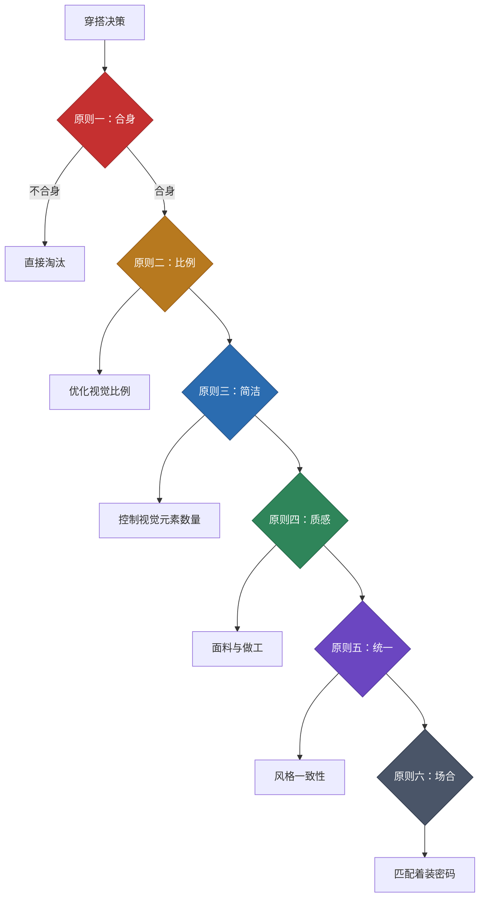
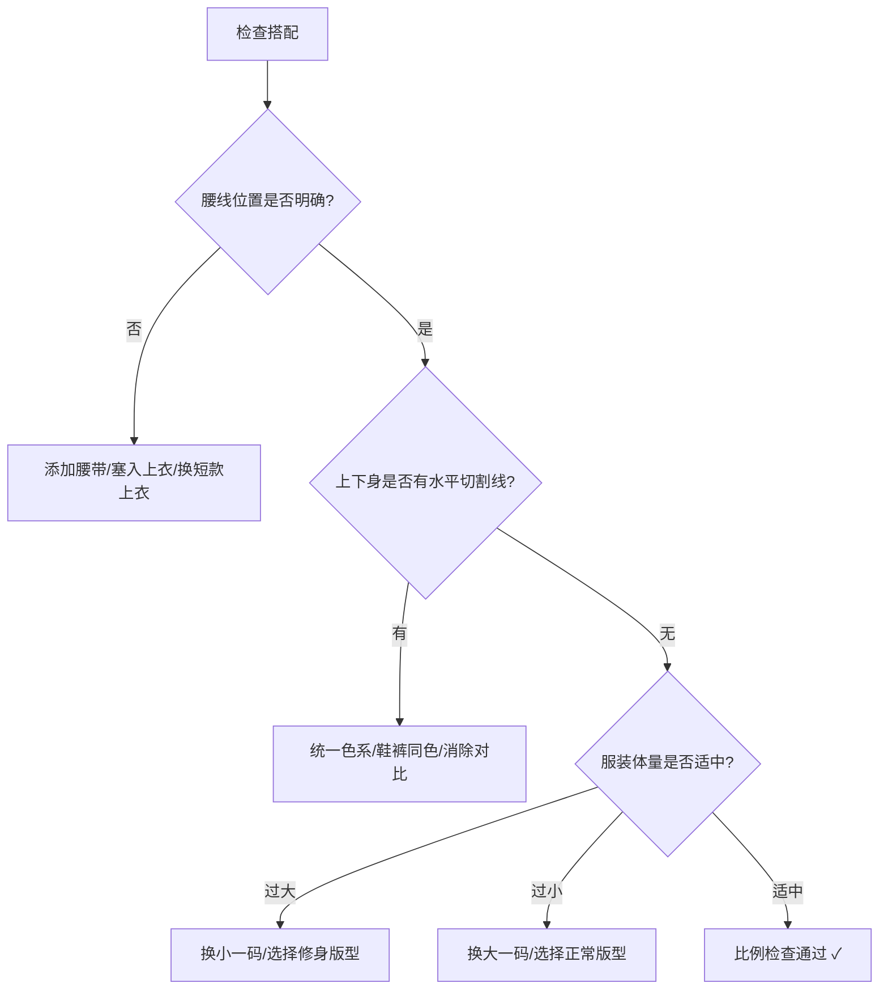

## 六、穿搭原则

> "原则不是限制，而是让你在无数选择中快速做出正确决策的导航仪。"

前面五节分别讲解了色彩理论、体型分析、风格理论、面料知识和服装史，这些都是"知识"层面的内容。但知识本身不会自动变成好的穿搭——你需要一套**行动准则**，将散落的知识点串联成可执行的决策框架。

穿搭原则就是这个框架。它回答的不是"什么是好看的"，而是"面对一件衣服，我该不该买、该不该穿、怎么穿"。

### 6.1 为什么需要穿搭原则

#### 6.1.1 信息过载时代的决策简化

打开任意一个购物平台，你会面对数以万计的服装选择。即使缩小到"白色T恤"这个品类，也有数百种不同的面料、版型、领型、长度组合。如果没有一套筛选原则，你会陷入两种困境：

- **选择瘫痪**：面对太多选项，反而不知道买什么，最后随便拿一件
- **冲动消费**：被促销、网红推荐或"好看"的直觉驱动，买回一堆穿不了的衣服

穿搭原则的核心价值是**降低决策成本**。当你走进一家店，目光扫过一排衣服时，原则帮你用3秒排除掉80%不适合的选项，把精力集中在真正值得试穿的那20%上。

#### 6.1.2 原则 vs. 规则：区别在哪里

很多人把穿搭当作一套死板的规则来遵守——"不能穿白色裤子""矮个子不能穿长外套""胖人不能穿横条纹"。这种"规则思维"有两个致命缺陷：

| 维度 | 规则思维 | 原则思维 |
|------|---------|---------|
| 本质 | 记忆具体结论 | 理解底层逻辑 |
| 灵活性 | 遇到例外就懵 | 可以根据情况调整 |
| 适用性 | 只对特定情况有效 | 普适于所有场景 |
| 学习方式 | 死记硬背 | 理解后自然运用 |
| 进阶路径 | 需要不断学习新规则 | 原则不变，应用无限 |

举个例子："矮个子不能穿长外套"是一条规则。但如果你理解"视觉切割原理"（水平色块边界会切断纵向线条），你就会知道——矮个子穿长外套是可以的，只要内搭和外套颜色统一，不形成水平切割线就行。规则告诉你"不能"，原则告诉你"怎样才能"。

#### 6.1.3 六大原则的整体框架

本节提出的六大穿搭原则并非孤立存在，它们之间有明确的优先级关系和逻辑递进：

**优先级说明**：合身是第一道关卡，不合身的衣服无论多好看、多贵都不值得买。通过合身筛选后，再用比例优化来调整视觉效果，然后用简洁原则控制整体协调性，接着检查质感是否达标，再看风格是否统一，最后确认是否适合目标场合。这个顺序不是随意排列的——每一条原则都是在前一条基础上的递进优化。

### 6.2 原则一：合身至上——穿搭的第一道铁律

#### 6.2.1 为什么合身是第一原则

一件合身的99元白T恤，穿出来的效果可以碾压一件不合身的999元设计师品牌T恤。这不是夸张——认知心理学中的"格式塔效应"（Gestalt Effect）告诉我们，人类的视觉系统首先感知的是整体轮廓，然后才是细节。合身的衣服勾勒出的身体轮廓是自然、流畅的，而不合身的衣服会在身体上形成各种突兀的褶皱、堆积和空洞，破坏整体轮廓的和谐感。

对于普通身高的身材来说，合身的重要性更加突出。高个子穿宽松一点还能撑起来，矮个子一旦衣服不合身，多余的面料会直接吞没你的身体存在感，让你看起来像"衣服穿人"而不是"人穿衣服"。

#### 6.2.2 合身的六条黄金标准

| 部位 | 合身标准 | 常见问题 | 检验方法 |
|------|---------|---------|---------|
| **肩线** | 接缝恰好落在肩膀边缘（肩骨头外侧1cm处） | 肩线滑落→显得邋遢；肩线太窄→束缚感 | 侧对镜子，检查肩线是否与肩骨头齐平 |
| **胸围** | 扣上扣子后，胸前面料能捏起约2-3cm（一拳余量） | 太紧→纽扣处出现X形褶皱；太宽→胸前鼓包 | 扣上最紧的扣子，检查是否能轻松插入一个拳头 |
| **腰身** | 腰部微微收窄，但不紧贴皮肤 | 太宽松→像穿了个桶；太紧→挤出赘肉 | 双手叉腰，检查腰部两侧是否有过多空隙 |
| **衣长** | 上衣下摆落在裤腰线以下5-8cm（约一个手掌宽度） | 太长→压矮身高；太短→弯腰露腰 | 双手自然下垂，指尖应刚好触及衣摆 |
| **袖长** | 袖口落在手腕骨处（衬衫）或手腕以上2cm（T恤） | 太长→显得手短；太短→像缩水了 | 手臂自然下垂，检查袖口与手腕的位置关系 |
| **裤长** | 裤脚轻触鞋面，形成一个轻微的褶皱（Break） | 太长→裤脚堆积像手风琴；太短→露出袜子 | 穿上鞋子站立，裤脚应刚好触及鞋舌 |

#### 6.2.3 普通身高身材的合身特殊要求

对于普通身高的身高，以下几个合身细节需要额外注意：

**衣长是生命线**。衣长每多出3cm，视觉上就会矮1cm。具体标准：
- T恤/针织衫：下摆落在腰带扣位置，不超过 belt line 以下5cm
- 衬衫：塞入裤腰后，衬衫下摆刚好能固定在裤腰内（不需要用力扯）
- 外套/夹克：短款外套的下摆应在 belt line 附近，中长款不超过臀部中线
- 卫衣/休闲上衣：选择短款版型，避免oversized

**裤长精确到厘米**。普通身高身材的裤子，理想裤长应该是：
- 修身西裤：裤脚轻触鞋面，Break深度约1-2cm（轻微褶皱）
- 牛仔裤：直筒款可以略微堆叠（1-2个褶皱），修身款保持平整
- 休闲裤/棉裤：与西裤标准相同，避免过多堆积

**袖长宁短勿长**。袖子过长会让手臂看起来更短，进而压低视觉身高。衬衫袖口应精确落在手腕骨处，T恤/针织衫的袖口在上臂中段偏下。

#### 6.2.4 合身的进阶理解：不是"紧身"

很多初学者把"合身"误解为"紧身"，这是一个危险的误区。合身和紧身的核心区别：

| 维度 | 合身 | 紧身 |
|------|------|------|
| 贴合度 | 顺应身体轮廓，留有活动空间 | 紧贴皮肤，勾勒肌肉/赘肉轮廓 |
| 舒适度 | 可以轻松抬手、弯腰、坐下 | 活动受限，坐下时腰部/大腿勒紧 |
| 视觉效果 | 干净利落，身材轮廓自然 | 赘肉被挤出，过于暴露身材缺陷 |
| 面料状态 | 面料自然下垂，无多余褶皱 | 面料被拉伸，出现横向拉扯纹路 |
| 适用场合 | 几乎所有场合 | 仅限健身房、运动场景 |

**自测方法**：穿上衣服后，做以下四个动作——举手过头、双手前伸抱拳、坐下弯腰系鞋带、原地深蹲。如果任何一个动作让你感到束缚或衣服变形严重，说明这件衣服太紧了。

### 6.3 原则二：比例优化——穿搭的视觉魔法

#### 6.3.1 比例优化的科学基础

人类的视觉系统有一个内置的"比例偏好"——我们会自然地认为符合黄金比例（0.618:1）的事物更加和谐美观。这个偏好不是后天学习的，而是人类视觉皮层的先天特性，神经科学实验已经反复证实。

在穿搭领域，比例优化的核心目标就是：**让身体的视觉比例向黄金比例靠近**。

具体到男性身材，理想比例是：
- **头身比**：头部长度占身高的 1/7.5 到 1/8（即头长约为身高除以7.5-8）
- **上下半身比**：下半身占身高的 0.618（即腰线位于身高×0.618处）
- **肩腰比**：肩宽与腰围的比值接近 1.618:1（倒三角体型的黄金比例）

以普通身高、五五开身材为例：
- 理想腰线位置：165 × 0.618 ≈ 102cm（从地面算起）
- 实际腰线位置：165 × 0.5 = 82.5cm
- 需要弥补的差距：102 - 82.5 = 19.5cm

虽然完全弥补19.5cm几乎不可能，但通过穿搭技巧可以实现**视觉上提升8-12cm**的效果。

#### 6.3.2 三大比例优化策略

**策略一：提升视觉腰线**

提升腰线是比例优化中最立竿见影的手段。具体方法按效果从强到弱排列：

| 方法 | 视觉提升效果 | 难度 | 适用场景 |
|------|------------|------|---------|
| 高腰裤 + 上衣塞入 | +5-8cm | 低 | 日常通勤、正式场合 |
| 短款上衣（长度在 belt line） | +3-5cm | 低 | 休闲场合 |
| 腰带明确标记腰线 | +2-3cm | 低 | 所有场合 |
| 同色系鞋裤延伸 | +3-4cm | 中 | 需要搭配功力 |
| 内搭塞入 + 外套敞开露出腰线 | +4-6cm | 中 | 秋冬叠穿 |

**策略二：统一上下身色系**

水平方向的色块边界会将身体"切断"，这是矮个子的大敌。消除水平切割线的核心方法：

- **同色系搭配**：上下身选择同一色系但不同深浅的颜色（如深蓝上衣 + 浅蓝牛仔裤）
- **近似色搭配**：上下身选择色轮上相邻的颜色（如卡其色裤子 + 米色上衣）
- **鞋裤同色**：鞋子和裤子选择相近颜色，让腿部线条向下延伸到鞋尖

**反面案例**：白T恤 + 黑色裤子 + 白色运动鞋，会在身体上形成三条水平切割线（T恤下摆、裤腰、鞋口），将身体切成四段，视觉上矮3-5cm。

**策略三：控制服装体量**

服装的"体量"指它在视觉上占据的空间大小。体量过大或过小都会破坏比例：

- **体量过大**（oversized卫衣、宽松工装裤）：衣服在身体上形成大量多余面料，吞没身体轮廓，让人看起来更矮更胖
- **体量过小**（紧身T恤、窄脚裤）：衣服紧贴身体，暴露所有身材缺陷，同时让头部在视觉上显得更大
- **体量适中**（合身但不紧贴）：衣服顺应身体轮廓，留有适当活动空间，身体线条清晰自然

对于普通身高/正常体重的身材，理想的体量控制是：合身剪裁为主，避免任何oversized单品，裤子选择修身直筒而非紧身或宽松。

#### 6.3.3 比例优化的决策流程

面对一套搭配，按以下顺序检查比例：

### 6.4 原则三：少即是多——简洁的高级感

#### 6.4.1 为什么简洁更高级

"少即是多"（Less is More）是建筑大师密斯·凡·德·罗（Mies van der Rohe）的名言，在穿搭领域同样适用。简洁之所以更高级，有三个层面的原因：

**认知层面**：人类的视觉系统在处理简单信息时更加高效。当你的穿搭元素过多（多种颜色、多种图案、多种材质、多种配饰同时出现），观察者的视觉系统需要同时处理大量信息，产生"认知负荷"，结果不是觉得"好丰富"，而是觉得"好乱"。

**信号层面**：在社交心理学中，穿搭是"信号传递"的工具。简洁的搭配传递的信号是"我有足够的自信，不需要用复杂的装饰来吸引注意力"；而过于复杂的搭配传递的信号是"我在努力表现，但不确定什么适合我"。

**美学层面**：高级时装品牌的设计师几乎无一例外地推崇简洁。无论是Celine的Phoebe Philo、Jil Sander，还是Brunello Cucinelli，他们的设计哲学都遵循一个共同点——**用最少的元素传递最大的信息量**。

#### 6.4.2 "三"的法则：量化简洁

简洁不是抽象的概念，而是可以量化的。以下是"三的法则"：

| 维度 | 上限 | 说明 |
|------|------|------|
| 全身颜色 | 3种 | 包括鞋子和配饰的颜色，中性色（黑白灰棕米）不计入 |
| 视觉焦点 | 1个 | 整套搭配只有1个吸引眼球的亮点，其余部分都是"背景" |
| 配饰数量 | 3件 | 手表、腰带、项链、戒指、手环等总数不超过3件 |
| 图案元素 | 1种 | 全身只出现1种图案（条纹、格子、印花等），其余纯色 |
| 材质种类 | 2-3种 | 全身面料材质不超过3种，避免质感冲突 |

**举例说明**：

**好的搭配**（遵循"三的法则"）：
- 深蓝色修身西装（颜色1） + 白色衬衫（颜色2） + 棕色皮鞋和腰带（颜色3，同色系）
- 视觉焦点：西装的剪裁线条
- 配饰：手表（1件）
- 图案：无
- 材质：羊毛（西装） + 棉（衬衫） + 皮革（鞋/带）

**差的搭配**（违反"三的法则"）：
- 红色格纹衬衫（颜色1+图案1） + 绿色工装裤（颜色2） + 白色运动鞋（颜色3） + 金色项链（颜色4+配饰1） + 棒球帽（配饰2） + 双肩包（配饰3） + 手环（配饰4）
- 视觉焦点：太多，不知道看哪里
- 配饰：4件，超标
- 图案：2种（格纹+工装口袋），超标
- 材质：4种，超标

#### 6.4.3 建立"简洁衣橱"的具体步骤

**第一步：确定基础色盘**

选择2-3个中性色作为衣橱的基础色。对于28岁男性，推荐以下组合：

| 风格倾向 | 基础色盘 | 点缀色建议 |
|---------|---------|-----------|
| 经典商务 | 深蓝 + 灰 + 白 | 酒红、深绿 |
| 都市休闲 | 黑 + 灰 + 卡其 | 白、军绿 |
| 自然文艺 | 橄榄绿 + 卡其 + 米白 | 深蓝、砖红 |
| 极简主义 | 黑 + 白 + 灰 | 驼色、海军蓝 |

**第二步：建立"核心五件"**

无论什么风格，以下五件单品是简洁衣橱的基石：

1. **白色圆领/V领T恤** × 2-3件（纯色，无logo）
2. **深色修身牛仔裤** × 1-2条（深蓝或黑色）
3. **深色休闲西裤/卡其裤** × 1-2条
4. **纯色衬衫** × 2件（白色 + 浅蓝或淡粉）
5. **深色针织衫/卫衣** × 1-2件

这五类单品可以组合出**至少30套不同的日常搭配**，而且每套都符合"三的法则"。

**第三步：遵循"一件亮点"原则**

每套搭配中，只允许1个元素是"亮点"——它可以是一件有设计感的上衣、一条特别的裤子、一双吸睛的鞋子、或一件抢眼的配饰。其余所有元素都应该是"背景板"，低调、简洁、不抢风头。

#### 6.4.4 常见的"不简洁"错误

| 错误类型 | 具体表现 | 纠正方法 |
|---------|---------|---------|
| 颜色过多 | 全身4种以上颜色 | 减少到3种，其余用中性色过渡 |
| Logo过多 | 衣服、裤子、鞋子都有明显品牌标识 | 选择无logo或小logo的基础款 |
| 图案叠加 | 条纹上衣 + 格子裤子 + 印花鞋 | 全身只保留1种图案 |
| 配饰堆砌 | 手表+手链+戒指+项链+胸针 | 保留最重要的1-2件，其余摘掉 |
| 设计元素过多 | 破洞+刺绣+印花+做旧 | 选择1个设计亮点，其余保持干净 |

### 6.5 原则四：质感优先——面料决定档次

#### 6.5.1 质感的定义：不只是"贵"

穿搭中的"质感"是一个综合概念，它包括三个维度：

- **面料质感**：面料本身的触感、光泽、垂坠感。羊绒的柔软细腻、亚麻的自然褶皱、真丝的流光溢彩——这些是面料的"性格"。
- **做工质感**：缝线是否平整、纽扣是否牢固、版型是否对称。做工差的衣服，再好的面料也会显得廉价。
- **设计质感**：剪裁是否考究、细节是否精致、比例是否协调。设计质感好的衣服，即使面料普通，也能穿出不错的效果。

三者的关系是：面料 > 做工 > 设计。一件面料好但设计简单的白T恤，穿出来的效果远好于一件设计花哨但面料廉价的T恤。

#### 6.5.2 面料等级详解

| 等级 | 面料 | 特性 | 适用场景 | 价格区间 |
|------|------|------|---------|---------|
| **顶级** | 羊绒（Cashmere） | 极致柔软、保暖、轻盈 | 秋冬针织衫、围巾、大衣 | ¥500-5000+ |
| **顶级** | 精纺美利奴羊毛 | 细腻、挺括、透气 | 西装、大衣、高品质毛衣 | ¥300-3000+ |
| **高级** | Supima/埃及长绒棉 | 光泽好、耐洗、手感滑 | T恤、衬衫、内衣 | ¥100-500 |
| **高级** | 真丝（Silk） | 流光、凉爽、亲肤 | 衬衫、领带、睡衣 | ¥200-2000+ |
| **高级** | 亚麻（Linen） | 透气、自然质感、会褶皱 | 夏季衬衫、裤子、西装 | ¥100-800 |
| **中级** | 优质普通棉（Combed Cotton） | 柔软、吸汗、耐穿 | T恤、卫衣、牛仔裤 | ¥50-300 |
| **中级** | 天丝（Tencel/Lyocell） | 光滑、环保、垂坠感好 | 衬衫、裤子、内衣 | ¥100-400 |
| **低级** | 普通聚酯纤维 | 不透气、起球、静电 | 尽量避免 | ¥20-100 |
| **低级** | 普通腈纶 | 起球严重、不保暖 | 尽量避免 | ¥10-50 |

#### 6.5.3 面料的实操鉴别方法

在购物时，如何快速判断面料质量？

**方法一：手感测试**
- 用手掌轻轻握住面料，感受它的柔软度和温度
- 优质棉会有一种"温暖的柔软感"，廉价化纤会有一种"冰冷的滑腻感"
- 用手指轻轻搓揉面料，优质面料松手后会迅速恢复平整，廉价面料会留下明显褶皱

**方法二：透光测试**
- 将面料对准光源（如灯光、窗户），观察透光程度
- 透光越均匀，说明面料编织越紧密、质量越好
- 如果透光不均匀（有的地方亮有的地方暗），说明面料编织粗糙

**方法三：标签阅读**
- 标签上的成分表是面料质量的"身份证"
- 优先选择：100%棉、100%羊毛、棉+氨纶（5%以内弹性纤维）、羊毛+羊绒混纺
- 谨慎选择：涤棉混纺（涤纶比例超过50%）、100%聚酯纤维、成分标注模糊的

**方法四：价格判断**
- 100元以下的"100%羊毛"大概率是假的或者品质极差
- 200元以下的"100%羊绒"几乎可以确定是假的
- 优质长绒棉T恤的合理价格区间：150-400元
- 优质羊毛衫的合理价格区间：500-2000元

#### 6.5.4 质感与预算的平衡策略

质感优先不意味着越贵越好。关键是**把钱花在刀刃上**：

**值得多花钱的单品**（高频穿着、面料差异明显）：
- 外套/大衣：面料和做工的差距在这一品类上最明显
- 西装：剪裁和面料直接决定穿着效果
- 鞋子：一双好鞋可以穿3-5年，单次穿着成本很低
- 针织衫/毛衣：羊绒和普通腈纶的差距是天壤之别

**可以节省预算的单品**（面料差异小、更新频率高）：
- T恤：优质棉T恤150-300元即可，不需要花大钱
- 内衣/袜子：舒适即可，不需要追求奢侈品牌
- 牛仔裤：200-500元的牛仔裤质量已经很好
- 运动服：功能性为主，品牌溢价高

### 6.6 原则五：风格统一——全身和谐感的来源

#### 6.6.1 什么是"风格统一"

风格统一是指全身所有单品在视觉语言上保持一致——它们应该"说同一种话"。

想象一下这个场景：你上半身穿了一件剪裁利落的深蓝色西装外套，下半身却配了一条宽松的运动裤，脚上踩着一双拖鞋。每件单品单独看都没问题，但组合在一起就会让人觉得"哪里不对"——因为西装外套说的是"正式、专业"的语言，运动裤说的是"休闲、放松"的语言，拖鞋说的是"居家、随意"的语言。三种语言混在一起，就像三个人同时用不同语言跟你说话，信息无法传达。

#### 6.6.2 风格维度的四个层面

风格统一需要在四个层面保持一致：

| 层面 | 说明 | 一致性要求 |
|------|------|----------|
| **正式度** | 正式 vs. 休闲 | 全身单品的正式程度应该相近（如：西装外套+休闲西裤 ✓；西装外套+运动裤 ✗） |
| **廓形** | 修身 vs. 宽松 | 上下身的宽松程度应该协调（如：修身T恤+修身直筒裤 ✓；紧身背心+宽松工装裤 ✗） |
| **色彩调性** | 沉稳 vs. 鲜艳 | 色彩的情绪应该统一（如：深蓝+灰色+白色 ✓；荧光绿+黑色+粉色 ✗） |
| **设计语言** | 简约 vs. 繁复 | 设计元素的密度应该相近（如：纯色T恤+纯色裤子 ✓；刺绣衬衫+破洞牛仔裤 ✗） |

#### 6.6.3 风格统一的实操方法

**方法一：建立"风格锚点"**

每套搭配选一个"锚点单品"——它决定了整套搭配的风格方向。然后让所有其他单品都围绕这个锚点来选择。

举例：
- 锚点：深蓝色修身西装 → 风格方向：Smart Casual
- 搭配：白色衬衫（正式度匹配）+ 深色修身牛仔裤（廓形匹配）+ 棕色皮鞋（调性匹配）+ 简约手表（设计语言匹配）

**方法二：使用"风格标签"系统**

给自己的每件衣服打上风格标签，出门前检查标签是否一致：

| 风格标签 | 代表单品 | 适配搭配 |
|---------|---------|---------|
| 正式商务 | 西装、衬衫、领带、皮鞋 | 同类单品互相搭配 |
| Smart Casual | 休闲西装、针织衫、卡其裤、乐福鞋 | 可以与正式商务部分混搭 |
| 都市休闲 | 卫衣、T恤、牛仔裤、运动鞋 | 同类单品互相搭配 |
| 运动户外 | 运动服、冲锋衣、运动裤、跑鞋 | 尽量同类搭配，不要混入其他风格 |

**方法三：进阶——"风格锚点+1"规则**

当你掌握了基础的风格统一后，可以尝试"锚点+1"规则：以风格锚点为基础，加入1件"跨风格"单品，创造有趣的对比感。

举例：
- 风格锚点：全套西装（正式商务）
- +1：白色运动鞋（都市休闲）
- 结果：正式中带一点休闲，既专业又不刻板

这个"+1"需要谨慎选择，它的作用是"调味"而不是"翻盘"。如果加了2件以上的跨风格单品，风格统一就会被破坏。

#### 6.6.4 风格冲突的常见场景

| 场景 | 为什么冲突 | 如何解决 |
|------|----------|---------|
| 西装外套 + 运动裤 | 正式度差距太大 | 换成休闲西裤或卡其裤 |
| 领带 + 圆领T恤 | 领带需要衬衫领来配合 | 换成衬衫，或去掉领带 |
| 皮鞋 + 运动短裤 | 正式度和场合不匹配 | 皮鞋配长裤，运动鞋配短裤 |
| 花衬衫 + 格纹裤子 | 两种图案互相打架 | 全身只保留1种图案 |
| 修身西装上衣 + 宽松工装裤 | 廓形对比过于极端 | 上下身选择相近的修身度 |

### 6.7 原则六：场合适配——穿对的衣，做对的事

#### 6.7.1 着装密码（Dress Code）体系

场合适配的核心是理解"Dress Code"——不同场合对穿着的隐性要求。违反Dress Code的后果是严重的：穿得太正式会让人觉得你"格格不入"或"装腔作势"，穿得太随意会让人觉得你"不尊重场合"或"不专业"。

以下是现代男性最常见的五种场合及其着装密码：

| 场合 | Dress Code | 核心要求 | 推荐搭配 |
|------|-----------|---------|---------|
| **正式商务** | Business Formal | 专业、权威、值得信赖 | 深色西装套装 + 白色/浅蓝衬衫 + 领带 + 皮鞋 |
| **商务休闲** | Business Casual | 专业但不刻板 | 休闲西装/针织衫 + 衬衫/Polo衫 + 卡其裤/西裤 + 乐福鞋 |
| **日常休闲** | Smart Casual | 舒适、干净、有品味 | T恤/卫衣 + 牛仔裤/休闲裤 + 运动鞋/板鞋 |
| **社交约会** | 偏正式的Smart Casual | 有亮点、显品味 | 合身上衣 + 修身裤子 + 干净的鞋 + 1-2件精致配饰 |
| **运动户外** | Athletic/Outdoor | 功能性为主 | 运动服/冲锋衣 + 运动裤 + 运动鞋 |

#### 6.7.2 场合适配的核心原则：宁可略正式，不要太随意

当不确定该穿什么时，遵循一个简单的原则：**比你认为需要的正式程度高半级**。

理由来自社会心理学中的"过度装扮效应"和"装扮不足效应"的研究结论：
- 穿得比场合正式一点，别人会觉得你"重视这次活动"，最多觉得你"有点讲究"
- 穿得比场合随意太多，别人会觉得你"不尊重"或"不专业"，这个印象很难纠正

具体操作：
- 朋友聚餐：不确定穿什么 → 选择Smart Casual（衬衫+卡其裤+乐福鞋），而不是运动服
- 公司团建：不确定穿什么 → 选择休闲Polo衫+牛仔裤+干净的运动鞋，而不是短裤拖鞋
- 相亲约会：不确定穿什么 → 选择合身的针织衫+修身裤子+皮质鞋，而不是T恤运动鞋

#### 6.7.3 场景转换的快速调整技巧

很多时候，你一天之内需要经历多个场合（如白天上班、晚上聚餐）。以下是一些快速调整的技巧：

**技巧一：外套切换法**
- 内搭保持不变（如白T恤+深色裤子）
- 外套随场合切换：上班加西装外套 → 下班换成牛仔夹克或休闲外套

**技巧二：鞋子切换法**
- 全身搭配保持不变
- 鞋子随场合切换：上班穿皮鞋 → 下班换成干净的运动鞋
- 鞋子是改变搭配正式度最有效的单品

**技巧三：配饰增减法**
- 基础搭配保持不变
- 正式场合加上领带、手表、口袋巾
- 休闲场合摘掉配饰，解开衬衫最上面的扣子

**技巧四：层次增减法**
- 秋冬季节，在基础搭配上增加层次
- 上班：T恤 + 衬衫 + 西装外套（3层，正式）
- 下班后：脱掉西装外套，只穿T恤 + 衬衫（2层，休闲）
- 进一步放松：衬衫敞开当外搭，露出里面的T恤（casual）

### 6.8 二八法则：穿搭效率的最大化

#### 6.8.1 衣橱的二八法则

帕累托法则在穿搭中的应用极为精准：**你衣橱里20%的单品，贡献了你80%的穿着次数**。

这意味着什么？意味着你衣橱里可能有80%的衣服是"沉睡"的——买了但很少穿、甚至从来没穿过。这些沉睡的衣服不仅浪费了你的金钱，还占据了宝贵的衣橱空间，让你在出门时面对一堆衣服却"没衣服穿"。

**衣橱诊断**：现在就打开你的衣橱，把所有衣服分成三堆：
- **高频堆**（每周至少穿1次）：通常只有5-10件
- **中频堆**（每月穿1-2次）：大约10-15件
- **低频堆**（超过1个月没穿过）：可能是最多的那堆

低频堆的衣服需要逐一审视：如果不合身就淘汰，如果适合但搭配困难就思考搭配方案，如果既不合身又搭配困难就果断处理掉。

#### 6.8.2 预算的二八法则

穿搭预算的分配同样遵循二八法则：

| 预算比例 | 投资方向 | 具体品类 | 原因 |
|---------|---------|---------|------|
| **80%** | 高频基础款 | 外套、裤子、鞋、衬衫、针织衫 | 这些是穿搭的"骨架"，质量直接影响整体效果 |
| **20%** | 低频亮点款 | 配饰、特殊场合单品、潮流元素 | 这些是穿搭的"调味料"，让基础搭配有变化 |

**具体预算建议**（假设月度穿搭预算1000元）：
- 800元用于：1件高品质外套 或 2条好裤子 或 1双好鞋
- 200元用于：1条围巾 或 1副墨镜 或 1顶帽子

#### 6.8.3 时间的二八法则

穿搭决策的时间分配：

- **80%的时间**花在"选对单品"上——研究面料、试穿版型、比较价格，确保买到的衣服是对的
- **20%的时间**花在"搭配"上——因为选对了单品，搭配自然水到渠成

很多人把时间分配搞反了——买的时候随便拿，出门前花半小时纠结怎么搭。正确的做法是反过来：买的时候多花时间选对，穿的时候直接拿起来就走。

### 6.9 迭代升级策略：从零到精通的五步法

#### 6.9.1 理解"迭代"的本质

穿搭提升不是一次性工程，而是一个持续迭代的过程。你不需要一次性买齐所有衣服、学会所有技巧——你需要的是一个**可持续优化的系统**。

迭代的核心逻辑是：**诊断 → 淘汰 → 补充 → 验证 → 优化**，然后循环。

#### 6.9.2 五步迭代法详解

**第一步：诊断与淘汰（第1周）**

目标：清理衣橱，移除所有"拖后腿"的单品。

淘汰标准（满足任何一条即淘汰）：

| 淘汰原因 | 判断标准 | 处理方式 |
|---------|---------|---------|
| 不合身 | 肩线不对、太长、太宽、太窄 | 捐赠或回收 |
| 品质下降 | 起球、褪色、变形、有顽固污渍 | 淘汰 |
| 长期闲置 | 超过6个月没穿过 | 转卖（闲鱼）或捐赠 |
| 风格不符 | 不符合你现在的风格定位 | 转卖或捐赠 |
| 有情感羁绊但不穿 | "舍不得扔但也不会穿" | 拍照留念后淘汰 |

淘汰完成后，统计剩余单品的数量和品类分布。这将成为你补充购物的起点。

**第二步：补充基础款（第2-4周）**

根据淘汰后的缺口，按优先级补充基础款：

| 优先级 | 品类 | 建议数量 | 预算建议 |
|--------|------|---------|---------|
| 最高 | 合身的深色裤子（西裤/牛仔裤） | 2-3条 | ¥200-500/条 |
| 最高 | 合身的白色/浅色T恤 | 3-4件 | ¥100-300/件 |
| 高 | 合身的衬衫（白色+浅蓝） | 2件 | ¥150-400/件 |
| 高 | 深色针织衫/卫衣 | 1-2件 | ¥200-500/件 |
| 中 | 百搭的外套（休闲西装/夹克） | 1件 | ¥400-1000 |
| 中 | 百搭的鞋（白色运动鞋/乐福鞋） | 1-2双 | ¥300-800/双 |

**第三步：建立搭配方案（第5-6周）**

将基础款组合成固定的搭配方案，建立"搭配卡片"：

搭配方案卡片 - 工作日通勤
├── 上衣：白色衬衫 / 浅蓝衬衫（轮换）
├── 下装：深色修身西裤 / 深色牛仔裤（轮换）
├── 鞋子：棕色乐福鞋 / 深色皮鞋（轮换）
├── 配饰：简约手表
└── 天气调整：+休闲西装外套（冷天）/ 换短袖衬衫（热天）

建议先建立3-5套覆盖不同场合的搭配方案，然后在此基础上逐步扩展。

**第四步：优化细节（第7-8周）**

当基础搭配稳定后，开始关注细节：

- **袜子**：纯色中筒袜，颜色与裤子或鞋子统一。告别白色运动袜配皮鞋
- **腰带**：皮质腰带，颜色与鞋子统一。宽度3-3.5cm最百搭
- **手表**：一块简约的皮带或钢带手表，是男性最重要的配饰
- **包**：一个简洁的通勤包（帆布托特包或皮质公文包），不要用塑料袋或双肩包配正装
- **袖子处理**：衬衫袖子可以卷到前臂中段，增加休闲感和层次感
- **裤脚处理**：修身裤子可以卷起1-2cm露出脚踝，显得更精神

**第五步：形成体系（第9周以后）**

经过前8周的实践，你应该已经形成了以下体系：

- **核心衣橱**：20-30件经过筛选的高品质单品
- **搭配方案**：5-8套覆盖不同场合的固定搭配
- **购物标准**：清楚自己适合什么面料、版型、颜色，购物效率大幅提升
- **决策习惯**：面对新单品时，会自然地用六大原则进行筛选

从此以后，你的穿搭进入"自动驾驶"模式——日常搭配不再纠结，购物决策快速准确，偶尔添置新单品也只是在现有体系上的微调和升级。

#### 6.9.3 迭代过程中的常见陷阱

| 陷阱 | 表现 | 后果 | 避免方法 |
|------|------|------|---------|
| 急于求成 | 一次性购入大量新衣服 | 预算超支，很多衣服不合适 | 每次只买1-2件，穿满意了再买下一批 |
| 盲目跟风 | 看到网红推荐就买 | 买回来不适合自己 | 先用六大原则筛选，再决定是否购买 |
| 忽略淘汰 | 只买新不扔旧 | 衣橱越来越臃肿，出门更难选 | 买一件新的，就淘汰一件旧的（"一进一出"原则） |
| 追求完美 | 纠结每一个细节 | 进展缓慢，丧失动力 | 接受"80分"的搭配，比之前好就是进步 |
| 忽视实践 | 只看理论不试穿 | 学了很多但穿搭没有改善 | 每学一个技巧，立刻在镜子前尝试 |

### 6.10 六大原则的冲突与协调

在实际穿搭中，六大原则之间有时会产生冲突。理解如何在冲突中做出取舍，是穿搭进阶的关键。

#### 6.10.1 常见冲突场景

| 冲突场景 | 涉及原则 | 协调方案 |
|---------|---------|---------|
| 合身的衣服面料很差 | 合身 vs. 质感 | 优先合身，面料可以逐步升级。先穿合身的便宜款，等找到合身+好面料的再替换 |
| 场合要求正式但天气很热 | 场合 vs. 舒适 | 选择透气面料的正式款（如亚麻西装、薄款衬衫），而不是放弃正式度 |
| 好看的单品风格与衣橱不搭 | 质感/好看 vs. 统一 | 不买。再好看但搭配不了的单品，最终只会闲置 |
| 比例优化需要穿高腰裤但不舒服 | 比例 vs. 舒适 | 选择弹力面料的高腰裤，或者用腰带+塞上衣来模拟高腰效果 |
| 基础款太单调，想加亮点 | 简洁 vs. 个性 | 用配饰来添加个性，而不是换掉基础款。1件亮点配饰就够了 |

#### 6.10.2 原则优先级总结

当原则之间产生冲突时，按以下优先级取舍：

1. **合身**——不可妥协的底线
2. **场合**——社交硬性要求
3. **比例**——核心视觉效果
4. **统一**——整体和谐感
5. **简洁**——高级感的来源
6. **质感**——可以逐步提升

### 6.11 本节核心要点速查

| 原则 | 一句话总结 | 核心操作 |
|------|----------|---------|
| 合身至上 | 不合身的衣服，再贵也不买 | 检查肩线、胸围、腰身、衣长、袖长、裤长 |
| 比例优化 | 让身体看起来更接近黄金比例 | 提升腰线、统一色系、控制体量 |
| 少即是多 | 全身颜色≤3，视觉焦点=1 | 建立中性色衣橱，一件亮点原则 |
| 质感优先 | 面料决定档次，做工决定品质 | 学会手感测试、透光测试、标签阅读 |
| 风格统一 | 全身单品说"同一种语言" | 建立风格标签系统，锚点+1规则 |
| 场合适配 | 穿对的衣，做对的事 | 宁可略正式，不要太随意 |

***

**下一节预告**：理论到此结束。下一节"小结"将回顾基础理论六节的核心要点，并为你提供一份一页纸速查表，方便日常穿搭决策时快速查阅。
