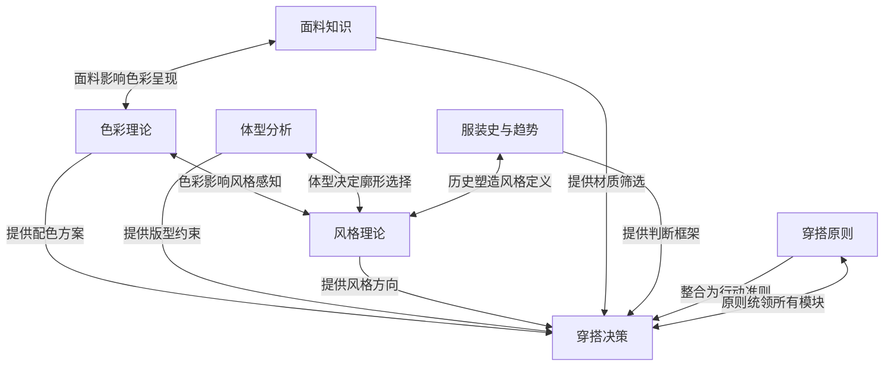
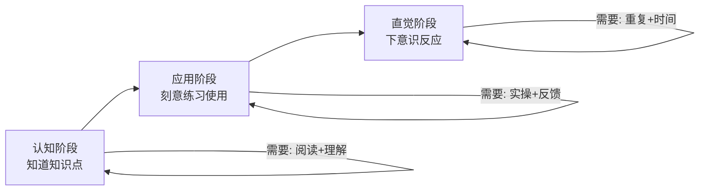
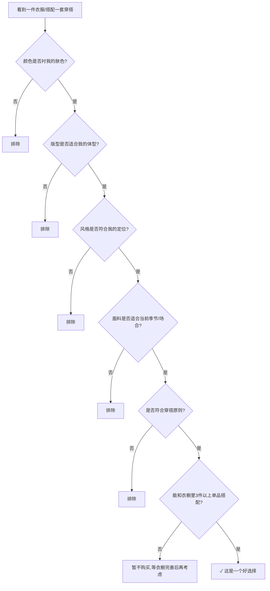

## 基础理论小结：从知识碎片到穿搭体系

前面六节分别深入讲解了色彩理论、体型分析、风格理论、面料知识、服装史与趋势、穿搭原则。每一节都是一个独立的知识模块，但穿搭从来不是"学完一个再学下一个"的线性过程——真正穿得好的人，是把这六个模块**融合成一套直觉反应系统**，在3秒内完成"看→判→选→搭"的全流程。

本节的目标是：帮你在离开"基础理论"这个章节之前，把六个模块的关系理清、把核心知识点固化、把理论到行动的路径打通。

---

### 1. 六大理论模块的逻辑关系

#### 1.1 为什么是这六个模块

穿搭看似是一个感性话题，但它的底层逻辑是**系统工程**。六个模块各自解决一个核心问题，合在一起覆盖了"穿什么、怎么穿、为什么这么穿"的完整决策链：

| 模块 | 解决的核心问题 | 决策层级 | 类比 |
|------|--------------|---------|------|
| **色彩理论** | 什么颜色适合我、怎么配色 | 视觉第一层——色彩 | 建筑的"外墙涂料" |
| **体型分析** | 什么版型修饰我的身材 | 结构第一层——廓形 | 建筑的"主体框架" |
| **风格理论** | 我想表达什么样的形象 | 表达第一层——定位 | 建筑的"设计风格" |
| **面料知识** | 什么材质有质感、舒适、耐穿 | 品质第一层——材料 | 建筑的"建材选择" |
| **服装史与趋势** | 什么是经典、什么是潮流 | 判断第一层——选择 | 建筑的"历史传承" |
| **穿搭原则** | 面对具体场景怎么决策 | 行动第一层——执行 | 建筑的"施工规范" |

六个模块之间不是并列关系，而是**层层递进、相互制约**的关系。用一个比喻来说：色彩是皮肤，体型是骨骼，风格是灵魂，面料是肌肉，历史是基因，原则是神经——缺了任何一个，这个"身体"都不完整。

#### 1.2 模块间的联动机制

这些模块之间存在大量**交叉引用**关系。举一个具体的例子：你走进一家店，看到一件橄榄绿的亚麻西装外套。你的大脑在几秒内完成的判断链条是这样的：

1. **色彩**：橄榄绿属于低饱和度的大地色系，适合暖色调皮肤（色彩理论）
2. **体型**：这件是修身剪裁还是宽松版？我55开的身材需要能提升腰线的版型（体型分析）
3. **风格**：亚麻+大地色=偏休闲知性风格，和我定位的简约休闲风格匹配吗？（风格理论）
4. **面料**：亚麻透气性好但易皱，适合春秋，不太适合需要高度正式感的场合（面料知识）
5. **趋势**：大地色系和自然质感是近年来的持续趋势，不是昙花一现的流行（趋势判断）
6. **决策**：综合以上五点，用穿搭原则做最终判断——合身吗？质感好吗？能和衣橱里至少3件单品搭配吗？（穿搭原则）

这个过程如果你刻意练习，两周内就能变成下意识反应。

---

### 2. 各模块核心知识点速查

以下是每个模块最核心的知识点提炼。这不是简单的"要点罗列"，而是**你必须内化为直觉的决策依据**。如果你对某个点感到陌生，请回到对应章节重新阅读。

#### 2.1 色彩理论：三个必须内化的认知

**认知一：个人色彩诊断是配色的起点。** 你的皮肤色调（暖/冷/中性）决定了哪些颜色"衬你"、哪些颜色"吃你"。暖色调皮肤适合暖色系（驼色、焦糖、橄榄绿），冷色调皮肤适合冷色系（海军蓝、酒红、灰色）。判断方法：看手腕内侧血管颜色——偏绿为暖调，偏蓝紫为冷调，都有则为中性调。中性调是最"百搭"的，但大多数人偏向某一端。

**认知二：配色的核心是控制对比度。** 高对比度（深+浅、亮+暗）视觉冲击力强，适合需要"出彩"的场合；低对比度（相近色、同色系）视觉和谐，适合日常和正式场合。初学者的最安全策略是**全身不超过3种颜色，以中性色为主色、点缀一个强调色**。

**认知三：颜色有"重量"。** 深色视觉上更"重"、更收缩；浅色视觉上更"轻"、更膨胀。这意味着：深色放在你想"缩小"的部位，浅色放在你想"突出"的部位。对于55开身材，上身用深色或同色系，下身可以适当用浅色来平衡——但具体策略需要结合体型分析。

#### 2.2 体型分析：三个必须内化的认知

**认知一：知道自己"是什么"比知道自己"不是什么"更重要。** 大多数人花大量时间纠结"我腿粗不能穿什么"，却很少思考"我的身材优势在哪里"。体型分析的第一步是**找到你的优势**——可能是肩线好看、锁骨漂亮、腰细、腿型直——然后在穿搭中把这个优势放大。

**认知二：视觉比例比绝对尺寸重要。** 普通身高的人通过提升视觉腰线、保持纵向线条流畅、控制头部视觉大小，可以在视觉上"增高"3-5cm。55开身材通过高腰裤+短款上衣可以模拟出45:55的视觉比例。这些不是"作弊"，而是利用视觉心理学的合理优化。

**认知三：合身是一切修饰效果的前提。** 再好的版型设计，大一码或小一码都会失效。合身的标准是：肩线落在肩膀拐点、袖长到手腕骨、裤长不堆积不吊脚、胸围和腰围有一拳左右的余量。买衣服时，先看合身度，再看其他一切。

#### 2.3 风格理论：三个必须内化的认知

**认知一：风格不是"模仿"，而是"表达"。** 看到博主穿得好看就照搬，结果往往不理想——因为那个人的风格是和他的体型、气质、生活方式一体的。正确的做法是：先确定自己的**风格关键词**（2-3个），然后用这些关键词去筛选所有单品。比如"简约、干净、微正式"——带着这三个词去买衣服，你会发现80%的衣服自动被排除。

**认知二：风格需要"锚点单品"来稳定。** 每个人的衣橱里应该有2-3件"一看就是你的"的单品——可能是你的手表、你的鞋、你的外套。这些锚点单品定义了你的风格基调，其他单品围绕它们来搭配。没有锚点的衣橱是散乱的，有了锚点的衣橱自带秩序感。

**认知三：风格是进化的，不是一成不变的。** 25岁的你和35岁的你，风格必然不同。但变化应该是**渐进式**的，而不是"今天极简、明天街头、后天商务"的反复横跳。每年花一点时间审视自己的风格关键词，看是否需要微调——但不要轻易推翻已有的基础。

#### 2.4 面料知识：三个必须内化的认知

**认知一：面料是"质感"的真正来源。** 同样是白T恤，精梳棉和普通涤纶的视觉差异可能比500元和50元的价格差异还大。**优先投资面料质感，而非品牌Logo**——这是从"穿得贵"到"穿得对"的关键转变。

**认知二：面料有"季节身份证"。** 棉麻适合春夏、羊毛羊绒适合秋冬、混纺面料看成分比例。穿错季节的面料不仅不舒服，还会在视觉上产生违和感——夏天穿厚重的毛呢，冬天穿轻薄的亚麻，都会让人觉得"不对劲"。

**认知三：面料的维护成本是隐性成本。** 真丝需要干洗、亚麻容易起皱、羊绒需要手洗——如果你的生活方式不支持高频护理，那再好的面料也不适合你。选面料时，除了看外观和触感，还要问自己：**我愿意为它付出多少维护时间？**

#### 2.5 服装史与趋势：三个必须内化的认知

**认知一：经典款之所以经典，是因为它经过了时间的"压力测试"。** 白衬衫、海军蓝西装、卡其裤、牛仔夹克、黑色皮鞋——这些单品在100年前好看，今天依然好看，100年后大概率还是好看。投资经典款是最安全的穿搭投资。

**认知二：趋势是"调味品"，不是"主食"。** 每年用1-2件趋势单品来更新衣橱是合理的，但如果衣橱里80%都是"当季爆款"，你明年的衣橱就会变成"过季库存"。**经典款占70%、趋势款占30%**，是经过验证的黄金比例。

**认知三：理解趋势的"生命周期"能帮你省钱。** 一个趋势从出现到消退通常经历四个阶段：先锋期→上升期→高峰期→衰退期。在上升期入手、在高峰期享受、在衰退期淘汰——而不是在高峰期花高价买入、在衰退期后悔。

#### 2.6 穿搭原则：三个必须内化的认知

**认知一：合身至上，没有例外。** 无论什么风格、什么面料、什么颜色，不合身的衣服都不会好看。"合身"的标准因风格而异（修身风格要求贴合、休闲风格允许适度宽松），但底线是：肩线到位、比例协调、不拉扯不松垮。

**认知二：少即是多，但"少"不是"少买"，而是"少出错"。** 一个50件单品的高效衣橱，胜过一个200件的混乱衣橱。关键在于每件单品都能和其他3件以上搭配——这就是"胶囊衣橱"的核心逻辑。

**认知三：穿搭原则是"活"的，不是"死"的。** "不能穿白色裤子""矮个子不能穿长外套"这些规则是死的，会限制你的可能性。而"合身、比例、质感、协调"这些原则是活的，会在不同场景下给出不同但正确的答案。拥抱原则，抛弃规则。

---

### 3. 从理论到实践的转化框架

#### 3.1 理论内化的三阶段模型

学完理论不等于掌握理论。知识从"知道"到"会用"需要经历三个阶段：

| 阶段 | 特征 | 所需时间 | 练习方法 |
|------|------|---------|---------|
| **认知阶段** | 知道但用不上，需要刻意回忆 | 1-2周 | 阅读笔记、制作速查表 |
| **应用阶段** | 能用但慢，需要主动思考 | 2-4周 | 每天对着镜子分析一套穿搭 |
| **直觉阶段** | 3秒判断，不需要思考 | 1-3个月 | 日常穿搭实战+拍照复盘 |

#### 3.2 理论应用的决策流程图

当你站在镜子前（或在购物时），按以下流程做决策：

这个流程看起来步骤很多，但经过练习后，你的眼睛会在2-3秒内完成所有判断——就像老司机开车不需要思考"先踩离合还是先挂挡"一样。

#### 3.3 建立个人穿搭档案

理论学习的最终目标，是建立一份**只属于你的穿搭档案**。这份档案不需要复杂，一张A4纸就够了：

| 项目 | 你的答案 | 理论依据 |
|------|---------|---------|
| 皮肤色调 | 暖/冷/中性 | 色彩理论 |
| 最适合的3个颜色 | ________ | 个人色彩诊断 |
| 身材类型 | ________ | 体型分析 |
| 需要优化的部位 | ________ | 体型分析 |
| 身材优势部位 | ________ | 体型分析 |
| 风格关键词（2-3个） | ________ | 风格理论 |
| 偏好的面料 | ________ | 面料知识 |
| 最常穿的场合 | ________ | 穿搭原则 |
| 衣橱的"锚点单品" | ________ | 风格理论 |

填完这张表，你就拥有了一份"穿搭身份证"。以后每次购物前看一眼，能帮你省下大量纠结时间和冲动消费。

---

### 4. 常见认知误区回顾

在六节理论学习中，有几个误区特别容易犯。这里集中纠正一次：

| 误区 | 纠正 | 理论来源 |
|------|------|---------|
| "我肤色黑，只能穿深色" | 肤色深≠不适合亮色。关键是选对色调（暖皮选暖亮色、冷皮选冷亮色），饱和度比明暗更重要 | 色彩理论 |
| "我胖，所以要穿宽松的衣服遮肉" | 过度宽松反而显臃肿。正确的策略是**有结构的适度宽松**——肩线到位、面料有垂坠感、不贴身但有轮廓 | 体型分析 |
| "我不需要风格，舒服就行" | "舒服"本身就是一种风格关键词。但它不应该成为"随便穿"的借口。在舒服的基础上加入1-2个辨识元素，就是风格 | 风格理论 |
| "天然面料一定比化纤好" | 现代高科技化纤（如Coolmax、Gore-Tex）在特定功能上远超天然纤维。选面料看场景需求，不是看"天然vs化纤"的标签 | 面料知识 |
| "经典款太无聊了" | 经典款是"画布"，趋势款是"颜料"。没有画布，颜料无处附着；没有颜料，画布缺乏生气。两者缺一不可 | 服装史与趋势 |
| "学穿搭就是学规则" | 规则是死的、容易被打破的；原则是活的、能指导你面对任何新情况。永远选择原则思维 | 穿搭原则 |

---

### 5. 自我诊断清单

用以下清单检验你对基础理论的掌握程度。如果超过3项打"否"，建议回到对应章节重新学习：

| # | 检查项 | 对应章节 | ✓/✗ |
|---|--------|---------|------|
| 1 | 我能说出自己的皮肤色调，并知道3个最适合的颜色 | 色彩理论 | |
| 2 | 我能用一句话描述自己的体型特征和最需要优化的部分 | 体型分析 | |
| 3 | 我能用2-3个关键词定义自己的穿搭风格 | 风格理论 | |
| 4 | 我能分辨棉、麻、羊毛、涤纶四种面料的手感差异 | 面料知识 | |
| 5 | 我知道"经典款"和"趋势款"的区别，以及各自的理想占比 | 服装史与趋势 | |
| 6 | 我面对一件衣服时，能在10秒内做出"适合/不适合"的初步判断 | 穿搭原则 | |
| 7 | 我理解"合身"的具体标准（肩线、袖长、裤长、围度） | 体型分析+穿搭原则 | |
| 8 | 我知道全身颜色不超过3种的配色逻辑 | 色彩理论 | |

---

### 6. 接下来的路线图

基础理论是地基，接下来的**具体方案**才是建筑。下一章将把本章学到的所有理论转化为可直接执行的穿搭方案，包括：

- **显高穿搭方案**：基于体型分析和视觉比例理论，针对普通身高身高和55开身材的系统优化方案
- **修饰脸型方案**：基于脸型分析（方形脸、颧骨突出），通过领型、发型、配饰进行视觉修饰
- **五五开身材优化方案**：专门针对上下半身等长比例的穿搭策略，从服装选择到搭配技巧全覆盖
- **场合穿搭方案**：日常通勤、商务正式、休闲社交、户外运动等不同场景的穿搭模板

这些方案中每一个细节——每一件推荐单品、每一个搭配建议、每一个注意事项——都有本章的理论作为支撑。你学到的不是"别人告诉你穿什么"，而是"你理解了为什么这么穿"。

> **核心信息**：基础理论的价值不在于你记住了多少知识点，而在于你是否建立了一套**自我诊断和决策的框架**。有了这个框架，任何新的穿搭问题你都能自己分析和解决——这才是从"穿搭小白"到"穿搭高手"的真正分水岭。
