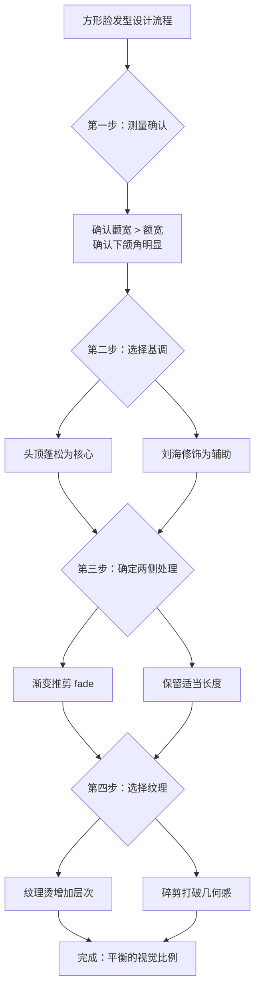

# 第四章：发型——你的第二张脸

## 一、为什么发型是形象管理中最被低估的变量

大多数人把80%的形象预算花在衣服上，却忽略了发型——而事实是，发型对第一印象的影响力远超你的想象。

### 1.1 发型的认知权重

2016年《Journal of Experimental Social Psychology》的一项研究让受试者对同一张面部照片搭配不同发型进行评价，结果发现：

- **吸引力评分波动幅度**：同一张脸搭配不同发型，评分差异可达2.3分（满分7分），相当于从"普通"跃升到"出众"
- **性格推断偏差**：整齐的发型被关联到"可信赖""有能力"，凌乱的发型被关联到"不拘小节""缺乏自律"
- **薪资预期差异**：在一项职场实验中，打理得当的发型使受试者的预期薪资被高估了12-18%

为什么发型的影响如此之大？心理学上有一个概念叫**"光环效应"（Halo Effect）**：当人们在某一个维度上对你形成正面印象时，会自动将这种好感泛化到其他维度。发型作为面部最显眼的视觉元素之一，就是触发光环效应的关键开关。

### 1.2 发型 vs. 其他形象元素

| 影响维度 | 发型 | 服装 | 体型 | 护肤 |
|---------|------|------|------|------|
| 近距离社交（< 1m） | ★★★★★ | ★★★ | ★★ | ★★★★ |
| 远距离社交（> 3m） | ★★★★ | ★★★★★ | ★★★★ | ★ |
| 职场第一印象 | ★★★★ | ★★★★ | ★★★ | ★★★ |
| 日常维护成本 | 中（每天5-15min） | 高（每天选搭） | 高（长期锻炼） | 低（每天2-3min） |
| 改变效果的即时性 | 即时（剪完立刻见效） | 即时 | 慢（数月到数年） | 中（数周） |
| 可逆性 | 中（需要时间生长） | 高 | 低 | 中 |

发型的独特价值在于：它是**唯一一个能在1小时内彻底改变、且不需要你改变体型或购买新衣物的形象变量**。一个合适的发型，是性价比最高的形象投资。

### 1.3 发型对心理状态的反馈效应

发型不仅影响别人对你的看法，也影响你对自己的看法。心理学研究中的**"着装认知"（Enclothed Cognition）**理论指出：外在装扮会反向影响穿着者的心理状态和行为表现。

具体到发型：

- **好发型的日子**：你会更自信地进行社交互动，更愿意拍照，更敢于表达观点
- **坏发型的日子**：你会下意识回避社交场合，频繁触碰头发，注意力被分散
- **发型转变的节点**：很多人在重大人生转变（换工作、分手后、形象升级）时首先改变发型，因为它是最快能"看见新的自己"的方式

## 二、你的三维发型挑战画像

在开始系统学习之前，我们需要精确理解你面临的挑战。这三个因素不是孤立存在的——它们相互叠加，共同决定了你的发型设计约束条件。

### 2.1 挑战一：头发塌——亚洲男性最普遍的发型困境

#### 什么是"头发塌"

头发塌（Flat Hair）是指头发缺乏蓬松感和支撑力，紧贴头皮，导致头部轮廓扁平、发量看起来比实际少的状态。对于你的情况——细软发质加上中性偏微油的头皮——这是一个几乎必然会遇到的问题。

#### 头发塌的五层成因模型

头发塌的成因层次：

第一层：遗传基因
├── 发丝直径小（细软发质）
├── 毛囊密度低
└── 发丝横截面接近圆形（缺乏天然卷曲支撑）

第二层：激素作用
├── DHT刺激皮脂腺过度分泌
├── 油脂包裹发根，增加重量
└── 毛囊可能逐渐萎缩

第三层：物理因素
├── 地心引力持续下拉
├── 睡眠时枕头压迫发根
└── 帽子/头盔长期佩戴

第四层：护理误区
├── 护发素涂到发根（增加重量）
├── 洗发水清洁力不足（残留油脂）
├── 吹风温度/方向错误
└── 不使用造型产品

第五层：环境影响
├── 高湿度天气（吸水增重）
├── 硬水地区（矿物质沉积）
└── 空气污染（颗粒物附着）

#### 头发塌对你意味着什么

对于方形脸+颧骨突出的组合，头发塌会带来一个严重的视觉问题：**当头发紧贴头皮时，颧骨和下颌角的线条会被完全暴露**，让面部的"棱角感"被放大。这是你最需要优先解决的问题——一旦头发有了蓬松度，面部线条的硬朗感会立刻被柔化。

**关键认知**：头发塌不是"发量少"，而是"发量没有被正确呈现"。通过正确的洗护、吹风和造型技巧，细软发质完全可以呈现出超越实际发量的视觉效果。后续的"具体方案"章节会教你具体怎么做。

### 2.2 挑战二：颧骨突出——面部结构的双刃剑

#### 颧骨的美学意义

颧骨（Zygomatic Bone）是面部中段最重要的骨骼结构，它决定了面部的宽度、立体感和年龄感。

**颧骨的正面作用**：
- 提供面部的"骨架感"，让脸看起来立体而非扁平
- 在光影下形成自然的明暗对比，增加面部层次
- 西方审美中，适度突出的颧骨被视为"高级脸"的标志

**颧骨突出带来的挑战**：
- 视觉重心被拉向面部中段，导致额头和下巴显得相对窄小
- 面部线条过于硬朗，可能给人"刻薄""不好相处"的错觉
- 在亚洲审美语境中，过于突出的颧骨有时被关联到"老气"
- 光线不好时，颧骨下方的阴影会让面部看起来凹陷

#### 颧骨与发型的关系

发型对颧骨的修饰作用主要通过两条路径实现：

1. **视觉分割**：用头发遮挡颧骨上方或侧面的区域，打断"颧骨→面部边缘"的连续线条
2. **比例调整**：通过增加头顶高度和两侧体量，让颧骨在整体比例中不那么突出

具体来说，你需要的发型策略是：
- ✅ 刘海适当遮挡太阳穴区域（减小颧骨的视觉宽度）
- ✅ 两侧保留适当体量（不要推得太光）
- ✅ 增加头顶蓬松度（拉长面部比例，分散对颧骨的注意力）
- ❌ 两侧完全推光（会完全暴露颧骨宽度）
- ❌ 过于紧贴头皮的发型（会强调骨骼轮廓）

### 2.3 挑战三：方形脸——被传统分类遗漏的脸型

#### 方形脸的几何特征

方形脸（Pentagon Face）不属于传统的"七大脸型"分类，它是一种介于方脸和菱形脸之间的复合脸型。其几何特征可以用三个关键比例来描述：

| 测量项 | 你的特征 | 与标准椭圆脸的差异 |
|--------|---------|------------------|
| 额宽 | 窄于颧宽 | 额头区域相对收窄 |
| 颧宽 | 面部最宽处 | 颧骨突出，中面部宽 |
| 下颌宽 | 接近颧宽，下颌角明显 | 下颌线条硬朗 |
| 脸长 | 正常或略短 | 纵向比例正常 |

方形脸的核心矛盾是：**中面部（颧骨区域）宽，上下两端相对窄，但下颌角又提供了"方"的元素**。这意味着传统的"菱形脸遮颧骨"或"方脸柔化下颌"策略都不能直接套用，需要综合考量。

#### 方形脸的发型设计核心原则

经过大量案例分析，方形脸的发型设计遵循以下优先级：

**第一优先级：增加头顶高度**
- 目的：拉长面部比例，让五角形趋向更均衡的矩形
- 方法：蓬松的头顶造型，使用吹风机向上提拉发根

**第二优先级：适当遮挡太阳穴**
- 目的：柔和颧骨区域的宽度感
- 方法：碎刘海、侧分刘海，或鬓角保留适当长度

**第三优先级：两侧不做极端处理**
- 目的：避免暴露颧骨和下颌角的线条
- 方法：两侧渐变推剪（fade），但不要推到皮肤

**第四优先级：利用纹理打破几何感**
- 目的：让面部轮廓看起来柔和而非生硬
- 方法：纹理烫、碎剪、不规则的刘海

### 2.4 三维挑战的叠加效应

这三个挑战不是简单的"1+1+1"关系，而是相互影响的系统：

| 组合效应 | 具体表现 | 应对策略 |
|---------|---------|---------|
| 头发塌 + 颧骨突出 | 头发贴头皮 → 颧骨完全暴露 → 脸部显得更宽更硬 | 蓬松头顶是第一优先级 |
| 头发塌 + 方形脸 | 扁平发型放大五角形的"上窄中宽"比例 | 增加头顶高度来拉长比例 |
| 颧骨突出 + 方形脸 | 颧骨区域成为视觉焦点，五角形特征更明显 | 用刘海和两侧体量来分散注意力 |
| 三者叠加 | 头发塌 + 颧骨暴露 + 五角形轮廓 → 最不利组合 | 系统性解决方案：蓬松+遮挡+纹理 |

**核心结论**：你的发型方案必须是一个**系统性的解决方案**，不能只解决其中一个问题。后续章节会为你提供完整的产品、技术和流程来同时应对这三个挑战。

## 三、快速自诊：你的发型起点在哪里

在深入学习之前，花5分钟完成这个自诊，确定你的优先级。

### 3.1 发质诊断

对着镜子回答以下问题：

**Q1：取一根头发放到白纸上，能看清吗？**
- A. 几乎看不到 → 细发（你的情况）
- B. 能看到但很细 → 中等偏细
- C. 清晰可见 → 中等发
- D. 非常明显 → 粗发

**Q2：洗完头后多久开始出油？**
- A. 12小时内 → 油性头皮
- B. 24小时左右 → 中性偏油（你的情况）
- C. 48小时以上 → 中性/干性

**Q3：湿发状态下拉伸一根头发，能拉多长不断？**
- A. 拉不到20%就断 → 受损发质
- B. 20-50% → 正常
- C. 50%以上能恢复 → 健康发质

**Q4：你的头发在自然干燥后是什么状态？**
- A. 紧贴头皮，几乎无蓬松度 → 严重扁塌（你的情况）
- B. 有一点点弧度但很快塌 → 轻度扁塌
- C. 有一定蓬松感 → 正常
- D. 自然蓬松或有卷曲 → 天生优势

**Q5：从正后方看你的头顶，能看到多少头皮？**
- A. 几乎看不到 → 发量浓密
- B. 可以看到部分头皮 → 发量中等
- C. 明显能看到头皮 → 发量偏少

### 3.2 脸型确认

用软尺或手机测量以下数据（单位：cm）：

| 测量项 | 测量方法 | 你的数据 |
|--------|---------|---------|
| 额宽 | 左右发际线最宽处 | ___ cm |
| 颧宽 | 左右颧骨最突出处 | ___ cm |
| 下颌宽 | 左右下颌角最宽处 | ___ cm |
| 脸长 | 发际线正中到下巴尖 | ___ cm |

**判断标准**：
- 如果**颧宽是三个宽度中最大的，且下颌角明显** → 方形脸
- 如果三个宽度接近且下颌角明显 → 方脸
- 如果颧宽最大但下颌角不明显 → 菱形脸
- 如果脸长明显大于脸宽 → 长脸

### 3.3 你的综合画像

根据以上自诊结果，对照下表找到你的"发型起点"：

| 画像类型 | 特征组合 | 优先阅读章节 |
|---------|---------|-------------|
| 严重扁塌型 | 细发 + 油性 + 贴头皮 | 具体方案→蓬松技术 + 产品推荐→洗护产品 |
| 脸型困扰型 | 方形脸 + 颧骨突出 | 基础理论→脸型与发型搭配 + 具体方案→推荐发型 |
| 综合挑战型 | 扁塌 + 脸型问题 | 按章节顺序完整阅读 |
| 基础良好型 | 发量正常 + 脸型较好 | 跳读具体方案和产品推荐 |

## 四、本章学习目标

通过本章的系统学习，你将获得以下能力：

### 4.1 理论层面

- **脸型分析能力**：理解方形脸的几何特征和设计约束，能够用专业术语与发型师沟通
- **发质诊断能力**：从粗细、密度、孔隙度、弹性、油脂分泌五个维度准确评估自己的发质
- **设计原理理解**：掌握"视觉平衡"的核心原理，理解为什么某些发型适合某些脸型

### 4.2 技能层面

- **日常打理能力**：掌握5分钟快速造型流程，能在早晨高效完成发型打理
- **蓬松技术**：学会分区吹风、逆向提拉、产品叠加等核心蓬松技巧
- **产品使用能力**：了解洗护产品的选择逻辑，建立适合自己的产品体系
- **与发型师沟通的能力**：能够用专业语言准确描述自己的需求

### 4.3 决策层面

- **发型选择能力**：能够根据场合、季节、穿搭风格选择合适的发型
- **产品判断力**：能够看懂产品成分表，判断产品是否适合自己
- **避坑能力**：识别常见的发型误区和产品陷阱，避免浪费时间和金钱

## 五、本章知识地图

```mermaid
graph TB
    START[第四章：发型] --> T[基础理论]
    START --> P[具体方案]
    START --> PR[产品推荐]
    START --> LP[学习路径]
    START --> MY[常见误区]
    START --> SUM[本章小结]

    T --> T1[01 头发生理学<br/>毛囊·角蛋白·生长周期]
    T --> T2[02 发质分析<br/>五维度评估·亚洲人特点]
    T --> T3[03 脸型与发型搭配<br/>八种脸型·设计策略]
    T --> T4[04 发型风格分类<br/>经典·潮流·场景]
    T --> T5[05 头发护理科学<br/>洗护·防脱·头皮管理]
    T --> T6[06 染发原理与技术]
    T --> T7[07 烫发原理与技术]
    T --> T8[08 年龄与发型的关系]
    T --> T9[09 设计核心总结]

    P --> P1[01 推荐发型详解<br/>5款适合你的发型]
    P --> P2[02 打理技巧大全<br/>日常·进阶·应急]
    P --> P3[03 蓬松技术深度解析<br/>吹风·产品·手法]
    P --> P4[04 不同场景的发型方案<br/>职场·社交·休闲]

    PR --> PR1[01 洗护产品体系]
    PR --> PR2[02 造型产品体系<br/>发蜡·发泥·喷雾]
    PR --> PR3[03 工具推荐<br/>吹风机·梳子·电推剪]
    PR --> PR4[04 产品搭配方案<br/>预算分档·组合推荐]

    style START fill:#1a1a2e,stroke:#e94560,color:#fff
    style T fill:#16213e,stroke:#0f3460,color:#fff
    style P fill:#16213e,stroke:#0f3460,color:#fff
    style PR fill:#16213e,stroke:#0f3460,color:#fff
    style LP fill:#0f3460,stroke:#e94560,color:#fff
    style MY fill:#0f3460,stroke:#e94560,color:#fff
    style SUM fill:#0f3460,stroke:#e94560,color:#fff
```

### 各节核心要点速览

| 序号 | 内容 | 核心要点 | 阅读时长 | 实操密度 |
|------|------|----------|---------|---------|
| 01 | 头发生理学 | 毛囊结构、角蛋白化学键、生长周期——理解头发的"为什么" | 20min | 低 |
| 02 | 发质分析 | 粗细/密度/孔隙度/弹性/油脂五维度评估——了解自己的"原料" | 15min | 中 |
| 03 | 脸型与发型搭配 | 八种脸型的精确测量和设计策略——确定发型的"方向" | 25min | 中 |
| 04 | 发型风格分类 | 经典风格、潮流趋势、风格与个人气质的匹配——找到"风格" | 15min | 低 |
| 05 | 头发护理科学 | 洗护流程、头皮管理、防脱策略——养护头发的"基础" | 20min | 高 |
| 06 | 染发原理与技术 | 色素机制、染发产品选择、色彩搭配——色彩维度 | 15min | 中 |
| 07 | 烫发原理与技术 | 化学键断裂与重建、烫发类型、风险评估——形状维度 | 15min | 低 |
| 08 | 年龄与发型 | 不同年龄段的发型策略——长期视角 | 10min | 低 |
| 09 | 设计核心总结 | 前8节的决策框架浓缩——形成"发型直觉" | 10min | 低 |
| 具体方案 | 推荐发型详解 | 5款经过验证的发型，每款含详细打理步骤——直接"抄作业" | 30min | 极高 |
| 具体方案 | 打理技巧大全 | 日常/进阶/应急三级技巧——从入门到熟练 | 20min | 极高 |
| 具体方案 | 蓬松技术深度解析 | 吹风/产品/手法三管齐下——解决你的核心痛点 | 25min | 极高 |
| 具体方案 | 场景发型方案 | 职场/社交/休闲场景切换——灵活应变 | 15min | 高 |
| 产品推荐 | 洗护产品体系 | 洗发水/护发素/头皮护理的选择逻辑——知道"买什么" | 15min | 中 |
| 产品推荐 | 造型产品体系 | 发蜡/发泥/发油/喷雾的区别和选择——知道"用什么" | 15min | 中 |
| 产品推荐 | 工具推荐 | 吹风机/梳子/电推剪——装备维度 | 10min | 低 |
| 产品推荐 | 产品搭配方案 | 按预算分档的完整产品组合——直接"照单买" | 10min | 中 |
| 学习路径 | 从零到精通 | 四阶段学习计划+练习清单——有节奏地进步 | 15min | 高 |
| 常见误区 | 10个发型误区 | 常见错误和纠正方法——避坑手册 | 15min | 中 |
| 本章小结 | 核心要点回顾 | 行动计划+关键checklist——落地执行 | 10min | 中 |

## 六、个性化阅读路径

### 路径A：急性子型（"我就想赶紧变好看"）

> 总阅读时间：约1.5小时

1. **本文（章节概览）** → 建立整体认知（10min）
2. **具体方案→推荐发型详解** → 直接找到适合的发型（30min）
3. **具体方案→蓬松技术** → 解决最紧迫的扁塌问题（25min）
4. **产品推荐→产品搭配方案** → 照着清单买（10min）
5. **具体方案→打理技巧** → 学会日常流程（20min）

**适合人群**：时间紧迫、想快速见效的读者。先拿到结果，再回头补理论。

### 路径B：系统学习型（"我要知其然也知其所以然"）

> 总阅读时间：约4-5小时（可分2-3天完成）

按章节顺序完整阅读：基础理论（9节）→ 具体方案（4节）→ 产品推荐（4节）→ 学习路径 → 常见误区 → 本章小结

**适合人群**：想要建立完整知识体系、长期受益的读者。理论基础打好后，后续调整发型会更得心应手。

### 路径C：问题导向型（"我只想解决我的具体问题"）

> 根据你的核心痛点选择入口

| 你的主要问题 | 入口章节 | 然后阅读 |
|-------------|---------|---------|
| 头发太塌，没有造型感 | 具体方案→蓬松技术 → 产品推荐→洗护产品 | 基础理论→发质分析 |
| 不知道自己适合什么发型 | 基础理论→脸型与发型搭配 → 具体方案→推荐发型 | 产品推荐→造型产品 |
| 和发型师沟通不清楚 | 基础理论→脸型与发型搭配 → 学习路径（沟通技巧部分） | 具体方案→推荐发型（带参考图） |
| 造型产品太多不知道选哪个 | 产品推荐→造型产品体系 → 产品推荐→产品搭配方案 | 具体方案→打理技巧 |
| 想要整体升级但不知从何开始 | 按路径A快速见效，再按路径B补理论 | 持续参考常见误区 |

## 七、预期时间线：从"现在"到"发型自由"

掌握发型技能不是一个突变过程，而是一个渐进式的迭代。以下是合理的时间预期：

| 阶段 | 时间 | 你会达到的状态 | 关键里程碑 |
|------|------|--------------|-----------|
| 第1周 | 认知期 | 了解自己的脸型和发质，选定1-2款目标发型 | 完成自诊，买到基础产品 |
| 第2-3周 | 入门期 | 能够完成基础造型，效果时好时坏 | 第一次被人夸"今天发型不错" |
| 第4-6周 | 稳定期 | 日常造型成功率 > 70%，形成固定流程 | 5分钟内完成日常造型 |
| 第7-12周 | 进阶期 | 能根据场合调整发型，与发型师有效沟通 | 建立3-4款常备发型 |
| 第13周+ | 自由期 | 发型成为直觉，不再需要刻意"打理" | 形成个人发型风格 |

> **重要提示**：发型改变是一个渐进的过程。不要期望一次就能找到"完美发型"，而是要在实践中不断调整、优化。每两周评估一次效果，记录哪些有效、哪些需要改进，逐步迭代出最适合自己的方案。把每一次洗头都当成一次练习机会。

## 八、阅读建议

### 第一遍：建立框架（通读）

快速通读全章，重点关注：
- 基础理论中"脸型与发型搭配"（了解自己的设计约束）
- 具体方案中"推荐发型"（选定目标发型）
- 产品推荐中"产品搭配方案"（确定购买清单）

### 第二遍：聚焦实操（精读）

带着目标发型，深入研读：
- 具体方案中的打理技巧和蓬松技术（学会"怎么做"）
- 产品推荐中的产品使用方法（知道"怎么用"）
- 常见误区（避免"踩坑"）

### 第三遍：融会贯通（复习）

将理论和实操结合：
- 回顾基础理论中的设计原理（理解"为什么这么做"）
- 根据实践结果调整方案（迭代优化）
- 学习路径中的进阶技巧（持续提升）

### 日常参考

将以下内容保存为快速查阅手册：
- 常见误区 → 每月对照自检
- 打理技巧 → 遇到问题时查阅
- 产品推荐 → 购买新产品时参考

---

> 下一节：[01-头发生理学](./基础理论/01-一头发生理学.md)
