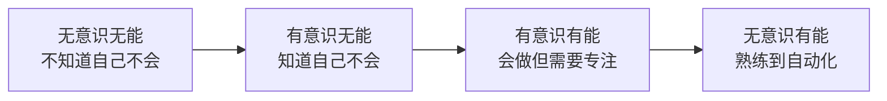
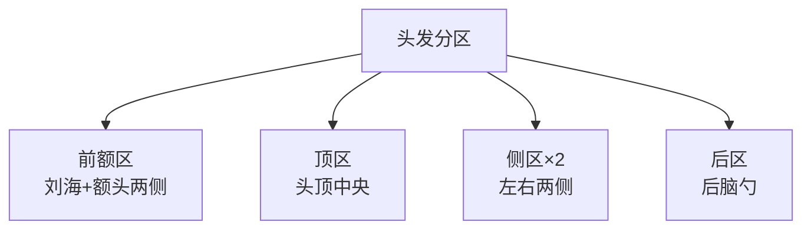
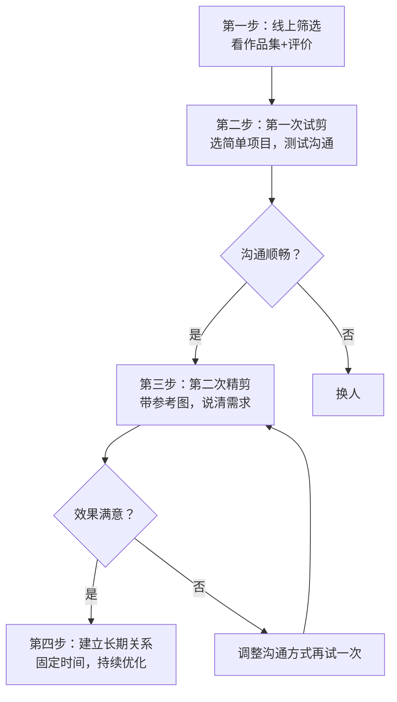
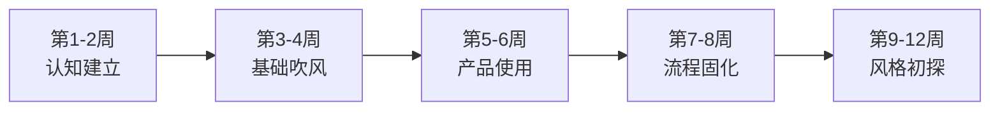

# 04-学习路径

## 一、为什么要有一条清晰的学习路径

发型打理是一项技能，但多数人从未将它当作"技能"来系统学习。结果是：买了一堆产品不会用，剪了十几次头都不满意，每天早上手忙脚乱却效果平庸。

技能学习有一条被反复验证的规律——**刻意练习四阶段模型**（由认知行为研究者提出）：

- **无意识无能**：你不知道吹风机能改变发型方向，不知道发蜡有哑光和亮面之分，甚至不知道自己的脸型需要什么样的发型。这是大多数人的起点。
- **有意识无能**：你开始学习，发现"原来有这么多门道"，越学越觉得自己不会。这是最容易放弃的阶段。
- **有意识有能**：你能做出不错的造型，但需要集中注意力，耗时较长，偶尔翻车。
- **无意识有能**：造型变成肌肉记忆，5分钟出门，发型稳定好看。

理解这条曲线有两个实际意义：第一，你不会在"有意识无能"阶段因为挫败感而放弃——因为每个人都会经历；第二，你会知道自己目前在哪个阶段，下一步该练什么。

本文按照这条曲线，将发型学习划分为四个阶段，每个阶段都有明确的学习目标、具体任务、推荐资源和验证标准。你可以根据自己的基础，从对应阶段开始。

***

## 二、阶段一：认知建立期（第1-2周）

### 阶段目标

建立发型设计的认知框架，明确"我需要什么发型"以及"为什么"。这个阶段不急着动手，核心是**看懂**。

### 核心知识节点

#### 1. 认识自己的脸型

这是所有发型设计的起点。你需要做的不是"猜"自己的脸型，而是用数据说话：

**自测方法**：

1. 找一面光线均匀的镜子，用手机正面自拍（保持手机与脸平行，避免透视畸变）
2. 用手机自带的编辑功能或美图秀秀的"标注"功能，在照片上画出以下线条：
   - 额骨宽度（两侧太阳穴最宽处）
   - 颧骨宽度（两侧颧骨最高点）
   - 下颌宽度（两侧下颌角）
   - 脸部长度（发际线到下巴最低点）
3. 用尺子测量或目测比例，对照下方脸型对照表

**脸型关键数据对照**：

| 脸型 | 三庭比例 | 颧骨 vs 额骨 | 颧骨 vs 下颌 | 整体轮廓 |
|------|----------|--------------|--------------|----------|
| 椭圆形 | 均等 | 略宽 | 明显宽 | 柔和流畅 |
| 方形 | 均等 | 等宽 | 等宽 | 棱角分明 |
| 圆形 | 中庭偏短 | 等宽 | 等宽 | 弧线为主 |
| 菱形 | 均等 | 最宽 | 窄 | 中间宽两头窄 |
| 五角形 | 下庭偏长 | 最宽 | 明显窄 | 上窄中宽下窄 |

对于本书读者（方形脸、颧骨突出），你需要重点关注：**如何用发型视觉上增加额头宽度、柔化颧骨线条、缩短下庭比例**。这些原则贯穿后续所有发型选择。

#### 2. 认识自己的发质

发质决定了你"能做什么发型"以及"需要什么产品"。以下是需要观察的核心维度：

| 维度 | 观察方法 | 你需要记录的 |
|------|----------|-------------|
| 粗细 | 拔一根头发放在白纸上，侧面观察 | 细软/中等/粗硬 |
| 密度 | 观察头皮是否明显可见 | 稀疏/中等/浓密 |
| 油性 | 洗发后24小时用吸油纸按压头皮 | 干性/中性/油性/混合 |
| 弹性 | 湿发状态下拉伸一根头发 | 低弹性（易断）/正常/高弹性 |
| 卷曲度 | 自然干后观察 | 直发/微卷/明显卷曲 |

**关键认知**：发质不是"好"或"坏"的问题，而是"适配"的问题。细软塌的头发不适合需要支撑力的大背头，但非常适合纹理感强的碎盖；粗硬发质不适合需要柔顺感的中分，但非常适合清爽的短寸。理解自己的发质，是在起点就避开90%的弯路。

#### 3. 了解发型分类体系

不要只看"好看"，要理解发型的底层分类逻辑：

| 分类维度 | 选项 | 适合你的方向（方形脸/细软塌） |
|----------|------|-------------------------------|
| 长度 | 超短/短/中/长 | 短到中（3-8cm头顶） |
| 刘海 | 无/碎/齐/侧/逗号 | 碎刘海或侧刘海（遮挡额头） |
| 两侧 | 自然/渐变推剪/铲青 | 渐变推剪（增加利落感） |
| 造型方向 | 后梳/侧分/前刺/纹理/中分 | 纹理向前或侧分 |
| 蓬松度 | 贴头皮/微蓬/高蓬松 | 微蓬到高蓬松（对抗扁塌） |

#### 4. 认识造型产品的基本分类

这个阶段只需要知道"有这些东西"，不需要深入研究：

- **洗护类**：洗发水（清洁）、护发素（顺滑）、发膜（深层修复）
- **造型类**：发蜡（光泽+中等定型）、发泥（哑光+强定型）、发油（光泽+柔顺）、喷雾（轻定型/盐雾纹理）
- **工具类**：吹风机（核心工具）、圆梳/排骨梳、电推剪、卷发棒

### 本阶段实践任务

| 任务 | 具体要求 | 完成标准 |
|------|----------|----------|
| 脸型自测 | 正面自拍+数据标注 | 能清楚说出自己是什么脸型、三庭比例特点 |
| 发质诊断 | 按照上表逐项观察 | 能用5个维度描述自己的发质 |
| 建立参考图库 | 收集10-15张喜欢的发型图 | 图片至少覆盖3种不同风格，标注喜欢的原因 |
| 认知检验 | 对着参考图说出"这款发型的长度、刘海、两侧、造型方向分别是什么" | 能用专业术语描述任意一款发型 |

### 学习资源（本阶段）

- **本书**：基础理论章节（脸型分析、发质诊断、发型设计原理）
- **视频**：B站搜索"男生脸型与发型""发质分析"，选择播放量>10万、评论区有实操反馈的视频
- **社区**：小红书搜索"方形脸发型"，收藏真人案例（而非模特照）

### 阶段验证标准

当你能够完成以下判断时，可以进入下一阶段：

1. 看到任何一款发型，能立刻分析它适合什么脸型、什么发质
2. 看到一个人，能在心里快速判断"他应该留什么发型"
3. 能用3句话向别人描述清楚自己想要的发型

***

## 三、阶段二：技能入门期（第3-6周）

### 阶段目标

掌握洗发、吹风、造型的基础操作，能够独立完成一个"及格"的日常造型。这个阶段的核心是**动手**，而且要大量动手。

### 核心技能详解

#### 1. 科学洗发——一切造型的基础

洗发看似简单，但手法错误会直接影响后续造型效果。以下是针对细软塌发质的标准流程：

**洗发前**：
1. 用宽齿梳或手指将头发梳通，减少洗发时的拉扯断发
2. 用温水（37-40°C，手感微温不烫）充分淋湿头发和头皮，持续至少1分钟——这一步很多人跳过，但充分湿润能让洗发水更容易起泡，减少用量

**洗发中**：
1. 取一元硬币大小的洗发水，在手心搓出泡沫后再上头
2. 用指腹（不是指甲）以画圈方式按摩头皮，重点区域：发际线、头顶、后脑勺
3. 按摩时间不少于2分钟——这是清除油脂和造型产品残留的最低要求
4. 冲洗时让泡沫自然流过发梢即可，不需要反复搓揉发梢

**洗发后**：
1. 用毛巾按压吸水（不是搓揉——湿发毛鳞片打开，搓揉会造成毛鳞片损伤，长期导致毛躁）
2. 涂抹护发素，只涂距发根10cm以下的区域（涂到发根会让头顶更塌）
3. 等待1-2分钟后彻底冲洗

**关于洗发频率的科学认知**：

| 头皮类型 | 推荐频率 | 原因 |
|----------|----------|------|
| 油性 | 每天或隔天 | 油脂堆积加重扁塌，堵塞毛囊 |
| 中性 | 隔天 | 适度油脂有保护作用 |
| 干性 | 2-3天 | 过度清洁会加剧干燥 |

#### 2. 吹风技术——发型的骨架

吹风机是发型造型中**最重要的工具**，没有之一。吹风决定了发型的基本方向、蓬松度和持久性。产品（发蜡/发泥）只是在吹风的基础上做微调。

**基础吹风三步法**：

**第一步：预干燥（30秒）**
- 温度：中温
- 风速：中速
- 目标：将头发从"滴水"状态吹到"潮湿"状态
- 手法：用手指插入头发，随意拨动，让热风均匀接触所有区域
- 原理：湿发状态下吹风效率极低，先快速去除多余水分

**第二步：定方向（2-3分钟）**
- 温度：中高温
- 风速：中速
- 目标：确定发型的基本方向
- 手法：用梳子或手指将头发拨向目标方向，吹风机顺着头发方向吹
- 关键技巧：**风嘴朝发根方向吹**——这是增加蓬松度的核心。逆着头发生长方向吹发根，能让发根"站起来"

**第三步：冷风定型（15秒）**
- 温度：冷风
- 风速：最大
- 目标：用冷风"锁定"造型
- 手法：快速扫过整个头部
- 原理：热风让头发中的氢键暂时重组（所以能改变方向），冷风让氢键重新固定

**吹风常见错误**：

| 错误 | 后果 | 正确做法 |
|------|------|----------|
| 头发全湿就开始造型 | 浪费时间，效果差 | 先预干燥到8成干 |
| 只用热风不用冷风 | 造型持久度差 | 最后用冷风定型 |
| 吹风机贴着头皮吹 | 头皮烫伤，发根受损 | 保持15-20cm距离 |
| 没有方向地乱吹 | 头发毛躁炸开 | 始终顺着目标方向 |
| 不用风嘴 | 风力分散，效率低 | 始终安装集风嘴 |

#### 3. 基础造型——发蜡/发泥的使用

**取用标准**：
- 短发：黄豆大小（约1-1.5g）
- 中发：花生米大小（约2-2.5g）
- 宁少勿多——不够可以加，多了只能洗掉重来

**使用流程**：
1. 在手掌和指缝间搓匀，直到产品变得透明/均匀分布
2. 从后脑勺开始向前抓——因为后脑勺是最容易被忽略的区域
3. 用手指"插入"头发内部，从发根向发梢带过
4. 最后用指尖调整刘海和表面纹理
5. 对着镜子检查：正面、左右45度、左右侧面

**不同产品的使用差异**：

| 产品 | 取用量 | 适用场景 | 定型力 | 光泽度 | 适合发质 |
|------|--------|----------|--------|--------|----------|
| 发泥 | 黄豆大小 | 日常通勤、需要哑光效果 | 强 | 哑光 | 细软到中等 |
| 发蜡 | 黄豆到花生米 | 正式场合、需要光泽感 | 中 | 自然光泽 | 中等到粗硬 |
| 发油 | 少量（硬币1/3） | 干燥发质、增加质感 | 弱 | 高光泽 | 干燥/受损发质 |
| 盐雾 | 喷6-8下 | 休闲场合、需要纹理感 | 弱-中 | 哑光 | 所有发质 |

### 本阶段每日练习计划

**工作日（15分钟）**：
- 早上洗发后，用吹风机练习基础三步法（5分钟吹风+3分钟造型）
- 晚上洗发时练习正确的洗发手法

**周末（30分钟）**：
- 周六：研究一个发型教程视频，尝试复现
- 周日：拍照记录本周的造型效果，对比进步

### 学习资源（本阶段）

- **本书**：具体方案章节（打理技巧大全）
- **视频**：B站搜索"男生吹风教程""发泥使用教程"，YouTube搜索"men's blowout tutorial"
- **练习方法**：对镜练习+拍照记录，每周对比

### 阶段验证标准

当你能够完成以下任务时，可以进入下一阶段：

1. 洗发后能在10分钟内完成一个"看得过去"的造型
2. 造型能维持到下午（至少6小时）不明显变形
3. 能根据参考图做出接近的效果（相似度70%以上）

***

## 四、阶段三：技能进阶期（第7-12周）

### 阶段目标

突破"能做"到"做好"的瓶颈。这个阶段的核心是**精度和效率**——用更短的时间做出更好的效果，并且能根据不同场景灵活调整。

### 进阶技能详解

#### 1. 分区吹风技术

基础吹风是"整体吹"，进阶吹风是"分区吹"——把头发分成若干区域，每个区域用不同的手法处理。

**五区分区法**：

| 分区 | 吹风方向 | 工具 | 要点 |
|------|----------|------|------|
| 前额区 | 向前或向侧 | 圆梳+吹风机 | 控制刘海的弧度和方向 |
| 顶区 | 向前+向上 | 圆梳或排骨梳 | 这是蓬松度的关键区域 |
| 侧区 | 向下+向前 | 排骨梳 | 与推剪区域的过渡要自然 |
| 后区 | 向后或向下 | 排骨梳 | 注意后脑勺的弧度 |

**圆梳使用技巧**：
- 圆梳的直径决定了卷度——直径越大，卷度越自然，弧度越平缓
- 细软发质建议用直径3-4cm的圆梳
- 使用时将发片缠绕在圆梳上，吹风机对准发片，保持3-5秒后冷风定型
- 不要一次缠绕太多头发——每个发片不超过2cm宽

#### 2. 多产品搭配使用

单个产品的效果有限，进阶玩家通过产品组合来实现更精细的效果：

**经典组合方案**（适合细软塌发质）：

| 组合 | 使用顺序 | 效果 | 适用场景 |
|------|----------|------|----------|
| 预造型喷雾+发泥 | 先喷雾再发泥 | 蓬松+哑光定型 | 日常通勤 |
| 海盐喷雾+发蜡 | 先喷雾再发蜡 | 纹理+自然光泽 | 休闲社交 |
| 蓬松粉+发泥 | 先蓬松粉再发泥 | 极致蓬松+强定型 | 需要持久的场合 |
| 发油+发泥 | 先发油再发泥 | 滋润+哑光定型 | 干燥季节/干燥发质 |

**产品叠加的关键原则**：
- 质地从轻到重：先用水基/喷雾类产品，再用膏状/泥状产品
- 功能从底到面：先用增加蓬松度/质感的底层产品，再用定型的表面产品
- 用量逐级递减：底层产品正常用量，表面产品减半

#### 3. 造型持久度提升策略

早上做的造型到下午就塌了？这不是"正常现象"，而是可以系统改善的：

**影响持久度的因素及对策**：

| 因素 | 影响程度 | 解决方案 |
|------|----------|----------|
| 吹风不到位 | ★★★★★ | 吹风是定型的基础，吹不好产品再好也没用 |
| 产品选择错误 | ★★★★ | 细软发质用哑光强定型产品，避免油腻型 |
| 产品用量不足 | ★★★ | 宁可稍微多用，不够定不住 |
| 出汗/出油 | ★★★ | 随身携带蓬松粉或干发喷雾 |
| 环境湿度 | ★★ | 潮湿天气用抗湿配方的产品 |
| 触碰头发 | ★★ | 养成不摸头发的习惯 |

**应急补救方案**（适用于下午发型塌了的场景）：
1. 去洗手间，用纸巾按压额头和发际线吸油
2. 取少量蓬松粉撒在发根，用手指拨松
3. 如果条件允许，用干发喷雾喷在发根区域
4. 最后用少量发泥重新抓一下表面纹理

#### 4. 场景化发型切换

不同场合对发型的要求不同，进阶阶段要学会"一套底子，多种变化"：

| 场景 | 发型特点 | 打理要点 | 耗时 |
|------|----------|----------|------|
| 日常通勤 | 自然、干净、不过度造型 | 标准流程，发泥定型 | 5-8分钟 |
| 正式商务 | 整齐、有型、略带光泽 | 分区吹风+发蜡，注重细节 | 8-12分钟 |
| 休闲约会 | 纹理感、有空气感 | 海盐喷雾+发泥，追求"不经意的好看" | 6-10分钟 |
| 运动健身 | 短、清爽、不影响运动 | 造型前运动，或用发带/帽子辅助 | 2-3分钟 |

### 本阶段练习计划

**每日任务**：
- 尝试分区吹风，每天重点练一个分区
- 练习快速造型——给自己计时，目标是8分钟内完成
- 根据当天的场合选择发型方案

**周末任务**：
- 尝试一种新的产品搭配方案
- 拍照记录，对比不同方案的效果
- 整理自己的"最佳方案清单"

### 阶段验证标准

1. 能在8分钟内完成一个"出门级"造型
2. 造型能维持一整天（12小时以上）不明显变形
3. 能根据场合自如切换2-3种造型方案
4. 能说出"我用什么产品、什么手法、为什么这样选"

***

## 五、阶段四：精通期（第13周以后）

### 阶段目标

从"会做发型"进化到"拥有发型风格"。发型不再是每天的负担，而是个人风格的一部分。

### 精通级能力

#### 1. 发型与穿搭的系统协调

发型不是孤立存在的，它是整体造型的一部分。精通阶段的发型选择要和服装、配饰、甚至场合氛围协调：

| 穿搭风格 | 对应发型方向 | 产品选择 | 要点 |
|----------|-------------|----------|------|
| 商务正装 | 整齐侧分/后梳 | 发蜡，光泽感 | 干净利落，不要有凌乱的碎发 |
| 休闲简约 | 纹理碎盖/自然前刺 | 发泥，哑光 | 自然不做作，有空气感 |
| 潮流街头 | 纹理/造型感强的发型 | 发泥+盐雾 | 可以大胆一些，突出个性 |
| 运动休闲 | 短发/清爽利落 | 轻定型喷雾 | 不遮挡视线，不影响运动 |

**季节调整策略**：

| 季节 | 发质变化 | 发型调整 | 产品调整 |
|------|----------|----------|----------|
| 春季 | 换季可能出油增加 | 保持清爽短发 | 加强清洁，用控油洗发水 |
| 夏季 | 大量出汗，出油高峰 | 最短的季节性方案 | 随身携带蓬松粉，用抗汗产品 |
| 秋季 | 逐渐干燥 | 可以适当留长 | 开始使用滋润型产品 |
| 冬季 | 干燥，静电增加 | 中等长度，增加层次 | 加入发油/护发精华，防静电 |

#### 2. 与发型师的高效沟通

找到一个好发型师，是发型学习中**投入产出比最高**的一件事。一个好的发型师等于省去了你50%的造型难度。

**筛选发型师的四步法**：

**筛选标准**：
- **看作品**：在大众点评、小红书查看发型师的作品集，重点关注"类似你发质和脸型"的案例
- **看评价**：重点看"沟通好""理解需求""耐心"等评价关键词，而不是"便宜""速度快"
- **看专长**：每位发型师都有擅长的风格领域，选择与你目标风格匹配的
- **看价格**：价格不是唯一标准，但过低的价格通常意味着经验不足或产品廉价

**沟通话术模板**：

> "你好，我想剪一个纹理碎盖。我的头发比较细软，容易塌，颧骨比较突出，脸型偏五角形。我希望头顶蓬松一些，大概6-7cm长度，刘海碎剪，遮挡一下太阳穴和额头两侧。两侧做渐变推剪，从下到上3mm到12mm的过渡，但不要推太光。你看这个参考图（拿出手机），我想要类似的效果，但头顶可以再蓬松一点。你觉得我的发质能做到吗？需要烫吗？"

这段话术的核心要素：
1. **说清发质**（细软、容易塌）——让发型师选对手法
2. **说清脸型特征**（颧骨突出、五角形）——让发型师做针对性设计
3. **给出具体数据**（6-7cm、3mm到12mm）——比"好看一点"有效100倍
4. **带参考图**——视觉信息比语言描述准确得多
5. **主动提问**（能做到吗？需要烫吗？）——引导发型师给出专业判断

**剪发后的验证清单**：
- [ ] 正面照镜子：整体比例是否协调
- [ ] 两侧是否对称（很多人忽略这点）
- [ ] 刘海长度是否符合预期
- [ ] 用手拨一下头发：是否能轻松恢复造型
- [ ] 问发型师："我回家自己能打理出这个效果吗？需要什么产品？"

#### 3. 建立"发型衣橱"

就像穿搭需要一个衣橱（几件基础款+几件变化款），发型也需要一个"衣橱"——3-5款经过验证的、覆盖不同场合的常备发型方案。

**发型衣橱构建建议**：

| 位置 | 功能 | 数量 | 举例 |
|------|------|------|------|
| 基础款 | 日常通勤，最省心 | 1-2款 | 标准纹理碎盖、自然侧分 |
| 进阶款 | 正式场合，更有型 | 1款 | 精致侧分背头 |
| 休闲款 | 约会社交，有特色 | 1款 | 空气感纹理/逗号刘海 |
| 应急款 | 赶时间/运动/糟糕天气 | 1款 | 最短的清爽方案或帽子方案 |

每款发型都需要一份"个人SOP"（标准操作流程），记录：
- 吹风手法和时长
- 使用的产品及用量
- 关键步骤和注意事项
- 预期效果和持续时间

#### 4. 持续优化的反馈系统

发型不是"学会就完了"，它需要持续迭代。建立一个简单的反馈循环：

**每两周自评一次**：
1. 回顾过去两周的发型照片
2. 评估：哪天效果最好？用了什么方法？
3. 评估：哪天效果最差？原因是什么？
4. 调整：保留好的方法，改进或放弃差的方法

**每两个月深度复盘**：
1. 当前的发型方案是否仍然适合？（发型也跟随潮流在变）
2. 产品是否需要更新换代？
3. 发质是否因季节/护理发生变化？
4. 是否需要与发型师沟通调整？

***

## 六、关键技能补充

### 6.1 自我修剪基础

虽然不建议完全自己剪发，但掌握几个基础的自我维护技巧，可以延长两次剪发之间的"好看期"，也能节省频繁去理发店的时间和费用。

#### 鬓角维护（每1-2周一次）

鬓角是最容易"失控"的区域，因为两侧推剪的部分长出来会显得邋遢。

**工具**：电推剪+限位梳套组

**步骤**：
1. 选择与你上次剪发时相同的限位梳长度（通常是6mm或9mm）
2. 对着镜子，从鬓角下缘开始，从下往上推
3. 推到与头顶头发的过渡区域时，换用更长一档的限位梳（比如从6mm换到9mm），做出渐变效果
4. 两侧对称处理——建议先做完一侧，再做另一侧，而不是交替进行
5. 用手指摸一下过渡区域，确保没有明显的"台阶感"

**常见错误**：
- 推得太靠上，破坏了发型的整体比例
- 过渡区域太突兀，看起来像"补丁"
- 两侧不对称

**安全原则**：宁可保守——少推一点，多看几次镜子确认。推掉的头发接不回来。

#### 刘海修剪（每2-3周一次）

刘海长得最快，也是最容易影响整体效果的部分。

**工具**：专业理发剪刀（不要用普通剪刀，普通剪刀会挤压头发导致毛躁）

**步骤**：
1. 将刘海梳到自然垂落的位置
2. 用食指和中指夹住刘海，控制要剪的长度
3. 用剪刀尖端"点剪"（竖着剪），而不是"平剪"（横着剪）——点剪出来的边缘更自然，不会出现"狗啃"的整齐切口
4. 每次只剪2-3mm，逐步调整到目标长度
5. 剪完后用手指拨一下，检查是否自然

**重要提示**：湿发比干发看起来长（大约长1-2cm），所以湿发状态下不要剪太短。

#### 后脑勺修整

后脑勺是最难自己操作的区域。如果没有第二面镜子或他人帮助，建议只做最简单的处理：用电推剪+限位梳清理后颈的碎发，保持干净即可。复杂的后脑勺修剪交给发型师。

### 6.2 发型摄影与记录

记录发型效果是自我评估和与发型师沟通的重要手段。不是随便拍一张就行——拍摄方式直接影响你能否准确评估效果。

**标准拍摄流程**：

| 角度 | 目的 | 要求 |
|------|------|------|
| 正面 | 评估刘海、两侧对称性 | 手机与脸平行，避免俯拍/仰拍 |
| 左侧45度 | 评估左侧轮廓和层次 | 展示头发的立体感 |
| 右侧45度 | 评估右侧轮廓和层次 | 与左侧对比对称性 |
| 左侧90度 | 评估侧面线条 | 包含耳部和鬓角 |
| 右侧90度 | 评估侧面线条 | 同上 |
| 后面 | 评估后脑勺弧度和层次 | 用镜子反射或请人拍摄 |

**拍摄条件**：
- **光线**：自然光最佳（窗边），避免顶光（会在眼窝和鼻子下方产生阴影）
- **背景**：白色或浅色墙壁，避免杂乱背景干扰视觉判断
- **时间**：造型完成后即刻拍摄，以及4小时后、8小时后各拍一张——用于评估持久度

**记录模板**（建议用手机备忘录）：
日期：2026-06-24
产品：[品牌+型号]发泥，用量：黄豆大小
吹风手法：分区吹风，圆梳提拉头顶
耗时：10分钟
效果评分：7/10
持久度：下午3点开始塌（持续约5小时）
改进点：发泥用量可以再多半指，头顶提拉力度要更大

### 6.3 常见学习障碍及破解方案

#### "手残"——觉得自己手笨做不好

**本质**：不是"手笨"，而是肌肉记忆尚未建立。

**破解方案**：
1. **降低起点**：从最简单的发型开始（比如前刺——只需要把头发向前拨+抓蓬松），不要一上来就挑战复杂造型
2. **重复练习**：同一个发型连续练2周，不要每天换新花样——肌肉记忆需要重复
3. **分解动作**：把一个造型流程拆成5个小步骤，每个步骤单独练习到熟练
4. **慢动作学习**：看教程时用0.5倍速播放，看清每个手指的动作
5. **接受不完美**：目标是"比昨天好"，不是"像教程一样完美"

**科学依据**：运动技能学习的研究表明，从新手到基本熟练通常需要30-50次重复。按每天一次计算，大约需要1-2个月。所以"练了两周还是不好"是完全正常的，继续练。

#### 时间不够——早上没时间打理

**破解方案**：

1. **建立5分钟快速流程**：
   - 吹风2分钟（只做最关键的蓬松和方向）
   - 发泥1分钟（快速抓整体，不纠结细节）
   - 调整2分钟（刘海+两侧+后脑勺）
   
2. **前一晚准备**：
   - 晚上洗完头吹到8成干，用少量定型产品固定基本方向
   - 第二天早上只需要微调，省去重新吹风的时间
   
3. **选择低维护发型**：
   - 如果你真的无法每天花5分钟，选择一个"睡醒也还行"的发型
   - 推剪部分越短，需要打理的面积越小
   - 纹理碎盖比大背头的维护成本低得多

4. **把打理变成习惯**：
   - 将造型流程嵌入已有的习惯链中（比如：刷牙→洗脸→吹风→造型）
   - 前两周需要刻意提醒自己，第三周开始就会变成自动行为

#### 产品选择困难——不知道买什么

**破解方案**：

1. **入门只需两样**：一瓶适合你发质的洗发水+一罐发泥。够了。其他产品都是锦上添花
2. **先买小样**：很多品牌有旅行装或小样套装，花20-30元就能试到不同产品
3. **建立评价标准**：用了新产品后，从以下维度打分（1-5分）：
   - 定型力：造型能维持多久
   - 质感：上手后头发的触感
   - 清洗难度：晚上是否容易洗干净
   - 气味：自己和周围人是否能接受
   - 性价比：用量和价格的比值
4. **不要盲目跟风**：适合博主的产品不一定适合你，因为他可能和你发质完全不同

#### 发型师剪不好——每次都不满意

**破解方案**：

1. **先反思沟通**：80%的"剪不好"其实是"沟通不到位"。你是否带了参考图？是否说了具体数据？是否描述了发质特点？
2. **给发型师2-3次机会**：第一次是试探沟通风格，磨合需要过程
3. **如果2-3次后仍然不满意**：果断换发型师。不同发型师的手法和审美确实不同
4. **学习识别"好剪发"的标志**：
   - 剪完当天好看不算好——剪完两周后还好看才算好
   - 回家自己能打理出类似效果才算好
   - 头发的生长方向被尊重了才算好（逆着生长方向剪的头发，长出来一定乱）

***

## 七、学习资源体系

### 7.1 视频平台

| 平台 | 推荐搜索词 | 优点 | 筛选技巧 |
|------|-----------|------|----------|
| B站 | "男生发型教程""纹理碎盖教程""发泥使用" | 中文资源丰富，有弹幕互动 | 选择播放量>10万的视频，看评论区有没有实操反馈 |
| YouTube | "men's hairstyle tutorial""Asian men hairstyle""men's blowout" | 专业度高，手法展示清晰 | 英文不好可以开自动翻译字幕 |
| 小红书 | "男生发型""方形脸发型""细软塌发型" | 真人案例多，可直接参考 | 警惕过度修图的帖子，优先看"素人改造"类内容 |
| 抖音 | "男生造型""发型打理" | 短视频，快速获取灵感 | 适合碎片时间学习，不适合系统学习 |

### 7.2 推荐关注的内容创作者类型

| 类型 | 为什么关注 | 代表搜索方向 |
|------|-----------|-------------|
| 专业发型师 | 手法标准，讲解专业 | "发型师+男士发型" |
| 亚洲男性博主 | 发质脸型更接近你 | "Asian men hairstyle" |
| 同脸型素人 | 参考价值最高 | "方形脸+发型改造" |
| 产品测评博主 | 帮你筛选产品 | "男士发型产品测评" |

### 7.3 书籍推荐

| 书名 | 核心价值 | 适合阶段 |
|------|----------|----------|
| 《男士发型圣经》 | 全面的男士发型指南，覆盖基础理论到进阶技巧 | 全阶段 |
| 《形象管理》 | 从整体形象角度理解发型的角色，建立系统思维 | 阶段三-四 |
| 《风格的本质》 | 建立个人风格体系，发型是其中一环 | 阶段四 |
| 《掌控习惯》（James Clear） | 虽然不是发型书，但帮你把发型打理变成习惯 | 阶段一-二 |

### 7.4 工具采购清单（按阶段）

| 阶段 | 必备工具 | 预算参考 | 备注 |
|------|----------|----------|------|
| 阶段一 | 无新增（现有洗发水+梳子即可） | 0元 | 先学习，不要急着买东西 |
| 阶段二 | 吹风机（带集风嘴）、发泥1罐 | 200-400元 | 吹风机建议选1800W以上，有冷风功能的 |
| 阶段三 | 圆梳、排骨梳、第二款造型产品 | 100-200元 | 工具质量比数量重要 |
| 阶段四 | 电推剪（自我维护用）、高品质产品线 | 200-500元 | 可以逐步升级现有产品 |

***

## 八、长期发展路线图

### 8.1 短期里程碑（1-3个月）

**检验标准**：
- [ ] 能在5-8分钟内完成日常造型
- [ ] 造型能维持6-8小时
- [ ] 确定了1-2款适合自己的基础发型
- [ ] 有了固定的洗护+造型产品组合

### 8.2 中期里程碑（3-6个月）

**检验标准**：
- [ ] 能根据场合切换2-3种造型方案
- [ ] 与发型师建立了稳定的沟通关系
- [ ] 造型能维持一整天（10-12小时）
- [ ] 朋友/同事注意到你的发型变好了

### 8.3 长期里程碑（6个月以上）

**检验标准**：
- [ ] 拥有3-5款经过验证的"发型衣橱"
- [ ] 发型与穿搭风格协调统一
- [ ] 打理发型变成无意识的习惯，不需要思考
- [ ] 能够给他人提供发型建议
- [ ] 有了清晰的个人发型风格

***

## 九、本节核心要点回顾

| 核心原则 | 说明 |
|----------|------|
| 由浅入深 | 不要跳过认知阶段直接学技巧，理解"为什么"比"怎么做"更重要 |
| 大量练习 | 发型是动手技能，看100个教程不如自己练10次 |
| 记录反馈 | 拍照+记录是进步最快的方式，没有记录就没有改进 |
| 渐进优化 | 不要追求一步到位，每次比上次好一点就够了 |
| 系统思维 | 发型不是孤立的，要和脸型、发质、穿搭、场合协调考虑 |

> 下一节：[05-常见误区](./05-常见误区.md)
