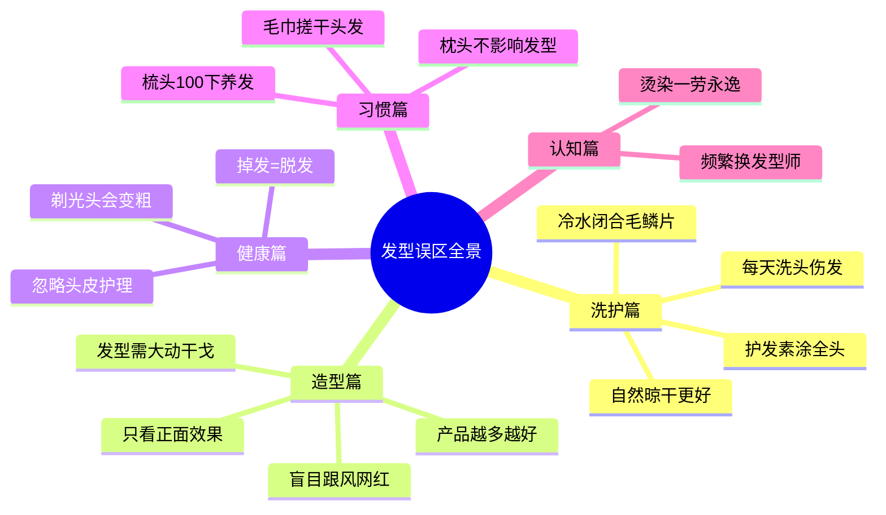
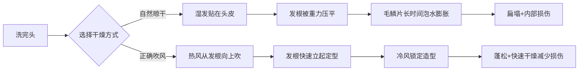
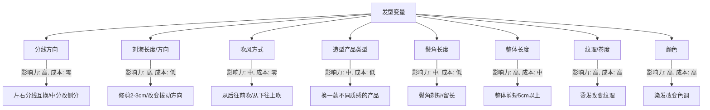
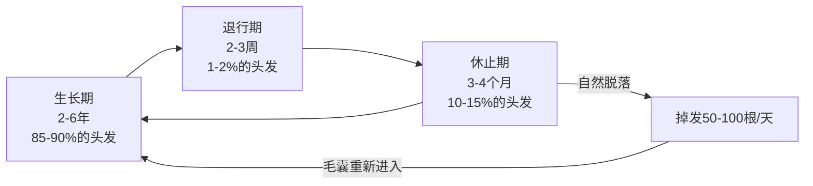
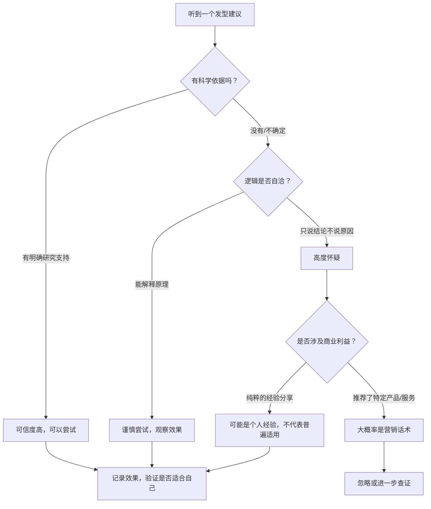

# 常见误区：打破关于发型的一切错误认知

## 为什么我们需要专门讨论误区

在学习发型打理的过程中，**错误信息比没有信息更危险**。一个错误的观念可能导致你数月甚至数年在错误的方向上努力——花钱买了不合适的产品、养成了伤害头发的习惯、或者因为恐惧而不敢尝试真正有效的方法。

这些误区之所以根深蒂固，有三个原因：

1. **口耳相传的"常识"**：很多观念来自上一辈人的经验，但洗护产品和技术已经发生了根本性变化
2. **商业营销的误导**：品牌为了卖产品，经常夸大某些问题或创造不必要的焦虑
3. **幸存者偏差**：某个方法碰巧对某个人有效，就被当成普遍真理传播

本章系统梳理男性发型打理中最常见的 **15 个误区**，逐一拆解其错误根源，提供科学依据，并给出真正有效的替代方案。

***

## 第一类：洗护误区

### 误区一：每天洗头会伤害头发

#### 错误观念

"每天洗头会洗掉头发的天然油脂，导致头发干燥受损。"很多人因此即使头皮油腻也坚持两三天才洗一次。

#### 为什么这个观念是错的

这个误区的根源在于对"天然油脂"功能的误解。皮脂腺分泌的**皮脂（sebum）**确实有保护作用——它能润滑毛干、防止水分过度蒸发。但对于亚洲男性来说，皮脂腺往往过度活跃，分泌的油脂远远超过"保护"所需。

油脂过量堆积的真正危害：

| 危害 | 机制 | 后果 |
|------|------|------|
| 毛囊堵塞 | 皮脂与角质混合形成脂质栓 | 头发生长受限，严重时导致脱发 |
| 头皮炎症 | 皮脂被马拉色菌（Malassezia）分解为油酸 | 脂溢性皮炎、头屑增多 |
| 扁塌加重 | 油脂使发丝相互粘连 | 发量视觉减少30-50% |
| 异味产生 | 皮脂氧化产生游离脂肪酸 | 社交尴尬 |

2021年《Skin Appendage Disorders》期刊的综述明确指出：**对于油性头皮人群，每天洗发不仅无害，反而是维护头皮健康的必要手段**。使用温和配方（氨基酸类表面活性剂）的洗发水，不会破坏头皮屏障。

#### 正确做法

根据头皮出油程度确定洗发频率：

| 头皮类型 | 判断标准 | 建议频率 | 洗发水选择 |
|---------|---------|---------|----------|
| 油性 | 早上洗完下午就出油 | 每天或隔天 | 氨基酸为主，每周1次深层清洁 |
| 中性 | 隔天出油明显 | 隔天 | 氨基酸类 |
| 干性 | 3天以上才出油 | 2-3天 | 甜菜碱/葡糖苷类 |
| 敏感 | 伴随瘙痒、红肿 | 隔天，温和配方 | 无香料无色素的药用洗发水 |

**关键细节**：洗发时水温控制在37-38°C（略高于体温），不要用指甲抓挠——用指腹以画圈方式按摩头皮2-3分钟，让表面活性剂有充分时间包裹油脂。

***

### 误区二：护发素要涂满全头

#### 错误观念

"护发素是给头发补充营养的，当然要从发根涂到发梢。"

#### 为什么这个观念是错的

护发素的核心成分是**阳离子表面活性剂**（如鲸蜡硬脂基三甲基氯化铵）和**硅油**（如聚二甲基硅氧烷）。它们的工作机制是：

1. 阳离子表面活性剂带正电荷，被带负电荷的受损发丝吸附
2. 在发丝表面形成一层疏水薄膜
3. 闭合张开的毛鳞片，增加顺滑度和光泽

问题在于：**发根和新生发干本身就是健康的**，毛鳞片紧密，不需要额外闭合。把护发素涂在发根会导致：

- 阳离子成分吸附在发根，增加发丝间的"滑动感"，发根失去互相支撑的摩擦力 → **直接导致扁塌**
- 硅油薄膜包裹发根，阻止皮脂正常扩散 → 皮脂堆积在发根附近，出油更快
- 残留物与皮脂混合 → 毛囊堵塞风险增加

#### 正确做法

涂抹区域和用量的精确指导：

头部区域划分（从发际线到后颈）：

  ┌───────────────┐
  │  发根区域     │ ← 绝对不涂护发素
  │  (0-5cm)      │
  ├───────────────┤
  │  过渡区域     │ ← 细软发质跳过；粗硬发质可薄涂
  │  (5-10cm)     │
  ├───────────────┤
  │  发梢区域     │ ← 重点涂抹，这是最需要保护的区域
  │  (10cm以下)   │
  └───────────────┘

- **细软发质**：只涂发梢，用量约一元硬币大小，等待1分钟后冲洗
- **粗硬发质**：可延伸到过渡区域，用量约两枚硬币，等待2分钟
- **极度扁塌发质**：可以完全跳过护发素，改用**免洗型护发精油**（仅涂发梢），避免根部接触任何顺滑成分

***

### 误区三：冷水冲洗能"闭合毛鳞片"

#### 错误观念

"洗完头用冷水冲一下，能让毛鳞片闭合，头发更有光泽。"

#### 为什么这个观念是错的

这是一个被广泛传播但**缺乏科学依据**的说法。毛鳞片（cuticle）是由多层角蛋白鳞片堆叠而成的硬质结构，它的开合主要取决于：

- **化学因素**：pH值（酸性环境促进闭合，碱性促进张开）
- **物理因素**：机械损伤、热损伤

温度对毛鳞片的影响**非常有限**。头发是死细胞组成的角蛋白纤维，不像皮肤那样有血管和肌肉，不会因为温度变化而"收缩"。2009年《Journal of Cosmetic Science》的研究发现，冷水冲洗对毛鳞片状态的影响在统计学上**不显著**。

冷水冲洗真正的"作用"只有：让你感到冷，以及让头皮血管暂时收缩（但这个效果几秒就消失了）。

#### 正确做法

与其迷信冷水，不如关注真正影响毛鳞片状态的因素：

| 真正有效的手段 | 原理 | 操作 |
|--------------|------|------|
| 酸性护发产品 | pH 4.5-5.5 的弱酸性环境促进毛鳞片闭合 | 使用含柠檬酸或乳酸的护发素 |
| 热风→冷风切换 | 热风塑形后用冷风"冻结"造型 | 吹风最后30秒切换冷风 |
| 减少热损伤 | 高温直接破坏毛鳞片结构 | 电吹风保持15-20cm距离 |
| 含硅油产品 | 硅油填充毛鳞片间隙，物理性闭合 | 免洗护发精油或喷雾 |

***

### 误区四：自然晾干比吹风好

#### 错误观念

"吹风机会伤头发，自然晾干最安全。"

#### 为什么这个观念是错的

直觉上"不用热=不伤害"似乎合理，但2011年《Annals of Dermatology》的研究给出了相反的结论：

- **自然晾干**：头发在湿润状态下停留时间过长（1-2小时），水分会渗入发丝内部，导致**发干膨胀**（hygral fatigue），反复膨胀-收缩会造成内部结构损伤
- **正确使用吹风机**：虽然热风会造成一定损伤，但快速干燥减少了湿润时间带来的膨胀损伤，**净伤害反而更小**

对于头发塌的人来说，自然晾干还有一个致命问题：头发在重力作用下会紧贴头皮定型，发根在湿润状态中被压平，干了之后就是**扁塌的灾难**。

#### 正确做法

吹风机使用的四步法：

1. **毛巾按压**（不是搓）：先用超细纤维毛巾按压吸走60-70%的水分，到不滴水的状态
2. **热风吹发根**：用中等温度（不是最高档），将吹风机风口从下往上对准发根，距离15-20cm，一边吹一边用手指向上拨起发根
3. **塑形吹发干**：顺着想要的方向吹发干，利用热风建立方向
4. **冷风定型**：最后切换冷风，每个区域吹5-10秒，让发丝在冷却中固定形态

**温度控制**：吹风机温度不超过60°C。判断方法：把手放在吹风机和头发之间的位置，如果感到烫手，说明距离太近或温度太高。

***

### 误区五：洗发水要经常换，不然头发会"免疫"

#### 错误观念

"用同一款洗发水久了，头发就适应了，效果变差，所以要经常换。"

#### 为什么这个观念是错的

头发是**死细胞**，没有免疫系统，不存在"适应"或"免疫"的概念。你觉得效果变差，通常是因为：

1. **季节变化**：夏季出油量比冬季多50-70%，同一款洗发水清洁力不够
2. **产品残留积累**：长期使用含硅油的护发产品，残留物逐渐堆积
3. **心理适应**：你习惯了洗干净后的感觉，对比感降低了

真正需要换洗发水的时机：换季时、头皮状态发生明显变化时、更换了其他护发产品时。

#### 正确做法

- 不要盲目频繁更换，找到适合自己头皮的洗发水后可以长期使用
- 每周用一次**深层清洁洗发水**（含硫酸盐或水杨酸），去除产品残留
- 换季时根据头皮状态调整：夏季可选清洁力稍强的，冬季换温和款
- 如果某种洗发水持续使用后确实效果下降，先检查是否是护发产品残留问题

***

## 第二类：造型误区

### 误区六：造型产品用得越多越好

#### 错误观念

"头发不够蓬？多用点蓬蓬粉！不够定型？多喷点发胶！"

#### 为什么这个观念是错的

造型产品的有效成分（聚合物、蜡质、纤维）都是有**承载极限**的。超过头发能承受的量，会出现反效果：

| 产品过量的后果 | 具体表现 |
|--------------|---------|
| 负重效应 | 每克产品都增加发丝重量，过量直接压塌发型 |
| 结块现象 | 产品在发丝间形成胶状粘连，头发变成一缕一缕的 |
| 油腻外观 | 产品中的油脂/蜡质过量堆积，看起来像没洗头 |
| 清洗困难 | 残留物需要更强的清洁力才能去除，形成恶性循环 |
| 毛囊堵塞 | 长期残留可能导致毛囊炎 |

#### 正确做法

**"少量多次"原则**：

- **发蜡/发泥**：黄豆大小 → 搓开 → 涂抹 → 不够再加黄豆大小。细软发质全头用量不超过一枚一元硬币面积的量
- **蓬蓬粉**：每区域1-2次抖撒即可，不要直接大量倾倒
- **发胶/定型喷雾**：距离20-30cm，每次喷1-2秒，可多次重复

**涂抹技巧**：任何产品都要先在手掌间充分搓开、搓热，让产品均匀分布在手指和掌心，再从发中段向发梢和发根方向涂抹。直接把一坨产品放在头顶是新手最常见的错误。

**判断用量是否合适的标准**：涂抹后头发应该看起来自然，用手摸有轻微的质感但不粘腻，用手指拨开发丝时不会拉丝或粘连。

***

### 误区七：只关注正面效果

#### 错误观念

"照镜子看到正面好看就行了。"

#### 为什么这个观念是错的

日常社交中，别人看你脸的正面的频率其实**远低于**你的想象。走路时、排队时、坐在对面时——别人更多看到的是你的侧面和背面。

一个致命的现实：很多人正面精心打理过的发型，侧面看鬓角杂乱、后脑扁平、发际线参差不齐。**侧面和后面暴露的问题，往往能直接抵消正面的精心打理。**

#### 正确做法

建立**四面检查习惯**：

视角检查顺序：

正面 → 两侧45° → 纯侧面 → 后方

检查重点：
├── 正面：刘海方向、分线清晰度、整体对称性
├── 45°：鬓角弧度、发干流向、顶部高度
├── 侧面：鬓角是否干净、耳朵上方头发弧度、侧面轮廓线
└── 后方：后脑弧度（是否饱满）、后颈发际线、整体圆润度

**实用工具**：

- 手机后置摄像头 + 延时自拍：最简单的自我检查方式
- 两面镜子对照：一面在前，一面在后，角度调整到能看到后脑
- 每次剪完头发，拍下四个角度的照片存档，作为与发型师沟通的依据

***

### 误区八：盲目跟风网红发型

#### 错误观念

"这个博主的发型好帅，我也要剪同款。"

#### 为什么这个观念是错的

网红发型呈现的"效果"背后有大量**不可见的变量**：

1. **造型时间**：你看到的照片可能是经过30分钟精心打理的结果，博主每天的实际打理时间可能远超你的想象
2. **拍摄技巧**：角度、光线、后期滤镜会大幅改变发型的视觉效果
3. **个人条件差异**：头型（圆头/扁头）、发质（粗硬/细软）、发量（多/少）、脸型——这些先天条件的差异会让同一款发型在不同人头上产生截然不同的效果
4. **隐藏成本**：某些看似自然的发型，背后可能需要定期烫发、专业造型产品、甚至假发片辅助

#### 正确做法

理性参考网红发型的四步法：

1. **匹配条件**：找到与自己脸型、发质、发量相似的博主。不要看一个发量浓密的博主做蓬松效果，然后期待自己稀薄的头发也能达到同样效果
2. **多角度验证**：不要只看一张精修照片，要看视频、多角度照片、甚至直播中的状态
3. **咨询发型师**：把参考照片给发型师看，让专业人士评估这款发型在你头上的可行性和需要的调整
4. **渐进尝试**：不要一步到位，先尝试相近风格，根据反馈逐步调整

**判断网红发型是否适合你的速查表**：

| 你的情况 | 网红发型特征 | 兼容性 | 建议 |
|---------|------------|--------|------|
| 细软塌发质 | 蓬松纹理烫效果 | ⚠️ 中等 | 需要配合烫发+强力造型产品，维持成本高 |
| 粗硬直发质 | 自然微卷效果 | ⚠️ 中等 | 需要烫发才能达到，直发无法自然实现 |
| 发量少 | 厚重刘海造型 | ❌ 低 | 会暴露发量问题，建议选择轻薄层次 |
| 发量多 | 贴头短发 | ✅ 高 | 可以尝试，但需要定期打薄 |
| 方形脸 | 中分长刘海 | ✅ 高 | 中分可以修饰颧骨，推荐尝试 |

***

### 误区九：发型改变需要"大动干戈"

#### 错误观念

"要改变发型，就得全面改造——烫、染、剪，一步到位。"

#### 为什么这个观念是错的

发型是一个**系统**，改变其中一个变量就能产生显著效果。一次性改变多个变量会导致：

- 无法判断哪个改变起了正面作用、哪个起了负面作用
- 如果效果不好，不知道该回退哪一步
- 过大的变化可能让你难以适应，心理上产生抗拒

#### 正确做法

**单变量迭代法**：每次只改变一个因素，观察效果后再决定下一步。

可调节的变量按**影响力**排序：

**推荐迭代顺序**：先尝试零成本的变量（分线、吹风方式），再尝试低成本变量（产品、长度微调），最后才是高成本变量（烫、染）。你会发现很多时候，前两步的调整已经足够显著。

***

## 第三类：健康误区

### 误区十：忽略头皮护理

#### 错误观念

"发型护理就是护理头发，头皮不用管。"

#### 为什么这个观念是错的

**头皮是头发生长的"土壤"**。头发的健康程度、生长速度、粗细程度，都直接受头皮环境的影响。更关键的是，对于头发塌的男性来说，很多扁塌问题的根源不在头发本身，而在头皮：

| 头皮问题 | 对发型的影响 | 发生机制 |
|---------|------------|---------|
| 皮脂过度分泌 | 扁塌、油腻 | 皮脂包裹发根，降低发丝间摩擦力 |
| 角质层过厚 | 发量视觉减少 | 死皮堆积遮挡毛囊开口 |
| 头皮炎症 | 瘙痒、红肿、脱发 | 马拉色菌过度增殖、免疫反应 |
| 毛囊萎缩 | 发丝变细、发量减少 | DHT攻击毛囊（雄激素性脱发） |
| 头皮敏感 | 不耐受造型产品 | 屏障功能受损 |

#### 正确做法

**日常头皮护理三步法**：

**第一步：正确洗发**（每天或隔天）
- 用指腹（不是指甲）以画圈方式按摩整个头皮
- 重点区域：前额发际线、头顶、耳后（这些区域皮脂腺最密集）
- 按摩时间不少于2分钟，让表面活性剂充分作用

**第二步：定期去角质**（每周1-2次）
- 使用含**水杨酸（BHA）**或**果酸（AHA）**的头皮去角质产品
- 水杨酸浓度1-2%即可，能溶解油脂和角质
- 使用方法：洗发前涂抹在头皮上，轻轻按摩3-5分钟后冲洗，再正常洗发

**第三步：针对性护理**（按需）
- **头屑多**：含酮康唑（2%）或吡啶硫酮锌（ZPT）的药用洗发水，每周2-3次
- **头皮出油过快**：含烟酰胺的头皮精华，调节皮脂分泌
- **头皮敏感**：含红没药醇（bisabolol）或积雪草提取物的舒缓产品
- **脱发迹象**：含米诺地尔（minoxidil 5%）的外用溶液，需持续使用3-6个月见效

**重要提醒**：如果出现大面积头屑、持续瘙痒、斑片状脱发、头皮脓疱等症状，这不是自己能解决的问题，请及时就医看皮肤科——这些可能是脂溢性皮炎、银屑病、头癣等需要专业治疗的疾病。

***

### 误区十一：掉头发就是脱发，必须赶紧治疗

#### 错误观念

"洗头掉了很多头发，梳头也掉，我是不是要秃了？"

#### 为什么这个观念是错的

**正常人每天掉50-100根头发是完全正常的生理现象**。头发有固定的生长周期：

你之所以觉得"掉了很多"，通常是因为：

1. **洗头日集中掉发**：休止期的头发在日常被其他发丝夹住，洗头时才脱落。洗头掉100-200根是正常的
2. **季节性脱发**：秋季（8-10月）休止期头发比例会升高，掉发量可能比平时多50%
3. **注意力偏差**：你开始关注后，会觉得到处都是自己的头发

**真正需要警惕的脱发信号**：

| 信号 | 正常掉发 | 异常脱发 |
|------|---------|---------|
| 掉发数量 | 每天50-100根 | 持续每天超过150根 |
| 掉落方式 | 自然脱落或洗头时掉 | 轻轻一拉就掉3-5根（拉发试验阳性） |
| 新生发 | 掉的地方很快有短小新发 | 新发越来越少、越来越细 |
| 头皮变化 | 头皮正常 | 发际线后退、头顶稀疏可见头皮 |
| 持续时间 | 偶尔，季节性 | 持续3个月以上 |

#### 正确做法

**自我评估三步法**：

1. **数一数**：收集洗头和吹头后掉落的头发，连数3天，如果平均每天超过150根，需要关注
2. **拉一拉**：用拇指和食指捏住一小撮头发（约50根），从发根向发梢方向轻轻拉。如果掉超过6根，说明有异常脱落
3. **看一看**：对比3个月前的照片，观察发际线和头顶是否有明显变化

如果以上任何一步提示异常，**尽快去正规医院皮肤科就诊**。脱发治疗有**时间窗口**——毛囊完全萎缩后就不可逆了。早期干预（米诺地尔、非那雄胺等）效果远好于晚期补救。

***

### 误区十二：剃光头能让头发变粗变多

#### 错误观念

"把头发剃光，新长出来的头发会更粗更硬更浓密。"

#### 为什么这个观念是错的

这是最经典的**视觉错觉**。剃光头后新长出的头发看起来"更粗"，是因为：

1. **横截面效应**：自然生长的发梢是逐渐变细的锥形，剃光后新长出的发根是被切断的钝角横截面，看起来更粗——但实际直径没有变化
2. **短发的硬度错觉**：短发因为长度不够，无法因自重而弯曲，所以摸起来更"硬挺"——这是物理性质，不是头发本身变粗了
3. **统一长度的错觉**：剃光后所有头发同时生长，看起来均匀浓密——但实际上每个毛囊的密度没有改变

1928年就已经有对照实验否定了这个说法。后续多次研究反复证实：**剃毛不会改变毛发的直径、颜色、生长速度或密度**。这些参数完全由毛囊和基因决定。

#### 正确做法

如果你想让头发看起来更浓密，应该关注**真正有效的方法**：

- **视觉效果**：选择短发或寸头，统一的短长度天然显得发量多
- **头皮护理**：健康的头皮环境能让每根头发都达到最粗状态
- **营养支持**：蛋白质（头发的主要成分是角蛋白）、铁、锌、生物素的充足摄入
- **医学干预**：如果确实是雄脱，米诺地尔和非那雄胺是唯一经过FDA认证的有效成分
- **烫发增粗**：纹理烫能增加发丝间的空间感，视觉上增加发量

***

## 第四类：日常习惯误区

### 误区十三：用毛巾搓干头发

#### 错误观念

"洗完头用毛巾搓一搓，干得快。"

#### 为什么这个观念是错的

湿发状态下的头发处于**最脆弱的状态**。水分子渗入发丝内部后，会导致角蛋白之间的氢键断裂，头发的抗拉强度下降约30%。此时毛鳞片处于张开状态，像鱼鳞一样向外翘起。

用毛巾搓头发时，粗糙的毛巾纤维与张开的毛鳞片之间产生剧烈摩擦，会造成：

- **毛鳞片剥离**：表层鳞片被撕裂或完全剥落，露出内部的皮质层
- **微裂纹扩展**：已经存在的微观裂纹在摩擦力作用下扩大
- **发丝缠绕打结**：摩擦力导致头发互相缠绕，拉扯造成断裂
- **长期后果**：头发失去光泽（毛鳞片不完整导致光线散射）、毛躁（鳞片翘起）、分叉（末端分裂）

#### 正确做法

**正确的干发方式**：

1. **选择超细纤维干发帽/毛巾**：超细纤维（microfiber）的纤维直径只有普通毛巾的1/10，吸水性更强且摩擦力极小
2. **按压式吸水**：将毛巾包裹在头发上，用手掌轻轻按压、挤压，让毛巾吸收水分。不是"擦"，是"吸"
3. **时间控制**：按压2-3分钟，直到不滴水
4. **等待半干再吹**：如果时间允许，可以包裹5-10分钟，等头发半干后再吹风，减少吹风时间

**绝对不要做的事**：

- ❌ 用毛巾来回搓头发
- ❌ 用毛巾裹住头发后使劲拧
- ❌ 用普通棉质毛巾大力摩擦
- ❌ 头发还滴水时就开始用热风吹（水分蒸发会带走大量热量，需要更高温度才能吹干，反而更伤发）

***

### 误区十四：枕头和枕套跟发型无关

#### 错误观念

"睡觉就是睡觉，枕头对头发能有什么影响？"

#### 为什么这个观念是错的

你每天有6-8小时的头发与枕头的接触时间。这段时间里，枕套材质对头发的影响**远超大多数人的想象**：

| 枕套材质 | 摩擦系数 | 对头发的影响 |
|---------|---------|------------|
| 普通棉质 | 高（μ≈0.4） | 严重摩擦毛鳞片，起床后头发毛躁、扁塌、有压痕 |
| 丝绸/真丝 | 低（μ≈0.15） | 摩擦力仅为棉质的1/3，减少毛躁和压痕 |
| 缎面（satin） | 低（μ≈0.2） | 接近丝绸效果，价格更友好 |
| 竹纤维 | 中（μ≈0.3） | 比棉质好，但不如丝绸 |

对于细软塌发质，棉质枕套的高摩擦力会：在夜间持续破坏毛鳞片（累积效应），早上起床后头发被压扁且难以恢复，长期使用导致发梢磨损加速。

#### 正确做法

- **更换枕套**：换成真丝或缎面枕套，成本不高（50-150元），但效果显著
- **睡前准备**：用宽齿梳轻轻梳顺头发，避免打结后再被摩擦
- **发型保持**：如果第二天需要保持特定发型，可以使用**丝绸睡帽**，既减少摩擦又能保持发型
- **定期更换**：枕套每周更换1-2次，避免油脂和细菌积累

***

### 误区十五：每天梳头100下能让头发更健康

#### 错误观念

"古人说每天梳头100下，能促进血液循环，让头发更健康。"

#### 为什么这个观念是错的

这个说法没有任何科学依据。事实上，过度梳头对头发是**有害的**：

- 每次梳头都会对毛鳞片产生摩擦，100次的累积摩擦是相当可观的
- 梳子的齿与头发之间的拉扯力可能导致健康的头发被强行拉落（牵引性脱发）
- 对于细软发质，过度梳头会让头发变得更贴、更塌

促进头皮血液循环的正确方法是**用指腹按摩头皮**，而不是用梳子刷——手指的力度可以精确控制，不会造成发丝的摩擦损伤。

#### 正确做法

- **梳头的目的**：只在需要整理发型或解开打结时梳头，不要为了"健康"而梳
- **工具选择**：使用**宽齿梳**（齿距5mm以上）或**气垫按摩梳**，避免使用密齿梳
- **梳头技巧**：从发梢开始，慢慢向上梳通，不要从发根直接往下硬拉——遇到打结时，用手指轻轻解开，不要硬拽
- **频率**：每天梳2-3次足够，每次不超过30秒
- **湿发状态**：湿发时不要用梳子，此时头发最脆弱，用宽齿梳或手指轻轻理顺即可

***

## 第五类：认知误区

### 误区十六：频繁更换发型师

#### 错误观念

"这次剪得不满意，换一个发型师试试。"

#### 为什么这个观念是错的

好的发型师与你之间需要一个**磨合期**。发型师需要了解你的：

- 发质特性（粗硬程度、生长方向、易打理区域和困难区域）
- 头型特点（扁头还是圆头、发际线形状）
- 生活习惯（愿意花多少时间打理、常用什么产品）
- 审美偏好（自然还是精致、成熟还是年轻）
- 历史记录（之前剪过什么、什么效果好什么效果差）

这些信息不可能在第一次剪发时就完整传递。研究显示，客户与发型师的满意度通常在**第2-3次服务后**达到峰值——因为发型师已经积累了足够的观察和反馈信息。

#### 正确做法

- **初次合作**：第一次剪发视为"试探"，不要期望完美效果
- **有效沟通**：带参考照片，但要说明"我喜欢这个发型的XX部分"，而不是简单说"剪这个"
- **及时反馈**：剪完后观察1-2天，记录不满意的具体点，在下次剪发前告诉发型师
- **三次法则**：如果连续三次都不满意，再考虑更换。三次不满意说明可能真的不合适
- **建立档案**：记录适合自己的发型参数（长度、层次、鬓角处理方式），即使换了发型师也能快速传达

***

### 误区十七：烫染是一劳永逸的解决方案

#### 错误观念

"头发塌？烫一下就好了，以后不用管了。"

#### 为什么这个观念是错的

烫发确实是对抗扁塌最有效的手段之一，但它**远不是"一劳永逸"的**：

1. **维持时间有限**：热烫效果通常维持3-6个月，冷烫2-4个月，之后新长出的头发是直的，需要重新烫
2. **损伤累积**：每次烫发都会对头发造成化学损伤（二硫键的断裂和重组），频繁烫发会导致头发干枯、断裂
3. **新发衔接问题**：烫过的头发和新生直发之间会出现"断层"，需要定期修剪和造型来掩盖
4. **日常打理需求**：烫过的头发也需要日常打理——吹风方式、产品选择都与直发不同，不是"烫完就不用管"

#### 正确做法

**烫发后的维护清单**：

- **间隔时间**：两次烫发之间至少间隔3个月，让头发有恢复时间
- **日常护理**：使用含角蛋白的修护产品，补充烫发流失的蛋白质
- **吹风方式**：烫过的头发用扩散风嘴（diffuser）吹，能保持卷度同时减少热损伤
- **造型产品**：使用弹力素或卷发慕斯来维持和强化卷度
- **定期修剪**：每4-6周修剪一次发梢，去除分叉和干枯部分
- **睡眠保护**：使用丝绸枕套，减少摩擦对卷度的破坏

***

## 误区诊断决策树

当你遇到一个关于发型的"常识"或"建议"时，用这个框架来判断它是否可信：

**快速判断法则**：

1. **如果一个说法只告诉你"做什么"而不告诉你"为什么"** → 大概率是人云亦云
2. **如果一个说法伴随着特定产品的推荐** → 大概率是营销
3. **如果一个说法声称"对所有人都适用"** → 大概率过度简化
4. **如果一个说法来自"老一辈的经验"但无法被现代科学验证** → 可能已经过时

***

## 总结：17个误区速查表

| 编号 | 误区 | 正确认知 | 行动要点 |
|------|------|---------|---------|
| 01 | 每天洗头伤发 | 油性头皮每天洗是必要的 | 根据头皮类型选择频率 |
| 02 | 护发素涂全头 | 只涂发梢，发根不涂 | 距离发根10cm以下 |
| 03 | 冷水闭合毛鳞片 | 温度对毛鳞片影响极小 | 用酸性护发产品代替 |
| 04 | 自然晾干更好 | 长时间湿润损伤更大 | 正确使用吹风机快速干燥 |
| 05 | 洗发水要经常换 | 头发不会"免疫" | 稳定使用适合的产品 |
| 06 | 造型产品越多越好 | 过量会加重扁塌 | 少量多次，从黄豆大小开始 |
| 07 | 只看正面效果 | 别人更多看到你的侧面和后面 | 四面检查习惯 |
| 08 | 盲目跟风网红发型 | 条件差异决定效果差异 | 匹配自身条件再参考 |
| 09 | 改发型需大动干戈 | 单变量迭代最高效 | 先调零成本变量 |
| 10 | 忽略头皮护理 | 头皮是发型的根基 | 清洁+去角质+针对性护理 |
| 11 | 掉发=脱发 | 每天掉50-100根是正常的 | 学会自我评估，异常及时就医 |
| 12 | 剃光头能变粗 | 视觉错觉，直径不变 | 关注真正有效的方法 |
| 13 | 毛巾搓干头发 | 湿发状态下毛鳞片极易受损 | 超细纤维毛巾按压吸水 |
| 14 | 枕头跟发型无关 | 枕套材质影响巨大 | 换真丝或缎面枕套 |
| 15 | 梳头100下更健康 | 过度梳头有害无益 | 宽齿梳，每天2-3次即可 |
| 16 | 频繁换发型师 | 磨合期需要2-3次 | 三次法则 |
| 17 | 烫染一劳永逸 | 需要持续维护 | 间隔3个月+日常修护 |

**记住核心原则**：

1. **科学洗护**——不过度也不不足，根据自己的头皮类型选择方案
2. **产品适量**——少量多次，宁少勿多
3. **重视吹风**——吹风是蓬松的基础，自然晾干是塌发的帮凶
4. **全面检查**——360度无死角，侧面和后面比正面更重要
5. **适合自己**——不跟风、不盲从，基于自身条件做选择
6. **系统思维**——发型是一个系统，从头皮到发梢，从洗护到造型，从日常到专业，每个环节都影响最终效果

***

> 下一节：[06-本章小结](./06-本章小结.md)
