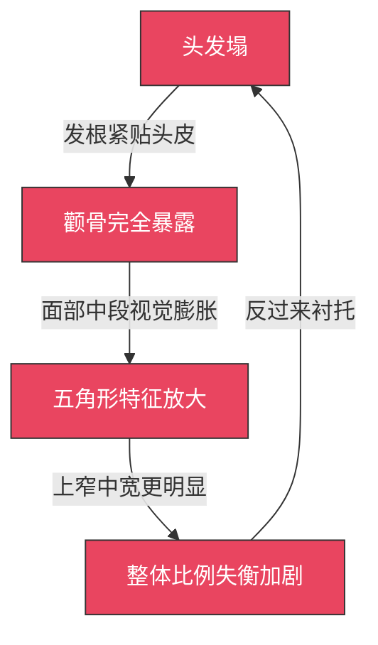
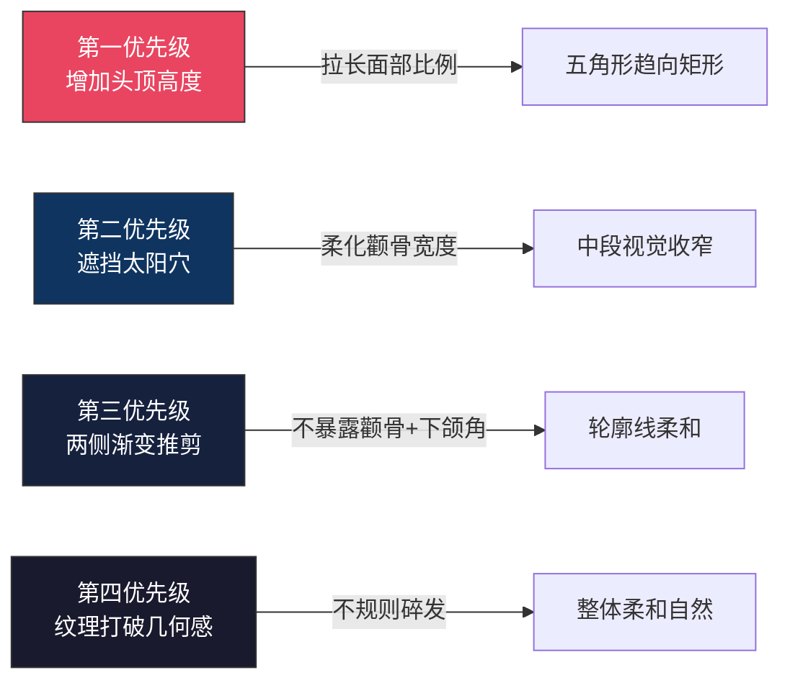
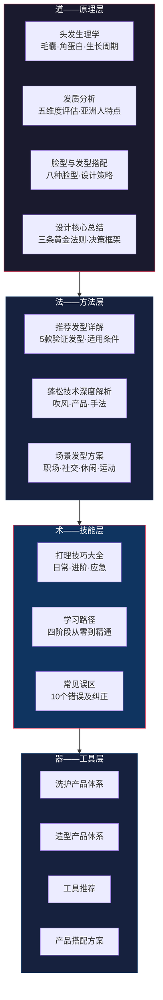

# 06-本章小结：从理论到行动的完整闭环

本章从头发生理学出发，经过脸型分析、发质诊断、发型设计原理，落地到具体发型方案、打理技巧、产品选择和常见误区纠正。本小结不是简单的"摘抄要点"，而是将整章知识重新组织为一套可执行的决策框架——帮你把读到的内容真正转化为每天早上的5分钟造型流程。

***

## 一、你的三维约束画像：为什么方案必须"系统性"

你面临的不是单一问题，而是三个相互叠加的约束条件：

### 1.1 约束矩阵

| 特征 | 本质原因 | 造成的视觉问题 | 设计目标 |
|------|---------|--------------|---------|
| 头发塌（细软发质+中性偏油头皮） | 发丝直径小（<60μm），皮脂腺活跃，缺乏天然卷曲支撑力 | 头部轮廓扁平，发量看起来比实际少，颧骨完全暴露 | 增加发根支撑力，营造持久蓬松感 |
| 颧骨突出 | 颧弓（Zygomatic Arch）发育充分，面部中段骨骼体量大 | 面部线条硬朗，视觉重心被拉向中段，额头和下巴显得窄 | 弱化颧骨存在感，用头发遮挡太阳穴区域 |
| 方形脸 | 颧宽>额宽，下颌角明显，形成"上窄中宽下收"的五角形轮廓 | 面部比例不均衡，介于方脸和菱形脸之间，传统方案不能直接套用 | 拓宽额头视觉宽度，平衡三庭比例 |

### 1.2 叠加效应——为什么单点解决无效

这三个约束不是独立的，它们之间存在正反馈的放大效应：

| 组合效应 | 具体表现 | 单独解决是否有效 |
|---------|---------|---------------|
| 头发塌 + 颧骨突出 | 头发贴头皮 → 颧骨成为视觉焦点 → 脸部显宽显硬 | 只遮颧骨不蓬松 → 依然塌；只蓬松不遮挡 → 颧骨依然暴露 |
| 头发塌 + 方形脸 | 扁平发型放大"上窄中宽"比例 | 只增加蓬松度不调整刘海 → 额头依然窄 |
| 颧骨突出 + 方形脸 | 颧骨区域成为五角形的"宽点"，视觉集中 | 只遮颧骨不处理两侧 → 五角形轮廓依然明显 |
| 三者叠加 | 最不利组合：塌+暴露+失衡同时存在 | **必须系统性解决：蓬松+遮挡+纹理，三管齐下** |

**核心结论**：你的发型方案必须同时解决蓬松度、颧骨修饰、面部比例三个问题，任何只解决其中一项的方案都会被另外两项拖垮。

***

## 二、理论基石回顾：你已经掌握的"为什么"

### 2.1 头发生理学——理解你的"原材料"

本章从毛囊结构讲起，你需要记住的关键事实：

| 知识点 | 核心结论 | 对你的实际意义 |
|--------|---------|-------------|
| 毛囊数量出生时固定（亚洲人约10万） | 后天无法增加毛囊数 | 保护现有毛囊比"生发"更重要 |
| 头发由角蛋白组成，二硫键决定形状 | 化学处理（烫发）可以改变二硫键排列 | 纹理烫是改变细软塌发质的有效手段 |
| 氢键是临时性的，湿热可重组 | 吹风造型的本质是重组氢键 | 吹风不是"吹干"，而是"塑形"——这是蓬松的物理基础 |
| 生长期2-7年，亚洲人偏长 | 头发有足够时间留到理想长度 | 不需要担心"头发长不长"，问题在于护理和造型 |
| 每天掉50-100根是正常的新陈代谢 | 不要因为掉发焦虑 | 只有持续每天>150根才需要关注 |

### 2.2 发质五维度评估——你的"配方参数"

| 维度 | 你的状况 | 对发型设计的影响 |
|------|---------|---------------|
| 粗细 | 细发（<60μm） | 易塑形但缺乏支撑力，必须依赖产品和吹风 |
| 密度 | 中等 | 发量够用，关键是"呈现方式"而非"数量" |
| 孔隙度 | 需自行测试（低/中/高） | 决定产品吸收速度和造型持久度 |
| 弹性 | 正常到偏低 | 受损风险中等，避免过度热处理 |
| 油脂分泌 | 中性偏油（24小时左右出油） | 每天或隔天洗发，控油是蓬松的前提 |

**关键认知**：头发塌不是"发量少"，而是"发量没有被正确呈现"。通过正确的洗护、吹风和造型技巧，细软发质完全可以呈现出超越实际发量的视觉效果。发量呈现公式：`视觉发量 = 实际发量 × 蓬松系数 × 纹理系数`。你的实际发量是固定的，但蓬松系数和纹理系数可以通过技术手段提升2-3倍。

### 2.3 脸型设计原理——视觉平衡的底层逻辑

发型设计的终极目标只有一个：**让面部比例趋近于椭圆形**。所有具体技巧都是为这个目标服务的。

三条黄金法则：

1. **视觉平衡**：通过发型的体积、线条和遮挡来弥补脸型的不足
2. **扬长避短**：放大优势，弱化不足——不是试图"消灭"不足
3. **整体协调**：发型与脸型、五官、发质、肤色、身材、穿搭、场合和年龄协调一致

你的方形脸设计优先级：

***

## 三、方案体系总结：你已经掌握的"怎么做"

### 3.1 首推发型：纹理碎盖

纹理碎盖是方形脸+头发塌的最佳选择，因为它同时满足了所有设计优先级：

| 设计要素 | 纹理碎盖的对应处理 | 解决的约束 |
|---------|-----------------|----------|
| 头顶蓬松 | 顶部保留5-8cm，打薄制造纹理，吹风时逆向提拉发根 | 头发塌 |
| 刘海遮挡 | 碎剪刘海，参差不齐，自然遮挡太阳穴和额头两侧 | 颧骨突出+额头窄 |
| 两侧渐变 | 渐变推剪（fade），从下到上3mm→12mm过渡，保留与头顶的衔接 | 方形脸轮廓 |
| 后脑弧度 | 自然弧度，不要推平 | 增加整体立体感 |
| 纹理处理 | 打薄+碎剪，打破几何感 | 柔化五角形的硬朗线条 |

**与发型师沟通的核心数据**：

> "头顶保留6-7cm，打薄制造纹理。刘海碎剪，遮挡太阳穴和额头两侧。两侧渐变推剪，从下到上3mm到12mm，但不要推太光。后脑自然弧度。需要的话可以做纹理烫增加持久度。"

### 3.2 其他备选发型

| 发型 | 适合场景 | 与纹理碎盖的区别 | 适合度 |
|------|---------|----------------|--------|
| 微分碎盖 | 想要更利落的感觉 | 分线更明显，刘海偏侧 | ★★★★ |
| 纹理前刺 | 休闲、运动场合 | 刘海向前上方，更活泼 | ★★★★ |
| 韩式逗号刘海 | 约会、社交场合 | 刘海呈逗号形弯曲，修饰效果好 | ★★★☆ |
| 自然侧分 | 正式商务场合 | 分线清晰，偏成熟稳重 | ★★★☆ |

### 3.3 蓬松技术三管齐下

蓬松不是靠单一手段实现的，而是吹风+产品+手法的协同：

| 环节 | 核心操作 | 原理 | 耗时 |
|------|---------|------|------|
| 吹风（最关键） | 低头逆向吹发根 → 热风塑形 → 冷风定型 | 氢键在热风下重组，冷风固定新位置 | 3-5分钟 |
| 蓬松产品 | 蓬松粉撒发根/海盐喷雾喷湿发 | 物理吸附油脂+增加发丝间摩擦力 | 30秒 |
| 定型产品 | 发泥从发根抓起，哑光质地 | 支撑发根方向，哑光不增加重量 | 1-2分钟 |

**吹风五区分区法**——进阶技术：

| 分区 | 吹风方向 | 工具 | 关键要点 |
|------|---------|------|---------|
| 前额区 | 向前或向侧 | 圆梳+吹风机 | 控制刘海弧度和方向 |
| 顶区 | 向前+向上 | 圆梳或排骨梳 | 蓬松度的关键区域 |
| 侧区×2 | 向下+向前 | 排骨梳 | 与推剪区域的过渡要自然 |
| 后区 | 向后或向下 | 排骨梳 | 注意后脑勺的弧度 |

### 3.4 产品体系速查

#### 洗护产品

| 类别 | 入门推荐 | 进阶推荐 | 选择逻辑 |
|------|---------|---------|---------|
| 洗发水 | 清扬男士（控油） | 资生堂惠润（温和清洁） | 油性头皮选控油型，中性选温和型 |
| 护发素 | 可跳过（细软塌发质） | 资生堂Fino发膜（仅涂发梢） | 细软发质护发素会加重扁塌 |
| 头皮护理 | 康王酮康唑（每周1次） | 头皮去角质磨砂膏 | 头皮是头发的"土壤"，健康头皮=健康头发 |

#### 造型产品

| 类别 | 入门推荐 | 进阶推荐 | 核心功能 |
|------|---------|---------|---------|
| 发蜡 | 施华蔻酷印 | Gatsby哑光 | 中等定型+自然光泽 |
| 发泥 | 杰士派发泥 | Hanz de Fuko Claymation | 强定型+哑光质感（细软塌首选） |
| 蓬松粉 | 施华蔻蓬蓬粉 | Got2b蓬松粉 | 发根吸附油脂+物理支撑 |
| 盐雾 | 施华蔻海盐喷雾 | Bumble and Bumble | 纹理感+空气感 |
| 定型喷雾 | 施华蔻酷印 | 杰士派 | 最后定型锁住造型 |

#### 工具

| 工具 | 推荐 | 关键参数 | 用途 |
|------|------|---------|------|
| 吹风机 | 松下EH-NA系列/小米水离子 | 功率≥1800W，有冷风档，配集风嘴 | 吹风造型（核心工具） |
| 梳子 | 排骨梳+圆梳（直径3-4cm） | 圆梳直径决定卷度 | 吹风时提拉发根 |
| 电推剪 | 飞利浦HC5690 | 配6mm/9mm/12mm限位梳 | 自我维护鬓角 |

### 3.5 场景化发型切换

不同场合需要不同的造型策略，但底层都是同一套吹风基础：

| 场景 | 发型特点 | 产品组合 | 打理耗时 |
|------|---------|---------|---------|
| 日常通勤 | 自然、干净、不过度造型 | 发泥，哑光 | 5-8分钟 |
| 正式商务 | 整齐、有型、略带光泽 | 发蜡，自然光泽 | 8-12分钟 |
| 休闲约会 | 纹理感、空气感、"不经意的好看" | 盐雾+发泥 | 6-10分钟 |
| 运动健身 | 短、清爽、不影响运动 | 轻定型喷雾或不造型 | 2-3分钟 |

***

## 四、避坑清单：10个必须避免的误区

| 序号 | 误区 | 真相 | 正确做法 |
|------|------|------|---------|
| 1 | 每天洗头伤头发 | 油性头皮每天洗是必要的，油脂堆积加重扁塌+堵塞毛囊 | 油性每天/隔天，中性隔天，干性2-3天 |
| 2 | 护发素涂满全头 | 涂发根直接导致更塌，护发素的顺滑效果让发根失去支撑力 | 只涂距发根10cm以下，细软发质可跳过 |
| 3 | 用毛巾搓干头发 | 湿发毛鳞片张开，搓揉造成毛鳞片损伤，长期导致毛躁断裂 | 轻轻按压吸水，用超细纤维干发帽 |
| 4 | 自然晾干比吹风好 | 自然晾干时重力让头发贴头皮，发根变形，潮湿环境滋生细菌 | 洗发后及时吹干，热风塑形+冷风定型 |
| 5 | 造型产品越多越好 | 过多产品加重负担，头发更塌更油腻，残留堵塞毛囊 | 从黄豆大小开始，充分搓开后涂抹 |
| 6 | 频繁更换发型师 | 无法建立有效沟通，发型风格不稳定 | 找到合适的发型师后保持长期关系，磨合期需2-3次 |
| 7 | 只看正面效果 | 侧面鬓角轮廓+后脑弧度决定立体感，别人看你侧面比正面多 | 360度检查：正面、45度、侧面、后面 |
| 8 | 盲目跟风网红发型 | 网红照片经修图，同款发型在不同脸型发质上效果完全不同 | 选与自己脸型发质相似的博主参考 |
| 9 | 忽略头皮护理 | 头皮是头发的"土壤"，出油/头屑/毛囊堵塞直接影响头发质量 | 每周1次头皮去角质，用指腹按摩，有问题及时就医 |
| 10 | 改变发型需要"大动干戈" | 换分线方向、调整刘海长度、换产品、改吹风方式就能带来大改变 | 每次只改一个变量，逐步迭代 |

**核心原则**：科学洗护，不过度也不不足；产品适量，从少量开始；重视吹风，这是蓬松的基础；全面检查，360度无死角；适合自己，不盲目跟风。

***

## 五、知识体系全景图

本章内容按"道法术器"四层组织，形成完整的知识闭环：

***

## 六、学习路径与阶段验证

### 6.1 四阶段模型

发型打理是一项技能，遵循"刻意练习四阶段模型"：

| 阶段 | 状态 | 时长 | 你会达到的水平 | 验证标准 |
|------|------|------|-------------|---------|
| 认知建立期 | 有意识无能——知道自己不会 | 第1-2周 | 了解自己的脸型和发质，能用专业术语描述目标发型 | 看到任何发型能分析适合什么脸型，能用3句话描述自己想要的发型 |
| 技能入门期 | 有意识有能——会做但需专注 | 第3-6周 | 能独立完成"及格"的日常造型 | 10分钟内完成造型，维持6小时以上，与参考图相似度70% |
| 技能进阶期 | 有意识有能——精度和效率提升 | 第7-12周 | 能根据场合切换发型，掌握分区吹风和多产品搭配 | 8分钟内完成造型，维持12小时以上，能切换2-3种方案 |
| 精通期 | 无意识有能——熟练到自动化 | 第13周+ | 发型成为个人风格的一部分，5分钟出门 | 建立3-5款常备发型的"发型衣橱"，形成个人SOP |

### 6.2 关键里程碑

| 时间节点 | 里程碑事件 | 意义 |
|---------|-----------|------|
| 第1周末 | 完成脸型自测+发质诊断，买到基础产品 | 从"不知道自己不知道"进入"知道自己不知道" |
| 第2-3周 | 第一次被人夸"今天发型不错" | 正反馈激励，证明方向正确 |
| 第4-6周 | 5分钟内完成日常造型，成功率>70% | 从"技能"变成"习惯" |
| 第7-12周 | 建立3-4款常备发型，与发型师有效沟通 | 从"模仿"进入"创造" |
| 第13周+ | 发型成为直觉，不再需要刻意"打理" | 从"有意识有能"进入"无意识有能" |

***

## 六、四周行动计划

### 第一周：认知建立

- [ ] 用软尺测量额宽、颧宽、下颌宽、脸长，确认脸型
- [ ] 取一根头发放白纸上判断粗细，记录洗发后出油时间
- [ ] 收集5张目标发型参考图（选与自己脸型发质相似的博主）
- [ ] 购买基础三件套：控油洗发水+发泥+定型喷雾
- [ ] 学习基础吹风三步法：预干燥（30秒）→ 定方向（2-3分钟）→ 冷风定型（15秒）

**验证标准**：能清楚说出"我是方形脸，细软塌发质，目标发型是纹理碎盖"

### 第二周：技能练习

- [ ] 每天洗发后练习吹风技巧，重点练"低头逆向吹发根"
- [ ] 尝试使用发泥造型，从黄豆大小开始
- [ ] 每天拍照记录造型效果（正面+侧面+后面）
- [ ] 对比每天照片，找出效果最好的一天，分析原因
- [ ] 调整产品用量和手法，记录"最佳配方"

**验证标准**：能做出一个"看得过去"的造型，持续到下午不明显变形

### 第三周：发型师沟通

- [ ] 在大众点评/小红书筛选3位发型师，看作品集和评价
- [ ] 带参考图去剪发，使用沟通话术模板（见学习路径章节）
- [ ] 剪发后360度检查，拍照记录
- [ ] 问发型师："我回家能打理出这个效果吗？需要什么产品？"
- [ ] 评估剪发效果，记录改进方向

**验证标准**：发型师理解你的需求，剪出的效果与参考图相似度>60%

### 第四周：方案优化

- [ ] 根据剪发效果调整吹风手法和产品组合
- [ ] 尝试场景切换：通勤发型 vs 约会发型
- [ ] 建立5分钟快速打理流程，计时验证
- [ ] 形成稳定的日常造型习惯
- [ ] 建立自己的"发型SOP"（标准操作流程）文档

**验证标准**：5分钟内完成日常造型，能切换至少2种场景方案

***

## 七、长期目标与迭代机制

### 7.1 阶段性目标

| 时间 | 目标 | 关键能力 |
|------|------|---------|
| 1个月后 | 能独立完成日常造型，找到适合的基础发型，建立稳定打理流程 | 基础造型能力 |
| 3个月后 | 能根据场合切换发型，与发型师建立良好沟通，发型成为形象加分项 | 场景应变能力 |
| 6个月后 | 形成独特的发型风格，发型与穿搭协调统一，能灵活应变各种场合 | 风格塑造能力 |

### 7.2 持续迭代机制

发型不是"学会就完了"，它需要持续优化。建立反馈循环：

**每两周自评**：
1. 回顾过去两周的发型照片
2. 哪天效果最好？用了什么方法？（保留）
3. 哪天效果最差？原因是什么？（改进或放弃）
4. 产品是否需要调整？

**每两个月深度复盘**：
1. 当前发型方案是否仍然适合？（潮流在变，个人风格也在进化）
2. 发质是否因季节/护理发生变化？（夏季出油多，冬季干燥）
3. 是否需要与发型师沟通调整剪法？
4. 是否需要更新产品组合？

**季节调整策略**：

| 季节 | 发质变化 | 发型调整 | 产品调整 |
|------|---------|---------|---------|
| 春季 | 换季可能出油增加 | 保持清爽短发 | 加强清洁，用控油洗发水 |
| 夏季 | 大量出汗，出油高峰 | 最短的季节性方案 | 随身携带蓬松粉，用抗汗产品 |
| 秋季 | 逐渐干燥 | 可以适当留长 | 开始使用滋润型产品 |
| 冬季 | 干燥，静电增加 | 中等长度，增加层次 | 加入发油/护发精华，防静电 |

***

## 八、发型与整体形象的协调

发型不是孤立存在的。精通阶段的发型选择要和整体造型协调：

| 穿搭风格 | 对应发型方向 | 产品选择 | 要点 |
|----------|------------|---------|------|
| 商务正装 | 整齐侧分/后梳 | 发蜡，光泽感 | 干净利落，不要有凌乱碎发 |
| 休闲简约 | 纹理碎盖/自然前刺 | 发泥，哑光 | 自然不做作，有空气感 |
| 潮流街头 | 纹理/造型感强的发型 | 发泥+盐雾 | 可以大胆一些，突出个性 |
| 运动休闲 | 短发/清爽利落 | 轻定型喷雾 | 不遮挡视线，不影响运动 |

**发型对心理状态的反馈效应**——着装认知（Enclothed Cognition）理论指出：外在装扮会反向影响心理状态。好发型的日子你会更自信地社交、更愿意拍照、更敢于表达。发型转变往往是人生转变的视觉锚点——很多人在换工作、形象升级时首先改变发型，因为它是最快能"看见新的自己"的方式。

***

## 九、最后的行动指南

### 核心原则速查卡

把这张表保存下来，遇到问题时对照查找：

| 问题 | 原则 | 具体做法 |
|------|------|---------|
| 头发太塌 | 增加支撑力 | 低头逆向吹发根 → 蓬松粉 → 发泥从发根抓起 |
| 颧骨太突出 | 遮挡和弱化 | 碎刘海遮挡太阳穴 → 两侧不要推太光 |
| 脸型不均衡 | 增加头顶高度 | 蓬松头顶拉长比例 → 纹理打破几何感 |
| 造型到下午就塌 | 提升持久度 | 吹风到位是基础 → 随身带蓬松粉补救 |
| 和发型师沟通不清 | 带数据+参考图 | 说清发质、脸型、具体长度数据、带参考图 |
| 不知道买什么产品 | 从基础三件套开始 | 洗发水+发泥+定型喷雾，逐步扩展 |

### 最后的四条建议

1. **开始行动**：不要只停留在"想"的阶段。读完本章，第一件事是拿出软尺测量脸型数据——这是零成本、零风险的第一步
2. **持续练习**：发型打理是一项技能，和学骑自行车一样需要反复练习。把每一次洗头都当成一次练习机会
3. **保持耐心**：找到最适合自己的方案需要时间。第一周的造型可能很糟糕，这完全正常——每个人都会经历"有意识无能"阶段
4. **享受过程**：发型打理本身也是一种自我表达和享受。当你发现自己能用5分钟从"刚睡醒"变成"精神小伙"，这种掌控感本身就是一种愉悦

> **记住：最好的发型，是让别人觉得你"天生就长这样"。**

***

> 返回：[章节概览](./00-章节概览.md)
