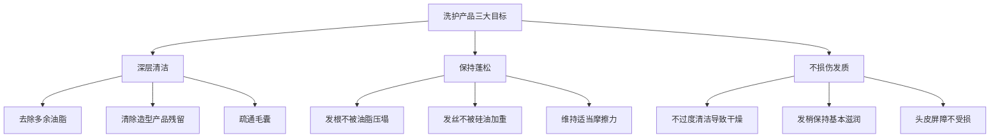
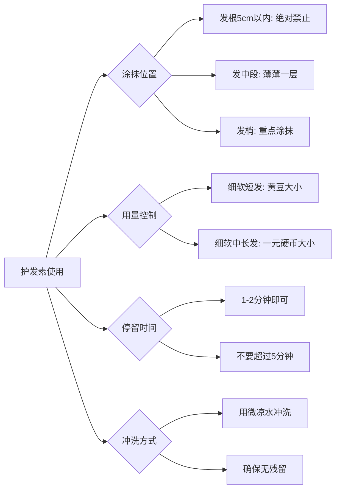
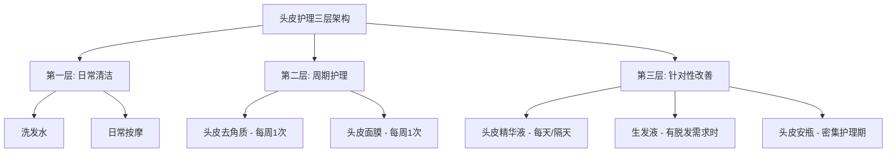

## 一、洗护产品体系

洗护产品是发型管理的地基。很多人把精力全部花在造型产品和吹风技巧上，却忽略了最根本的一环——**你用什么洗头、怎么护理头皮，直接决定了头发的起点状态**。对于细软塌发质来说，洗护选对了，不用造型产品也能有七成蓬松效果；选错了，用再贵的发蜡也救不回来。

本节从头皮生态科学出发，建立完整的洗护产品选购框架，覆盖洗发水、护发素、头皮护理、深层清洁四大品类，并给出从入门到专业的分价位推荐。

### 1.1 头皮生态基础：为什么洗护选品如此重要

#### 头皮是头发的"土壤"

头皮和面部皮肤是同一张皮肤的延伸，但头皮有其独特性：

| 特性 | 头皮 | 面部皮肤 |
|------|------|----------|
| 皮脂腺密度 | 约 400-900 个/cm² | 约 100 个/cm²（T区） |
| 角质层厚度 | 约 1.5mm | 约 0.1mm |
| pH 值 | 4.5-5.5（弱酸性） | 4.5-6.5 |
| 微生物环境 | 马拉色菌为主 | 更多样化 |
| 更新周期 | 约 14-21 天 | 约 28 天 |

头皮的皮脂腺密度是面部T区的4-9倍，这意味着头皮出油量远超面部。对于油性头皮来说，每天分泌的皮脂量可达1-2g，这些油脂会在24-48小时内让头发明显变塌。

#### 油脂分泌的生理机制

皮脂腺的活跃程度主要受以下因素控制：

1. **雄激素水平**：睾酮（Testosterone）在5α-还原酶作用下转化为二氢睾酮（DHT），DHT是刺激皮脂腺分泌的最强信号。这也是为什么男性普遍比女性更容易出油。
2. **温度与湿度**：环境温度每升高1°C，皮脂分泌量增加约10%。夏季出油量比冬季多30-50%。
3. **饮食因素**：高GI食物和乳制品会通过胰岛素样生长因子（IGF-1）间接刺激皮脂分泌。
4. **压力状态**：皮质醇（压力激素）会直接促进皮脂腺活性。

理解这些机制，才能明白为什么洗护产品不能"一刀切"——不同季节、不同生活状态，头皮的出油量会变化，洗护策略也需要随之调整。

#### 洗护产品的核心目标

对于细软塌发质，洗护产品需要同时满足三个看似矛盾的目标：

这三个目标之间的平衡点，就是选购洗护产品的核心逻辑。

### 1.2 洗发水选购指南

#### 1.2.1 看懂成分表：表面活性剂是核心

洗发水90%的功效取决于表面活性剂（Surfactant）的类型和搭配。成分表中排名越靠前的成分含量越高，前五位基本决定了这款洗发水的特性。

**主流表面活性剂对比**：

| 类型 | 代表成分 | 清洁力 | 刺激性 | 冲洗感 | 蓬松效果 | 适合场景 |
|------|---------|--------|--------|--------|----------|----------|
| 硫酸盐类 | SLS（月桂醇硫酸钠）、SLES（月桂醇聚醚硫酸酯钠） | ★★★★★ | ★★★★ | 干涩 | ★★★★★ | 油性头皮深层清洁 |
| 磺基琥珀酸酯类 | 月桂醇磺基琥珀酸酯二钠 | ★★★★ | ★★★ | 清爽 | ★★★★ | 日常清洁，刺激性低于硫酸盐 |
| 氨基酸类 | 月桂酰谷氨酸钠、椰油酰甘氨酸钠 | ★★★ | ★★ | 柔滑 | ★★★ | 敏感头皮，日常使用 |
| 甜菜碱类 | 椰油酰胺丙基甜菜碱 | ★★ | ★ | 滋润 | ★★ | 干性发质，搭配使用 |
| 葡糖苷类 | 癸基葡糖苷、椰油基葡糖苷 | ★★ | ★ | 清爽 | ★★★ | 极度敏感头皮 |

**关键认知**：

- **清洁力强≠好**：SLS清洁力最强，但每周使用超过3次会破坏头皮屏障，导致"越洗越油"的恶性循环——皮脂膜被过度清除后，皮脂腺会代偿性分泌更多油脂。
- **氨基酸≠万能**：氨基酸表活虽然温和，但对于重度油头来说清洁力可能不足，洗完后仍然有油腻残留感。单纯追求"氨基酸"标签而忽略清洁力是常见误区。
- **复配才是王道**：好的洗发水通常会复配2-3种表面活性剂，在清洁力、温和性和使用感之间取得平衡。例如"氨基酸+甜菜碱"的组合既能清洁又不刺激。

#### 1.2.2 功能性成分解读

除了表面活性剂，以下功能性成分决定了洗发水的附加价值：

| 成分 | 作用机制 | 实际效果 | 在成分表中的名称 |
|------|---------|----------|-----------------|
| 水杨酸（Salicylic Acid） | 脂溶性，能渗透进毛囊溶解油脂和角质栓 | 去除头皮屑、疏通毛囊、减少毛囊炎 | Salicylic Acid, BHA |
| 烟酰胺（Niacinamide） | 抑制皮脂腺中脂肪合成酶的活性 | 从源头减少出油量，长期使用效果显著 | Niacinamide, Nicotinamide |
| 吡硫翁锌（ZPT） | 抑制马拉色菌生长 | 去屑效果明确，但浓度需达1%以上 | Zinc Pyrithione |
| 水解角蛋白 | 小分子蛋白质渗透进发丝内部，填补受损空洞 | 增加发丝直径和支撑力 | Hydrolyzed Keratin |
| 咖啡因 | 刺激毛囊周围的血液循环，延长毛发生长期 | 促进头发生长，改善发根健康 | Caffeine |
| 薄荷醇 | 激活皮肤冷觉感受器，产生清凉感 | 促进头皮微循环，使用感清爽 | Menthol, Peppermint Oil |
| PCA锌 | 调节皮脂分泌，抑菌 | 控油+抑菌双重作用 | Zinc PCA |
| 泛醇（维生素B5） | 渗透进发丝，吸附并保持水分 | 增加发丝弹性，改善光泽 | Panthenol, D-Panthenol |

#### 1.2.3 需要避开的成分

| 成分 | 问题 | 替代方案 |
|------|------|----------|
| 聚二甲基硅氧烷（Dimethicone） | 非水溶性硅油，长期积累会让细软发越来越塌、越来越重 | 选无硅油配方，或用水溶性硅油（如PEG修饰硅油） |
| 矿物油（Mineral Oil） | 石油衍生物，在头皮上形成封闭膜，阻碍正常代谢 | 选植物油基底的产品 |
| 甲醛释放剂（如DMDM乙内酰脲） | 释放微量甲醛作为防腐剂，可能刺激头皮 | 选使用苯氧乙醇、山梨酸钾等温和防腐体系的产品 |
| 高浓度酒精（Alcohol Denat. 排名前5） | 短期清爽但长期破坏头皮屏障 | 成分表中排名靠后的低浓度酒精可接受 |

#### 1.2.4 分价位产品推荐

**入门级（30-100元 / 400-600ml）**

适合预算有限、刚开始关注头发护理的人群。这些产品在超市和便利店即可购买，方便补货。

1. **蜂花无硅油生姜洗发水**
   - 价格：约30元/500ml
   - 核心成分：氨基酸+甜菜碱复配表活，生姜提取物
   - 优势：无硅油配方轻盈不压发，性价比极高
   - 局限：控油持久度一般，油头可能需要每天使用
   - 适合：细软发质日常使用，学生党首选

2. **清扬男士活力运动薄荷洗发露**
   - 价格：约50元/500ml
   - 核心成分：ZPT去屑因子，薄荷醇，SLES+甜菜碱复配
   - 优势：清洁力强，去屑效果好，清凉感明显
   - 局限：含SLES，不建议每天使用；含硅油但含量不高
   - 适合：油性头皮、有头屑问题、运动出汗多的人

3. **欧莱雅男士炭爽去油洗发露**
   - 价格：约70元/400ml
   - 核心成分：活性炭、薄荷醇、水杨酸
   - 优势：活性炭吸附油脂效果好，深层清洁感强
   - 局限：清洁力偏强，干性头皮慎用
   - 适合：重度油头、出汗多、需要深层清洁感

4. **海飞丝清爽去油洗发露**
   - 价格：约45元/400ml
   - 核心成分：ZPT、水杨酸
   - 优势：去屑控油双效，品牌成熟配方稳定
   - 局限：硅油含量中等，细软发长期使用可能变塌
   - 适合：油性头皮伴头屑问题

**进阶级（100-250元 / 250-600ml）**

适合已经建立基本洗护意识、愿意为效果多花一些预算的人群。这些产品通常在屈臣氏、天猫旗舰店或专业发廊可以买到。

1. **资生堂惠润柔净洗发露（绿野芳踪）**
   - 价格：约80元/600ml
   - 核心成分：氨基酸表活（月桂酰谷氨酸钠）、绿茶提取物
   - 优势：无硅油、无硫酸盐，温和清洁不紧绷，泡沫细腻
   - 局限：清洁力偏温和，重度油头可能需要洗两遍
   - 适合：细软发质、敏感头皮、追求轻盈感

2. **施华蔻专业BC保丽清爽洁净洗发露**
   - 价格：约120元/250ml
   - 核心成分：微分子清洁技术、薄荷醇、水杨酸
   - 优势：专业沙龙线产品，清洁力和蓬松感兼顾，配方成熟
   - 局限：价格偏高，单次用量较省但总成本不低
   - 适合：油性头皮，追求专业级洗护体验

3. **馥绿德雅控油清爽洗发露**
   - 价格：约150元/200ml
   - 核心成分：巴西人参精华、水杨酸、精油复合物
   - 优势：法国药妆品牌，控油同时养护头皮，香味高级
   - 局限：泡沫较少（氨基酸体系特点），初次使用可能不习惯
   - 适合：注重头皮健康、喜欢药妆品牌的人

4. **箭牌经典控油洗发水（Mane 'n Tail）**
   - 价格：约60元/355ml
   - 核心成分：水解角蛋白、SLES复配
   - 优势：水解角蛋白能增加发丝直径，蓬松感明显；性价比在进阶级中突出
   - 局限：含SLES，需要搭配护发素使用
   - 适合：细软发质追求蓬松，预算敏感但想升级

**专业级（250元以上）**

适合对发型有高要求、愿意长期投入的人群。这些产品通常只在专业发廊或高端渠道销售。

1. **卡诗双重功能洗发水（Specifique Bain Divalent）**
   - 价格：约280元/250ml
   - 核心成分：甘氨酸+水杨酸复合物、薄荷醇
   - 优势：专为油性头皮设计，清洁头皮的同时滋润发梢，实现"分区护理"；蓬松效果持久
   - 局限：价格高，需要配合正确的使用手法才能发挥最大效果
   - 适合：油性头皮+干性发梢的混合型发质，预算充足

2. **摩洛哥油丰盈洗发水（Moroccanoil Extra Volume）**
   - 价格：约260元/250ml
   - 核心成分：摩洛哥坚果油（极少量，不压发）、水解植物蛋白
   - 优势：增加发丝体积感效果显著，香味高级持久
   - 局限：价格高，控油能力一般
   - 适合：细软塌发追求蓬松感，干性或中性头皮

3. **Oribe丰盈蓬松洗发水**
   - 价格：约350元/250ml
   - 核心成分：咖啡因、生物素、植物蛋白复合物
   - 优势：顶级沙龙品牌，蓬松效果和使用感都是天花板级别
   - 局限：价格很高，控油力中等
   - 适合：追求极致体验，预算不受限

#### 1.2.5 洗发水使用技巧

选对产品只是第一步，使用方法同样重要：

1. **预洗很关键**：用37-38°C的温水冲洗头发至少30秒，软化油脂和造型产品残留。水温过高（>42°C）会刺激皮脂腺加速分泌。
2. **先起泡再上头**：将洗发水在手心加少量水搓出泡沫后再涂抹到头发上，避免高浓度洗发水直接接触头皮造成局部刺激。
3. **指腹按摩，不是指甲抓**：用指腹以画小圈的方式按摩头皮2-3分钟，重点区域是发际线、头顶和后脑勺——这三个区域出油最多。
4. **冲洗时间是涂抹时间的2倍**：确保没有残留，残留的表活剂会持续刺激头皮，导致发痒和出油加速。
5. **油头可以洗两遍**：第一遍快速清洗去除表面油脂（30秒），第二遍让洗发水停留1-2分钟让功能性成分发挥作用。但不建议每天都洗两遍，一周2-3次即可。
6. **交替使用不同洗发水**：准备2-3款不同清洁力的洗发水交替使用，避免头皮对单一成分产生耐受。例如日常用氨基酸款，每周1-2次用清洁力更强的款。

### 1.3 护发素使用体系

#### 1.3.1 护发素的工作原理

护发素的核心成分是**阳离子表面活性剂**（如西曲氯铵、鲸蜡硬脂醇），它们带正电荷，而受损的头发表面带负电荷，正负相吸，护发素就会吸附在发丝表面，形成一层薄膜。这层膜的作用是：

- 闭合翘起的毛鳞片，减少毛躁
- 在发丝表面形成润滑层，减少摩擦和静电
- 填补发丝表面的微小缺损，增加光泽

但对于细软塌发来说，这层膜也是把双刃剑——涂多了或涂错位置，头发就会变得油腻、沉重、没有支撑力。

#### 1.3.2 细软发质的护发素使用原则

**关键原则**：

1. **距离发根至少5cm**：发根本身就有皮脂滋润，不需要额外的护发素。涂在发根附近会直接压塌头发的支撑力。
2. **细软发质选轻盈型**：避免"深层修复""极度滋润"字样的产品，选"轻盈""蓬松""控油"系列。
3. **停留1-2分钟即可**：护发素不是停留越久越好，超过5分钟后效果不会增加，反而增加残留风险。
4. **用微凉水做最后冲洗**：冷水能帮助毛鳞片更好地闭合，增加光泽感。不需要冰水，比体温低几度的微凉水即可。
5. **每周1-2次免洗护发素**：在半干的发梢涂少量免洗护发素，比每次洗头都用冲洗型护发素更轻盈。

#### 1.3.3 护发素 vs 发膜 vs 免洗护发素

| 类型 | 质地 | 使用频率 | 停留时间 | 适合场景 | 对细软发的影响 |
|------|------|----------|----------|----------|---------------|
| 冲洗型护发素 | 乳液状 | 每次洗头 | 1-3分钟 | 日常基础护理 | 用量控制好就没问题 |
| 发膜（深层护理） | 膏状，更厚重 | 每周1次 | 5-15分钟 | 受损发质修复 | 细软发慎用，容易过重 |
| 免洗护发素 | 喷雾或轻乳液 | 每天或需要时 | 不冲洗 | 日常防毛躁、防静电 | 最轻盈，细软发友好 |
| 头发精油 | 油状 | 发梢需要时 | 不冲洗 | 极度干燥的发梢 | 只用在发梢末端 |

#### 1.3.4 护发素产品推荐

**入门级**：
1. **资生堂惠润护发素**（约60元/600ml）—— 轻盈不油腻，无硅油配方，细软发日常首选
2. **蜂花无硅油护发素**（约20元/500ml）—— 性价比之王，基础滋润够用

**进阶级**：
1. **施华蔻专业BC保丽护发素**（约130元/250ml）—— 修复受损，增加弹性，沙龙级质感
2. **馥绿德雅滋养修护护发素**（约160元/150ml）—— 植物精华配方，温和滋润不压发

**专业级**：
1. **卡诗双重功能护发素**（约300元/200ml）—— 与同系列洗发水搭配使用，分区护理效果最佳
2. **摩洛哥油轻盈护发素**（约250元/250ml）—— 蓬松型护发素的标杆产品

### 1.4 头皮护理产品体系

头皮护理是很多人忽略的环节，但它是决定头发长期健康的关键。面部护肤有多精致，头皮护理就应该有多认真。

#### 1.4.1 头皮护理的三层架构

#### 1.4.2 头皮去角质

头皮和面部一样需要定期去角质。头皮的角质更新周期约14-21天，如果老废角质不能正常脱落，就会与皮脂混合形成"头皮垢"，堵塞毛囊，影响头发健康。

**去角质方式对比**：

| 类型 | 原理 | 使用频率 | 适合人群 | 注意事项 |
|------|------|----------|----------|----------|
| 物理磨砂 | 用颗粒（盐、糖、核桃壳粉等）摩擦去除角质 | 每周1次 | 角质层较厚的健康头皮 | 力度要轻，避免划伤头皮 |
| 化学溶解 | 用水杨酸、果酸等溶解角质连接 | 每周1-2次 | 敏感头皮、有头屑问题 | 浓度从低开始建立耐受 |
| 酶解法 | 用蛋白酶分解角质蛋白 | 每1-2周1次 | 极度敏感的头皮 | 最温和但效果最慢 |

**推荐产品**：

1. **Lush海洋水晶头皮磨砂膏**（约120元/100g）—— 海盐颗粒+薄荷精油，物理磨砂，清洁感强烈，使用后头皮会有明显的"会呼吸"的感觉。适合健康油性头皮。
2. **Christophe Robin海盐头皮磨砂霜**（约280元/250ml）—— 专业级头皮磨砂，海盐颗粒细腻均匀，添加甜杏仁油避免过度干燥。发廊级体验。
3. **The Ordinary水杨酸头皮精华**（约80元/60ml）—— 化学去角质路线，2%水杨酸浓度，温和溶解头皮角质和油脂栓。适合不想用物理磨砂的人。

#### 1.4.3 头皮精华液

头皮精华液是头皮护理中最值得投入的品类。它类似于面部精华液，含有高浓度的活性成分，能针对性地改善头皮问题。

**核心功效成分与选择逻辑**：

| 头皮问题 | 推荐成分 | 代表产品 |
|----------|----------|----------|
| 出油过多 | 烟酰胺、PCA锌、水杨酸 | 柳屋生发液绿瓶、馥绿德雅控油精华 |
| 头皮敏感发痒 | 红没药醇、甘草酸二钾 | 薇姿DS去屑舒缓精华 |
| 脱发稀疏 | 咖啡因、米诺地尔、锯棕榈 | 落健（Rogaine）、Alpecin咖啡因精华 |
| 头皮屑多 | 吡罗克酮乙醇胺盐、酮康唑 | 康王酮康唑洗剂（药用） |
| 头皮长痘/毛囊炎 | 茶树精油、水杨酸 | The Body Shop茶树头皮精华 |

**推荐产品详解**：

1. **柳屋生发液（Yanagiya Hair Tonic）**
   - 价格：约80元/240ml
   - 核心成分：人参提取物、苦参提取物、薄荷醇、泛醇
   - 功效：促进头皮血液循环，强健发根，有一定控油效果
   - 使用方法：洗头后在半干的头皮上喷涂或涂抹，轻轻按摩至吸收，不需要冲洗
   - 适合：日常头皮保养，发根不牢固的人
   - 注意：绿瓶（清凉型）适合油头，黄瓶（滋润型）适合干性头皮

2. **Alpecin咖啡因液体C1**
   - 价格：约100元/200ml
   - 核心成分：高浓度咖啡因、烟酰胺、锌
   - 功效：咖啡因能刺激毛囊活性，延长毛发生长期，减缓雄激素性脱发的进程
   - 使用方法：每天使用，涂在头皮上按摩，不冲洗
   - 适合：有早期脱发迹象、发际线后移、头顶稀疏的人
   - 注意：这是辅助产品，不能替代药物治疗。如果脱发严重，应就医

3. **馥绿德雅5号精油（Complexe 5）**
   - 价格：约280元/50ml
   - 核心成分：巴西人参精华、迷迭香精油、薰衣草精油
   - 功效：深层净化头皮、促进微循环、强健发根
   - 使用方法：每周1-2次，洗头前涂在干燥头皮上按摩5分钟，然后正常洗头
   - 适合：头皮状态不佳、需要密集调理的人
   - 注意：精油类质地，使用后需要认真清洗

#### 1.4.4 头皮按摩：零成本的护理方式

产品之外，头皮按摩是最容易被忽视但效果确切的护理方式。研究表明，每天4分钟的头皮按摩，持续24周后，头发直径会显著增加。

**正确按摩手法**：

1. **十指张开**，用指腹（绝对不是指甲）贴住头皮
2. **从发际线开始**，向头顶方向以小圆圈方式按压移动
3. **覆盖整个头皮**：前额→两侧→耳后→后脑勺→头顶
4. **力度适中**：能感觉到头皮在手指下微微移动即可，不需要用力按压
5. **配合产品时**：在涂抹头皮精华液后按摩，帮助活性成分渗透

**推荐工具**：

- **手动头皮按摩器**（10-30元）：硅胶齿梳形，洗头时使用，比手指更省力
- **电动头皮按摩器**（50-150元）：振动+旋转，适合懒人，但注意不要在湿手时使用充电款

### 1.5 深层清洁产品

#### 1.5.1 为什么需要深层清洁

日常洗发水能去除大部分皮脂和灰尘，但有些残留物是普通洗发水难以清除的：

- **造型产品残留**：发蜡、发泥、干洗喷雾中的聚合物成分
- **硬水矿物质**：水质较硬的地区，钙镁离子会在头发上形成沉积
- **硅油积累**：长期使用含硅油护发素/洗发水，非水溶性硅油会层层叠加
- **环境污染颗粒**：PM2.5等微粒会附着在头发和头皮上

这些残留积累后，头发会变得"洗不干净"——洗完还是感觉沉重、油腻、没有生气。这时候就需要深层清洁产品。

#### 1.5.2 深层清洁产品类型

| 类型 | 原理 | 使用频率 | 适合场景 |
|------|------|----------|----------|
| 澄清洗发水（Clarifying Shampoo） | 高浓度硫酸盐+螯合剂，强力去残留 | 每1-2周1次 | 造型产品用户、硬水地区 |
| 头皮清洁液 | 酸性配方溶解矿物质沉积 | 每2周1次 | 硬水地区 |
| ACV冲洗（苹果醋冲洗） | 弱酸性闭合毛鳞片，去除矿物质 | 每周1次 | 天然护理爱好者 |
| 黏土面膜 | 高岭土/膨润土吸附油脂和杂质 | 每周1次 | 油性头皮深层清洁 |

**推荐产品**：

1. **Neutrogena Anti-Residue澄清洗发水**（约60元/250ml）—— 深层清洁的经典产品，去除90%以上的造型产品残留，每月用1-2次即可。注意：用后必须搭配护发素，因为清洁力很强。
2. **Malibu C硬水去矿物质护理包**（约150元/12包）—— 维生素C粉末溶解硬水矿物质，适合水质硬的地区。使用方式：将粉末倒在湿发上按摩，停留5分钟冲洗。

**DIY苹果醋冲洗配方**：

- 苹果醋（有机未过滤）：1份
- 温水：3-4份
- 混合后在洗发后倒在头发上，停留1-2分钟后冲洗
- 醋味会在头发干燥后消散
- 不建议在同一天使用护发素，两者功效重叠

### 1.6 干洗喷雾：油头的应急方案

干洗喷雾不是"不洗头的借口"，而是合理的应急工具。在以下场景中，干洗喷雾能帮大忙：

- 早上时间紧急来不及洗头
- 中午头发出油影响形象
- 运动后需要快速恢复清爽
- 旅途中不方便洗头

**工作原理**：干洗喷雾的核心成分是**多孔粉末**（如稻米淀粉、玉米淀粉、硅石），这些粉末能吸附头发上的油脂，让头发恢复哑光质感和蓬松感。

**使用技巧**：

1. 距离头皮15-20cm喷涂
2. 喷完后等待30秒让粉末充分吸附油脂
3. 用手指或梳子将白色粉末揉散/梳匀
4. 不要喷太多——少量多次比一次喷很多效果好

**推荐产品**：

1. **碧缇丝干洗喷雾（Batiste）**（约40元/200ml）—— 干洗喷雾的代名词，性价比高，味道选择多，控油效果好
2. **施华蔻got2b干洗喷雾**（约50元/200ml）—— 粉末更细腻，不留明显白色残留

**注意事项**：干洗喷雾不能替代真正的洗头。它是"续命"工具，不是"替代品"。使用干洗喷雾后，当天晚上或第二天一定要正常洗头，否则粉末残留会堵塞毛囊。

### 1.7 洗护产品搭配方案

单个产品选对还不够，不同产品之间的搭配也会影响最终效果。以下是针对不同场景的搭配建议：

| 场景 | 洗发水 | 护发素 | 头皮护理 | 额外建议 |
|------|--------|--------|----------|----------|
| 日常通勤 | 氨基酸温和款 | 轻盈型，只涂发梢 | 头皮精华液（隔天） | 2-3天洗一次头 |
| 运动后 | 清洁力较强的款 | 免洗护发素 | 可省略 | 当天必须洗头 |
| 使用造型产品后 | 先用普通洗发水洗一遍，再用深层清洁款 | 修复型护发素 | 涂头皮精华 | 每周1次深层清洁 |
| 头皮状态不佳 | 含水杨酸的药用洗发水 | 不用或极少量 | 头皮安瓶密集护理 | 如持续不好转应就医 |
| 旅行/出差 | 便携装洗发水+干洗喷雾 | 免洗护发素喷雾 | 可省略 | 酒店洗发水尽量别用 |

### 1.8 季节性调整策略

头皮的出油量随季节变化明显，洗护策略也应该随之调整：

| 季节 | 头皮状态 | 洗发水选择 | 护发素调整 | 特殊注意 |
|------|----------|-----------|-----------|----------|
| 春季 | 出油开始增加，换季敏感 | 从温和型过渡到中等清洁力 | 减少用量 | 注意花粉过敏导致的头皮痒 |
| 夏季 | 出油高峰，出汗多 | 清洁力较强的控油型 | 只在发梢用少量 | 可能需要每天洗头，正常 |
| 秋季 | 出油减少，头皮开始干燥 | 回到温和型 | 适当增加用量 | 换季掉发增多是正常现象 |
| 冬季 | 出油最少，干燥起静电 | 最温和的氨基酸型 | 可以用稍滋润的 | 室内暖气会加重干燥 |

### 1.9 常见误区与纠正

**误区一："无硅油洗发水一定比含硅油的好"**

纠正：无硅油不等于更好，含硅油不等于有害。硅油的作用是在发丝表面形成保护膜，减少摩擦和损伤。对于粗硬发质或染烫受损发质，适量硅油是有益的。真正的问题在于**非水溶性硅油的长期积累**——如果你用的洗发水含有清洁力足够的表面活性剂，硅油残留是可以被清除的。细软塌发质选择无硅油或水溶性硅油产品是合理的，但不必妖魔化所有含硅油产品。

**误区二："洗发水要经常换，不然头皮会产生耐受"**

纠正：这个说法有一定道理但被过度解读了。正确的做法是根据头皮状态灵活调整，而不是为了换而换。如果当前洗发水用得好好的，没有必要刻意更换。但如果你发现同一款洗发水用了几个月后效果变差了，可能是因为季节变化导致头皮状态改变，这时候确实应该调整。

**误区三："头皮出油就要用强力去油洗发水"**

纠正：过度清洁会刺激皮脂腺代偿性分泌更多油脂，形成"越洗越油"的恶性循环。正确做法是日常用温和型洗发水，每周1-2次用清洁力较强的深层清洁产品。同时配合控油类头皮精华液，从根源调节皮脂分泌。

**误区四："护发素会让头发变塌所以不用"**

纠正：完全不用护发素会导致发梢干燥、毛鳞片翘起、头发毛躁——这些同样会影响发型效果。正确做法是选轻盈型护发素，只涂在发梢，控制用量，彻底冲洗。

**误区五："天然/植物成分一定比化学成分安全"**

纠正：成分的安全性和它是"天然"还是"合成"没有必然关系。很多天然植物精油（如薄荷精油、茶树精油）浓度过高时反而会刺激皮肤。选择产品应该看配方的整体设计和实际效果，而不是被"纯天然"的营销话术左右。

### 1.10 购买渠道与省钱策略

| 渠道 | 优势 | 劣势 | 适合购买 |
|------|------|------|----------|
| 超市/便利店 | 方便、即买即用 | 品牌有限，价格偏高 | 入门级产品应急补货 |
| 屈臣氏/万宁 | 可试用、有促销 | 专业线品牌少 | 进阶级产品 |
| 天猫/京东旗舰店 | 品牌齐全、有大促 | 需辨别真假 | 所有产品，大促囤货 |
| 发廊/沙龙 | 专业推荐、可试用 | 价格最高 | 专业级产品，第一次购买时 |
| 海淘/代购 | 价格优惠、品类丰富 | 物流慢、退换麻烦 | 国内不好买的专业品牌 |

**省钱技巧**：

1. **关注大促节点**：618、双11、品牌日活动，洗护产品通常有5-7折优惠，是囤货的最佳时机
2. **买大容量装**：同品牌的大容量（500ml+）单位价格通常比小容量便宜30-50%
3. **善用小样/旅行装试错**：不确定是否适合自己的产品，先买小样试用，避免浪费
4. **护发素比洗发水消耗慢**：不需要同品牌同规格买，护发素可以买小一号的
5. **干洗喷雾是性价比最高的投资**：一瓶40元的干洗喷雾可以用2-3个月，帮你减少洗头频率，间接省下洗发水用量

***

**本节小结**：洗护产品体系的核心逻辑是**"先了解自己的头皮，再选择对应的产品"**。没有万能的洗发水，只有适合你当前头皮状态的洗发水。建议从入门级产品开始尝试，逐步了解自己的头皮特性和偏好，再有针对性地升级到更专业的产品。记住，正确的使用方法比产品本身更重要——再贵的洗发水，用错了方法也白搭。
