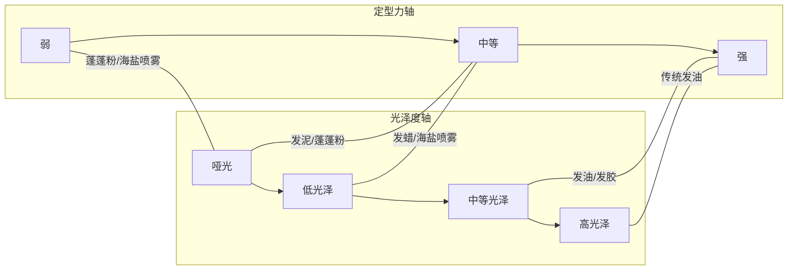
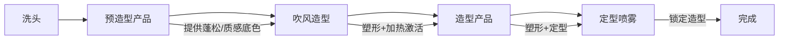

## 二、造型产品体系

造型产品是将"吹好"的发型固定并赋予质感的关键一步。选错产品轻则造型两小时就塌，重则堵塞毛囊引发头皮问题。本章从产品分类原理讲起，逐类给出成分解析、适用场景、推荐清单和实操手法，确保你能根据自己的发质和目标造型精准选品。

### 2.1 造型产品分类总览

#### 2.1.1 按基质体系分类

造型产品的核心差异在于基质（base）——它决定了产品的质感、定型力、光泽度和清洗难度：

| 基质类型 | 代表产品 | 特征 | 清洗方式 |
|----------|----------|------|----------|
| 水基（Water-based） | 水基发蜡、水基发油 | 易清洗、不残留、定型力中等 | 清水可洗 |
| 油基（Oil-based） | 传统发油、油基发泥 | 定型力强、光泽高、难清洗 | 需要强力洗发水 |
| 蜡基（Wax-based） | 发蜡、发泥 | 可塑性强、哑光或低光泽 | 温水+洗发水 |
| 聚合物基 | 发胶、定型喷雾 | 成膜定型、硬壳感 | 清水或梳开 |
| 粉末基 | 蓬蓬粉、纹理粉 | 吸油蓬松、无定型力 | 清水即可 |

#### 2.1.2 核心产品对比矩阵

| 产品类型 | 定型力 | 光泽度 | 质感 | 适合发型 | 清洗难度 | 适合发质 |
|----------|--------|--------|------|----------|----------|----------|
| 发蜡 | 中-强 | 哑光-中等 | 柔软可重塑 | 纹理碎盖、侧分 | 容易 | 各种发质 |
| 发泥 | 中-强 | 哑光 | 干涩有抓力 | 纹理前刺、凌乱感 | 容易 | 细软-中等 |
| 发油 | 弱-强 | 中-高光泽 | 顺滑 | 背头、侧分、油头 | 较难-难 | 中等-粗硬 |
| 发胶 | 强 | 中-高 | 硬壳 | 需要全天固定的场合 | 容易 | 各种发质 |
| 定型喷雾 | 中-强 | 低-中 | 轻薄 | 辅助固定 | 容易 | 各种发质 |
| 发蜡泥 | 中-强 | 哑光 | 干涩可塑 | 纹理、层次感造型 | 容易 | 细软-中等 |
| 蓬蓬粉 | 弱 | 哑光 | 粉状 | 增加发根蓬松度 | 非常容易 | 细软塌 |
| 海盐喷雾 | 弱-中 | 哑光 | 干涩纹理 | 海滩风、自然纹理 | 容易 | 各种发质 |
| 发蜡膏 | 中 | 低-中 | 膏状滋润 | 自然纹理、日常 | 容易 | 中等-粗硬 |
| 摩丝 | 弱-中 | 低 | 泡沫状 | 打底蓬松 | 容易 | 细软塌 |

### 2.2 发蜡：最万能的造型产品

发蜡是男士造型的第一选择，因为它兼具可塑性和自然感，几乎所有日常发型都能用发蜡完成。

#### 2.2.1 发蜡的成分与原理

发蜡的基质通常是蜡（蜂蜡、小烛树蜡）+ 油脂 + 乳化剂的组合。蜡提供可塑性和定型力，油脂提供顺滑感和光泽度，乳化剂让产品容易涂抹。

关键成分解读：

| 成分 | 作用 | 常见来源 |
|------|------|----------|
| 蜂蜡 | 定型力、可塑性 | 天然蜂蜡 |
| 小烛树蜡 | 硬度更高、哑光感 | 植物蜡 |
| 矿物油 | 顺滑、光泽 | 石油提取 |
| 椰子油衍生物 | 滋润、易涂抹 | 天然油脂 |
| 高岭土 | 吸油、哑光 | 天然矿物 |
| 聚合物（PVP/VP） | 定型、抗湿 | 化学合成 |

#### 2.2.2 发蜡推荐清单

**入门级（30-80元）——试错成本低，适合找到自己的偏好**

| 产品 | 价格 | 定型力 | 光泽度 | 核心特点 | 最佳搭配 |
|------|------|--------|--------|----------|----------|
| 施华蔻酷印持久发蜡 | ~45元/75ml | 中 | 哑光 | 性价比标杆，易上手不翻车 | 纹理碎盖 |
| 杰士派造型发蜡（哑光款） | ~35元/80g | 中 | 哑光 | 日本配方，哑光效果细腻 | 自然哑光纹理 |
| 欧莱雅男士哑光发蜡 | ~55元/75ml | 中 | 哑光 | 清洗容易，不残留不闷痘 | 油性头皮日常 |
| Gatsby Moving Rubber（灰色） | ~50元/75g | 中 | 哑光 | 日本国民级发蜡，质地柔软 | 纹理碎盖入门 |

> **入门建议**：第一次买发蜡，选哑光款，定型力中等。哑光最不容易出错，中等定型力可塑性强，做错了还能重新来。

**进阶级（80-200元）——质感和持久度明显提升**

| 产品 | 价格 | 定型力 | 光泽度 | 核心特点 | 最佳搭配 |
|------|------|--------|--------|----------|----------|
| Brylcreem布莱克雷发蜡 | ~100元/75ml | 中 | 中等 | 英国百年品牌，质感细腻如奶油 | 侧分纹理、商务 |
| Gatsby哑光发蜡（粉色） | ~65元/75g | 中-强 | 哑光 | 哑光效果极致，纹理感强 | 纹理碎盖、前刺 |
| Morris Motley Clay | ~150元/100g | 强 | 哑光 | 澳洲手工品牌，发蜡泥质地 | 需要强定力的哑光造型 |
| Kevin Murphy Night Rider | ~160元/100g | 中-强 | 哑光 | 沙龙品牌，质感高级不油腻 | 精致纹理 |

**专业级（200元以上）——配方和体验有质的飞跃**

| 产品 | 价格 | 定型力 | 光泽度 | 核心特点 | 最佳搭配 |
|------|------|--------|--------|----------|----------|
| Hanz de Fuko Claymation | ~200元/56g | 强 | 哑光 | 发泥+发蜡混合体，定型力天花板 | 强力哑光造型 |
| By Vilain Gold Digger | ~180元/65ml | 强 | 中等 | 丹麦品牌，质感高级如丝绸 | 精致背头、侧分 |
| O'Douds Matte Paste | ~220元/113g | 强 | 哑光 | 天然成分，手工小批量 | 环保主义者首选 |
| Arcadian Matte Paste | ~150元/96g | 强 | 哑光 | 定型力强，哑光极致 | 纹理前刺、层次造型 |

#### 2.2.3 发蜡使用手法

正确的上蜡手法直接决定造型成败：

1. **取量**：黄豆大小（约0.5-1g），宁少勿多，不够再加
2. **搓热**：双手掌心搓开，直到产品变成透明薄膜、完全无颗粒感
3. **上发**：从后往前、从下往上，先抓发根再带发梢
4. **造型**：用手指抓出纹理，不要用梳子——梳子会让发蜡分布太均匀，失去层次感
5. **定型**：最后用定型喷雾距离20-30cm轻喷一层

> **常见错误**：取太多 → 头发变成一绺一绺的"油条"。补救方法：用吹风机热风吹30秒，蜡会重新软化，再用手指分散开。

### 2.3 发泥：哑光纹理的极致

发泥的质地比发蜡更干、更有"抓力"，是追求极致哑光和纹理感的首选。

#### 2.3.1 发泥 vs 发蜡的本质区别

| 维度 | 发蜡 | 发泥 |
|------|------|------|
| 质地 | 柔软、油润 | 干涩、有颗粒感 |
| 光泽 | 可高可低 | 几乎全是哑光 |
| 可塑性 | 可反复调整 | 定型后不易重塑 |
| 适合场景 | 需要光泽的造型 | 纹理、凌乱、层次感 |
| 适合发质 | 各种发质 | 细软发质效果更好 |
| 用量 | 较少 | 需要稍多 |

#### 2.3.2 发泥推荐清单

**入门级（30-60元）**

| 产品 | 价格 | 定型力 | 核心特点 |
|------|------|--------|----------|
| 杰士派造型发泥 | ~40元/80g | 中-强 | 哑光效果好，价格实惠 |
| 施华蔻酷印哑光发泥 | ~50元/75ml | 中 | 易清洗，不油腻不闷痘 |
| Gatsby Styling Clay（紫色） | ~50元/75g | 中-强 | 日本经典，哑光纹理感强 |

**进阶级（80-200元）**

| 产品 | 价格 | 定型力 | 核心特点 |
|------|------|--------|----------|
| Arcadian Matte Paste | ~150元/96g | 强 | 专业级哑光发泥天花板 |
| Morris Motley Clay | ~150元/100g | 强 | 手工制作，质感细腻 |
| Hanz de Fuko Quicksand | ~180元/56g | 中-强 | 含微粉颗粒，增加摩擦力和纹理 |

**专业级（200元以上）**

| 产品 | 价格 | 定型力 | 核心特点 |
|------|------|--------|----------|
| Hanz de Fuko Claymation | ~200元/56g | 强 | 发蜡泥混合体，定型力天花板 |
| O'Douds Clay Pomade | ~220元/113g | 强 | 天然成分，哑光高定力 |
| Shear Revival Northern Lights | ~230元/96g | 中-强 | 手工品牌，质感高级 |

#### 2.3.3 发泥使用要点

发泥的使用手法和发蜡有关键区别：

1. **不需要搓热**：发泥搓热会变得太软，失去干涩的抓力。直接从罐子里取出，用指尖捏碎
2. **干发使用**：发泥必须在完全干透的头发上使用。湿发上泥，效果大打折扣
3. **抓的手法**：用指尖"捏"而不是手掌"抹"。捏出的纹理更分明
4. **少量多次**：每次取米粒大小，分布到不同区域，不够再加

### 2.4 发油：经典绅士的武器

发油（Pomade）是历史最悠久的男士造型产品，从20世纪初的美国理发馆到今天的复古造型圈，发油一直是打造背头、油头、侧分的首选。

#### 2.4.1 发油的分类

发油按基质分为三大类，清洗难度和使用体验完全不同：

| 类型 | 基质 | 光泽 | 定型力 | 清洗难度 | 代表产品 |
|------|------|------|--------|----------|----------|
| 油基发油 | 凡士林/矿物油 | 高光泽 | 强，可叠加 | 非常难（需要专门清洗） | Murray's、Dax |
| 水基发油 | 水+聚合物 | 中-高光泽 | 中-强 | 容易（清水可洗） | Suavecito、Uppercut |
| 混合基发油 | 油+水混合 | 中等光泽 | 中-强 | 中等 | O'Douds、Shear Revival |

> **新手建议**：从水基发油开始。油基发油虽然经典，但洗不干净会让你的枕头变成"油布"，而且连续使用可能导致毛囊堵塞。

#### 2.4.2 发油推荐清单

**入门级（40-100元）——水基为主，容易清洗**

| 产品 | 价格 | 定型力 | 光泽 | 核心特点 |
|------|------|--------|------|----------|
| Suavecito Original | ~60元/113g | 中-强 | 中-高 | 水基发油标杆，古龙香味 |
| Uppercut Deluxe Pomade | ~80元/100g | 中-强 | 中 | 澳洲品牌，质感顺滑 |
| 杰士派发油 | ~40元/80g | 中 | 中 | 日本入门款，性价比高 |
| Layrite Superhold | ~90元/120g | 强 | 中 | 强力水基，适合粗硬发 |

**进阶级（100-200元）——质感和配方升级**

| 产品 | 价格 | 定型力 | 光泽 | 核心特点 |
|------|------|--------|------|----------|
| Reuzel Blue | ~120元/113g | 强 | 高 | 荷兰品牌，理发店御用 |
| Morris Motley Pomade | ~160元/100g | 中 | 中 | 手工品牌，质感高级 |
| O'Douds Traditional Pomade | ~150元/113g | 中-强 | 中 | 天然成分油基，好清洗 |
| Shear Revival Crystal Lake | ~170元/96g | 中 | 中-高 | 水基顶级，奶油质地 |

**专业级（200元以上）——顶级配方和使用体验**

| 产品 | 价格 | 定型力 | 光泽 | 核心特点 |
|------|------|--------|------|----------|
| Goon Grease | ~250元/113g | 强 | 高 | 油基天花板，定型力无敌 |
| Lockhart's Heavy Hold | ~220元/103g | 强 | 高 | 传统油基，理发师最爱 |
| Nostalgic Grooming SWB | ~240元/96g | 中 | 中 | 手工超限量，收藏级 |

#### 2.4.3 发油使用手法

发油的使用和其他产品完全不同，核心是"湿发造型"：

1. **洗完头后擦至半干**：头发微微潮湿但不滴水
2. **取一指节量**：掌心搓开，从前往后涂抹
3. **用梳子定型**：发油是唯一推荐用梳子的产品——宽齿梳或油头梳，从前往后梳出纹路
4. **二次叠加**：第一层干透后，可以上第二层增加光泽和定型力（油基发油的优势）
5. **定型喷雾**：水基发油建议喷一层定型喷雾延长持久度

### 2.5 发胶与定型喷雾

#### 2.5.1 发胶（Gel）vs 定型喷雾（Spray）的区别

很多人混淆这两种产品，但它们的用途完全不同：

| 维度 | 发胶 | 定型喷雾 |
|------|------|----------|
| 使用阶段 | 造型过程中 | 造型完成后 |
| 作用 | 塑造形状+定型 | 固定已经完成的造型 |
| 质地 | 透明凝胶 | 细雾喷雾 |
| 定型力 | 非常强 | 中-强 |
| 触感 | 干后硬壳 | 轻薄无感 |
| 适合场景 | 需要超强固定的场合 | 日常辅助定型 |
| 缺点 | 干后变白、碎屑、不可重塑 | 单独使用定型力不足 |

#### 2.5.2 发胶推荐

发胶在现代造型中使用频率已大幅下降，但在婚礼、演出等需要全天固定的场合仍有不可替代性。

| 产品 | 价格 | 定型力 | 核心特点 |
|------|------|--------|----------|
| 杰士派发胶 | ~35元/250g | 强 | 价格低，定型力强，日常够用 |
| 施华蔻酷印发胶 | ~45元/250ml | 强 | 不泛白，清洗相对容易 |
| Got2b Glued | ~60元/150ml | 极强 | "钉子"级别定型，风吹不动 |
| Gorilla Snot（大猩猩鼻涕） | ~50元/300g | 极强 | 定型力变态强，适合舞台 |

> **发胶使用警告**：长期使用发胶会导致头发变干变脆。发胶中的酒精成分会蒸发头发水分。建议只在特殊场合使用，日常造型用发蜡/发泥+定型喷雾。

#### 2.5.3 定型喷雾推荐

定型喷雾是"最后一步"，它的作用不是塑形，而是锁住你已经做好的造型。

**入门级（30-60元）**

| 产品 | 价格 | 定型力 | 核心特点 |
|------|------|--------|----------|
| 施华蔻酷印定型喷雾 | ~45元/250ml | 中 | 性价比标杆，不僵硬 |
| 杰士派定型喷雾 | ~40元/180g | 中 | 日本品牌，定型自然 |
| 杰士派定型喷雾（强力款） | ~45元/180g | 强 | 强力定型，适合需要持久的场合 |

**进阶级（60-150元）**

| 产品 | 价格 | 定型力 | 核心特点 |
|------|------|--------|----------|
| TIGI定型喷雾 | ~120元/300ml | 强 | 沙龙品牌，定型力强且不僵硬 |
| Sebastian Shaper Plus | ~130元/400ml | 中-强 | 可重塑型喷雾，喷后还能用手指调整 |
| Gatsby定型喷雾 | ~55元/250g | 中 | 日本配方，自然不僵 |

**专业级（150元以上）**

| 产品 | 价格 | 定型力 | 核心特点 |
|------|------|--------|----------|
| Oribe Dry Texturizing Spray | ~280元/300ml | 中 | 顶级品牌，喷完有蓬松纹理感 |
| Kenra Volume Spray 25 | ~200元/550ml | 强 | 沙龙销量冠军，强定力不黏腻 |
| Moroccanoil Luminous Hairspray | ~200元/330ml | 中 | 含摩洛哥坚果油，定型同时护发 |

#### 2.5.4 定型喷雾使用技巧

1. **距离**：保持20-30cm，太近会湿一块、定型不均匀
2. **用量**：短发2-3下，中发4-5下，不要一次喷太多
3. **手法**：边喷边用手调整形状，趁湿塑形
4. **方向**：先从上往下喷顶部，再从侧面喷鬓角和后脑
5. **层级喷法**：先喷一层→等10秒→用手指调整→再喷一层，比一次喷大量效果好得多

### 2.6 蓬松类产品：细软塌发的救星

对于头发细软、容易塌的人来说，蓬松类产品是造型前的"基础工程"。

#### 2.6.1 蓬蓬粉（Texture Powder）

蓬蓬粉是细软塌发最直接的救星，原理很简单：粉末颗粒吸附在发丝表面，增加发丝之间的摩擦力，从而让头发"撑"起来。

**成分原理**：主要成分是二氧化硅微粉或淀粉类粉末，颗粒直径在5-50微米之间。这个尺寸刚好能附着在发丝表面而不刺激头皮。

| 产品 | 价格 | 容量 | 核心特点 |
|------|------|------|----------|
| 施华蔻蓬蓬粉 | ~60元 | 10g | 国内最容易买到，效果稳定 |
| 杰士派蓬蓬粉 | ~45元 | 10g | 日本配方，粉末更细腻 |
| OSIS+ Dust It | ~100元 | 10g | 德国施华蔻专业线，效果强 |
| By Vilain Blow | ~150元 | 15g | 丹麦品牌，定型+蓬松二合一 |

**使用手法**：
1. 瓶口对准发根，轻轻挤瓶身，让粉末落到发根（不是"倒"上去）
2. 用指尖揉搓发根区域，让粉末均匀分布
3. 用手指向上提拉发根，制造蓬松感
4. 最后用定型喷雾固定

> **注意**：蓬蓬粉用量过大会让头发变得干涩粗糙，摸起来像沙子。每次用量控制在一小撮（约0.2-0.5g）。

#### 2.6.2 海盐喷雾（Sea Salt Spray）

海盐喷雾模拟海边风吹后头发自然干燥的效果——干燥、有纹理、微微凌乱。

**成分原理**：主要成分是水+海盐+聚合物。海盐吸收头发水分，让发丝变干变硬，产生自然的纹理感。聚合物提供轻微定型力。

| 产品 | 价格 | 容量 | 核心特点 |
|------|------|------|----------|
| Bumble and Bumble Surf Spray | ~180元 | 125ml | 海盐喷雾鼻祖，效果自然 |
| Bumble and Bumble Surf Infusion | ~200元 | 125ml | 含油分，干燥感更柔和 |
| By Vilain Ocean Spray | ~120元 | 200ml | 丹麦品牌，纹理感强 |
| 施华蔻海盐喷雾 | ~50元 | 150ml | 入门首选，性价比高 |
| Got2b Powderful Volumizing | ~40元 | 200ml | 超市开架，蓬松效果好 |

**使用手法**：
1. 湿发或干发均可——湿发效果更自然，干发效果更明显
2. 距离头发15-20cm喷洒，重点喷发根和发中段
3. 用手指抓捏发丝，制造纹理
4. 自然风干或用吹风机低温吹干（吹风机用扩散风嘴效果更好）

#### 2.6.3 摩丝（Mousse）

摩丝曾是80-90年代的主流造型产品，在现代造型中它退居为"打底产品"——在吹风前使用，为头发提供轻盈的支撑力。

| 产品 | 价格 | 容量 | 核心特点 |
|------|------|------|----------|
| 施华蔻摩丝 | ~50元 | 200ml | 国内易买，轻盈不黏腻 |
| 杰士派蓬松摩丝 | ~40元 | 180g | 日本配方，适合亚洲发质 |
| TIGI摩丝 | ~100元 | 250ml | 沙龙品牌，支撑力强 |

**使用手法**：
1. 洗完头后擦至半干
2. 取乒乓球大小的摩丝（不要太多，摩丝会膨胀）
3. 涂抹在发根区域——注意只涂发根，不要涂发梢
4. 立刻用吹风机吹干——用手指或圆梳提拉发根方向
5. 吹干后再用发蜡/发泥做最终造型

### 2.7 预造型产品（Pre-Styler）

预造型产品是在吹风前使用的，它的作用是为后续的造型产品打好"地基"。

#### 2.7.1 预造型产品的作用

预造型产品解决的核心问题：让吹风机的效果更持久、让造型产品的附着力更强。

#### 2.7.2 预造型产品推荐

| 类型 | 适合发质 | 推荐产品 | 价格 | 用法 |
|------|----------|----------|------|------|
| 蓬松打底喷雾 | 细软塌 | Bumble Thickening Spray | ~200元/250ml | 湿发喷发根→吹干 |
| 质感打底喷雾 | 各种发质 | Kevin Murphy Anti Gravity | ~220元/150ml | 湿发喷全头→吹干 |
| 盐基预造型 | 各种发质 | Hanz de Fuko Sponge Wax | ~150元/56g | 湿发涂抹→吹干 |
| 热保护喷雾 | 吹风频率高 | 施华蔻热保护喷雾 | ~60元/150ml | 吹风前喷全头 |

### 2.8 按发质选产品：精准匹配指南

不同发质需要完全不同的产品策略。选错产品比不用产品更糟。

#### 2.8.1 发质-产品匹配矩阵

| 发质 | 核心问题 | 推荐产品组合 | 避开的产品 |
|------|----------|--------------|------------|
| 细软塌 | 定型力不足，容易塌 | 蓬蓬粉+哑光发泥+强定型喷雾 | 油基发油、发胶（太重） |
| 粗硬发 | 不服帖，难塑形 | 发蜡/发油+定型喷雾 | 蓬蓬粉（没效果） |
| 油性头皮 | 产品+油脂混合变油腻 | 哑光发蜡/发泥+控油定型喷雾 | 油基发油（雪上加霜） |
| 干性发质 | 缺乏光泽，毛躁 | 含油脂的发蜡+低酒精定型喷雾 | 发泥（太干）、发胶（酒精伤发） |
| 自然卷 | 卷曲难控制 | 发油+海盐喷雾 | 发泥（会让卷更乱） |
| 受损发 | 干枯、易断 | 含护理成分的发蜡+摩丝打底 | 发胶（酒精加重损伤） |

#### 2.8.2 按场景选产品

| 场景 | 推荐组合 | 持久度 | 自然度 |
|------|----------|--------|--------|
| 日常通勤 | 发蜡+定型喷雾（轻喷） | 6-8小时 | ⭐⭐⭐⭐⭐ |
| 约会 | 发泥+定型喷雾（中喷） | 8-10小时 | ⭐⭐⭐⭐ |
| 面试/商务 | 发油/发蜡+定型喷雾 | 10-12小时 | ⭐⭐⭐⭐ |
| 婚礼/活动 | 发胶+强定型喷雾 | 12小时+ | ⭐⭐⭐ |
| 运动/户外 | 蓬蓬粉+海盐喷雾 | 3-5小时 | ⭐⭐⭐⭐⭐ |
| 拍照/上镜 | 发泥+发蜡混合+定型喷雾 | 4-6小时 | ⭐⭐⭐⭐ |

#### 2.8.3 按季节调整

| 季节 | 环境因素 | 产品策略 |
|------|----------|----------|
| 春季 | 湿度上升 | 减少油基产品，增加哑光发泥，定型喷雾选抗湿配方 |
| 夏季 | 高温出汗 | 蓬蓬粉控油+轻薄发蜡+防汗定型喷雾，避开厚重发油 |
| 秋季 | 干燥起静电 | 增加含油脂的发蜡，减少发泥用量，用护发精油抗静电 |
| 冬季 | 干冷+帽子压塌 | 摩丝打底+发蜡定型+强定型喷雾，出门前造型最重要 |

### 2.9 产品使用常见误区

#### 误区一：用量越多定型越好

**真相**：造型产品的用量和定型力不是线性关系。用量超过临界点后，头发会变成油腻腻的"油条"，不仅不好看，还堵塞毛囊。

正确做法：每次取黄豆大小，搓热后上发。不够可以再加，但加多了很难补救。

#### 误区二：湿发上发蜡效果好

**真相**：水分会稀释发蜡，让定型力大打折扣。除了发油（油基/水基）需要在半干发上使用外，发蜡和发泥都必须在完全干透的头发上使用。

正确做法：吹干后再上发蜡/发泥。如果头发已经完全干了但又想重新造型，用湿手抓一下头发，等30秒让表面水分蒸发，再上产品。

#### 误区三：发泥和发蜡可以互换

**真相**：虽然两者都是膏状产品，但质感和效果完全不同。发泥干涩哑光、抓力强；发蜡油润可塑、可带光泽。用发泥追求光泽感是徒劳的，用发蜡追求极致哑光也很难做到。

正确做法：先确定你想要的质感（哑光还是有光泽），再选择对应的产品。

#### 误区四：定型喷雾喷得越多越好

**真相**：喷太多定型喷雾，头发会变硬变脆，一碰就碎，还可能出现白色粉末。喷雾的正确用量是"刚好能感受到头发变硬"就够了。

正确做法：分层喷——先薄薄一层，等10秒，再根据需要补喷。这比一次猛喷效果好得多。

#### 误区五：产品可以不洗直接睡

**真相**：造型产品残留在头发上过夜，会堵塞头皮毛孔，导致头皮屑增多、毛囊炎、甚至脱发。尤其是油基发油和发胶，必须当天清洗干净。

正确做法：不管多累，睡前一定要洗头。至少用清水冲洗，最好用洗发水清洁。

#### 误区六：只用一种产品就够了

**真相**：专业造型通常是多产品组合——预造型打底+造型产品塑形+定型喷雾锁住。单用一种产品很难同时解决蓬松、定型、质感三个问题。

正确做法：根据你的发质和目标造型，建立自己的产品组合。参考上面的发质匹配矩阵。

### 2.10 产品保存与使用寿命

#### 2.10.1 保质期参考

| 产品类型 | 未开封保质期 | 开封后使用期限 | 变质标志 |
|----------|------------|--------------|----------|
| 发蜡 | 2-3年 | 6-12个月 | 变色、异味、质地分离 |
| 发泥 | 2-3年 | 6-12个月 | 干裂、结块、变色 |
| 发油（水基） | 2年 | 6个月 | 产生异味、分层 |
| 发油（油基） | 3年 | 12个月 | 油脂酸败气味 |
| 发胶 | 2-3年 | 12个月 | 喷头堵塞、压力不足 |
| 定型喷雾 | 2-3年 | 12个月 | 喷雾不均匀、气味变化 |
| 蓬蓬粉 | 3年 | 12个月 | 结块、变色 |
| 海盐喷雾 | 2年 | 6个月 | 沉淀分层、异味 |

#### 2.10.2 保存要点

- **避光**：不要放在窗台或阳光直射处，紫外线会加速产品变质
- **阴凉**：浴室温度波动大，建议放在卧室或衣帽间
- **密封**：每次用完拧紧盖子，防止水分蒸发和细菌进入
- **不共用**：造型产品不要与他人共用，手指带入的细菌会加速变质

### 2.11 产品预算规划

根据不同的造型需求，给出三个档位的月均预算参考：

| 档位 | 月预算 | 产品组合 | 适合人群 |
|------|--------|----------|----------|
| 基础档 | 50-100元 | 1瓶发蜡+1瓶定型喷雾 | 学生、造型需求简单 |
| 标准档 | 100-200元 | 发蜡/发泥+蓬蓬粉+定型喷雾 | 大多数人的最优选择 |
| 进阶档 | 200-400元 | 发泥+发蜡+蓬蓬粉+海盐喷雾+定型喷雾+预造型 | 对造型有高要求 |

> **省钱技巧**：造型产品的单次用量很少（发蜡黄豆大小），一瓶75ml的发蜡正常使用可以撑2-3个月。不要因为单价便宜就买太多囤货，过期变质才是最大的浪费。

***

