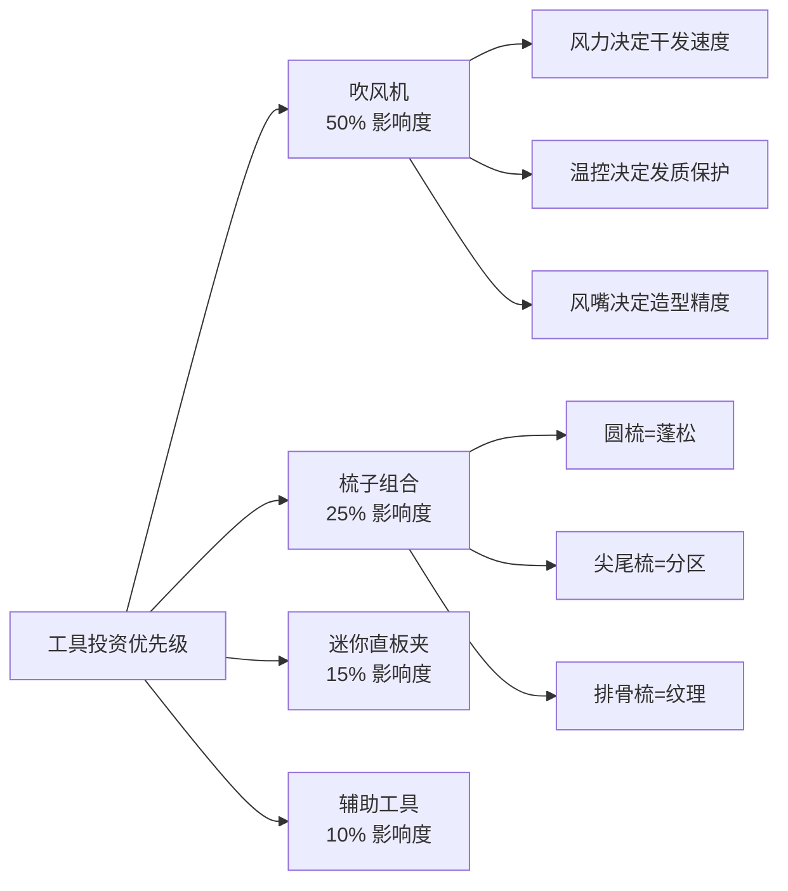
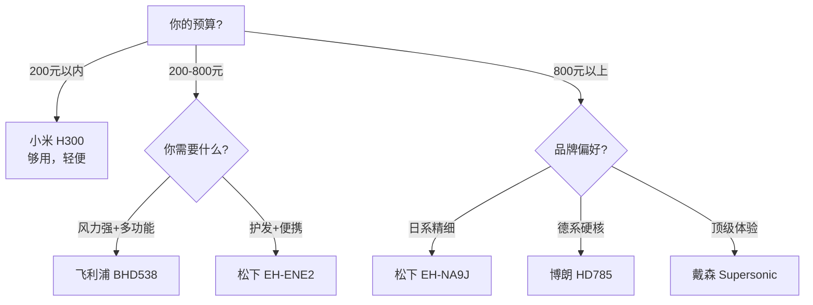

## 三、工具推荐

### 3.1 工具选择的核心逻辑

在造型产品的世界里，工具是被严重低估的变量。很多人愿意花200元买一罐发泥，却用着30元的吹风机——这就像用一把钝刀切牛排，再好的食材也出不来效果。

**工具投资的优先级排序**：

对于细软塌发质，工具投资的回报率从高到低依次为：

1. **吹风机**（影响度：50%）——决定了造型的基础形态，每天都要用
2. **梳子组合**（影响度：25%）——决定了蓬松度和纹理的精细程度
3. **迷你直板夹**（影响度：15%）——发根蓬松的"秘密武器"
4. **其他辅助工具**（影响度：10%）——锦上添花

**一个关键认知**：工具不是越贵越好，而是越匹配越好。3000元的戴森吹风机对于每周只洗两次头、从不造型的人来说是浪费；而200元的小米吹风机配上一把好的圆梳，就能解决80%的日常需求。选择工具的核心标准是**你的使用频率 × 工具的功能匹配度**。

### 3.2 吹风机——造型体系的核心引擎

#### 3.2.1 吹风机的技术参数解读

选购吹风机前，你需要理解以下几个核心参数，它们直接决定了吹风机对你头发的实际效果：

| 参数 | 含义 | 对细软塌发的影响 | 建议值 |
|------|------|----------------|--------|
| 功率（W） | 加热元件的电功率 | 功率越高，风力越强，干发越快 | 1600-2200W |
| 风速（m/s） | 出风口的气流速度 | 高风速能提拉发根，是蓬松的关键 | ≥15m/s |
| 温控档位 | 可调节的温度层级 | 细软发怕高温，需要多档温控 | ≥3档 |
| 恒温功能 | 吹风过程中温度不波动 | 防止局部过热损伤细软发丝 | 必须有 |
| 离子功能 | 释放负离子中和静电 | 减少毛躁，但过度会让头发更贴 | 可选 |
| 冷风键 | 一键切换冷风 | 定型收尾，闭合毛鳞片 | 必须有 |
| 风嘴类型 | 集风嘴/扩散嘴 | 集风嘴是定向造型的基础 | 至少配集风嘴 |

**关于负离子的特别说明**：负离子吹风机（如松下纳米水离子系列）能中和头发的正电荷，减少毛躁和飞散。但对于细软塌发质，负离子有一个副作用——它会让头发更加顺滑贴合，可能加剧"塌"的问题。因此，使用负离子吹风机时，**风力和吹风方向比离子功能更重要**。如果你的主要诉求是蓬松，优先选择风力强劲的机型，离子功能作为加分项而非决定项。

#### 3.2.2 吹风机分档推荐

**入门级（150-400元）——够用就好**

| 产品 | 价格 | 功率 | 核心特点 | 适合人群 |
|------|------|------|---------|---------|
| 小米水离子吹风机 H300 | 约200元 | 1600W | 轻便（360g），2档风速3档温度，负离子 | 学生/入门用户，日常快速干发 |
| 飞利浦 BHD538 | 约350元 | 2100W | 6种吹风组合，ThermoShield恒温技术 | 注重性价比，需要多功能 |
| 松下 EH-ENE2 | 约280元 | 1800W | 负离子，可折叠，旅行友好 | 经常出差，需要便携性 |

**进阶级（500-1500元）——体验跃升**

| 产品 | 价格 | 功率 | 核心特点 | 适合人群 |
|------|------|------|---------|---------|
| 松下 EH-NA9J | 约1200元 | 1800W | 纳米水离子+矿物质负离子双重护发，智能温控（检测头皮温度），Skin Mode（吹脸模式） | 追求护发效果，愿意多投资 |
| 飞利浦 BHD827 | 约800元 | 2300W | ThermoShield智能温控，5档设置，快速干发 | 需要强劲风力+温控保护 |
| 博朗 HD785 | 约900元 | 2200W | IONTEC离子技术，3档温度+2档风速 | 偏好德国工艺，注重做工质感 |

**专业级（2000元以上）——一步到位**

| 产品 | 价格 | 核心特点 | 适合人群 |
|------|------|---------|---------|
| 戴森 Supersonic HD15 | 约3000元 | 数码马达转速11万转/分钟，智能温控40次/秒测温，气流倍增技术，配5个风嘴（含防飞翘风嘴），重量仅730g | 预算充足，追求极致体验和护发效果 |
| 松下 EH-XD20 | 约2500元 | 纳米水离子高渗透模式，矿物质负离子，肌肤保湿模式，智能风温切换 | 对护发有极高要求，喜欢日系品牌的精细功能 |

**选购决策树**：

#### 3.2.3 吹风机使用技术——比产品本身更重要

一台200元的吹风机加上正确的使用方法，效果远超一台3000元的吹风机用错误的方式乱吹。以下是针对细软塌发质的完整吹风技术体系：

**基础吹风流程（5分钟日常版）**：

1. **预处理**（30秒）：用毛巾以按压方式吸走多余水分，不要搓揉。头发应处于"不滴水但湿润"的状态。
2. **分区**（30秒）：用尖尾梳将头发分为三个区域——左侧、右侧、头顶。用鸭嘴夹固定。
3. **吹两侧**（1分钟）：用集风嘴，中温中风。从发根开始，将圆梳插入发根，向上提拉45度角，吹风机跟随圆梳从上往下吹。每束头发重复2-3次。
4. **吹头顶**（2分钟）：这是关键步骤。低头让头发自然垂落，吹风机从下往上对准发根吹。用手指插入发根做支撑，让热风穿透发根区域。每个区域持续10-15秒。
5. **冷风定型**（30秒）：切换冷风，对准头顶和刘海区域吹30秒。冷风的作用是"锁定"刚才热风建立的发根方向。

**进阶技巧：逆向吹风法**（核心蓬松技术）

这是解决头发塌最重要的单一技术，原理是利用热风改变发根的生长方向记忆：

步骤分解：
1. 低头60-90度，让所有头发自然垂落
2. 吹风机调至中温高风
3. 将吹风机对准后脑勺发根，从下往上吹
4. 用另一只手的手指插入发根，做"Z"字形拨动
5. 持续1.5-2分钟
6. 抬头，切换冷风吹30秒
7. 用手从前往后梳理，不要用梳子

原理：热风软化发根的角蛋白结构→手指拨动改变方向→冷风锁定新方向
效果：头顶立刻增加2-3cm的蓬松高度

**进阶技巧：圆梳提拉法**（制造弧度和纹理）

工具：直径3-4cm的圆梳（猪鬃毛或混合鬃毛）
步骤：
1. 取一束约2指宽的头发
2. 将圆梳从发梢卷入，向上滚到发根
3. 吹风机的集风嘴对准圆梳上的头发，从上往下吹
4. 每束头发停留5-8秒热风，然后切换冷风3秒
5. 缓慢抽出圆梳（不要硬拽）
6. 重复直到所有区域完成

关键点：
- 吹风机和圆梳始终保持同一方向（从发根到发梢）
- 逆着头发生长方向提拉，才能获得支撑力
- 圆梳直径越大，弧度越自然；直径越小，卷度越明显

**常见吹风错误及纠正**：

| 错误做法 | 为什么错 | 正确做法 |
|---------|---------|---------|
| 高温长时间对着一个点吹 | 细软发在150°C以上开始损伤，角蛋白变性 | 移动吹风机，每个区域不超过15秒 |
| 不用风嘴直接吹 | 气流扩散，无法定向提拉发根 | 始终使用集风嘴 |
| 湿发直接吹干 | 头发在湿态下最脆弱，容易拉断 | 先用毛巾按压到半干再吹 |
| 从上往下压着吹 | 发根被压平，加剧扁塌 | 从下往上提拉发根 |
| 吹完不用冷风 | 热风建立的形态不稳定，很快塌回 | 冷风定型是必要步骤 |
| 头发全干了还在吹 | 过度干燥会让细软发变得毛躁脆弱 | 8-9成干时切换冷风 |

### 3.3 梳子和发刷——造型精度的决定者

#### 3.3.1 梳子材质对比

梳子的材质直接影响使用体验和对头发的作用效果。对于细软塌发质，材质选择尤为关键：

| 材质 | 静电控制 | 头皮刺激 | 耐用性 | 价格区间 | 推荐度 |
|------|---------|---------|--------|---------|-------|
| 天然猪鬃毛 | 极好——天然导电，不产生静电 | 温和，有按摩效果 | 中等（鬃毛会磨损） | 100-800元 | ⭐⭐⭐⭐⭐ |
| 牛角/羊角 | 极好——天然材质 | 温和 | 高 | 80-500元 | ⭐⭐⭐⭐ |
| 檀木/桃木 | 好——木质不导电 | 温和，有香气 | 高 | 30-200元 | ⭐⭐⭐⭐ |
| 尼龙（合成毛） | 差——容易产生静电 | 中等，硬度过大可能刺激 | 高 | 20-100元 | ⭐⭐⭐ |
| 塑料 | 最差——静电严重 | 可能刮伤头皮 | 高 | 5-50元 | ⭐⭐ |
| 金属 | 差——导热过快，可能烫伤 | 强，不适合敏感头皮 | 极高 | 10-80元 | ⭐⭐ |

**核心结论**：细软塌发质应该首选天然猪鬃毛梳。猪鬃毛的鳞片结构与人类头发相似，能在梳理过程中均匀分布头皮油脂到发丝表面，既不会让发根更油，又能让发梢获得自然光泽。这是塑料梳和尼龙梳完全做不到的。

#### 3.3.2 梳子类型详解与推荐

**圆梳——蓬松造型的核心工具**

圆梳是吹风造型最重要的梳子，没有之一。它的工作原理是：将头发卷入梳体，在吹风机的配合下，利用热风改变发丝的弯曲记忆。

| 直径 | 适合长度 | 造型效果 | 推荐场景 |
|------|---------|---------|---------|
| 1.5-2cm | 短发（3-6cm） | 小弧度卷曲，适合刘海造型 | 碎盖刘海、纹理刘海 |
| 3-4cm | 中短发（6-12cm） | 自然弧度，发根蓬松 | 日常蓬松造型（最常用） |
| 5-6cm | 中长发（12cm+） | 大弧度，柔化线条 | 侧分造型、背头 |

**推荐产品**：

| 产品 | 价格 | 直径 | 材质 | 特点 |
|------|------|------|------|------|
| Mason Pearson Junior | 约600元 | — | 猪鬃毛+尼龙混合 | 梳子界的"爱马仕"，手工制作，混合鬃毛适合各种发质，使用寿命10年以上 |
| Kent RK2 | 约120元 | 25mm | 天然猪鬃毛 | 英国皇室认证品牌，猪鬃毛密度高，适合短发精细造型 |
| 博朗 Satin Hair 7 圆梳 | 约150元 | 35mm | 离子鬃毛+猪鬃毛 | 自带离子功能，吹风时减少静电 |
| 名创优品 圆梳 | 约15元 | 30mm | 尼龙 | 入门练习用，坏了不心疼 |

**排骨梳（气垫梳）——日常打理和头皮按摩**

排骨梳（也叫气垫梳、蓬松梳）是日常使用频率最高的梳子。它的弹性气垫底座能在梳理时缓冲力度，同时按摩头皮促进血液循环。

| 产品 | 价格 | 材质 | 特点 |
|------|------|------|------|
| Mason Pearson BN1 | 约800元 | 纯猪鬃毛+橡胶气垫 | 经典中的经典，梳理感极为舒适 |
| Kent LBB2 | 约100元 | 野猪鬃毛+榉木手柄 | 英国老牌，性价比极高 |
| Tangle Teezer 经典款 | 约80元 | 专利弹性齿梳 | 特殊齿梳排列，湿发干发都能用，不拉扯 |
| 名创优品 气垫按摩梳 | 约15元 | 塑料齿+橡胶气垫 | 预算有限时的合格替代 |

**尖尾梳——分区和细节处理的必备工具**

尖尾梳的作用不是日常梳理，而是精确的分区操作。在吹风造型前，你需要用尖尾梳将头发分成若干区域，逐区处理，才能获得均匀的蓬松效果。

选择标准：
- 尖尾要足够细且光滑（方便精确分区）
- 梳齿间距适中（约1.5mm，太密会拉扯细软发）
- 手柄要长且轻（便于操控）
- 推荐：日本 YS Park 339（约80元）或任意不锈钢尖尾梳（约15-30元）

**宽齿梳——湿发梳理的安全选择**

湿发状态下，头发的氢键被水打开，弹性降低约30%，此时用细密的梳子梳理极易造成拉伸断裂。宽齿梳（齿间距≥3mm）是湿发状态下的唯一安全选择。

| 产品 | 价格 | 齿间距 | 特点 |
|------|------|--------|------|
| Kent AF92 | 约60元 | 4mm | 牛角材质，手感温润 |
| The Wet Brush | 约80元 | 3mm | 专利弹性齿，专为湿发设计 |
| 无印良品 宽齿梳 | 约15元 | 3.5mm | ABS树脂，便携 |

#### 3.3.3 梳子使用技术

**蓬松梳理法**：不是从上往下"压"着梳，而是从发根处向上"挑"着梳。具体操作：将梳子插入发根，齿梳朝上，向上提起约2-3cm，然后向发梢方向滑出。这个动作能让发根获得向上的支撑方向。

**头皮按摩法**：用排骨梳从前额发际线开始，以小圆圈的方式按压头皮，逐步移动到头顶、两侧和后脑。每个区域按压5-8秒。每天早晚各一次，每次2-3分钟。长期坚持能促进头皮血液循环，改善毛囊营养供给。

**梳子清洁**：每周至少清洁一次。方法——将梳子浸泡在温水+少量洗发水中10分钟，用旧牙刷清除梳齿间积累的油脂、皮屑和造型产品残留，清水冲洗后自然晾干。猪鬃毛梳避免长时间浸泡。

### 3.4 电推剪——在家维护两侧和后脑

#### 3.4.1 为什么需要电推剪

大多数适合亚洲男性细软塌发质的发型——碎盖、纹理、前刺——都需要两侧和后脑保持较短的长度（渐变推剪/fade）。理发店剪一次两侧收费30-60元，2-3周就需要修剪一次。如果家里备一把电推剪，不仅能省下这笔费用，还能在两次理发之间保持发型的整洁度。

**一个月能省多少**：假设每3周去一次理发店维护两侧，每次40元，一年就是约650元。一把好的电推剪200-400元，半年就回本。

#### 3.4.2 电推剪选购指南

| 参数 | 含义 | 建议 |
|------|------|------|
| 刀头材质 | 陶瓷/钛金属/不锈钢 | 陶瓷刀头不发热、不卡发，首选 |
| 限位梳套数 | 控制留发长度的卡尺数量 | 至少4个（3mm/6mm/9mm/12mm） |
| 续航时间 | 无线使用的持续时长 | ≥60分钟（单次使用5-10分钟） |
| 噪音 | 运行时的分贝值 | ≤65dB（不影响家人） |
| 全身水洗 | 能否直接冲洗清洁 | 强烈建议选支持水洗的 |
| T型刀头 | 刀头宽度和形状 | T型窄刀头更适合精细操作 |

**推荐产品**：

| 产品 | 价格 | 刀头 | 续航 | 特点 |
|------|------|------|------|------|
| 松下 ER-GP82 | 约500元 | X型刀头，0.5-20mm | 50分钟 | 日本制造，专业理发师同款，切割力强 |
| 飞利浦 HC5630 | 约350元 | 双重切剃技术 | 90分钟 | 自动研磨刀头，无需加油维护 |
| 小米 米家理发器 | 约100元 | R型圆角刀头 | 180分钟 | 入门首选，全身水洗，性价比极高 |
| Wahl Magic Clip | 约600元 | 重型刀头 | 90分钟 | 美国理发师专业品牌，fade神器 |

#### 3.4.3 家用电推剪使用指南

**第一次使用前的准备**：
1. 选择较大的限位梳（如12mm），先在不显眼的后脑区域试剪
2. 确认长度满意后，再逐步减小限位梳长度
3. 宁长勿短——剪短了要等好几周才能长回来

**两侧渐变的基本操作**：
1. 用12mm限位梳从鬓角向上推到太阳穴位置，建立"基线"
2. 换9mm限位梳，从鬓角向上推，高度比第一步低1-2cm
3. 换6mm限位梳，从鬓角向上推，高度再低1-2cm
4. 换3mm限位梳，只推最靠近耳朵的区域
5. 用无限位梳（0mm）处理耳朵上方的最底部

**关键技巧**：每次换更短的限位梳时，推剪的运动方向都是从下往上、由短到长过渡。不要横着推，否则会留下明显的"台阶"。最后用手指感受过渡区域是否平滑，如有不均匀，用中间长度的限位梳做修补。

**维护保养**：
- 每次使用后用附带的小刷子清理刀头间的碎发
- 每3-5次使用后滴1-2滴润滑油到刀头上
- 充电时不要使用（影响电池寿命）
- 陶瓷刀头虽不生锈但仍需定期更换（约6-12个月）

### 3.5 迷你直板夹——发根蓬松的秘密武器

#### 3.5.1 为什么需要迷你直板夹

在所有蓬松技术中，发根夹板法是效果最持久的——它能维持一整天，甚至到第二天还有残余效果。原理是利用热量暂时改变发根角蛋白的二硫键排列方向，让发根获得向上的"记忆"。

**迷你直板夹 vs. 普通直板夹**：

| 对比项 | 迷你直板夹（宽度1-2cm） | 普通直板夹（宽度2.5-4cm） |
|--------|----------------------|------------------------|
| 操作精度 | 极高——能精确夹住发根 | 低——容易夹到头皮或夹不住 |
| 适合位置 | 发根、刘海、鬓角 | 发中到发梢 |
| 适合发长 | 短发和中短发 | 中长发以上 |
| 对细软发的适配度 | 高——受力面积小，不易压塌 | 低——容易把头发压得更扁 |

#### 3.5.2 迷你直板夹推荐

| 产品 | 价格 | 板宽 | 温度范围 | 特点 |
|------|------|------|---------|------|
| 松下 EH-HV11 | 约300元 | 14mm | 150-200°C | 纳米水离子护发，3档温控，加热快 |
| 飞利浦 BHH880 | 约250元 | 16mm | 160-210°C | 多功能（直发+卷发），旅行便携 |
| Create Ion Grace Curl i·s | 约400元 | 16mm | 120-200°C | 日本专业品牌，离子涂层，温度精准 |
| GHD Mini Styler | 约1200元 | 15mm | 185°C（恒定） | 英国高端品牌，智能恒温不伤发 |

**温度设置建议**：细软发质使用150-170°C即可，不要超过180°C。粗硬发质才需要200°C以上。温度过高会让细软发变得干燥、脆弱，甚至出现焦糊味。

#### 3.5.3 发根夹板技术详解

准备工作：
- 头发必须完全干燥（湿发用高温夹板=严重损伤）
- 喷少量热保护喷雾（可选但推荐）
- 将直板夹预热到150-170°C

操作步骤：
1. 用尖尾梳分出一束约1-1.5cm宽的头发
2. 将直板夹夹在发根处（距离头皮约1cm，不要贴着头皮）
3. 夹板稍微向上提拉（角度约30-45度）
4. 保持2-3秒，然后缓慢滑出到发中位置
5. 松开夹板，让头发自然落下
6. 用手指轻轻拨弄，检查蓬松效果

注意事项：
- 不要夹太久（超过5秒），细软发容易热损伤
- 不要反复夹同一束头发（最多2次）
- 夹完后用手感受发根温度，如果烫手说明温度太高
- 当天晚上一定要洗头，把热造型残留物清洗干净

### 3.6 辅助工具——细节决定成败

#### 3.6.1 刘海卷

刘海卷是成本最低、操作最简单的蓬松工具——睡前卷上，第二天早上拆掉就能获得自然蓬松的刘海弧度。

| 类型 | 直径 | 效果 | 适合场景 |
|------|------|------|---------|
| 大号魔术贴卷 | 4-5cm | 大弧度，自然蓬松 | 日常刘海定型 |
| 中号海绵卷 | 2.5-3cm | 中等弧度 | 碎盖刘海、纹理刘海 |
| 小号塑料卷 | 1.5-2cm | 小弧度，卷曲明显 | 卷发造型、刘海定型 |

**使用方法**：
1. 晚上洗完头吹到8成干
2. 将刘海部分的头发卷入海绵卷，方向从发梢卷向发根
3. 用发夹或卷发夹自身的卡扣固定
4. 第二天早上拆掉，用手指轻轻拨松即可
5. 效果持续4-8小时，配合定型喷雾可维持全天

#### 3.6.2 干发帽

干发帽的作用不是替代吹风机，而是在洗头后快速吸收多余水分，缩短吹风时间。对于细软塌发质，这意味着**减少热风吹风时长，降低热损伤风险**。

| 材质 | 吸水性 | 干燥速度 | 价格 | 推荐 |
|------|--------|---------|------|------|
| 超细纤维 | 极好 | 快 | 30-80元 | ⭐⭐⭐⭐⭐ |
| 纯棉 | 好 | 慢 | 20-50元 | ⭐⭐⭐ |
| 竹纤维 | 好 | 中等 | 40-100元 | ⭐⭐⭐⭐ |

**使用方法**：洗完头后，低头让头发自然垂落，将干发帽从前额包到后脑，扭紧尾部塞入固定扣。停留10-15分钟后取下，此时头发大约6-7成干，再用吹风机造型。

#### 3.6.3 鸭嘴夹/分区夹

吹风造型时用于分区固定的夹子，看似不起眼但非常实用。没有分区夹，你在吹头顶的时候两侧头发会垂下来干扰操作，造型效率大打折扣。

- 材质选不锈钢或鳄鱼夹，塑料夹容易断裂
- 建议购买一套6-8个，方便同时分多个区域
- 价格：约10-20元/套

#### 3.6.4 热保护喷雾

使用吹风机或直板夹前喷在头发上，能在发丝表面形成一层保护膜，减少热损伤。对于每天都要吹风造型的细软发质，热保护喷雾是必要的"保险"。

| 产品 | 价格 | 特点 |
|------|------|------|
| 施华蔻 BC热保护喷雾 | 约80元 | 保护温度高达230°C，不增加头发重量 |
| TRESemme 热保护喷雾 | 约45元 | 性价比高，轻薄不黏腻 |
| GHD 热保护喷雾 | 约180元 | 专业沙龙品牌，保护+顺滑双重效果 |

### 3.7 工具维护与更换周期

工具买回来不是一劳永逸的——不当的维护会让工具性能快速下降，甚至伤害头发。

#### 3.7.1 吹风机维护

| 维护项目 | 频率 | 方法 |
|---------|------|------|
| 清理后部进风口滤网 | 每2周 | 拆下滤网，用旧牙刷清除灰尘和毛发 |
| 检查电源线 | 每月 | 查看是否有破损、弯折 |
| 清洁风嘴 | 每月 | 用湿布擦拭内部积灰 |
| 整体更换 | 3-5年 | 马达性能衰减、温控不准确时更换 |

**吹风机性能衰减的信号**：风力明显变弱、温度不稳定忽冷忽热、有烧焦气味、噪音变大。出现这些情况应考虑更换。

#### 3.7.2 梳子维护

| 维护项目 | 频率 | 方法 |
|---------|------|------|
| 清除梳齿间的残留物 | 每周 | 用牙签或小刷子清除头发和皮屑 |
| 深度清洗 | 每2周 | 温水+洗发水浸泡10分钟，刷洗后晾干 |
| 检查梳齿 | 每月 | 弯曲或断裂的梳齿会刮伤头皮，需要更换 |
| 猪鬃毛梳更换 | 1-2年 | 鬃毛倒伏、失去弹性时更换 |

#### 3.7.3 电推剪维护

| 维护项目 | 频率 | 方法 |
|---------|------|------|
| 清除碎发 | 每次使用后 | 用附带刷子清理刀头 |
| 润滑刀头 | 每3-5次使用 | 滴1-2滴专用润滑油 |
| 消毒刀头 | 每月 | 喷酒精后擦干 |
| 更换刀头 | 6-12个月 | 切割变钝、拉扯头发时更换 |

#### 3.7.4 迷你直板夹维护

| 维护项目 | 频率 | 方法 |
|---------|------|------|
| 清洁夹板面 | 每周 | 冷却后用湿布擦拭残留物 |
| 检查电源线 | 每月 | 查看接口处是否有松动 |
| 整体更换 | 2-3年 | 加热变慢、温控失准时更换 |

### 3.8 工具组合推荐——按预算选购

#### 方案A：极简方案（总投入200-400元）

适合刚开始关注发型、不确定会长期坚持的入门用户。

| 工具 | 推荐产品 | 预算 |
|------|---------|------|
| 吹风机 | 小米 H300 | 200元 |
| 圆梳 | 名创优品30mm圆梳 | 15元 |
| 宽齿梳 | 无印良品宽齿梳 | 15元 |
| 尖尾梳 | 任意品牌 | 10元 |
| 鸭嘴夹一套 | 不锈钢6只装 | 15元 |
| **合计** | | **约255元** |

#### 方案B：标准方案（总投入1000-2000元）

适合已经形成日常造型习惯、愿意提升体验的用户。

| 工具 | 推荐产品 | 预算 |
|------|---------|------|
| 吹风机 | 松下 EH-NA9J | 1200元 |
| 圆梳 | Kent RK2（25mm） | 120元 |
| 气垫梳 | Kent LBB2 | 100元 |
| 宽齿梳 | The Wet Brush | 80元 |
| 尖尾梳 | YS Park 339 | 80元 |
| 鸭嘴夹一套 | 不锈钢8只装 | 20元 |
| 热保护喷雾 | 施华蔻 BC | 80元 |
| **合计** | | **约1680元** |

#### 方案C：专业方案（总投入3000-5000元）

适合对发型有极致追求、愿意长期投资的用户。

| 工具 | 推荐产品 | 预算 |
|------|---------|------|
| 吹风机 | 戴森 Supersonic | 3000元 |
| 圆梳 | Mason Pearson Junior | 600元 |
| 气垫梳 | Mason Pearson BN1 | 800元 |
| 宽齿梳 | Kent AF92（牛角） | 60元 |
| 尖尾梳 | YS Park 339 | 80元 |
| 迷你直板夹 | Create Ion Grace | 400元 |
| 电推剪 | 松下 ER-GP82 | 500元 |
| 刘海卷套装 | 大中小各2个 | 30元 |
| 鸭嘴夹一套 | 不锈钢8只装 | 20元 |
| 热保护喷雾 | GHD | 180元 |
| **合计** | | **约5670元** |

**投资回报分析**：方案C看似昂贵，但如果分摊到3年使用周期，日均成本约5元——不到一杯奶茶的价格。而这套工具每天能帮你节省10-15分钟的造型时间，提升发型效果，间接影响社交和职业形象。从长期ROI看，工具投资是形象管理中回报率最高的单项投入。

### 3.9 旅行携带工具精选

出差或旅行时，你不需要带上所有工具。以下是最精简的旅行工具包：

| 必带 | 可选 | 不带 |
|------|------|------|
| 迷你折叠吹风机（酒店吹风机通常很差） | 小型圆梳 | 电推剪 |
| 小型圆梳或排骨梳 | 刘海卷2个 | 大型气垫梳 |
| 尖尾梳 | 热保护喷雾旅行装 | 干发帽（用酒店毛巾替代） |
| 定型产品旅行装 | | |

**推荐旅行吹风机**：松下 EH-NA0J（约800元，可折叠，1600W，纳米水离子，重量仅350g）

***

> 下一节：[04-四产品搭配方案](./04-四产品搭配方案.md)
