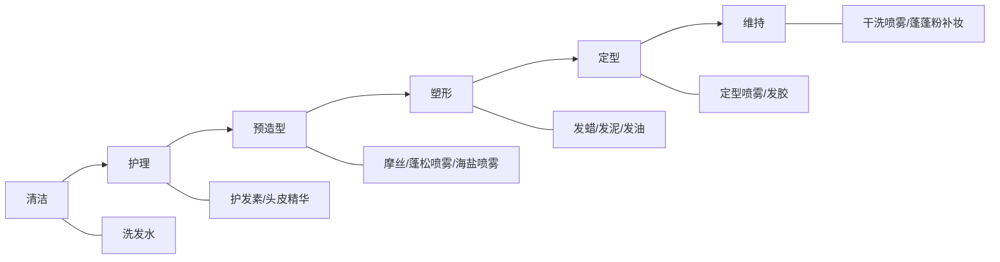
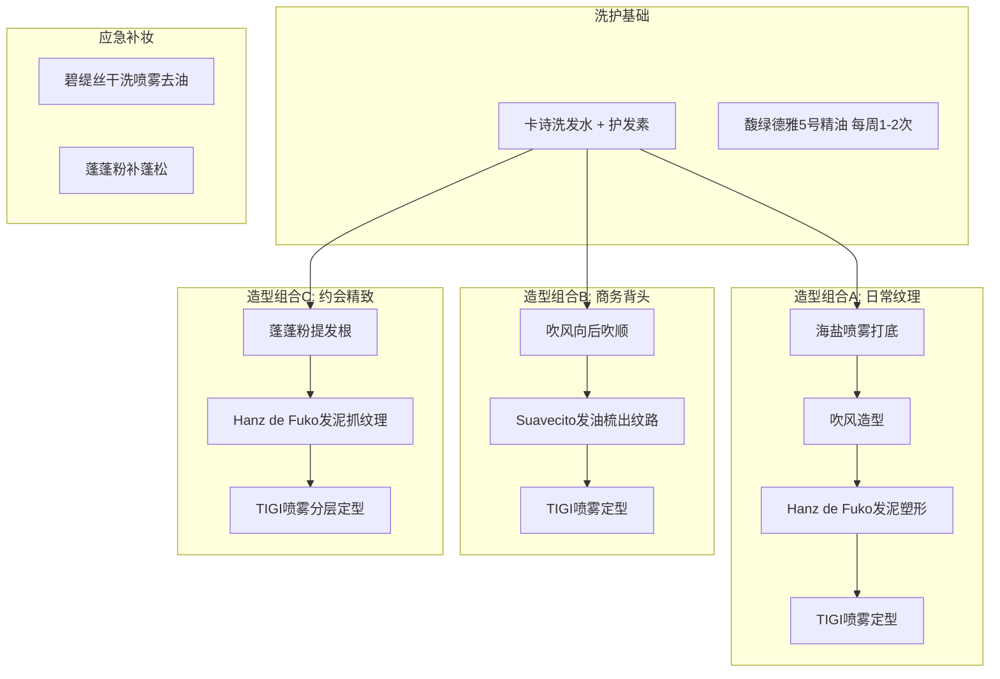
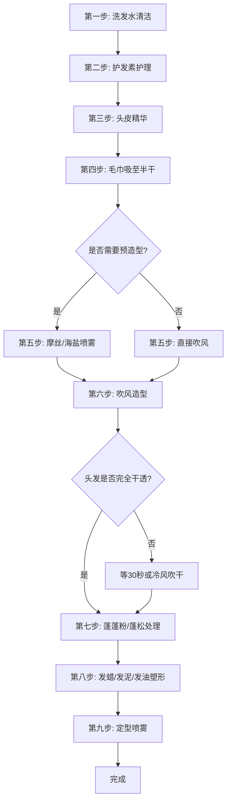

## 四、产品搭配方案

前三节分别讲了洗护产品、造型产品和工具，但现实中的问题是：**单个产品选对了，搭配不对，效果照样打折。** 产品搭配不是随意组合，而是一套有逻辑的系统工程——洗护为造型打地基，造型产品之间要互相配合，工具决定最终呈现效果。本节从搭配原理出发，按预算、发质、场景、季节四个维度给出完整的组合方案，帮你建立自己的"产品武器库"。

### 4.1 产品搭配的核心逻辑

#### 4.1.1 搭配不是堆砌，而是构建体系

很多人买产品的方式是"别人推荐什么就买什么"，结果家里摆了一堆瓶瓶罐罐，实际用的只有两三种。根本原因在于没有理解产品之间的**协作关系**。

一个完整的产品体系应该覆盖以下环节：

每个环节对应具体产品。你的产品组合不需要覆盖所有环节，但必须**逻辑自洽**——用蓬松型洗发水打底，搭配哑光发泥做造型，用强定型喷雾锁住，这就是一套完整的产品链。反过来，用滋润型洗发水+油基发油+无定型喷雾，每个环节互相矛盾，效果必然不理想。

#### 4.1.2 产品搭配的三条原则

**原则一：功能互补，不重复**

同一套组合里不需要两款功能相同的产品。比如发蜡和发泥都是塑形产品，日常选一种就够；蓬蓬粉和海盐喷雾都提供蓬松感，根据发质选一种即可。功能重复只会增加预算和选择困难，不会提升效果。

**原则二：清洁力匹配使用量**

用了多少造型产品，就需要对应的清洁能力。只用发蜡+轻喷定型喷雾，氨基酸洗发水就够；用了发泥+蓬蓬粉+强定型喷雾，可能需要清洁力更强的洗发水或每周1次深层清洁。清洁不到位，产品残留会堵塞毛囊、影响后续造型效果。

**原则三：轻重搭配，层层递进**

产品从轻到重依次使用：轻薄的预造型产品→中等质地的塑形产品→薄薄一层定型喷雾。如果先用厚重产品再用轻薄产品，轻薄产品无法渗透，等于白用。

#### 4.1.3 常见搭配误区

| 误区 | 问题所在 | 正确做法 |
|------|----------|----------|
| 洗发水随便买，把预算全砸在发蜡上 | 头发出油、扁塌，再好的发蜡也撑不住 | 洗护和造型产品的预算比例建议 3:7 |
| 同时用发蜡+发泥+发油 | 产品堆叠过多，头发变重变油腻 | 塑形产品选1-2种，够用即可 |
| 不用预造型产品，直接上发蜡 | 细软发质缺少支撑，2小时就塌 | 用摩丝或蓬松喷雾打底再吹风 |
| 只买定型力最强的产品 | 过度定型导致头发僵硬不自然 | 日常选中等定型力，特殊场合再上强力款 |
| 一套产品四季通用 | 夏天出油翻倍，冬天干燥起静电 | 根据季节调整2-3个关键产品 |

### 4.2 产品搭配方案（按预算分级）

以下方案综合了洗护、造型、定型三大品类，给出完整的产品组合。每套方案都经过功能互补性验证，不会出现"互相打架"的情况。

#### 4.2.1 基础方案：月预算 100-200 元

适合学生党、造型需求简单、刚开始关注头发管理的人群。这个预算的核心策略是：**把钱花在刀刃上，优先保证洗护基本盘，造型选最万能的产品。**

| 品类 | 推荐产品 | 参考价格 | 选择理由 |
|------|----------|----------|----------|
| 洗发水 | 清扬男士活力运动薄荷洗发露 | ~50元/500ml | 清洁力强，去屑控油，超市随处可买 |
| 护发素 | 蜂花无硅油护发素 | ~20元/500ml | 无硅油轻盈不压发，性价比极高 |
| 塑形产品 | 施华蔻酷印持久发蜡 | ~45元/75ml | 哑光中等定型力，几乎不翻车 |
| 定型产品 | 施华蔻酷印定型喷雾 | ~45元/250ml | 定型力适中不僵硬，性价比标杆 |

**月均成本**：约 140 元（洗发水和护发素按2个月计算，造型产品按3个月计算）

**这套方案的使用流程**：

1. 洗头：清扬洗发水搓泡后按摩头皮2分钟，重点清洁头顶和发际线
2. 护理：蜂花护发素只涂发梢，停留1分钟后微凉水冲净
3. 吹风：毛巾吸至不滴水，用吹风机从后往前、从下往上吹干发根
4. 塑形：发蜡黄豆大小搓热，从后往前抓出纹理
5. 定型：定型喷雾距离25cm轻喷2-3下

**适用场景**：日常通勤、上课、非正式社交场合。持久度约6-8小时，自然度高，不容易出错。

**预算分配逻辑**：基础方案的核心矛盾是"钱少但要够用"。清扬虽然含SLES，但控油去屑效果扎实，搭配蜂花无硅油护发素正好中和——一个负责深层清洁，一个负责轻盈滋润，功能互补。施华蔻酷印系列的发蜡和定型喷雾是同一个产品线，配方兼容性好，不会出现"发蜡和喷雾打架"的问题。

**局限性**：这套方案没有蓬松类产品，细软塌发质可能撑不过下午。如果出油严重，可以加一瓶碧缇丝干洗喷雾（约40元），中午补一次就能撑到晚上。

#### 4.2.2 进阶方案：月预算 200-400 元

适合已经建立基本造型意识、对发型效果有一定追求的上班族。这个预算的策略是：**升级洗护品质，增加蓬松类产品，开始考虑发质匹配。**

| 品类 | 推荐产品 | 参考价格 | 选择理由 |
|------|----------|----------|----------|
| 洗发水 | 资生堂惠润柔净洗发露 | ~80元/600ml | 无硅油无硫酸盐，温和清洁不紧绷 |
| 护发素 | 资生堂惠润护发素 | ~60元/600ml | 同系列搭配，配方兼容性最佳 |
| 头皮护理 | 柳屋生发液绿瓶 | ~80元/240ml | 促进头皮循环，强健发根，控油 |
| 塑形产品 | Gatsby哑光发蜡（粉色） | ~65元/75g | 哑光效果极致，纹理感强 |
| 蓬松产品 | 施华蔻蓬蓬粉 | ~60元/10g | 细软塌发的急救神器 |
| 定型产品 | 杰士派定型喷雾 | ~40元/180g | 日本配方，定型自然不僵 |

**月均成本**：约 245 元（洗护按2个月、造型产品按3个月计算）

**这套方案的升级点**：

相比基础方案，进阶方案在三个维度上有质的提升：

1. **洗护品质升级**：从硫酸盐体系切换到氨基酸体系，减少头皮刺激，长期使用头皮状态会明显改善
2. **增加了蓬松环节**：蓬蓬粉解决了细软塌发的核心痛点——发根支撑力不足
3. **增加了头皮护理**：柳屋生发液是性价比最高的头皮精华，每天花30秒涂一下，长期收益巨大

**使用流程（比基础方案多了蓬松步骤）**：

1. 洗头：资生堂惠润洗发水，氨基酸体系泡沫细腻，按摩2-3分钟
2. 护理：惠润护发素涂发梢，1分钟后冲净；柳屋生发液喷在头皮上按摩吸收
3. 吹风：从后往前吹干发根，重点提拉头顶区域
4. 蓬松：蓬蓬粉轻拍在发根，指尖揉搓均匀后向上提拉
5. 塑形：Gatsby发蜡搓热后抓出纹理
6. 定型：杰士派喷雾分两层喷，第一层薄喷等10秒，第二层补喷

**适用场景**：日常通勤、约会、商务休闲场合。持久度约8-10小时，蓬松感和纹理感兼顾。

**这套方案对不同发质的调整**：

- **细软塌+油头**：蓬蓬粉是核心，用量可以稍多（0.3-0.5g），发蜡选哑光款
- **细软塌+干头**：蓬蓬粉少用或不用，发蜡可以选带光泽的款（如Brylcreem）
- **中等发质**：可以省掉蓬蓬粉，把预算挪到升级洗发水上

#### 4.2.3 专业方案：月预算 400-800 元

适合对发型有高要求、愿意长期投入的人群。这个预算的策略是：**每个环节都用专业级产品，建立完整的产品矩阵，覆盖多种场景。**

| 品类 | 推荐产品 | 参考价格 | 选择理由 |
|------|----------|----------|----------|
| 洗发水 | 卡诗双重功能洗发水 | ~280元/250ml | 油头干尾分区护理，专业沙龙线 |
| 护发素 | 卡诗双重功能护发素 | ~300元/200ml | 同系列搭配，分区护理效果最佳 |
| 头皮护理 | 馥绿德雅5号精油 | ~280元/50ml | 深层净化头皮，每周1-2次密集护理 |
| 塑形产品A | Hanz de Fuko Claymation | ~200元/56g | 发泥发蜡混合体，哑光定型力天花板 |
| 塑形产品B | Suavecito Original水基发油 | ~60元/113g | 背头油头场景专用 |
| 蓬松产品 | OSIS+ Dust It蓬蓬粉 | ~100元/10g | 德国专业线，效果比开架强一档 |
| 预造型 | Bumble and Bumble Surf Spray | ~180元/125ml | 海盐喷雾鼻祖，吹风前打底 |
| 定型产品 | TIGI定型喷雾 | ~120元/300ml | 沙龙品牌，强定力不僵硬 |
| 应急产品 | 碧缇丝干洗喷雾 | ~40元/200ml | 中午补妆续命 |

**月均成本**：约 680 元（洗护按2个月、造型产品按3-4个月计算）

**这套方案的完整产品矩阵**：

专业方案不再是一条产品链，而是一个可以灵活组合的**产品矩阵**——根据当天的场景、心情、头发状态，从矩阵中选取合适的组合：

**三种日常组合的详细用法**：

**组合A：日常纹理造型（最常用）**

适合通勤、上课、休闲场合，追求自然蓬松的纹理感。

1. 洗护：卡诗洗发水+护发素，柳屋或馥绿德雅精华护理头皮
2. 预造型：湿发上喷Bumble海盐喷雾5-6下，揉搓发丝
3. 吹风：手指向上提拉发根，吹至八成干
4. 塑形：Hanz de Fuko发泥米粒大小，指尖捏碎后抓发根和发中段
5. 定型：TIGI喷雾距离25cm薄喷一层，手指微调，再补喷一层

**组合B：商务背头造型**

适合正式会议、面试、商务宴请，追求整洁利落。

1. 洗护：同上
2. 吹风：湿发用梳子从前往后梳，吹风机顺着梳子方向吹干
3. 塑形：Suavecito发油一指节量，掌心搓开后从前往后涂抹，用油头梳梳出纹路
4. 定型：TIGI喷雾从前往后喷，锁住梳出的纹路

**组合C：约会精致造型**

适合约会、社交活动，追求精致有型但不刻板。

1. 洗护：同上
2. 蓬松：蓬蓬粉轻拍发根，指尖揉匀后提拉
3. 塑形：Hanz de Fuko发泥从后往前、从下往上抓出层次
4. 细节：用尖尾梳调整鬓角和分线
5. 定型：TIGI喷雾分三层喷——底层（后脑）、中层（两侧）、顶层（刘海和头顶），每层等10秒

#### 4.2.4 方案对比总览

| 维度 | 基础方案 | 进阶方案 | 专业方案 |
|------|----------|----------|----------|
| 月均成本 | ~140元 | ~245元 | ~680元 |
| 产品数量 | 4件 | 6件 | 9件 |
| 覆盖环节 | 洗护+塑形+定型 | 洗护+头皮+蓬松+塑形+定型 | 洗护+头皮+预造型+蓬松+塑形+定型+应急 |
| 造型持久度 | 6-8小时 | 8-10小时 | 10-12小时 |
| 可塑造型风格 | 1-2种 | 2-3种 | 4-5种 |
| 购买渠道 | 超市即可 | 超市+屈臣氏+天猫 | 屈臣氏+天猫+海淘 |
| 适合人群 | 学生、造型新手 | 上班族、有一定追求 | 对发型有高要求的人 |

**如何选择适合自己的方案？**

不必一步到位。建议的进阶路径是：

1. **先用基础方案**跑通整个流程，确认自己能坚持每天打理头发
2. **逐步升级**——先升级洗发水（从清扬到资生堂惠润），再加蓬蓬粉，再升级发蜡
3. **建立产品矩阵**——当你明确了自己的风格偏好后，开始构建多场景组合

### 4.3 产品搭配方案（按发质匹配）

预算是选择方案的维度之一，但**发质才是决定性因素**。同一预算下，不同发质需要完全不同的产品组合。

#### 4.3.1 细软塌发质方案

**核心痛点**：发丝直径小（<60微米），缺乏支撑力，出油后迅速贴头皮。造型产品的首要任务不是"好看"，而是"撑住"。

| 品类 | 推荐产品 | 选择逻辑 |
|------|----------|----------|
| 洗发水 | 资生堂惠润/箭牌经典控油 | 无硅油+控油，不增加发丝重量 |
| 护发素 | 只在发梢用少量免洗护发素 | 传统护发素容易压塌，免洗型最轻盈 |
| 蓬松产品 | 蓬蓬粉（必备） | 增加发丝摩擦力，是最直接的蓬松手段 |
| 塑形产品 | 哑光发泥（如Gatsby粉色） | 干涩质地抓力强，不会像发蜡那样滑塌 |
| 定型产品 | 强定型喷雾 | 细软发需要更强的定型力来维持形状 |

**关键策略**：

- **洗护环节就要开始控重**：无硅油洗发水 + 免洗护发素（只涂发梢），确保洗完的头发是"轻"的
- **预造型环节重在蓬松**：摩丝打底吹风或蓬蓬粉提发根，在造型产品上场前就把蓬松度拉满
- **塑形产品选哑光**：哑光发泥的干涩质地天然适合细软发，油润的发蜡反而会让头发变滑变塌
- **定型要舍得**：细软发的定型喷雾用量要比中等发质多30-50%，薄薄一层撑不住

**避坑清单**：

- ✗ 油基发油——重量大，直接压塌
- ✗ 滋润型洗发水——含硅油配方增加重量
- ✗ 传统护发素涂发根——阳离子表活附着在发根直接压塌
- ✗ 过量发蜡——变成"油条"，比不造型更糟

#### 4.3.2 粗硬发质方案

**核心痛点**：发丝直径大（>80微米），有刚性但不服帖，造型后容易"弹回原形"。造型产品的首要任务是"驯服"。

| 品类 | 推荐产品 | 选择逻辑 |
|------|----------|----------|
| 洗发水 | 可选含硅油的滋润型 | 粗硬发不怕重量，硅油能增加顺滑度 |
| 护发素 | 滋润型护发素，全发使用 | 软化发丝，降低刚性，方便塑形 |
| 塑形产品 | 发蜡或发油 | 油润质地能驯服粗硬发，发油定型力更强 |
| 定型产品 | 中等定型喷雾 | 粗硬发自身有支撑力，不需要太强的定型 |

**关键策略**：

- **吹风前用热保护喷雾**：粗硬发需要用高温吹风才能驯服，热保护必不可少
- **半干发上产品**：粗硬发在半干状态最容易塑形，全干后刚性恢复很难调整
- **发油是粗硬发的利器**：水基发油（如Suavecito）在粗硬发上的效果远好于发泥——油润质地能"压住"不服帖的发丝
- **梳子比手指好用**：粗硬发用梳子梳出纹路比手指抓更整齐

#### 4.3.3 油性头皮方案

**核心痛点**：皮脂分泌旺盛，造型产品+皮脂混合后头发变得油腻沉重，造型寿命大幅缩短。

| 品类 | 推荐产品 | 选择逻辑 |
|------|----------|----------|
| 洗发水 | 含水杨酸/烟酰胺的控油型 | 从源头调节皮脂分泌 |
| 头皮护理 | 烟酰胺精华/PCA锌精华 | 控油是长期战，需要持续调理 |
| 塑形产品 | 哑光发泥/发蜡 | 哑光质地吸油，不会加重油腻感 |
| 蓬松产品 | 蓬蓬粉 | 粉末吸附油脂，一举两得 |
| 应急产品 | 干洗喷雾 | 中午去油续命必备 |
| 定型产品 | 控油型定型喷雾 | 选含吸油成分的喷雾 |

**关键策略**：

- **造型当天早上洗头**：油头不能前一天晚上洗头早上直接造型，油脂在夜间分泌最多
- **蓬蓬粉是双重武器**：既能蓬松又能吸油，油头+细软塌的救星
- **干洗喷雾随身带**：中午出油时喷一下，比重新洗头方便得多
- **避开油基产品**：油基发油、含矿物油的发蜡，对油性头皮是雪上加霜

#### 4.3.4 干性发质/自然卷方案

**核心痛点**：发丝缺水毛躁，缺乏光泽，自然卷不服帖。

| 品类 | 推荐产品 | 选择逻辑 |
|------|----------|----------|
| 洗发水 | 氨基酸温和型 | 不过度清洁，保留天然油脂 |
| 护发素 | 滋润型，可全发使用 | 干性发需要更多滋润 |
| 头皮护理 | 含泛醇的头皮精华 | 补水保湿 |
| 塑形产品 | 含油脂的发蜡/发油 | 补充油脂，增加光泽和顺滑度 |
| 定型产品 | 低酒精/无酒精喷雾 | 酒精会加重干燥 |

**关键策略**：

- **不要过度清洁**：干性发2-3天洗一次头就够了，每天洗会越洗越干
- **发油对自然卷效果极好**：水基发油能让卷发变得服帖有光泽，同时不难清洗
- **护发精油是干性发的日常必备**：洗完头在发梢涂少量精油，防毛躁效果立竿见影

### 4.4 产品搭配方案（按场景适配）

同一个人在不同场景下需要不同的造型风格，产品组合也应该灵活调整。

#### 4.4.1 日常通勤/上课

**造型目标**：自然、干净、不刻意，看起来像"没怎么打理但就是好看"

**产品组合**：温和洗发水 + 轻盈护发素 + 哑光发蜡 + 轻喷定型喷雾

**操作要点**：
- 发蜡用量控制在黄豆大小，宁少勿多
- 定型喷雾只喷2-3下，保持头发的自然弹性和触感
- 整个造型流程控制在5分钟以内——日常造型不值得花太多时间

**持久度**：6-8小时，到下午可能需要用手抓一抓恢复形状

#### 4.4.2 约会/社交

**造型目标**：精致有型，有层次感和细节感，但不能像"精心打扮过"

**产品组合**：控油洗发水 + 蓬蓬粉 + 发泥 + 定型喷雾（分层喷）

**操作要点**：
- 蓬蓬粉提发根，确保头顶蓬松
- 发泥从后往前抓出纹理，重点是发梢的层次感
- 定型喷雾分两层喷，第一层薄喷等10秒再喷第二层
- 鬓角和后脑勺不要忽略——约会时对方可能会从侧面和后面看你
- 整个流程10-15分钟

**持久度**：8-10小时，足够撑过一顿饭+一场电影

#### 4.4.3 面试/商务正式

**造型目标**：整洁、利落、专业感，不能有"毛躁"和"凌乱"

**产品组合**：滋润洗发水 + 护发素 + 发油（或光泽发蜡）+ 强定型喷雾

**操作要点**：
- 发油用梳子梳出整齐的纹路，不要用手指抓
- 分线要清晰——侧分是最安全的商务发型
- 定型喷雾多喷几下，确保全天不乱
- 准备一把小梳子放在包里，中午可以去洗手间补一下
- 整个流程15-20分钟

**持久度**：10-12小时，足以应对一整天的会议

#### 4.4.4 运动/户外

**造型目标**：清爽不油腻，运动后不会太狼狈

**产品组合**：控油洗发水 + 免洗护发素 + 蓬蓬粉或海盐喷雾（不用发蜡发泥）

**操作要点**：
- 运动场景尽量少用造型产品——出汗后产品+汗液混合会很不舒服
- 如果一定要造型，只用蓬蓬粉或海盐喷雾这类轻薄产品
- 运动后用干洗喷雾去油，再补一点蓬蓬粉就能恢复基本形象
- 当天晚上必须洗头

**持久度**：3-5小时（运动场景不需要持久，能撑到运动结束即可）

#### 4.4.5 婚礼/重要活动

**造型目标**：全天完美状态，拍照好看，经得起镜头特写

**产品组合**：滋润洗发水 + 护发素 + 摩丝打底 + 发蜡精雕细琢 + 强定型喷雾 + 备用发蜡

**操作要点**：
- 提前一周做一次发膜深层护理，让发质状态达到最佳
- 摩丝打底吹风，建立蓬松基础
- 发蜡精雕每一个细节——刘海方向、鬓角弧度、后脑勺形状
- 强定型喷雾至少喷3层，每层等15秒
- 随身带一小罐发蜡和一把小梳子，中间休息时补妆
- 整个流程30-45分钟，建议提前一天试做一次

**持久度**：12小时+

### 4.5 季节性调整方案

头皮出油量随季节变化显著，产品组合也需要随之调整。不需要四个季节买四套产品，通常**调整2-3个关键产品**就够了。

#### 4.5.1 春季（3-5月）

**环境特点**：气温回升，湿度上升，花粉增多

**调整策略**：

| 维度 | 冬→春调整 | 原因 |
|------|-----------|------|
| 洗发水 | 温和型→中等清洁力 | 出油量开始增加 |
| 护发素 | 滋润型→轻盈型 | 不需要那么多滋润了 |
| 造型产品 | 增加哑光发泥 | 湿度上升，油基产品容易变黏 |
| 定型喷雾 | 选抗湿配方 | 春季回南天湿度大，普通喷雾容易失效 |

**特别注意**：花粉过敏可能导致头皮发痒，如果出现这种情况，可以用含红没药醇的舒缓型洗发水。

#### 4.5.2 夏季（6-8月）

**环境特点**：高温、高出油、多汗

**调整策略**：

| 维度 | 调整方向 | 原因 |
|------|----------|------|
| 洗发水 | 控油清洁力最强的款 | 夏天出油量是冬天的1.5倍 |
| 护发素 | 只在发梢用极少量 | 出汗本身就有滋润效果 |
| 蓬松产品 | 蓬蓬粉用量增加 | 吸油+蓬松双重作用 |
| 造型产品 | 轻薄为主，避开厚重发油 | 高温下油基产品会"融化" |
| 应急产品 | 干洗喷雾随身带 | 中午出油高峰期必备 |
| 洗头频率 | 可能需要每天洗 | 夏天每天洗头是正常的 |

**夏季特别方案**：

如果夏天出汗特别多，可以考虑"极简方案"——只用控油洗发水+蓬蓬粉+轻喷定型喷雾。夏天的造型目标不是"精致"，而是"干净清爽"。

#### 4.5.3 秋季（9-11月）

**环境特点**：气温下降，湿度降低，换季掉发增多

**调整策略**：

| 维度 | 调整方向 | 原因 |
|------|----------|------|
| 洗发水 | 回到温和型 | 出油量减少，不需要强清洁 |
| 护发素 | 适当增加用量 | 空气开始干燥 |
| 头皮护理 | 加强头皮精华使用 | 秋季掉发增多，需要强健发根 |
| 造型产品 | 可以开始用含油脂的发蜡 | 干燥环境下需要补充油脂 |

**特别注意**：秋季换季掉发是正常生理现象（头发的生长期/休止期与季节有关），每天掉50-100根属于正常范围，不需要恐慌。但如果持续大量掉发，应就医检查。

#### 4.5.4 冬季（12-2月）

**环境特点**：低温、干燥、静电多、戴帽子压塌发型

**调整策略**：

| 维度 | 调整方向 | 原因 |
|------|----------|------|
| 洗发水 | 最温和的氨基酸型 | 冬天出油最少，过度清洁会干燥 |
| 护发素 | 可以用稍滋润的 | 对抗干燥和静电 |
| 造型产品 | 含油脂的发蜡为主 | 补充油脂抗静电 |
| 定型产品 | 中等定型力即可 | 冬天湿度低，定型效果天然好 |
| 特殊工具 | 刘海卷/迷你直板夹 | 戴帽子后快速恢复造型 |

**冬季特别方案**：

冬天戴帽子是发型杀手。解决方案：

1. 出门前用强定型喷雾多喷几层
2. 到室内摘帽子后，用手抓一抓恢复形状
3. 随身带蓬蓬粉，摘帽子后补一点蓬松度
4. 如果帽子压塌太严重，去洗手间用迷你直板夹夹发根30秒就能恢复

### 4.6 产品使用顺序与搭配禁忌

#### 4.6.1 标准使用顺序

无论什么方案，产品使用顺序都不能乱。顺序错了，轻则效果打折，重则产品互相"打架"。

**关键节点说明**：

- **护发素之后、造型产品之前**，是头皮精华的使用窗口。涂在半干的头皮上按摩吸收，不需要冲洗
- **吹风必须在造型产品之前**——发蜡/发泥必须在干发上使用（发油例外，可在半干发上用）
- **蓬蓬粉在发蜡之前用**——蓬蓬粉作用于发根，发蜡作用于发中段和发梢，先粉后蜡不会互相干扰
- **定型喷雾永远是最后一步**——喷完后不要再用手碰头发，否则会破坏定型膜

#### 4.6.2 产品搭配禁忌

以下组合搭配在一起会产生负面效果，应该避免：

| 禁忌组合 | 问题 | 替代方案 |
|----------|------|----------|
| 蓬蓬粉 + 油基发油 | 粉末和油脂混合变成"泥浆"质感 | 蓬蓬粉搭配哑光发泥 |
| 发胶 + 发泥 | 发胶的硬壳会破坏发泥的纹理感 | 发泥用完只喷定型喷雾 |
| 海盐喷雾 + 发油 | 海盐的干涩和发油的油润互相矛盾 | 海盐喷雾搭配发泥或发蜡 |
| 深层清洁洗发水 + 护发素（同一天） | 深层清洁后用护发素，等于刚洗干净又糊上一层 | 深层清洁当天不用护发素，或只在发梢用少量 |
| 干洗喷雾 + 发蜡 | 干洗喷雾的粉末会和发蜡混合，产生白色结块 | 用了干洗喷雾当天不造型，或只用蓬蓬粉补妆 |

### 4.7 产品采购策略与性价比优化

#### 4.7.1 产品生命周期与成本计算

很多人的错觉是"造型产品很贵"，但实际上造型产品的单次用量非常少，一瓶产品的真实使用寿命远比想象中长。以下是常见产品的**真实使用周期**和**日均成本**：

| 产品 | 规格 | 单次用量 | 可用次数 | 使用周期 | 日均成本 |
|------|------|----------|----------|----------|----------|
| 洗发水 | 500ml | 5-8ml | 60-100次 | 2-3个月（每天洗） | ~0.8元 |
| 护发素 | 500ml | 3-5ml | 100-160次 | 3-5个月 | ~0.4元 |
| 发蜡 | 75ml | 0.5-1g | 75-150次 | 2.5-5个月 | ~0.6元 |
| 发泥 | 75g | 0.3-0.5g | 150-250次 | 5-8个月 | ~0.4元 |
| 定型喷雾 | 250ml | 2-3ml | 80-120次 | 2.5-4个月 | ~0.5元 |
| 蓬蓬粉 | 10g | 0.2-0.3g | 30-50次 | 1-1.5个月 | ~2元 |
| 发油 | 113g | 1-2g | 55-110次 | 2-3.5个月 | ~0.8元 |

从日均成本来看，造型产品的花费远低于每天一杯咖啡。真正的成本不在于买产品，而在于**买错产品后闲置浪费**。

#### 4.7.2 采购节奏优化

**第一次购买**：

- 每个品类只买一种，先建立基础产品链
- 优先买小容量装试错，确认适合自己后再买大容量
- 可以在屈臣氏/发廊要小样试用

**日常补货**：

- 洗发水和护发素消耗最快，关注大促囤3-6个月的量
- 造型产品消耗慢，不需要囤货，用完再买
- 蓬蓬粉消耗较快且单价高，可以关注海淘渠道

**升级路径**：

- 不要一次性把所有产品都升级到专业级
- 优先升级**使用频率最高的产品**（通常是洗发水和发蜡）
- 一个一个升级，每个新产品用2-3周确认效果后再决定下一个

#### 4.7.3 替代品思维

不是所有产品都需要买专用产品，有些可以找到性价比更高的替代方案：

| 专用产品 | 替代方案 | 效果差异 | 适用情况 |
|----------|----------|----------|----------|
| 海盐喷雾 | 水+海盐+少量发胶，喷雾瓶DIY | 效果接近，持久度略差 | 预算有限，偶尔使用 |
| 干洗喷雾 | 婴儿爽身粉/玉米淀粉 | 吸油效果接近，但不如专用产品均匀 | 应急使用 |
| 头皮按摩器 | 十指指腹按摩 | 效果完全一样 | 有耐心、不嫌手酸 |
| 热保护喷雾 | 吹风机保持15cm距离+中温档 | 不用产品但降低热损伤 | 吹风频率不高时 |
| 预造型喷雾 | 海盐喷雾代替 | 效果类似 | 已经有海盐喷雾时 |

### 4.8 产品搭配的长期思维

#### 4.8.1 从"买产品"到"建体系"

初级阶段是买单品，高级阶段是建体系。一个成熟的产品体系应该具备以下特征：

- **核心产品稳定**：洗发水、主力发蜡、定型喷雾这三样长期不换
- **辅助产品灵活**：蓬蓬粉、海盐喷雾、发油等根据场景和季节调换
- **应急产品常备**：干洗喷雾、小梳子、旅行装发蜡，随时可以应对突发情况
- **定期复盘**：每个季度回顾一次，哪些产品用得多、哪些闲置、是否需要调整

#### 4.8.2 产品与技术的配合

再好的产品也替代不了正确的使用技术。同样的发蜡和定型喷雾，手法不同效果可以差两倍：

- **吹风技术**：决定了头发的蓬松基础，这是造型产品无法弥补的
- **上蜡手法**：搓热程度、涂抹方向、取量控制，都需要练习
- **定型喷雾距离和角度**：太近会湿一块、太远定不住，20-30cm是黄金距离

建议把70%的预算花在产品上，30%的精力花在练习技术上。产品是弹药，技术是枪法——弹药再好，枪法不行也打不中目标。

#### 4.8.3 产品搭配的最终目标

产品搭配的终极目标不是"用最贵的产品"，而是**用最少的产品达到最好的效果**。当你的技术和经验足够丰富后，可能会发现：日常只需要洗发水+发蜡+定型喷雾三样就够了，其他产品只是锦上添花。

少而精，永远比多而杂更好。

***

