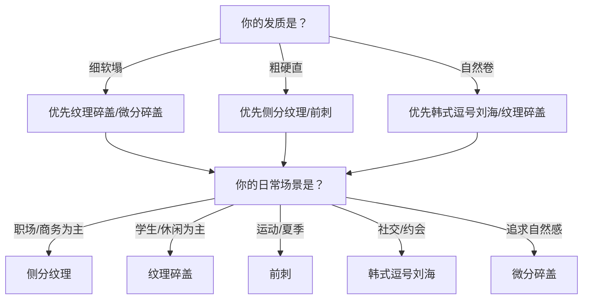
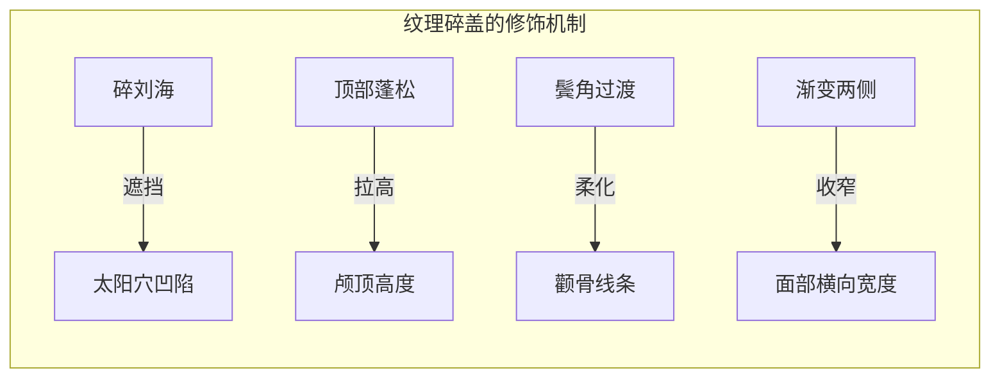

## 一、推荐发型详解

### 1.0 选择框架：如何判断哪个发型最适合你

在逐一了解五款推荐发型之前，先建立一个选择框架。发型不是"好看的就行"，而是需要与脸型、发质、生活方式三者同时匹配。以下是决策逻辑：

**核心原则**：方形脸的发型设计目标是——增加面部上半部分的宽度感，柔化颧骨线条，拉长纵向视觉比例。每一款推荐发型都围绕这三个目标展开，只是实现路径不同。

### 1.1 纹理碎盖（首推发型）

#### 1.1.1 发型定义与设计原理

纹理碎盖是亚洲男性近五年最受欢迎的发型之一，也是方形脸+细软塌发质的最佳解法。它的设计原理直接针对方形脸的核心问题：

- **颧骨突出** → 碎刘海自然遮挡太阳穴凹陷区域，鬓角长度遮挡颧骨上缘，弱化"角"的视觉感知
- **头发塌** → 顶部打薄+纹理处理增加层次，配合造型产品实现持久蓬松
- **面部比例** → 头顶蓬松拉高颅顶，碎刘海缩短额头露出面积，视觉上将面部重心从颧骨上移至眉眼区域

#### 1.1.2 详细参数

| 部位 | 长度 | 处理方式 | 设计意图 |
|------|------|----------|----------|
| 顶部 | 5-8cm | 打薄至原发量的60-70%，制造不规则纹理 | 增加层次感和蓬松度，避免厚重贴头皮 |
| 刘海 | 6-10cm（自然垂落） | 碎剪，参差不齐，最长与最短差2-3cm | 遮挡太阳穴，碎感避免"锅盖头"的呆板 |
| 两侧 | 0.5-3cm（渐变） | 推剪渐变（Skin Fade或Low Fade），上长下短 | 收窄面部宽度，渐变过渡自然不突兀 |
| 后脑 | 3-5cm | 自然弧度，不过度打薄 | 维持后脑饱满度，避免后脑扁平显脸大 |
| 鬓角 | 3-5cm | 渐变过渡，不剃光 | 遮挡颧骨下缘，柔化面部轮廓线 |

#### 1.1.3 适合与不适合的人群

**最适合**：
- 细软发质、头发容易塌的人（纹理处理+造型产品直接解决问题）
- 方形脸、菱形脸（碎刘海+鬓角遮挡颧骨区域）
- 不想花太多时间打理的人（日常维护难度低，5分钟可出门）
- 学生、年轻上班族（风格百搭，不挑穿搭）

**不太适合**：
- 发量极少（头顶稀疏明显）的人——打薄会让发量更显少
- 自然卷严重的人——碎剪后卷曲不可控，需要先做柔顺处理
- 面部极短极宽的人——碎盖会进一步压缩面部纵向比例

#### 1.1.4 打理流程（每日5分钟）

**第一步：洗发后吹风（3分钟）**

1. 用毛巾按压吸走水分，不要搓揉（搓揉会让毛鳞片张开，头发更毛躁）
2. 低头，让头发自然垂落，用吹风机中温档从发根向上吹——这一步让发根"站起来"，是蓬松的关键
3. 抬起头，用圆梳（直径3cm）将刘海向前、向下梳理，吹风机跟着圆梳移动
4. 两侧用手掌压住，用吹风机中温贴着头皮吹——让两侧服帖

**第二步：造型产品（1.5分钟）**

1. 取黄豆大小的哑光发蜡（水基配方，方便清洗），在手掌搓开至透明
2. 从头顶开始，用手指插入发根，向上提拉抓取——制造纹理和蓬松
3. 刘海部分用手指从根部向发梢方向"捏"，制造碎感
4. 最后用定型喷雾距离20cm轻喷2-3下，固定造型

**第三步：检查（30秒）**

- 对着镜子从正面看：刘海是否自然遮挡太阳穴？
- 从侧面看：后脑弧度是否饱满？
- 从上方看：头顶是否有蓬松感？

#### 1.1.5 与理发师的沟通话术

去理发时，你可以这样跟发型师沟通：

> "我想剪一个纹理碎盖。顶部保留5到8厘米，帮我打薄制造纹理感，打薄到原来发量的六七成。刘海碎剪，参差不齐的那种，不要齐的，最长和最短差两三厘米。两侧做渐变推剪，上面保留一些长度，下面推短，渐变要自然。鬓角不要剃太干净，保留3到5厘米的过渡。整体要自然蓬松的感觉，不要太厚重。"

**关键提示**：如果发型师不太理解"纹理碎盖"，你可以给他看参考图片。建议提前在小红书、抖音等平台搜索"纹理碎盖 男生"，保存3-5张你喜欢的图片，直接给发型师看。选图片时注意：选和自己脸型相近的博主，不要选脸型差异太大的参考。

#### 1.1.6 常见错误与纠正

| 错误 | 后果 | 纠正方法 |
|------|------|----------|
| 刘海剪得太齐 | 看起来像"锅盖头"，呆板不自然 | 要求发型师用牙剪碎剪，制造参差感 |
| 两侧推得太光 | 面部两侧空荡，颧骨更突出 | 两侧保留渐变过渡，不要推到皮肤 |
| 顶部没有打薄 | 头发厚重贴头皮，完全没有蓬松感 | 要求发型师用打薄剪处理，去除30-40%发量 |
| 造型产品用量过多 | 头发油腻结块，像"三天没洗头" | 黄豆大小起步，不够再加，宁少勿多 |
| 吹风方向错误 | 头发越吹越塌 | 低头从发根向上吹，逆着重力方向 |

***

### 1.2 侧分纹理（成熟风格）

#### 1.2.1 发型定义与设计原理

侧分纹理比纹理碎盖更成熟、更有商务感。它的核心设计逻辑是：通过明确的侧分线引导视觉方向，配合纹理增加发丝层次，营造干练而不刻板的形象。

对方形脸而言，侧分纹理的修饰策略与碎盖不同——它不是靠遮挡，而是靠**视觉引导**：侧分线将注意力从颧骨引导到眉眼区域，顶部的蓬松和纹理拉高颅顶，整体营造"倒三角"的视觉效果，平衡方形脸的上窄下宽。

#### 1.2.2 详细参数

| 部位 | 长度 | 处理方式 | 设计意图 |
|------|------|----------|----------|
| 顶部 | 4-7cm | 向一侧梳理，打薄制造纹理 | 蓬松+方向感，引导视觉纵向移动 |
| 分线 | 三七分或二八分 | 自然分线（不做硬分线），用手或梳子引导 | 三七分适合大多数人，二八分更个性 |
| 两侧 | 1-3cm（渐变） | 中等渐变，保留一定厚度 | 不过分推短，避免颧骨区域完全暴露 |
| 后脑 | 2-4cm | 自然贴合，微微蓬松 | 保持后脑轮廓，不贴头皮 |
| 鬓角 | 2-4cm | 自然渐变 | 与两侧衔接，遮挡颧骨下缘 |

#### 1.2.3 三七分 vs 二八分的选择

| 分线方式 | 适合的脸型 | 风格特点 | 适合场景 |
|----------|-----------|----------|----------|
| 三七分 | 方形脸首选——分线偏移适中，不会让某一侧颧骨完全暴露 | 稳重、百搭、不出错 | 职场、日常、正式场合 |
| 二八分 | 椭圆脸、心形脸——需要一定自信和气质撑住 | 个性、时尚、有记忆点 | 时尚行业、创意工作者、约会 |

**方形脸选三七分的原因**：三七分的分线位置恰好在眉峰上方，刘海向一侧自然覆盖太阳穴区域，既不遮挡视线，又能修饰颧骨。二八分的分线偏移过大，会让一侧颧骨完全暴露，反而强调了方形脸的"角"。

#### 1.2.4 打理流程（每日7分钟）

**第一步：洗发后吹风（4分钟）**

1. 毛巾按压吸走水分，在半干状态开始
2. 低头，从发根向上吹，建立蓬松基底
3. 抬起头，用梳子从发根向分线方向梳理，建立基本方向
4. 吹风机跟着梳子移动，热风定型每个区域后切换冷风3秒固定
5. 分线处用梳子尖端轻轻划出分线，吹风机贴着吹——让分线更清晰

**第二步：造型产品（2分钟）**

1. 取黄豆大小的哑光发蜡，搓开
2. 从分线处开始，向分线方向抓取，制造纹理
3. 用手指调整刘海的弧度——刘海根部要有支撑力，发梢要有飘逸感
4. 如果需要更强的定型力，可以在分线处喷少量定型喷雾

**第三步：检查（1分钟）**

- 正面：分线是否清晰？刘海是否自然覆盖太阳穴？
- 侧面：顶部是否有蓬松感？两侧是否服帖？
- 整体：是否显得干练而不刻板？

#### 1.2.5 与理发师的沟通话术

> "我想剪一个侧分纹理，三七分。顶部保留4到7厘米，帮我打薄制造纹理感。两侧做中等渐变，不要推得太光，保留一些长度。后脑自然贴合，不要太短。鬓角保留2到4厘米。整体要成熟稳重的感觉，但不要太油腻，要自然的纹理感。"

#### 1.2.6 常见错误与纠正

| 错误 | 后果 | 纠正方法 |
|------|------|----------|
| 做硬分线（用推子剃出分线） | 过于刻板，像老干部 | 要求自然分线，用手或梳子引导 |
| 两侧推得太短 | 颧骨完全暴露，显得脸更宽 | 两侧保留1-3cm渐变过渡 |
| 造型产品用太多 | 头发油腻贴头皮，像"油头" | 哑光发蜡黄豆大小，追求自然纹理而非油亮 |
| 分线位置选错 | 分线太高显得额头大，太低显得脸短 | 三七分的位置在眉峰正上方 |
| 不吹风直接造型 | 头发没有方向感，造型产品救不了 | 吹风是基础，造型产品是锦上添花 |

***

### 1.3 前刺（清爽风格）

#### 1.3.1 发型定义与设计原理

前刺是一种将刘海向前、向上抓起的发型，特点是干净利落、充满活力。它的设计逻辑与前两款完全不同——不是靠遮挡修饰脸型，而是靠**体积感和方向感**拉长面部纵向比例。

对方形脸而言，前刺的适配性**中等偏上**。优点是：顶部向上抓起的体积感拉高颅顶，视觉上拉长脸型；干净的面部露出给人阳光自信的印象。缺点是：完全露出太阳穴和颧骨区域，对颧骨突出的人不够友好。解决方案是两侧不要推得太光，保留过渡长度。

#### 1.3.2 详细参数

| 部位 | 长度 | 处理方式 | 设计意图 |
|------|------|----------|----------|
| 顶部 | 3-5cm | 向前、向上抓起，制造"刺"的体积感 | 拉高颅顶，拉长面部纵向比例 |
| 刘海 | 3-5cm | 碎剪，向前翘起，不垂落 | 干净清爽，不遮挡视线和面部 |
| 两侧 | 0.5-2cm（渐变） | 短渐变，但**不要推到皮肤** | 保留过渡，避免颧骨区域完全暴露 |
| 后脑 | 2-3cm | 自然弧度 | 维持后脑轮廓 |
| 鬓角 | 1-3cm | 中等长度，渐变过渡 | 方形脸的关键——鬓角不能太短 |

#### 1.3.3 方形脸选前刺的特殊注意事项

前刺对方形脸并非首选，但如果你喜欢清爽风格，可以通过以下调整让它更友好：

1. **两侧不要Skin Fade**：选择Low Fade或Mid Fade，保留0.5-1cm的过渡长度，避免颧骨区域完全暴露
2. **鬓角保留中等长度**：1-3cm的鬓角可以遮挡颧骨下缘
3. **顶部蓬松度要足够**：如果顶部塌了，前刺就变成了"贴头皮的短发"，完全失去修饰效果
4. **刘海不要太短**：至少3cm，否则无法制造足够的体积感

#### 1.3.4 打理流程（每日4分钟）

**第一步：吹风（2分钟）**

1. 毛巾按压后，用吹风机从发根向前上方吹——这是关键方向
2. 用手指将头发向前、向上提拉，吹风机对着发根吹
3. 两侧用手掌压住，贴着头皮吹服帖

**第二步：造型产品（1.5分钟）**

1. 取黄豆大小的哑光发泥（发泥比发蜡更适合前刺——干涩的质感让"刺"更明显）
2. 从前额发根开始，向上、向前抓取
3. 用手指将发梢捏出"刺"的效果——不要搓，要捏
4. 调整两侧鬓角，使其自然过渡

**第三步：定型（30秒）**

- 喷少量定型喷雾，距离20cm，不要喷太多——太多会让"刺"变硬变假

#### 1.3.5 与理发师的沟通话术

> "我想剪一个前刺，清爽风格的。顶部保留3到5厘米，刘海碎剪向前翘起。两侧做渐变推剪，但不要推太光，保留一些长度过渡。鬓角保留1到3厘米，不要剃太干净。整体要干净利落的感觉。"

#### 1.3.6 常见错误与纠正

| 错误 | 后果 | 纠正方法 |
|------|------|----------|
| 两侧推得太光 | 颧骨完全暴露，显得脸更宽 | 选择Low Fade，保留过渡长度 |
| 顶部没有吹风直接用产品 | "刺"立不住，很快就塌了 | 吹风是前刺的基础，必须先吹 |
| 用发蜡代替发泥 | 发蜡太软，"刺"撑不住 | 前刺用发泥，干涩质感更持久 |
| 刘海太短 | 制造不出体积感，像平头 | 至少保留3cm |
| 造型产品用量过多 | 头发结块，像"刺猬" | 黄豆大小，从发根开始少量多次 |

***

### 1.4 微分碎盖（自然风格）

#### 1.4.1 发型定义与设计原理

微分碎盖是纹理碎盖的变体，核心区别在于三个方面：

1. **分线更柔和**：不是明显的侧分，而是自然的微分——头发向一侧自然倾斜，但没有清晰的分线
2. **碎感更强**：比纹理碎盖更碎、更自然，追求"刚睡醒但很好看"的效果
3. **蓬松度更高**：顶部刻意制造蓬松感，比纹理碎盖更"炸"一点

对方形脸而言，微分碎盖的修饰原理与纹理碎盖相同，但效果更自然——它不像纹理碎盖那样有明确的"设计感"，而是追求一种不经意的好看。适合不想让人看出"精心打理过"的男生。

#### 1.4.2 详细参数

| 部位 | 长度 | 处理方式 | 设计意图 |
|------|------|----------|----------|
| 顶部 | 6-9cm | 打薄、碎剪、制造蓬松 | 比纹理碎盖更长，蓬松感更强 |
| 刘海 | 7-11cm | 自然垂落，微分，碎感强烈 | 遮挡太阳穴，碎感避免呆板 |
| 两侧 | 1-3cm（渐变） | 中等渐变 | 收窄面部宽度 |
| 后脑 | 3-5cm | 自然弧度 | 维持后脑饱满 |
| 鬓角 | 3-5cm | 渐变过渡 | 遮挡颧骨 |

#### 1.4.3 与纹理碎盖的区别对比

| 对比维度 | 纹理碎盖 | 微分碎盖 |
|----------|----------|----------|
| 分线 | 有明确的侧分方向 | 无明确分线，自然微分 |
| 碎感 | 中等碎感 | 更强碎感，更自然 |
| 蓬松度 | 中等蓬松 | 更高蓬松 |
| 设计感 | 有明确的造型感 | 看起来"没怎么打理" |
| 打理难度 | ★★☆ | ★★★ |
| 适合场景 | 百搭，日常+正式 | 休闲、文艺、自然风格 |
| 适合发质 | 各种发质 | 细软发质效果最佳 |

#### 1.4.4 打理流程（每日6分钟）

微分碎盖的打理比纹理碎盖稍难，因为它要追求"自然感"——越是看似随意的发型，越需要精心打理。

**第一步：吹风（3分钟）**

1. 毛巾按压后，低头从发根向上吹——建立蓬松基底
2. 抬起头，用手（不用梳子）将头发向一侧轻轻拨动，吹风机跟着手移动
3. 不要追求整齐的方向，让头发自然散落
4. 最后用手将刘海从中间向两侧轻轻拨开，制造"微分"效果

**第二步：造型产品（2分钟）**

1. 取黄豆大小的哑光发蜡
2. 用手指从发根向上提拉，制造纹理
3. 刘海用手指轻轻拨开，不要用力抓——追求自然散落感
4. 如果某个区域塌了，用蓬蓬粉（纹理粉）在发根处拍一点，瞬间蓬松

**第三步：调整（1分钟）**

- 对着镜子看整体效果——自然吗？有没有哪里太刻意？
- 用手指轻轻拨动几缕头发，制造"不经意"的感觉

#### 1.4.5 与理发师的沟通话术

> "我想剪一个微分碎盖，追求自然感的那种。顶部保留6到9厘米，打薄碎剪，制造蓬松感。刘海要碎的，自然垂落，不要齐的，也不要太短。两侧做中等渐变。整体要看起来像没怎么打理过，但其实很精致的感觉。"

***

### 1.5 韩式逗号刘海（潮流风格）

#### 1.5.1 发型定义与设计原理

韩式逗号刘海因刘海的形状像逗号而得名，是韩国男团（BTS、Stray Kids等）的经典发型。它的核心特征是刘海从中间或偏分处向两侧弯曲，形成一个或两个"逗号"形状的弧度。

对方形脸而言，逗号刘海的修饰效果**较高**。弯曲的刘海能够遮挡太阳穴区域，增加面部上半部分的柔和感和圆润感，直接抵消方形脸的"棱角分明"。但需要注意：不要让刘海过于厚重，否则会压缩面部纵向比例，显得脸更短。

#### 1.5.2 详细参数

| 部位 | 长度 | 处理方式 | 设计意图 |
|------|------|----------|----------|
| 顶部 | 5-8cm | 打薄、制造蓬松弧度 | 顶部需要足够的长度支撑"逗号"弧度 |
| 刘海 | 8-12cm | 从中间或偏分处向两侧弯曲，形成逗号弧度 | 遮挡太阳穴，增加面部柔和感 |
| 两侧 | 1-3cm（渐变） | 自然过渡，不过分推剪 | 保持面部两侧的柔和感 |
| 后脑 | 3-5cm | 自然弧度 | 维持后脑轮廓 |
| 鬓角 | 2-4cm | 自然渐变 | 与刘海衔接，遮挡颧骨 |

#### 1.5.3 单逗号 vs 双逗号的选择

| 类型 | 特点 | 适合的脸型 | 难度 |
|------|------|-----------|------|
| 单逗号 | 刘海从一侧向另一侧弯曲，形成一个弧度 | 方形脸首选——弧度覆盖太阳穴区域 | ★★☆ |
| 双逗号 | 刘海从中间向两侧分别弯曲，形成两个弧度 | 椭圆脸、心形脸——需要额头较窄 | ★★★ |

**方形脸选单逗号的原因**：单逗号的弧度从一侧延伸到另一侧，覆盖面积更大，能更好地遮挡太阳穴。双逗号会在中间留出一道缝，露出额头中央区域，对方形脸的修饰效果不如单逗号。

#### 1.5.4 打理流程（每日8分钟）

逗号刘海是五款发型中打理难度最高的，因为它需要精确控制刘海的弧度方向。

**第一步：吹风（4分钟）**

1. 毛巾按压后，用吹风机从发根向上吹，建立蓬松基底
2. 用圆梳（直径2-3cm，比其他发型用的更细）将刘海从发根向一侧弯曲
3. 吹风机对着圆梳上的头发吹，热风定型后切换冷风3秒
4. 重复2-3次，直到刘海形成明显的弧度
5. 顶部用手提拉，吹风机从发根向上吹，制造蓬松

**第二步：造型产品（3分钟）**

1. 取黄豆大小的哑光发蜡
2. 用手指将刘海从发根向一侧弯曲，配合发蜡固定弧度
3. 用手指尖轻轻调整逗号的弧度——弧度要自然流畅，不能有"折痕"
4. 顶部用手指向上提拉，制造蓬松
5. 喷少量定型喷雾固定

**第三步：检查（1分钟）**

- 正面：逗号弧度是否自然？是否遮挡太阳穴？
- 侧面：弧度是否流畅？有没有"折痕"？
- 整体：是否显得时尚而不夸张？

#### 1.5.5 与理发师的沟通话术

> "我想剪一个韩式逗号刘海，单逗号的。顶部保留5到8厘米，帮我打薄制造蓬松。刘海要8到12厘米，能够弯曲形成逗号的弧度。两侧做自然渐变，不要推太短。鬓角保留2到4厘米。整体要韩系的感觉，自然蓬松，不要太厚重。"

#### 1.5.6 常见错误与纠正

| 错误 | 后果 | 纠正方法 |
|------|------|----------|
| 刘海太短 | 弯不出逗号弧度，变成普通刘海 | 刘海至少8cm，给弯曲留足长度 |
| 刘海太厚重 | 像"窗帘"遮住半张脸，显得脸更短 | 要求发型师打薄，去除多余发量 |
| 不用圆梳吹风 | 弧度不持久，出门就塌了 | 圆梳是逗号刘海的核心工具 |
| 造型产品用太多 | 弧度变硬，像"塑料假发" | 黄豆大小，追求自然弧度 |
| 逗号弧度太夸张 | 像漫画角色，不日常 | 弧度要自然，弯曲程度适中 |

***

### 1.6 五款发型综合对比

在做出最终选择前，将五款发型放在一起对比：

| 维度 | 纹理碎盖 | 侧分纹理 | 前刺 | 微分碎盖 | 韩式逗号刘海 |
|------|----------|----------|------|----------|-------------|
| **方形脸适配度** | ★★★★★ | ★★★★☆ | ★★★☆☆ | ★★★★★ | ★★★★☆ |
| **细软塌发质适配** | ★★★★★ | ★★★★☆ | ★★★☆☆ | ★★★★★ | ★★★☆☆ |
| **打理难度** | ★★☆ | ★★☆ | ★★☆ | ★★★ | ★★★ |
| **日常维护时间** | 5分钟 | 7分钟 | 4分钟 | 6分钟 | 8分钟 |
| **理发频率** | 3-4周 | 3-4周 | 2-3周 | 4-5周 | 3-4周 |
| **风格定位** | 百搭/休闲 | 成熟/商务 | 清爽/运动 | 自然/文艺 | 时尚/潮流 |
| **适合年龄** | 18-35 | 22-40 | 18-30 | 20-35 | 18-28 |
| **适合场景** | 日常+职场 | 职场+正式 | 运动+夏季 | 休闲+约会 | 社交+约会 |
| **学习成本** | 低 | 低 | 低 | 中 | 高 |

#### 最终推荐优先级

针对你的具体情况（方形脸+普通身高+头发塌+中性偏微油皮肤+28岁），推荐优先级：

1. **纹理碎盖**（首推）—— 直接解决头发塌和颧骨问题，打理简单，百搭不出错
2. **微分碎盖**（次选）—— 如果想要更自然的效果，微分碎盖是纹理碎盖的升级版
3. **侧分纹理**（职场备选）—— 如果工作环境偏正式，侧分纹理更合适
4. **韩式逗号刘海**（约会备选）—— 社交场合可以偶尔换这个风格
5. **前刺**（夏季备选）—— 夏天热的时候可以换前刺，凉快清爽

**建议**：先从纹理碎盖开始，熟悉打理流程后，再尝试微分碎盖作为日常备选。两种发型可以交替使用——工作日纹理碎盖，周末微分碎盖。

***

### 1.7 进阶：发型切换与过渡期管理

选定了发型并不意味着永远不变。随着季节变化、场合需求、审美升级，你可能会想尝试不同的发型。但发型切换有一个容易被忽视的问题——**过渡期**。

#### 1.7.1 短发→长发的过渡期（4-8周）

从短发（如前刺）留到长发（如纹理碎盖），中间会有2-4周的"尴尬期"——头发不长不短，既做不了短发造型，也做不了长发造型。

**过渡期策略**：

- **第1-2周**：头发刚长长，还能维持短发造型，继续用发泥抓前刺
- **第3-4周**：头发开始塌，前刺做不了了——改用帽子、发带等配饰过渡
- **第5-6周**：头发长度够了，可以开始尝试纹理碎盖的造型
- **第7-8周**：头发完全到位，正式切换到新发型

#### 1.7.2 长发→短发的切换

长发→短发没有过渡期——直接去理发店剪短就行。但需要注意：剪短后头皮可能会因为长期被头发覆盖而显得"白"，这是正常的，晒几天太阳就好。

#### 1.7.3 日常发型轮换策略

不需要每天都是同一个发型。以下是轮换建议：

| 场景 | 推荐发型 | 原因 |
|------|----------|------|
| 工作日上班 | 纹理碎盖/侧分纹理 | 干练专业，不出错 |
| 周末休闲 | 微分碎盖 | 自然放松，不用太精致 |
| 运动/户外 | 前刺 | 清爽不遮挡，不怕出汗 |
| 约会/社交 | 韩式逗号刘海 | 时尚精致，有记忆点 |
| 夏天 | 前刺/纹理碎盖 | 凉快，减少出汗导致的塌发 |
| 冬天 | 微分碎盖/逗号刘海 | 头发长一些保暖，帽子也好搭配 |
