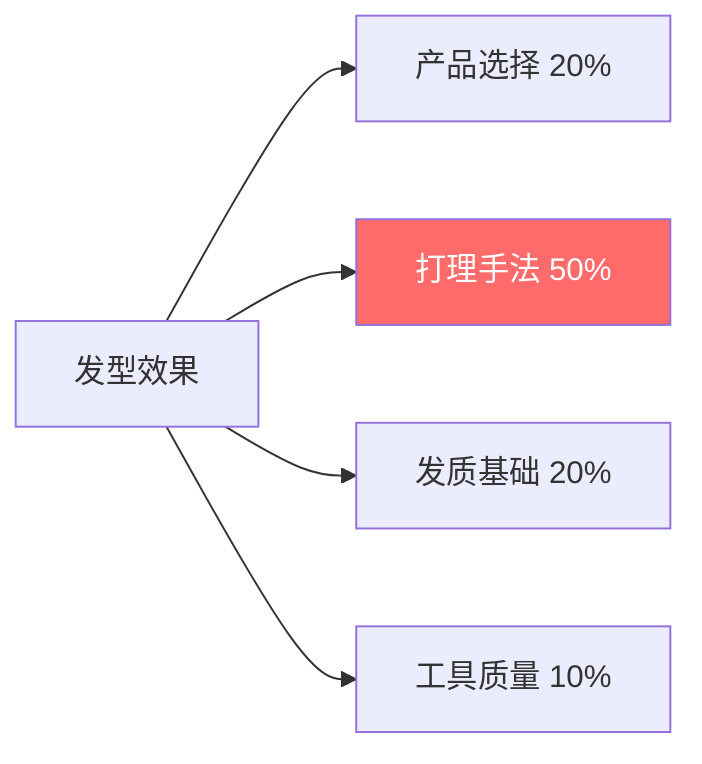
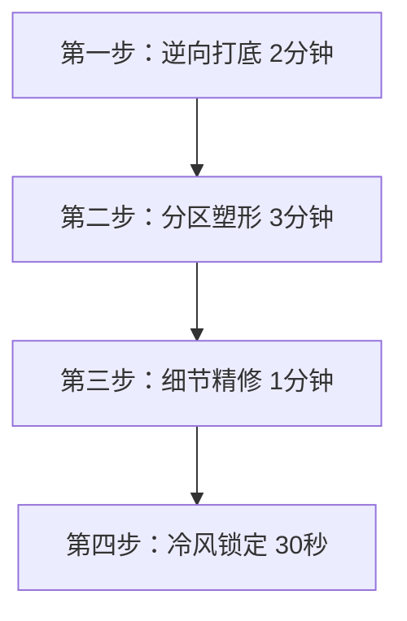
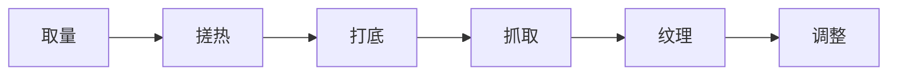

## 二、打理技巧大全

打理技巧是将"理论知识"转化为"镜子里好看发型"的桥梁。再好的发型设计、再贵的造型产品，如果打理手法不到位，最终效果都会大打折扣。本章从底层原理出发，覆盖吹风、造型、定型、全天维护的完整流程，让你每天出门前都能在5-10分钟内搞定一个稳定、好看、持久的发型。

### 2.1 为什么打理技巧比产品更重要

很多人的误区是"买更贵的产品=更好的发型"。事实恰恰相反——同样的产品，打理手法不同，效果可以天差地别。发型师用平价产品也能做出好造型，核心就在于手法。

打理手法占发型效果的50%，是所有因素中权重最高的。这意味着：与其花300块买顶级发蜡，不如花时间把50块发蜡的用法练到极致。

### 2.2 吹风技巧——蓬松的基础

吹风是打造蓬松发型的第一步，也是最关键的一步。湿发状态下，头发的氢键处于"可重塑"状态——这是头发天然的"塑形窗口"。一旦头发自然风干，氢键随机重组，发丝就定型在杂乱无序的方向上，再想整理就事倍功半了。

#### 2.2.1 吹风前的准备工作

**第一步：正确擦干**

洗发后不要用毛巾搓头发。搓揉会让毛鳞片翻起，导致毛躁和断裂。正确做法：

- 用吸水性强的超细纤维毛巾或旧T恤
- 将头发包裹住，轻轻按压、挤压，吸走多余水分
- 目标是让头发从"滴水"状态变为"湿润但不滴水"
- 这一步大约需要2-3分钟

**第二步：预造型产品**

在半干状态涂抹预造型产品，能显著提升后续造型效果：

| 产品类型 | 作用 | 用量 | 适用场景 |
|----------|------|------|----------|
| 打底乳/造型乳 | 增加头发质感和可塑性 | 一元硬币大小 | 日常造型 |
| 海盐喷雾 | 增加纹理感和蓬松度 | 喷5-8次 | 自然凌乱风格 |
| 蓬松摩丝 | 从发根增加支撑力 | 乒乓球大小 | 细软塌发质 |
| 热保护喷雾 | 隔热保护，减少吹风损伤 | 喷3-5次 | 经常使用高温工具 |

涂抹方法：将产品在掌心搓开，从发中到发梢均匀涂抹，然后用手指从发根插入梳理，确保产品分布均匀。

**第三步：准备工具**

- 吹风机：建议功率1800W以上，最好有冷热风切换和风速调节
- 集风嘴：聚拢气流，精准控制风向（必配件）
- 圆梳：直径3-4cm（中长发）或2-3cm（短发），猪鬃毛材质为佳
- 鳄鱼夹/鸭嘴夹：分区固定用

#### 2.2.2 核心吹风四步法

**第一步：逆向打底（建立发根方向）**

这一步的目的是让发根"站起来"，为后续造型建立蓬松基础。

- 低下头，让头发自然垂落（利用重力辅助发根竖立）
- 吹风机装上集风嘴，开中高温+中速风
- 风嘴从下往上贴近发根吹，距离约3-5cm
- 用另一只手的五指插入发根，轻轻抖动，让热风直达根部
- 持续2分钟，不需要吹干，只需让发根建立向上方向
- 吹的时候缓慢左右移动头部，确保各区域均匀受热

**为什么低头吹？** 低头时重力方向反转，头发自然向下垂落，此时从下方吹风，热风会将发根定型在远离头皮的方向——这就是蓬松的物理基础。

**第二步：分区塑形（构建整体轮廓）**

抬起头后，开始构建你想要的发型轮廓。

分区方法：
- 将头发分为四个区域：左前、右前、左侧、右侧（后脑勺随左侧或右侧处理）
- 用鳄鱼夹将不处理的区域固定
- 从后往前、从下往上依次处理

吹风手法：
- 圆梳插入发根，向上提拉（创造高度）
- 吹风机配合圆梳移动，风嘴始终朝向发丝方向（从发根到发梢）
- 吹风机在前、圆梳在后，两者间距约5cm
- 每束头发重复2-3次：热风吹→圆梳定型→冷风固定

关键要点：
- 风嘴一定要顺着毛鳞片方向吹（从上到下、从根到梢），逆着吹会毛躁
- 圆梳提拉的角度决定了蓬松度：角度越大越蓬松，越小越贴合
- 顶部区域用圆梳向外翻，制造弧度和高度
- 刘海区域根据想要的方向用圆梳引导弧度

**第三步：细节精修**

- 用手指抓取顶部，制造纹理感和层次
- 调整刘海的方向和弧度：如果要侧分，用圆梳将刘海向一侧吹出弧度
- 鬓角区域用圆梳向下引导，与两侧衔接自然
- 后脑勺区域用手掌贴合，吹风机对准发根吹，制造后脑勺的饱满弧度

**第四步：冷风锁定**

- 切换冷风档，全头轻吹30秒
- 冷风的作用是让发丝表面温度降低，氢键重新锁定在新位置
- 这一步不要省略——没有冷风定型，热风塑形的效果会在10分钟内消失

#### 2.2.3 针对不同发质的吹风调整

| 发质类型 | 温度设置 | 风速设置 | 特殊技巧 | 注意事项 |
|----------|----------|----------|----------|----------|
| 细软塌 | 中温（不要高温） | 中速 | 逆向吹风时间延长到3分钟，配合蓬松摩丝 | 高温会让细软发更软塌 |
| 粗硬发 | 中高温 | 高速 | 吹风前涂打底乳增加可塑性，多用圆梳塑形 | 需要更多热量才能改变方向 |
| 自然卷 | 低温 | 中低速 | 配合扩散风嘴，顺着卷度方向吹 | 逆着吹会炸毛 |
| 油性头皮 | 中温 | 中速 | 重点吹发根，吹干后撒蓬蓬粉 | 不要吹太久，过热刺激油脂分泌 |
| 干燥发质 | 低温 | 低速 | 吹风前涂热保护喷雾，减少吹风时间 | 避免高温，防止进一步干燥 |

#### 2.2.4 常见吹风错误

| 错误做法 | 为什么错 | 正确做法 |
|----------|----------|----------|
| 全程热风吹到干 | 热量持续作用，头发过度干燥，发根反而变软 | 热风塑形+冷风定型交替 |
| 不用集风嘴 | 气流散开，无法精准控制发根方向 | 始终使用集风嘴 |
| 从上往下压着吹 | 气流把发根压贴头皮 | 从下往上吹发根 |
| 头发全湿就吹 | 水分蒸发消耗大量热量，吹风效率低，损伤大 | 先用毛巾按压到半干 |
| 一个方向猛吹 | 局部过热损伤，其他区域没吹到 | 缓慢移动，均匀受热 |
| 不分区直接吹 | 无法精细控制每片头发的方向 | 必须分区处理 |

### 2.3 梳理与分区技巧

#### 2.3.1 选择合适的梳子

不同的梳子在造型中承担不同角色：

| 梳子类型 | 用途 | 适合场景 | 材质建议 |
|----------|------|----------|----------|
| 圆梳（大号/4cm+） | 吹风时提拉发根、制造弧度 | 顶部和刘海吹风 | 猪鬃毛+尼龙混合 |
| 圆梳（小号/2-3cm） | 刘海精修、发梢卷曲 | 刘海和鬓角细节 | 猪鬃毛 |
| 宽齿梳 | 湿发梳理、解开打结 | 洗发后湿发阶段 | 木质或防静电塑料 |
| 尖尾梳 | 分区、挑发、精细造型 | 分线、分区、挑高发根 | 碳纤维或金属 |
| 鬃毛梳 | 日常梳理、抚平毛躁 | 干发日常整理 | 天然猪鬃毛 |
| 手指 | 最万能的"造型工具" | 全阶段 | — |

**核心原则**：吹风用圆梳，湿发用宽齿梳，干发用鬃毛梳，细节用手指。永远不要在湿发状态下用细齿梳强行梳理——湿发弹性低，容易拉断。

#### 2.3.2 分区技巧

精确分区是专业造型的基础。操作方法：

1. 用尖尾梳的尖端，从前额发际线正中向后画一条线，将头发分为左右两半
2. 再从一侧耳朵上方到头顶画一条弧线，将侧面和顶部分开
3. 另一侧重复
4. 现在你有了四个区域：左前、右前、左后、右后
5. 用鳄鱼夹将不处理的区域夹起来

分区的好处：每次只专注一小片区域，确保每片头发都被充分处理，不会遗漏。

### 2.4 造型产品使用全攻略

造型产品是将吹风塑形的成果"固定"并赋予最终质感的关键。产品选错或用法不对，辛辛苦苦吹好的发型可能半小时就塌了。

#### 2.4.1 发蜡/发泥使用详解

发蜡和发泥是最常用的造型产品，两者的区别：

| 特性 | 发蜡 | 发泥 |
|------|------|------|
| 质地 | 柔软、有粘性 | 干涩、有颗粒感 |
| 光泽 | 哑光到中等光泽 | 完全哑光 |
| 定型力 | 中-强 | 中-强 |
| 可重塑性 | 高（可以反复调整） | 中（调整后质感会变） |
| 最佳用途 | 纹理碎盖、侧分、需要光泽感的造型 | 前刺、凌乱感、需要干涩质感的造型 |

**六步涂抹法**：

第一步：取量
- 短发：黄豆大小（约1cm³）
- 中长发：花生米大小（约1.5cm³）
- 初次使用从少量开始，不够再加——取多了会油腻结块，补救很麻烦

第二步：搓热
- 将产品放在双掌心之间
- 双手快速搓动5-10秒，直到产品变得透明、均匀分布在掌心和指缝
- 搓热的目的是让蜡质软化，更容易均匀涂抹
- 判断标准：手掌看起来像是涂了一层薄薄的透明膜

第三步：打底（建立基础）
- 双手五指张开，从两侧插入发根
- 轻轻合拢手掌，让产品从发根开始附着在发丝上
- 从前到后、从两侧到顶部，确保发根区域都有产品
- 这一步决定了发型的"骨架"——发根有支撑力，整体就不会塌

第四步：抓取（建立形状）
- 五指微张，像梳子一样从发根到发梢抓取
- 顶部区域向上提拉，制造高度
- 两侧区域向后梳理，保持服帖
- 刘海区域按照想要的方向引导
- 力度适中：太轻产品只停留在表面，太重会压塌发根

第五步：纹理（赋予质感）
- 用食指和拇指捏取发梢，轻轻搓转
- 这会制造出自然的"条束感"，让发型看起来有层次
- 不要过度搓转——每束头发搓1-2次即可
- 顶部和刘海重点处理，两侧和后脑勺简单带过

第六步：调整（最终精修）
- 站到镜子前，从正面、侧面、45度角分别检查
- 用手指微调不满意的地方
- 如果某处塌了，用手指挑起发根，轻轻抖动
- 如果某处太突兀，用手掌轻轻按压抚平

#### 2.4.2 定型喷雾使用详解

定型喷雾是最后一道"保险"，锁定整体造型。

**正确使用方法**：

1. 距离头发20-30cm（约一个前臂的长度）
2. 喷雾不要对着一个点喷——来回移动，像"扫射"一样
3. 重点区域：头顶（最容易塌的地方）和刘海（最容易变形的地方）
4. 每个重点区域喷2-3次，其他区域1次即可
5. 喷完后绝对不要用手碰——等待30秒自然干燥成膜
6. 如果需要更强的定型力，可以分层喷：喷一层→等待10秒→再喷一层

**定型力选择指南**：

| 定型等级 | 适用场景 | 产品特征 | 注意事项 |
|----------|----------|----------|----------|
| 轻度定型 | 日常通勤、自然风格 | 喷雾细密，头发仍可自由摆动 | 持久力约4-6小时 |
| 中度定型 | 商务场合、需要整天保持 | 喷雾中等，头发略有硬感 | 持久力约8-10小时 |
| 强力定型 | 特殊场合、户外活动 | 喷雾浓密，头发有明显硬壳感 | 不宜天天使用，清洗要彻底 |

#### 2.4.3 蓬蓬粉使用详解

蓬蓬粉是细软塌发质的"救命神器"，但很多人用法不对，导致头发结块或有白色粉末残留。

**正确用法**：
1. 确保头发是干的（湿发使用会结块）
2. 将蓬蓬粉倒在手掌心（不要直接倒在头发上）
3. 双手搓开，让粉末均匀分布在手指间
4. 五指插入发根，轻轻揉搓发根区域
5. 从头顶开始，向四周扩展
6. 用量控制：第一次用半指盖的量，效果不够再加

**常见错误**：
- 直接倒在头发上→白色粉末残留，像头皮屑
- 用量过多→头发变得干涩、打结
- 用在湿发上→结块，反而更塌
- 不洗掉就睡觉→堵塞毛囊，长期使用可能导致脱发

#### 2.4.4 海盐喷雾使用详解

海盐喷雾能模拟海边风吹日晒后的自然纹理效果，非常适合打造"不经意的好看"。

**使用方法**：
1. 在微湿或干发上使用（干发效果更明显）
2. 距离头发15-20cm，均匀喷洒
3. 用量：短发5-8次，中长发10-15次
4. 喷完后用手指从发根向上抓取，制造凌乱纹理
5. 不需要用吹风机，自然风干效果更好

**搭配建议**：海盐喷雾+少量哑光发泥=最自然的日常造型。先喷海盐喷雾打底，再用发泥固定细节。

#### 2.4.5 产品组合使用策略

单个产品很难满足所有需求，高手通常会组合使用：

| 组合方案 | 产品搭配 | 适合场景 | 使用顺序 |
|----------|----------|----------|----------|
| 日常基础 | 打底乳+发蜡+定型喷雾 | 通勤、日常 | 吹风前→吹风后→出门前 |
| 极致蓬松 | 蓬松摩丝+蓬蓬粉+发泥 | 细软塌发质 | 湿发→干发→造型时 |
| 自然纹理 | 海盐喷雾+发蜡 | 休闲、约会 | 湿发→吹风后 |
| 商务精致 | 打底乳+发油/发蜡+强力喷雾 | 正式场合 | 湿发→吹风后→出门前 |
| 运动清爽 | 少量发泥 | 健身、户外 | 干发直接使用 |

### 2.5 早晨快速打理流程

对于忙碌的工作日，需要一个高效、稳定、可重复的打理流程。以下提供三种时间方案：

#### 2.5.1 极速版：3分钟出门

适用于：起晚了、赶时间、头发状态还不错的情况

0:00-0:30  用手沾水，简单抓湿头发，整理大方向
0:30-1:30  吹风机热风，重点吹发根（低头逆吹30秒+抬头吹顶部30秒）
1:30-2:30  取少量发蜡搓热，从发根抓取，简单定型
2:30-3:00  手指调整刘海方向，出门

极速版的取舍：省略了分区、精修、定型喷雾等步骤，发型精致度约70%，但足够应对大多数日常场景。

#### 2.5.2 标准版：5分钟出门

适用于：正常工作日，希望发型整洁有型

0:00-0:30  毛巾按压吸走多余水分
0:30-1:00  涂抹打底乳，从发根到发梢
1:00-2:30  吹风机分区吹：低头逆吹发根→抬头分区塑形→冷风定型
2:30-3:30  发蜡六步法：取量→搓热→打底→抓取→纹理→调整
3:30-4:00  调整刘海和鬓角
4:00-5:00  喷定型喷雾，出门

#### 2.5.3 精致版：8-10分钟出门

适用于：重要场合、约会、需要发型完美持久的情况

0:00-1:00  毛巾按压+涂抹预造型产品（打底乳/海盐喷雾）
1:00-4:00  精细分区吹风：四个区域逐一处理，每区用圆梳+热风+冷风
4:00-6:00  发蜡精细造型：打底→抓取→纹理→精修
6:00-7:00  蓬蓬粉加强发根支撑（可选）
7:00-8:00  用尖尾梳精修分线和细节
8:00-9:00  分层喷定型喷雾，等待成膜
9:00-10:00 最终检查：正面、侧面、后脑勺，微调

### 2.6 全天维护技巧

发型不是"出门那一刻"就结束了。从出门到回家，有8-12个小时的时间跨度，发型会受到风、汗、触摸、帽子等因素的破坏。学会全天维护，才能保证晚上见人时发型依然在线。

#### 2.6.1 通勤路上的保护

- 骑车/电动车：戴头盔前，用手掌将头发向后压平，头盔取下后用手指向上拨起发根，简单整理
- 地铁/公交：避免靠窗被风吹，如果风大可以用手护住刘海区域
- 开车：空调不要对着头顶吹，热风会让发蜡融化变形

#### 2.6.2 办公室急救

- 中午头发塌了：去洗手间，用沾湿的手指插入发根，向上提拉抖动，然后用纸巾擦干多余水分——相当于"微洗头+重新吹风"
- 刘海变形了：用手指沾少量水，重新整理刘海方向，用吹风机（如果有的话）或自然风干
- 出油变塌：用吸油面纸按压额头和发际线（不要直接按头发），然后撒少量蓬蓬粉

#### 2.6.3 随身携带的应急装备

建议在办公室或随身包里放以下物品：

| 物品 | 用途 | 体积 |
|------|------|------|
| 小包装发蜡（旅行装） | 随时补造型 | 约拇指大小 |
| 蓬蓬粉 | 应急去油蓬松 | 约指盖大小 |
| 小梳子/口袋梳 | 快速整理 | 可折叠款 |
| 吸油面纸 | 按压额头去油 | 薄片，不占空间 |
| 小喷雾瓶（装水） | 打湿头发重新造型 | 30ml旅行瓶 |

### 2.7 夜间准备——为明天的发型打基础

好的发型不是从早上开始的，而是从前一天晚上就开始准备的。

#### 2.7.1 睡前洗头 vs 早上洗头

| 对比项 | 睡前洗头 | 早上洗头 |
|--------|----------|----------|
| 发型控制力 | 较低（睡一觉头发会变形） | 较高（湿发直接造型） |
| 时间效率 | 节省早上的时间 | 需要多花10-15分钟 |
| 适合发质 | 粗硬发质（不容易变形） | 细软塌发质（需要湿发塑形） |
| 建议做法 | 吹干后用丝绸枕套 | 起床后直接洗 |

**如果你必须睡前洗头**：
1. 一定要彻底吹干——湿发睡觉不仅变形，还容易滋生细菌
2. 吹干后用手掌将头发向想要的方向压平
3. 戴上丝绸睡帽或使用丝绸枕套（减少摩擦导致的毛躁和变形）
4. 第二天早上用沾湿的手指简单整理即可

#### 2.7.2 丝绸枕套的好处

丝绸枕套不是智商税，它对发型维护有实际价值：

- 摩擦系数低：头发在枕头上滑动而不是摩擦，减少毛躁和静电
- 不吸油：棉质枕套会吸收头发上的油脂，丝绸不会，保持头发的自然油脂平衡
- 保持造型：睡前吹好的发型，第二天早上变形程度明显减少

### 2.8 不同季节的打理调整

头发状态会随季节变化，打理策略也需要相应调整。

#### 2.8.1 夏季（高温+出汗+出油）

**核心挑战**：油脂分泌旺盛，出汗导致发型塌陷，紫外线损伤发质

**应对策略**：
- 洗发频率：建议每天或隔天洗发，不要让油脂积累
- 产品选择：以哑光、清爽型产品为主（发泥、海盐喷雾），避免油基产品
- 吹风调整：温度适当降低，风速提高，快速吹干减少出汗
- 随身携带蓬蓬粉，中午补一次
- 如果出汗严重，用纸巾按压额头吸汗，不要用手摸头发

#### 2.8.2 冬季（干燥+静电+帽子）

**核心挑战**：空气干燥导致静电，帽子压塌发型，室内外温差大

**应对策略**：
- 洗发频率：可以降低到隔天或每两天一次
- 产品选择：增加保湿型产品（含角蛋白、透明质酸的打底乳），减少干燥感
- 戴帽子前：用定型喷雾加强定型，帽子取下后用手指向上拨起发根
- 抗静电：使用含抗静电成分的护发喷雾，或者在手上沾少量护发精油，轻抚头发表面
- 吹风温度不要太高——冬季头发本身就干燥，高温会加剧损伤

#### 2.8.3 梅雨季/潮湿天气

**核心挑战**：空气湿度高，头发吸水膨胀变形，卷曲毛躁

**应对策略**：
- 产品选择：强定型产品（强力发蜡+定型喷雾双保险），防止湿气破坏造型
- 吹风要彻底：潮湿天气下头发更难干透，多吹1-2分钟确保完全干燥
- 出门前多喷一层定型喷雾
- 随身带小包装发蜡，随时修补

### 2.9 常见打理问题的急救方案

#### 2.9.1 发蜡取多了，头发油腻结块

**急救步骤**：
1. 不要用水冲——水会让发蜡更难处理
2. 用干毛巾或纸巾，按压头发吸走多余产品
3. 用吹风机热风从发根吹10秒，让多余发蜡软化
4. 用纸巾再次按压
5. 如果还是很油腻，用少量散粉/蓬蓬粉吸附

#### 2.9.2 发型吹好了但很快塌了

**排查原因**：
1. 发根没有彻底吹干→重新低头逆吹发根
2. 没有用定型喷雾→补喷定型喷雾
3. 发蜡用量不够→从发根补涂少量发蜡
4. 发质太细软→考虑使用蓬松摩丝打底，或在发根撒蓬蓬粉
5. 产品选择不对→换用更强定型力的产品

#### 2.9.3 两侧头发翘起来

**急救步骤**：
1. 用手指沾少量水或发蜡
2. 将翘起的头发向下压，贴合头部轮廓
3. 用吹风机热风从上往下吹5秒
4. 切换冷风固定3秒
5. 如果还是翘，用少量强力发胶喷在翘起处

#### 2.9.4 刘海分叉/不听话

**急救步骤**：
1. 用手指沾水，将刘海打湿
2. 用圆梳将刘海向想要的方向吹风定型
3. 如果没有吹风机，用手指将刘海反复向一个方向梳理
4. 涂少量发蜡固定方向
5. 喷少量定型喷雾

### 2.10 进阶技巧：专业级打理手法

#### 2.10.1 手指造型法（不用梳子）

很多专业发型师反而更喜欢用手指而不是梳子——手指的触感更敏锐，能精确控制每一束头发的方向和力度。

**练习方法**：
- 取适量发蜡，搓热后
- 用食指和中指像"筷子"一样夹住一束头发
- 从发根滑到发梢，同时轻轻扭转
- 重复操作，每次取不同方向的发束
- 最终效果是自然的、不规则的纹理——比梳子造型更有"空气感"

#### 2.10.2 反向定型法

先喷定型喷雾，再用手指做最后调整——这与常规流程相反，但能让发型在保持整体形状的同时有自然的细节变化。

**操作步骤**：
1. 完成吹风和发蜡造型
2. 喷一层轻度定型喷雾
3. 等待10秒让喷雾半干
4. 用手指轻轻拨动几束头发，制造"不经意"的凌乱感
5. 不要再喷喷雾——让这些细节保持自然

#### 2.10.3 分层造型法

对于中长发，分层造型能让发型更有立体感：

1. 将头发分为上下两层（用尖尾梳在头顶画一条水平线）
2. 下层先用发蜡固定方向和基本形状
3. 上层用发蜡制造纹理和高度
4. 上层头发自然覆盖在下层之上，形成层次感
5. 最后用定型喷雾固定

这种方法的好处是：即使表面被风吹乱了，底层仍然保持整齐，整体不会太崩。

### 2.11 打理技巧的练习路径

任何技巧都需要练习才能熟练。以下是建议的练习计划：

| 阶段 | 时间 | 练习重点 | 目标 |
|------|------|----------|------|
| 入门 | 第1-2周 | 基本吹风四步法 | 能在10分钟内吹出蓬松效果 |
| 进阶 | 第3-4周 | 发蜡六步法 | 能均匀涂抹，制造纹理 |
| 熟练 | 第2-3月 | 分区精修+产品组合 | 能在5分钟内完成标准版流程 |
| 精通 | 第3-6月 | 手指造型+进阶技巧 | 能根据场合灵活调整风格 |

**练习建议**：
- 不要在重要出门前练习新技巧——选择周末或不出门的日子
- 每次练习后拍照记录，对比不同手法的效果
- 找到最适合自己的固定流程后，反复练习直到成为肌肉记忆
- 最终目标：不需要思考，闭着眼睛也能完成标准流程

***
