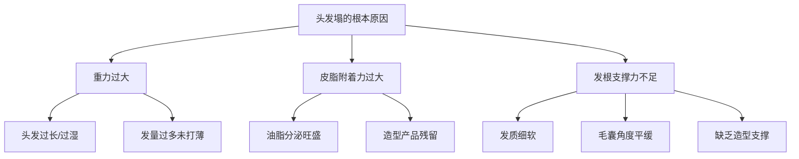
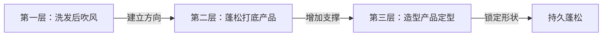
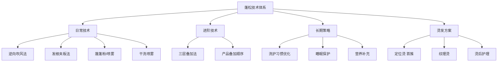

## 三、蓬松技术深度解析

蓬松是细软塌发质最核心的造型需求。前面的打理技巧大全已经介绍了基本吹风和产品使用方法，本章将从**原理机制→分层技术→产品化学→场景方案→长期策略**五个维度，系统性地拆解蓬松这件事。目标是让你不仅知道"怎么做"，更理解"为什么这样做"，从而能够灵活应对各种场景。

### 3.1 蓬松的物理学：为什么头发会塌

要解决头发塌的问题，先要理解头发塌的物理机制。头发塌不是"头发不好"，而是**力学平衡问题**。

#### 3.1.1 三力模型

每一根头发都受到三个力的作用：

| 力 | 方向 | 来源 | 影响因素 |
|---|---|---|---|
| **重力** | 向下 | 头发自身重量 | 头发越长、越粗、越湿，重力越大 |
| **皮脂附着力** | 向下（贴头皮） | 头皮分泌的油脂 | 油脂越多，头发越贴头皮 |
| **发根支撑力** | 向上（向外） | 毛囊角度和发根硬度 | 发根越硬、毛囊角度越大，支撑力越强 |

当**重力 + 皮脂附着力 > 发根支撑力**时，头发就塌了。

#### 3.1.2 蓬松的核心策略

理解了三力模型，蓬松策略就清晰了——从三个方向同时发力：

**策略一：减少重力**
- 打薄发量，减少头发自重（理发师打薄至60-70%）
- 吹干头发，消除水分增加的重量
- 控制头发长度，过长的头发必然塌

**策略二：减少皮脂附着力**
- 清洁头皮油脂（洗发、干洗喷雾）
- 吸附多余油脂（蓬蓬粉、散粉）
- 控制油脂分泌（控油洗发水、头皮护理）

**策略三：增加发根支撑力**
- 物理支撑：吹风塑形、圆梳提拉、发根夹板
- 化学支撑：定型喷雾、发蜡发泥
- 结构支撑：纹理烫、定位烫

**实际操作中，三种策略往往同时使用。** 比如"洗头+吹风+发蜡+定型喷雾"就是一个完整的三策略组合。

### 3.2 日常蓬松技术：四大核心方法

#### 3.2.1 方法一：逆向吹风法（最基础）

逆向吹风是所有蓬松技术的基础，原理是**利用热风改变发根的氢键方向**。

**科学原理**：头发中的氢键在湿润状态下是松弛的，可以被重新排列。热风蒸发水分的同时"锁定"了新的氢键位置，让发根记住向上的方向。这就是为什么吹风必须在头发半干时开始——太干氢键已经固定，太湿热风效率低。

**标准操作流程**：

1. **准备阶段**（洗发后）
   - 用毛巾轻轻按压吸走多余水分，不要搓揉（搓揉会让毛鳞片张开，头发更毛躁）
   - 等到头发不滴水但仍有湿度（约60-70%干）时开始吹风
   - 准备好吹风机（最好有冷热风切换功能）和圆梳

2. **建立方向**（关键步骤）
   - 低头，让头发自然垂落，全部倒向面部方向
   - 吹风机调至中高温，风速中档
   - 风嘴贴近头皮，从后向前、从下向上吹发根
   - 持续1-2分钟，让所有发根都获得"向上"的方向记忆

3. **分区精修**
   - 抬起头，分区处理：先顶部，再两侧，最后刘海
   - 用圆梳插入发根，向上提拉的同时吹风机对着发根吹
   - 每个区域吹完后，切换冷风档固定3-5秒（冷风让氢键快速锁定）

4. **最终定型**
   - 全头用冷风轻吹30秒，整体固定
   - 用手轻轻拨动，检查蓬松效果

**关键细节**：

| 要素 | 正确做法 | 常见错误 | 后果 |
|---|---|---|---|
| 吹风方向 | 从下向上吹发根 | 从上向下压 | 头发越吹越塌 |
| 温度 | 中高温塑形+冷风定型 | 全程热风 | 损伤头发，定型不持久 |
| 风速 | 中档 | 最高档 | 风力太大会吹散已塑形的发根 |
| 时机 | 半干状态开始 | 全干后再吹 | 氢键已固定，改变方向困难 |
| 持续时间 | 每区域30-50秒 | 草草吹几下 | 氢键未充分重排，效果短暂 |

#### 3.2.2 方法二：发根夹板法（精准提拉）

发根夹板法使用迷你直板夹（宽度1-2cm）在发根处制造精确的蓬松弧度。与吹风相比，夹板能提供更高的温度和更精确的控制，适合需要**精细调整局部蓬松度**的场景。

**工具选择**：

| 工具类型 | 温度范围 | 适合发质 | 推荐品牌 |
|---|---|---|---|
| 陶瓷面板迷你夹 | 120-180°C | 细软发质（低温档） | 飞利浦、松下 |
| 负离子迷你夹 | 120-200°C | 中等发质 | GHD、CREATE ION |
| 钛金属面板夹 | 150-230°C | 粗硬发质 | Babyliss、GHD |

**标准操作流程**：

1. **预热夹板**：细软发质用120-150°C，中等发质用150-180°C
2. **分区**：将头发分为顶部、两侧、刘海三个区域
3. **取发束**：每次取一束约1-2cm宽的头发（太厚效果不均匀）
4. **夹持**：将夹板夹在发根处（距离头皮约1-2cm），轻轻向上提拉
5. **保持**：保持2-3秒后松开（不要超过5秒，避免损伤）
6. **重复**：对需要蓬松的区域逐一处理

**进阶技巧——"Z字形夹法"**：

普通夹板法只在发根制造一个弧度，效果有限。Z字形夹法通过在发根制造多个小弧度，让蓬松效果更自然、更持久：

1. 夹板夹住发根，向上提拉1cm
2. 松开，向下移动0.5cm
3. 再次夹持，向上提拉1cm
4. 松开，向下移动0.5cm
5. 重复3-4次，在发根区域形成"Z"字形的多个小弧度

**注意事项**：
- 夹板温度不要超过180°C（细软发质不超过150°C），否则会损伤角蛋白
- 每次夹持时间不超过3秒
- 夹板不要直接接触头皮，保持1-2cm距离
- 使用前可以在发根喷少量热保护喷雾
- 每周使用不超过3-4次，避免累积热损伤

#### 3.2.3 方法三：蓬蓬粉/蓬松喷雾（即时效果）

蓬蓬粉和蓬松喷雾是专门为细软塌发设计的"急救"产品，效果立竿见影。

**产品类型对比**：

| 产品 | 主要成分 | 原理 | 效果 | 持续时间 | 适合场景 |
|---|---|---|---|---|---|
| 蓬蓬粉 | 二氧化硅微粒、淀粉 | 吸附油脂+增加发丝摩擦力 | 强蓬松 | 4-8小时 | 出门前急救 |
| 蓬松喷雾 | 聚合物、酒精、硅粉 | 在发丝表面形成支撑膜 | 中蓬松 | 3-6小时 | 整体造型打底 |
| 头发散粉 | 滑石粉、玉米淀粉 | 吸附油脂 | 弱蓬松 | 2-4小时 | 临时应急 |
| 纹理粉 | 二氧化硅+聚合物 | 吸油+支撑+纹理 | 强纹理+蓬松 | 4-8小时 | 需要纹理感的造型 |

**蓬蓬粉使用要点**：

1. **取量**：少量多次。第一次只用一小撮（约0.5g），不够再加
2. **涂抹位置**：只涂在发根，不要涂在发梢（涂发梢会让头发干涩打结）
3. **手法**：将粉末倒在指尖，用指腹轻轻揉搓发根，让粉末均匀分布在发根周围
4. **效果增强**：揉搓后用手向上提拉发根，效果更明显
5. **清洁**：当天必须洗头，蓬蓬粉长时间留在头皮上可能堵塞毛囊

**蓬松喷雾使用要点**：

1. **距离**：距离发根15-20cm喷洒
2. **用量**：轻喷2-3次，不要喷太多（太多会让头发变硬发白）
3. **等待**：喷完后等待10-15秒，让酒精挥发、聚合物成膜
4. **造型**：用手指向上提拉发根，配合产品效果
5. **叠加**：可以与发蜡叠加使用——先用蓬松喷雾打底，再用发蜡造型

#### 3.2.4 方法四：干洗喷雾（控油蓬松）

干洗喷雾的核心功能是**去除油脂**，通过吸附头皮分泌的皮脂来恢复头发的蓬松感。它不是造型产品，而是"临时洗头替代品"。

**工作原理**：干洗喷雾中的淀粉或硅粉颗粒吸附油脂后膨胀，使油脂从发根脱落。同时，粉末在发丝之间形成微小的间隔，增加发丝间距，产生蓬松效果。

**标准操作流程**：

1. 距离发根15cm喷洒，分区处理（不要一次喷全头）
2. 等待30-60秒，让粉末充分吸附油脂
3. 用手指轻轻按摩发根，帮助粉末分布和油脂脱落
4. 用梳子梳理，去除白色粉末残留
5. 用手提拉发根，恢复蓬松

**干洗喷雾 vs 蓬蓬粉**：

| 对比维度 | 干洗喷雾 | 蓬蓬粉 |
|---|---|---|
| 核心功能 | 去油 | 蓬松 |
| 蓬松效果 | 中等 | 强 |
| 去油效果 | 强 | 中等 |
| 使用时机 | 油腻但不想洗头时 | 需要蓬松效果时 |
| 可否叠加造型产品 | 可以 | 可以（先粉后蜡） |
| 适合频率 | 隔天使用 | 每天可用 |

### 3.3 进阶蓬松技术：多层叠加法

单一方法往往不够，尤其是对于油脂分泌旺盛、发质极细软的人。进阶技术是**多层叠加**——在不同阶段使用不同产品，层层构建蓬松。

#### 3.3.1 三层蓬松法

**第一层：吹风塑形**（洗发后）

这是最基础也是最重要的一步。吹风决定了发根的基本方向和蓬松基础。

- 低头逆向吹风，建立发根向上方向
- 用圆梳提拉顶部发根，制造拱起弧度
- 冷风定型，锁定氢键

**第二层：蓬松打底**（吹干后）

在吹风基础上叠加蓬松产品，增加发根的支撑力。

- 在发根喷少量蓬松喷雾（距离15cm，轻喷2次）
- 等待10秒让产品成膜
- 用手指提拉发根，让产品均匀分布

或者：
- 在发根拍少量蓬蓬粉（仅在容易塌的区域）
- 用指腹揉搓发根，让粉末均匀分布

**第三层：造型产品定型**（出门前）

用发蜡或发泥抓出最终造型，同时进一步强化蓬松。

- 取黄豆大小发蜡，搓开
- 从发根向上抓取，制造纹理和蓬松
- 顶部区域重点提拉
- 喷少量定型喷雾固定

**三层叠加的效果**：比单一方法持久2-3倍。单用吹风可能维持3-4小时，三层叠加可以维持6-8小时甚至一整天。

#### 3.3.2 产品叠加顺序原则

多层叠加时，产品顺序很重要。基本原则是**从轻到重、从水基到油基**：

| 顺序 | 产品类型 | 原因 |
|---|---|---|
| 第一步 | 蓬松喷雾/热保护喷雾 | 水基配方，轻薄，不影响后续产品吸收 |
| 第二步 | 蓬蓬粉/纹理粉 | 粉状产品，需要在湿性产品之前使用 |
| 第三步 | 发蜡/发泥 | 油基或蜡基配方，较重，放在最后塑形 |
| 第四步 | 定型喷雾 | 成膜剂，封层固定，最后使用 |

**错误顺序的后果**：
- 先用发蜡再用蓬蓬粉 → 粉末无法附着在已涂蜡的发丝上，效果大打折扣
- 先用定型喷雾再用发蜡 → 发蜡无法均匀分布，造型不自然
- 蓬蓬粉用量过大后再用发蜡 → 头发变得干涩、结块

### 3.4 不同场景的蓬松方案

#### 3.4.1 日常通勤（5分钟）

**目标**：自然蓬松，不夸张，持续8小时

**方案**：
1. 洗发后逆向吹风（3分钟）
2. 发根喷少量蓬松喷雾（10秒）
3. 发蜡抓取造型（1分钟）
4. 冷风定型（10秒）

**产品组合**：蓬松喷雾 + 哑光发蜡 + 定型喷雾

#### 3.4.2 运动/户外（防水防汗）

**目标**：蓬松持久，不怕出汗

**方案**：
1. 洗发后逆向吹风至完全干透（比日常多吹1分钟）
2. 发根使用蓬蓬粉（比日常多用量）
3. 发泥抓取造型（发泥比发蜡更耐汗）
4. 强力定型喷雾固定（选防水配方）

**关键调整**：
- 吹风要吹得更干，减少水分导致的塌发
- 蓬蓬粉用量可以多一些，吸汗同时保持蓬松
- 发泥的干涩质感比发蜡更耐汗
- 定型喷雾选强力型或防水型

#### 3.4.3 约会/重要场合（精致蓬松）

**目标**：精致但自然，不能看出"精心打理过"

**方案**：
1. 提前一天晚上做发膜护理（增加头发弹性和光泽）
2. 当天洗发后逆向吹风+圆梳精修（5分钟）
3. 发根夹板法精细调整顶部弧度（3分钟）
4. 发蜡抓取纹理，追求自然感（2分钟）
5. 蓬蓬粉在顶部发根轻拍一点（20秒）
6. 定型喷雾轻喷固定（10秒）

**关键技巧**：
- 追求"不经意的精致"——蓬松但不炸毛
- 定型喷雾用量要少，避免头发变硬
- 可以留几缕碎发自然垂落，增加自然感

#### 3.4.4 油头急救（来不及洗头）

**场景**：早上起床发现头发又油又塌，但来不及洗头

**急救方案**（3分钟）：

1. **干洗喷雾**（1分钟）：分区喷洒在发根，等待30秒后用手指按摩
2. **蓬蓬粉**（30秒）：在最塌的区域（通常是头顶）拍少量蓬蓬粉
3. **吹风机**（1分钟）：快速用热风从发根向上吹30秒，然后冷风定型
4. **发蜡**（30秒）：少量发蜡抓取造型

**原理**：干洗喷雾去除油脂（解决"油"），蓬蓬粉增加摩擦力（解决"塌"），吹风重建方向（解决"乱"），发蜡定型（解决"散"）。四步组合可以在3分钟内把"油塌乱"变成"干净蓬松"。

#### 3.4.5 出差/旅行（简化版）

**场景**：酒店里，没有全套工具

**精简方案**：
1. 酒店吹风机逆向吹风（大多数酒店吹风机够用）
2. 随身携带的蓬蓬粉拍发根
3. 旅行装发蜡抓造型

**出差必备小样**：蓬蓬粉（小罐装）、旅行装发蜡、便携定型喷雾（50ml以下可带上飞机）

### 3.5 长期蓬松策略

日常技术解决的是"今天怎么蓬松"，长期策略解决的是"怎么从根本上改善塌发"。

#### 3.5.1 洗护习惯优化

| 习惯 | 调整方向 | 原理 | 预期效果 |
|---|---|---|---|
| 洗发频率 | 油性头皮每天或隔天洗 | 去除油脂，减少附着力 | 洗发当天蓬松度提升50% |
| 护发素使用 | 只涂发梢，避开发根 | 减少发根负担 | 发根不再被护发素压塌 |
| 洗发水选择 | 使用蓬松型/控油型洗发水 | 控油+增加发丝摩擦力 | 长期改善出油和塌发 |
| 头皮去角质 | 每周1次 | 清除毛囊周围堆积物 | 毛囊更健康，发根更强 |
| 深层护理 | 每周1次发膜（只涂发中到发梢） | 修复毛鳞片，增加弹性 | 头发更健康，造型更持久 |

#### 3.5.2 睡眠蓬松保护

睡觉时的头发状态会直接影响第二天的蓬松度。

**枕套选择**：
- **丝绸/缎面枕套**：摩擦系数低，减少头发与枕头之间的摩擦，睡觉时头发不会被压扁变形
- **棉质枕套**：摩擦系数高，头发容易被压扁，第二天需要更多时间恢复蓬松

**睡前处理**：
- 不要湿着头发睡觉——湿发在枕头上被压8小时，第二天必然塌
- 如果晚上洗头，一定要吹干再睡
- 可以在睡前将头发向上拨，让发根保持向上的方向

**起床恢复**：
- 起床后先用手抓松头发，恢复基本形状
- 喷少量水（喷雾瓶），用吹风机快速从发根向上吹30秒
- 如果还是很塌，拍少量蓬蓬粉

#### 3.5.3 饮食与营养

头发的质量（包括粗细和弹性）与营养摄入直接相关。以下营养素对头发蓬松度有直接影响：

| 营养素 | 对蓬松的作用 | 缺乏后果 | 推荐摄入量 | 最佳食物来源 |
|---|---|---|---|---|
| 蛋白质 | 角蛋白原料，决定发丝粗细 | 头发变细变软 | 每公斤体重1.2-1.5g | 鸡胸肉、鸡蛋、鱼、豆腐 |
| 铁 | 携氧至毛囊，促进生长 | 脱发、发质变差 | 男性8mg/天 | 红肉、菠菜、黑木耳 |
| 锌 | 细胞分裂，毛囊健康 | 头发稀疏 | 11mg/天 | 牡蛎、牛肉、南瓜子 |
| 生物素 | 角蛋白合成辅酶 | 头发脆弱易断 | 30μg/天 | 鸡蛋黄、坚果、牛油果 |
| 维生素D | 毛囊激活 | 脱发风险增加 | 600IU/天 | 阳光、三文鱼、蛋黄 |
| Omega-3 | 头皮油脂平衡 | 头皮干燥或过油 | 250-500mg/天 | 深海鱼、亚麻籽、核桃 |

**特别说明**：蛋白质摄入不足对蓬松度的影响最直接。角蛋白是头发的主要成分，蛋白质摄入不足会导致新长出的头发更细更软，从根本上降低发根支撑力。如果你的头发近年来变得越来越细软，除了遗传因素外，优先检查蛋白质摄入量。

#### 3.5.4 烫发方案：从根源解决蓬松

如果日常打理和长期护理都无法满足蓬松需求，烫发是最有效的"一劳永逸"方案。烫发通过化学手段改变头发的内部结构，从根本上增加发根的支撑力和发丝的蓬松感。

**烫发类型对比**：

| 烫发类型 | 原理 | 效果 | 持续时间 | 损伤程度 | 适合程度 | 价格区间 |
|---|---|---|---|---|---|---|
| **定位烫** | 只烫发根区域，改变发根方向 | 发根立起来，自然蓬松 | 2-3个月 | 低 | ⭐⭐⭐⭐⭐ | 150-300元 |
| **纹理烫** | 全头局部处理，增加纹理 | 自然的纹理感和蓬松 | 2-3个月 | 低 | ⭐⭐⭐⭐⭐ | 200-400元 |
| **冷烫** | 室温化学反应，整体卷曲 | 自然卷曲效果 | 3-6个月 | 中等 | ⭐⭐⭐ | 150-300元 |
| **热烫/数码烫** | 加热辅助，卷曲更持久 | 更自然更持久的卷曲 | 4-8个月 | 中等偏高 | ⭐⭐⭐ | 300-600元 |
| **锡纸烫** | 锡纸包裹，制造不规则卷曲 | 纹理感强，蓬松度高 | 3-4个月 | 中等 | ⭐⭐⭐ | 200-400元 |

**推荐方案：定位烫**

对于头发塌的核心问题，**定位烫**是最佳选择。原因如下：

1. **精准解决问题**：只处理发根区域，不改变头发整体形态
2. **效果自然**：看不出烫过，只是发根"站起来了"
3. **损伤最小**：只处理2-3cm的发根区域，对整体发质影响极小
4. **维护简单**：烫后日常打理更省力，吹风5分钟就能出门
5. **持续时间适中**：2-3个月，与理发周期匹配

**定位烫的详细流程**：

1. **咨询**：与发型师沟通，确认发质是否适合（受损发质不建议）
2. **分区**：发型师将头发分为顶部、两侧、后脑区域
3. **上杠**：用小号卷杠（直径约1cm）在发根处卷起2-3cm
4. **涂药**：涂抹还原剂，打破发根处的二硫键
5. **等待**：根据发质等待10-20分钟（细软发质时间短，粗硬发质时间长）
6. **冲洗**：冲洗掉还原剂
7. **定型**：涂抹中和剂，在新位置重建二硫键
8. **等待**：5-10分钟
9. **完成**：冲洗干净，吹干造型

**烫后护理要点**：

- **前48小时**：不要洗发、不要用梳子梳理、不要扎头发（让二硫键充分稳定）
- **前两周**：使用烫后专用洗护产品，含修复成分
- **日常**：减少热造型工具的使用，已经烫过的发根不需要再用夹板
- **每周**：使用1次发膜，重点涂在发中到发梢（发根已烫过，不需要额外滋润）
- **每月**：回理发店修剪，保持发型轮廓

**烫发与日常蓬松的配合**：烫发后，日常蓬松打理变得简单很多——洗发后低头逆向吹风1分钟即可，不需要蓬蓬粉和发根夹板。但如果你想追求更精致的效果，仍然可以叠加使用发蜡和定型喷雾。

### 3.6 蓬松技术的常见误区

#### 误区一：蓬蓬粉用得越多越蓬松

**真相**：蓬蓬粉过量会让头发变得干涩、结块、发白，反而更难造型。正确做法是少量多次，第一次只用一小撮，效果不够再加。

#### 误区二：吹风机档位越高越好

**真相**：最高温+最高风速并不等于最好效果。高温会损伤角蛋白，高风速会吹散已塑形的发根。最佳组合是中高温+中风速塑形，然后冷风+低风速定型。

#### 误区三：不洗头头发会自己变蓬松

**真相**：不洗头只会让油脂堆积，头发更贴头皮。皮脂腺的分泌由激素控制，不会因为你不洗头就减少。每天或隔天洗头才是正确做法。

#### 误区四：烫发一劳永逸，不需要打理

**真相**：烫发只是增加了发根的支撑力，但仍然需要日常吹风和造型产品来维持最佳效果。不打理的烫发会变得"有卷无形"——头发卷了但没有造型感。

#### 误区五：发蜡发泥会让头发更塌

**真相**：正确使用发蜡/发泥不会让头发塌——它会增加发丝之间的摩擦力和支撑力，反而有助于蓬松。让头发塌的是"用量过多"或"涂抹位置错误"（涂在发根太多）。

#### 误区六：湿发时用梳子梳顺再吹干

**真相**：湿发时头发最脆弱，用力梳理会损伤毛鳞片。正确做法是用手指轻轻拨开打结的地方，吹到半干后再用梳子。

#### 误区七：定型喷雾喷得越多越持久

**真相**：定型喷雾过量会让头发变硬、变重，反而压塌蓬松效果。正确做法是距离20-30cm，轻喷2-3次，重点在头顶和刘海区域。

### 3.7 蓬松效果的量化评估

如何判断自己的蓬松技术是否有效？以下是一个简单的自评标准：

| 等级 | 表现 | 持续时间 | 评分 |
|---|---|---|---|
| 差 | 头发贴头皮，没有立体感 | 出门就塌 | 1-2分 |
| 及格 | 有一定蓬松感，但不够自然 | 2-3小时 | 3-4分 |
| 良好 | 蓬松自然，有纹理感 | 4-6小时 | 5-6分 |
| 优秀 | 蓬松持久，有层次感 | 6-8小时 | 7-8分 |
| 卓越 | 蓬松自然持久，看不出精心打理 | 全天 | 9-10分 |

**自测方法**：每次打理后记录以下数据：
1. 打理耗时（分钟）
2. 使用的产品组合
3. 蓬松持续时间（小时）
4. 自评分（1-10分）

坚持记录一周，你就能找到最适合自己的蓬松方案组合。

### 3.8 本节核心要点总结

**一句话总结**：蓬松不是靠单一产品或单一技巧，而是**理解原理→选择合适的技术组合→坚持长期策略**的系统工程。从今天开始，按照本节的方法实践，一周内你就能找到最适合自己的蓬松方案。

***
