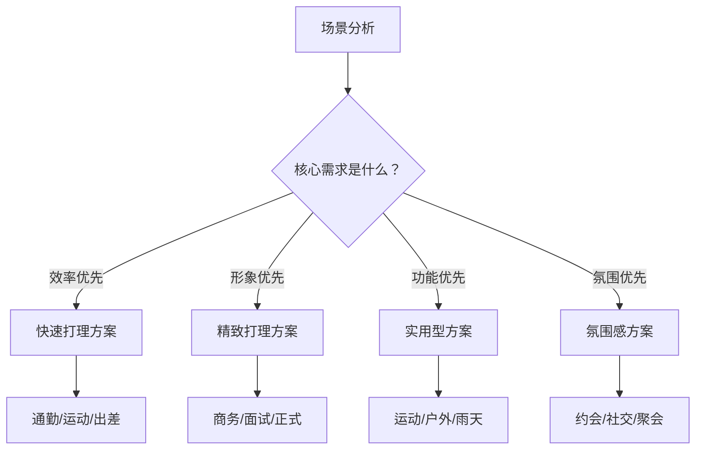
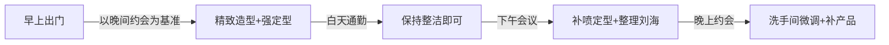
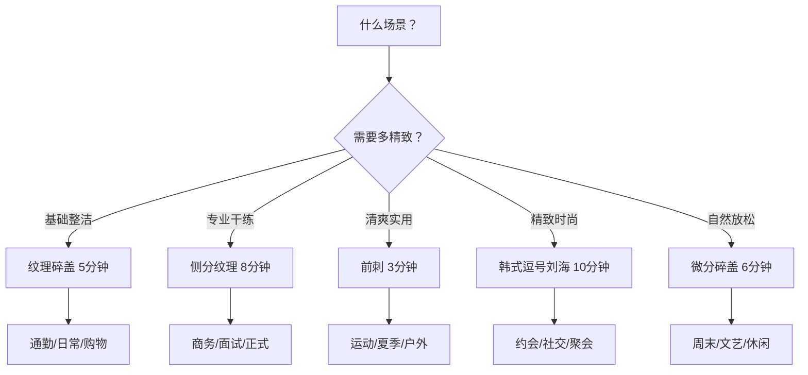

## 四、不同场景的发型方案

前三节分别讲了推荐发型的详细参数、打理技巧的底层原理、以及蓬松技术的深度解析。这些都是"单项能力"——但真实生活不是单项考试，而是一天之内可能跨越通勤、会议、运动、约会等多个场景的"综合赛"。本节的核心任务是：**把单项能力组合成场景化的解决方案**，让你在任何场合都能快速切换到最合适的发型状态。

### 4.1 场景发型设计的核心逻辑

#### 4.1.1 为什么同一个人在不同场景需要不同发型

发型不是装饰品，而是**社交信号**。不同的场景有不同的"社交语言"，发型是你无声表达的一部分：

- **通勤场景**：信号是"我专业、可靠、不浪费时间"——发型需要整洁但不需要精致
- **商务会议**：信号是"我重视这次交流、值得信任"——发型需要干练、有控制感
- **运动健身**：信号是"我专注、行动力强"——发型需要清爽、不妨碍运动
- **约会社交**：信号是"我有品味、值得深入了解"——发型需要精致、有记忆点
- **视频面试**：信号是"我认真、有条理"——发型需要在镜头前呈现最佳状态

#### 4.1.2 场景发型选择的三个维度

每个场景的发型选择都要同时考虑三个维度：

| 维度 | 问自己的问题 | 权重 |
|------|------------|------|
| **社交权重** | 这个场合我会见到谁？他们对我的第一印象有多重要？ | 权重越高→越精致 |
| **时间预算** | 我能花多少时间在发型上？ | 预算越少→越简化 |
| **环境因素** | 有没有风、雨、出汗、戴帽子等外部干扰？ | 干扰越大→越需要强定型 |

#### 4.1.3 一天跨多场景的发型策略

很多人一天内需要跨越多个场景——比如早上通勤、白天开会、晚上约会。不可能每次都重新洗头做造型。核心策略是：**以最高社交权重的场景为基准做造型，其他场景通过微调适应**。

**关键原则**：定型力随时间衰减，所以"先强后弱"比"先弱后强"容易得多。早上做好强定型的精致造型，白天只需要"维护"；但早上只做了简单造型，晚上想变精致就需要"重做"——这在时间上通常不可行。

---

### 4.2 日常通勤：效率至上的 5 分钟方案

通勤是最高频的场景，核心诉求是：**在最短时间内达到"整洁有型"的标准线**。不需要精致，但不能邋遢。

#### 4.2.1 推荐发型与选择逻辑

| 你的发质 | 推荐发型 | 为什么选它 |
|----------|----------|-----------|
| 细软塌 | 纹理碎盖 | 纹理处理+哑光发蜡直接解决塌的问题，打理简单 |
| 粗硬直 | 侧分纹理 | 粗硬发容易定型，侧分自然成型快 |
| 自然卷 | 纹理碎盖 | 碎剪处理弱化卷曲的不可控性 |

**通用推荐**：纹理碎盖。理由很简单——它是五款推荐发型中"容错率最高"的。即使打理手法不够精确，纹理碎盖也不会太难看。粗硬发、细软发、自然卷都能驾驭，而且5分钟足够完成。

#### 4.2.2 通勤版打理流程（5分钟精确计时）

0:00-0:30  毛巾按压吸走水分（不要搓！）
0:30-2:30  吹风机打理：
           - 低头逆吹发根 60秒（建立蓬松基底）
           - 抬头，用手（不用梳子）将头发向前、向两侧拨动 30秒
           - 两侧手掌压住，贴头皮吹服帖 30秒
2:30-4:00  造型产品：
           - 黄豆大小哑光发蜡，掌心搓热 10秒
           - 从发根向上抓取，制造纹理 40秒
           - 刘海用手指捏出碎感 30秒
4:00-4:30  定型喷雾，距离20cm，头顶和刘海各喷2下
4:30-5:00  镜子检查：刘海遮住太阳穴了吗？头顶有蓬松感吗？

**通勤版的"偷懒"技巧**：

- 如果前一天晚上洗头吹好了，早上只需要用沾湿的手指整理方向+喷少量定型喷雾，2分钟搞定
- 出门前来不及？戴一顶棒球帽到公司，到工位后去洗手间摘帽整理——帽子遮住了路上的"半成品"状态
- 办公桌抽屉里放一小瓶发蜡和一把口袋梳，中午头发塌了可以快速补救

#### 4.2.3 通勤路上的发型保护

| 通勤方式 | 威胁因素 | 保护策略 |
|----------|----------|----------|
| 骑电动车/自行车 | 头盔压塌发型 | 戴头盔前用手掌将头发向后压平，摘下后用手指向上拨起发根，左右拨松 |
| 地铁/公交 | 空调风、拥挤摩擦 | 避免靠窗位置，刘海区域用手轻护 |
| 开车 | 空调直吹头顶 | 将出风口调向下或两侧，不要对着头顶吹 |
| 步行 | 风吹乱发型 | 出门前定型喷雾多喷一层，重点保护刘海 |

#### 4.2.4 通勤场景的常见问题

**问题一：到公司后头发已经塌了**

原因通常是：发根没有彻底吹干，或者没有用定型产品。解决方法——在办公室洗手间快速急救：用沾湿的手指插入发根，向上提拉抖动，用纸巾吸干多余水分，然后用随身携带的发蜡从发根抓取。

**问题二：午休后发型完全变形**

趴着睡觉是发型杀手。如果必须午休：仰头靠着椅背睡，或者准备一个旅行枕垫在额头下方，避免头发被压。午休后用手指拨起发根，喷少量定型喷雾即可恢复。

---

### 4.3 商务会议：干练专业的 8 分钟方案

商务会议的发型标准比通勤高一个等级：不仅要整洁，还要**有控制感**——让人感觉你对自己的形象有管理能力，从而推导出你对工作也有管理能力。

#### 4.3.1 推荐发型与选择逻辑

| 会议类型 | 推荐发型 | 风格定位 |
|----------|----------|----------|
| 日常部门会议 | 纹理碎盖 | 整洁即可，不需要过度正式 |
| 客户提案/汇报 | 侧分纹理 | 干练稳重，传递专业感 |
| 高管/投资人会面 | 侧分纹理 | 成熟可靠，有掌控力 |
| 创意行业会议 | 微分碎盖 | 自然有品味，不刻板 |

**核心推荐**：侧分纹理。三七分的侧分线将视觉重心引导到眉眼区域，配合顶部蓬松拉高颅顶，整体营造"倒三角"的视觉效果——这是商务场合最经典、最不出错的男性发型。

#### 4.3.2 商务版打理流程（8分钟精确计时）

0:00-0:30  毛巾按压吸走水分
0:30-1:00  涂抹打底乳（一元硬币大小），从发根到发梢
1:00-4:00  精细分区吹风：
           - 低头逆吹发根 60秒
           - 抬头，用圆梳将头发向分线方向梳理，热风跟随 90秒
           - 分线处用梳子尖端划线，吹风机贴着吹 30秒
           - 冷风全头定型 30秒
4:00-6:00  造型产品：
           - 黄豆大小中光泽发蜡，搓热
           - 从分线处向分线方向抓取 60秒
           - 调整刘海弧度：根部要有支撑力，发梢要有飘逸感 30秒
6:00-7:00  精修分线和鬓角
7:00-8:00  强力定型喷雾，分层喷（喷一层→等10秒→再喷一层）

**商务版的关键区别**：

- **产品选择**：用中光泽发蜡而非哑光发蜡——中光泽在灯光下显得更有质感，哑光在会议室灯光下可能显得"灰蒙蒙"
- **定型力**：比通勤版更强——会议通常持续1-2小时，发型不能在中途塌掉
- **分线要清晰**：商务场合需要"秩序感"，模糊的分线会显得随意

#### 4.3.3 不同会议场合的细节调整

| 场合 | 发型调整 | 原因 |
|------|----------|------|
| 视频会议 | 顶部蓬松度增加10%，刘海略短于平时 | 镜头会压缩纵向比例，需要更多头顶高度来平衡 |
| 户外商务活动 | 加强定型喷雾用量，随身带发蜡 | 户外有风，发型更容易变形 |
| 正式晚宴 | 侧分纹理+发油替代发蜡 | 发油光泽感更强，在正式灯光下更有质感 |
| 出差途中 | 纹理碎盖（简化版） | 旅途条件有限，选最容易打理的方案 |

#### 4.3.4 商务场景的紧急情况处理

**情况一：临时通知开会，发型来不及重新做**

应急方案：用手指沾少量水，重新整理刘海方向和顶部纹理。喷定型喷雾固定。如果实在太塌，去洗手间用吹风机（如果有）从发根逆吹30秒，再用发蜡快速抓取。整个过程3分钟。

**情况二：会议中途发型塌了**

不要当众整理头发——这会传递"不从容"的信号。趁茶歇或休息时间去洗手间急救：用沾湿的手指插入发根提拉，纸巾吸干，补少量发蜡。

**情况三：需要从通勤发型快速切换到商务发型**

如果早上只做了简单的纹理碎盖，临时需要切换到更正式的侧分纹理：用手指沾少量水将头发打湿到可塑状态，用梳子重新分线，吹风机快速定型方向，发蜡重新造型——大约需要5-7分钟。

---

### 4.4 运动健身：清爽实用的 3 分钟方案

运动场景的核心需求完全不同——发型要**不妨碍运动**，同时**能承受出汗**。美观度降到第二位，功能性升到第一位。

#### 4.4.1 推荐发型与选择逻辑

| 运动类型 | 推荐发型 | 原因 |
|----------|----------|------|
| 跑步/有氧 | 前刺 | 头发向上抓起，不遮挡视线，出汗后容易整理 |
| 力量训练 | 前刺/短碎盖 | 仰卧动作多，头发不能太长碍事 |
| 球类运动 | 前刺 | 剧烈运动中最不容易变形 |
| 瑜伽/普拉提 | 短碎盖 | 有倒立动作，头发太长会遮脸 |
| 游泳 | 游泳帽+短发 | 头发越短越好管理 |

**核心推荐**：前刺。理由——顶部向上抓起的"刺"不遮挡视线和面部，出汗后用毛巾擦一下就能恢复大致形状，而且前刺本身的"凌乱感"在运动场景中反而显得自然。

#### 4.4.2 运动版打理流程（3分钟精确计时）

0:00-0:30  如果是早上运动：不洗头，直接用喷雾瓶将头发喷湿
           如果是下午运动：保持原有发型，不需要特别处理
0:30-1:30  吹风机从发根向前上方吹 60秒（建立"刺"的方向）
           两侧手掌压住贴头皮吹 30秒
1:30-2:30  少量发泥（比发蜡更适合运动——干涩质感不怕出汗），
           从发根向上抓取，捏出发梢的"刺"
2:30-3:00  不用定型喷雾（运动出汗会让喷雾溶解，反而黏腻）

**运动版的特殊考量**：

- **不用定型喷雾**：运动出汗会让定型喷雾的成膜剂溶解，产生黏腻感。发泥的干涩质感反而更耐汗
- **产品用量减半**：运动后需要洗头，不需要考虑造型持久度，少用产品让头皮更透气
- **发泥优于发蜡**：发泥不含蜡质，出汗后不会"化"成油腻状态

#### 4.4.3 运动后的发型恢复

运动后发型通常已经"报废"，根据你接下来的场景决定处理方式：

| 运动后的场景 | 处理方式 | 时间 |
|-------------|----------|------|
| 直接回家 | 简单冲洗，不需要造型 | 5分钟 |
| 去见朋友/约会 | 在健身房淋浴洗头，重新做造型 | 15分钟 |
| 回办公室 | 用干毛巾擦汗，吹风机从发根逆吹恢复蓬松，发蜡重新造型 | 8分钟 |

**健身房建议携带的物品**：

- 旅行装发蜡（小包装，放在健身包里）
- 小瓶定型喷雾
- 干毛巾（擦汗用）
- 如果需要运动后重新造型：洗发水旅行装

#### 4.4.4 特殊运动场景

**游泳场景**：泳池中的氯会严重损伤发质。建议：游泳前用清水打湿头发（已经湿的头发吸收的氯水更少），戴上泳帽。游泳后立即用清水冲洗，使用深层清洁洗发水去除氯残留，涂抹护发素修复。

**户外跑步（冬季）**：冷风+出汗的组合最容易导致感冒和头发问题。建议戴运动头巾或薄款运动帽，跑步结束后摘帽，用手指拨起发根恢复蓬松。

**高温瑜伽**：大量出汗+高温环境，任何造型产品都会被"蒸"掉。建议：干脆不造型，用发带将头发向后固定，专注运动本身。

---

### 4.5 约会社交：精致有型的 10 分钟方案

约会是所有场景中**社交权重最高**的——你的发型直接影响对方对你的第一印象和整体评价。这个场景值得投入最多的时间和精力。

#### 4.5.1 推荐发型与选择逻辑

| 约会类型 | 推荐发型 | 风格定位 |
|----------|----------|----------|
| 第一次约会 | 纹理碎盖 | 自然不出错，展现"干净清爽"的基本面 |
| 咖啡/下午茶 | 微分碎盖 | 文艺自然，有"不经意的好看"的感觉 |
| 晚餐约会 | 韩式逗号刘海 | 精致时尚，有记忆点 |
| 逛街/户外约会 | 纹理碎盖 | 百搭实用，不怕风 |
| 朋友聚会 | 前刺/逗号刘海 | 活力/时尚，展现不同面 |

**核心推荐**：第一次约会选纹理碎盖（最安全），熟悉之后可以尝试韩式逗号刘海（最有记忆点）。

#### 4.5.2 约会版打理流程（10分钟精确计时）

以韩式逗号刘海为例（打理难度最高的发型，适合约会版的"精致上限"）：

0:00-1:00  毛巾按压+涂抹海盐喷雾（增加纹理感和蓬松度）
1:00-5:00  精细分区吹风：
           - 低头逆吹发根 60秒
           - 抬头，用圆梳（直径2-3cm）将刘海从发根向一侧弯曲 120秒
           - 热风定型→冷风3秒固定，重复2-3次
           - 顶部用手提拉，吹风机从发根向上吹 60秒
5:00-8:00  造型产品精细处理：
           - 黄豆大小哑光发蜡，搓热
           - 刘海从发根向一侧弯曲，配合发蜡固定弧度 90秒
           - 用手指尖调整逗号弧度——要自然流畅，不能有"折痕" 30秒
           - 顶部向上提拉制造蓬松 30秒
8:00-9:00  蓬蓬粉加强发根支撑（在头顶发根处拍少量）
9:00-10:00 分层喷定型喷雾：先喷头顶→等10秒→再喷刘海→等10秒
           最终检查：正面、侧面、45度角

#### 4.5.3 约会场景的"加分细节"

**细节一：根据约会地点调整**

- 室内餐厅：可以做更精致的造型，不用担心风和日晒
- 户外活动：加强定型力，随身带小发蜡补妆
- 看电影/暗光场所：发型的"轮廓感"比"细节感"更重要，重点塑造顶部高度和侧面线条

**细节二：气味管理**

发型产品本身可能有香味，但不要和香水冲突。建议：选择无香或淡香的造型产品，香味交给专门的香水。如果造型产品有明显香味，就不要再喷香水——两种香味混合会产生不可控的效果。

**细节三：对方可能的"亲密接触"场景**

如果约会进展到拥抱、靠肩等亲密接触，头发的"触感"也很重要。造型产品用太多会让头发变硬，对方靠过来时感觉像"蹭到一堵墙"。建议：顶部和刘海用发蜡定型，但保留一些自然柔软的区域（比如后脑勺），让触感不会太"机械"。

#### 4.5.4 约会场景的急救预案

**约会中途发型塌了**：

不要慌张，更不要当着对方面前频繁整理头发（这会暴露你的不自信）。借口去洗手间，用随身携带的发蜡快速补救：用手指沾少量发蜡，从发根抓起顶部，调整刘海方向。整个过程1-2分钟。

**突然下雨/大风**：

如果天气突变，发型被破坏。第一反应不是"完了"，而是"切换到另一种风格"——被风吹乱的纹理碎盖，用手拨一拨，可以变成"不羁凌乱风"。自信的态度比完美的发型更有吸引力。

---

### 4.6 视频面试/线上会议：镜头前的最佳状态

远程办公时代，视频面试和线上会议成为高频场景。镜头前的发型与线下有很大区别——**摄像头会压缩画面、改变光线，让很多线下好看的细节在屏幕上变得模糊或失真**。

#### 4.6.1 镜头前发型的特殊要求

| 因素 | 线下效果 | 镜头效果 | 调整策略 |
|------|----------|----------|----------|
| 纵向比例 | 正常 | 被压缩，显得脸更宽 | 增加头顶蓬松度10-15% |
| 发色 | 正常 | 受白平衡影响可能偏色 | 避免过于夸张的发色 |
| 刘海细节 | 清晰可见 | 模糊，细节丢失 | 刘海整体轮廓比细节更重要 |
| 两侧 | 正常 | 画面边缘可能裁切 | 两侧保持整洁，不要依赖细节 |
| 光泽感 | 自然 | 摄像头可能产生反光 | 用哑光产品，避免油亮 |

#### 4.6.2 视频版打理要点

**发型选择**：纹理碎盖或侧分纹理。两者在镜头前都能呈现清晰的轮廓。

**打理调整**：

1. 顶部蓬松度增加——低头逆吹时间从60秒延长到90秒，确保头顶有足够高度
2. 用哑光发蜡——摄像头在正面光源下会让中光泽/高光泽产品产生反光，看起来像"出油"
3. 刘海不要遮太多脸——镜头中脸被刘海遮住会显得不精神，露出额头和眉毛区域
4. 两侧一定要服帖——摄像头两侧通常是墙壁或背景，头发翘起来在镜头中非常明显

**灯光配合**：

发型在镜头中的呈现效果，50%取决于发型本身，50%取决于灯光。最佳灯光设置：

- 主光源放在摄像头正后方偏上45度——照亮面部和头顶
- 避免顶光——会让额头和鼻梁产生阴影，显得头发更塌
- 避免背光——会让面部变成剪影，发型完全不可见

#### 4.6.3 视频面试的特别注意事项

- **不要戴帽子或头巾**——除非是宗教或文化原因，否则显得不正式
- **确保摄像头角度正确**——平视或略微仰视，不要俯拍（俯拍会压缩头顶，让头发看起来更塌）
- **面试前检查一次画面**——打开摄像头预览，确认发型在镜头中的实际效果

---

### 4.7 正式场合：婚礼/典礼/晚宴的极致方案

正式场合是发型要求的"天花板"——需要在精致度、持久度、得体度三个方面都做到极致。

#### 4.7.1 正式场合的发型选择

| 场合 | 推荐发型 | 产品选择 | 打理时间 |
|------|----------|----------|----------|
| 婚礼（宾客） | 侧分纹理 | 中光泽发蜡+强力定型喷雾 | 10分钟 |
| 婚礼（伴郎） | 侧分纹理 | 发油+强力定型喷雾 | 12分钟 |
| 商务晚宴 | 侧分纹理 | 中光泽发蜡+强力定型喷雾 | 10分钟 |
| 颁奖典礼 | 侧分纹理/韩式逗号刘海 | 发油/发蜡+强力定型喷雾 | 12分钟 |
| 面试 | 侧分纹理 | 哑光发蜡+中度定型喷雾 | 8分钟 |

#### 4.7.2 正式版的关键区别

正式场合与日常的最大区别有三点：

**第一，产品升级**。日常用的哑光发蜡换成中光泽发蜡或发油。在正式场合的灯光下（通常是暖色吊灯或聚光灯），适度的光泽感会显得更有质感。但注意——是"适度光泽"，不是"油光锃亮"。

**第二，定型力升级**。正式场合通常持续3-5小时，中间不方便整理头发。用强力定型喷雾替代日常的中度喷雾，分层喷两遍，确保发型能撑完全程。

**第三，细节精修**。日常可以有些"随意感"，正式场合每一个细节都要到位：

- 分线必须清晰锐利
- 鬓角必须整齐，没有翘起的碎发
- 后脑勺弧度必须饱满
- 发际线周围的碎发要处理干净

#### 4.7.3 正式场合的全天持久方案

出门前（10-12分钟）：
  精细分区吹风→中光泽发蜡/发油精细造型→强力定型喷雾×2层

到达后（洗手间检查，1分钟）：
  检查是否有因出行而变形的区域，用手指微调

中途维护（每2小时，30秒）：
  如果感觉发型有松动，去洗手间用手指拨起发根，不需要补产品

结束后：
  回家后第一时间洗头——强力定型喷雾长时间停留在头皮上会堵塞毛囊

---

### 4.8 户外活动与旅行：实用至上的方案

户外活动和旅行场景的发型面临独特挑战：条件有限（可能没有吹风机）、环境多变（风、雨、日晒）、时间不固定。

#### 4.8.1 户外活动发型方案

| 活动类型 | 推荐发型 | 关键策略 |
|----------|----------|----------|
| 登山/徒步 | 前刺+运动头巾 | 头巾固定头发，防止遮挡视线 |
| 露营 | 纹理碎盖（简化版） | 不追求精致，用手抓出大致形状即可 |
| 海边度假 | 前刺/自然散落 | 海风+盐水会自然制造纹理，顺其自然 |
| 城市旅游 | 纹理碎盖 | 走路多会出汗，产品用量减半 |
| 滑雪/冬季户外 | 纹理碎盖+帽子 | 帽子下面的发型不需要精致，摘帽后快速整理 |

#### 4.8.2 旅行发型应急包

长途旅行建议在随身包中携带以下物品：

| 物品 | 用途 | 体积 |
|------|------|------|
| 旅行装发蜡（20ml） | 随时造型 | 指甲油瓶大小 |
| 小喷雾瓶（30ml，装清水） | 打湿头发便于重新造型 | 口红大小 |
| 口袋梳 | 快速梳理 | 可折叠款 |
| 干洗喷雾旅行装 | 没条件洗头时去油蓬松 | 旅行装喷雾 |
| 棒球帽 | 发型来不及做时的"遮羞布" | 一顶帽子 |

#### 4.8.3 没有吹风机的应急造型方案

旅行中酒店没有吹风机、或住青旅不方便使用吹风机时：

1. 洗发后用毛巾按压到半干
2. 用手将头发向想要的方向拨动，反复梳理建立方向
3. 涂抹发蜡（发蜡不需要吹风也能提供一定的定型力），从发根抓取
4. 如果有定型喷雾，喷一层加强
5. 让头发自然风干——在风干过程中，发蜡+手指建立的方向会被氢键"记住"

效果不如吹风+造型那么精致，但能达到60-70%的效果——在旅行场景中足够了。

---

### 4.9 特殊天气场景：雨天、大风、高温

天气是发型最大的"不可控因素"。提前准备应对方案，比临场慌乱有效100倍。

#### 4.9.1 雨天方案

雨天的核心挑战是**湿度**——空气中的水分会让头发吸水膨胀、卷曲变形，定型产品也会因为湿气而失效。

**出门前准备**：

1. 吹风要彻底——潮湿天气头发更难干透，多吹1-2分钟确保完全干燥
2. 使用强定型产品——强力发蜡+定型喷雾双保险
3. 出门前多喷一层定型喷雾，形成防水"外壳"

**雨中应急**：

- 如果淋到小雨：不要用手擦头发（手上的水分会让更多区域受潮），用纸巾轻轻按压吸走水珠
- 如果淋到大雨：接受现实，发型已经不可挽救。到室内后用纸巾吸干水分，等头发半干时用发蜡重新抓取大致形状

**雨天的产品选择**：

| 产品 | 雨天表现 | 建议 |
|------|----------|------|
| 水基发蜡 | 较差（遇水容易溶解） | 雨天换用油基发蜡或发泥 |
| 发泥 | 较好（干涩质感不怕水） | 雨天首选 |
| 定型喷雾 | 中等（轻度防水） | 喷两层加强 |
| 发油 | 较好（油水不相溶） | 正式场合雨天可用 |

#### 4.9.2 大风天方案

大风天的核心挑战是**物理力**——风力会直接吹乱发型结构。

**应对策略**：

1. 定型喷雾用量加倍——形成更硬的"壳"
2. 选择紧贴头部的发型——前刺和高蓬松发型在大风中容易"散架"，纹理碎盖和侧分纹理更抗风
3. 随身带帽子——风力超过4级时，帽子是最可靠的"发型保护器"
4. 风后整理：用手掌将头发整体压平，再用手指从发根向上拨起，恢复基本形状

#### 4.9.3 高温天方案（35°C以上）

高温天的核心挑战是**出汗+出油**——双重攻击让发型加速塌陷。

**应对策略**：

1. 洗发频率提高到每天一次——油脂积累是高温天发型塌陷的主因
2. 产品选择以清爽为主——发泥、海盐喷雾，避免油基产品
3. 产品用量减半——高温天头皮出油已经提供了"天然定型"，不需要太多外加产品
4. 随身携带蓬蓬粉——中午在发根处补一次，吸附汗水和油脂
5. 考虑剪短——如果高温天持续一个月以上，可以考虑把顶部长度减少1-2cm，减少出汗面积

---

### 4.10 场景快速决策矩阵

当你不确定某个场景该用什么发型时，查这个表：

**一句话决策法**：不知道选什么的时候，选纹理碎盖。它是所有场景的"及格线"——在任何场合都不会出错，虽然不是每个场景的最优解，但永远是安全解。

---

### 4.11 场景切换的实战技巧

真实生活中，你经常需要在一天之内从一个场景切换到另一个场景。以下是几种最常见的场景切换方案：

#### 4.11.1 通勤→商务会议（最常见）

**时间预算**：3-5分钟（在办公室洗手间完成）

**操作步骤**：

1. 用沾湿的手指将头发打湿到可塑状态（不是全湿，是半干可塑）
2. 用梳子重新建立分线方向
3. 发蜡从分线处重新抓取，整理纹理
4. 定型喷雾固定
5. 用纸巾擦掉额头和鬓角的多余产品

#### 4.11.2 办公室→约会（下班后直奔）

**时间预算**：5-7分钟（在办公室洗手间完成）

**操作步骤**：

1. 如果下午头发已经出油塌陷：用干洗喷雾/蓬蓬粉在发根处去油蓬松
2. 用沾湿的手指重新整理刘海方向
3. 发蜡重新造型——如果原来是纹理碎盖，可以改成微分碎盖增加自然感
4. 如果要升级到逗号刘海：需要更多时间（10分钟以上）和吹风机——如果洗手间没有吹风机，建议维持原来的发型，只是增加精致度
5. 定型喷雾固定

#### 4.11.3 运动→社交（健身房出来直奔聚会）

**时间预算**：10-15分钟（需要在健身房淋浴）

**操作步骤**：

1. 淋浴洗头——运动后头皮出汗必须清洗
2. 用吹风机完整吹风：低头逆吹→分区塑形→冷风定型
3. 发蜡完整造型
4. 定型喷雾固定
5. 检查整体效果

**关键**：如果健身房没有吹风机，用干毛巾尽可能擦干，发蜡抓取大致形状，自然风干——效果约70%，但够用。

---

### 4.12 针对方形脸+细软塌发质的场景优化

综合你的个人条件（方形脸、普通身高、头发塌、28岁），以下是每个场景的针对性优化建议：

| 场景 | 基础方案 | 针对方形脸的优化 | 针对细软塌的优化 |
|------|----------|-------------------|-----------------|
| 通勤 | 纹理碎盖 | 碎刘海必须遮住太阳穴 | 吹风时逆吹时间延长到90秒 |
| 商务 | 侧分纹理 | 选三七分（遮挡颧骨），两侧保留1-3cm | 蓬松摩丝打底再吹风 |
| 运动 | 前刺 | 两侧不要Skin Fade，保留0.5-1cm过渡 | 发泥用量减半，减少负担 |
| 约会 | 韩式逗号刘海 | 选单逗号（覆盖面积更大） | 蓬蓬粉加强发根支撑 |
| 视频 | 纹理碎盖 | 顶部蓬松度增加15% | 哑光产品避免摄像头反光 |

**核心记忆**：无论什么场景，方形脸的发型都要围绕三个目标——增加面部上半部分宽度感、柔化颧骨线条、拉长纵向视觉比例。场景变化只是实现方式的调整，目标不变。

---

### 4.13 常见场景误区

| 误区 | 为什么错 | 正确做法 |
|------|----------|----------|
| 每天都是同一个发型 | 不同场景对发型的要求不同，"一招鲜"在某些场合会失分 | 至少准备2套方案（日常版+精致版） |
| 运动前做精致造型 | 运动出汗会完全破坏造型，白费功夫 | 运动前只做简单造型或不造型 |
| 商务会议用哑光产品 | 会议室灯光下哑光显得暗淡 | 商务场合用中光泽产品 |
| 约会前尝试新发型 | 第一次尝试新发型翻车概率高 | 约会发型必须是已经熟练掌握的 |
| 下雨天不管发型直接出门 | 到目的地后发型已经不可救药 | 雨天提前加强定型+带帽子 |
| 视频会议只关注上半身 | 摄像头画面包括头顶和两侧 | 确保头顶蓬松、两侧服帖 |
| 觉得运动发型不需要打理 | 运动也需要基本的发型管理——清爽的运动发型比"炸毛"好看 | 运动前3分钟简单整理 |

***

> 下一节：[03-产品推荐](../产品推荐/_index.md)
