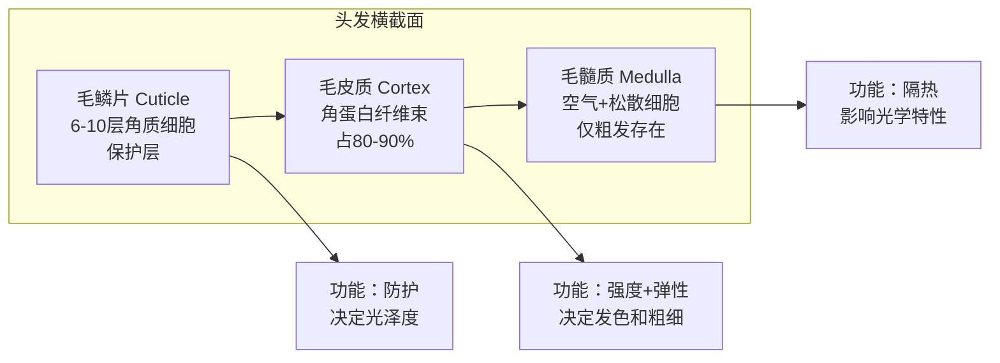
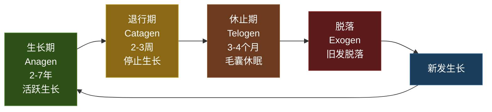
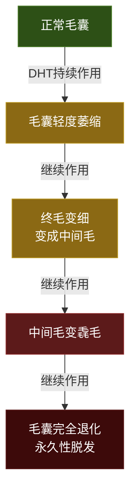
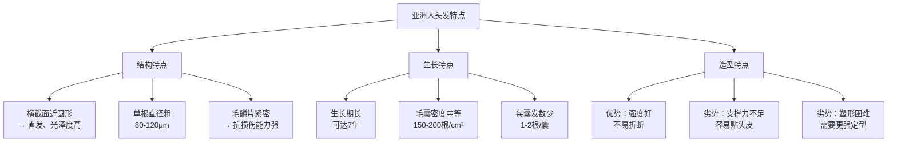
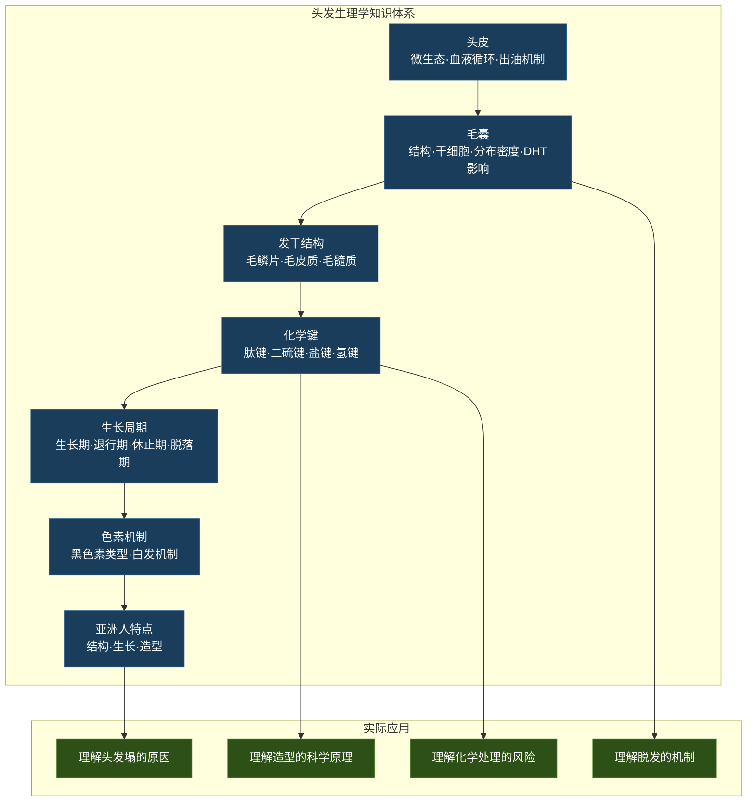

## 一、头发生理学

要真正理解头发——为什么它会塌、为什么它会油、为什么某些造型方法有效而另一些无效——你必须先理解头发的生理学。这不是"可选的理论知识"，而是你做出每一个正确决策的基础。跳过这一步，你后面的每一个选择都是在碰运气。

本节将从头皮讲起，逐层深入到毛囊、发干微观结构、蛋白质化学、生长周期和色素机制，最终将这些生理学知识与你的日常发型管理直接关联。

### 1.1 头皮：头发生长的"土壤"

在讨论头发之前，我们必须先讨论头皮——它是毛囊赖以生存的环境。很多人只关注"头发"本身，却忽略了头皮健康才是头发质量的根基。

#### 头皮的解剖结构

头皮是人体皮肤中最厚的区域之一，厚度约为5-8mm（面部其他区域通常只有1-2mm）。它由以下层次构成：

头皮剖面结构（由表及里）：
├── 表皮层（Epidermis）
│   ├── 角质层：死亡的角质细胞，天然屏障
│   ├── 颗粒层
│   ├── 棘层
│   └── 基底层：不断产生新细胞，约28天完成一次更新
├── 真皮层（Dermis）
│   ├── 乳头层：含毛细血管网，为毛乳头供血
│   └── 网状层：含胶原纤维和弹性纤维，提供结构支撑
│       ├── 皮脂腺：分泌皮脂（详见1.4节）
│       ├── 立毛肌：控制毛发竖立
│       └── 毛囊：嵌入此层
├── 皮下组织（Subcutaneous Layer）
│   └── 脂肪组织：缓冲保护，保温
└── 帽状腱膜（Galea Aponeurotica）
    └── 连接额肌和枕肌，是头皮的"骨架"

#### 头皮微生态

健康的头皮表面存在一个复杂的微生物群落，主要包括：

| 微生物类型 | 代表物种 | 正常功能 | 失衡后果 |
|-----------|---------|---------|---------|
| 细菌 | 表皮葡萄球菌 | 抑制有害菌生长 | 过度繁殖→毛囊炎 |
| 真菌 | 马拉色菌（Malassezia） | 分解皮脂维持生态平衡 | 过度增殖→头屑、脂溢性皮炎 |
| 螨虫 | 蠕形螨（Demodex） | 清理毛囊内碎屑 | 过度繁殖→毛囊堵塞 |

头皮的pH值通常维持在4.5-5.5的弱酸性范围。这个酸碱度对维持微生态平衡至关重要——使用碱性过强的洗发水（pH>7）会破坏这层酸性保护膜，导致有害菌过度繁殖。这也是为什么"氨基酸洗面奶"的概念同样适用于洗发产品：温和的表面活性剂能更好地保护头皮的天然pH平衡。

#### 头皮的血液循环

头皮的血液供应来自颈外动脉的分支，形成了丰富的血管网络。每个毛乳头都直接与毛细血管相连，从中获取氧气和营养物质。这意味着：

- **头皮血液循环直接影响头发质量**：血流量不足→营养供应不足→头发变细、生长减慢
- **头皮按摩的科学依据**：2016年日本的一项小型研究（Eplasty, Koyama et al.）发现，每天4分钟的头皮按摩持续24周后，受试者的头发直径显著增加。虽然机制尚不完全清楚，但增加局部血液循环是一个合理的解释
- **温度的影响**：寒冷会导致血管收缩，减少头皮血流量。这就是为什么冬季头发质量往往较差的原因之一

#### 头皮出油机制

头皮是人体皮脂腺最密集的区域之一，每平方厘米约有400-900个皮脂腺（相比之下，前臂每平方厘米只有约50个）。皮脂腺通过一个通道连接到毛囊，分泌的皮脂通过这个通道排出到头皮表面。

皮脂的主要成分包括：

| 成分 | 占比 | 功能 |
|------|------|------|
| 甘油三酯 | 40-60% | 润滑保湿 |
| 蜡酯 | 20-30% | 防水保护 |
| 角鲨烯 | 10-15% | 抗氧化 |
| 胆固醇 | 2-5% | 细胞膜修复 |
| 游离脂肪酸 | 5-10% | 抗菌（酸性环境） |

皮脂的分泌受到雄性激素（特别是睾酮和二氢睾酮/DHT）的直接调控。青春期开始后，雄性激素水平上升，皮脂腺变得活跃，这就是为什么很多人在青春期后头发变得更容易出油。DHT的双面效应将在1.5节的"雄激素与头发生长"部分详细展开。

### 1.2 毛囊：头发的"工厂"

每根头发都生长于一个被称为毛囊（Hair Follicle）的微型器官中。理解毛囊的结构和功能，是理解一切头发问题的起点。

#### 毛囊的解剖结构

毛囊是一个嵌入真皮层和皮下组织中的管状结构，深度约为4-5mm。从外到内可以分为以下几个层次：

毛囊剖面结构（由外向内）：
├── 结缔组织鞘（Connective Tissue Sheath）
│   └── 来自真皮层，提供毛囊的结构支撑和血液供应
├── 外根鞘（Outer Root Sheath）
│   └── 连接毛囊与周围皮肤组织，含有多能干细胞
├── 内根鞘（Inner Root Sheath）
│   └── 引导头发向上生长，决定头发截面形状
├── 毛干（Hair Shaft）
│   ├── 毛小皮/毛鳞片（Cuticle）：6-10层重叠的透明角质细胞
│   ├── 毛皮质/皮质层（Cortex）：占头发80-90%的主体
│   └── 毛髓质（Medulla）：中心空腔，仅粗发中存在
├── 毛球（Hair Bulb）
│   ├── 毛母质细胞（Matrix Cells）：快速分裂的细胞群
│   └── 黑色素细胞（Melanocytes）：决定发色
└── 毛乳头（Dermal Papilla）
    └── 含血管和神经，是毛囊的"控制中心"

**毛乳头**是毛囊中最关键的部分。它是一个位于毛球底部的小突起，内含丰富的血管网络，负责向毛母质细胞输送营养物质和氧气。毛乳头还含有大量的信号分子（包括Wnt信号通路、BMP、FGF等生长因子），通过与毛母质细胞的"对话"来调控毛发的生长周期。如果毛乳头受损或萎缩，毛囊就会逐渐退化，导致头发变细甚至脱落——这就是雄激素性脱发（男性型脱发）的核心机制之一。

**毛母质细胞**是毛囊中分裂最快的细胞之一，分裂周期仅约24小时。这些快速分裂的细胞不断角质化（硬化），最终形成我们所看到的头发。由于分裂速度快，毛母质细胞对营养缺乏和有毒物质特别敏感——化疗药物之所以会导致脱发，就是因为它们攻击了这些快速分裂的细胞。

**皮脂腺**附着在每个毛囊的侧面，分泌皮脂（sebum）来滋润和保护头发。皮脂腺的活跃程度决定了你的头皮是油性还是干性。雄性激素会刺激皮脂腺分泌，这也是为什么青春期后很多人会感觉头发变油的原因。

#### 毛囊干细胞

毛囊外根鞘中存在一群特殊的细胞——**毛囊干细胞**（Hair Follicle Stem Cells），位于一个被称为"隆突区"（Bulge Region）的位置。这些干细胞是毛囊再生的关键。在每个生长周期结束时，正是这些干细胞重新激活，启动新一轮的毛发生长。

毛囊干细胞的存在也解释了一个重要现象：**为什么毛囊受损后头发可能不再生长**。如果毛囊干细胞被永久性损伤（如深度烧伤、严重感染或长期过度拉扯），该区域的毛发将永久性丧失。相比之下，如果仅仅是毛乳头暂时萎缩（如压力性脱发），一旦原因消除，毛囊干细胞可以重新启动毛发生长周期。

#### 毛囊的分布密度

人类头皮上大约有10万个毛囊，但这个数字因人种和个体差异而有所不同：

| 人种 | 每平方厘米毛囊数 | 总量约数 | 每个毛囊的发数 | 单根直径 |
|------|-----------------|----------|--------------|---------|
| 高加索人（白人） | 200-300 | 约12万 | 2-3根 | 50-80μm |
| 亚洲人 | 150-200 | 约10万 | 1-2根 | 80-120μm |
| 非洲人 | 100-150 | 约6-8万 | 1-2根 | 60-100μm |

亚洲人的毛囊密度居中，但每个毛囊通常只长1-2根头发，且直径较粗。这意味着亚洲人的总发量可能比白人少，但单根头发更粗、更强韧。从造型角度看，这是"双刃剑"——粗硬的头发有更好的支撑力（不容易塌），但也更难塑形（需要更强的定型产品和更高温度）。

**重要提示**：毛囊数量在出生时就已经确定，后天无法增加。我们所能做的一切努力，都是保护现有毛囊、让每根头发尽可能健康地生长。市面上任何声称能"增加毛囊数量"的产品都是虚假宣传。

#### 毛囊周围的肌肉

每个毛囊旁边都有一小块平滑肌，称为**立毛肌**（Arrector Pili Muscle）。当它收缩时，毛囊会被拉向皮肤表面，头发竖立——这就是"鸡皮疙瘩"现象的生理机制。虽然立毛肌的原始功能是帮助调节体温和表达情绪反应（恐惧、寒冷），但它也提供了一个有趣的启示：头发确实可以在一定范围内"竖起来"，这是蓬松造型的生理基础之一。

值得注意的是，立毛肌的收缩是暂时的，无法持久维持。这意味着所有"永久蓬松"的承诺在生理学上都不成立——你只能通过物理手段（造型产品、吹风技巧）来模拟或延长这种竖起效果。

### 1.3 终毛与毳毛：你头上的"两种头发"

在讨论头发之前，需要了解一个重要但常被忽略的概念：人体上有两种不同类型的毛发。

| 特征 | 终毛（Terminal Hair） | 毳毛（Vellus Hair） |
|------|---------------------|-------------------|
| 直径 | > 60μm | < 30μm |
| 长度 | 可持续生长（受生长期限制） | 通常< 2cm |
| 颜色 | 含黑色素，深色 | 几乎无色 |
| 触感 | 粗硬，有存在感 | 细软，几乎不可见 |
| 分布位置 | 头皮、胡须、腋毛、阴毛 | 面部、躯干大部分区域 |
| 毛囊深度 | 深（4-5mm） | 浅（1-2mm） |

你的头发属于终毛——这意味着它们经历了从毳毛到终毛的"升级"过程（通常在青春期完成）。理解终毛和毳毛的区别，对理解脱发机制至关重要：在雄激素性脱发中，受影响的毛囊会逐渐"降级"——终毛逐渐变细，最终退化为毳毛，甚至完全消失。这也是为什么脱发是一个渐进过程：头发不是突然消失的，而是逐渐变细变短的。

### 1.4 头发的微观结构

头发是一种高度角质化的纤维状结构，由一种叫做**角蛋白**（Keratin）的蛋白质组成。角蛋白中含有大量的半胱氨酸（Cysteine），这些半胱氨酸之间可以形成**二硫键**（Disulfide Bond），正是这些二硫键赋予了头发强度和弹性。

#### 三层结构详解

**第一层：毛鳞片（Cuticle）**

毛鳞片是头发的最外层，由6-10层扁平的、透明的角质细胞像瓦片一样层层重叠而成。每一片"瓦"的厚度约为0.2-0.5μm，长度约为5-10μm。它的主要功能是保护内层的皮质层免受外界环境的损伤。

- **健康头发**：毛鳞片排列紧密、平整，光线能够均匀反射，头发看起来有光泽
- **受损头发**：毛鳞片翘起、脱落，光线散射不均匀，头发看起来毛躁、暗淡
- **过度处理的头发**：毛鳞片大面积脱落，皮质层暴露在外，头发变得脆弱、易断

毛鳞片的状态直接决定了头发的外观和手感。大多数护发产品的核心原理就是"闭合毛鳞片"——通过改变毛鳞片的排列状态来改善头发的外观。具体来说：

| 产品类型 | 作用机制 | 效果持续时间 |
|---------|---------|------------|
| 酸性护发素（pH 3-4） | 使毛鳞片收紧闭合 | 洗发后数小时 |
| 硅油类产品（Dimethicone） | 在毛鳞片表面形成光滑薄膜 | 到下次洗发前 |
| 蛋白质修复产品 | 填补毛鳞片缺损处 | 中等持久 |
| 毛鳞片闭合喷雾 | 快速闭合+光泽 | 即时效果 |

**第二层：毛皮质（Cortex）**

毛皮质是头发的主体，占头发总重量的80-90%。它由大量纵向排列的纺锤形细胞组成，这些细胞内部充满了角蛋白纤维束。这些纤维束分为两类：

- **微纤维（Microfibrils）**：直径约7nm，由紧密排列的α-螺旋角蛋白组成，提供强度
- **基质（Matrix）**：包裹在微纤维周围的无定形蛋白质，提供弹性和柔韧性

毛皮质决定了头发的以下关键特性：

- **强度**：角蛋白纤维束的排列密度和完整性。健康头发可以承受约100g的拉力而不断裂
- **弹性**：二硫键的数量和排列方式。健康湿发可以拉伸至原始长度的150%
- **颜色**：黑色素（melanin）的类型和含量（详见1.6节）
- **粗细**：皮质层的厚度
- **卷曲度**：皮质层中不同区域的细胞分布是否均匀

关于卷曲度的一个重要细节：**头发的卷曲度是由毛囊的形状决定的**。圆形截面的毛囊产生直发，椭圆形截面的毛囊产生波浪发，扁平截面的毛囊产生卷发。亚洲人的毛囊通常接近圆形，因此头发多为直发。同时，皮质层中"正皮质细胞"（orthocortex）和"副皮质细胞"（paracortex）的分布方式也会影响卷曲——如果这两种细胞呈左右不对称分布，头发就会自然卷曲。

**第三层：毛髓质（Medulla）**

毛髓质是头发的中心层，由松散排列的细胞和空气间隙组成。它并不是所有头发都有——细软的头发通常没有毛髓质，只有较粗的头发才具有这一层。

毛髓质的功能尚不完全清楚，但它可能起到一定的隔热作用（保护头皮免受极端温度影响）。毛髓质中的空气间隙也会影响头发的光学特性——当光线在空气和角蛋白之间折射时，会产生特殊的光泽效果。有趣的是，毛髓质的间断性结构（有的头发有，有的没有）也常被法医用来鉴定毛发来源。

#### 角蛋白与化学键

头发中的角蛋白含有多种化学键，这些化学键共同决定了头发的物理性质：

| 化学键类型 | 强度（kJ/mol） | 对头发的影响 | 可逆性 | 日常关联 |
|-----------|---------------|------------|--------|---------|
| 肽键（Peptide bond） | 300-350 | 头发的骨架结构 | 不可逆 | 深层损伤不可修复 |
| 二硫键（S-S） | 200-250 | 决定头发的基本形状 | 可通过化学处理打破和重建 | 烫发/拉直的核心 |
| 盐键（Salt bond） | 约15 | 对pH敏感，影响头发电荷 | 洗发可改变 | 酸碱度影响触感 |
| 氢键（H-bond） | 5-30 | 湿发造型的基础 | 吹干即可改变 | 吹风造型的核心 |

**氢键**是日常造型中最重要的化学键之一。当头发变湿时，水分子渗透进角蛋白纤维之间，打断氢键，头发变得柔软可塑；当头发被吹干或加热时，水分蒸发，氢键在新位置重新形成，头发就"记住"了新的形状。这就是为什么**吹风造型是有效的**——你实际上是在重新排列头发中的氢键。

氢键也是理解"潮湿天气头发变形"的关键：空气中的水分子会重新打开已经形成的氢键，导致头发恢复到原来的形状。这就是为什么在高湿度环境下，造型效果会大打折扣——需要更强的定型产品或防水配方来对抗水分的影响。

**二硫键**则是烫发和拉直的核心。烫发药水（还原剂，如巯基乙酸铵）打破头发中的二硫键，然后在头发被塑造成新形状后，再用中和剂（氧化剂，如过氧化氢）在新位置重建二硫键。这就是为什么烫发效果是持久的——除非再次进行化学处理，否则头发会保持新的形状。

二硫键的破坏程度与化学处理的强度直接相关：

| 处理类型 | 二硫键破坏比例 | 恢复难度 | 对头发的长期影响 |
|---------|-------------|---------|---------------|
| 冷烫（传统烫发） | 约30-40% | 可部分恢复 | 中等 |
| 热烫 | 约40-50% | 可部分恢复 | 较高 |
| 离子拉直 | 约50-60% | 难以恢复 | 高 |
| 漂发（褪色） | 约60-80% | 几乎不可恢复 | 极高 |

理解这些数据的意义在于：每次化学处理都是在"消耗"你头发的二硫键储备。累积的损伤会逐步降低头发的强度和弹性，直到头发变得脆弱、容易断裂。这也是为什么染烫专家普遍建议两次化学处理之间至少间隔3个月——给头发足够的恢复时间。

### 1.5 头发的生长周期

每根头发都经历一个由遗传决定的生长周期。理解这个周期不仅是为了满足好奇心，更是为了做出正确判断——什么情况是正常的生理现象，什么情况需要引起重视。

**生长期（Anagen Phase）**

- 持续时间：2-7年（因人而异，由基因决定）
- 特征：毛母质细胞快速分裂，头发以每月约1-1.5厘米的速度生长
- 占比：约85-90%的头发处于生长期
- 亚洲人的生长期通常较长（可达7年），这是亚洲人能够留长发的生理基础

生长期的长度是决定头发最大可能长度的关键因素。有些人"头发怎么也长不长"，很可能是因为他们的生长期基因较短。头发生长到一定长度后就不再增长，因为毛囊进入了退行期。计算公式很简单：最大可能长度 = 生长时间 × 月生长速度。如果你的生长期只有2年，那么头发最长也只能到约36cm（2年 × 12月 × 1.5cm/月）。

**退行期（Catagen Phase）**

- 持续时间：2-3周
- 特征：毛囊底部开始退化，毛乳头与毛球分离，头发停止生长
- 占比：约1-2%的头发处于退行期
- 此时头发的根部会形成一个白色的小球（棒状发），这就是我们在梳子上看到的"白点"

退行期是一个过渡阶段。在这个阶段，毛囊下部开始程序性退化（凋亡），但毛乳头仍然保持活性，并在退行期末尾向下移动到立毛肌附近，准备与新的毛母质细胞结合，启动下一个生长周期。

**休止期（Telogen Phase）**

- 持续时间：3-4个月
- 特征：毛囊处于休眠状态，旧发仍附着但不再生长
- 占比：约10-15%的头发处于休止期
- 休止期结束时，新发开始生长，将旧发推出毛囊——这就是我们日常掉发的原因

**脱落期（Exogen Phase）**——这是一个常被忽略的第四阶段。近年来的研究将"脱落"单独定义为一个阶段，以区别于"休止期"。在脱落期，旧发在新发生长的推动下从毛囊中脱落。正常情况下，每天有50-100根头发进入脱落期。

#### 雄激素与头发生长：DHT的双面效应

这是理解男性头发问题的关键知识点。

DHT（二氢睾酮，Dihydrotestosterone）是一种由睾酮经5α-还原酶转化而来的雄性激素。它对不同部位的毛发有截然相反的作用：

| 部位 | DHT的作用 | 机制 | 结果 |
|------|----------|------|------|
| 胡须/体毛 | 促进生长 | 刺激毛囊增大，延长生长期 | 胡子越刮越粗（感知上） |
| 头顶头发 | 抑制生长 | 使毛囊逐渐萎缩，缩短生长期 | 头发变细、脱落 |
| 皮脂腺 | 促进分泌 | 增大皮脂腺体积，加速分泌 | 头皮出油增加 |

为什么同一个激素在不同部位的作用完全相反？这是因为不同部位的毛囊对DHT的敏感性不同。头顶毛囊（尤其是前额和头顶区域的毛囊）含有更多的雄激素受体（Androgen Receptor），这些受体与DHT结合后，会启动一系列信号通路导致毛囊微小化（miniaturization）。

DHT对头顶毛囊的影响是一个渐进过程：

这个过程的不可逆点在于：当毛乳头完全萎缩并失去与毛囊干细胞的连接后，毛囊就无法再被"唤醒"。这就是为什么脱发治疗越早开始越有效——在毛囊尚未完全退化时干预，还有可能逆转或减缓进程。

**与你个人的关联**：虽然你目前的主要问题是头发塌而非脱发，但DHT同时也在影响你的皮脂分泌——它会让你的头皮更容易出油，从而加重头发的扁塌。理解这个机制，你就能明白为什么"控油"是解决头发塌的重要环节之一。

### 1.6 头发的颜色

头发的颜色由两种黑色素（melanin）的比例和分布决定。

#### 黑色素的类型

| 黑色素类型 | 颜色效果 | 特点 | 典型人种 |
|-----------|---------|------|---------|
| 真黑色素（Eumelanin） | 棕色→黑色 | 含量越多颜色越深 | 亚洲人、非洲人 |
| 褐黑色素（Pheomelanin） | 红色→黄色 | 即使含量高也不会太深 | 红发人群 |

亚洲人的头发中以真黑色素为主，因此头发通常是深棕色到黑色。黑色素颗粒分布在毛皮质层中，形状和大小因人种而异——非洲人的黑色素颗粒较大且不规则，亚洲人的颗粒中等大小且较均匀，白人的颗粒较小且分散。

#### 头发变白的机制

白发不是"白色"的头发，而是"没有色素"的头发。当毛囊中的黑色素细胞逐渐减少或失去活性时，新长出的头发就不再含有黑色素，呈现出角蛋白本身的半透明白色。

白发的发生过程涉及几个关键机制：

**黑色素干细胞耗竭**：毛囊隆突区存在一群黑色素干细胞（Melanocyte Stem Cells），它们在每个生长周期中被激活，分化为成熟的黑色素细胞并迁移到毛球中产生色素。随着年龄增长，这些干细胞逐渐耗竭，无法再为新的生长周期提供色素。

**氧化应激**：黑色素合成过程中会产生过氧化氢（H₂O₂）。年轻时，过氧化氢酶能及时分解这些副产物；但随着年龄增长，过氧化氢酶活性下降，累积的过氧化氢会反过来损伤黑色素细胞——形成恶性循环。

**基因编程**：白发出现的时间和速度主要由基因决定。研究已经识别出多个相关基因位点，包括IRF4、BNC2等。不同人种的平均白发出现年龄不同：

| 人种 | 平均开始出现白发的年龄 | 完全白发的平均年龄 |
|------|---------------------|------------------|
| 高加索人 | 25-30岁 | 50-60岁 |
| 亚洲人 | 30-35岁 | 55-65岁 |
| 非洲人 | 35-40岁 | 60-70岁 |

**关于白发的几个事实**：
- 白发的出现时间主要由基因决定，通常在30-40岁开始
- 压力不会直接导致白发——但2020年哈佛大学的研究发现，压力可以通过消耗黑色素干细胞来加速白发进程
- 拔一根白发不会长出两根（这是流传最广的误区之一），但反复拔会损伤毛囊，可能导致该区域永久不再长发
- 目前没有科学证据证明任何食物或补品能逆转白发（但充足的营养可以减缓进程）
- "少白头"（20岁前出现白发）通常与遗传有关，医学上称为"早年白发症"（Premature Graying）

### 1.7 亚洲人头发的生理特点

作为本书的核心读者，你需要特别了解亚洲人头发在全球人种中的独特性。这些特点不仅影响你的日常发型管理，也决定了哪些"通用建议"对你适用，哪些需要调整。

**结构优势**：

- **单根强度高**：亚洲人头发的平均抗拉强度约为200MPa，高于白人（约150MPa）和非洲人（约120MPa）。这意味着亚洲人的头发在日常梳理和造型中更不容易断裂
- **光泽度好**：圆形横截面使光线能够均匀反射，加上紧密的毛鳞片排列，亚洲人的头发通常具有自然的光泽
- **抵抗损伤能力强**：紧密的毛鳞片提供了更好的保护屏障，使亚洲人的头发对化学处理和环境损伤的耐受性更强

**结构劣势**：

- **容易贴头皮**：圆形横截面意味着头发缺乏天然的卷曲支撑力。加上亚洲人的毛囊方向（与头皮表面的夹角）较小（约30-40°，白人约40-50°），头发更倾向于贴附在头皮上
- **造型持久性差**：粗硬的头发虽然强度好，但也意味着氢键和二硫键更难被重新排列。同样的造型产品和技巧，在亚洲人头发上的效果可能不如在白人头发上持久
- **视觉密度低**：虽然单根头发较粗，但由于每囊发数少（1-2根），且深色头发视觉上显得"收缩"，实际看起来的发量可能比真实发量更少

### 1.8 生理学知识的日常应用

将前面的理论知识转化为实际的发型管理决策，是学习这些知识的最终目的。

#### 为什么你的头发会塌？——生理学解释

结合前面学到的知识，你现在可以精确理解"头发塌"的生理学机制：

1. **毛囊角度小**（亚洲人特征）→ 头发方向更贴合头皮 → 缺乏天然的竖起趋势
2. **圆形横截面** → 没有卷曲的支撑力 → 无法靠自身结构保持蓬松
3. **DHT促进皮脂分泌** → 油脂包裹发根 → 增加头发重量 → 进一步下压
4. **氢键在潮湿环境下断裂** → 造型效果消失 → 头发恢复原始贴合状态

这意味着解决头发塌需要一个"多管齐下"的策略——针对上述每个因素分别采取措施。

#### 为什么吹风造型是有效的？

| 步骤 | 化学键变化 | 物理效果 |
|------|----------|---------|
| 湿发状态 | 水分子打断氢键 | 头发变软，可塑形 |
| 吹风机加热 | 加速水分蒸发，氢键在新位置形成 | 头发"记住"新形状 |
| 冷风定型 | 毛鳞片收紧，氢键完全固化 | 形状保持更持久 |
| 使用定型产品 | 形成保护膜，隔绝环境水分 | 抵抗湿度导致的氢键重开 |

#### 为什么过度染烫会伤害头发？

每次化学处理都会打破部分二硫键。如果两次处理间隔太短，前一次打破的二硫键尚未完全恢复，就被再次打破——累积效果是：

第1次烫发：打破30%二硫键 → 70%正常
间隔不足+第2次烫发：在剩余70%基础上再打破30% → 49%正常
间隔不足+第3次烫发：在剩余49%基础上再打破30% → 34%正常

结果：头发强度下降到正常的1/3，极易断裂

正确做法：两次化学处理之间至少间隔3个月，并使用蛋白质修复产品帮助重建受损的二硫键网络。

#### 头发生长速度的真相与误区

头发生长的平均速度约为每月1-1.5厘米（约每天0.3-0.5毫米）。但这个速度受多种因素影响：

| 因素 | 影响机制 | 影响幅度 | 说明 |
|------|---------|---------|------|
| 年龄 | 毛母质细胞分裂速度随年龄下降 | 15-30岁最快，之后减慢约10-20% | 不可逆 |
| 季节 | 夏季血液循环增加，激素水平变化 | 夏季比冬季快约10-15% | 自然周期 |
| 营养 | 蛋白质和微量元素是毛母质细胞分裂的原料 | 严重缺乏可减慢30-50% | 可通过改善饮食纠正 |
| 激素 | 雄性激素对体毛有促进作用 | 对头发生长影响因人而异 | 遗传决定敏感性 |
| 血液循环 | 头皮按摩可能增加局部血流 | 证据有限，可能增加5-10% | 无害，值得尝试 |
| 压力 | 慢性压力升高皮质醇，干扰毛囊周期 | 可导致休止期脱发 | 管理压力是关键 |

**常见误区澄清**：
- ❌ "剃光头会让头发长得更粗"——错。剃头只影响发干（已死亡的角蛋白），不影响毛囊的生长速度和直径。视觉上觉得更粗是因为剃后长出的发茬有钝切面，而非尖端
- ❌ "经常梳头能促进生长"——过度梳理反而会因物理拉扯导致机械性脱发。适度梳理有助于分布头皮油脂，但不会加速生长
- ❌ "生姜/辣椒水涂头皮能生发"——这些刺激性物质可能导致接触性皮炎，对毛囊有害无益

### 1.9 本节知识要点总结

掌握头发生理学不是为了成为毛发学专家，而是为了在后续每一个决策中——选择洗发水、决定是否烫发、评估脱发风险、理解造型产品的原理——都能基于科学而非广告。带着这些知识继续阅读后面的章节，你会发现每一个实操建议背后的"为什么"都变得清晰明了。

***
