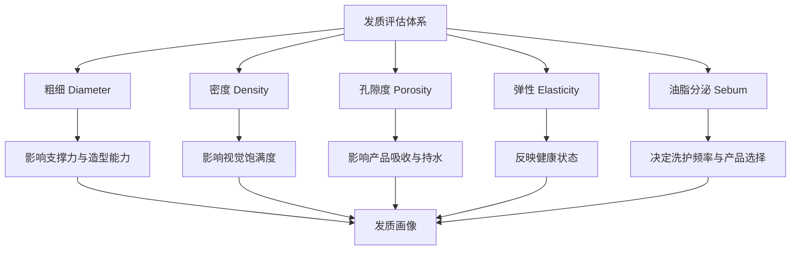
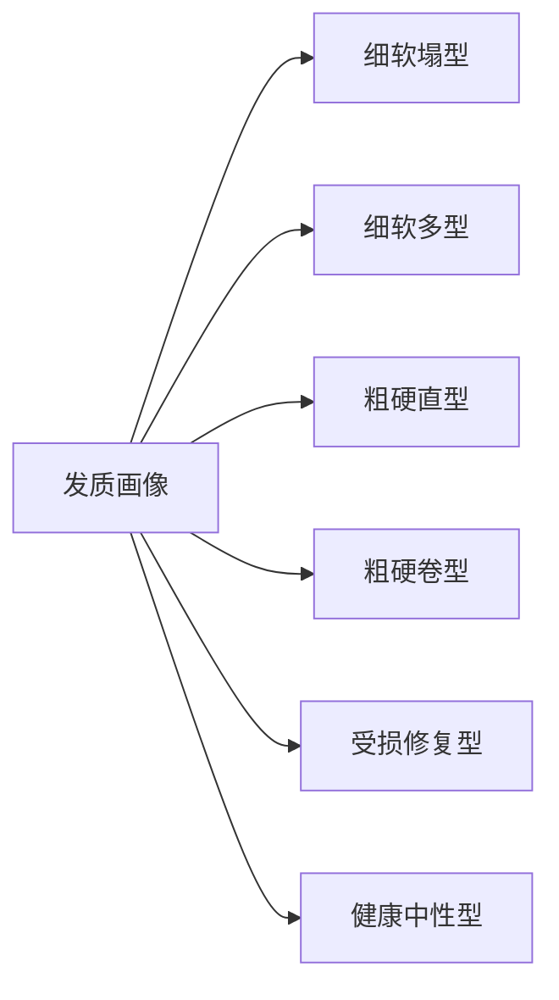
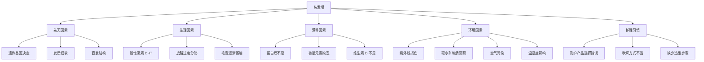

## 二、发质分析

上一章我们从微观层面理解了头发的生理结构——毛囊如何生长、毛干由哪些层次组成、角蛋白如何排列。本章要解决一个更实际的问题：**如何科学地评估自己的发质，以及不同发质特征背后的原因是什么。**

发质分析是选择发型、护理方案和造型产品的基础。选错发型最常见的原因不是"审美不行"，而是"不了解自己的头发"。一个适合粗硬发质的层次剪裁，放在细软发质上可能直接变成贴头皮的灾难。

### 2.1 发质的多维度评估体系

发质不是单一指标，而是由五个相互关联的维度共同构成的综合特性。这五个维度分别是：**粗细、密度、孔隙度、弹性、油脂分泌**。每个维度独立评估，最终组合成你的"发质画像"。

#### 维度一：粗细（Diameter）

头发的直径是发质最基础的指标，它直接决定了头发的强度、支撑力和造型能力。一根头发的直径大约是 50-100 微米（μm），肉眼几乎无法分辨差异，但这种微小的差距在造型效果上会被放大数百倍。

| 分类 | 直径范围 | 特征 | 触感 | 造型特点 | 发型师常用术语 |
|------|---------|------|------|----------|--------------|
| 细发 | < 60μm | 半透明，透光性强，容易折断 | 丝滑柔软，如丝绸 | 易扁塌，但热塑性好，容易定型 | "软塌""飘轻" |
| 中等发 | 60-80μm | 有一定韧性，微透光 | 柔中带刚，有弹性 | 最易打理，适应性最强 | "正常""标准" |
| 粗发 | > 80μm | 不透明，有明显硬度和重量 | 略硬，有"骨架感" | 支撑力好，但不易服帖，抗拒性强 | "硬""钢丝""倔强" |

**精确自我测试方法**：

1. **白纸法**（最简单）：取一根自然脱落的头发放于纯白纸上，观察其可见度。几乎看不清→细发；清晰可见且有存在感→中等发；很明显且投射出阴影→粗发。
2. **指腹法**（更精确）：取一根头发夹在拇指和食指之间，从发根滑到发梢。像触碰丝线般几乎没有感觉→细发；能感受到明显的"线"的存在→中等发；像摸到一根细铁丝，有扎手感→粗发。
3. **缠绕法**（辅助判断）：将头发缠绕在铅笔上。细发会紧贴铅笔表面，几乎无缝隙；粗发会形成螺旋状，有明显间距。
4. **断发观察法**：观察断裂的头发截面。细发断面通常呈斜切状（被拉断），粗发断面更可能是平整的（被折断），说明粗发刚性更强。

**关键认知**：粗细是天生的，无法通过护理"变粗"。市面上的"增粗"洗发水实际是通过在头发表面包裹聚合物来增加触感上的厚度，效果是暂时的，洗掉就恢复。真正的策略是：细发通过蓬松造型制造视觉厚度，粗发通过软化处理增加服帖度。

#### 维度二：密度（Density）

密度是指每平方厘米头皮上的头发数量，它决定了头发看起来是否"丰厚"。注意：密度和粗细是两个独立的维度。一个人可以是"细发+高密度"（看起来多但单根软），也可以是"粗发+低密度"（单根强但整体薄）。

| 分类 | 每平方厘米数量 | 视觉效果 | 适合的造型方向 |
|------|--------------|----------|--------------|
| 稀疏 | < 130 根 | 可见头皮，发缝明显 | 短发、增加蓬松感、避免贴头皮 |
| 中等 | 130-200 根 | 正常覆盖，偶尔可见头皮 | 最大范围的发型选择 |
| 浓密 | > 200 根 | 丰厚饱满，几乎看不到头皮 | 需要去量、打薄，否则厚重 |

**自我测试方法**：

1. **发缝观察法**：在头顶偏后方分一条 1cm 宽的发缝，观察头皮的可见面积。如果大面积可见→稀疏；如果只有细线→中等到浓密。
2. **马尾测量法**：将所有头发束成马尾，用软尺测量周长。周长 < 5cm→偏稀疏；5-8cm→中等；> 8cm→浓密。这是理发师常用的快速判断方法。
3. **拍照对比法**：在相同光线、相同角度下拍摄头顶照片（让别人帮忙或用延时自拍），与参考图片对比。

**密度的变化规律**：

- **年龄**：头发密度在 15-30 岁达到峰值，之后每年自然下降约 0.5-1%。到 50 岁时，密度可能只有年轻时的 70-80%。
- **季节**：秋季是自然脱发高峰期（夏季紫外线损伤的延迟效应），春季则是生长期高峰。
- **部位**：头顶和前额的密度天然低于后脑勺，这也是雄激素性脱发首先影响这些区域的原因。
- **性别**：女性的平均头发密度（约 280 根/cm²）高于男性（约 220 根/cm²），但男性单根头发直径通常更大。

#### 维度三：孔隙度（Porosity）

孔隙度描述了头发表面毛鳞片的开放程度，决定了头发吸收和保持水分的能力。这是最容易被忽视但对护理和造型影响最大的维度之一。理解孔隙度，就能理解为什么同样的护发产品在不同人头上效果天差地别。

**低孔隙度（Low Porosity）**：

- **微观状态**：毛鳞片紧密贴合，层层叠叠如屋顶瓦片，形成光滑的表面屏障。
- **水分行为**：水珠在头发表面会滚动（像荷叶上的水珠），而不是立即被吸收。头发需要较长时间才能完全浸湿。
- **护理特点**：护发素、发膜等产品难以渗透，停留在表面形成"堆积"。使用含硅油的产品会导致头发越来越沉重、油腻。
- **常见人群**：未经处理的健康头发、天生粗硬发质。
- **优势**：天然的屏障保护能力强，不容易受到外界损伤。
- **挑战**：营养难以渗透，深层护理需要加热辅助（热毛巾包裹或蒸汽帽）。

**中孔隙度（Medium Porosity）**：

- **微观状态**：毛鳞片适度开放，既不过紧也不过松。
- **水分行为**：头发能正常吸收和保持水分，湿润后不滴水，干燥后不毛躁。
- **护理特点**：这是最理想的状态，大部分产品都能正常发挥作用。
- **常见人群**：护理得当、没有过度染烫的头发。
- **优势**：有光泽、有弹性、容易造型、持型时间长。
- **保持策略**：避免过度化学处理，维持均衡护理即可。

**高孔隙度（High Porosity）**：

- **微观状态**：毛鳞片翘起甚至脱落，皮质层暴露在外，像剥落的墙皮。
- **水分行为**：水能快速进入也快速流失。头发洗完很快就干，但几小时后就变得干燥毛躁。
- **护理特点**：需要封闭型产品（如含硅油的护发素、植物油）来"封住"毛鳞片。水性产品反而会加重问题（快速蒸发带走更多水分）。
- **常见人群**：过度染烫、长期日晒、频繁使用高温工具的头发。
- **挑战**：容易打结、断裂、失去光泽，染色后褪色快。

**孔隙度测试——漂浮法**：

准备一杯室温清水（不是热水，温度会影响结果），取几根干净的、自然脱落的头发放入水中，等待 2-4 分钟观察：
- 头发始终浮在水面→低孔隙度
- 头发缓慢下沉到中间位置→中孔隙度
- 头发迅速沉底→高孔隙度

**注意**：这个测试的结果会受头发表面油脂和产品残留影响。测试前不要使用护发素或造型产品，否则会误判为低孔隙度。最准确的做法是用温和的洗发水清洗后自然干燥再测。

**孔隙度测试——喷水法**（更方便）：

洗完头自然干燥后，用喷雾瓶对着一小块区域喷水：
- 水珠停留在表面，5 秒以上不吸收→低孔隙度
- 水珠在 2-3 秒内被吸收→中孔隙度
- 水几乎瞬间消失→高孔隙度

#### 维度四：弹性（Elasticity）

弹性反映了头发内部二硫键和氢键的完整性，是判断头发健康程度最直观的指标。健康的头发本质上是一个"弹簧"——能被拉伸并恢复原状。

**测试方法**：

取一根湿润的头发（湿发的弹性变化更明显），用两手拇指和食指捏住两端，缓慢拉伸：

| 弹性等级 | 拉伸表现 | 健康状态 | 应对策略 |
|---------|---------|---------|---------|
| 高弹性 | 可拉伸 50% 以上，松手后完全恢复原长 | 健康——内部结构完整 | 维持现有护理即可 |
| 中等弹性 | 可拉伸 20-50%，恢复略有延迟 | 正常——轻微磨损 | 增加定期深层护理 |
| 低弹性 | 拉伸不到 20% 就断裂 | 受损——内部结构被破坏 | 需要修复型护理，减少化学处理 |
| 无弹性 | 一拉就断，几乎没有延展 | 严重受损——可能需要剪掉 | 无法修复，建议剪短重新开始 |

**为什么弹性如此重要**：

弹性直接关系到造型的持久性。低弹性的头发在做卷发时，卷度会在几小时内消失，因为头发内部的氢键已经被破坏，无法维持新的形状。这解释了为什么受损发质的人经常抱怨"做了造型也定不住"。

**影响弹性的因素**：

- **化学处理**：染发和烫发都会破坏二硫键，降低弹性。每次化学处理后弹性都会下降一个等级。
- **紫外线**：UV 辐射会降解角蛋白中的胱氨酸（cystine），这是维持弹性的关键氨基酸。
- **热损伤**：超过 180°C 的高温会使角蛋白变性，导致永久性弹性损失。
- **过度湿润-干燥循环**：反复吸水膨胀和脱水收缩会疲劳角蛋白纤维。

#### 维度五：油脂分泌（Sebum Production）

皮脂腺的活跃程度决定了头皮的油水平衡。油脂本身不是坏事——适量的皮脂能保护头皮、滋润头发、形成天然光泽。问题在于"过量"或"不足"。

| 类型 | 出油时间（洗头后到明显出油） | 头皮特征 | 头发表现 | 护理重点 |
|------|--------------------------|---------|---------|---------|
| 油性 | 12-24 小时 | 油腻、可能有异味 | 头发很快变得油腻、扁塌、粘连 | 控油、清洁、避免滋润型产品 |
| 中性 | 24-48 小时 | 状态均衡、无不适 | 头发有自然光泽、不油不干 | 常规护理即可 |
| 干性 | 48 小时以上 | 紧绷、可能发痒、有细小头屑 | 头发干燥、粗糙、易打结 | 保湿、滋润、减少洗头频率 |
| 混合型 | 发根 12-24 小时出油，发梢干燥 | T 区油腻，两颊可能干燥 | 发根扁塌，发梢毛躁分叉 | 分区护理——发根控油，发梢滋润 |

**自我判断方法**：

洗头后 24 小时，用一张吸油纸按压头顶、前额和后脑勺三个区域：
- 吸油纸大面积变透明→油性
- 有少量油迹→中性
- 几乎无油迹→干性
- 不同区域差异明显→混合型

**影响油脂分泌的关键因素**：

- **激素水平**：雄性激素（特别是 DHT）直接刺激皮脂腺分泌。青春期、压力大、睡眠不足时出油明显增加。
- **饮食**：高糖、高乳制品饮食会通过提升胰岛素样生长因子（IGF-1）间接增加皮脂分泌。
- **洗头频率**：过于频繁地洗头会刺激皮脂腺"补偿性分泌"，形成越洗越油的恶性循环。
- **温度和湿度**：夏季出油量通常比冬季多 30-50%。

### 2.2 发质综合画像：六种典型组合

将上述五个维度组合起来，可以归纳出六种最常见的发质画像。找到自己的类型，就能快速定位护理和造型方向。

| 发质画像 | 粗细 | 密度 | 孔隙度 | 弹性 | 油脂 | 核心挑战 |
|---------|------|------|--------|------|------|---------|
| 细软塌型 | 细 | 稀疏-中等 | 低-中 | 中-低 | 偏油 | 缺乏支撑力，容易贴头皮 |
| 细软多型 | 细 | 浓密 | 低-中 | 中 | 中性 | 看起来多但整体无力感 |
| 粗硬直型 | 粗 | 中等-浓密 | 低 | 高 | 中-偏油 | 不服帖，抗拒造型 |
| 粗硬卷型 | 粗 | 中等 | 中-高 | 中 | 干性 | 毛躁、干燥、难以控制 |
| 受损修复型 | 不均 | 不均 | 高 | 低 | 混合型 | 弹性差、干燥、易断裂 |
| 健康中性型 | 中等 | 中等 | 中 | 高 | 中性 | 维持即可，避免过度处理 |

**定位自己的画像**：按照粗细→密度→油脂→孔隙度→弹性的顺序逐一评估，然后对照上表。不需要精确匹配每个指标，找到最接近的类型即可。这个画像会成为后续选择发型、产品和技术方案的核心依据。

### 2.3 亚洲人发质的科学特征

亚洲人的头发在全球三大人种（亚洲、欧洲、非洲）中有其独特性。这些特征是数万年自然选择的结果——适应东亚寒冷干燥的气候，形成了不同于其他种族的头发特性。了解这些特点，才能避免盲目照搬欧美或日韩的发型方案。

**结构特征**：

| 特征 | 亚洲人 | 欧洲人 | 非洲人 |
|------|--------|--------|--------|
| 单根直径 | 80-100μm（最粗） | 50-70μm | 60-80μm |
| 横截面 | 圆形或近圆形 | 卵圆形 | 扁平椭圆形 |
| 卷曲度 | Type 1（直发） | Type 2（波浪） | Type 3-4（卷曲-紧密卷曲） |
| 毛鳞片层数 | 8-10 层（最多） | 5-7 层 | 4-6 层 |
| 生长期 | 2-7 年（最长） | 2-5 年 | 1-2 年（最短） |
| 自然发色 | 黑色（真黑色素为主） | 多样（褐黑色素为主） | 黑色（真黑色素为主） |

**亚洲发质的优势**：

1. **强度最高**：粗直径 + 圆形截面 + 多层毛鳞片 = 单根头发的机械强度全球最高。亚洲人很少出现头发自然断裂的问题，更多是整根脱落。
2. **天然光泽**：圆形截面使光线能均匀反射，加上毛鳞片排列紧密，亚洲人的直发天然就有丝绸般的光泽。
3. **抗损伤能力强**：多层毛鳞片提供了更好的保护屏障，同样的化学处理对亚洲头发的损伤程度比欧洲头发轻 20-30%。
4. **可留长**：最长的生长期意味着亚洲人可以留到很长的头发而不出现明显的发梢稀疏。

**亚洲发质的挑战**：

1. **出油倾向明显**：亚洲人头皮的皮脂腺密度和活跃度相对较高。研究数据显示，东亚男性头皮的皮脂分泌率比欧洲男性高约 15-20%。这直接导致头发更容易扁塌。
2. **缺乏卷曲支撑力**：直发没有天然的卷曲结构来制造"空间"，头发在重力作用下自然下垂，紧贴头皮。这是亚洲男性"头发塌"的根本物理原因。
3. **视觉收缩效应**：黑色是明度最低的颜色，在视觉上有"收缩"效果。相同体积的头发，黑发看起来比浅色头发少 10-15%。
4. **造型持久性差**：直发的角蛋白纤维排列整齐，氢键倾向于恢复原始状态。做好的卷发或蓬松造型在高湿度环境下会迅速"打回原形"。
5. **Type 1 分类的细分**：

| 子类型 | 特征 | 在亚洲人中的比例 |
|--------|------|----------------|
| Type 1a | 完全直，光滑如丝，几乎没有体积 | 约 40% |
| Type 1b | 直发但有轻微自然弧度，中等体积 | 约 45% |
| Type 1c | 直但粗硬，有轻微不服帖，粗直径 | 约 15% |

### 2.4 头发塌的深层原因分析

"头发塌"是亚洲男性最常见的发型困扰。要真正解决这个问题，必须从根源理解它——头发塌不是单一原因造成的，而是多个因素叠加的结果。

#### 原因一：遗传因素——无法改变但可以应对

头发的粗细、密度、卷曲度等核心特性主要由基因决定。目前已知有超过 200 个基因位点与头发形态相关，其中最关键的几个：

- **EDAR 基因**（rs3827760）：这个基因的变异（V370A）在东亚人群中极为常见（超过 90% 的携带率），它导致了更粗的头发直径、更多的汗腺密度，但同时也导致了更直的头发和更多的皮脂分泌。这个基因可以被称为"亚洲直发基因"。
- **TCHH 基因**：编码毛透明蛋白（trichohyalin），影响头发的卷曲度和弹性。
- **LCE1E 基因**：与毛鳞片的结构完整性相关，影响头发的光泽度。

**关键认知**：基因决定了你的"出厂设置"，但不决定最终效果。如果你的家族成员普遍有细软发质，那你大概率也是——但这不意味着无解。通过护理和造型技术，完全可以在原有基础上实现显著改善。基因是底牌，但打法更重要。

#### 原因二：激素影响——理解 DHT 的双重作用

雄性激素（特别是二氢睾酮/DHT）对头发有复杂而深远的影响。DHT 由睾酮经 5α-还原酶转化而来，它对头发的作用是"双面的"：

**DHT 对皮脂腺的刺激**：
- DHT 与皮脂腺上的雄激素受体结合，直接刺激皮脂分泌
- 青春期后（约 12-18 岁），DHT 水平急剧上升，皮脂分泌量可增加 2-3 倍
- 这就是为什么很多男性在青春期后明显感觉头发"变油变塌"

**DHT 对毛囊的损害**（在遗传易感人群中）：
- DHT 会使前额和头顶的毛囊逐渐微型化（miniaturization）
- 毛囊变小→生长期缩短→头发变细变短→最终毛囊完全萎缩
- 这个过程是渐进的，通常需要数年到数十年
- 后脑勺的毛囊对 DHT 不敏感，所以雄脱不会影响这个区域

**实际影响**：
- 如果你发现自己头顶和前额的头发比后脑勺明显变细、变软、变少，可能需要关注雄脱的早期迹象
- 如果只是整体出油多、头发塌但没有明显变细，那主要是皮脂分泌问题，不是雄脱

#### 原因三：营养因素——头发的"建筑材料"

头发虽然看起来是"死的"（因为没有神经和血管），但它的生长和质量严重依赖于毛囊从血液中获取的营养供应。角蛋白的合成需要特定的氨基酸、维生素和矿物质。

| 营养素 | 对头发的具体作用 | 缺乏时的表现 | 最佳食物来源 | 每日推荐量 |
|--------|----------------|-------------|------------|----------|
| 蛋白质 | 角蛋白的直接原料，提供半胱氨酸等关键氨基酸 | 头发变细、生长速度明显减慢、发色变浅 | 鸡蛋、鸡胸肉、牛肉、豆腐、鱼 | 体重(kg)×0.8-1.2g |
| 铁 | 血红蛋白携氧至毛乳头，支持细胞分裂 | 弥漫性脱发、发质变差、头发干枯 | 红肉（吸收率最高）、菠菜、黑木耳、动物肝脏 | 男性 8mg，女性 18mg |
| 锌 | 参与角蛋白合成的酶的辅因子，维持毛囊细胞分裂 | 脱发、头发稀疏、伤口愈合慢 | 牡蛎（锌含量最高食物）、牛肉、南瓜子 | 男性 11mg，女性 8mg |
| 生物素（B7） | 角蛋白合成的必要辅酶 | 头发脆弱、易断裂、可能出现弥漫性脱发 | 鸡蛋黄、坚果、红薯、牛油果 | 30μg |
| 维生素 D | 激活毛囊从休止期进入生长期 | 脱发风险增加、毛发生长周期异常 | 日晒（最佳来源）、三文鱼、蛋黄 | 600-1000 IU |
| Omega-3 脂肪酸 | 维持头皮皮脂膜健康，减少炎症 | 头皮干燥、头屑增多、头发失去光泽 | 深海鱼（三文鱼、鲭鱼）、亚麻籽、核桃 | 250-500mg EPA+DHA |
| 维生素 C | 胶原蛋白合成的必要物质，促进铁吸收 | 头发脆弱、发梢分叉、头皮微循环差 | 猕猴桃、彩椒、草莓、西兰花 | 100-200mg |
| 硒 | 抗氧化，保护毛囊免受自由基损伤 | 头发稀疏、脱发 | 巴西坚果（2颗即可满足日需）、海鲜 | 55μg |

**实用建议**：不需要逐一补充每种营养素。只要保证饮食中有足够的蛋白质（每餐一个手掌大小的优质蛋白）、每周吃 2-3 次深海鱼、每天一把坚果、多吃深色蔬菜，就能覆盖大部分头发所需的营养。只有在明确检测出缺乏时，才需要针对性地服用补充剂——过量补充某些微量元素（如硒、锌、维生素 A）反而会导致脱发。

#### 原因四：环境因素——看不见的日常损伤

环境对头发的影响是日积月累的，短期内几乎察觉不到，但长期来看效果显著：

**紫外线**：
- UV-B 辐射会直接降解角蛋白中的二硫键，削弱头发结构
- UV-A 辐射会氧化黑色素，导致发色变浅、变黄
- 夏季户外活动 2 小时的紫外线损伤，相当于一次轻度化学染发
- 保护措施：戴帽子是最有效的方式，其次是使用含 UV 过滤的护发喷雾

**硬水**：
- 硬水中的钙离子和镁离子会与洗发水中的表面活性剂结合，形成不溶性皂垢
- 这些矿物质沉积在毛鳞片上，增加头发重量、降低光泽、影响造型产品效果
- 中国北方大部分地区水质硬度较高（> 200mg/L），南方偏低
- 检测方法：烧开水后观察水垢，水垢多→硬水
- 解决方案：安装淋浴过滤器（约 200-500 元），或定期使用螯合洗发水（chelating shampoo）去除矿物质沉积

**空气污染**：
- PM2.5 颗粒物会附着在毛鳞片的缝隙中，堵塞表面，影响光泽
- 污染物中的自由基会加速角蛋白氧化降解
- 在高污染环境中，每天回家后用清水冲洗头发是有必要的

**温湿度**：
- **高湿度（> 70%）**：头发角蛋白吸收空气中的水分，氢键断裂后重组，直发变塌、卷发变毛躁。亚洲季风气候的梅雨季节是头发塌的"高危期"。
- **低湿度（< 30%）**：头发表面水分蒸发，产生静电，头发飘飞、毛躁。北方冬季供暖的室内是典型场景。

#### 原因五：不当的护理习惯——最常见的可控因素

以上四个原因中，遗传和激素难以改变，营养和环境需要长期调整。但护理习惯是最容易改正、见效最快的维度：

| 错误习惯 | 为什么是错的 | 正确做法 |
|---------|------------|---------|
| 使用清洁力过强的洗发水（含 SLS/SLES） | 过度去油→皮脂腺补偿性分泌→越洗越油 | 选氨基酸系或甜菜碱系温和表活 |
| 每天洗头 | 频繁清洁刺激皮脂腺，破坏头皮微生态 | 油性头皮隔天洗，干性 2-3 天洗一次 |
| 护发素涂在发根 | 护发素中的阳离子表活和硅油会增加发根负担，加速扁塌 | 只涂发中到发梢，距离头皮 3-5cm |
| 湿发时大力搓干 | 湿发毛鳞片处于打开状态，摩擦会造成严重的毛鳞片损伤 | 用毛巾按压吸水，或用旧 T 恤包裹 |
| 高温吹风不控距 | 吹风机出风口温度可达 80-120°C，距离 < 10cm 时对毛鳞片造成热冲击 | 保持 15-20cm 距离，中温中风，先吹发根 |
| 湿发入睡 | 湿发角蛋白处于膨胀状态，枕头摩擦造成毛鳞片大面积损伤 | 睡前至少将头发吹至八成干 |
| 不使用造型产品 | 亚洲直发缺乏天然支撑力，不用产品就是"裸奔" | 至少使用一个蓬松类造型产品 |

### 2.5 发质评估的完整流程

将以上所有维度整合为一个可操作的自测流程。建议在自然光下、刚洗完头自然干燥后进行。

**第一步：记录基础信息**
- 年龄、性别
- 最近 6 个月是否染烫
- 洗头频率
- 所在城市（关联水质和气候）

**第二步：逐项评估**

| 评估项目 | 测试方法 | 记录你的结果 |
|---------|---------|------------|
| 粗细 | 白纸法 + 指腹法 | 细 / 中 / 粗 |
| 密度 | 发缝观察法 + 马尾测量法 | 稀疏 / 中等 / 浓密 |
| 孔隙度 | 喷水法（洗后自然干燥） | 低 / 中 / 高 |
| 弹性 | 湿发拉伸法 | 高 / 中 / 低 |
| 油脂 | 24 小时吸油纸测试 | 油 / 中 / 干 / 混合 |

**第三步：组合画像**

将五项结果组合，对照 2.2 节的六种典型画像，找到最接近的类型。例如："细发 + 稀疏 + 低孔隙度 + 中弹性 + 偏油" = 细软塌型。

**第四步：记录环境因素**

| 因素 | 你的情况 |
|------|---------|
| 水质 | 硬水 / 软水 / 不确定 |
| 日常环境 | 室内办公 / 户外为主 / 混合 |
| 紫外线暴露 | 少（日常通勤）/ 中（经常户外）/ 高（户外工作） |
| 气候 | 干燥 / 湿润 / 四季分明 |

### 2.6 常见误区与纠正

**误区 1："我的头发又油又塌，应该用强力去油洗发水"**

纠正：强力去油会短期见效但长期恶化。皮脂腺被过度刺激后会加速分泌，形成"越洗越油"的恶性循环。正确做法是使用温和洗发水，同时配合蓬松造型产品来解决"塌"的问题。

**误区 2："护发素会让头发变油，所以不用"**

纠正：护发素涂在发根才会让头发变油。正确使用护发素（只涂发中到发梢）能降低毛鳞片摩擦，减少打结和断裂，对所有发质都有益。油性头皮可以选择"无硅油"配方的轻质护发素。

**误区 3："头发油说明身体好，不用管"**

纠正：适度出油是健康的标志，但过量出油可能是激素失衡、饮食不当或压力过大的信号。长期皮脂过多还会导致毛囊口堵塞，增加脱发风险。

**误区 4："经常剪头发能让头发变粗变多"**

纠正：剪发只影响发梢，不影响毛囊。剪发后头发看起来"变粗"是因为截面从细尖变成了平整断面，这是一种视觉错觉。头发数量由毛囊数量决定，出生后基本不变（只会减少）。

**误区 5："天然的就是最好的，少用化学产品"**

纠正：头发本身就是一个化学结构（角蛋白），护理和造型离不开化学产品。关键是选择适合自己的产品，而不是一刀切地拒绝。好的造型产品不仅能让发型更好，还能提供 UV 保护和热保护。

**误区 6："头发塌是洗头不够干净"**

纠正：头发塌的根本原因是缺乏支撑力（细软发质 + 重力），而不是"不够干净"。过度清洁反而会破坏头皮屏障，让问题更严重。蓬松感需要通过造型技术来创造。

### 2.7 进阶知识：从化学层面理解发质

这部分内容适合对头发科学有更深兴趣的读者。

**角蛋白的化学结构**：

头发的主体是角蛋白，一种纤维状蛋白质。角蛋白分子通过以下几种化学键连接，形成稳定的三维网络：

| 化学键类型 | 能量强度 | 特点 | 与发型的关系 |
|----------|---------|------|------------|
| 二硫键（S-S） | 最强 | 共价键，需要化学药剂才能打破 | 烫发的原理就是打破并重组二硫键 |
| 氢键 | 弱 | 水和热可暂时打破 | 吹风造型利用的就是氢键重组 |
| 盐键 | 中等 | 受 pH 值影响 | 酸性护发产品通过稳定盐键来闭合毛鳞片 |
| 范德华力 | 最弱 | 分子间的微弱吸引 | 影响头发的触感和滑度 |

**为什么湿发能定型，干了就恢复**：

当头发变湿时，水分子渗入角蛋白纤维之间，打断氢键，角蛋白链变得可移动。此时如果用外力改变头发形状（如卷在卷发筒上），角蛋白链会在新位置重新形成氢键。吹干后，氢键固定了新形状。但氢键是弱键，在高湿度环境下会被水分子再次打断，头发就会恢复原始形状——这就是为什么雨天造型容易"崩"。

**孔隙度的微观解释**：

毛鳞片由 6-10 层扁平的角质细胞堆叠而成，每层之间由脂质（主要是 18-MEA，18-甲基二十碳酸）粘合。低孔隙度意味着这些脂质层完整，毛鳞片紧密闭合；高孔隙度意味着脂质层被破坏，毛鳞片无法闭合——这就像门上的铰链坏了，门关不上。

化学染烫、紫外线、高温都会破坏这些脂质层，这是不可逆的。只能通过外部脂质（如护发油、含神经酰胺的产品）来"临时修复"，但无法恢复到原始状态。

---

> **本节小结**：发质分析是发型选择的地基。五个维度（粗细、密度、孔隙度、弹性、油脂）构成了你的发质画像，亚洲人的发质有其独特优势和挑战，头发塌是多因素叠加的结果。完成自测后，你将拥有选择发型和产品所需的基础认知。下一节我们将进入脸型分析——发质决定了"能做什么"，脸型决定了"该做什么"。
