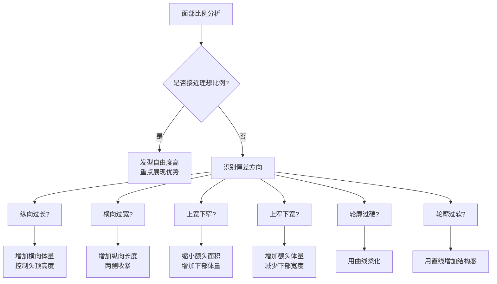
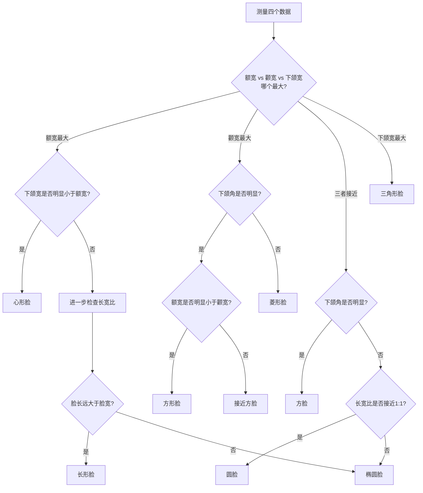

## 三、脸型与发型搭配

脸型是发型设计的第一坐标系。一个发型在圆脸上显得脸更圆，在方脸上却能柔化棱角——同样的剪裁，因为脸型不同，效果截然相反。理解脸型与发型的关系，本质上是理解**视觉比例的补偿原理**：发型的作用不是"好看"，而是让面部比例趋向和谐。

### 3.1 视觉比例的底层原理

#### 为什么脸型决定发型

人眼在观察面部时，会自动计算几个关键比例：

- **长宽比**：脸的长度与宽度之比，理想值约为1.3:1至1.5:1
- **三庭比例**：发际线→眉心、眉心→鼻底、鼻底→下巴，理想状态三段等长
- **五眼比例**：面部宽度约为五个眼睛的宽度
- **轮廓对称度**：左右两侧的对称程度

当这些比例偏离理想值时，人眼会感知为"不协调"。发型的核心功能就是**通过改变头部轮廓的视觉形状，补偿面部比例的偏差**。

#### 补偿方向速查表

| 面部问题 | 视觉补偿方向 | 发型手段 |
|----------|-------------|---------|
| 脸太长 | 缩短纵向、增加横向 | 刘海遮额、两侧蓬松、控制头顶高度 |
| 脸太宽 | 拉长纵向、减少横向 | 增加头顶高度、两侧收紧、侧分 |
| 额头太宽 | 缩小额头视觉面积 | 刘海遮挡、两侧下部增加体量 |
| 额头太窄 | 增加额头视觉宽度 | 头顶蓬松、鬓角留长、避免紧贴 |
| 下颌太宽 | 减少下部视觉宽度 | 两侧上方蓬松、避免两侧下方蓬松 |
| 下颌太尖 | 增加下部体量感 | 耳前留发、两侧下方适度保留 |
| 颧骨突出 | 弱化颧骨宽度 | 鬓角遮挡、两侧避免紧贴 |
| 轮廓过硬 | 增加柔和感 | 曲线纹理、碎发、避免整齐硬线条 |
| 轮廓过软 | 增加结构感 | 直线裁剪、棱角分明的造型 |

### 3.2 脸型的精确测量与判断

#### 测量工具与方法

**必备工具**：一面平面镜、一把软尺（裁缝用的软尺，精度1mm即可）。如果没有软尺，可以用手机自拍后在照片上用屏幕测量工具测量，但需要确保镜头与面部平行、距离固定（约50cm），否则透视变形会影响准确性。

**测量四个关键数据**：

1. **额宽**：左右发际线最宽处之间的距离。发际线的位置因人而异——有些人发际线呈M型（雄性激素脱发早期），有些人呈圆弧形。测量时取最外侧的点。
2. **颧宽**：左右颧骨最突出处之间的距离。用手指沿颧骨从耳朵方向向鼻子方向滑动，找到最突出的那个点。这个数据是判断脸型的核心依据。
3. **下颌宽**：左右下颌角最宽处之间的距离。下颌角位于耳朵下方、下颌骨转折处。有些人下颌角不明显（如圆脸），有些人非常突出（如方脸）。
4. **脸长**：发际线正中到下巴最底端的距离。注意是到下巴最底端，不是到下巴尖——有些人下巴较圆，有些人较尖。

**进阶测量（可选）**：

5. **太阳穴宽度**：左右太阳穴最宽处。这个数据对判断方形脸和菱形脸很重要。
6. **下巴长度**：鼻底到下巴底端的距离。单独测量下庭长度，判断是否与中庭、上庭等长。
7. **下颌角角度**：下颌骨从耳下到下巴的转折角度。方脸通常接近90°，圆脸则接近150°。

#### 八种脸型的判断标准

测量完数据后，按照以下流程判断：

**各脸型量化参考**：

| 脸型 | 额宽:颧宽:下颌宽 | 脸长:脸宽 | 关键辨识特征 |
|------|------------------|----------|-------------|
| 椭圆脸 | 约 1:1.05:0.95 | 约 1.3-1.5:1 | 三庭五眼均衡，轮廓柔和有结构感 |
| 圆脸 | 约 1:1:1 | 约 1:1 | 轮廓圆润，下颌线无明显转折 |
| 方脸 | 约 1:1:1 | 约 1:1 | 下颌角接近90°，轮廓硬朗 |
| 长脸 | 因人而异 | >1.5:1 | 脸长明显偏长，中庭或下庭偏长 |
| 菱形脸 | 约 0.85:1:0.85 | 约 1.3:1 | 颧骨最宽，额头和下巴较窄 |
| 三角脸 | 约 0.8:0.9:1 | 约 1.2:1 | 下颌最宽，额头最窄 |
| 心形脸 | 约 1:0.95:0.8 | 约 1.3:1 | 额头最宽，下巴尖细 |
| 方形脸 | 约 0.85:1:0.9 | 约 1.3:1 | 颧骨突出+下颌角明显，太阳穴凹陷 |

#### 测量中的常见误区

**误区一：凭照片判断脸型**
手机前置摄像头的广角畸变会让面部中心区域显得更大、边缘显得更小，导致圆脸看起来像椭圆脸、方脸看起来像圆脸。正确做法是让别人用后置摄像头在1米外拍摄，或者直接对着镜子用软尺测量。

**误区二：只看轮廓不看比例**
有些人下颌角不明显（看起来不像方脸），但额宽、颧宽、下颌宽几乎相等（实际是方脸）。判断脸型要以数据为准，不能只凭视觉印象。

**误区三：忽略发际线的影响**
发际线的形状和位置直接影响"脸长"的感知。M型发际线会让额头看起来更宽更高，圆形发际线则让额头看起来更小。测量时要准确找到发际线位置，不要被头发覆盖误导。

**误区四：体重变化导致的误判**
体重增加时，面部脂肪堆积会让轮廓变模糊——方脸可能看起来像圆脸，菱形脸可能看起来像椭圆脸。建议在体重稳定时测量，或者用手指触摸骨骼轮廓来确认骨骼结构。

### 3.3 八种脸型的发型设计策略

以下每种脸型的策略都遵循同一个逻辑：**识别面部比例的偏差方向 → 确定补偿目标 → 选择具体发型手段**。

#### 圆形脸（Round Face）

**脸型特征**：长宽比接近1:1，颧骨为面部最宽处，下颌线圆润无明显转折，整体轮廓柔和。圆脸给人亲切、年轻的感觉，但也容易显得"肉感"。

**核心问题**：面部纵向长度不足，横向宽度感过强。

**设计目标**：增加面部纵向长度，减少横向宽度感，增加轮廓的结构感。

**发型策略详解**：

1. **增加头顶高度**（最重要）
   - 头顶蓬松能在视觉上"拉长"脸型，这是圆脸最有效的补偿手段
   - 具体做法：吹风时逆着头发自然方向吹发根，用圆梳将发根撑起
   - 造型产品选择：蓬松粉（轻盈，适合细软发质）或发蜡（支撑力强，适合粗硬发质）
   - 头顶高度建议增加2-4cm，过高会变成长脸

2. **两侧适度收紧**
   - 两侧头发紧贴会暴露面部宽度，但完全推光又会失去过渡
   - 最佳方案：两侧渐变推剪（fade），从下到上逐渐变长，创造自然过渡
   - 推剪长度建议：下部#2-#3（6-9mm），上部保留3-5cm

3. **选择有棱角的发型线条**
   - 圆脸本身轮廓柔和，发型需要提供"棱角"来平衡
   - 纹理裁剪比光滑裁剪更适合——碎发的不规则感能打破圆脸的"圆"
   - 侧分线要清晰，不要模糊的三七分，而是明显的二八分或一九分

4. **避免齐刘海和两侧蓬松**
   - 齐刘海会"截断"面部纵向，让脸看起来更短更圆
   - 两侧蓬松会增加面部横向宽度，加重圆脸问题
   - 如果一定要刘海，选择碎刘海或斜刘海，露出部分额头

**推荐发型**：
- **侧分纹理**：最安全的选择，适合几乎所有场合
- **Pompadour（庞帕多）**：头顶高耸，经典圆脸解决方案
- **纹理前刺**：头顶向前上方翘起，增加纵向长度
- **渐变推剪+头顶中长**：现代感强，适合年轻群体

**避免发型**：
- 圆形蘑菇头——会"套"在圆脸上，让脸看起来更圆
- 齐刘海短发——缩短纵向比例
- 两侧蓬松的卷发——增加横向宽度
- 完全对称的中分——强调圆脸的对称性

#### 方形脸（Square Face）

**脸型特征**：额宽、颧宽、下颌宽几乎相等，下颌角明显（接近90°），轮廓硬朗。方脸给人坚毅、有力量感的印象，但也容易显得过于"硬"。

**核心问题**：下颌角过于突出，轮廓缺乏柔和感。

**设计目标**：柔化下颌线条，增加面部的柔和感和层次感。

**发型策略详解**：

1. **增加头顶蓬松度**
   - 与圆脸类似，头顶蓬松能拉长面部比例，但方脸的重点不是"拉长"而是"打破方正"
   - 头顶长度建议5-8cm，用纹理裁剪制造不规则感
   - 避免头顶过于整齐——整齐的线条会与方脸的硬朗线条"叠加"

2. **两侧保留一定长度**
   - 方脸两侧完全推光会暴露下颌角的宽度
   - 建议两侧保留1-3cm的长度，用碎发柔化轮廓线
   - 鬓角可以适当留长，遮挡部分下颌角

3. **选择有弧度的发型线条**
   - 曲线能柔化方脸的硬朗感——纹理碎盖的不规则碎发效果很好
   - 卷发或纹理烫比直发更适合方脸
   - 发型整体线条应该是"流动的"而非"切割的"

4. **避免过于整齐的发型**
   - 板寸、光面后梳、硬朗侧分——这些发型的整齐线条会与方脸的线条"叠加"，强化方正感
   - 如果职业要求整洁，至少在头顶保留纹理感

**推荐发型**：
- **纹理碎盖**：碎发遮挡额头，纹理柔化轮廓，方脸首选
- **微分碎盖**：比纹理碎盖更清爽，适合夏季
- **自然卷纹理**：如果本身有自然卷，利用卷曲度柔化方脸
- **侧分纹理**：侧分线打破方脸的对称感

**避免发型**：
- 板寸——完全暴露方正轮廓
- 硬朗侧分——整齐线条叠加方脸线条
- 两侧完全推光——暴露下颌角宽度
- 齐刘海——缩短纵向比例，让方脸更"方"

#### 长形脸（Oblong/Long Face）

**脸型特征**：脸长明显大于脸宽（长宽比>1.5:1），三庭中上庭或下庭偏长，面部整体呈纵向拉长。长脸给人成熟、清瘦的印象，但也容易显得"窄长"。

**核心问题**：面部纵向过长，横向宽度不足。

**设计目标**：缩短面部视觉长度，增加横向宽度感。

**发型策略详解**：

1. **刘海是长脸的"救命稻草"**（最重要）
   - 刘海能直接"截断"面部纵向长度，是长脸最有效的补偿手段
   - 碎刘海：遮挡部分额头，减少上庭长度，同时不显厚重
   - 齐刘海：遮挡效果最强，但需要搭配两侧蓬松，否则会显得脸更窄
   - 斜刘海：兼顾遮挡和不对称感，适合不想完全遮额的人
   - 避免完全露额——会让额头和面部纵向线条连成一体，显得更长

2. **增加两侧宽度**
   - 两侧蓬松能在视觉上拓宽面部，改善长宽比
   - 具体做法：两侧保留5-8cm长度，用纹理或微卷增加体量
   - 两侧的层次裁剪能增加蓬松感，避免头发紧贴
   - 避免两侧推剪——会让脸看起来更窄更长

3. **控制头顶高度**
   - 长脸最忌讳的就是头顶过高——会让脸看起来更长
   - 头顶长度控制在3-5cm，不要做高耸的造型
   - 吹风时不要逆着发根吹，而是顺着头发方向压低

4. **避免中分**
   - 中分会强调面部的纵向线条，让脸看起来更长
   - 如果一定要中分，两侧必须有足够的体量来增加横向宽度

**推荐发型**：
- **纹理碎盖（刘海遮额）**：长脸最安全的选择
- **微分碎盖**：比纹理碎盖更清爽
- **韩式逗号刘海**：刘海呈逗号形状，遮挡额头同时增加弧度
- **两侧中长+刘海**：增加横向体量，遮挡额头

**避免发型**：
- 高耸的Pompadour——增加头顶高度，拉长脸型
- 光面后梳——完全露额，暴露面部纵向长度
- 无刘海露额发型——让额头和面部纵向线条连成一体
- 两侧推剪——减少横向宽度

#### 椭圆形脸（Oval Face）

**脸型特征**：三庭五眼比例均衡，脸长约为脸宽的1.3-1.5倍，轮廓柔和但有结构感。椭圆脸被普遍认为是"最标准"的脸型——但这个说法需要辩证看待。

**关于"椭圆脸最标准"的真相**：
- 所谓"标准"是指椭圆脸的发型自由度最高，不是说其他脸型"不标准"
- 每种脸型都有独特的美感——方脸的坚毅、圆脸的亲切、菱形脸的立体感
- 椭圆脸的优势是不需要用发型来"修正"脸型，可以纯粹从审美角度选择发型

**设计目标**：保持比例均衡，充分发挥面部优势，大胆尝试不同风格。

**发型策略详解**：

1. **几乎适合所有发型**
   - 这是椭圆脸最大的优势——从板寸到长发，从侧分到中分，都可以尝试
   - 但"都适合"不意味着"随便选"——还是要考虑发质、发量、个人风格

2. **避免过度遮挡**
   - 椭圆脸不需要用刘海来"修正"脸型
   - 过多的遮挡会浪费面部比例优势
   - 露额发型能展现椭圆脸的均衡比例

3. **可以大胆尝试各种风格**
   - 如果想展现成熟感：Pompadour、侧分后梳
   - 如果想展现年轻感：纹理碎盖、前刺
   - 如果想展现个性：Undercut、Mohawk变体

4. **注意头顶高度**
   - 唯一需要注意的是：头顶过高会让椭圆脸变成长脸
   - 保持适度即可，不要刻意追求高耸

**推荐发型**：
- **Pompadour**：展现面部轮廓优势
- **侧分后梳**：经典商务风格
- **纹理碎盖**：年轻时尚
- **板寸**：如果五官立体，板寸反而最能展现椭圆脸优势

**特别推荐**：能够展现面部轮廓优势的露额发型——椭圆脸的均衡比例在露额时最为明显。

#### 菱形脸（Diamond Face）

**脸型特征**：颧骨为面部最宽处，额头和下巴较窄，整体呈菱形轮廓。菱形脸给人立体、有棱角的印象，在西方审美中被视为"高级脸"。

**核心问题**：颧骨过宽、额头和下巴过窄，面部上下区域体量不足。

**设计目标**：增加额头和下巴的视觉宽度，弱化颧骨宽度。

**发型策略详解**：

1. **增加额头区域的体量**（最重要）
   - 头顶蓬松能增加额头区域的视觉宽度
   - 刘海（碎刘海、斜刘海）能遮挡部分额头同时增加体量
   - 避免完全露额——会暴露额头窄的问题

2. **鬓角留长，遮挡颧骨**
   - 鬓角是遮挡颧骨的关键——保留3-5cm长度
   - 鬓角的碎发能柔化颧骨的突出感
   - 避免鬓角完全推光——会让颧骨显得更突出

3. **两侧避免过于紧贴**
   - 两侧紧贴会让颧骨显得更宽
   - 两侧保留一定体量，创造从额头到下巴的平滑过渡

4. **下巴区域可以露出**
   - 下巴是菱形脸的优势区域——线条清晰
   - 不需要用头发遮挡下巴

**推荐发型**：
- **纹理碎盖**：碎发遮挡额头，纹理增加体量
- **侧分刘海**：刘海增加额头体量，侧分打破对称
- **前刺**：头顶向前翘起，增加额头区域视觉宽度
- **两侧中长纹理**：遮挡颧骨，柔化轮廓

**避免发型**：
- 两侧完全推光——暴露颧骨宽度
- 紧贴头皮的发型——强调颧骨突出
- 中分——强调面部中心线，让颧骨更明显

#### 三角形脸（Triangle Face）

**脸型特征**：下颌为面部最宽处，额头最窄，整体呈倒三角形。三角脸给人稳重、有力量感的印象，但也容易显得"头重脚轻"（实际上相反——下重上轻）。

**核心问题**：上窄下宽，额头和太阳穴区域体量不足。

**设计目标**：增加额头和太阳穴区域的视觉宽度，减少下颌宽度感。

**发型策略详解**：

1. **增加头顶和两侧上方的体量**（最重要）
   - 头顶蓬松能增加额头区域的视觉宽度
   - 太阳穴区域的头发要保留体量，不能紧贴
   - 具体做法：头顶保留5-8cm，用纹理或微卷增加蓬松感

2. **避免两侧下方过于蓬松**
   - 两侧下方蓬松会加重"上窄下宽"的视觉感
   - 两侧下方可以适当收紧，减少下颌区域的视觉宽度

3. **刘海可以遮挡窄额头**
   - 碎刘海或斜刘海能让额头看起来更宽
   - 避免完全露额——会暴露额头窄的问题

4. **鬓角适当保留**
   - 鬓角保留2-3cm，增加太阳穴区域的宽度
   - 鬓角的碎发能柔化从额头到下颌的过渡

**推荐发型**：
- **纹理碎盖**：增加头顶体量，碎发遮挡窄额头
- **侧分**：侧分线增加不对称感，打破三角形轮廓
- **增加头顶高度的发型**：Pompadour变体、前刺

**避免发型**：
- 紧贴头皮的发型——暴露上窄下宽的轮廓
- 两侧下方蓬松的发型——加重下颌宽度感
- 完全露额——暴露额头窄的问题

#### 心形脸（Heart Face）

**脸型特征**：额头最宽，下巴尖细，整体呈心形。心形脸给人精致、有灵气的印象，在东方审美中被视为"好看的脸型"。

**核心问题**：上宽下窄，额头视觉面积过大，下巴体量不足。

**设计目标**：减少额头的视觉宽度，增加下巴区域的体量感。

**发型策略详解**：

1. **刘海是心形脸的关键工具**
   - 碎刘海能遮挡部分额头，减少额头的视觉宽度
   - 斜刘海能打破额头的对称感
   - 避免完全露额——会让额头显得更宽

2. **避免头顶过高**
   - 头顶过高会让额头显得更宽，加重上宽下窄的问题
   - 头顶保持适度高度即可

3. **两侧下方可以保留长度**
   - 两侧下方保留一定长度，能平衡下巴的尖细感
   - 耳前的头发可以留长一些，增加下部体量

4. **整体保持柔和线条**
   - 心形脸本身轮廓柔和，发型也要保持柔和
   - 避免过于硬朗的裁剪——会与脸型的柔和感冲突

**推荐发型**：
- **纹理碎盖**：碎发遮挡额头，纹理增加柔和感
- **侧分刘海**：刘海减少额头宽度，侧分增加不对称
- **中等长度的自然发型**：保持柔和的线条
- **两侧中长+刘海**：遮挡额头，增加下部体量

**避免发型**：
- 高耸的发型——让额头显得更宽
- 完全露额的发型——暴露额头宽度
- 两侧推光——减少下部体量，加重上宽下窄

#### 方形脸（Pentagonal Face）

**脸型特征**：额头较窄、颧骨宽且突出、下颌角明显，结合了菱形脸和方脸的特点。方形脸在亚洲男性中相当常见——颧骨突出+下颌角明显的组合，给人棱角分明的印象。

**核心问题**：三重问题叠加——太阳穴凹陷（额头窄）、颧骨突出、下颌角明显。

**设计目标**：拓宽额头、弱化颧骨、柔化下颌，创造从上到下的平滑过渡。

**发型策略详解**：

1. **头顶必须蓬松**（最重要）
   - 头顶蓬松能拉长脸型，弱化颧骨的视觉宽度
   - 同时增加额头区域的视觉宽度，弥补太阳穴凹陷
   - 头顶长度建议5-8cm，用纹理裁剪制造蓬松感

2. **刘海选择纹理碎盖**
   - 碎盖能遮挡太阳穴凹陷，柔化上半部分轮廓
   - 碎发的不规则感能打破五角形的棱角感
   - 避免整齐的刘海——会与五角形的线条冲突

3. **鬓角中等长度**
   - 鬓角保留3-5cm，遮挡部分颧骨
   - 鬓角的碎发能柔化从太阳穴到下颌的过渡
   - 避免鬓角完全推光——会暴露颧骨和下颌角

4. **两侧适度收紧**
   - 配合头顶蓬松，两侧适度收紧能创造"上宽下窄"的理想比例
   - 两侧可以做渐变推剪（fade），但上部要保留足够长度来遮挡颧骨

5. **整体选择曲线为主**
   - 曲线能柔化五角形的棱角感
   - 纹理裁剪比光滑裁剪更适合
   - 卷发或纹理烫能增加柔和感

**推荐发型**：
- **纹理碎盖（首选）**：遮挡太阳穴，柔化轮廓，增加头顶体量
- **微分碎盖**：比纹理碎盖更清爽，适合夏季
- **韩式逗号刘海**：刘海呈逗号形状，遮挡额头同时增加弧度
- **侧分纹理**：侧分线打破对称感，纹理增加柔和度

**避免发型**：
- 两侧紧贴头皮的发型——暴露颧骨和下颌角
- 完全露额的平头——暴露太阳穴凹陷和额头窄
- 中分——强调面部中心线，让颧骨更明显
- 两侧完全推光——暴露所有棱角

### 3.4 脸型之外：头型对发型的影响

脸型决定发型的"正面效果"，头型决定发型的"侧面效果"。很多人的正面发型很好看，但侧面一塌糊涂——问题往往出在头型上。

#### 四种基本头型

**扁头（后脑勺扁平）**
- **特征**：侧面看后脑勺缺乏弧度，几乎是平的
- **成因**：婴儿时期长时间仰睡，头骨在柔软期被压扁。这在中国人中非常常见——统计显示超过60%的中国成年人有不同程度的后脑扁平
- **影响**：后梳发型会暴露扁头问题；侧面看缺乏立体感
- **解决方案**：
  - 后脑区域保留更多长度（至少5cm），用体量弥补弧度
  - 使用造型产品（发蜡、发泥）制造后脑的蓬松感
  - 考虑后脑区域的纹理烫——烫发能永久性增加后脑体量
  - 避免完全后梳的发型——会暴露扁头
  - 侧面推剪时，后脑区域不要推得太短

**圆头（头型饱满）**
- **特征**：头型圆润饱满，侧面看弧度优美
- **优势**：适合各种发型，特别是后梳和露额发型
- **注意事项**：头顶不要做太高——圆头本身就有高度，再加高会显得头太长

**尖头（头顶偏尖）**
- **特征**：头顶偏尖，从正面看头型呈三角形
- **影响**：头顶做高会显得"尖上加尖"
- **解决方案**：
  - 控制头顶高度，不要做高耸的造型
  - 两侧保持一定体量，平衡头顶的尖感
  - 选择两侧蓬松的发型，让头型看起来更匀称

**不对称头型**
- **特征**：两侧头型略有不同——一侧更平、一侧更圆
- **影响**：对称的发型在不对称的头型上会显得歪斜
- **解决方案**：
  - 在修剪时针对两侧做不同调整——扁的一侧多留长度
  - 选择不对称的发型（侧分、斜刘海），掩盖头型不对称
  - 造型时重点照顾扁的一侧，用产品制造蓬松感

#### 头型与脸型的组合策略

头型和脸型需要同时考虑，有时两者的需求会冲突：

| 组合 | 冲突点 | 解决方案 |
|------|--------|---------|
| 圆脸+扁头 | 圆脸需要两侧收紧，扁头需要后脑蓬松 | 两侧收紧但后脑保留体量，用渐变推剪过渡 |
| 长脸+尖头 | 长脸需要控制头顶高度，尖头本身头顶就高 | 头顶绝对不能做高，用刘海遮挡额头来缩短脸长 |
| 方脸+扁头 | 方脸需要柔化轮廓，扁头需要后脑体量 | 后脑保留长度+纹理烫，两侧用碎发柔化 |
| 方形脸+扁头 | 方形脸需要头顶蓬松，扁头需要后脑蓬松 | 两个方向都做蓬松，整体体量感要足够 |

### 3.5 发质与发量对脸型策略的修正

同样的脸型策略，因为发质和发量不同，执行方式会有很大差异。

#### 发质维度的修正

**细软发质**
- 问题：支撑力不足，头顶容易塌，蓬松效果不持久
- 修正方案：
  - 使用蓬松粉或蓬松喷雾增加发根支撑力
  - 吹风时用圆梳逆向吹发根
  - 考虑纹理烫——烫发能永久性增加蓬松感
  - 选择较短的发型——细软发质留太长会显得稀薄
  - 避免需要大量体量的发型（如Pompadour）

**粗硬发质**
- 问题：头发硬挺不服贴，两侧容易"炸开"
- 修正方案：
  - 两侧需要推短或做渐变——粗硬发质两侧留长会显得很乱
  - 使用发蜡或发泥——比发油更适合粗硬发质
  - 考虑软化处理——让头发更容易造型
  - 选择需要"支撑力"的发型——粗硬发质天然适合Pompadour

**自然卷发质**
- 问题：卷曲度不可控，造型难度大
- 修正方案：
  - 利用卷曲度——自然卷适合纹理碎盖、卷发造型
  - 不要试图把卷发拉直——维护成本高，效果不持久
  - 选择适合卷发的发型——让卷曲度成为优势而非问题
  - 使用卷发专用的造型产品（卷发慕斯、卷发弹力素）

#### 发量维度的修正

**发量偏少**
- 问题：缺乏体量，蓬松效果不明显
- 修正方案：
  - 选择较短的发型——发量少留长会显得更稀薄
  - 使用蓬松粉增加视觉体量
  - 考虑纹理烫——烫发能让每根头发占据更多空间
  - 避免中分——中分会暴露发缝处的稀疏
  - 刘海是好帮手——刘海能遮挡发际线处的稀疏

**发量偏多**
- 问题：头发厚实，容易显得"厚重"
- 修正方案：
  - 打薄是必要的——让发型师适当打薄
  - 两侧需要推短——发量多两侧留长会显得很"膨胀"
  - 选择层次裁剪——减少厚重感
  - 可以尝试需要体量的发型——发量多是优势

### 3.6 常见误区与纠正

#### 误区一：照搬明星发型

**错误做法**：看到某个明星的发型好看，直接拿照片让发型师"剪一样的"。

**为什么是错的**：
- 明星的脸型、头型、发质、发量与你不同
- 明星的照片经过造型师打理、灯光修饰、后期修图
- 同一个发型在不同脸型上效果完全不同

**正确做法**：
- 分析明星发型的核心特征（长度、纹理、分线方向）
- 判断这些特征是否适合自己的脸型
- 与发型师沟通时，说明"我要这个方向的效果"而非"剪一模一样的"

#### 误区二：只看正面不看侧面

**错误做法**：只从正面评价发型效果，忽略侧面和后面。

**为什么是错的**：
- 别人看你不是只看正面——侧面、45°角、背面都是常见视角
- 扁头问题只有侧面才能看出来
- 后脑的弧度、鬓角的处理、颈部的渐变——都需要从侧面和后面检查

**正确做法**：
- 剪完头发后，让发型师用镜子照侧面和后面
- 自己用手机拍侧面和后面的照片
- 重点关注后脑弧度、鬓角线条、颈部渐变

#### 误区三：忽略头发的生长方向

**错误做法**：不考虑头发自然生长方向，强行做逆向造型。

**为什么是错的**：
- 每个人的头发都有自然生长方向——发旋的位置和方向是固定的
- 逆着生长方向的发型很难维持，需要大量造型产品
- 发旋周围的头发容易"翘起来"，影响造型效果

**正确做法**：
- 观察自己的发旋位置和头发自然倒向
- 选择与自然生长方向一致或兼容的发型
- 如果想做逆向造型（如后梳），需要更强的造型产品和更频繁的打理

#### 误区四：过度追求"显脸小"

**错误做法**：只关注"显脸小"，忽略整体比例和协调感。

**为什么是错的**：
- "显脸小"不是发型的唯一目标——还要考虑气质、风格、场合
- 过度追求显脸小可能导致发型与个人风格不匹配
- 有些脸型不需要"显小"——椭圆脸、心形脸本身就是优势脸型

**正确做法**：
- 把"修正脸型比例"作为发型设计的一个因素，而非唯一因素
- 综合考虑个人风格、职业需求、打理成本
- 接受自己的脸型特点，用发型放大优势而非只弥补劣势

#### 误区五：频繁更换发型

**错误做法**：每隔几周就换一个完全不同的发型。

**为什么是错的**：
- 头发有生长周期——从短到长需要时间
- 频繁更换发型意味着每次都从头开始，没有积累
- 找到适合自己的发型需要时间和耐心

**正确做法**：
- 找到适合脸型的基本方向后，保持稳定
- 可以在基本方向上做微调——长度、纹理、分线方向
- 每次换发型前想清楚：为什么要换？是腻了还是真的不合适？

### 3.7 实操流程：从测量到落地

#### 第一步：测量脸型（5分钟）

1. 准备软尺和镜子
2. 测量额宽、颧宽、下颌宽、脸长
3. 计算比例关系，对照3.2节的表格判断脸型
4. 用手机拍摄正面、侧面、45°角各一张照片备用

#### 第二步：分析头型（3分钟）

1. 用手触摸后脑勺，判断是否扁平
2. 从侧面观察头顶弧度，判断是否偏尖
3. 比较两侧头型是否对称
4. 记录头型特征，与脸型结合分析

#### 第三步：评估发质和发量（2分钟）

1. 判断发质：细软/中等/粗硬
2. 判断发量：偏少/中等/偏多
3. 观察自然卷程度：直发/微卷/明显卷曲
4. 观察头发自然生长方向和发旋位置

#### 第四步：确定发型方向（5分钟）

1. 根据脸型确定基本策略（参考3.3节）
2. 根据头型修正策略（参考3.4节）
3. 根据发质和发量修正策略（参考3.5节）
4. 综合以上因素，确定发型方向：
   - 头顶长度：短（<3cm）/ 中（3-5cm）/ 长（5-8cm）
   - 两侧处理：推剪/渐变/保留
   - 刘海方案：无刘海/碎刘海/斜刘海/齐刘海
   - 造型风格：光滑/纹理/卷曲

#### 第五步：与发型师沟通（10分钟）

1. 带上参考照片（但要说明"不是要一模一样的"）
2. 说明自己的脸型分析结果和设计目标
3. 沟通头顶长度、两侧处理、刘海方案
4. 确认发型师理解你的需求——让他复述一遍
5. 询问需要哪些造型产品和日常打理方法

#### 第六步：日常打理（每天5-10分钟）

1. 洗发后不要自然干——用吹风机配合造型
2. 吹风方向要与发型设计一致
3. 使用适合发质的造型产品
4. 出门前检查正面、侧面效果
5. 随身携带小梳子或手指，随时整理

### 3.8 快速参考：脸型-发型速查表

| 脸型 | 核心策略 | 首选发型 | 绝对避免 |
|------|---------|---------|---------|
| 圆脸 | 拉长纵向、增加棱角 | 侧分纹理、Pompadour | 圆形蘑菇头、齐刘海 |
| 方脸 | 柔化轮廓、增加曲线 | 纹理碎盖、自然卷纹理 | 板寸、硬朗侧分 |
| 长脸 | 缩短纵向、增加横向 | 碎盖+刘海、韩式逗号刘海 | 高耸Pompadour、露额 |
| 椭圆脸 | 展现优势、大胆尝试 | 几乎全部 | 过度遮挡 |
| 菱形脸 | 增加额头体量、遮挡颧骨 | 纹理碎盖、侧分刘海 | 两侧推光、紧贴头皮 |
| 三角脸 | 增加上部体量、减少下部宽度 | 纹理碎盖、增加头顶高度 | 紧贴头皮、下方蓬松 |
| 心形脸 | 缩小额头、增加下部体量 | 碎盖+刘海、两侧中长 | 高耸发型、完全露额 |
| 方形脸 | 拓宽额头、弱化颧骨、柔化下颌 | 纹理碎盖（首选）、微分碎盖 | 两侧紧贴、露额平头 |

### 3.9 进阶：当脸型"不标准"时怎么办

大多数人的脸型不是纯粹的某一种，而是两种甚至三种脸型的混合。比如：
- 圆脸+方脸：长宽比接近1:1（圆脸特征），但下颌角明显（方脸特征）
- 菱形脸+方形脸：颧骨突出（共同特征），但太阳穴凹陷程度不同
- 心形脸+长脸：额头宽（心形脸特征），但脸长偏长（长脸特征）

**混合脸型的处理原则**：

1. **找到最突出的问题**：哪种偏差最明显，优先修正
2. **兼顾次要问题**：在修正主要问题的同时，不加重次要问题
3. **折中策略**：如果两种脸型的策略冲突，取折中方案
4. **试错调整**：混合脸型没有标准答案，需要通过实际尝试找到最佳方案

**示例**：圆脸+方脸
- 主要问题：轮廓过于方正（方脸特征更突出）
- 策略：优先柔化轮廓（方脸策略），同时增加头顶高度（圆脸策略）
- 推荐发型：纹理碎盖——碎发柔化方脸棱角，头顶蓬松拉长圆脸
