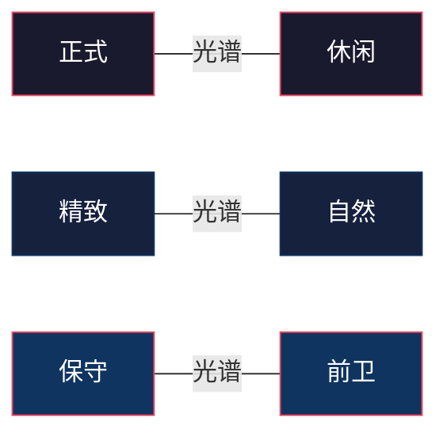
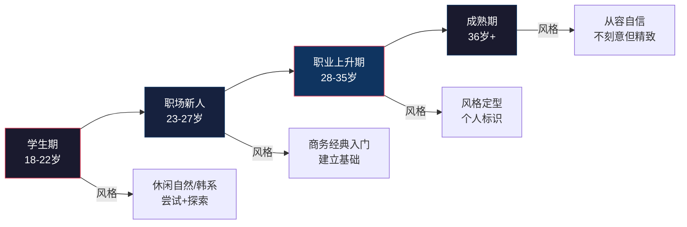
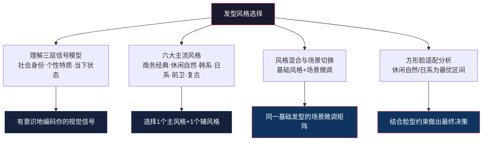

## 四、发型风格分类

脸型决定了发型的"能做什么"，发质决定了发型的"能做到什么程度"，而风格决定了发型的"要表达什么"。前两节解决了技术约束问题，本节解决的是方向选择问题——在你可行的发型空间里，哪种风格最能放大你的个人优势。

风格不是"好看不好看"的问题，而是"对不对"的问题。一个完美的Undercut如果出现在法院开庭现场，效果可能是负面的。风格选择的本质是：**在正确的场合，用正确的视觉语言，传递正确的信号**。

### 4.1 风格选择的底层逻辑

#### 4.1.1 风格是什么：视觉信号的编码系统

发型风格本质上是一种**非语言沟通系统**。人类在0.1秒内就能从视觉信息中提取出一个人的"类型标签"——这是进化赋予我们的快速分类能力。发型在这个分类过程中扮演了关键角色。

心理学家Alexander Todorov在普林斯顿大学的研究表明，人们仅凭面部外观（发型是重要组成部分）就能在100毫秒内形成对一个人能力、可信度和攻击性的判断。虽然这些判断未必准确，但它们在社交中的影响力是真实的。

发型风格传递的信号可以分为三个层次：

| 信号层次 | 内容 | 示例 |
|---------|------|------|
| **社会身份** | 职业、阶层、所属群体 | 商务背头＝职业人士；脏辫＝亚文化群体 |
| **个性特质** | 性格、态度、审美倾向 | 精细侧分＝严谨有序；凌乱纹理＝随性自由 |
| **当下状态** | 心情、意图、场合需求 | 精心打理＝重视当前场合；随意扎起＝放松状态 |

理解这个三层信号模型后，你就能有意识地"编码"自己的发型，而不是随意选择。

#### 4.1.2 风格≠发型：一个关键区分

很多人把"风格"和"发型"混为一谈，这是一个根本性错误。**同一种发型在不同人身上可以呈现完全不同的风格**。例如：

- **侧分（Side Part）**：用发油梳得一丝不苟＝商务经典；用手随意拨出纹理＝休闲自然；用大量定型喷雾做出夸张高度＝潮流前卫
- **短碎盖**：保留自然发色、不刻意造型＝日常自然；染成冷棕色、做出明显纹理＝韩系柔和
- **背头（Slick Back）**：光面紧贴＝复古绅士；蓬松后梳＝现代商务；带碎发质感的后梳＝日系质感

**核心认知**：你需要选择的不是"哪款发型"，而是"哪种风格方向"，然后在这个方向下找到适合你脸型和发质的具体发型。风格是上层决策，发型是下层执行。

#### 4.1.3 风格的光谱：不是非此即彼

发型风格不是离散的分类，而是一个**连续的光谱**。大多数人的真实风格是2-3种风格的混合，而不是纯粹的某一种。理解这个光谱有助于你找到自己的精确位置：

你可以在这三条光谱上分别定位自己，三个坐标的交叉点就是你的风格区间。例如：偏正式 × 偏精致 × 中间保守度 ＝ 商务精英风格；偏休闲 × 偏自然 × 略偏前卫 ＝ 日系自然风格。

### 4.2 男士主流发型风格详解

#### 4.2.1 商务经典风格（Business Classic）

**风格定义**：以整洁、专业、可信赖为核心的发型语言。强调秩序感和精致感，是职场和正式场合的"安全牌"。

**历史渊源**：商务经典风格的根基可以追溯到20世纪初的"常春藤联盟"（Ivy League）发型。1950年代美国华尔街确立了"侧分+背头"作为金融行业的视觉标准，至今仍是全球商务场合的主流选择。

**核心特征**：
- **线条整洁**：每一根头发都在它"应该在"的位置，没有突兀的飞翘
- **轮廓分明**：发际线清晰，鬓角和后颈线整齐利落
- **长度适中**：顶部通常5-10cm，两侧2-4cm，不会过长也不会过短
- **造型感有度**：能看出打理过的痕迹，但不会让人觉得"花了很多时间"
- **光泽适度**：不油亮也不毛躁，呈现健康的哑光或微光泽

**代表发型及具体描述**：

| 发型名称 | 顶部长度 | 两侧处理 | 造型方式 | 适合脸型 |
|---------|---------|---------|---------|---------|
| **经典侧分（Side Part）** | 7-10cm | 渐变推剪或中等长度 | 用梳子分线，发蜡定型 | 椭圆、方、长脸 |
| **商务背头（Business Slick Back）** | 8-12cm | 渐变推剪 | 向后梳，发油/发蜡定型 | 椭圆、圆脸 |
| **短碎盖（Short Textured Crop）** | 4-6cm | 渐变推剪 | 向前梳，发泥抓纹理 | 几乎所有脸型 |
| **Ivy League（常春藤）** | 5-8cm | 短渐变 | 侧分或自然前梳 | 椭圆、方脸 |
| **Crew Cut（平头变体）** | 3-5cm | 极短渐变 | 几乎不需要造型 | 椭圆、心形脸 |

**适合人群**：
- 金融、法律、咨询、政府机关等正式行业从业者
- 管理层、销售、客户-facing岗位
- 希望传递"专业可信赖"信号的人
- 30岁以上追求稳重形象的男性

**不适合的场景**：
- 创意行业面试（可能显得"太规矩"）
- 非正式社交聚会（可能显得"太紧"）

**打理要点**：
- 每2-3周修剪一次，维持轮廓清晰
- 每天洗头后吹干时用梳子引导方向
- 使用中等定型力的发蜡或发油
- 鬓角和后颈线需要定期清理

**产品搭配**：
- 定型产品：发油（高光泽正式场合）或哑光发蜡（日常商务）
- 工具：排骨梳或圆筒梳
- 辅助：定型喷雾（中等固定力）

#### 4.2.2 休闲自然风格（Casual Natural）

**风格定义**：追求"不刻意的精致"，看起来像没有打理过，实际上每一步都经过设计。这是最高段位的风格——因为"看不出打理痕迹"本身就是最难的打理。

**风格哲学**：休闲自然风格的核心理念是"effortless"（毫不费力）。它传递的信号是："我很自信，不需要通过精致的发型来证明什么。"这种风格在北欧和日本设计文化中有深厚的根基——少即是多，克制即是力量。

**核心特征**：
- **纹理感**：头发有自然的起伏和方向变化，不是整齐划一的
- **蓬松但不凌乱**：有空气感，但整体轮廓是有控制的
- **产品痕迹极低**：看不到发蜡的光泽或硬朗的定型感
- **颜色自然**：不染发或选择接近自然发色的染色
- **线条柔和**：没有锐利的分线或硬朗的棱角

**代表发型及具体描述**：

| 发型名称 | 顶部长度 | 两侧处理 | 造型方式 | 适合脸型 |
|---------|---------|---------|---------|---------|
| **纹理碎盖（Textured Crop）** | 5-8cm | 中等长度或渐变 | 发泥抓出纹理，不规则方向 | 几乎所有脸型 |
| **微分碎盖** | 6-9cm | 保留体量 | 随意拨出自然分线 | 方、圆、五角形 |
| **自然碎发** | 6-10cm | 不做极端处理 | 手指拨松，少量海盐喷雾 | 椭圆、心形 |
| **Messy Quiff（凌乱前翘）** | 7-10cm | 中等长度 | 手指向上拨松发根 | 椭圆、方、长脸 |
| **Tousled Crop（蓬松短剪）** | 4-6cm | 自然过渡 | 吹干后用手拨松 | 所有脸型 |

**适合人群**：
- 创意行业、互联网、设计、媒体从业者
- 自由职业者、艺术家、摄影师
- 学生和年轻职场人
- 追求"看起来不费力"效果的人

**关键技巧**：
- 吹风时不追求整齐，而是用手随意拨动
- 产品选择哑光发泥或海盐喷雾，避免发油
- 定型后用手轻轻拨松，消除"刚打理过"的痕迹
- 两侧不做锐利的渐变，选择柔和的过渡

**产品搭配**：
- 定型产品：哑光发泥（少量多次）、海盐喷雾（增加纹理）
- 工具：手指为主，梳子只在吹风阶段使用
- 辅助：蓬松喷雾（发根支撑）

**常见误区**：

> ❌ **误区**：休闲自然＝不打理，直接出门
>
> ✅ **真相**：自然感是"设计出来的随意"。你需要在洗头后花3-5分钟用吹风机和少量产品塑造纹理，只是最终效果看起来像没有刻意打理。真正的"不打理"是头发塌、没型、油腻——和"自然感"完全不同。

#### 4.2.3 韩系风格（Korean Style）

**风格定义**：以柔和、精致、年轻感为核心的发型美学，强调刘海的造型感和整体的温柔气质。韩系风格在过去十年里深刻影响了亚洲男性的审美取向。

**文化背景**：韩系发型的崛起与K-pop文化的全球化密不可分。从BigBang时代的Undercut到BTS时代的逗号刘海，韩系发型始终保持着"精致但不过度"的审美平衡。韩国发型师行业（韩国人均理发店密度全球最高）的高度发达也推动了这一风格的精细化。

**核心特征**：
- **刘海是灵魂**：几乎所有韩系发型都有刘海，刘海的形状和方向决定了整体风格
- **柔和的线条**：没有硬朗的棱角，所有过渡都是圆润的
- **空气感**：头发看起来轻盈、有弹性，不厚重
- **颜色变化**：韩系风格大量使用染色——冷棕色、深灰色、亚麻色是常见选择
- **纹理细腻**：通常需要烫发来实现那种"自然卷翘"的效果

**代表发型及具体描述**：

| 发型名称 | 特征描述 | 刘海形态 | 是否需要烫发 | 适合脸型 |
|---------|---------|---------|------------|---------|
| **逗号刘海（Comma Hair）** | 刘海中间分开，两侧像逗号一样弯曲 | C形弧度 | 建议烫 | 椭圆、长、心形 |
| **中分碎发** | 中分但不刻意，两侧自然垂落 | 微卷碎发 | 建议烫 | 椭圆、方、菱形 |
| **空气刘海** | 轻薄、透光、有空气感的刘海 | 薄而碎 | 建议烫 | 椭圆、长、心形 |
| **韩式纹理烫** | 整体蓬松微卷，刘海自然弯曲 | 自然弧度 | 必须烫 | 几乎所有脸型 |
| **八字刘海** | 刘海向两侧分开，呈"八"字形 | 向两侧散开 | 建议烫 | 圆、方、五角形 |
| **Wolf Cut（韩式狼尾）** | 顶部蓬松碎发+后颈留长 | 碎刘海 | 建议烫 | 椭圆、长脸 |

**适合人群**：
- 18-30岁年轻男性
- 追求精致、温柔、年轻化形象的人
- 愿意每天花10-15分钟打理发型的人
- 搭配韩系穿搭风格的人

**不适合的情况**：
- 需要传递强硬、权威信号的场合（如法庭、军事环境）
- 发量极少或发际线很高的人（刘海需要足够的发量支撑）
- 不愿意每天打理的人（韩系发型的"造型依赖度"很高）

**关键打理流程**：
1. 洗头后，用毛巾按压至半干（不要搓）
2. 涂抹少量护发精油或隔热喷雾
3. 用吹风机+圆筒梳将刘海吹出弧度（这是核心步骤）
4. 用卷梳或手指将两侧头发向外或向内卷出方向
5. 取少量发蜡在掌心搓开，轻抓表面定型
6. 最后用定型喷雾轻喷固定

**与方形脸的兼容性分析**：

韩系风格的刘海设计对方形脸有一定帮助——刘海可以遮挡太阳穴区域，柔化颧骨的视觉宽度。但需要注意：韩系发型两侧通常保留较多发量，如果处理不当可能让面部显得更宽。建议选择八字刘海或中分碎发，避免两侧过于蓬松的款式。

**产品搭配**：
- 定型产品：轻质发蜡（中低定型力）、卷发慕斯
- 工具：圆筒吹风梳（直径25-32mm）、排骨梳
- 辅助：隔热喷雾、护发精油、定型喷雾（轻度固定）
- 染色产品：如需染色，选择冷棕色系（7/1或6/1色号）

#### 4.2.4 日系风格（Japanese Style）

**风格定义**：介于精致与自然之间，强调"空气感"和"质感"的发型美学。与韩系的柔和不同，日系更注重层次和轻盈感，追求"刚睡醒但依然好看"的高级自然感。

**审美根源**：日系发型的美学根基来自日本"侘寂"（Wabi-sabi）哲学——在不完美中发现美。日本发型师（尤其是大阪和东京的沙龙）擅长通过精妙的层次剪裁和色彩处理，让头发呈现出"自然的精致"。

**核心特征**：
- **空气感**：头发看起来轻盈、透气，不厚重不沉闷
- **层次丰富**：通过不同长度的层次叠加，创造动态感
- **色彩讲究**：日系染色偏向"低饱和度"——冷灰、亚麻、雾蓝，不追求高亮
- **质感多样**：同一款发型中可以有光滑区域和纹理区域的对比
- **长度弹性大**：从超短到中长都有，但都保持"轻盈"的核心特质

**代表发型及具体描述**：

| 发型名称 | 特征描述 | 顶部长度 | 造型重点 | 适合脸型 |
|---------|---------|---------|---------|---------|
| **空气感碎发** | 轻薄、透光的碎发层次 | 6-10cm | 吹出蓬松度，不追求整齐 | 几乎所有脸型 |
| **微卷纹理** | 自然的微卷或S形弧度 | 7-12cm | 海盐喷雾+手指搓出纹理 | 椭圆、方、长脸 |
| **层次中长发** | 耳下到下巴的长度，丰富层次 | 12-20cm | 蓬松感+自然垂落 | 椭圆、心形 |
| **Undercut+碎顶** | 两侧推短+顶部保留碎发层次 | 8-12cm | 顶部抓出空气感 | 椭圆、圆脸 |
| **日系短发** | 顶部碎剪、两侧柔和过渡 | 4-7cm | 自然吹干即可 | 所有脸型 |

**韩系 vs 日系对比**：

| 对比维度 | 韩系 | 日系 |
|---------|------|------|
| 核心气质 | 温柔、精致、年轻 | 质感、自然、高级 |
| 刘海地位 | 核心元素，精心设计 | 有则自然，无亦可 |
| 产品使用 | 较多（发蜡+喷雾+精油） | 较少（海盐喷雾+发泥） |
| 烫发需求 | 高（弧度靠烫发维持） | 中（纹理靠层次剪裁） |
| 染色倾向 | 暖色调、明度较高 | 冷色调、饱和度低 |
| 打理时间 | 10-15分钟 | 5-8分钟 |
| 维护频率 | 每4-6周修剪 | 每5-8周修剪 |
| 对发质要求 | 较高（需要柔顺有光泽） | 中等（可以接受毛躁感） |

**适合人群**：
- 追求质感和细节，但不想花太多时间打理的人
- 设计、建筑、艺术等创意行业的成熟男性
- 25-40岁，审美偏好"低调高级感"的人
- 发量中等偏多、有层次剪裁空间的人

**产品搭配**：
- 定型产品：海盐喷雾（主力）、哑光发泥（局部定型）
- 工具：手指为主，宽齿梳辅助
- 辅助：蓬松喷雾（发根）、护发精油（发尾质感）

#### 4.2.5 潮流前卫风格（Trendy/Edgy）

**风格定义**：以对比、冲突、个性为核心的发型语言。它不是为了"好看"，而是为了"被记住"。前卫风格是所有风格中最具表达性的，也是风险最高的。

**风格哲学**：前卫风格的底层逻辑是"打破规则"。当所有规则都被打破时，留下的就是纯粹的个人表达。这种风格在时尚、艺术、音乐等创意行业中有天然的土壤。

**核心特征**：
- **强对比**：长与短、光滑与粗糙、有色与无色的极端对比
- **几何感**：锐利的线条、精确的角度、不对称的设计
- **高辨识度**：让人一眼就能记住的特征元素
- **维护成本高**：需要频繁修剪（每2-3周）和每天打理
- **色彩大胆**：银灰、蓝色、粉色、渐变挑染等非自然色

**代表发型及具体描述**：

| 发型名称 | 特征描述 | 对比元素 | 打理难度 | 适合脸型 |
|---------|---------|---------|---------|---------|
| **Undercut** | 两侧极短/剃光+顶部保留长度 | 长短极端对比 | 中 | 椭圆、方脸 |
| **渐变推剪（Fade）** | 从皮肤到顶部的平滑渐变 | 渐变层次 | 低（靠修剪维持） | 所有脸型 |
| **不对称刘海** | 刘海长度或方向的刻意不对称 | 对称vs不对称 | 高 | 椭圆、心形 |
| **Pompadour（高耸前翘）** | 前额头发高高翘起 | 高度vs低矮 | 高 | 椭圆、圆、长脸 |
| **Mohawk/Mohican** | 中间高耸两侧剃光 | 中间vs两侧 | 高 | 椭圆、方脸 |
| **设计雕刻（Hair Design）** | 侧面剃出图案或线条 | 图案vs素面 | 低（靠修剪维持） | 所有脸型 |

**适合人群**：
- 时尚行业、艺术领域、音乐人
- 追求强烈个人标识的年轻人（18-30岁）
- 愿意接受"被关注"甚至"被议论"的人
- 有足够时间和预算维护的人

**不适合的情况**：
- 保守行业（金融、法律、政府机关）
- 面试、商务谈判等需要"安全牌"的场合
- 不愿意频繁修剪和每天打理的人
- 发量稀少或发际线后退严重的人

**风险提示**：

> ⚠️ **前卫风格的"可逆性陷阱"**：很多前卫发型（如剃掉两侧）在剪的瞬间效果很好，但**一旦你想改变风格，需要等待数月让头发长回来**。在决定做极端改变之前，先问问自己："6个月后如果我不想这样了，我能接受等待头发长出来的尴尬期吗？"

#### 4.2.6 复古风格（Vintage/Retro）

**风格定义**：从20世纪中期（主要是1920s-1960s）的经典男性发型中汲取灵感，强调光泽感、结构感和绅士气质。复古风格在近年的回潮，与"New Gentleman"（新绅士）文化密切相关。

**历史脉络**：

| 年代 | 代表发型 | 文化背景 | 当代演变 |
|------|---------|---------|---------|
| 1920s | Slick Back（光滑后梳） | 好莱坞黄金年代 | 现代Slick Back保留光泽但减少用量 |
| 1940s | Pompadour | 猫王Elvis Presley | 高度降低，纹理增加 |
| 1950s | Quiff（前翘） | James Dean叛逆精神 | 与Undercut结合的现代版本 |
| 1960s | Side Part（经典侧分） | JFK的"常春藤"风 | 依然是最流行的男士发型之一 |
| 1970s | 长发+中分 | 嬉皮文化 | 影响了当代的Wolf Cut |

**核心特征**：
- **光泽感**：使用发油（Pomade）创造标志性的光泽效果
- **结构清晰**：每一缕头发都有明确的方向和位置
- **线条利落**：分线锐利，轮廓分明
- **定型持久**：一整天保持造型不变形
- **绅士感**：传递成熟、品味和自信

**代表发型详解**：

**Pompadour（庞帕多）**：
- 顶部头发向前梳起，形成高耸的弧度，然后向后过渡
- 两侧通常较短，与顶部形成对比
- 使用高光泽发油（油基或水基）定型
- 现代版本降低了高度，增加了纹理感，更适合日常

**Quiff（前翘）**：
- 与Pompadour类似，但前额部分向上翘起而非向后倒
- 造型更随意，适合不想太"正式"的人
- 可以是整洁版（用梳子打造）或凌乱版（用手指打造）

**Slick Back（光滑后梳）**：
- 所有头发向后梳，紧贴头皮
- 使用发油创造光滑的光泽效果
- 是最"正式"的复古发型之一
- 现代版本通常两侧做渐变推剪

**适合人群**：
- 喜欢复古文化、绅士风格的人
- 25-45岁，追求成熟品味的男性
- 搭配西装、衬衫、皮鞋等正式穿搭
- 发量中等偏多（需要足够的发量来造型）

**产品搭配**：
- 定型产品：油基发油（高光泽、强定型）或水基发油（中光泽、易清洗）
- 工具：细齿梳（打造精细线条）、排骨梳（打造蓬松度）
- 辅助：吹风机+圆筒梳（吹出基础弧度）

### 4.3 风格混合与过渡：找到你的独特位置

#### 4.3.1 为什么纯粹的单一风格很少见

在现实中，很少有人的发型是纯粹的某一种风格。大多数人处于风格的"混合地带"——这不仅正常，而且往往是最理想的状态。纯粹的单一风格可能显得刻板或不自然，而适度的混合能创造出独特的个人标识。

常见的风格混合模式：

| 混合组合 | 效果描述 | 适用场景 |
|---------|---------|---------|
| 商务经典 + 休闲自然 | 正式但不死板，有亲和力 | 日常职场、商务休闲场合 |
| 韩系 + 日系 | 温柔但有质感，精致但不刻意 | 日常社交、约会 |
| 复古 + 商务经典 | 绅士感+专业感，权威但有品味 | 管理层、销售、正式活动 |
| 休闲自然 + 潮流前卫 | 有个性但不夸张，有态度但不叛逆 | 创意行业、社交场合 |
| 韩系 + 潮流前卫 | 时尚感强，辨识度高 | 时尚行业、社交媒体 |

#### 4.3.2 场景切换策略

大多数人在不同场景下需要不同的发型风格。最实用的策略不是准备多套完全不同的发型，而是在一个"基础发型"上做微调：

**基础发型**：选择一个在你日常生活中覆盖80%场景的风格作为基础。

**场景微调矩阵**：

| 场景 | 基础风格的微调方向 | 具体操作 |
|------|-----------------|---------|
| 日常上班 | 保持基础风格 | 正常打理流程 |
| 重要会议/面试 | 向商务经典方向偏移 | 增加定型产品的用量，让线条更整齐 |
| 约会/社交聚会 | 向休闲自然或韩系方向偏移 | 减少产品，增加纹理感，更随意 |
| 运动/户外 | 最简化 | 扎起来或戴帽子 |
| 正式晚宴/婚礼 | 向复古或商务经典方向偏移 | 增加光泽感，精致打理 |

#### 4.3.3 风格进阶路线图

发型风格不是一成不变的。随着年龄、职业、审美的变化，你的风格也应该同步进化：

### 4.4 女士发型风格概览

虽然本书的重点是男性发型，但了解女士发型风格有三个实际价值：一是帮助你为身边的女性朋友/伴侣提供发型建议；二是在与女性发型师沟通时更好地理解她们提到的风格概念；三是某些风格元素（如韩系、日系）是男女共通的。

| 风格 | 核心气质 | 代表发型 | 适合场景 | 关键打理要素 |
|------|---------|---------|---------|------------|
| **优雅知性** | 成熟、专业、温柔的力量 | 锁骨发、法式刘海、低马尾 | 职场、正式场合 | 光泽感、线条流畅 |
| **干练利落** | 独立、自信、不拖泥带水 | 短波波头（Bob）、精灵短发 | 职场、日常 | 轮廓清晰、层次分明 |
| **浪漫柔美** | 女性化、温柔、浪漫气质 | 大波浪、水波纹卷发、公主切 | 约会、社交 | 卷度自然、不毛躁 |
| **自然文艺** | 真实、随性、文艺气质 | 空气感碎发、自然直发、羊毛卷 | 日常、休闲 | 空气感、不过度打理 |
| **潮流个性** | 大胆、前卫、不走寻常路 | 不对称短发、彩色挑染、Pixie Cut | 创意行业、社交 | 色彩维护、定期修剪 |
| **甜美可爱** | 年轻、活泼、亲和力 | 双马尾、空气刘海、蛋卷头 | 日常、校园 | 蓬松感、弧度 |
| **御姐霸气** | 强势、有气场、高级感 | 大背头、all back、长直发 | 重要场合、职场 | 光滑度、气场感 |

### 4.5 方形脸的风格选择策略

回到你的具体情况——方形脸+颧骨突出+细软发质——我们需要评估每种风格对你脸型的兼容性：

| 风格 | 兼容性评分 | 优势 | 风险 | 建议调整 |
|------|-----------|------|------|---------|
| 商务经典 | ★★★★☆ | 侧分线条能柔化颧骨 | 过于整齐可能暴露脸型 | 选择带纹理的侧分，不要过于光滑 |
| 休闲自然 | ★★★★★ | 碎发和纹理天然修饰颧骨 | 几乎无风险 | 首选风格方向 |
| 韩系 | ★★★★☆ | 刘海遮挡太阳穴效果好 | 两侧发量可能让脸显宽 | 选择八字刘海，两侧控制体量 |
| 日系 | ★★★★★ | 空气感和层次完美适配 | 几乎无风险 | 非常适合，注意层次的方向 |
| 潮流前卫 | ★★★☆☆ | 个性强可以转移注意力 | Undercut会暴露颧骨宽度 | 避免两侧完全推光 |
| 复古 | ★★★☆☆ | Pompadour能拉长脸型 | 高度可能让脸更长 | 控制高度，选择低矮版Pompadour |

**综合建议**：方形脸的最优风格区间是**"休闲自然"和"日系"的混合**——既能修饰脸型，又不会显得太刻意。如果你的行业要求更正式，可以在这个基础上向"商务经典"偏移，选择带纹理的侧分而非光滑的背头。

### 4.6 风格选择的常见误区

#### 误区一："这个发型好看，我也要"

**问题**：看到明星或网红的发型好看就想模仿，但忽略了脸型、发质、生活方式的巨大差异。

**纠正**：任何发型在你身上的效果 = 发型本身 × 你的脸型 × 你的发质 × 你的打理能力。四个变量中有任何一个不匹配，最终效果都会大打折扣。选择风格时，先确认"这个风格方向适不适合我"，再看"具体哪款发型能实现这个风格"。

#### 误区二："我只适合一种风格"

**问题**：过早给自己贴标签（"我就是商务风格的人"），限制了可能性。

**纠正**：同一个人在不同场合、不同穿搭、不同心情下，完全可以呈现不同风格。你不需要"只选一种"，而是确定一个"主风格"，再搭配1-2个"辅风格"用于不同场景。

#### 误区三："潮流＝好"

**问题**：盲目追逐潮流，每年换一个"最火"的发型。

**纠正**：潮流是营销驱动的，而你的脸型和发质是生理决定的。潮流可以参考（了解当前流行趋势有助于不落伍），但不应该是决策的首要因素。一个适合你脸型的"过时"发型，效果远好于一个不适合你脸型的"当红"发型。

#### 误区四："贵的发型师就能解决一切"

**问题**：认为只要找到好的发型师，风格选择就不重要了。

**纠正**：发型师的技术决定了"执行质量"，但风格方向是**你自己的决定**。一个清楚自己要什么的顾客，即使去普通理发店也能得到不错的结果；一个不知道自己要什么的人，即使去顶级沙龙也可能不满意。本节的风格分类框架就是帮你做出这个决策。

#### 误区五："我不需要考虑穿搭"

**问题**：只看发型本身好不好看，不考虑与整体穿搭的协调性。

**纠正**：发型是整体造型的一部分，它需要与服装风格、配饰、甚至体态保持一致。一个精心打理的背头配运动卫衣，和一个凌乱的碎发配三件套西装——两者都会产生违和感。在选择风格方向时，把你的日常穿搭风格作为重要参考。

### 4.7 自测：你的风格定位是什么

花3分钟回答以下问题，找到你的风格区间：

**Q1：你的工作环境对着装的要求是？**
- A. 严格正式（西装、衬衫为主）→ +2商务
- B. 商务休闲（有领上衣+西裤/休闲裤）→ +1商务 +1休闲
- C. 完全自由（穿什么都行）→ +1休闲 +1前卫

**Q2：你平时的穿搭风格偏向？**
- A. 简约干净、基础款为主 → +1商务 +1休闲
- B. 韩系或日系风格 → +2韩系或+2日系
- C. 个性鲜明、喜欢尝试新东西 → +2前卫
- D. 复古或绅士风格 → +2复古

**Q3：你每天愿意花多少时间在发型上？**
- A. 不超过3分钟 → 休闲自然/日系
- B. 5-10分钟 → 任何风格都可行
- C. 15分钟以上 → 韩系/复古/前卫

**Q4：你希望发型传递的首要信号是？**
- A. 专业可信赖 → 商务经典
- B. 有品味但不刻意 → 休闲自然/日系
- C. 温柔精致 → 韩系
- D. 有个性有态度 → 前卫
- E. 成熟绅士 → 复古

**计分方式**：将各选项对应的风格加分汇总，得分最高的1-2个风格就是你的主方向。

### 4.8 本节核心要点

**关键结论**：

1. **风格是上层决策，发型是下层执行**——先确定风格方向，再选择具体发型
2. **风格是光谱，不是分类**——你的风格是2-3种风格的混合，找到自己的精确位置
3. **场景切换靠微调，不是换发型**——在一个基础风格上做场景化调整
4. **方形脸的最优区间是休闲自然和日系**——这两个方向天然适合修饰颧骨和脸型棱角
5. **风格选择的首要参考是生活场景，不是审美偏好**——你的发型需要在你的日常生活中"好用"

***
