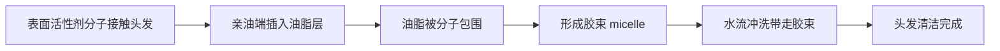
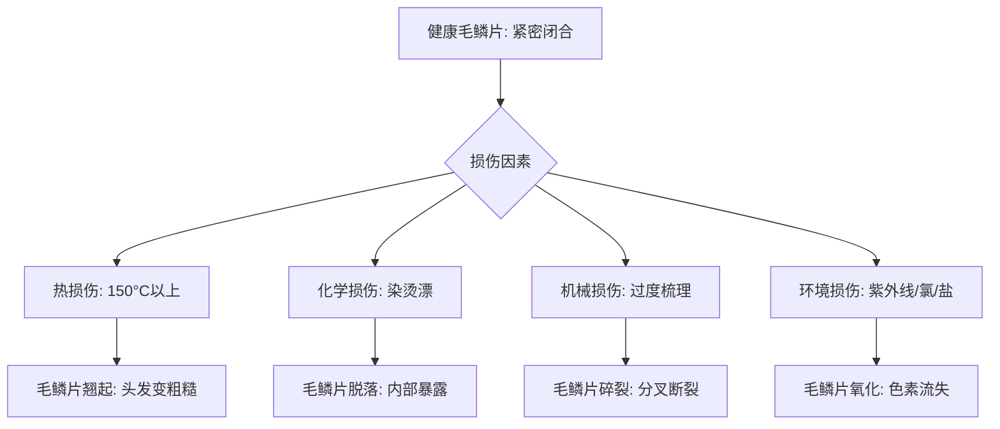

## 五、头发护理科学

头发护理不是"洗洗干净"这么简单。头发表面的毛鳞片排列、内部的二硫键结构、头皮的微生态环境，每一个环节都有对应的科学原理。理解这些原理，你才能从"凭感觉洗头"升级到"按科学护发"——用对产品、做对步骤、避开误区。

本章从洗发科学出发，依次覆盖护发修复、头皮生态、损伤机制、成分解析、季节护理，最后给出一套可直接执行的完整护理方案。

---

### 5.1 洗发的科学

洗发是所有护理的基础。洗不干净，后续的护发素、发膜都白搭；洗过头了，反而破坏头皮屏障。

#### 5.1.1 洗发水的工作原理

洗发水的核心成分是**表面活性剂**（surfactant）。表面活性剂分子呈"蝌蚪状"：一头亲水（喜欢水），一头亲油（喜欢油脂）。洗发时，亲油端插入油脂和污垢中将其包裹，形成微小的"胶束"（micelle），然后在水流冲洗下被带走。

这个过程叫**乳化**——本来不溶于水的油脂被表面活性剂"搬运"到了水中。

**胶束形成的微观过程**：

#### 5.1.2 表面活性剂类型详解

不同类型的表面活性剂，清洁力和刺激性差异很大。选错类型是很多人头发越洗越差的根本原因。

| 类型 | 代表成分 | 清洁力 | 刺激性 | 适合发质 | pH 范围 | 单次成本 |
|------|---------|--------|--------|---------|---------|---------|
| **硫酸盐类** | SLS（月桂醇硫酸钠）、SLES（月桂醇聚醚硫酸酯钠） | 强 | 较高 | 油性、健康粗硬发质 | 7-9 | 低 |
| **氨基酸类** | 月桂酰谷氨酸钠、椰油酰基谷氨酸 TEA 盐 | 中等 | 低 | 所有发质、敏感头皮 | 5.5-6.5 | 中高 |
| **甜菜碱类** | 椰油酰胺丙基甜菜碱（Cocamidopropyl Betaine） | 温和 | 很低 | 干性、受损、染烫发质 | 5-7 | 中 |
| **葡糖苷类** | 癸基葡糖苷（Decyl Glucoside） | 温和 | 极低 | 敏感头皮、婴幼儿 | 5-7 | 中高 |
| **磺基琥珀酸酯类** | 月桂醇磺基琥珀酸酯二钠 | 中等 | 低 | 中性发质、日常使用 | 5-7 | 中 |

**选择决策树**：

- **油性头皮 + 粗硬发质** → 日常用氨基酸类，每周1次硫酸盐类深层清洁
- **中性头皮** → 氨基酸类是最佳选择，长期温和不伤头皮
- **干性头皮 + 细软发质** → 甜菜碱类或葡糖苷类，避免过度脱脂
- **敏感头皮 / 有脂溢性皮炎** → 无硫酸盐、无香料、无色素的药用配方
- **染烫发质** → 必须用无硫酸盐配方，否则色素流失加速3-5倍

#### 5.1.3 洗发的正确步骤

很多人洗头的方式从第一步就错了。以下步骤是皮肤科医生推荐的标准流程：

**第一步：预洗（30-60秒）**

用 37-38°C 的温水充分打湿头发和头皮。这一步的目的是：
- 软化头皮表面的油脂和老废角质
- 让毛鳞片轻微张开，便于清洁剂进入
- 减少洗发水的用量（湿润的头发更容易起泡）

**第二步：取量与起泡**

- 短发：约一元硬币大小（3-5ml）
- 中长发：约两枚硬币大小（6-8ml）
- 长发：可分区处理，总量不超过10ml

**关键**：先在手掌中加少量水搓出泡沫，再涂到头发上。直接把洗发水倒在头皮上会导致局部浓度过高，刺激头皮。如果泡沫不够，说明水量不够而不是洗发水不够——再加一点水继续搓。

**第三步：按摩清洁（2-3分钟）**

用**指腹**（不是指甲）以画小圈的方式按摩头皮。重点清洁以下区域：

| 区域 | 为什么重点清洁 | 清洁手法 |
|------|---------------|---------|
| 发际线 | 容易残留防晒霜和化妆品 | 用指腹沿发际线来回推动 |
| 头顶 | 皮脂腺最密集的区域 | 小圈按摩，覆盖整个头顶 |
| 后脑勺 | 洗头时最容易被忽略 | 低头让水流帮助冲洗 |
| 耳后 | 容易堆积汗水和护肤品 | 用中指和无名指轻揉 |

**第四步：冲洗（至少2分钟）**

冲洗时间应该是涂抹时间的 2 倍以上。残留的洗发水会导致：
- 头皮发痒、起屑
- 头发扁塌、失去蓬松感
- 长期残留可能引发毛囊炎

判断标准：用手捋头发时感觉"涩而不滑"，说明冲洗干净了。

**第五步：二次洗发（可选）**

以下情况建议二次洗发：
- 头发特别油腻（超过3天没洗）
- 使用了大量造型产品（发蜡、发胶）
- 使用了干发喷雾等粉末类产品
- 刚从油烟/灰尘环境回来

二次洗发时洗发水用量减半，重点清洁头皮即可。

#### 5.1.4 洗发频率的科学

洗发频率应该根据**头皮的油脂分泌速率**来决定，而不是固定的天数。

**油脂分泌速率的影响因素**：

| 因素 | 影响 | 说明 |
|------|------|------|
| 雄激素水平 | 主要因素 | 雄激素刺激皮脂腺分泌，男性通常比女性更油 |
| 年龄 | 青春期最油 | 15-30岁油脂分泌旺盛，40岁后逐渐减少 |
| 季节 | 夏季更油 | 温度每升高1°C，皮脂分泌增加约10% |
| 饮食 | 高糖高油加重 | 高GI饮食刺激胰岛素→促进皮脂分泌 |
| 压力 | 皮质醇促进分泌 | 压力大时头发更容易变油 |
| 遗传 | 决定基础水平 | 有些人天生皮脂腺活跃 |

**判断标准**：
- **该洗了**：头皮开始油腻、头发失去蓬松感、摸起来有粘腻感
- **洗过头了**：洗发后头皮紧绷、干燥、发痒、起白屑
- **洗得不够**：头发持续油腻、扁塌、有异味、发根有黄色油脂堆积

**常见误区澄清**：

> "不洗头可以让头皮自己调节油脂平衡"

这个说法**没有科学依据**。皮脂腺的分泌主要由激素（尤其是雄激素）控制，不会因为你多洗或少洗就改变基础分泌率。不洗头的直接后果是：
1. 油脂堆积堵塞毛囊口
2. 马拉色菌（一种嗜脂真菌）大量繁殖
3. 引发脂溢性皮炎、毛囊炎
4. 严重时导致脱发

正确的做法是：找到适合自己的洗发频率，保持头皮清洁。如果觉得头发越洗越油，问题出在洗发水的选择（太强的清洁力会刺激皮脂腺代偿性分泌更多油脂），而不是洗发本身。

---

### 5.2 护发的科学

洗发解决的是"清洁"问题，护发解决的是"修复和保护"问题。两者缺一不可。

#### 5.2.1 护发素的原理

头发在自然状态下带**负电荷**，这会导致毛鳞片翘起、头发毛躁。护发素中的**阳离子表面活性剂**（如西曲氯铵、鲸蜡硬脂醇）能中和负电荷，让毛鳞片恢复平整。

护发素的三个核心功能：

1. **闭合毛鳞片**：阳离子成分吸附在头发表面，中和负电荷，毛鳞片平顺闭合 → 头发顺滑有光泽
2. **补充脂质**：在头发表面形成一层薄膜（通常只有几微米厚），增加润滑感，减少摩擦
3. **减少静电**：中和电荷后，头发之间的排斥力降低，不容易炸毛

**护发素使用要点**：

| 要点 | 正确做法 | 错误做法 |
|------|---------|---------|
| 涂抹区域 | 只涂发梢和发中段 | 从发根开始涂 |
| 停留时间 | 1-3分钟 | 涂完立刻冲掉 |
| 用量 | 短发约1元硬币大小 | 越多越好（堵塞毛囊） |
| 水温 | 温水冲洗干净 | 热水（加速流失） |
| 细软发质 | 减少用量，只在发梢使用 | 全头大量使用（压塌） |

**为什么不涂发根？** 发根本身有皮脂滋润，护发素涂在发根会：
- 堵塞毛囊口，影响新发生长
- 让发根变得油腻、扁塌
- 长期可能导致毛囊炎

#### 5.2.2 发膜与深层护理

发膜（hair mask）比护发素含有更高浓度的修复成分，分子更小，能渗透到头发内部（皮质层）进行修复。护发素主要作用于表面，发膜能深入内部。

**核心修复成分解析**：

| 成分 | 作用机制 | 适合问题 | 使用频率 |
|------|---------|---------|---------|
| **水解角蛋白** | 填补毛鳞片空隙，补充头发流失的蛋白质 | 烫染受损、脆弱易断 | 每周1-2次 |
| **水解小麦蛋白** | 在头发表面形成保护膜，增加弹性和光泽 | 细软发质、缺乏弹性 | 每周1-2次 |
| **神经酰胺** | 修复毛鳞片之间的"胶质"，强化屏障功能 | 干燥、毛躁、分叉 | 每周1次 |
| **透明质酸** | 强效保湿，每分子可吸附1000倍自身重量的水分 | 干枯缺水 | 每周1-2次 |
| **摩洛哥坚果油** | 富含维生素E和脂肪酸，深层滋润 | 干燥、无光泽 | 每周1次 |
| **椰子油** | 分子量小，能渗透进皮质层，减少蛋白质流失 | 受损发质 | 每周1次 |
| **泛醇（维生素B5）** | 渗透进头发内部保湿，增加头发直径 | 细软、稀疏发质 | 每周1-2次 |

**发膜的正确使用方法**：

1. 洗发后用毛巾轻轻吸干多余水分（不要搓！）
2. 将发膜均匀涂抹在发梢到发中段
3. 用浴帽或热毛巾包裹头发（热量帮助毛鳞片打开，促进成分渗透）
4. 停留 5-15 分钟（具体看产品说明）
5. 用温水彻底冲洗

**进阶技巧**：涂抹发膜后，用吹风机（中低档热风）隔着浴帽吹 2-3 分钟，热量能显著提高渗透效率。

#### 5.2.3 蛋白质-水分平衡

这是头发护理中最容易被忽视、也最容易出问题的概念。

头发需要**蛋白质**和**水分**的平衡。任何一方过多或过少都会导致问题：

| 状态 | 表现 | 原因 | 解决方法 |
|------|------|------|---------|
| **缺蛋白** | 头发过度柔软、没有弹性、拉伸后不回弹 | 过度使用保湿产品，缺乏蛋白质修复 | 使用含水解蛋白的发膜 |
| **蛋白过多** | 头发硬、脆、容易断裂、手感粗糙 | 过度使用蛋白质产品 | 停用蛋白产品，加强保湿 |
| **缺水** | 头发干燥、毛躁、缺乏光泽 | 过度清洁、环境干燥 | 使用保湿型护发素和发膜 |
| **水分过多** | 头发过度柔软、像橡皮筋一样可以拉很长 | 过度使用深层护发产品 | 减少护发产品频率，使用蛋白修复 |

**判断方法**：取一根湿发，轻轻拉伸：
- 正常：能拉伸约 20-30% 后回弹
- 缺蛋白：能拉伸超过 50% 且不回弹
- 蛋白过多：几乎没有弹性，容易断裂

#### 5.2.4 免洗型护发产品

洗后护理之外，日常的免洗产品也是护发体系的重要一环。

**护发精油/精华油**：
- **成分**：通常以硅油（环聚二甲基硅氧烷）或天然油脂为基底
- **功能**：在头发表面形成保护膜，减少摩擦，增加光泽
- **使用时机**：吹头发前（隔热）或造型完成后（增加光泽）
- **用量**：短发1-2滴，中长发2-3滴，长发3-4滴
- **涂抹区域**：发梢和发中段，避开发根

**隔热喷雾**：
- **成分**：含热敏聚合物，在高温下形成保护膜
- **功能**：减少吹风机/卷发棒对头发的热损伤
- **使用方法**：在吹头发或使用造型工具前，均匀喷洒在头发上
- **保护效果**：优质隔热喷雾可减少 50% 以上的热损伤

**免洗护发素**：
- **适合人群**：干性发质、卷发、经常在空调房工作的人
- **使用方法**：取少量在手心搓开，从发中段向发梢涂抹
- **注意**：不要过量，否则头发会变得油腻、沉重

---

### 5.3 头皮护理科学

头皮是头发生长的"土壤"。土壤不好，再好的种子也长不出好庄稼。很多人花了大量精力护理头发，却完全忽视了头皮。

#### 5.3.1 头皮的生理结构

头皮和面部皮肤是连续的同一张皮肤，但头皮有其特殊性：

| 特征 | 头皮 | 面部皮肤 |
|------|------|---------|
| 厚度 | 约 1.4mm（全身最厚的皮肤之一） | 约 0.5-1mm |
| 毛囊密度 | 约 200-300个/cm² | 极少 |
| 皮脂腺密度 | 极高（全身最高） | 较高 |
| 血管 | 丰富，供血充足 | 丰富 |
| 更新周期 | 约 14-21 天 | 约 28 天 |
| pH 值 | 4.5-5.5（弱酸性） | 4.5-6.5 |

头皮的高皮脂腺密度意味着它比面部更容易出油，也更容易出现油脂相关的头皮问题。

#### 5.3.2 头皮微生态

健康的头皮上生活着一个完整的微生物群落——**头皮微生态**（scalp microbiome）。这些微生物大部分是无害甚至有益的。

**主要微生物成员**：

| 微生物 | 角色 | 健康状态 | 失衡状态 |
|--------|------|---------|---------|
| **表皮葡萄球菌** | 有益菌，抑制有害菌 | 维持平衡 | 减少 → 有害菌增殖 |
| **痤疮丙酸杆菌** | 共生菌 | 正常水平 | 过多 → 毛囊炎 |
| **马拉色菌** | 条件致病菌（嗜脂真菌） | 少量存在 | 大量繁殖 → 头屑、脂溢性皮炎 |
| **金黄色葡萄球菌** | 潜在致病菌 | 极少 | 过多 → 头皮感染、脓疱 |

**维持微生态平衡的方法**：
1. 不要过度清洁——过度洗发会破坏有益菌的生存环境
2. 使用弱酸性洗发水（pH 4.5-5.5），与头皮天然 pH 一致
3. 避免长期使用强效抗菌洗发水（杀敌一千自损八百）
4. 饮食中增加益生菌和膳食纤维，间接改善皮肤菌群

#### 5.3.3 常见头皮问题与对策

**头屑（Dandruff）**：

头屑的本质是头皮角质层更新过快。正常情况下角质细胞成熟后才脱落（肉眼不可见），头屑是未成熟的角质细胞大量聚集脱落（肉眼可见的白色鳞屑）。

| 类型 | 特征 | 原因 | 治疗成分 |
|------|------|------|---------|
| 干性头屑 | 细小白色粉末状，容易掉落 | 头皮干燥、角质层代谢异常 | 吡硫翁锌（ZPT）、水杨酸 |
| 油性头屑 | 较大块状、略带黄色、粘附在头皮 | 马拉色菌过度繁殖 | 酮康唑、吡硫翁锌、二硫化硒 |
| 脂溢性皮炎 | 大块黄色鳞屑、头皮发红发痒 | 马拉色菌 + 炎症反应 | 酮康唑洗剂（2%）、含激素药膏（需就医） |

**治疗方案**：
- 轻度头屑：含 ZPT 或水杨酸的去屑洗发水，每周使用 2-3 次
- 中度头屑：酮康唑洗剂（如采乐、仁山利舒），每周 2 次，持续 4 周
- 重度或反复发作：就医，可能需要口服抗真菌药物

**重要提醒**：去屑洗发水不要当日常洗发水长期使用。症状缓解后改回普通洗发水，头屑复发时再用。

**头皮出油过多**：

皮脂腺过度分泌的原因：
1. **激素**：雄激素是主要驱动因素（青春期、多囊卵巢综合征等）
2. **饮食**：高糖、高乳制品饮食刺激胰岛素样生长因子（IGF-1），促进皮脂分泌
3. **压力**：皮质醇升高 → 皮脂分泌增加
4. **错误的洗发方式**：用太热的水、过度清洁刺激代偿性分泌

对策：
- 调整饮食：减少精制糖和乳制品摄入
- 选择控油洗发水：含水杨酸（BHA）、烟酰胺的配方
- 洗发水温控制在 37-38°C，不要用热水
- 不要因为头油就一天洗多次——一天一次就够了

**头皮瘙痒**：

| 原因 | 特征 | 解决方法 |
|------|------|---------|
| 头皮干燥 | 紧绷感、起白屑 | 换温和洗发水、减少洗发频率 |
| 接触性皮炎 | 用了新产品后出现 | 停用可疑产品，可能需要做斑贴试验 |
| 脂溢性皮炎 | 红斑+油腻鳞屑 | 酮康唑洗剂 |
| 银屑病（牛皮癣） | 厚层银白色鳞屑、边界清晰 | 就医，需要系统治疗 |
| 头虱 | 夜间瘙痒加剧、可见虫卵 | 药物治疗（氯菊酯洗剂） |

#### 5.3.4 头皮按摩的科学

近年来多项研究证实了头皮按摩对头发健康的积极作用。

**研究证据**：
- 2016 年日本的一项研究发现，每天 4 分钟的头皮按摩持续 24 周后，参与者的头发直径显著增加
- 2019 年的研究显示，头皮按摩可以改变与头发生长相关的基因表达
- 推测机制：机械力刺激 → 毛囊周围的真皮乳头细胞被激活 → 促进生长因子分泌

**正确的头皮按摩方法**：

工具：指腹（双手十指），或头皮按摩器
时间：每次 4-5 分钟，每天 1-2 次
力度：中等偏轻，以感觉舒适为准，不要用力按压

步骤：
1. 双手指腹放在前额发际线处，小圈按摩 → 向头顶移动
2. 指腹移至太阳穴两侧，小圈按摩 → 向耳后移动
3. 双手交叉放在后脑勺，向上推按 → 到达头顶
4. 用指腹轻轻拍打整个头皮，促进血液流动

**注意事项**：
- 不要用指甲！会划伤头皮，导致微小伤口和炎症
- 头皮有伤口、炎症、毛囊炎时不要按摩
- 按摩时可以配合使用头皮精油（迷迭香精油有研究支持其促进头发生长的效果）

---

### 5.4 头发损伤机制与修复

理解头发是怎么被破坏的，才能有针对性地预防和修复。

#### 5.4.1 毛鳞片损伤的微观过程

头发的最外层是**毛鳞片**（cuticle），由 6-10 层扁平的角质细胞像瓦片一样重叠排列。健康的毛鳞片紧密闭合，头发光滑有光泽；受损后毛鳞片翘起甚至脱落，头发变得粗糙、无光泽、容易打结。

#### 5.4.2 四大损伤类型详解

**热损伤**：

温度是头发的头号敌人之一。

| 温度范围 | 对头发的影响 | 常见来源 |
|----------|-------------|---------|
| 60-100°C | 轻微脱水，毛鳞片微张 | 热水洗头、中温吹风 |
| 100-150°C | 水分大量流失，蛋白质开始变性 | 高温吹风 |
| 150-180°C | 皮质层蛋白质变性，二硫键断裂 | 卷发棒、直发夹 |
| 180°C 以上 | 严重蛋白质变性，不可逆损伤 | 卷发棒高温档、反复夹烫 |
| 230°C 以上 | 头发碳化 | 接触高温金属（如熨斗意外） |

**预防措施**：
- 吹风机温度不超过 60°C，距离头发 15-20cm
- 卷发棒/直发夹温度：细软发质 120-150°C，普通发质 150-180°C，粗硬发质 180-200°C
- 使用前必须涂隔热产品
- 同一束头发不要反复加热超过 2-3 次

**化学损伤**：

染发、烫发、漂发都会破坏头发的内部结构。

| 处理 | 损伤机制 | 损伤程度 | 恢复周期 |
|------|---------|---------|---------|
| **染发**（永久性） | 碱性药剂打开毛鳞片 → 氧化剂破坏天然色素 → 人工色素进入皮质层 | 中度 | 2-3个月（新发生长） |
| **烫发** | 还原剂打破二硫键 → 重新塑形 → 氧化剂固定新形状 | 高度 | 不可逆（受损部分） |
| **漂发** | 强氧化剂完全破坏天然色素 | 极高 | 不可逆 |
| **柔顺/离子烫** | 高温+强碱+还原剂，三重打击 | 极高 | 不可逆 |

**染烫后护理要点**：
1. 染烫后 48 小时内不要洗发（让色素/结构稳定）
2. 使用专门针对染烫发质的洗护产品（弱酸性、无硫酸盐）
3. 每周 2-3 次发膜护理，补充流失的蛋白质和脂质
4. 减少热造型工具的使用
5. 染发间隔至少 6 周，烫发间隔至少 3 个月

**机械损伤**：

日常梳头、扎头发、擦头发等动作，如果方式不对，会造成累积性损伤。

| 错误习惯 | 正确做法 |
|---------|---------|
| 湿发时用密齿梳暴力梳理 | 湿发时用宽齿梳从发梢开始轻柔梳理 |
| 用毛巾大力搓干头发 | 用超细纤维毛巾轻轻按压吸水 |
| 扎很紧的马尾/丸子头 | 松扎，变换位置，避免长期在同一位置 |
| 每天用梳子强行梳通打结处 | 先用手指松开打结，再用宽齿梳 |
| 湿着头发睡觉 | 至少吹到八成干再睡 |

**环境损伤**：

| 因素 | 损伤机制 | 预防措施 |
|------|---------|---------|
| **紫外线（UV）** | 破坏黑色素、氧化蛋白质、毛鳞片受损 | 戴帽子、用含UV防护的护发产品 |
| **氯（泳池水）** | 氧化头发表面蛋白质、脱脂 | 游泳前用清水打湿头发（减少氯吸收），游后立即用去氯洗发水 |
| **盐水（海水）** | 高渗透压脱水、盐结晶磨损毛鳞片 | 游后用淡水冲洗，涂护发素 |
| **硬水** | 矿物质（钙、镁）沉积在头发上，使其变硬、干燥、暗淡 | 安装淋浴净水器，每月1次深层清洁洗发水 |
| **空气污染** | 微粒附着在头发上，加速氧化 | 每天洗发或使用防护喷雾 |

#### 5.4.3 分叉与断裂的区分

| 特征 | 分叉（Split Ends） | 断裂（Breakage） |
|------|-------------------|-----------------|
| 表现 | 发梢分成两股或多股 | 头发从中间断开，长度不一 |
| 原因 | 发梢毛鳞片完全脱落，皮质层散开 | 蛋白质流失严重，头发失去韧性 |
| 能修复吗 | 不能，只能剪掉 | 可以部分修复（补充蛋白质+保湿） |
| 预防 | 定期修剪（6-8周一次）、减少热损伤 | 补充蛋白质、避免过度化学处理 |

**重要认知**：分叉是**不可逆**的。任何宣称能"修复分叉"的护发产品，都只是暂时"粘合"分叉处，洗几次就恢复原样。唯一的方法是剪掉分叉部分，然后做好预防。

---

### 5.5 护发成分解析

学会看成分表，是避免被营销忽悠的最有效手段。

#### 5.5.1 成分表的阅读规则

中国的化妆品成分表按照**含量从高到低**排列。通常前 5 个成分决定了产品 80% 以上的性质。

**典型的洗发水成分表解读**：

水（溶剂，占70-80%）→ 月桂醇聚醚硫酸酯钠（主清洁成分）→ 椰油酰胺丙基甜菜碱（辅助清洁）→ 氯化钠（增稠）→ 聚二甲基硅氧烷（硅油，顺滑感）→ ... → 香精 → 防腐剂

#### 5.5.2 关键有效成分

**清洁类**：

| 成分 | 功能 | 备注 |
|------|------|------|
| 月桂醇聚醚硫酸酯钠（SLES） | 主清洁剂 | 比SLS温和，但仍属于硫酸盐类 |
| 月桂酰谷氨酸钠 | 氨基酸清洁剂 | 温和、低刺激、价格较高 |
| 水杨酸（BHA） | 去角质、控油 | 浓度 0.5-2%，适合油性头皮 |
| 吡硫翁锌（ZPT） | 抗真菌去屑 | 经典去屑成分，部分产品已停用 |
| 酮康唑 | 强效抗真菌 | 药用级，OTC浓度1-2% |

**修复类**：

| 成分 | 功能 | 适合问题 |
|------|------|---------|
| 水解角蛋白 | 填补毛鳞片空隙 | 烫染受损 |
| 泛醇（维生素B5） | 渗透保湿、增粗发丝 | 细软、干燥发质 |
| 神经酰胺 | 修复毛鳞片间脂质 | 干燥、毛躁 |
| 透明质酸 | 强效保湿 | 缺水发质 |
| 生物素（维生素H） | 强化发丝结构 | 脆弱易断 |

**保护类**：

| 成分 | 功能 | 使用场景 |
|------|------|---------|
| 聚二甲基硅氧烷 | 在头发表面形成保护膜 | 日常顺滑、减少摩擦 |
| 环聚二甲基硅氧烷 | 轻质硅油，不油腻 | 免洗精油、隔热喷雾 |
| 二甲硅油/聚二甲基硅氧烷醇 | 较重的硅油 | 深层滋润、重度受损 |

#### 5.5.3 争议成分的科学评判

**硅油（Dimethicone）**：

网上大量"无硅油"营销让人觉得硅油是坏东西，但科学事实是：
- 硅油是惰性成分，不会被皮肤或头发吸收
- 它在头发表面形成保护膜，减少摩擦和水分流失
- 正常使用不会堵塞毛囊（分子量太大，无法进入毛囊）
- **唯一的问题**：长期使用含重硅油的产品而不深层清洁，可能导致硅油在头发上累积，使头发变重、扁塌

**结论**：硅油不是敌人。粗硬、毛躁的发质用含硅油的产品效果很好；细软发质可以选择轻质硅油或无硅油配方。每周1次深层清洁洗发水可以去除累积。

**硫酸盐（SLS/SLES）**：

- 清洁力强，刺激性相对较高
- 对健康油性发质完全可以用
- 受损、干燥、染烫发质应避免（会加速色素流失、加重干燥）
- 不等于"有毒"——几十年的安全使用记录

**防腐剂（如甲基异噻唑啉酮 MIT）**：

- 洗去型产品（洗发水）中含量极低，风险可忽略
- 免洗型产品中需要关注，可能引起接触性皮炎
- 选择用苯氧乙醇、山梨酸钾等更温和防腐剂的产品是加分项，但不必恐慌

#### 5.5.4 "天然"与"化学"的真相

营销常常暗示"天然=好，化学=坏"，但事实是：

- **天然成分也可能有害**：柠檬汁（pH 2，强酸伤发）、纯椰子油（对某些人会致痘）、精油（未稀释直接接触皮肤可能灼伤）
- **合成成分也可能极好**：水解角蛋白是头发的天然成分但通过化学工艺提取，泛醇（合成维生素B5）是公认优秀的护发成分
- **关键不是天然还是合成，而是：浓度是否合适、配方是否科学、是否适合你的发质**

---

### 5.6 不同季节的头发护理

头发在不同季节面临不同的环境挑战，护理策略需要相应调整。

#### 5.6.1 春季护理

**季节特点**：气温回升，湿度增加，花粉和柳絮飘散，过敏高发期。

| 问题 | 原因 | 对策 |
|------|------|------|
| 头皮过敏、发痒 | 花粉附着在头发和头皮上 | 外出回家后立即洗发或至少冲洗头发 |
| 头皮出油增加 | 气温升高，皮脂分泌增加 | 从冬季滋润型洗发水切换到清爽型 |
| 静电减少 | 湿度回升 | 减少护发素用量，避免过度滋润 |

**春季护理清单**：
1. 将洗发水从滋润型更换为清爽型/控油型
2. 外出后及时清洗头发，去除花粉
3. 每周 1 次头皮去角质，去除冬季积累的老废角质
4. 开始使用含 UV 防护的护发产品（为夏季做准备）

#### 5.6.2 夏季护理

**季节特点**：高温、强紫外线、出汗多、频繁接触泳池氯水和海水。

| 问题 | 原因 | 对策 |
|------|------|------|
| 头发褪色加速 | UV 破坏色素分子 | 含UV过滤剂的护发产品、戴帽子 |
| 头发出油严重 | 温度高 → 皮脂分泌增加 | 增加洗发频率（可每天洗），用控油洗发水 |
| 头发干燥粗糙 | UV + 盐水 + 氯水三重伤害 | 游后立即用淡水冲洗 + 护发素 |
| 头皮晒伤 | 头发稀疏处紫外线直射 | 戴宽檐帽、头皮涂抹防晒霜 |

**泳池/海边后的紧急护理流程**：
1. 用大量淡水冲洗头发 3-5 分钟（冲掉氯/盐）
2. 用温和洗发水清洗一次
3. 涂抹护发素或快速发膜，停留 2-3 分钟
4. 冲洗干净后涂上护发精油
5. 自然晾干或低温吹干

**夏季防晒重点**：
- 头发防晒产品（喷雾/乳液）的 SPF 值不等于防晒霜的 SPF，它主要保护的是头发纤维而非皮肤
- 戴帽子是最有效的物理防晒方式，宽檐帽（檐宽 > 7.5cm）效果最佳
- 头皮暴露处（发缝线）需要额外涂抹防晒霜

#### 5.6.3 秋季护理

**季节特点**：气温下降，空气逐渐干燥，换季脱发高峰期。

| 问题 | 原因 | 对策 |
|------|------|------|
| 脱发增多 | 季节性激素波动，毛囊从生长期进入休止期 | 正常现象，每天掉发 100 根以内不必恐慌 |
| 头发干燥 | 空气湿度下降 | 增加护发素用量，开始每周使用发膜 |
| 静电开始出现 | 湿度低，摩擦生电 | 使用含阳离子成分的护发产品 |
| 头皮敏感 | 温差大、换季应激 | 减少刺激性产品，用温和配方 |

**秋季护理清单**：
1. 将洗护产品从清爽型切换回滋润型
2. 每周 2 次发膜护理
3. 开始使用免洗护发素或护发精油
4. 饮食中增加富含铁、锌、B族维生素的食物（减少季节性脱发）

#### 5.6.4 冬季护理

**季节特点**：空气极度干燥，室内外温差大，静电问题严重。

| 问题 | 原因 | 对策 |
|------|------|------|
| 严重干燥 | 供暖环境湿度可能低于 20% | 使用加湿器（目标湿度 40-60%） |
| 静电炸毛 | 干燥 + 化纤衣物摩擦 | 用木梳或防静电梳，穿纯棉/羊毛衣物 |
| 头皮起屑 | 干燥导致角质层代谢异常 | 区分干燥性头屑和真菌性头屑，对症处理 |
| 热损伤增加 | 吹风机使用频率增加 | 坚持用中低温 + 隔热产品 |

**冬季特别注意**：
- **不要用过热的水洗头**！冬天用热水洗头很舒服，但热水会严重破坏头皮的皮脂屏障，加重干燥和头屑。水温控制在 37-38°C。
- **洗后一定要吹干**：湿着头发在低温环境中容易感冒（虽然不会直接导致感冒，但寒冷会降低局部免疫力），且湿发摩擦更容易受损。
- **静电应急处理**：头发起静电时，用湿手轻轻抚过头发表面，或喷少量保湿喷雾即可消除。

---

### 5.7 水质对头发的影响

这是一个很多人完全忽视的因素——洗头用的水质对头发状态有显著影响。

#### 5.7.1 硬水与软水

| 参数 | 硬水 | 软水 |
|------|------|------|
| 矿物质含量 | 高（钙、镁离子 > 120mg/L） | 低（< 60mg/L） |
| 对头发的影响 | 矿物质沉积在头发上，使头发变硬、干燥、暗淡、难以打理 | 不会沉积，头发更柔软顺滑 |
| 对洗发水的影响 | 与表面活性剂反应产生皂垢，降低清洁效率 | 洗发水起泡更好，清洁更充分 |
| 常见地区 | 北方城市（北京、天津等）、石灰岩地区 | 南方城市、雨水充沛地区 |

**硬水对头发的具体伤害**：
1. 钙镁离子沉积在毛鳞片上，形成一层白色矿物质薄膜
2. 这层薄膜阻止护发成分渗透，降低护发效果
3. 累积后头发变得粗糙、无光泽、容易打结
4. 可能导致染发颜色变暗或变色

**解决方案**：
- **安装淋浴净水器/过滤花洒**：去除水中大部分矿物质和氯，效果立竿见影
- **每月 1 次深层清洁洗发水**（chelating shampoo / 去矿物质洗发水）：含 EDTA 或柠檬酸，能溶解矿物质沉积
- **白醋漂洗**：每月 1-2 次，用稀释的白醋（水:醋 = 10:1）漂洗头发，酸性环境有助于溶解矿物质

---

### 5.8 完整头发护理方案

将前面所有知识整合为一套可直接执行的日常方案。

#### 5.8.1 日常护理流程

**晨间**：
1. 如果头发有压痕或翘起：用水喷湿 → 用吹风机低温吹顺 → 涂 1-2 滴护发精油
2. 如果头发很油但没时间洗：用干发喷雾吸附油脂，拨松发根增加蓬松感
3. 出门前：如果阳光强烈，戴帽子或喷头发防晒喷雾

**洗发日（根据个人情况每 1-3 天）**：
1. 预洗：37°C 温水冲 30 秒
2. 洗发：起泡 → 指腹按摩头皮 2-3 分钟 → 温水冲净
3. 护发素：涂发梢到发中段 → 停留 1-3 分钟 → 温水冲净
4. 吸水：超细纤维毛巾轻轻按压
5. 隔热：喷隔热喷雾
6. 吹干：中低温 → 从发根到发梢（顺着毛鳞片方向）→ 吹到八九成干
7. 收尾：涂 2-3 滴护发精油在发梢

**每周 1-2 次深层护理**：
1. 正常洗发
2. 用毛巾吸干多余水分
3. 涂抹发膜，从发梢到发中段
4. 戴浴帽 → 用热毛巾包裹（或吹风机中低档隔着吹 2-3 分钟）
5. 停留 10-15 分钟
6. 温水彻底冲洗

**睡前**：
1. 头发完全吹干（湿发睡觉会摩擦受损）
2. 长发可以松松编一个辫子或用丝绸发圈低扎，减少睡觉时的摩擦
3. 使用丝绸枕套（比棉质枕套减少 40% 以上的摩擦）

#### 5.8.2 按发质的护理方案速查

| 项目 | 油性发质 | 中性发质 | 干性发质 | 受损发质 |
|------|---------|---------|---------|---------|
| 洗发频率 | 每天或隔天 | 2-3天 | 3-4天 | 2-3天 |
| 洗发水类型 | 控油/氨基酸 | 氨基酸 | 温和/甜菜碱 | 无硫酸盐 |
| 护发素 | 少量，只涂发梢 | 适量，发梢+发中 | 充量，发梢+发中 | 丰量，发梢到发中 |
| 发膜频率 | 每2周1次 | 每周1次 | 每周1-2次 | 每周2次 |
| 免洗产品 | 一般不需要 | 护发精油少量 | 护发精油+免洗护发素 | 精油+隔热喷雾必用 |
| 吹风机 | 中温，快速吹干 | 中低温 | 低温，涂精油后吹 | 低温，必须用隔热产品 |

#### 5.8.3 常见误区总结

| 误区 | 真相 | 正确做法 |
|------|------|---------|
| "天然洗发（用面粉/小苏打）更好" | 小苏打 pH 8-9，严重破坏头皮酸碱平衡 | 选择正规洗发产品 |
| "头发需要经常换洗发水" | 没有科学依据，适合的就可以一直用 | 除非头皮状态改变 |
| "护发素会让头发变油" | 护发素涂在发根才会导致油腻 | 只涂发梢和发中段 |
| "冷风吹头发更健康" | 冷风效率太低，延长了吹风时间反而增加损伤 | 中低温 + 保持距离 |
| "经常剪头发能让头发长得更快" | 头发生长速度由毛囊决定，与修剪无关 | 修剪只影响发梢整齐度 |
| "黑芝麻/何首乌能黑发生发" | 无科学证据支持，何首乌甚至有肝毒性 | 均衡饮食，必要时就医 |
| "湿发自然干比吹干好" | 湿发状态下毛鳞片张开，长时间暴露更易受损 | 吹到八九成干是最优解 |

---

### 5.9 进阶：特殊场景的头发护理

#### 5.9.1 健身/运动后的头发护理

运动出汗后，汗液中的盐分和乳酸会刺激头皮，高浓度的盐分还会吸走头发水分。

- **轻度出汗**：不需要洗发，用清水冲洗头皮即可
- **大量出汗**：至少用清水彻底冲洗，如果感觉油腻再用温和洗发水
- **运动后不洗头的应急方案**：用湿毛巾擦拭头皮，或使用干发喷雾

#### 5.9.2 出差/旅行时的头发护理

- 携带旅行装洗护产品（避免使用酒店的劣质洗发水）
- 如果目的地水质不同（如去硬水地区），携带小瓶深层清洁洗发水
- 坐飞机时头发极度干燥（机舱湿度 10-20%），出发前涂一层护发精油

#### 5.9.3 生病期间的头发护理

- **发烧**：发烧期间皮脂分泌会改变，退烧后注意清洁
- **术后**：体力恢复前可以减少洗发频率，用免洗洗发水替代
- **长期服药**：某些药物（如抗凝血药、β受体阻滞剂、维A酸类）可能影响头发状态，如有异常咨询医生

---

头发护理的核心原则可以浓缩为三句话：

1. **温和清洁**——不过度、不残留，维持头皮微生态平衡
2. **精准修复**——根据发质和损伤类型选择对应的成分，蛋白和水分保持平衡
3. **主动预防**——隔热、防晒、减少化学处理，预防永远比修复成本低

记住：头发护理是一个长期工程。单次护理的效果有限，但坚持 3-6 个月的科学护理，你会看到肉眼可见的改变。
