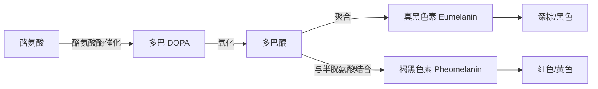
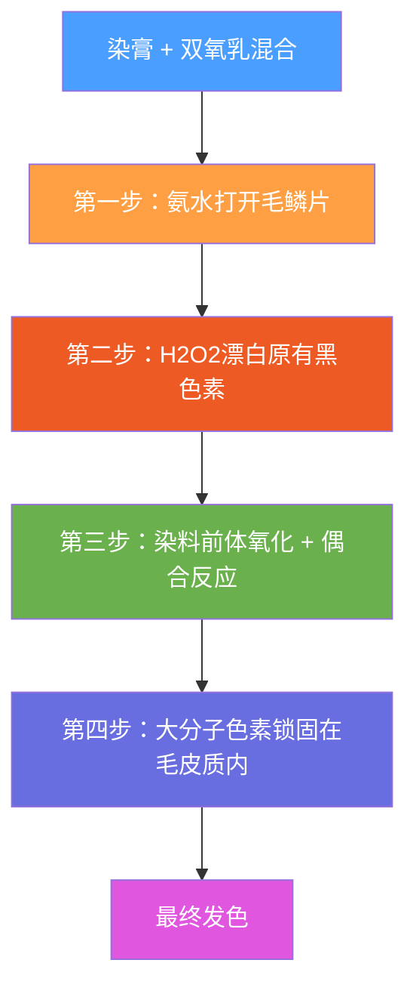

## 六、染发原理与技术

染发是改变头发颜色的技术，也是发型设计中视觉冲击力最强的手段之一。选对发色可以提亮肤色、修饰脸型、提升整体气质；选错或操作不当则可能导致颜色翻车、发质严重受损甚至皮肤过敏。要真正掌握染发，需要理解从色素生物学到化学反应、从色彩设计到操作流程的完整知识链。

### 6.1 头发颜色的科学基础

#### 黑色素的类型与生成机制

头发的颜色由毛皮质（cortex）中的黑色素体（melanosome）决定。黑色素体是黑色素细胞（melanocyte）产生的色素颗粒，分为两种：

| 黑色素类型 | 英文名 | 颜色范围 | 分布特点 | 对应发色 |
|-----------|--------|---------|---------|---------|
| 真黑色素 | Eumelanin | 棕色→黑色 | 颗粒呈椭圆形，排列紧密 | 亚洲人的黑发、欧洲人的棕发 |
| 褐黑色素 | Pheomelanin | 黄色→红色 | 颗粒呈球形，分布较分散 | 金发、红发 |

这两种黑色素的比例和总量共同决定了头发的最终颜色：

- **纯真黑色素，高浓度** → 深黑色（东亚人典型发色）
- **纯真黑色素，中等浓度** → 深棕色到中棕色
- **真黑色素 + 少量褐黑色素** → 暖棕色、巧克力色
- **褐黑色素为主** → 红色、橙红色
- **极少量褐黑色素** → 金色
- **几乎无黑色素** → 白色（老年性白发或白化病）

#### 黑色素的合成路径

黑色素在毛囊底部的黑色素细胞中合成，核心步骤如下：

1. **酪氨酸（Tyrosine）** 在酪氨酸酶（tyrosinase）催化下氧化为**多巴（DOPA）**
2. **多巴** 进一步氧化为**多巴醌（DOPA quinone）**
3. 多巴醌经过一系列非酶促反应，最终聚合为**真黑色素**（不溶性高分子聚合物）
4. 如果存在半胱氨酸（cysteine），多巴醌会与之结合，生成**褐黑色素**（含有硫原子的可溶性色素）

这个过程可以用 mermaid 流程图表示：

**关键酶——酪氨酸酶**：它是黑色素合成的限速酶。酪氨酸酶活性高，黑色素产量大，发色深；酪氨酸酶活性低或缺失，则黑色素不足，头发变浅甚至变白。白化病患者正是因为TYR基因突变导致酪氨酸酶完全失活。

#### 白发的形成机理

理解白发对于染发（尤其是盖白发）至关重要。白发形成有以下几个阶段：

1. **酪氨酸酶活性下降**：随着年龄增长，毛囊中黑色素干细胞（melanocyte stem cell）逐渐耗竭，酪氨酸酶活性降低
2. **黑色素体减少**：每个毛发周期中产生的黑色素体数量递减
3. **气泡替代**：黑色素体被微小气泡取代，光线在气泡表面散射，呈现白色
4. **氧化应激**：毛囊中过氧化氢（H₂O₂）积累，直接氧化并破坏已有的黑色素

**白发出现的典型规律**：

- 亚洲人通常在 30-40 岁开始出现白发，最初在两鬓，逐渐扩展到头顶和后脑
- 白发通常以"单根白色"→"灰白混杂"→"全白"的顺序发展
- 白发的比例与遗传高度相关：如果你的父母在 30 岁前就大量白发，你大概率也会

**为什么白发难以上色**：白发的毛鳞片通常比有色头发更紧密（缺少色素填充物，结构更致密），染剂难以渗透。因此盖白发需要使用更高浓度的双氧乳、更长的处理时间，或专用的盖白发配方。

#### 头发的色度等级体系

国际美发行业使用统一的色度等级（Level）系统来描述头发的深浅，共 10 个等级：

| 色度等级 | 颜色描述 | 自然亚洲发色？ | 典型举例 |
|---------|---------|-------------|---------|
| 1级 | 最深黑 | ✓ 多数亚洲人自然色 | 乌黑 |
| 2级 | 深黑 | ✓ 部分亚洲人 | 自然黑 |
| 3级 | 深棕/暗栗 | 少数亚洲人 | 深咖啡 |
| 4级 | 中棕色 | 需漂发 | 栗棕色 |
| 5级 | 浅棕色 | 需漂发 | 巧克力色 |
| 6级 | 深金色 | 需多次漂发 | 蜂蜜色 |
| 7级 | 中金色 | 需多次漂发 | 亚麻色 |
| 8级 | 浅金色 | 需深度漂发 | 浅亚麻 |
| 9级 | 极浅金 | 需多次漂发 | 白金色 |
| 10级 | 最浅/白金 | 需极度漂发 | 近白色 |

亚洲人的自然发色通常在 1-3 级之间。要染到 6 级以上，几乎都需要先漂发，因为永久染发剂只能在现有色度基础上做有限改变。

### 6.2 色彩理论基础

很多人染发翻车，不是技术问题，而是缺乏基本的色彩理论知识。

#### 色轮与色彩关系

色轮（Color Wheel）是染发配色的基础工具。色轮上 12 点钟位置开始，顺时针依次为：

- **红（Red）** → **红橙（Red-Orange）** → **橙（Orange）** → **黄橙（Yellow-Orange）** → **黄（Yellow）** → **黄绿（Yellow-Green）** → **绿（Green）** → **蓝绿（Blue-Green）** → **蓝（Blue）** → **蓝紫（Blue-Violet）** → **紫（Violet）** → **红紫（Red-Violet）**

在染发中，色轮的三大核心关系是：

1. **互补色（Complementary Colors）**：色轮上对面的颜色（如红↔绿、橙↔蓝、黄↔紫）。互补色混合会产生中性色调（灰色或棕色），用于**校正偏色**。例如，头发偏黄可以用紫色调产品来中和
2. **相邻色（Analogous Colors）**：色轮上相邻的颜色（如红↔橙↔黄）。搭配自然和谐，适合打造渐变效果
3. **三色组（Triadic Colors）**：色轮上等距的三种颜色。日常染发很少用到，但了解有助于理解色彩平衡

#### 底色（Underlying Pigment）

这是染发中最关键的概念之一。当漂发或染浅头发时，头发中会暴露出隐藏的底层色素，这个底层色素由色度等级决定：

| 色度等级 | 漂发时暴露的底色 |
|---------|---------------|
| 1-2级 → | 红色 |
| 3-4级 → | 红橙色 |
| 5-6级 → | 橙色 |
| 7级 → | 黄橙色 |
| 8级 → | 黄色 |
| 9级 → | 浅黄色 |
| 10级 → | 几乎无色 |

**为什么底色很重要**：如果你的头发是 3 级（深棕/黑），漂到 7 级时，底色是黄橙色。如果不经过处理直接上色，最终颜色会偏暖、偏橙，而不是你期望的纯正金色。专业染发师会根据底色选择合适的色调来中和这些暖色。

#### 染发的色彩规则

在永久染发中，有两条基本规则：

1. **"只能往上走"规则**：永久染发剂无法让头发变深后再变浅。例如，你不能用 7 级金色的永久染发剂把 3 级的黑发染成金色，它最多只能让头发呈现深红棕色。要染浅，必须先漂发
2. **双程限制**：永久染发剂通常只能改变 2-3 个色度等级。也就是说，4 级棕色的头发可以用 6 级染发剂染成浅棕色，但不能直接染成 8 级金色

### 6.3 染发剂的完整分类

#### 按持久性分类

| 类型 | 持续时间 | 作用机制 | 优点 | 缺点 | 适合场景 |
|------|---------|---------|------|------|---------|
| 临时染发剂 | 1次洗发 | 染料分子附着在毛鳞片表面，不渗透 | 零损伤，颜色可逆 | 容易转移、出汗掉色 | 特殊场合尝试、派对造型 |
| 半永久染发剂 | 4-12次洗发 | 小分子染料部分渗入毛鳞片间，不进入毛皮质 | 无需氧化剂，低损伤，逐渐褪色 | 颜色选择有限，无法染浅 | 为黑发增加色光/彩度、补充色调 |
| 渐褪染发剂 | 20-28次洗发 | 介于半永久与永久之间，染料分子大小居中 | 效果自然，褪色均匀 | 不能大幅度改变发色 | 微调色调、初次染发尝试 |
| 永久染发剂 | 永久（直到新发生长） | 氧化反应在毛皮质内生成大分子色素 | 可以彻底改变发色，颜色稳定 | 需要双氧水，有损伤，需定期补根 | 任何需要长期稳定颜色的场景 |

#### 按成分来源分类

| 类型 | 代表 | 优点 | 缺点 |
|------|------|------|------|
| 化学氧化染发剂 | 市面大部分永久/半永久产品 | 色彩选择丰富、上色均匀、持久 | 有化学刺激性，长期使用有健康争议 |
| 植物染发剂 | 海娜（Henna）、靛蓝（Indigo） | 天然温和，不进入毛皮质 | 颜色选择极少（红/棕/黑），不能染浅，可能与化学染剂反应 |
| 金属盐染发剂 | 含铅/银/铜的渐进染发剂 | 逐渐变色，不需混合 | 残留金属离子，后续不能用化学染发（可能产生有害反应） |

**海娜染发的特别说明**：海娜（Lawsonia inermis的叶片粉末）含有指甲花醌（lawsone），能与头发中的角蛋白结合呈红棕色。海娜单独使用是安全的，但要注意：
- 海娜 + 靛蓝可以调配出棕色到黑色
- 纯海娜染出的是橘红色，不要期望其他颜色
- 使用过海娜的头发，至少间隔 2-3 个月才能进行化学染发，否则可能产生不可预测的颜色
- 市面上标榜"天然"但成分含有对苯二胺（PPD）的"海娜粉"实际上不是纯植物产品

#### 永久染发剂的成分拆解

一盒典型的永久染发剂包含两个组分——染膏和双氧乳：

**染膏（Color Cream）的核心成分**：

| 成分类型 | 代表成分 | 作用 |
|---------|---------|------|
| 染料前体 | 对苯二胺（PPD）、对氨基苯酚 | 在氧化反应中生成最终色素分子 |
| 偶合剂 | 间苯二酚、间氨基苯酚 | 与染料前体的氧化产物反应，生成特定颜色的色素 |
| 碱剂 | 氨水（Ammonia） | 打开毛鳞片、创造碱性环境以利于氧化反应 |
| 调色剂 | 直接染料 | 补充色调，增加色彩丰富度 |
| 载体/乳化剂 | 脂肪醇、表面活性剂 | 维持膏体稳定性，帮助均匀涂抹 |

**双氧乳（Developer）的核心成分**：

| 成分 | 作用 |
|------|------|
| 过氧化氢（H₂O₂） | 氧化剂，负责漂白原有色素并激活染料前体 |
| 稳定剂 | 防止 H₂O₂ 过早分解 |
| 乳化剂 | 维持液体均匀性 |

### 6.4 永久染发的完整化学原理

#### 氧化染发的四步反应链

当染膏和双氧乳混合后，在头发上依次发生以下化学反应：

**第一步：打开毛鳞片**

氨水（NH₃）使头发表面 pH 值从自然的 4.5-5.5 升高到 9-11 的碱性环境。碱性条件下，毛鳞片（cuticle）的鳞片翘起，打开通道，让染料分子和双氧水能够进入毛皮质内部。

**第二步：漂白原有黑色素**

双氧水（H₂O₂）在碱性环境中分解，释放出活性氧（O₂），氧化分解毛皮质中现有的真黑色素和褐黑色素。这个过程就是"染浅"——头发的天然色度被部分降低。

**第三步：染料前体的氧化与偶合**

这是染发的核心化学反应。以最常见的 PPD（对苯二胺）+ 间苯二酚（resorcinol）体系为例：

1. PPD 被 H₂O₂ 氧化为**苯醌二亚胺（Benzoquinone diimine）**——一种高反应活性的中间体
2. 苯醌二亚胺与偶合剂（如间苯二酚）发生**亲核加成反应**
3. 生成的中间产物进一步氧化、环化
4. 最终形成**吲哚胺类或吩嗪类大分子色素**

整个反应时间约 25-45 分钟，温度每升高 10°C，反应速率大约翻倍（所以加热帽可以加速反应）。

**第四步：色素锁固**

最终生成的色素分子直径远大于毛鳞片的缝隙，因此被物理性地"锁"在毛皮质内部。这就是为什么永久染发不会被水洗掉——不是因为防水，而是分子太大出不来。

#### 双氧乳浓度的选择

双氧乳的浓度（以"体积/Vol."表示）直接决定了染浅能力和上色效果：

| 浓度 | H₂O₂含量 | 染浅能力 | 适用场景 | 注意事项 |
|------|----------|---------|---------|---------|
| 10 Vol. (3%) | 3% | 不染浅或极微量 | 盖白发（同色度补染）、加深颜色、半永久上色 | 对发质损伤最小 |
| 20 Vol. (6%) | 6% | 染浅1-2个色度 | 永久染发的标准浓度，大多数家用产品配套 | 日常染发的安全选择 |
| 30 Vol. (9%) | 9% | 染浅2-3个色度 | 需要明显染浅时，配合漂发使用 | 对受损发质有风险，需缩短处理时间 |
| 40 Vol. (12%) | 12% | 染浅3-4个色度 | 重度漂发、极浅色目标 | 损伤较大，新手不建议，需严格控制时间 |

**选择原则**：选择能满足目标色度的最低浓度。例如，4 级头发要染成 6 级，用 20 Vol. 就够了，不需要 30 Vol.。过度使用高浓度双氧乳只会增加损伤而不会改善颜色。

### 6.5 漂发（褪色）原理与技术

漂发是很多大胆发色（灰色、银色、粉色、蓝色等）的必要前置步骤。不理解漂发就盲目染浅色，是最常见的染发翻车原因。

#### 漂发的化学机制

漂粉（bleaching powder）通常含有过硫酸铵或过硫酸钠，与双氧乳混合后产生强氧化反应，彻底分解头发中的黑色素分子。与永久染发不同，漂发只做"减法"——它不添加任何颜色，只是去除颜色。

漂发的底色变化顺序（从深到浅）：

黑 → 红 → 红橙 → 橙 → 黄橙 → 黄 → 浅黄 → 近白

**漂发程度的判断标准**：

| 漂发后底色 | 色度 | 可以染的颜色范围 |
|-----------|------|----------------|
| 红橙色 | 4-5级 | 暖棕色、铜色系、酒红色 |
| 橙色 | 5-6级 | 金色系、暖棕色、深灰色 |
| 黄橙色 | 6-7级 | 浅金色、冷棕色 |
| 黄色 | 8级 | 大部分浅色系可以实现 |
| 浅黄色 | 9级 | 银色、灰色、浅粉色 |
| 近白色 | 10级 | 任何颜色（包括极浅色） |

#### 漂发产品的选择

| 产品类型 | 活性成分 | 漂浅速度 | 刺激性 | 适合场景 |
|---------|---------|---------|--------|---------|
| 漂粉 + 双氧乳 | 过硫酸盐 + H₂O₂ | 快（30-60分钟） | 高 | 需要快速大幅度漂浅 |
| 漂膏（Cream Bleach） | 低浓度过硫酸盐 | 中等 | 中等 | 精确控制漂浅程度 |
| 高提升染发剂 | 含漂白成分的永久染发剂 | 慢但温和 | 较低 | 染浅1-2个色度的同时上色 |

#### 漂发的关键注意事项

1. **分次漂发**：亚洲黑发（1-2级）想漂到浅黄色（9级），不可能一次完成。通常需要 2-3 次漂发，每次间隔至少 1-2 周，让头发有恢复时间
2. **观察底色**：漂发过程中每隔 5-10 分钟检查一次底色，达到目标色度后立即冲洗，避免过度漂白
3. **涂抹顺序**：先涂发中和发尾（因为发根靠近头皮，体温会加速反应），最后涂发根
4. **蛋白修复**：漂发后立即使用含角蛋白（keratin）的深层护理，填补毛皮质中的蛋白质空洞

### 6.6 染发操作的完整流程

#### 染前准备

**皮肤敏感测试（必须做）**：

PPD（对苯二胺）是永久染发剂中最常见的致敏成分。正式染发前 48 小时，必须进行皮肤测试：

1. 取少量混合好的染剂，涂在耳后或肘窝内侧（面积约 2cm²）
2. 保持 48 小时不洗掉
3. 48 小时后观察：如果出现红肿、瘙痒、水泡，说明对该产品过敏，不能使用
4. 即使之前用过同一品牌也建议每年测试一次——过敏可以后天获得

**工具准备清单**：

| 工具 | 用途 | 备注 |
|------|------|------|
| 染发碗和搅拌刷 | 混合染膏和双氧乳 | 不要用金属碗（金属离子可能催化反应） |
| 夹子（鸭嘴夹/鳄鱼夹） | 分区固定头发 | 至少准备 4-6 个 |
| 染发手套 | 保护双手 | 一般产品自带，建议额外准备乳胶手套 |
| 披肩/旧毛巾 | 保护衣物 | 染剂会永久性染色布料 |
| 凡士林/面霜 | 涂抹在发际线皮肤上 | 防止皮肤被染色 |
| 计时器 | 精确控制处理时间 | 手机即可 |
| 锡纸 | 挑染隔离 | 仅挑染/渐变时需要 |

#### 涂抹技术

**标准分区法**（适用于全头染）：

将头发分为四个区：左前、右前、左后、右后。从后区开始涂抹，因为后区头发较粗，需要更长的处理时间。

涂抹步骤：
1. 从后区底部开始，取 1-2cm 宽的发片
2. 用刷子从发根到发尾均匀涂抹，确保每根头发都被覆盖
3. 涂完一个区后用夹子固定，继续下一个区
4. 最后涂前区的发际线部分（因为这部分靠近面部，体温加速反应，应最后涂抹以缩短处理时间）

**涂抹量的判断**：涂完后头发应该呈现"湿润有光泽"的状态，而不是"糊了一层膏"。如果涂完后感觉涂不匀，说明用量不够。

#### 处理时间

| 目标 | 处理时间（从涂抹完成开始算） | 说明 |
|------|--------------------------|------|
| 盖白发 | 35-45分钟 | 白发毛鳞片紧密，需要更长时间 |
| 染深 | 25-35分钟 | 不需要太多染浅时间 |
| 染浅+上色 | 30-45分钟 | 需要同时完成漂白和上色 |
| 漂发 | 20-45分钟 | 取决于漂浅程度，需频繁检查 |

**时间控制的黄金法则**：宁可短了再续，不可过了再救。处理不足可以重来，处理过度则可能颜色过深或发质受损。

#### 染后处理

1. **乳化**：处理时间结束后，不立即冲洗，先加少量温水在头发上揉搓 2-3 分钟。这个过程叫"乳化"（emulsification），可以帮助颜色更均匀地附着，并清理发际线处多余的染剂
2. **冲洗**：用温水冲洗至水基本清澈（通常需要 3-5 分钟），注意水温不要太高（过热会加速颜色流失）
3. **酸性闭合**：使用酸性护发素（pH 3.5-4.5）或专用的染后锁色护理，帮助毛鳞片闭合，锁住色素
4. **24-48小时内不洗发**：让颜色充分稳定

### 6.7 特殊染发技术

#### 盖白发的专门技术

盖白发（grey coverage）是亚洲中年男性最常见的染发需求。因为白发和有色头发的结构不同，需要特殊处理：

**白发比例与配方调整**：

| 白发比例 | 双氧乳选择 | 配方技巧 |
|---------|-----------|---------|
| <25% | 20 Vol. | 使用目标色直接涂抹 |
| 25-50% | 20-30 Vol. | 目标色 + 同基色（base shade），比例 2:1 |
| 50-75% | 30 Vol. | 目标色 + 同基色，比例 1:1，延长处理时间 |
| >75% | 30 Vol. | 先用基色打底，再覆盖目标色 |

**"基色"是什么**：基色是不含任何色调的纯色度色，编号通常以"/0"或"/00"结尾（如 5/0 = 5级中性棕色）。加入基色可以增加色素浓度，提高盖白发的成功率。

**盖白发的实用建议**：
- 不要追求 100% 遮盖。留 5-10% 的白发反而更自然，看起来像是"有光泽感的灰色"
- 选择比自己自然发色浅 1-2 个色度的颜色，这样即使新白发生长出来也不会太突兀
- 补根频率：白发长得快的人 3-4 周补一次，长得慢的 5-6 周一次

#### 挑染与 Balayage

**挑染（Highlights）**：用锡纸或挑染帽将局部头发隔离出来单独染浅，形成深浅交织的效果。

- **锡纸挑染**：精确控制挑染的宽度和位置，效果更精细
- **挑染帽（Cap Highlights）**：将头发从帽子的小洞中钩出来染色，适合短发，操作简单但精确度不如锡纸

**Balayage（手扫染）**：将染剂用手刷"扫"在发片表面，只涂抹外层，不涂内层，创造从发根深色到发尾浅色的自然渐变效果。

- Balayage 的核心是"不规则感"——每片头发的起始位置和长度都不同
- 适合追求"自然被太阳晒过的"效果
- 维护成本低于传统挑染，因为没有明显的分界线

#### 补染与改色

**补染发根**：

补根是维持发色的常规操作。要点：
1. 新生头发涂染剂，停留 20-25 分钟
2. 最后 5-10 分钟，将剩余染剂轻柔地在发尾带过（"洗色"），统一整体色调
3. 不要在已染过的头发上重复涂抹高浓度双氧乳——这会导致发尾过度损伤和颜色过深

**改色（Color Correction）**：

如果染后颜色不满意，有几种改色方法：

| 问题 | 解决方案 | 预期效果 |
|------|---------|---------|
| 颜色太深 | 使用褪色洗发水或色素去除剂 | 可以减淡 1-3 个色度 |
| 颜色太浅 | 用深 1-2 级的永久/半永久染发剂覆盖 | 需要注意色调平衡 |
| 色调偏黄 | 使用紫色调洗发水/护发素 | 中和黄色 |
| 色调偏橙 | 使用蓝色调产品 | 中和橙色 |
| 色调偏绿 | 使用红色调产品（如紫红色染发剂） | 中和绿色 |

**色素去除剂的原理**：色素去除剂（Color Remover）使用还原剂（如亚硫酸钠）打断永久染发剂在毛皮质内生成的大分子色素，将其分解为小分子，从而可以被水冲洗出来。它不损伤头发结构（因为不使用氧化剂），但通常不能完全恢复到染前状态，可能残留暖色调。

### 6.8 亚洲人染发专题

#### 亚洲发质的染发特点

亚洲人的头发在染发中有几个独特特点：

1. **毛鳞片层数多**（约 5-10 层，欧洲人通常 4-6 层），这意味着染剂需要更长时间穿透
2. **天然发色深**（1-3 级），要改变明显需要更多漂浅步骤
3. **头发直径粗**（约 80-100μm，欧洲人约 60-70μm），每根头发需要更多的染剂量
4. **真黑色素含量高**，漂发时要经过更多的中间色相才能达到浅色

这些特点解释了为什么亚洲人染发的难度比欧美人高——同样的产品和操作，效果往往更保守。

#### 亚洲人推荐色系

根据肤色冷暖选择发色，可以大幅提升整体气质：

**暖肤色（血管偏绿，金色首饰更衬）**：

| 推荐色 | 色度 | 是否需要漂发 | 效果 |
|--------|------|------------|------|
| 栗棕色 | 4-5级 | 不需要 | 低调自然，增加光泽感 |
| 蜂蜜茶色 | 5-6级 | 需要轻微漂发 | 温暖显白 |
| 焦糖色 | 5-6级 | 需要轻微漂发 | 甜美温暖 |
| 红铜色 | 4-5级 | 不需要或轻漂 | 大胆醒目 |

**冷肤色（血管偏蓝紫，银色首饰更衬）**：

| 推荐色 | 色度 | 是否需要漂发 | 效果 |
|--------|------|------------|------|
| 冷棕/雾棕 | 4-5级 | 不需要 | 低调高级 |
| 亚麻青 | 6-7级 | 需要漂发 | 冷调清新 |
| 冷灰 | 7-8级 | 需要多次漂发 | 高冷质感 |
| 蓝黑色 | 2-3级 | 不需要 | 神秘深邃 |

#### 从黑发到浅色的分步方案

如果目标是亚洲黑发染成 7 级以上的浅色，切忌一步到位。安全的分步方案如下：

**第一阶段（第 1 周）：初次漂发**
- 使用 30 Vol. 双氧乳 + 漂粉
- 目标：漂到 5-6 级（底色为橙色）
- 漂后做深层护理，等待 1-2 周

**第二阶段（第 2-3 周）：二次漂发**
- 同样 30 Vol.，但缩短处理时间
- 目标：漂到 7-8 级（底色为黄橙到黄色）
- 再次深层护理，等待 1-2 周

**第三阶段（第 4-5 周）：精细漂白或直接上色**
- 如果目标是 9-10 级，需要第三次漂发
- 如果目标色在 7-8 级范围内，可以直接上色
- 上色时选择偏冷色调的染剂，中和底色中的暖色调

**第四阶段（持续）：维护**
- 每 4-6 周补染一次发根
- 每周使用一次紫色/蓝色调洗发水防止颜色发黄
- 定期深层护理维持发质

### 6.9 染发损伤的微观机制与修复

#### 损伤的微观分析

染发和漂发对头发造成的损伤是多层次的：

**毛鳞片层（表面损伤）**：
- 碱性环境导致毛鳞片翘起，无法完全复位
- 反复染发导致毛鳞片边缘磨损、脱落
- 表面变得粗糙，失去光泽，容易打结

**毛皮质层（结构损伤）**：
- 黑色素体被氧化分解后留下的空洞
- 角蛋白（keratin）的二硫键（disulfide bond）被双氧水部分断裂
- 18-MEA（18-甲基二十碳酸）脂质层被破坏，保湿能力下降
- 头发的抗拉强度降低，容易断裂

**毛髓质层（深层损伤）**：
- 严重漂发可能破坏毛髓质（medulla），导致头发中空
- 中空的头发极度脆弱，容易从中间折断

#### 损伤程度评估

| 评估维度 | 轻度损伤 | 中度损伤 | 重度损伤 |
|---------|---------|---------|---------|
| 触感 | 略微粗糙 | 明显干燥、涩感 | 粗糙如稻草 |
| 光泽 | 仍有光泽 | 光泽减退 | 明显暗哑 |
| 湿发状态 | 轻微打结 | 明显打结、不易梳通 | 湿发时极易断裂 |
| 弹性 | 接近正常 | 拉伸后回弹变慢 | 拉伸后不回弹或直接断裂 |
| 分叉 | 无 | 偶发 | 大量分叉 |

#### 染后护理方案

**即时护理（染后 48 小时内）**：
- 使用酸性护发素或专用的染后锁色护理
- 不要用热水洗发（水温不超过 38°C）
- 避免游泳（氯水会加速颜色流失）

**日常护理（持续进行）**：
- 使用无硫酸盐或低硫酸盐洗发水（硫酸盐清洁力过强，会加速颜色流失和毛鳞片损伤）
- 每次洗发后使用护发素，重点涂在发中到发尾
- 每周使用 1-2 次发膜或深层护理
- 吹风机使用冷风或中温档，保持 15cm 以上距离
- 减少使用卷发棒/直板夹，如果必须使用，先涂抹热防护喷雾

**关键修复成分**：

| 成分 | 作用机制 | 常见于 |
|------|---------|-------|
| 角蛋白（Keratin） | 填补毛皮质中流失的蛋白质 | 发膜、精华液 |
| 透明质酸 | 强效保湿，锁住水分 | 护发素、精华 |
| 泛醇（维生素B5） | 渗入毛皮质增强保湿 | 洗护产品 |
| 氨基酸 | 修复角蛋白表面 | 洗发水、护发素 |
| 神经酰胺（Ceramide） | 修复脂质层，增强屏障 | 高端发膜 |
| 摩洛哥坚果油 | 补充脂质，增加光泽 | 免洗护理油 |

### 6.10 染发的安全与健康

#### 常见致敏成分

| 成分 | 作用 | 过敏风险 | 存在于 |
|------|------|---------|-------|
| 对苯二胺（PPD） | 最常用的染料前体 | 高（约 1-2% 人群过敏） | 大部分永久染发剂 |
| 对甲苯二胺（PTD） | PPD的替代品 | 中等 | 标注"无PPD"的产品 |
| 间苯二酚 | 偶合剂 | 低-中等 | 永久染发剂 |
| 过硫酸铵 | 漂发剂活性成分 | 中等 | 漂粉 |
| 氨水 | 碱剂 | 低（主要是呼吸道刺激） | 永久染发剂 |

**降低过敏风险的方法**：
1. 每年做一次皮肤测试
2. 选择标注"低敏"或"无氨"的产品
3. 有哮喘或湿疹史的人更需要谨慎
4. 如果对 PPD 过敏，可以选择不含 PPD 的半永久产品，但色彩选择有限

#### 孕期与哺乳期染发的安全性

目前的科学研究结论是：

- **没有确切证据**表明正规染发产品会对孕妇或胎儿造成伤害——染剂在头发表面使用，经皮肤吸收的量极少
- **但出于谨慎原则**，大多数产科医生建议：
  - 孕早期（前三个月）避免染发
  - 孕中后期如需染发，优先选择半永久产品或挑染（避免染剂接触头皮）
  - 保持染发环境通风，减少氨气吸入
  - 哺乳期染发后，避免让婴儿接触刚染过的头发

#### 天然替代方案

如果对化学染发剂有顾虑，可以考虑以下天然方案：

| 方案 | 可实现的颜色 | 持久性 | 优缺点 |
|------|------------|--------|-------|
| 海娜 + 靛蓝 | 红棕→黑色 | 持久（3-6周褪色） | 天然温和，但颜色选择极少 |
| 咖啡染发 | 深棕色（仅能加深） | 临时（1-2次洗发） | 零刺激，但效果极其短暂 |
| 洋甘菊 | 提亮金发 | 临时 | 仅对金色/浅棕色有效 |
| 核桃壳 | 深棕色 | 1-2周 | 温和，但可能染到皮肤 |

### 6.11 常见误区与纠正

| 误区 | 事实 |
|------|------|
| "染发越频繁头发越习惯" | 头发没有免疫系统，不会"习惯"化学处理。频繁染发只会累积更多损伤 |
| "天然染发剂完全无害" | 海娜等天然产品虽然温和，但可能引起接触性皮炎。"天然≠无害" |
| "永久染发可以一次性从黑变白" | 亚洲黑发需要多次漂发才能到达浅色，不可能一步到位 |
| "染发后用醋冲洗可以锁色" | 醋的酸性确实有助于闭合毛鳞片，但浓度和时间很难精确控制，可能刺激头皮。建议使用专业酸性护理产品 |
| "黑发不需要护理，染了再护理就行" | 提前做好头发状态的"储备"（健康发质更能承受染发的化学冲击）比事后补救更有效 |
| "DIY染发和理发店效果一样" | 产品和技术差距确实存在，但最大的差距在于理发师对色彩理论的理解和操作经验。DIY简单染色可以胜任，复杂色彩设计建议找专业人士 |
| "染发剂闻起来不刺鼻就是温和" | 气味和刺激性不完全相关。有些低氨产品仍然含有强氧化剂，有些无味产品可能含其他刺激性成分 |

### 6.12 DIY vs 专业沙龙

| 维度 | DIY染发 | 专业沙龙 |
|------|---------|---------|
| 成本 | 30-150元/次 | 200-2000元/次 |
| 适合的场景 | 单色全染、补根、盖白发 | 挑染、渐变、色彩矫正、复杂配色 |
| 成功率 | 简单项目 80%+ | 专业操作 95%+ |
| 风险 | 容易颜色不均、涂到皮肤 | 几乎无风险（有经验的沙龙） |
| 颜色精确度 | 受限于产品说明和个人技术 | 可以精确调配到理想色 |
| 建议 | 入门者从半永久产品开始试手 | 复杂需求（漂发、多次上色、改色）交给专业人士 |

**DIY的实用技巧**：
1. 第一次尝试选择比目标色深一级的产品（新手容易上色不足，深一点有调整空间）
2. 染前 24 小时不要洗头（头皮油脂有保护作用）
3. 准备一面镜子放在身后，或找人帮忙看后脑勺
4. 先在一小缕不显眼的头发上测试效果
5. 说明书上的处理时间是参考值，实际以颜色变化为准
