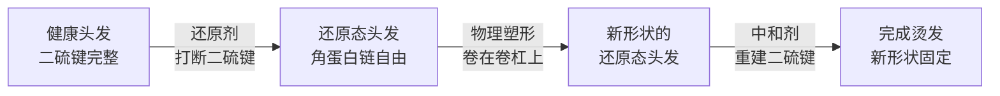

## 七、烫发原理与技术

烫发是改变头发形态最彻底、最持久的方法之一。与每天用吹风机或卷发棒的临时造型不同，烫发通过化学手段重新排列头发内部的蛋白质结构，使新形状维持数月甚至更久。理解烫发的原理，不仅能帮你做出正确的决策——选什么类型的烫、去什么样的店、怎么跟发型师沟通——还能让你理解为什么某些烫发方式对某些人效果极好，对另一些人却可能造成灾难性的损伤。

### 7.1 头发蛋白质结构与二硫键

要理解烫发，首先必须理解头发的化学组成。头发的主要成分是角蛋白（Keratin），一种纤维状结构蛋白，占头发干重的约85-90%。角蛋白分子之间通过多种化学键连接，这些键共同决定了头发的形状和强度。

#### 四种关键化学键

| 化学键类型 | 能量强度 | 可否被烫发改变 | 对头发形状的贡献 |
|-----------|---------|---------------|-----------------|
| 二硫键（Disulfide Bond） | 强（约251 kJ/mol） | 可以——这是烫发的核心靶点 | 决定头发的基本形状（直/卷），影响最深远 |
| 氢键（Hydrogen Bond） | 弱（约12-29 kJ/mol） | 可以——遇水即断裂，干燥后重建 | 影响临时造型（吹风定型的原理） |
| 盐键（Salt Bond） | 弱 | 可以——受pH变化影响 | 辅助维持形状 |
| 肽键（Peptide Bond） | 非常强（约350 kJ/mol） | 极难——需要强酸/强碱 | 维持蛋白质一级结构，不可逆损伤 |

烫发的核心操作就是**选择性地打断二硫键**，让角蛋白链获得自由移动的空间，然后在新的位置重新建立二硫键，从而"锁定"新形状。氢键虽然也能被改变，但因为能量太弱，洗一次头就恢复原状了——这就是为什么湿发时头发会变直/变卷、吹干后又恢复的原因。二硫键的能量远高于氢键，所以烫发的效果可以维持数月。

#### 二硫键的化学本质

二硫键连接的是角蛋白链上的两个半胱氨酸（Cysteine）残基。半胱氨酸含有巯基（-SH），两个相邻的巯基脱氢后形成 -S-S- 键（二硫键），将两条角蛋白链"焊接"在一起。

角蛋白链 A    角蛋白链 B
   |              |
  -SH    →      -S-S-     +  2H（脱去两个氢原子）
   |              |
（还原态）     （氧化态，即二硫键）

亚洲人头发中的二硫键密度高于白人和黑人，这意味着亚洲人头发天然更直、更硬、更难改变形状——但也意味着一旦成功烫卷，效果维持更久。

### 7.2 烫发的完整化学反应过程

一次完整的烫发包含两个核心化学阶段：还原反应和氧化反应。理解这个过程，是理解所有烫发技术的基础。

#### 第一阶段：还原（Relaxation）

**还原剂的作用**：使用含巯基的化学物质（最常见的是巯基乙酸/Thioglycolic Acid，简称TG）渗透进毛皮质，打断二硫键的 -S-S- 连接。

化学反应方程式：

角蛋白-S-S-角蛋白 + 2 HSCH₂COOH → 2 角蛋白-S-SCH₂COOH + 2H₂O
（二硫键）    （巯基乙酸）          （混合二硫化合物，头发变为还原态）

在这个阶段，角蛋白链之间的连接被切断，头发变得柔软可塑，可以被卷在卷杠上重新塑形。

**影响还原反应的因素**：

| 因素 | 影响 | 实际意义 |
|------|------|---------|
| 还原剂浓度 | 浓度越高，还原速度越快 | 粗硬发质需要较高浓度，细软发质用低浓度 |
| pH值 | 碱性环境加速反应（最佳pH 8.5-9.5） | 碱性越强，药水渗透越深 |
| 温度 | 温度每升高10°C，反应速率约增2-3倍 | 热烫利用加热来加速反应 |
| 处理时间 | 时间越长，二硫键断裂越充分 | 过度处理会导致头发失去结构支撑，变软塌甚至断裂 |
| 头发含水量 | 湿润头发更易吸收药水 | 烫发前头发需要适当湿润 |

#### 第二阶段：中和/氧化（Neutralization）

当头发在卷杠上处于新形状时，使用中和剂（通常是过氧化氢/H₂O₂或溴酸钠/NaBrO₃）将还原态的巯基重新氧化，在新的位置形成二硫键。

化学反应方程式：

2 角蛋白-SH + H₂O₂ → 角蛋白-S-S-角蛋白 + 2H₂O
（还原态巯基） （过氧化氢）   （新二硫键形成）

中和剂不仅定型，还有一个重要作用——停止还原反应。如果不定时使用中和剂，还原剂会继续破坏更多的二硫键，导致头发过度软化。这就是为什么中和步骤必须充分、不能省略。

### 7.3 烫发药水的核心成分解析

了解烫发药水中的具体成分，有助于你在理发店做出判断——闻到刺鼻气味不代表药水好，无味也不代表温和。

#### 还原剂体系

| 成分 | 化学名 | pH范围 | 特点 | 适用场景 |
|------|-------|--------|------|---------|
| 巯基乙酸铵 | Ammonium Thioglycolate | 8.5-9.5 | 最常用的冷烫还原剂，渗透力强，刺激性较大 | 粗硬发质、需要强卷度 |
| 巯基乙酸（游离酸） | Thioglycolic Acid | 7.0-8.0 | 浓度较低时温和，适合敏感发质 | 细软发质、受损发质 |
| 半胱氨酸 | Cysteine | 8.0-9.0 | 天然存在于头发中的氨基酸，温和 | 受损发质、追求自然效果 |
| 甘油巯基乙酸酯 | Glycerol Thioglycolate | 8.0-9.0 | 分子量较大，渗透较慢，可控性强 | 精细调控需求 |
| 硫代乙醇酸酯 | Thioesters | 7.5-8.5 | 新型温和还原剂，卷度自然 | 亚洲人发质、追求柔和效果 |

#### 中和剂体系

| 成分 | 浓度 | 特点 | 使用方式 |
|------|------|------|---------|
| 过氧化氢（H₂O₂） | 2-3% | 最常用，氧化速度快，可能造成轻微褪色 | 涂抹于卷杠上的头发，停留5-10分钟 |
| 溴酸钠（NaBrO₃） | 5-8% | 更温和，不褪色，但定型速度较慢 | 适合染后烫发，减少颜色变化 |
| 过硼酸钠 | 3-5% | 粉末状，使用前溶解，定型效果好 | 专业沙龙常用 |

#### 添加剂

现代烫发药水通常还含有多种添加剂来减少损伤和改善使用体验：

- **调理成分**（硅氧烷、角蛋白水解物）：在烫发过程中保护毛鳞片
- **缓冲剂**（硼酸盐、磷酸盐）：稳定pH值，防止反应过快
- **渗透促进剂**（乙醇胺）：帮助药水更快进入毛皮质
- **香精和色素**：掩盖化学气味，改善使用体验（与药效无关）

### 7.4 冷烫与热烫：两大技术路线的深度对比

冷烫和热烫是目前最主流的两种烫发方式，它们的核心区别在于**是否使用外部加热**，但这个表面差异背后是完全不同的化学机制、适用场景和效果特征。

#### 冷烫（Cold Perm）

**工作原理**：在室温（约20-25°C）下进行还原和氧化反应，不使用外部热源。

冷烫的经典流程：

1. 洗发清洁 → 不使用护发素（避免阻碍药水渗透）
2. 分区上卷杠 → 将头发缠绕在不同直径的卷杠上
3. 涂抹第一剂（还原剂） → 停留10-20分钟
4. 冲水测试卷度 → 取下一个卷杠检查弹性
5. 冲洗第一剂 → 用温水彻底冲洗3-5分钟
6. 涂抹第二剂（中和剂） → 停留5-10分钟
7. 拆卷杠 → 轻轻冲洗
8. 自然风干或低温吹干

**优势**：
- 操作相对简单，技术门槛较低
- 对头发整体热损伤小
- 成本较低，适合大范围推广
- 卷度从发根到发尾均匀

**劣势**：
- 在干燥环境中卷度可能不够持久
- 对粗硬发质的塑形力不如热烫
- 刚烫完时头发湿态和干态的卷度差异较大（湿态卷、干态可能膨胀变形）
- 卷度线条感较"硬"，不够自然

#### 热烫/数码烫（Hot Perm / Digital Perm）

**工作原理**：先用还原剂在室温下打断二硫键，然后利用加热（通常80-150°C）在卷杠上对头发进行"热定型"，最后用中和剂固定。

热烫的独特之处在于：它不仅依赖二硫键的重建来定型，还利用了**氢键在高温下的重组**。当头发在高温下被卷在卷杠上时，角蛋白链中的氢键被打断并以新位置重新建立。这种"双重定型"（二硫键 + 氢键）使热烫的效果比冷烫更持久、更自然。

热烫的典型流程：

1. 洗发清洁
2. 涂抹软化剂（第一剂） → 根据发质停留15-30分钟
3. 冲洗软化剂 → 充分冲洗
4. 将头发吹至半干（约70-80%干燥）
5. 上卷杠 → 使用数码控温卷杠
6. 加热定型 → 分阶段升温（通常120°C → 140°C → 150°C），每次10-15分钟
7. 冷却 → 自然冷却至室温（约10分钟）
8. 涂抹第二剂（中和剂） → 停留5-10分钟
9. 拆卷杠 → 自然风干

**优势**：
- 卷度更自然、更有弹性，干态效果好
- 对粗硬发质的塑形力强
- 效果更持久（4-8个月 vs 冷烫3-6个月）
- 烫后头发质感更好，有光泽感

**劣势**：
- 技术要求高，需要经验丰富的发型师
- 热量本身对头发有一定损伤
- 操作时间长（通常3-5小时）
- 费用较高
- 如果温度控制不当，可能造成不可逆热损伤

#### 冷烫vs热烫核心参数对比

| 对比维度 | 冷烫 | 热烫/数码烫 |
|---------|------|------------|
| 定型原理 | 仅依赖二硫键重建 | 二硫键 + 氢键双重定型 |
| 温度 | 室温（20-25°C） | 加热（80-150°C） |
| 干态卷度 | 比湿态松散，可能毛躁 | 干态卷度与湿态接近，更自然 |
| 湿态卷度 | 卷度紧致明显 | 湿态时卷度较松 |
| 适合发质 | 细软发质效果极好 | 粗硬发质塑形力更强 |
| 持续时间 | 3-6个月 | 4-8个月 |
| 操作时间 | 1.5-3小时 | 3-5小时 |
| 对头发的损伤 | 化学损伤为主 | 化学 + 热损伤双重 |
| 费用（国内参考） | 200-800元 | 500-2000元 |
| 适合的卷度 | 小卷、中卷效果好 | 大卷、自然波浪效果极好 |

### 7.5 其他烫发类型详解

除了标准的冷烫和热烫，还有几种针对特定需求的烫发技术。

#### 离子烫/拉直

离子烫的原理与烫卷恰好相反——将头发中的二硫键完全打断后，用直板夹在高温下将角蛋白链排列为直线状态，再用中和剂固定。

关键区别：
- 烫卷：打断二硫键 → 卷杠塑形 → 重建二硫键
- 拉直：打断二硫键 → 高温拉直 → 重建二硫键

离子烫的损伤程度通常高于烫卷，因为：
1. 需要将头发完全软化（二硫键断裂更彻底）
2. 高温直板夹（160-200°C）直接接触头发
3. 对亚洲粗硬发质需要多次拉直才能完全变直

适合离子烫的情况：天生自然卷或极度毛躁、无法通过吹风和造型产品控制的头发。如果只是想让头发顺滑一些，建议选择角蛋白护理（Keratin Treatment）而非离子烫。

#### 纹理烫（Texture Perm）

纹理烫是一种"轻度烫发"，不追求明显的卷度，而是通过局部处理增加头发的纹理感和蓬松度。典型的纹理烫使用较大的卷杠（直径30mm以上），药水浓度较低，处理时间较短。

纹理烫特别适合：
- 头发细软、贴头皮的人
- 不想要明显卷度但想要"有型"的人
- 想要增加头发体积和空气感的人
- 发型基础好，只需要微调的人

#### 定位烫/发根烫

定位烫（也叫发根烫、摩根烫）只处理发根部位，目的是增加发根的支撑力，让头发不再贴头皮。操作时将药水涂抹在距离头皮1-3厘米的发根区域，用专用的发根夹具将发根撑起。

这种烫发的优势是效果自然——从外面看不到任何卷度，但头发整体看起来更蓬松。持续时间较短（2-3个月），因为新生长出来的头发仍然是原来的直发。需要定期补烫。

#### 发尾烫

与定位烫相反，发尾烫只处理发尾部分，目的是让直发的发尾有一个自然的内扣或外翻。适合中长发想要发尾有弧度但不想全头烫的人。处理范围小，损伤低，效果自然。

### 7.6 不同发质的烫发策略

发质是决定烫发效果和风险的最关键因素。同样的药水、同样的时间，对不同发质可能产生截然不同的结果。

#### 细软发质

**特征**：毛鳞片薄、毛皮质层薄、蛋白质含量低、含水量高

**烫发特点**：
- 最容易接受药水处理，还原速度快
- 卷度效果最好，最容易定型
- 但也是最容易受损的发质——过度处理会导致头发断裂、变绵
- 烫后卷度可能过于紧致，需要选择大卷杠来平衡

**推荐策略**：
- 使用低浓度药水（pH 8.0-8.5）
- 缩短处理时间（比正常减少30%）
- 优先选择冷烫，避免热烫的额外热损伤
- 使用温和的中和剂（溴酸钠优于过氧化氢）

#### 中等发质

**特征**：毛鳞片和毛皮质厚度适中，是最"标准"的发质

**烫发特点**：
- 对药水的反应适中，可预测性强
- 冷烫和热烫都适用
- 损伤风险可控

**推荐策略**：
- 使用标准浓度药水
- 遵循标准处理时间
- 可以根据想要的效果选择冷烫或热烫

#### 粗硬发质（亚洲人最常见）

**特征**：毛鳞片厚、毛皮质层致密、二硫键密度高、天然含水量低

**烫发特点**：
- 对药水抵抗力强，还原速度慢
- 需要更高浓度的药水和更长的处理时间
- 但粗硬发质对损伤的抵抗力也更强
- 冷烫效果可能不够理想（卷度不够持久），热烫更适合

**推荐策略**：
- 使用中高浓度药水（pH 8.5-9.5）
- 适当延长处理时间（比标准增加15-20%）
- 优先选择热烫/数码烫，塑形力更强
- 选择较小的卷杠直径来获得理想卷度

#### 受损发质

**特征**：毛鳞片张开或脱落、毛皮质空洞化、蛋白质大量流失、干燥易断

**烫发风险**：
- 已经受损的头发结构支撑力不足，再进行化学处理可能导致严重断裂
- 药水渗透不均匀，导致卷度不一致
- 烫后头发可能变得更干燥、更毛躁

**建议**：
- **不建议直接烫发**。如果坚持要烫，必须先进行至少2-3个月的修复护理
- 修复期间使用含角蛋白、氨基酸、神经酰胺的护理产品
- 如果必须烫发，选择最温和的方式（如半胱氨酸还原剂、纹理烫）
- 处理时间缩短50%以上
- 与发型师充分沟通，进行发束测试（取少量头发先测试药水反应）

#### 染过的头发

**处理顺序的核心问题**：先染还是先烫？

| 方案 | 顺序 | 优点 | 缺点 |
|------|------|------|------|
| 方案A | 先烫后染 | 烫发不会影响已有的颜色 | 烫发药水可能使颜色轻微变化 |
| 方案B | 先染后烫 | 可以精确控制颜色 | 烫发可能使颜色褪色或变化 |
| 方案C | 同一天进行 | 节省时间 | 对头发损伤最大，不推荐 |

**最佳实践**：先烫发，等待2周后再染发。这给了头发时间从烫发中恢复，也避免了化学药水的叠加效应。如果必须同一天进行，至少间隔4小时以上。

### 7.7 亚洲人烫发的特殊考量

亚洲人的头发结构与欧美人有显著差异，这些差异直接影响烫发策略。

#### 结构差异

| 特征 | 亚洲人头发 | 高加索人头发 | 非洲人头发 |
|------|-----------|-------------|-----------|
| 横截面形状 | 圆形 | 椭圆形 | 扁平/肾形 |
| 二硫键密度 | 高 | 中等 | 高（分布不均匀） |
| 毛鳞片层数 | 7-10层 | 5-7层 | 较薄，易脱落 |
| 天然状态 | 直、硬 | 波浪或卷 | 紧密卷曲 |
| 直径 | 粗（80-100μm） | 中等（60-80μm） | 细（50-70μm） |
| 对药水的抵抗力 | 强 | 中等 | 中等 |

#### 亚洲人烫发的实际建议

1. **药水选择**：使用针对亚洲发质设计的药水产品，pH通常需要比标准略高（8.5-9.5）
2. **时间控制**：亚洲粗硬发质需要更长的软化时间，但不要过度追求"完全软化"——发束能拉长到原来的1.5-2倍且回弹即可
3. **卷杠选择**：想要明显效果用小卷杠（16-20mm），想要自然效果用大卷杠（26-32mm），亚洲发质用太大的卷杠效果可能不明显
4. **热烫优先**：对于想要大卷/自然波浪的亚洲人，热烫/数码烫几乎是唯一有效的选择——冷烫的大卷杠在粗硬亚洲发质上很难维持
5. **蓬松需求**：很多亚洲人烫发的主要目的是解决"头发塌"的问题，定位烫/发根烫是最直接的解决方案

### 7.8 烫发与脸型的搭配

烫发会改变头发的轮廓和体积分布，这直接影响脸型的视觉效果。选择正确的烫发方式，可以在视觉上改善脸型比例。

| 脸型 | 核心问题 | 推荐烫发策略 | 避免 |
|------|---------|-------------|------|
| 圆脸 | 脸宽大于脸长，缺乏立体感 | 上方蓬松+两侧内扣，拉长视觉比例 | 蓬松的两侧卷发（显更圆） |
| 长脸 | 脸长远大于脸宽 | 两侧增加体积的大卷/中卷，平衡比例 | 头顶过于蓬松（显更长） |
| 方脸 | 下颌线明显，棱角分明 | 柔和的波浪卷/自然纹理，软化线条 | 齐刘海+直发（强调棱角） |
| 菱形脸 | 颧骨突出，额头和下巴窄 | 两侧增加蓬松度，增加额头和下巴的视觉宽度 | 贴头皮的发型 |
| 椭圆脸/鹅蛋脸 | 比例均衡 | 几乎所有烫发方式都适合 | 无特别禁忌 |
| 方形脸 | 颧骨突出，太阳穴凹陷 | 增加太阳穴区域的蓬松度，用卷度遮盖颧骨 | 露出全脸的紧致发型 |

对于用户具体的方形脸型，纹理烫或定位烫增加太阳穴区域的蓬松度会特别有帮助，配合两侧的自然卷度可以有效弱化颧骨的突出感。

### 7.9 烫发前的评估与沟通

烫发不是走进理发店随便选个图片就行的——有效的前期评估和沟通决定了烫发效果的80%。

#### 自我评估清单

在去理发店之前，先回答以下问题：

1. **你的头发当前状态如何？**
   - 最近3个月内是否染过/烫过/拉直过？
   - 头发是否有分叉、断裂、干燥感？
   - 日常是否经常使用热造型工具？

2. **你想要什么效果？**
   - 明确的目标照片（至少准备3-5张参考图）
   - 是想要明显的卷度还是自然的纹理？
   - 是想要全头烫还是局部处理？

3. **你的维护意愿如何？**
   - 愿意每天花多少时间打理？
   - 是否愿意使用造型产品？
   - 能接受多久去一次理发店补烫？

#### 与发型师沟通的关键信息

**必须告知发型师的信息**：
- 近期的染烫历史（具体产品和时间）
- 是否有头皮敏感或过敏史
- 你的真实日常打理习惯（而不是理想状态）
- 你的预算范围

**需要向发型师确认的信息**：
- 使用什么类型的药水（酸性/碱性，什么品牌）
- 预计处理时间
- 烫后效果在不同湿度下的表现
- 后续维护建议和补烫周期

**红旗警告**：如果发型师不问你的头发历史就开始操作，建议换一家。专业的发型师一定会先评估你的发质再选择药水和方案。

#### 发束测试

在正式烫发前，专业的发型师会进行发束测试：取一小束不显眼位置的头发，涂抹药水，按正常时间处理后观察效果。这个测试能告诉你：

- 药水对你的发质是否合适
- 需要的处理时间是多少
- 最终卷度的大致效果
- 头发是否有异常反应（过度软化、变色、断裂）

如果发型师没有主动做发束测试，你可以要求做——这不是不信任，而是负责任的表现。

### 7.10 烫发后的护理体系

烫发改变了头发的内部结构，使头发比烫发前更脆弱、更容易流失水分和蛋白质。正确的护理不仅能延长烫发效果，还能最大限度地减少持续损伤。

#### 烫发后48小时关键期

这48小时是二硫键完全稳定的窗口期，以下行为需要严格避免：

- **不要洗发**：过早洗发可能打断尚未完全建立的二硫键
- **不要用梳子拉扯**：新生的二硫键还在稳定过程中
- **不要扎头发或用发夹**：外力可能改变卷度形状
- **避免淋雨和高湿度环境**：水分会软化尚未稳固的结构
- **睡觉时使用丝绸枕套**：减少摩擦对卷度的影响

#### 日常护理流程

**洗护产品选择**：

| 产品类型 | 功能 | 选择要点 | 推荐成分 |
|---------|------|---------|---------|
| 洗发水 | 清洁 | 选择无硫酸盐（SLS/SLES-Free）配方 | 氨基酸表面活性剂、椰油基谷氨酸钠 |
| 护发素 | 表面修复 | 每次洗发后使用 | 硅氧烷（聚二甲基硅氧烷）、泛醇 |
| 发膜/深层护理 | 深层修复 | 每周1-2次 | 角蛋白水解物、氨基酸、神经酰胺 |
| 免洗护发素 | 日常保护 | 出门前使用 | 摩洛哥坚果油、硅氧烷、紫外线吸收剂 |
| 卷发定型产品 | 维持卷度 | 湿发时使用 | 聚合物（VP/VA共聚物）、甘油 |

**洗发技巧**：
- 洗发频率控制在每2-3天一次，过于频繁会加速卷度流失
- 水温不要超过40°C，高温会加速化学键断裂
- 洗发时用手指从下往上"抓握"头发，促进卷度恢复
- 不要用力揉搓发尾，轻轻按压即可
- 冲洗时让水顺着头发流下，不要将头发团在一起搓

**干燥方式**：
- 最佳方式：用旧T恤或超细纤维毛巾轻轻按压吸去多余水分，然后自然风干
- 如果使用吹风机：使用扩散器（Diffuser），低温档，从下往上托着头发吹
- 不要用普通吹风机直接对着头发猛吹——热风会破坏卷度并造成热损伤

#### 深层护理方案

**每周发膜护理**：

步骤：
1. 洗发后轻轻擦干多余水分
2. 取适量发膜，从发中到发尾均匀涂抹
3. 用热毛巾包裹头发（或戴上浴帽用吹风机低温加热）
4. 等待15-20分钟（深层修复需要时间让成分渗透）
5. 用温水彻底冲洗
6. 使用冷水做最后的冲洗（帮助闭合毛鳞片）

**每月蛋白质补充**：
烫发会流失大量角蛋白，每月进行1次蛋白质补充护理可以修复毛皮质的空洞。选择含水解角蛋白或丝蛋白的护理产品——分子量足够小才能渗透进毛皮质。

#### 烫发效果的自然衰退

了解烫发效果如何随时间消退，可以帮你合理预期和规划补烫周期。

烫发效果衰退曲线（示意）：

效果强度
  100%|████████
     |██████████
   80%|████████████
     |██████████████
   60%|████████████████
     |██████████████████
   40%|████████████████████
     |██████████████████████
   20%|████████████████████████
     |________________________
      0   1   2   3   4   5   6  （月）

  冷烫：3-6个月后卷度明显减弱
  热烫：4-8个月后卷度明显减弱

影响衰退速度的因素：
- **头发生长速度**：新生的直发会逐渐"稀释"整体卷度效果
- **洗发频率**：洗得越勤，衰退越快
- **日常热造型**：使用热工具会加速化学键断裂
- **紫外线暴露**：UV会分解蛋白质结构
- **游泳池中的氯**：氯会与头发中的化学键反应

### 7.11 常见问题与解决方案

#### 问题一：烫后头发毛躁

**原因**：毛鳞片在化学处理中被打开，无法完全闭合，导致表面不光滑。

**解决方案**：
- 使用含硅氧烷的免洗护发素，在头发表面形成保护膜
- 定期使用酸性冲洗（苹果醋稀释液，1:10比例）帮助闭合毛鳞片
- 避免用干毛巾搓头发

#### 问题二：卷度不均匀

**原因**：药水涂抹不均匀、不同区域的头发受热/受药时间不一致。

**解决方案**：
- 如果是轻微不均，可以用手指蘸取少量定型产品调整
- 严重不均需要回到理发店让发型师进行局部修正
- 下次烫发时提醒发型师注意分区的均匀性

#### 问题三：卷度消失太快

**原因**：可能是头发太健康（药水渗透不足）、药水浓度不够、处理时间不足，或日常护理不当。

**解决方案**：
- 补烫时可以适当延长处理时间或使用稍强的药水
- 减少洗发频率，使用卷发专用洗护产品
- 湿发时使用卷发定型产品，用手指缠绕帮助恢复卷度
- 睡觉时将头发松松地盘在头顶，用丝绸枕套

#### 问题四：烫后头发太卷/太蓬

**原因**：处理时间过长、药水浓度太高、卷杠直径太小。

**解决方案**：
- 等待1-2周，卷度会自然松一些
- 使用直发膏或柔顺产品，轻轻拉直部分卷度
- 洗发时让头发自然下垂风干，不要抓握
- 下次烫发时选择更大的卷杠

#### 问题五：烫后头发变色或变黄

**原因**：过氧化氢中和剂可能导致头发轻微褪色，或药水中的化学物质与头发中的色素发生反应。

**解决方案**：
- 使用紫色洗发水（去黄洗发水）中和黄色调
- 烫后染一次颜色来修正
- 下次烫发时选择溴酸钠中和剂代替过氧化氢

#### 问题六：头皮刺激或过敏

**原因**：对巯基乙酸或其他药水成分过敏。

**解决方案**：
- 立即冲洗药水，停止处理
- 轻微刺激可使用含甘草酸二钾的舒缓产品
- 严重过敏反应（红肿、水泡、呼吸困难）需立即就医
- 下次烫发前必须进行48小时皮肤贴片测试
- 可以尝试更换药水品牌或使用半胱氨酸基药水（更温和）

### 7.12 烫发的长期影响与风险管控

#### 头发结构的累积损伤

每次烫发都会对头发造成一定程度的不可逆损伤。毛鳞片被打开后可能无法完全恢复到原始状态，多次烫发会导致累积效应：

健康头发毛鳞片截面：       多次烫发后的截面：
  ╔══════════╗              ╔══════════╗
  ║ 紧密闭合  ║              ║ 部分翘起  ║
  ║          ║              ║ 空洞化    ║
  ║ 均匀致密  ║              ║ 蛋白质流失 ║
  ╚══════════╝              ╚══════════╝

**风险管控原则**：
1. **烫发间隔不少于3个月**：给头发足够时间恢复
2. **两次烫发之间进行密集护理**：补充流失的蛋白质和水分
3. **避免烫+染+漂的叠加处理**：每种化学处理都会累积损伤
4. **定期修剪发尾**：每6-8周修剪一次，去除已经严重受损的发尾
5. **关注头发的"求救信号"**：如果头发变得极度干燥、无弹性、一拉就断，说明损伤已经很严重，必须停止一切化学处理并进行至少3个月的修复

#### 烫发与孕期/哺乳期

目前没有确凿的医学证据表明烫发药水会对孕妇或胎儿造成伤害——药水通过头皮吸收进入血液的量极小。但出于谨慎原则，大多数医生建议：

- 孕期（尤其是前三个月）避免烫发
- 哺乳期可以烫发，但注意不要让药水接触婴儿
- 如果必须在孕期烫发，选择通风良好的环境，避免吸入药水蒸气

### 7.13 与发型师沟通的实用话术

很多人的烫发失败不是技术问题，而是沟通问题。以下是实用的沟通模板：

**描述你想要的效果**：
- 不要说："我要烫卷。"（太模糊）
- 而要说："我想要自然的波浪感，像是用卷发棒做出来的那种效果，不要明显的小卷。发根要蓬松但发尾要自然。"

**描述你不想看到的效果**：
- "不要那种老气的小卷"
- "不要发尾太卷、发根塌的情况"
- "不要烫完第二天就变直"

**描述你的日常生活**：
- "我每天洗头"或"我2-3天洗一次头"
- "我不太会用造型产品"
- "我经常戴帽子/头盔"
- "我经常运动出汗"

**提出你的顾虑**：
- "我之前烫过一次，一周就变直了"
- "我头发染过，会不会有影响？"
- "我担心烫完头发会很干"

### 7.14 烫发的经济考量

烫发不是一次性消费，后续的维护成本需要提前考虑。

| 项目 | 冷烫 | 热烫/数码烫 | 定位烫 |
|------|------|------------|--------|
| 首次烫发费用 | 200-800元 | 500-2000元 | 150-400元 |
| 补烫周期 | 3-6个月 | 4-8个月 | 2-3个月 |
| 年度补烫次数 | 2-4次 | 1.5-3次 | 4-6次 |
| 年度洗护产品 | 500-1000元 | 500-1000元 | 500-1000元 |
| 年度深层护理 | 500-1500元 | 500-1500元 | 300-800元 |
| 年度总费用 | 1400-5700元 | 1750-8500元 | 1400-3800元 |

**省钱技巧**：
- 选择有口碑的发型师比选择贵的药水更重要——好发型师用中等药水也能做出好效果
- 日常护理自己在家做，不需要去理发店做深层护理（理发店护理价格通常是产品成本的5-10倍）
- 补烫时可以只处理新生长的区域，而不是全头重烫

***

