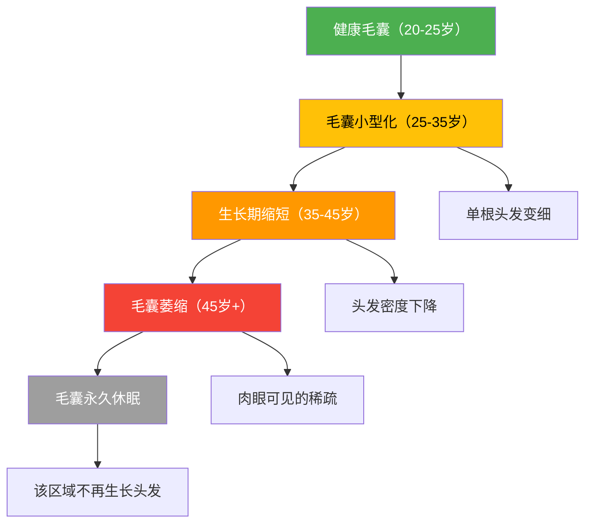
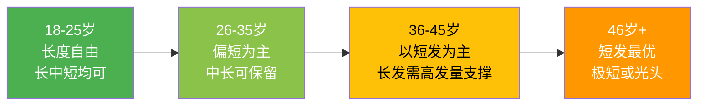

## 八、年龄与发型的关系

发型不是静态的——它应该随你的年龄一起演进。一个20岁少年的蓬松锡纸烫放在40岁中年人头上会显得格格不入，反之，一个精心打理的商务背头放在高中生头上也会显得过于老成。问题在于：大多数人的发型并非"选择"出来的，而是"惯性"出来的——他们在某个年龄留了某个发型，然后就再也没换过。

本章将从生理变化、审美逻辑、具体方案三个层面，系统讲解不同年龄段的发型策略。核心观点是：**年龄不是限制，而是信息——它告诉你当前阶段应该优先考虑什么。**

### 8.1 头发随年龄变化的生理机制

在讨论"该留什么发型"之前，必须先理解"头发本身在发生什么变化"。这些变化是客观存在的生理事实，不以你的意志为转移，但可以通过发型策略来适应甚至利用。

#### 8.1.1 毛囊的生命周期衰退

人出生时头皮约有10万个毛囊，此后不再新增。随着年龄增长，毛囊经历以下变化：

**关键数据**：
| 年龄段 | 头发密度（根/cm²） | 发干直径变化 | 生长期占比 |
|--------|-------------------|-------------|-----------|
| 20-25岁 | 200-250 | 基准值 | 约90% |
| 25-35岁 | 180-220 | 下降5-10% | 约85% |
| 35-45岁 | 150-190 | 下降10-20% | 约75% |
| 45-55岁 | 120-170 | 下降15-30% | 约65% |
| 55岁以上 | 100-150 | 下降20-40% | 约55% |

*注：以上数据为亚洲男性平均值，个体差异显著，主要受遗传因素影响。*

#### 8.1.2 雄激素与毛囊的关系

这是男性发型规划中最关键但最常被忽视的生理因素。睾酮（Testosterone）在5α-还原酶的作用下转化为二氢睾酮（DHT），而DHT对不同区域的毛囊有截然不同的作用：

- **头顶和前额毛囊**：携带雄激素受体基因敏感型，DHT会导致毛囊逐渐萎缩（雄激素性脱发，Androgenetic Alopecia，简称AGA）
- **后枕部毛囊**：对DHT不敏感，这也是为什么植发通常取后枕部的毛囊
- **体毛毛囊**：DHT反而促进生长，所以男性随年龄增长体毛会变多

**这就是为什么"年龄越大，发型越难"的根本原因**——不仅是审美的变化，更是物理条件的退化。

AGA的Norwood-Hamilton分级（男性）：

| 分级 | 表现 | 典型年龄 | 发型策略核心 |
|------|------|---------|------------|
| I级 | 发际线正常 | 无脱发 | 维护为主，预防性策略 |
| II级 | 额角微退（M型） | 20-30岁 | 利用刘海或侧分遮挡 |
| III级 | 额角明显后退 | 25-35岁 | 调整发际线视觉位置 |
| III顶型 | 头顶开始稀疏 | 25-35岁 | 增加头顶蓬松度 |
| IV级 | 头顶明显稀疏+额角后退 | 30-40岁 | 考虑整体缩短，增加纹理 |
| V级 | 头顶与额角连成片 | 35-45岁 | 极短发或光头为最优解 |
| VI-VII级 | 仅后枕部和两侧残留 | 40岁以上 | 光头+胡须组合 |

#### 8.1.3 黑色素衰退与灰白发

第一章头发生理学中已详述黑色素机制，这里补充年龄维度的关键信息：

| 阶段 | 年龄范围（亚洲男性） | 白发比例 | 应对策略 |
|------|-------------------|---------|---------|
| 早期灰发 | 30-35岁 | <15% | 剪掉可见白发，暂不染 |
| 明显灰发 | 35-45岁 | 15-40% | 考虑挑染或整体染色 |
| 大面积白发 | 45-55岁 | 40-70% | 选择保留银发或定期染发 |
| 全白 | 55岁以上 | >70% | 银发本身就是风格 |

**灰发的生理特点**：
- 灰色头发通常比有色头发更粗硬（毛囊结构变化导致），造型时需要更强的产品
- 灰发更容易显黄（紫外线氧化），需要使用紫色调洗发水（Silver Shampoo）每月1-2次维持色调
- 灰发的毛鳞片张开角度更大，导致触感粗糙、缺乏光泽，需要更频繁的护发素使用

#### 8.1.4 头皮出油模式的年龄变化

皮脂腺活性随年龄变化呈现一条明显的曲线：

这意味着：年轻时你需要控油蓬松产品，年长后你需要保湿滋养产品。用错产品比不用产品更糟——一个45岁干性头皮的人还在用强效控油洗发水，只会让头发更加干枯脆弱。

### 8.2 各年龄段发型策略详解

#### 8.2.1 18-25岁：探索与试错期

**生理特征**：毛囊处于最佳状态，发量充足，发质强韧，皮脂分泌旺盛。这个阶段的"问题"几乎都是造型相关的（扁塌、出油、不会打理），而非生理退化。

**审美目标**：建立个人风格认知，通过大量尝试发现自己适合什么。

**推荐发型方向**：

| 风格 | 具体发型 | 适合场景 | 打理难度 |
|------|---------|---------|---------|
| 潮流前卫 | 锡纸烫、羊毛卷、挂耳染 | 校园、社交 | ★★★★ |
| 日韩系 | 中分纹理烫、逗号刘海 | 日常、约会 | ★★★ |
| 运动清爽 | 寸头、渐变推剪（Fade） | 运动、日常 | ★★ |
| 文艺清新 | 中长发碎剪、空气刘海 | 校园、文艺场景 | ★★★ |
| 经典入门 | 侧分短发、Undercut | 通勤、实习 | ★★★ |

**这个年龄段的核心策略**：
1. **多尝试，不执着**。这是你唯一可以频繁换发型、偶尔"翻车"也不会有严重后果的时期。一款新发型维持2-3个月，不满意就换——这本身就是经验积累。
2. **从简单开始学打理**。先掌握吹风机基本用法（方向、温度、距离），再学发蜡/发泥的基本涂抹手法。不要一上来就学复杂的造型技巧。
3. **关注头皮清洁**。20岁左右皮脂分泌旺盛，很多人误以为头发出油是"脏"，实际上过度清洁（每天用强效洗发水）反而会刺激皮脂腺分泌更多油脂。建议每1-2天洗一次，选择温和的氨基酸类洗发水。
4. **拍照记录**。每次剪完头发拍正面、侧面、背面照片，建立自己的"发型档案"。回头看时你会清楚地知道哪些适合自己、哪些不适合。

**常见误区**：
- "我脸大所以不能剪短发"——很多时候短发配合正确的鬓角处理反而能让脸显小
- "烫发会伤头发"——现代烫发技术已经温和很多，合理的烫发频率（间隔3个月以上）对健康发质的影响是可控的
- "跟风网红款"——网红发型是在特定灯光、造型师、滤镜条件下呈现的效果，直接复制到日常生活大概率会失望

#### 8.2.2 26-35岁：定位与精进期

**生理特征**：毛囊开始出现早期退化迹象。部分人（约25-30%的亚洲男性在30岁前）开始出现发际线后退或头顶轻微稀疏。皮脂分泌开始从峰值回落，但整体仍偏油性。

**审美目标**：找到2-3款稳定的核心发型，建立高效的日常打理流程。

**推荐发型方向**：

| 风格 | 具体发型 | 适合场景 | 打理难度 |
|------|---------|---------|---------|
| 商务精英 | 侧分背头（Side Part）、经典Undercut | 职场、商务 | ★★★ |
| 轻熟休闲 | 纹理中分、法式Crop | 日常、约会 | ★★★ |
| 干练短发 | Buzz Cut、Crew Cut | 高效日常 | ★★ |
| 个性表达 | Pompadour、Faux Hawk | 社交、休闲 | ★★★★ |

**这个年龄段的核心策略**：

1. **建立"发型衣橱"概念**。准备2-3种不同长度/风格的发型方案，分别对应不同场合。例如：工作日侧分背头（专业感）、周末纹理中分（轻松感）、正式场合油头（高级感）。

2. **学会根据脸型调整**。这个阶段你的脸型特征已经完全稳定，是时候深入了解第一章脸型与发型搭配的理论了。具体调整方法：

   | 脸型问题 | 发型调整策略 | 具体操作 |
   |---------|------------|---------|
   | 额头过高 | 用刘海遮挡 | 刘海长度覆盖发际线1-2cm |
   | 脸偏宽 | 两侧推短，顶部留长 | 渐变推剪（Mid Fade） |
   | 下颌方 | 顶部增加高度 | 用吹风机+定型产品拉高 |
   | 脸偏长 | 避免过高造型 | 两侧适度保留，顶部控制在3-5cm |

3. **开始预防性护理**。25岁之后，如果家族有脱发史，现在就应该采取行动：
   - 外用米诺地尔（Minoxidil 2-5%）：经FDA批准的脱发预防药物，有效率约60-70%，需要持续使用才能维持效果
   - 口服非那雄胺（Finasteride 1mg）：处方药，需在医生指导下使用，有效率约80-90%
   - 低能量激光治疗（LLLT）：家用激光梳/帽，作为辅助手段
   - **关键原则**：预防远比治疗容易，毛囊一旦完全萎缩就不可逆转

4. **优化洗护流程**。这个阶段应从"能洗干净就行"升级为系统性护理：
   - 洗发水选择：从单纯的控油转向功能型（防脱型、氨基酸型）
   - 加入护发素：洗发后使用，重点涂在发干和发梢
   - 每周一次深层护理：发膜或头皮精华

#### 8.2.3 36-45岁：成熟与气质期

**生理特征**：头发密度明显下降（比25岁时减少15-25%），白发开始显现（通常从鬓角开始），发质变细变软。雄激素性脱发在这个年龄段进入中期，约50%的亚洲男性出现肉眼可见的脱发。

**审美目标**：用发型传递成熟、可靠、有品味的形象，而非试图追赶年轻潮流。

**推荐发型方向**：

| 风格 | 具体发型 | 适合场景 | 打理难度 |
|------|---------|---------|---------|
| 成熟稳重 | 经典侧分、绅士背头 | 商务、社交 | ★★★ |
| 优雅减龄 | 纹理短发、法式Crop | 日常、休闲 | ★★★ |
| 硬朗风格 | 板寸+胡须组合 | 高效日常 | ★★ |
| 文艺雅痞 | 中长发后梳、All Back | 艺术、社交 | ★★★★ |

**这个年龄段的核心策略**：

1. **适应而非对抗**。当发量减少时，最忌讳的是用头发遮盖稀疏区域——那只会让稀疏更明显。正确的做法是：
   - 发际线后退 → 侧分位置微调，接受更高的发际线，用整体造型的利落感来弥补
   - 头顶稀疏 → 选择纹理短发（2-4cm），碎剪增加空气感，避免长发贴头皮
   - 两鬓白发 → 与其频繁染黑（每2周露出白色发根更尴尬），不如考虑灰白挑染的过渡方案

2. **白发管理的决策点**。这个阶段通常需要做出"染还是不染"的决定：

   | 方案 | 优点 | 缺点 | 维护成本 |
   |------|------|------|---------|
   | 保持自然灰白 | 零维护，自然老去的优雅 | 需要搭配得体的穿着和气质 | 低 |
   | 定期全染 | 遮盖彻底 | 每3-4周补染，发根暴露尴尬期 | 高 |
   | 挑染/渐变染 | 过渡自然，没有明显的发根线 | 需要找技术好的染发师 | 中 |
   | 局部遮染 | 只处理鬓角等显眼区域 | 效果有限 | 中 |

3. **重视发型的"质感"而非"花哨"**。这个阶段提升形象的方式不是增加造型的复杂度，而是：
   - 选择高质量的理发店（不再去快剪店）
   - 使用质感更好的造型产品（从发蜡升级到海盐喷雾+发油的组合）
   - 注重头发的光泽度和健康感

4. **发型与整体形象的协调**。36岁之后，发型必须与穿着、配饰、气质协同：
   - 商务正装 → 利落的侧分或背头
   - 休闲亚麻 → 自然纹理的短发
   - 运动户外 → 极短发或帽型发型

#### 8.2.4 46-55岁：从容与格调期

**生理特征**：头发密度进一步下降（比25岁时减少25-40%），白发比例可能达到30-50%。头皮开始偏干，需要从控油转向保湿。发质明显变细变软，支撑力下降。

**审美目标**：发型应传递从容、自信、有格调的形象。这个阶段的关键词是"得体"——既不刻意装嫩，也不放任自流。

**推荐发型方向**：

| 风格 | 具体发型 | 适合场景 | 特点 |
|------|---------|---------|------|
| 经典绅士 | 侧分短发（3-5cm） | 通用 | 不挑脸型，易打理 |
| 利落干练 | Crew Cut或Buzz Cut | 高效日常 | 最大限度掩盖稀疏 |
| 气质型 | 自然后梳（5-7cm） | 社交场合 | 需要一定发量支撑 |
| 硬汉风格 | 光头+精心打理的胡须 | 发量极少时的最优解 | 自信感最强 |

**这个年龄段的核心策略**：

1. **洗护产品全面转型**：
   - 洗发水：无硅油、温和清洁型（氨基酸基底），避免过度去油
   - 护发素：每次洗发后必用，选择含角蛋白（Keratin）或透明质酸的产品
   - 头皮护理：每周1-2次头皮精华，重点关注保湿和抗衰老
   - 染后护理：如果染发，必须使用护色洗发水和护色护发素

2. **造型产品选择**：
   - 避免强定型产品（强效发蜡、强力定型喷雾）——它们会让稀疏的头发更扁塌
   - 推荐：海盐喷雾（增加纹理感和蓬松度）、轻质发油（增加光泽但不压塌）、蓬松粉（即时增加发根支撑力）

3. **光头——被低估的风格选择**。当脱发达到Norwood V级以上时，光头（Bald）往往比"努力遮盖"更显年轻、更显自信：
   - 需要定期剃光（每2-3天），保持干净感
   - 头皮也需要防晒——光头不涂防晒霜会被晒伤
   - 配合胡须（Beard）形成"光头+胡须"的经典组合
   - 保持健壮的体型会让光头造型加分很多

#### 8.2.5 55岁以上：自在与风范期

**生理特征**：头发可能以白发为主，密度较低，质地脆弱。头皮皮脂分泌大幅减少，干燥是主要问题。

**审美目标**：不刻意追求年轻，以自信和得体为核心。银发可以是高级感的来源。

**推荐发型方向**：
- **短发为主**：2-4cm的短发最容易打理，也最不显稀疏
- **保持整洁**：修剪频率比风格更重要，建议每2-3周修剪一次
- **胡须加分**：精心打理的胡须（银白色）能显著提升气质
- **帽子作为配饰**：渔夫帽、报童帽、礼帽——帽子不仅是遮挡，更是风格表达

### 8.3 跨年龄段的通用原则

#### 8.3.1 发型调整的三个时机

不是"到了某个年龄必须换发型"，而是当以下信号出现时，主动调整：

1. **生理信号**：发际线变化超过0.5cm、头发明显变细、白发比例超过20%
2. **角色信号**：职业变化（学生→职场、基层→管理层）、社交圈层变化
3. **审美信号**：觉得现有发型"不对劲"了、收到负面反馈、在照片中不满意自己的形象

#### 8.3.2 不同程度发量变化的应对策略

| 变化程度 | 表现 | 发型策略 | 产品辅助 | 是否需要医学干预 |
|---------|------|---------|---------|---------------|
| 正常范围 | 每天掉50-100根 | 正常维护 | 无需特殊产品 | 否 |
| 轻度减少 | 发际线微退，肉眼不明显 | 刘海遮挡，避免后梳 | 蓬松产品 | 建议预防性使用米诺地尔 |
| 中度减少 | 头顶可见头皮，发际线明显后退 | 短发+纹理处理 | 蓬松粉+纹理产品 | 应就医评估，考虑药物治疗 |
| 重度减少 | 大面积稀疏 | 极短发或光头 | 头皮护理产品 | 评估植发可行性 |
| 完全脱发 | 仅后枕部和两侧有发 | 光头风格化 | 剃须+头皮护理 | 植发或假发（如希望恢复） |

#### 8.3.3 年龄与发型长度的关系

这是一条经验法则，虽非绝对，但有统计学支持的审美规律：

**为什么年龄越大越推荐短发**：
- 发量减少后，长发会暴露稀疏区域，短发则不会
- 年长者的发质变细变软，长发缺乏支撑力，容易贴头皮显油腻
- 短发更容易打理，每天节省15-20分钟的造型时间
- 短发给人的印象更干练、更精神

### 8.4 年龄与发型的常见误区

#### 误区一："30岁之后不能烫发"

错。烫发与年龄无关，与发质和头皮健康有关。只要间隔时间合理（至少3个月）、选择温和的烫发药水（酸性或半胱氨酸类）、烫后做好护理，40岁之后烫发完全没问题。纹理烫甚至能帮助稀疏的头发增加蓬松感，视觉上显得发量更多。

#### 误区二："白发必须染黑"

不一定。大面积白发染黑后，白色发根每2-3周就会暴露出来，形成明显的"黑白分界线"，反而更显老。更好的选择包括：
- 挑染/渐变染（灰白与深色交织，过渡自然）
- 保持自然灰白（前提是整体形象——穿着、气质——要匹配）
- 选择比自然发色浅1-2度的颜色（即使发根暴露也不会太明显）

#### 误区三："脱发是没办法的事，只能认命"

雄激素性脱发（AGA）目前有多种经临床验证的治疗方案：
- **米诺地尔（外用）**：FDA批准，有效率约60%，需持续使用
- **非那雄胺（口服）**：FDA批准，有效率约80-90%，需处方，有潜在副作用需与医生讨论
- **低能量激光治疗**：辅助手段，刺激毛囊活性
- **富血小板血浆注射（PRP）**：注射自体生长因子，需多次治疗
- **毛发移植**：将后枕部抗DHT的毛囊移植到脱发区域，效果永久

关键在于"早"——毛囊完全萎缩后就不可逆转。发现脱发迹象后应尽早就医（皮肤科/毛发专科）。

#### 误区四："年纪大了就不需要在意发型"

恰恰相反。研究（如2011年发表在《Journal of Business and Psychology》的研究）表明，外在形象对职业发展和社交关系的影响在中年之后非但没有减弱，反而因为"第一印象效应"的累积而更加显著。一个45岁仍然注重发型的人，在职场和社交中给人的印象是"自律、注重细节、有品味"——这些都是高价值信号。

#### 误区五："脱发了就戴帽子遮住"

偶尔戴帽子没问题，但长期依赖帽子会：
- 创造湿热的头皮环境，可能导致毛囊炎
- 帽子摩擦可能加剧发际线区域的牵引性脱发
- 在社交场合"不摘帽子"反而会引起更多关注
- 心理上形成依赖，逃避真正解决问题

### 8.5 年龄与发型的心理维度

#### 8.5.1 发型焦虑的年龄曲线

发型焦虑并非均匀分布——它在某些年龄段特别强烈：

| 年龄段 | 焦虑来源 | 典型表现 | 应对方式 |
|--------|---------|---------|---------|
| 18-22岁 | 同辈压力、社交媒体 | 频繁换发型，跟风网红款 | 接受"试错是学习过程" |
| 25-30岁 | 初现脱发迹象 | 过度关注掉发量，频繁照镜子 | 及早就医，避免焦虑驱动的冲动决策 |
| 30-40岁 | 职场形象压力 | 焦虑白发、发际线 | 接受生理变化，主动调整策略 |
| 40-50岁 | "中年危机"的一部分 | 对外表变化的不适感 | 重新定义"好的形象"的标准 |
| 50岁以上 | 社会对老年人的刻板印象 | 放弃形象管理 | 保持适度关注，自信是最好的发型 |

#### 8.5.2 建立"年龄正向"的发型观

最佳策略不是"对抗衰老"，而是"适应变化并主动管理"。每个年龄段都有独特的魅力：
- 20岁的活力和可塑性
- 30岁的成熟和专业感
- 40岁的从容和品味
- 50岁的自信和风范
- 60岁以上的自在和洒脱

**你的发型应该表达你当前阶段最好的状态，而不是试图回到过去的状态。**

### 8.6 实操工具：年龄适配发型选择清单

以下是帮助你快速定位当前阶段发型方向的决策清单：

**Step 1：评估当前生理状态**
- [ ] 发际线是否后退？（与25岁时对比）
- [ ] 头顶是否可见头皮？
- [ ] 白发比例大约多少？
- [ ] 头发出油还是偏干？

**Step 2：确定发型长度区间**
- 发量充足 + 偏油 → 中长发可选（7-15cm）
- 发量中等 + 中性 → 中短发（4-8cm）
- 发量偏少 + 偏干 → 短发（1-4cm）
- 大面积稀疏 → 极短发（<1cm）或光头

**Step 3：匹配场合需求**
- 以职场为主 → 偏正式、利落的风格
- 以社交为主 → 可以更个性化
- 通用型 → 选择适应性最广的经典款式

**Step 4：确定打理投入**
- 每天愿意花5分钟以下 → 选低打理需求的发型
- 每天愿意花10-15分钟 → 可以选中等复杂度的发型
- 每天愿意花15分钟以上 → 可以尝试高复杂度造型

**Step 5：咨询专业理发师**
带着以上评估结果去理发店，与理发师沟通你的需求。一个好的理发师会根据你的发量、发质、脸型和生活方式，给出具体的长度和层次建议——这比你自己在网上搜"XX岁适合什么发型"要靠谱得多。

***

**本节核心要点**：
1. 头发随年龄发生可预测的生理变化——毛囊退化、黑色素减少、皮脂分泌下降
2. 发型策略应随年龄主动调整，而非被动等到"不行了"再改
3. 预防优于治疗——25岁之后有脱发风险的人应尽早采取预防措施
4. 每个年龄段都有最优发型方案，关键是找到适合自己当前状态的那个
5. 发型焦虑是正常的，但最好的应对方式是"了解变化→主动管理→接受结果"
