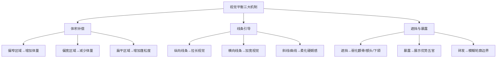
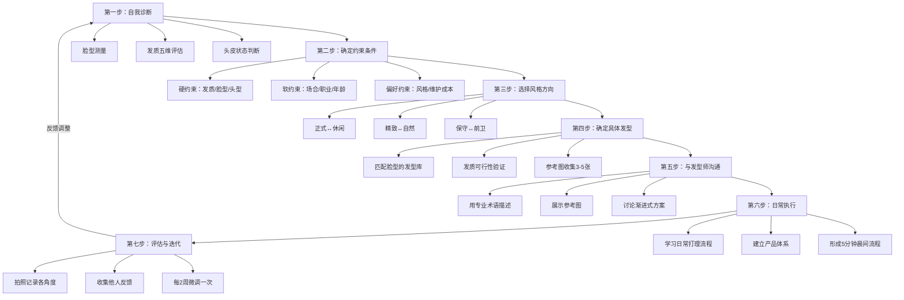
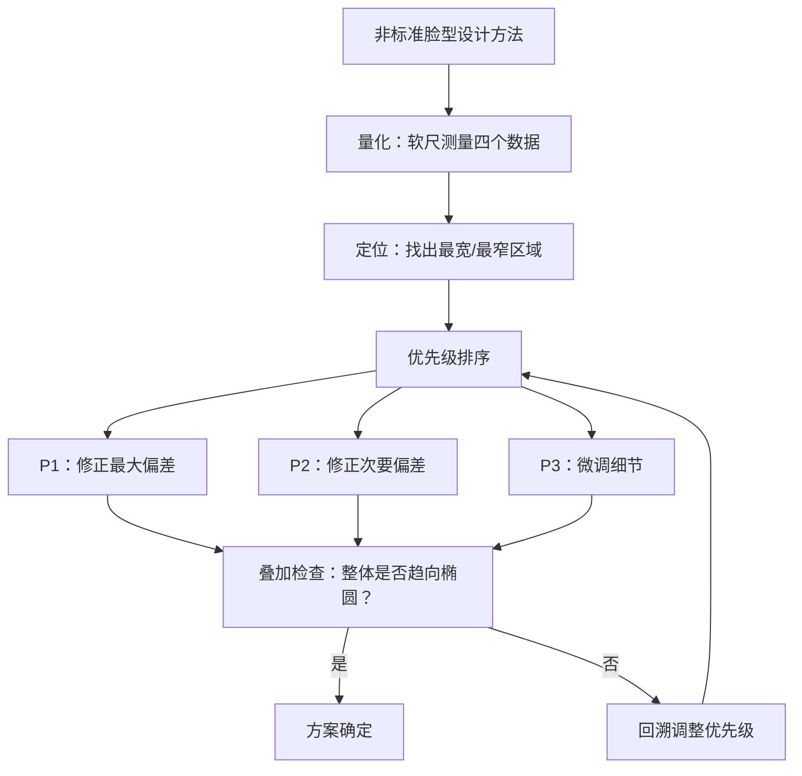

## 九、发型设计的核心总结

前八节从头发生理学、发质分析、脸型搭配、风格分类、头发护理、染发技术、烫发原理到年龄策略，构建了发型设计的完整知识体系。本节将这些离散的知识点压缩成一套**可直接调用的决策操作系统**——一套你在面对任何发型问题时都能回溯的底层框架。

这不是简单的"回顾"，而是**知识的重组**。前八节是按学科维度展开的纵向知识，本节则按决策维度进行横向整合：当你站在镜子前、坐在理发店里、或在网上浏览发型图片时，你实际需要的不是"头发生理学第三章第二节"，而是一套能在3秒内调用的决策模型。

### 9.1 发型设计的三条第一性原理

#### 原理一：视觉平衡——让面部趋向理想比例

**原理本质**：发型的终极目标不是"好看"，而是让面部视觉比例趋近于椭圆形——无论你的实际脸型是什么。人眼对椭圆形有天然的审美偏好，这在跨文化研究中得到反复验证。2011年《Vision Research》期刊的面部吸引力研究发现，面部宽高比接近1.3:1至1.5:1的椭圆形面孔在吸引力评分中一致获得最高分。

发型如何实现视觉平衡？通过三个机制：

1. **体积补偿**：在面部偏窄的区域增加发型体量，在偏宽的区域减少体量。头顶蓬松拉长面部比例，两侧收窄减少视觉宽度。
2. **线条引导**：发型的轮廓线（外缘线、刘海线、鬓角线）引导视线移动方向。纵向线条拉长、横向线条加宽、斜线产生动态感。
3. **遮挡与暴露**：用头发遮挡需要弱化的面部区域（如突出的颧骨），暴露需要强调的优势区域（如好看的额头弧度）。

**实操检验法**：拍一张正面照（自然光线、无表情），在照片上用描边工具勾勒出发型+面部的整体轮廓。如果这个轮廓接近椭圆形，说明视觉平衡已经达成；如果某侧明显凸出或凹陷，就是需要调整的方向。

#### 原理二：扬长避短——放大优势而非消灭劣势

**原理本质**：每个人的面部都有优势区和劣势区。新手的本能反应是"遮住所有缺点"，但这会导致发型变得保守、无趣、缺乏记忆点。正确的策略是**用60%的精力放大优势，用40%的精力弱化劣势**。

为什么不能只关注缺点？两个原因：

- **注意力守恒定律**：人的视觉注意力是有限的。当你的发型创造了一个引人注目的亮点（比如蓬松有型的头顶），观者的注意力会被吸引到那里，自然就减少了对劣势区域的关注。这是一个注意力再分配的过程。
- **过度修正的风险**：为了遮挡颧骨而把两侧头发留得过长，反而会让脸看起来更宽；为了显发量而把所有头发都吹得很高，反而让头看起来像蘑菇。每一个"遮挡"都有副作用，过度修正比适度保留更危险。

**优势与劣势的识别矩阵**：

| 面部特征 | 可能的优势 | 可能的劣势 | 发型策略 |
|---------|----------|----------|---------|
| 额头 | 饱满圆润的发际线 | 高/窄/不对称 | 优势→露额造型；劣势→刘海遮挡 |
| 眉眼 | 眉形好、眼距标准 | 眉毛稀疏/眼距过宽 | 优势→露出眉眼区域；劣势→用刘海调节视线落点 |
| 颧骨 | 适度突出，立体感强 | 过于突出或扁平 | 优势→用光影强调立体感；劣势→鬓角碎发遮挡 |
| 下颌 | 线条清晰，轮廓分明 | 过宽/过尖/不对称 | 优势→干净利落的轮廓线；劣势→柔和曲线遮挡 |
| 鼻子 | 挺直、比例协调 | 鼻梁低/鼻头大 | 优势→正面造型；劣势→侧分刘海转移视线 |

**关键认知**：扬长和避短不是二选一，而是协同。一个好的发型同时在做两件事——让观者的注意力聚焦在你最好看的部分，同时让不好看的部分融入背景。

#### 原理三：整体协调——发型是系统的一部分

**原理本质**：发型不是孤立存在的，它是一个包含脸型、五官、发质、肤色、身材比例、穿搭风格、场合需求和年龄阶段的**大系统中的一个子系统**。任何脱离系统谈发型的建议都是片面的。

协调性的六个维度：

| 协调维度 | 核心问题 | 失调的后果 | 调节方法 |
|---------|---------|----------|---------|
| 脸型协调 | 发型轮廓是否补偿了脸型偏差？ | 放大脸型缺点 | 参照第三节脸型设计策略 |
| 发质协调 | 发型是否在发质的可实现范围内？ | 每天打理30分钟仍然不行 | 选择发质能做到的发型，而不是理想中的发型 |
| 肤色协调 | 发色与肤色是否和谐？ | 显黑/显老/显病态 | 暖肤配暖色系，冷肤配冷色系 |
| 身材协调 | 发型体量与身材比例是否匹配？ | 头大身小或头小身大 | 身材壮→发型体量可大；身材瘦→发型不宜过大 |
| 穿搭协调 | 发型风格与穿着风格是否统一？ | 上半身商务、头发却很潮 | 发型风格跟随穿搭主基调 |
| 场合协调 | 发型是否适合当前场合？ | 婚礼上剪了个寸头 | 建立2-3款场合发型，按需切换 |

**发质约束的硬性边界**：这是最容易被忽略的维度。很多人的发型失败不是因为选错了款式，而是因为选了一个自己发质根本无法实现的发型。细软塌发质做不出粗硬发质的蓬松感，自然卷做不出顺直的光滑感。**先确认发质能做到什么，再在这个范围内选风格**——这个顺序不能反。

### 9.2 完整决策流程：从自我认知到发型落地

将前八节的知识整合为一套七步决策流程。每一步都有明确的输入、操作和输出，你可以按顺序执行，也可以在任何一步作为起点切入。

#### 第一步：自我诊断（输入：镜子+软尺）

自我诊断是一切的起点。没有准确的自我认知，后面所有决策都是空中楼阁。你需要收集三类数据：

**面部数据**（用软尺测量，精确到0.5cm）：

| 测量项 | 方法 | 记录 | 意义 |
|--------|------|------|------|
| 额宽 | 左右发际线转角最宽处 | ___cm | 判断额头是否偏窄/偏宽 |
| 颧宽 | 左右颧骨最突出点 | ___cm | 判断面部最宽位置 |
| 下颌宽 | 左右下颌角最宽处 | ___cm | 判断下颌是否偏宽 |
| 脸长 | 发际线正中到下巴尖 | ___cm | 判断脸是否偏长/偏短 |
| 三庭比例 | 上庭/中庭/下庭各段长度 | ___cm | 判断比例是否均衡 |

**发质数据**（参照第二节五维评估法）：

| 维度 | 测试方法 | 你的结果 |
|------|---------|---------|
| 粗细 | 单根发丝放在白纸上的可见度 | 细/中/粗 |
| 密度 | 头顶1cm²区域的发量估算 | 稀疏/中等/浓密 |
| 孔隙度 | 头发放入水杯的沉浮速度 | 低/中/高 |
| 弹性 | 湿发拉伸后恢复程度 | 差/正常/好 |
| 油脂 | 洗发后到明显出油的时间 | 12h/24h/48h+ |

**头皮数据**：头型（扁头/圆头/尖头）、发际线形状（M型/圆型/方型）、是否有脱发迹象。

#### 第二步：确定约束条件

约束条件分为三层：

- **硬约束**（无法改变）：脸型骨骼结构、发质基因、头型、发际线位置。这些是你必须接受的前提条件，在这些条件的边界内设计方案。
- **软约束**（可以协商）：职业着装要求、社交场合需求、年龄阶段期望。这些条件可以通过"多发型方案"来满足——工作日一款，周末一款。
- **偏好约束**（完全可控）：个人风格偏好、每日可投入的打理时间、预算范围。这些是你的自由度空间。

**约束条件分类表**：

| 约束类型 | 示例 | 可变程度 | 决策影响 |
|---------|------|---------|---------|
| 硬约束 | 细软塌发质、方形脸 | 不可变 | 决定发型的"可行域" |
| 软约束 | 需要商务形象、28岁 | 低可变 | 决定风格的"主基调" |
| 偏好约束 | 喜欢自然风、每天5分钟 | 完全可变 | 决定最终的"精调方向" |

#### 第三步：选择风格方向

在确定约束条件后，你需要在风格光谱上定位自己。第四节介绍了三条风格光谱——正式/休闲、精致/自然、保守/前卫——你需要在每条光谱上选择自己的位置。

**定位方法**：

1. 列出你日常的主要场景（如：工作占60%、社交占25%、运动休闲占15%）
2. 每个场景对发型的要求是什么（如：工作要求正式、社交允许个性化、运动要求方便）
3. 按场景占比加权，得出你的风格基调

**风格定位示例**：

| 场景 | 占比 | 正式度 | 精致度 | 保守度 | 加权结果 |
|------|------|--------|--------|--------|---------|
| 职场办公 | 60% | 高 | 中高 | 中 | 主基调偏正式精致 |
| 朋友聚会 | 25% | 低 | 中 | 低 | 允许适度休闲 |
| 运动/居家 | 15% | 极低 | 低 | 低 | 简洁即可 |
| **综合** | 100% | — | — | — | **正式偏精致，适度保守** |

#### 第四步：确定具体发型

在风格方向确定后，从发型库中筛选符合以下全部条件的候选发型：

1. **脸型适配**：发型的体积分布、线条走向是否匹配你的脸型需求
2. **发质可行**：你的发质是否能在日常打理中实现这个发型的效果
3. **风格契合**：发型的视觉语言是否与你定位的风格方向一致
4. **维护可达**：发型的日常打理时间是否在你的可接受范围内

**发型筛选检查清单**：

| 检查项 | 通过标准 | 你的情况 |
|--------|---------|---------|
| 是否补偿了脸型的主要偏差？ | 至少解决1个核心问题 | ✓ / ✗ |
| 发质能否在15分钟内完成打理？ | 日常可执行 | ✓ / ✗ |
| 与你的风格光谱位置是否一致？ | 偏差不超过1格 | ✓ / ✗ |
| 你是否收集了3-5张参考图？ | 不同角度、类似发质 | ✓ / ✗ |
| 参考图中的人与你的脸型是否相似？ | 至少脸型大类相同 | ✓ / ✗ |

**收集参考图的注意事项**：
- 优先选择与你发质相似的人的图片（细软发质就找细软发质的参考）
- 正面、侧面、背面各至少一张
- 注意参考图的拍摄条件——专业造型图和日常实拍差距很大
- 保存图片到手机相册，理发时直接给发型师看

#### 第五步：与发型师沟通

发型师是你的执行伙伴，但大多数顾客与发型师的沟通是失败的。"剪短一点""修一修""不要太短"——这些模糊描述让发型师只能凭自己的判断填充细节，结果往往与你的预期不符。

**高效沟通四步法**：

1. **展示参考图**（最重要）：直接把手机里的参考图给发型师看。图片比任何语言描述都精确。
2. **描述约束条件**：告知发型师你的硬约束——"我头发很细软、容易塌""我颧骨比较突出、两侧不能推太光"。这些信息帮助发型师在技术层面做正确决策。
3. **讨论可实现性**：询问发型师"以我的发质，这个效果能做到多少？"好的发型师会告诉你哪些部分可以实现、哪些需要调整。
4. **约定渐进方案**：如果你想做比较大的改变，不要一步到位。跟发型师约定"这次先做到80%，两周后再来调整"——给自己和发型师一个缓冲。

**沟通话术模板**：

"你好，我想做这个发型（展示参考图）。我的情况是：
 - 发质细软、容易塌（需要蓬松处理）
 - 颧骨比较突出（两侧需要保留适当体量）
 - 每天打理时间大约5分钟（不要太复杂的造型）
你看看以我的条件能做到什么程度？我们先做个基础版，下次再调整细节。"

#### 第六步：日常执行

发型剪好只是起点，日常打理才是决定发型质量的关键。一个完美的剪裁如果打理不当，3天后就会面目全非；一个普通的剪裁如果打理得当，也能呈现出不错的效果。

**日常打理的三个层级**：

| 层级 | 耗时 | 适用场景 | 操作内容 |
|------|------|---------|---------|
| 基础级 | 3-5分钟 | 日常通勤 | 洗发后吹干+基础造型产品 |
| 标准级 | 8-12分钟 | 重要会议/约会 | 分区吹风+造型产品+细节调整 |
| 精致级 | 15-20分钟 | 特殊场合 | 完整造型流程+定型喷雾+360度检查 |

**5分钟晨间造型流程**（适用于大多数人）：

1. 洗发后用毛巾按压吸水（不要搓揉，破坏毛鳞片）——30秒
2. 取适量蓬松慕斯/预造型产品，均匀涂抹在发根——30秒
3. 吹风机中温+中风速，先逆向吹发根（增加蓬松度）——2分钟
4. 用手指或梳子引导头发方向——1分钟
5. 取少量发泥/发蜡，在手掌搓开后抓出发型纹理——30秒

#### 第七步：评估与迭代

发型是一个持续优化的过程，不是一次性的"剪完就结束"。

**评估方法**：

- **拍照记录**：每次理发后，在相同光线条件下拍摄正面、左右45度、左右侧面、背面共6张照片。这是你对比迭代的基准数据。
- **他人反馈**：选择2-3个你信任的人，定期收集他们对你发型的真实评价。注意：不是问"好不好看"（太主观），而是问"你觉得哪里可以改进"（引导具体反馈）。
- **自我观察**：每天洗头后的造型效果、下午发型的变化、不同天气下的表现——这些都是需要记录的数据点。

**迭代节奏**：

| 阶段 | 频率 | 内容 |
|------|------|------|
| 微调 | 每2周 | 调整吹风方向、产品用量、分区比例 |
| 中调 | 每1-2个月 | 调整刘海长度、两侧层次、顶部高度 |
| 大调 | 每3-6个月 | 更换发型方向、尝试新的风格元素 |

### 9.3 三大核心问题的系统解法

前八节反复出现的三个核心问题——头发塌、颧骨突出、脸型不标准——在实际操作中不是独立解决的，而是作为一个系统同时应对。以下是经过验证的系统解法。

#### 问题一：头发塌的系统解法

头发塌是大多数亚洲男性面临的首要发型问题。它的本质是**发根缺乏支撑力**，解决思路是从三个层面同时增加支撑：

| 层面 | 方法 | 原理 | 效果持续时间 |
|------|------|------|------------|
| 洗护层面 | 蓬松型洗发水+发根不涂护发素 | 减少发丝重量和油脂包裹 | 12-24小时 |
| 吹风层面 | 逆向吹发根+分区提拉 | 物理改变发根方向 | 6-12小时 |
| 产品层面 | 蓬松慕斯/海盐喷雾+发泥 | 化学+物理双重支撑 | 8-16小时 |
| 烫发层面 | 发根定位烫/纹理烫 | 永久改变发根角度 | 2-4个月 |

**关键细节**：这四个层面是叠加关系，不是替代关系。日常建议使用洗护+吹风+产品三层组合；如果需要更持久的效果，可以叠加烫发层面。不要只依赖单一手段——只靠吹风效果撑不过下午，只靠产品头发会变硬变重。

**最容易犯的错误**：
- 护发素涂到发根：护发素的硅油成分会包裹发根，增加重量，让头发更塌。正确做法是只涂在发中到发尾。
- 用热风贴着头皮吹：高温会让头皮出油更快。正确做法是中温+距离头皮15cm+逆向吹。
- 不洗头就造型：油脂和灰尘的重量会显著降低蓬松度。如果不想每天洗头，至少用清水冲洗。

#### 问题二：颧骨突出的系统解法

颧骨突出需要通过视觉分割和比例调整来弱化。核心策略是：**不让颧骨成为面部的视觉焦点**。

| 策略 | 具体操作 | 原理 | 适用条件 |
|------|---------|------|---------|
| 鬓角遮挡 | 鬓角保留3-5cm长度，自然垂落遮挡颧骨上缘 | 打断颧骨到面部边缘的连续线条 | 发质不过于粗硬 |
| 两侧体量 | 两侧不做极端推剪（fade渐变可以，但不要推到皮肤） | 增加面部两侧的视觉宽度，让颧骨相对不那么突出 | 任何发质 |
| 头顶拉长 | 头顶蓬松增加高度 | 拉长面部纵向比例，分散对中面部的注意力 | 发质有一定支撑力 |
| 碎发模糊 | 颧骨区域的发尾做碎剪处理 | 模糊面部轮廓的硬朗边界 | 中长发或有刘海 |

**避免的做法**：
- 两侧完全推光：会让颧骨成为面部最宽的视觉元素，比实际更突出
- 头发全部向后梳：完全暴露整个面部轮廓，包括颧骨
- 两侧贴着头皮的直发：强调骨骼结构，放大棱角感

#### 问题三：非标准脸型的系统解法

传统"七大脸型"分类无法覆盖所有人。如果你的脸型介于两种标准脸型之间（如方形脸介于方脸和菱形脸之间），不要生硬套用某一类的建议，而是**用第一性原理重新设计方案**。

**非标准脸型的设计方法**：

1. **量化偏差**：用软尺测量额宽、颧宽、下颌宽和脸长，计算三个宽度的比值。
2. **定位偏差方向**：哪个区域最宽？哪个区域最窄？轮廓是硬朗还是柔和？
3. **对应补偿方向**：最宽处减少体量，最窄处增加体量；硬朗处用曲线柔化，柔和处用直线增加结构。
4. **叠加综合修正**：如果你同时有多个偏差（如颧宽突出+下颌角明显+额头窄），按优先级排序——先修正影响最大的偏差，再微调次要偏差。

### 9.4 核心原则速查表

以下速查表覆盖最常见的发型问题。每个问题对应一条原则和一个具体做法，可以直接查阅执行。

#### 脸型问题速查

| 问题 | 原则 | 具体做法 | 反面做法（避免） |
|------|------|---------|----------------|
| 脸太圆 | 增加纵向长度，减少横向体量 | 蓬松头顶、侧分刘海、两侧收紧 | 两侧蓬松、齐刘海、蘑菇头 |
| 脸太长 | 增加横向宽度，控制纵向高度 | 刘海遮额、两侧蓬松、头顶不做过高 | 头顶过高、完全露额、两侧推光 |
| 脸太宽 | 拉长纵向、两侧收窄 | 头顶蓬松增加高度、两侧渐变推剪 | 两侧留长蓬松、中分 |
| 颧骨突出 | 遮挡和分散注意力 | 鬓角留长遮挡、两侧保留体量、碎发模糊轮廓 | 两侧推光、贴头皮直发、大背头 |
| 额头窄 | 增加上部体量 | 侧分刘海增加额头面积、蓬松头顶 | 齐刘海完全遮盖、头顶塌 |
| 额头宽/高 | 减少额头暴露面积 | 碎刘海、斜刘海遮挡发际线 | 完全露额、头发全部向后 |
| 下颌角明显 | 柔化下半部线条 | 曲线纹理发型、避免硬朗直线条 | 方正的直线条裁剪、两侧下方蓬松 |
| 下巴尖 | 增加下半部体量 | 耳前留发、两侧下方适度保留 | 下半部过于收紧 |

#### 发质问题速查

| 问题 | 原则 | 具体做法 | 反面做法（避免） |
|------|------|---------|----------------|
| 头发塌 | 增加发根支撑力 | 逆向吹风、蓬松慕斯、发根定位烫 | 护发素涂发根、不吹干自然干 |
| 发量少 | 增加视觉存在感 | 短发增加密度感、纹理处理增加层次、哑光产品 | 过长的头发（暴露稀疏）、亮光产品（反光暴露头皮） |
| 发质粗硬 | 柔化质感 | 打薄处理、纹理碎剪、柔顺产品 | 留太长不打薄（变钢丝球）、不做纹理处理 |
| 自然卷 | 接受或控制 | 用卷发纹理做造型（接受）或离子烫（控制） | 强行拉直不护理（损伤严重） |
| 头皮油 | 控油+蓬松 | 清洁力适中的洗发水、避免过度清洁、蓬松产品 | 强力去油洗发水（越洗越油）、护发素涂头皮 |
| 头皮屑 | 治标+治本 | 含吡啶硫酮锌/酮康唑的药用洗发水、就医检查 | 忽视不治、用普通洗发水硬扛 |

#### 场景问题速查

| 场景 | 发型方向 | 打理重点 | 产品选择 |
|------|---------|---------|---------|
| 日常通勤 | 简洁、整洁、不花哨 | 5分钟基础流程即可 | 中等定型力的发泥/发蜡 |
| 重要会议 | 精致、干练、专业感 | 分区吹风+精细造型 | 强定型力产品+定型喷雾 |
| 约会/社交 | 自然、有型、不做作 | 蓬松感+纹理感 | 海盐喷雾+轻定型发蜡 |
| 运动/户外 | 不遮眼、不散落 | 扎发或极短造型 | 强定型发胶/发蜡 |
| 正式场合 | 一丝不苟、庄重 | 完整造型流程+定型喷雾 | 发油/啫喱+强力定型 |

### 9.5 发型决策的常见陷阱

在掌握了理论和方法后，仍然有一些认知陷阱会导致决策失误。以下是经过验证的高频陷阱及其破解方法。

#### 陷阱一：参考图陷阱

**现象**：看到一张好看的发型图就决定"我也要剪这个"。

**问题**：参考图中的人可能与你脸型不同、发质不同、甚至经过了修图。同一款Undercut在椭圆脸和方脸上的效果截然不同，在细软发质和粗硬发质上的可实现程度也完全不同。

**破解**：参考图的正确用法不是"我要复制这个发型"，而是"我要学习这个发型中适合我的元素"。收集5张以上的参考图，找出它们的共同点——这些共同点才是你应该采纳的，而每个人的个人差异部分需要根据自己的条件调整。

#### 陷阱二：潮流陷阱

**现象**：某个明星或博主的发型火了，就想跟风。

**问题**：潮流发型是"好看的发型"，但不一定是"适合你的发型"。潮流的设计逻辑是"吸引注意力"，而你需要的设计逻辑是"优化面部比例"——两者的目标完全不同。

**破解**：把潮流元素当作"调味品"而不是"主菜"。你可以在适合自己的基础发型上，融入一个当季的潮流元素（如纹理方向、刘海造型、发色变化），而不是全盘照搬。

#### 陷阱三：一步到位陷阱

**现象**：想一次性从当前发型跳到理想发型，不做过渡。

**问题**：发型的大幅改变需要适应期——你要适应新的打理方式、周围人要适应你的新形象、发型师也需要通过多次修剪来精确调整。

**破解**：采用"渐进式改变"策略。每次理发做1-2个调整，给自己2-4周的适应期，评估效果后再做下一步。从当前发型到理想发型，规划2-3次理发的过渡路径。

#### 陷阱四：产品万能陷阱

**现象**：买了一堆产品但发型仍然不行，或者认为"产品越贵越好"。

**问题**：产品是放大器，不是魔术师。它能把一个80分的剪裁放大到90分，但不能把一个50分的剪裁变成90分。发型的根基是剪裁，产品只是辅助。

**破解**：先确保剪裁正确（找一个好发型师比买10瓶产品更有价值），然后用2-3款适合自己的产品就够了。产品选择的优先级：洗发水 > 造型产品 > 定型产品。

#### 陷阱五：自我审美固化陷阱

**现象**：习惯了某种发型后，不敢尝试任何改变，即使当前发型并不理想。

**问题**：人类对"习惯的事物"会产生审美偏好（曝光效应），这会让你误以为"不差"就是"好"。

**破解**：每6个月给自己做一次"发型审计"——拿出半年前和现在的照片对比，问自己："如果今天第一次看到这个发型，我会选择它吗？"如果答案是"不会"，就是时候做出改变了。

### 9.6 三维决策模型：脸型 × 发质 × 风格

真正的发型决策是三个维度的交叉运算。任何一个维度单独考虑都是不完整的。

| 脸型需求 | 发质约束 | 风格方向 | 综合发型建议 |
|---------|---------|---------|------------|
| 增加头顶高度 | 细软塌（需要蓬松处理） | 偏正式精致 | 纹理短发+发根定位烫+分区吹风 |
| 增加头顶高度 | 粗硬直（天然有支撑力） | 偏休闲自然 | 短碎盖+自然纹理+哑光发泥 |
| 遮挡颧骨 | 细软塌 | 偏正式 | 侧分刘海+鬓角保留长度+蓬松头顶 |
| 遮挡颧骨 | 粗硬卷 | 偏休闲 | 利用自然卷的蓬松感遮挡+纹理造型 |
| 柔化下颌 | 中等发质 | 偏前卫 | 不对称裁剪+曲线纹理+彩色挑染 |
| 柔化下颌 | 细软塌 | 偏保守 | 渐变推剪+顶部保留体量+发蜡造型 |

**使用方法**：在上表中找到最接近你情况的行，然后根据你的具体数据微调。这张表不是"最终答案"，而是"起点参考"——你的实际方案需要通过第七步的迭代来精确化。

### 9.7 从知识到直觉：建立你的发型直觉系统

学完前八节加上本节的总结，你已经拥有了发型设计的全部理论知识。但理论知识和实际操作之间有一个鸿沟——你需要把这些知识内化为"直觉"，才能在日常中快速做出正确决策。

**知识内化的三个阶段**：

| 阶段 | 特征 | 持续时间 | 你需要做的 |
|------|------|---------|----------|
| 刻意执行 | 每一步都需要对照知识检查 | 第1-4周 | 按决策流程逐步执行，不跳步 |
| 半自动化 | 大部分步骤凭感觉，遇到新情况才查知识 | 第5-12周 | 减少对照频率，记录新情况和解决方案 |
| 直觉决策 | 一眼就能判断一个发型是否适合自己 | 第13周以后 | 偶尔"审计"自己的直觉是否仍然准确 |

**加速内化的方法**：

1. **刻意练习**：每周至少花10分钟浏览发型图片，练习用脸型+发质+风格三维框架分析每张图。不需要实际操作，只需要在脑中完成"这个发型适合什么脸型？需要什么发质？属于什么风格？"的分析过程。
2. **反向工程**：看到一个好看的发型，反向分析它为什么好看——是头顶高度恰到好处？是刘海角度遮住了什么？是纹理增加了动感？这个练习能快速提升你的"发型审美"。
3. **失败复盘**：每次对发型不满意时，不要简单归因为"发型师剪得不好"。用本节的框架分析：是脸型补偿没做好？是发质限制了效果？还是风格方向选错了？找到具体原因才能避免下次犯同样的错误。

### 9.8 一张图总结：发型设计的完整知识体系

```mermaid
graph TB
    ROOT["发型设计知识体系"] --> THEORY["基础理论"]
    ROOT --> PRACTICE["具体方案"]
    ROOT --> PRODUCTS["产品推荐"]
    ROOT --> META["元能力"]

    THEORY --> T1["头发生理学<br/>理解'为什么'"]
    THEORY --> T2["发质分析<br/>了解'原料'"]
    THEORY --> T3["脸型搭配<br/>确定'方向'"]
    THEORY --> T4["风格分类<br/>找到'调性'"]
    THEORY --> T5["护理科学<br/>维护'基础'"]
    THEORY --> T6["染发技术<br/>色彩维度"]
    THEORY --> T7["烫发技术<br/>形状维度"]
    THEORY --> T8["年龄策略<br/>长期视角"]

    PRACTICE --> P1["推荐发型详解"]
    PRACTICE --> P2["打理技巧"]
    PRACTICE --> P3["蓬松技术"]
    PRACTICE --> P4["场景方案"]

    PRODUCTS --> PR1["洗护产品"]
    PRODUCTS --> PR2["造型产品"]
    PRODUCTS --> PR3["工具装备"]
    PRODUCTS --> PR4["搭配方案"]

    META --> M1["审美能力<br/>判断什么好看"]
    META --> M2["沟通能力<br/>让发型师理解你"]
    META --> M3["迭代能力<br/>持续优化方案"]
    META --> M4["应变能力<br/>面对新情况快速调整"]

    style ROOT fill:#1a1a2e,stroke:#e94560,color:#fff
    style THEORY fill:#16213e,stroke:#0f3460,color:#fff
    style PRACTICE fill:#16213e,stroke:#0f3460,color:#fff
    style PRODUCTS fill:#16213e,stroke:#0f3460,color:#fff
    style META fill:#0f3460,stroke:#e94560,color:#fff
```

### 9.9 最后的话：发型设计的本质

发型设计的本质不是"让头发好看"，而是**用视觉手段优化面部比例、传递个人风格、提升社交信号**。它是一门融合了生物学（头发生理学）、物理学（视觉比例原理）、化学（产品和烫染技术）、心理学（光环效应和印象管理）和美学（风格与审美）的综合学科。

掌握了本章的理论知识，你就拥有了面对任何发型问题的"底层操作系统"。无论潮流如何变化、产品如何更新、技术如何迭代，这些原理不会过时。因为它们不是基于"今年流行什么"的经验总结，而是基于"人眼如何感知面部比例"的科学事实。

接下来的"具体方案"章节，会将这些理论转化为可以直接执行的操作方案——从推荐发型到打理技巧，从蓬松技术到场景方案。理论已经到位，实践即将开始。

---

> 下一节：[具体方案→推荐发型详解](../具体方案/01-一推荐发型详解.md)
